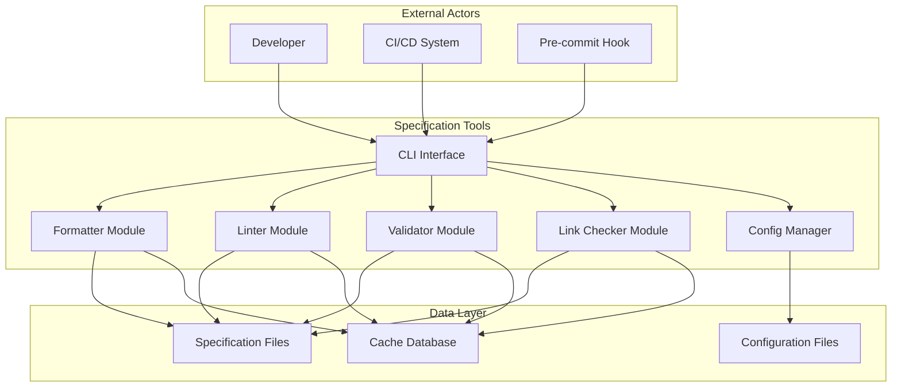
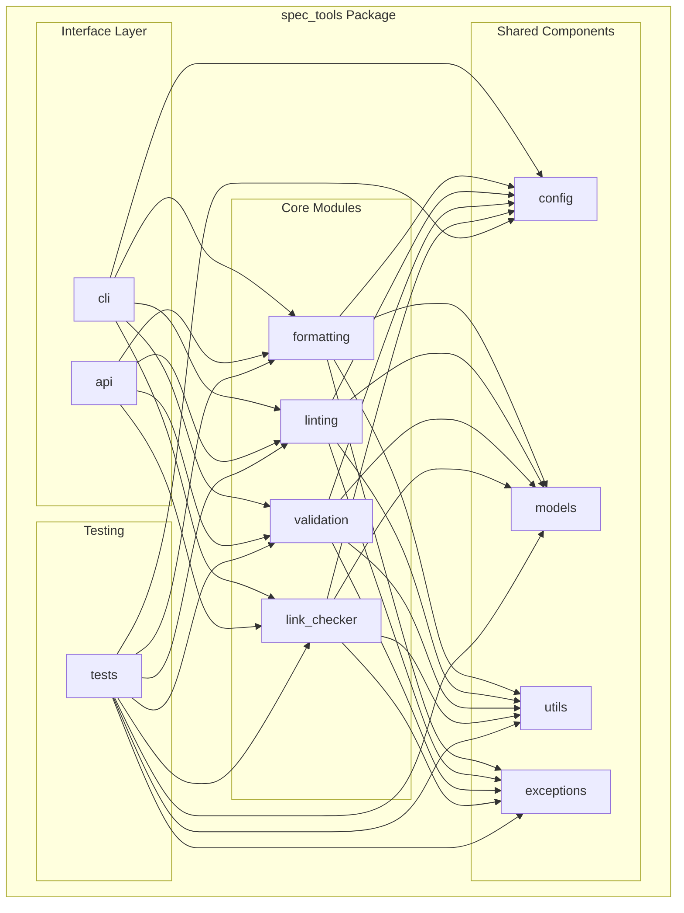
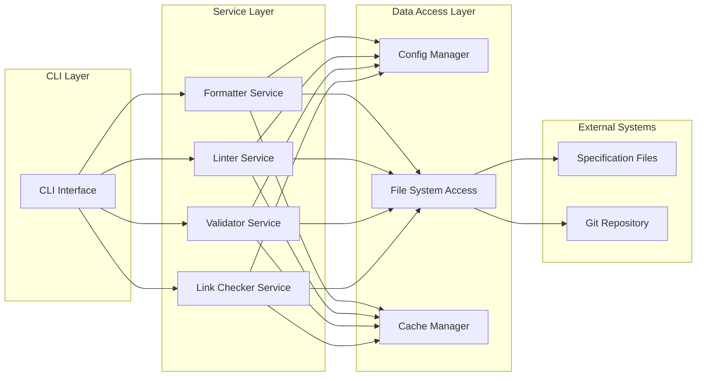
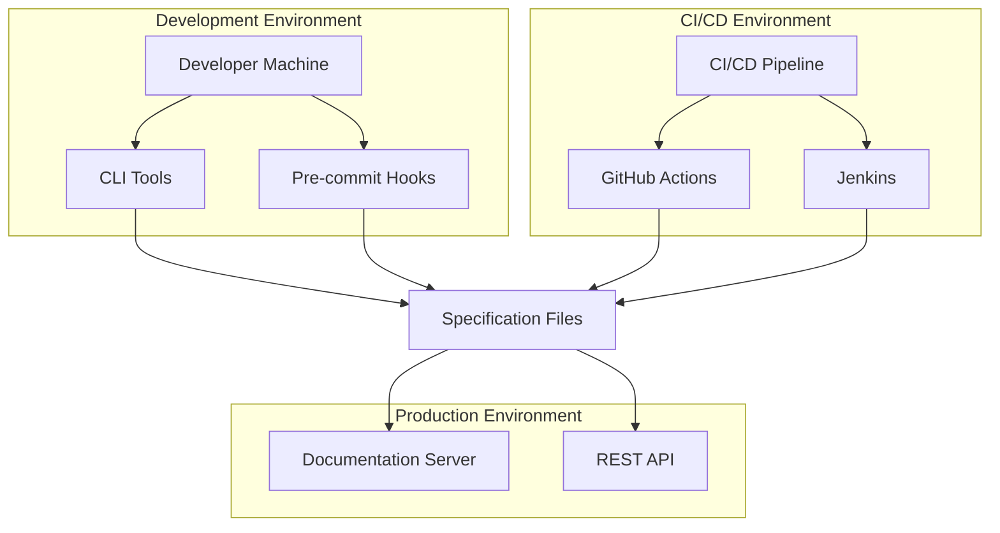
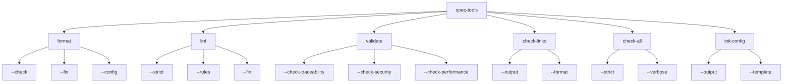

# Specification Convention v3 Refactor Design

* File:** `.specs/specification_convention_v3_refactor/design.md`
* Version:** 1.0.0
* Context:** Layer 1 (Specification Convention)
* Formalism:** Software Architecture Design
* Status:** Draft
* Last Modified:** 2026-01-03
* Author:** Architect
* Reviewers:** TBD

---

## 1. Purpose and Scope

### 1.1 Purpose

This document provides the technical design for refactoring the Morph project's specification convention and associated tooling into an enterprise-grade, production-ready system.

### 1.2 Scope

This design covers:
- Enhanced specification convention document structure
- Modular Python package architecture for scripts
- Integration patterns with CI/CD systems
- Data models and interfaces
- Deployment and configuration strategies

### 1.3 Definitions, Acronyms, and Abbreviations

| Term | Definition |
|------|------------|
| ADR | Architecture Decision Record |
| SOLID | Single Responsibility, Open/Closed, Liskov Substitution, Interface Segregation, Dependency Inversion |
| DRY | Don't Repeat Yourself |
| KISS | Keep It Simple, Stupid |
| YAGNI | You Aren't Gonna Need It |

### 1.4 References

- IEEE 1471: Recommended Practice for Architectural Description of Software-Intensive Systems
- ISO/IEC 19514: Architecture Description Language
- Clean Architecture by Robert C. Martin
- Design Patterns: Elements of Reusable Object-Oriented Software by Gamma et al.

---

## 2. Architecture Overview

### 2.1 System Context



### 2.2 Architectural Views

#### 2.2.1 Module Viewpoint



#### 2.2.2 Component-and-Connector Viewpoint



#### 2.2.3 Allocation Viewpoint



---

## 3. Architecture Decision Records

### 3.1 ADR-001: Modular Package Structure

**Context:** The current scripts directory contains multiple standalone scripts with duplicated code and no clear separation of concerns.

**Decision:** Refactor into a modular Python package with clear separation between formatting, linting, validation, and link checking modules.

**Consequences:**

*Positive:*
- Improved code reusability
- Easier testing and maintenance
- Better separation of concerns
- Enables proper Python packaging and distribution

*Negative:*
- Initial refactoring effort required
- Learning curve for new structure
- Potential breaking changes for existing workflows

**Alternatives Considered:**
1. Keep standalone scripts (rejected: poor maintainability)
2. Monolithic single module (rejected: violates single responsibility principle)
3. Microservices architecture (rejected: overkill for this use case)

### 3.2 ADR-002: Use pyproject.toml for Packaging

**Context:** Need to choose between setup.py, setup.cfg, and pyproject.toml for Python package configuration.

**Decision:** Use pyproject.toml following PEP 621 for declarative configuration.

**Consequences:**

*Positive:*
- Modern, declarative configuration
- Single source of truth for build metadata
- Better tooling support (pip, build, setuptools)
- Future-proof with evolving Python packaging standards

*Negative:*
- Requires Python 3.8+ for full support
- Some older tools may not support it

**Alternatives Considered:**
1. setup.py (rejected: imperative, verbose)
2. setup.cfg (rejected: less expressive than pyproject.toml)

### 3.3 ADR-003: Unified CLI Interface

**Context:** Multiple standalone scripts with different interfaces create usability issues.

**Decision:** Implement a unified CLI interface with subcommands for each module.

**Consequences:**

*Positive:*
- Consistent user experience
- Easier to learn and use
- Centralized configuration management
- Better integration with CI/CD

*Negative:*
- Requires learning new command structure
- Potential breaking changes for existing workflows

**Alternatives Considered:**
1. Keep separate scripts (rejected: inconsistent UX)
2. Multiple entry points (rejected: confusing for users)

### 3.4 ADR-004: Configuration File Support

**Context:** Hard-coded configuration limits flexibility for different projects and use cases.

**Decision:** Implement YAML-based configuration file support with sensible defaults.

**Consequences:**

*Positive:*
- Project-specific customization
- No code changes needed for configuration
- Easy to version control
- Human-readable format

*Negative:*
- Additional complexity in configuration loading
- Potential for configuration errors

**Alternatives Considered:**
1. Hard-coded configuration (rejected: inflexible)
2. Environment variables (rejected: not suitable for complex configuration)
3. JSON configuration (rejected: less readable than YAML)

### 3.5 ADR-005: Type Hints Throughout

**Context:** Python's dynamic typing can lead to runtime errors and reduced code clarity.

**Decision:** Add type hints to all public functions and methods following PEP 484.

**Consequences:**

*Positive:*
- Improved code documentation
- Static type checking with mypy
- Better IDE support
- Fewer runtime errors

*Negative:*
- Additional development overhead
- Slightly more verbose code

**Alternatives Considered:**
1. No type hints (rejected: reduced code quality)
2. Type comments (rejected: outdated approach)

### 3.6 ADR-006: Structured Logging

**Context:** Print statements provide limited debugging capabilities and poor production support.

**Decision:** Implement structured logging with Python's logging module and JSON output option.

**Consequences:**

*Positive:*
- Configurable log levels
- Better debugging in production
- Integration with log aggregation tools
- Consistent log format

*Negative:*
- More complex than print statements
- Requires configuration

**Alternatives Considered:**
1. Print statements (rejected: not production-ready)
2. Third-party logging libraries (rejected: unnecessary complexity)

### 3.7 ADR-007: Comprehensive Test Coverage

**Context:** Current scripts have minimal or no tests, leading to potential regressions.

**Decision:** Implement comprehensive unit and integration tests with minimum 80% code coverage.

**Consequences:**

*Positive:*
- Catch regressions early
- Enable safe refactoring
- Document expected behavior
- Improve code quality

*Negative:*
- Initial development effort
- Ongoing maintenance overhead

**Alternatives Considered:**
1. No tests (rejected: unacceptable for production code)
2. Manual testing only (rejected: not scalable)

---

## 4. Data Models

### 4.1 Core Data Structures

#### 4.1.1 Configuration Model

```python
from dataclasses import dataclass, field
from typing import Optional, List, Dict
from pathlib import Path

@dataclass
class FormattingConfig:
    """Configuration for formatting operations."""
    max_line_length: int = 120
    enforce_trailing_whitespace: bool = True
    normalize_lists: bool = True
    fix_heading_spacing: bool = True
    normalize_emphasis: bool = True

@dataclass
class LintingConfig:
    """Configuration for linting operations."""
    strict: bool = False
    check_ears_pattern: bool = True
    check_math_notation: bool = True
    check_mermaid_syntax: bool = True
    check_cross_references: bool = True

@dataclass
class ValidationConfig:
    """Configuration for validation operations."""
    check_traceability: bool = True
    check_verification_plan: bool = True
    check_risk_assessment: bool = True
    check_security_specs: bool = True
    check_performance_specs: bool = True
    check_maintainability_specs: bool = True

@dataclass
class LinkCheckingConfig:
    """Configuration for link checking operations."""
    check_broken_links: bool = True
    check_orphaned_sections: bool = True
    check_duplicate_links: bool = True
    check_self_references: bool = False

@dataclass
class OutputConfig:
    """Configuration for output formatting."""
    format: str = "text"  # text or json
    verbose: bool = False
    quiet: bool = False
    color_output: bool = True

@dataclass
class Config:
    """Main configuration class."""
    formatting: FormattingConfig = field(default_factory=FormattingConfig)
    linting: LintingConfig = field(default_factory=LintingConfig)
    validation: ValidationConfig = field(default_factory=ValidationConfig)
    link_checking: LinkCheckingConfig = field(default_factory=LinkCheckingConfig)
    output: OutputConfig = field(default_factory=OutputConfig)
    
    @classmethod
    def from_yaml(cls, filepath: Path) -> "Config":
        """Load configuration from YAML file."""
        # Implementation
        pass
    
    def to_yaml(self, filepath: Path) -> None:
        """Save configuration to YAML file."""
        # Implementation
        pass
```

#### 4.1.2 Error Model

```python
from enum import Enum
from dataclasses import dataclass

class Severity(Enum):
    """Error severity levels."""
    ERROR = "ERROR"
    WARNING = "WARNING"
    INFO = "INFO"

@dataclass
class LintError:
    """Represents a linting error or warning."""
    file_path: str
    line_number: int
    column_number: int = 0
    severity: Severity = Severity.ERROR
    rule_id: str = ""
    message: str = ""
    suggestion: Optional[str] = None
    context: Optional[str] = None
    
    def __str__(self) -> str:
        """Format error for display."""
        location = f"{self.file_path}:{self.line_number}"
        if self.column_number > 0:
            location += f":{self.column_number}"
        
        severity_str = f"[{self.severity.value}]"
        result = f"{location} {severity_str} {self.rule_id}: {self.message}"
        
        if self.suggestion:
            result += f"\n  Suggestion: {self.suggestion}"
        
        if self.context:
            result += f"\n  Context: {self.context}"
        
        return result

@dataclass
class ValidationResult:
    """Result of validating a file or directory."""
    file_path: str
    errors: List[LintError] = field(default_factory=list)
    passed: bool = True
    
    @property
    def error_count(self) -> int:
        """Count of ERROR severity issues."""
        return sum(1 for e in self.errors if e.severity == Severity.ERROR)
    
    @property
    def warning_count(self) -> int:
        """Count of WARNING severity issues."""
        return sum(1 for e in self.errors if e.severity == Severity.WARNING)
    
    @property
    def info_count(self) -> int:
        """Count of INFO severity issues."""
        return sum(1 for e in self.errors if e.severity == Severity.INFO)
```

#### 4.1.3 Link Model

```python
from dataclasses import dataclass
from typing import Optional
from pathlib import Path

class LinkType(Enum):
    """Types of links."""
    MARKDOWN = "markdown"
    SECTION = "section"
    FILE = "file"
    EXTERNAL = "external"

@dataclass
class LinkInfo:
    """Information about a single link."""
    text: str
    url: str
    line_number: int
    column_number: int = 0
    file_path: Path = Path()
    link_type: LinkType = LinkType.EXTERNAL
    is_valid: bool = False
    error_message: Optional[str] = None

@dataclass
class LinkReport:
    """Report for link checking results."""
    file_path: Path
    total_links: int = 0
    valid_links: int = 0
    broken_links: List[LinkInfo] = field(default_factory=list)
    orphaned_sections: List[LinkInfo] = field(default_factory=list)
    duplicate_links: List[tuple] = field(default_factory=list)
    self_references: List[LinkInfo] = field(default_factory=list)
```

### 4.2 Interface Definitions

#### 4.2.1 Formatter Interface

```python
from abc import ABC, abstractmethod
from pathlib import Path

class FormatterInterface(ABC):
    """Abstract interface for formatters."""
    
    @abstractmethod
    def format_file(self, filepath: Path) -> bool:
        """
        Format a single file.
        
        Args:
            filepath: Path to the file to format
            
        Returns:
            True if file was modified, False otherwise
        """
        pass
    
    @abstractmethod
    def format_directory(self, directory: Path, recursive: bool = True) -> int:
        """
        Format all files in a directory.
        
        Args:
            directory: Path to the directory
            recursive: Whether to process subdirectories
            
        Returns:
            Number of files modified
        """
        pass
    
    @abstractmethod
    def check_format(self, filepath: Path) -> ValidationResult:
        """
        Check if a file is properly formatted without modifying it.
        
        Args:
            filepath: Path to the file to check
            
        Returns:
            Validation result with any formatting issues
        """
        pass
```

#### 4.2.2 Linter Interface

```python
class LinterInterface(ABC):
    """Abstract interface for linters."""
    
    @abstractmethod
    def lint_file(self, filepath: Path) -> ValidationResult:
        """
        Lint a single file.
        
        Args:
            filepath: Path to the file to lint
            
        Returns:
            Validation result with any linting issues
        """
        pass
    
    @abstractmethod
    def lint_directory(self, directory: Path, recursive: bool = True) -> List[ValidationResult]:
        """
        Lint all files in a directory.
        
        Args:
            directory: Path to the directory
            recursive: Whether to process subdirectories
            
        Returns:
            List of validation results for each file
        """
        pass
    
    @abstractmethod
    def get_rules(self) -> Dict[str, str]:
        """
        Get all available linting rules.
        
        Returns:
            Dictionary mapping rule IDs to descriptions
        """
        pass
```

#### 4.2.3 Validator Interface

```python
class ValidatorInterface(ABC):
    """Abstract interface for validators."""
    
    @abstractmethod
    def validate_file(self, filepath: Path) -> ValidationResult:
        """
        Validate a single file against specification convention.
        
        Args:
            filepath: Path to the file to validate
            
        Returns:
            Validation result with any validation issues
        """
        pass
    
    @abstractmethod
    def validate_directory(self, directory: Path, recursive: bool = True) -> List[ValidationResult]:
        """
        Validate all files in a directory.
        
        Args:
            directory: Path to the directory
            recursive: Whether to process subdirectories
            
        Returns:
            List of validation results for each file
        """
        pass
    
    @abstractmethod
    def check_traceability(self, content: str) -> List[LintError]:
        """
        Check traceability matrix in content.
        
        Args:
            content: File content to check
            
        Returns:
            List of traceability issues
        """
        pass
    
    @abstractmethod
    def check_verification_plan(self, content: str) -> List[LintError]:
        """
        Check verification plan in content.
        
        Args:
            content: File content to check
            
        Returns:
            List of verification plan issues
        """
        pass
```

#### 4.2.4 Link Checker Interface

```python
class LinkCheckerInterface(ABC):
    """Abstract interface for link checkers."""
    
    @abstractmethod
    def check_file(self, filepath: Path) -> LinkReport:
        """
        Check links in a single file.
        
        Args:
            filepath: Path to the file to check
            
        Returns:
            Link report with all link issues
        """
        pass
    
    @abstractmethod
    def check_directory(self, directory: Path, recursive: bool = True) -> LinkReport:
        """
        Check links in all files in a directory.
        
        Args:
            directory: Path to the directory
            recursive: Whether to process subdirectories
            
        Returns:
            Aggregated link report
        """
        pass
    
    @abstractmethod
    def validate_link(self, link: LinkInfo) -> bool:
        """
        Validate a single link.
        
        Args:
            link: Link information to validate
            
        Returns:
            True if link is valid, False otherwise
        """
        pass
```

---

## 5. Module Design

### 5.1 Formatting Module

#### 5.1.1 Module Structure

```
spec_tools/formatting/
├── __init__.py
├── formatter.py          # Main formatter class
├── rules/
│   ├── __init__.py
│   ├── line_length.py    # Line length enforcement
│   ├── whitespace.py     # Whitespace normalization
│   ├── headings.py       # Heading formatting
│   ├── lists.py          # List normalization
│   ├── emphasis.py       # Emphasis normalization
│   └── code_blocks.py   # Code block formatting
└── utils/
    ├── __init__.py
    └── markdown_parser.py # Markdown parsing utilities
```

#### 5.1.2 Formatter Class Design

```python
from typing import List
from pathlib import Path

class MarkdownFormatter(FormatterInterface):
    """Formats markdown files according to specification convention."""
    
    def __init__(self, config: FormattingConfig):
        """
        Initialize formatter.
        
        Args:
            config: Formatting configuration
        """
        self.config = config
        self.rules: List[FormattingRule] = self._load_rules()
    
    def _load_rules(self) -> List[FormattingRule]:
        """Load all formatting rules."""
        return [
            LineLengthRule(self.config.max_line_length),
            TrailingWhitespaceRule(self.config.enforce_trailing_whitespace),
            HeadingSpacingRule(self.config.fix_heading_spacing),
            ListNormalizationRule(self.config.normalize_lists),
            EmphasisNormalizationRule(self.config.normalize_emphasis),
        ]
    
    def format_file(self, filepath: Path) -> bool:
        """Format a single file."""
        content = filepath.read_text(encoding='utf-8')
        original_content = content
        
        for rule in self.rules:
            content = rule.apply(content)
        
        if content != original_content:
            filepath.write_text(content, encoding='utf-8')
            return True
        
        return False
    
    def format_directory(self, directory: Path, recursive: bool = True) -> int:
        """Format all files in a directory."""
        pattern = '**/*.md' if recursive else '*.md'
        files = list(directory.glob(pattern))
        
        modified_count = 0
        for filepath in files:
            if self.format_file(filepath):
                modified_count += 1
        
        return modified_count
    
    def check_format(self, filepath: Path) -> ValidationResult:
        """Check if a file is properly formatted."""
        content = filepath.read_text(encoding='utf-8')
        errors = []
        
        for rule in self.rules:
            rule_errors = rule.check(content, filepath)
            errors.extend(rule_errors)
        
        return ValidationResult(
            file_path=str(filepath),
            errors=errors,
            passed=len(errors) == 0
        )
```

#### 5.1.3 Formatting Rule Interface

```python
from abc import ABC, abstractmethod

class FormattingRule(ABC):
    """Abstract base class for formatting rules."""
    
    @abstractmethod
    def apply(self, content: str) -> str:
        """
        Apply formatting rule to content.
        
        Args:
            content: Content to format
            
        Returns:
            Formatted content
        """
        pass
    
    @abstractmethod
    def check(self, content: str, filepath: Path) -> List[LintError]:
        """
        Check if content complies with this rule.
        
        Args:
            content: Content to check
            filepath: File path for error reporting
            
        Returns:
            List of formatting violations
        """
        pass
```

### 5.2 Linting Module

#### 5.2.1 Module Structure

```
spec_tools/linting/
├── __init__.py
├── linter.py            # Main linter class
├── rules/
│   ├── __init__.py
│   ├── header.py        # Header validation
│   ├── sections.py      # Section structure validation
│   ├── requirements.py  # EARS pattern validation
│   ├── math.py         # Mathematical notation validation
│   ├── mermaid.py      # Mermaid diagram validation
│   ├── cross_refs.py   # Cross-reference validation
│   └── change_log.py   # Change log validation
└── utils/
    ├── __init__.py
    ├── ears_parser.py   # EARS pattern parser
    └── latex_parser.py # LaTeX syntax parser
```

#### 5.2.2 Linter Class Design

```python
from typing import List, Dict

class SpecLinter(LinterInterface):
    """Lints specification files against convention."""
    
    def __init__(self, config: LintingConfig):
        """
        Initialize linter.
        
        Args:
            config: Linting configuration
        """
        self.config = config
        self.rules: Dict[str, LintingRule] = self._load_rules()
    
    def _load_rules(self) -> Dict[str, LintingRule]:
        """Load all linting rules."""
        rules = {}
        
        if self.config.check_ears_pattern:
            rules['ears'] = EARSRule()
        
        if self.config.check_math_notation:
            rules['math'] = MathNotationRule()
        
        if self.config.check_mermaid_syntax:
            rules['mermaid'] = MermaidSyntaxRule()
        
        if self.config.check_cross_references:
            rules['cross_refs'] = CrossReferenceRule()
        
        return rules
    
    def lint_file(self, filepath: Path) -> ValidationResult:
        """Lint a single file."""
        content = filepath.read_text(encoding='utf-8')
        lines = content.split('\n')
        errors = []
        
        # Run all rules
        for rule_name, rule in self.rules.items():
            rule_errors = rule.check(content, lines, filepath)
            errors.extend(rule_errors)
        
        return ValidationResult(
            file_path=str(filepath),
            errors=errors,
            passed=all(e.severity != Severity.ERROR for e in errors)
        )
    
    def lint_directory(self, directory: Path, recursive: bool = True) -> List[ValidationResult]:
        """Lint all files in a directory."""
        pattern = '**/*.md' if recursive else '*.md'
        files = list(directory.glob(pattern))
        
        results = []
        for filepath in files:
            result = self.lint_file(filepath)
            results.append(result)
        
        return results
    
    def get_rules(self) -> Dict[str, str]:
        """Get all available linting rules."""
        return {
            name: rule.description
            for name, rule in self.rules.items()
        }
```

### 5.3 Validation Module

#### 5.3.1 Module Structure

```
spec_tools/validation/
├── __init__.py
├── validator.py        # Main validator class
├── checks/
│   ├── __init__.py
│   ├── traceability.py      # Traceability matrix validation
│   ├── verification.py      # Verification plan validation
│   ├── risk_assessment.py   # Risk assessment validation
│   ├── security.py          # Security specification validation
│   ├── performance.py       # Performance specification validation
│   └── maintainability.py  # Maintainability specification validation
└── utils/
    ├── __init__.py
    └── section_extractor.py # Section extraction utilities
```

#### 5.3.2 Validator Class Design

```python
class SpecValidator(ValidatorInterface):
    """Validates specification files against enhanced convention."""
    
    def __init__(self, config: ValidationConfig):
        """
        Initialize validator.
        
        Args:
            config: Validation configuration
        """
        self.config = config
        self.checks: List[ValidationCheck] = self._load_checks()
    
    def _load_checks(self) -> List[ValidationCheck]:
        """Load all validation checks."""
        checks = []
        
        if self.config.check_traceability:
            checks.append(TraceabilityCheck())
        
        if self.config.check_verification_plan:
            checks.append(VerificationPlanCheck())
        
        if self.config.check_risk_assessment:
            checks.append(RiskAssessmentCheck())
        
        if self.config.check_security_specs:
            checks.append(SecuritySpecCheck())
        
        if self.config.check_performance_specs:
            checks.append(PerformanceSpecCheck())
        
        if self.config.check_maintainability_specs:
            checks.append(MaintainabilitySpecCheck())
        
        return checks
    
    def validate_file(self, filepath: Path) -> ValidationResult:
        """Validate a single file."""
        content = filepath.read_text(encoding='utf-8')
        errors = []
        
        # Run all checks
        for check in self.checks:
            check_errors = check.validate(content, filepath)
            errors.extend(check_errors)
        
        return ValidationResult(
            file_path=str(filepath),
            errors=errors,
            passed=all(e.severity != Severity.ERROR for e in errors)
        )
    
    def validate_directory(self, directory: Path, recursive: bool = True) -> List[ValidationResult]:
        """Validate all files in a directory."""
        pattern = '**/*.md' if recursive else '*.md'
        files = list(directory.glob(pattern))
        
        results = []
        for filepath in files:
            result = self.validate_file(filepath)
            results.append(result)
        
        return results
    
    def check_traceability(self, content: str) -> List[LintError]:
        """Check traceability matrix in content."""
        traceability_check = TraceabilityCheck()
        return traceability_check.validate(content)
    
    def check_verification_plan(self, content: str) -> List[LintError]:
        """Check verification plan in content."""
        verification_check = VerificationPlanCheck()
        return verification_check.validate(content)
```

### 5.4 Link Checker Module

#### 5.4.1 Module Structure

```
spec_tools/link_checker/
├── __init__.py
├── checker.py          # Main link checker class
├── parsers/
│   ├── __init__.py
│   ├── markdown_link.py    # Markdown link parser
│   ├── section_ref.py      # Section reference parser
│   └── file_ref.py        # File reference parser
├── validators/
│   ├── __init__.py
│   ├── file_exists.py      # File existence validator
│   ├── section_exists.py   # Section existence validator
│   └── external_link.py    # External link validator
└── cache/
    ├── __init__.py
    └── link_cache.py      # Link validation cache
```

#### 5.4.2 Link Checker Class Design

```python
from typing import Dict, Set

class SpecLinkChecker(LinkCheckerInterface):
    """Checks links in specification files."""
    
    def __init__(self, config: LinkCheckingConfig):
        """
        Initialize link checker.
        
        Args:
            config: Link checking configuration
        """
        self.config = config
        self.section_cache: Dict[Path, Set[str]] = {}
        self.link_cache = LinkCache()
    
    def check_file(self, filepath: Path) -> LinkReport:
        """Check links in a single file."""
        content = filepath.read_text(encoding='utf-8')
        lines = content.split('\n')
        
        # Extract sections for validation
        sections = self._extract_sections(content)
        self.section_cache[filepath] = sections
        
        # Find all links
        links = self._find_links(content, lines, filepath)
        
        # Validate each link
        report = LinkReport(file_path=filepath, total_links=len(links))
        
        for link in links:
            is_valid = self.validate_link(link)
            link.is_valid = is_valid
            
            if is_valid:
                report.valid_links += 1
            else:
                if 'section' in (link.error_message or '').lower():
                    report.orphaned_sections.append(link)
                else:
                    report.broken_links.append(link)
        
        return report
    
    def check_directory(self, directory: Path, recursive: bool = True) -> LinkReport:
        """Check links in all files in a directory."""
        pattern = '**/*.md' if recursive else '*.md'
        files = list(directory.glob(pattern))
        
        aggregated_report = LinkReport(file_path=directory)
        
        for filepath in files:
            file_report = self.check_file(filepath)
            aggregated_report.total_links += file_report.total_links
            aggregated_report.valid_links += file_report.valid_links
            aggregated_report.broken_links.extend(file_report.broken_links)
            aggregated_report.orphaned_sections.extend(file_report.orphaned_sections)
        
        return aggregated_report
    
    def validate_link(self, link: LinkInfo) -> bool:
        """Validate a single link."""
        # Check cache first
        cached_result = self.link_cache.get(link.url)
        if cached_result is not None:
            return cached_result
        
        # Validate link
        is_valid = self._validate_link_internal(link)
        
        # Cache result
        self.link_cache.set(link.url, is_valid)
        
        return is_valid
    
    def _validate_link_internal(self, link: LinkInfo) -> bool:
        """Internal link validation logic."""
        if link.link_type == LinkType.EXTERNAL:
            return True  # Skip external links
        
        if link.link_type == LinkType.SECTION:
            return self._validate_section_reference(link)
        
        if link.link_type in [LinkType.MARKDOWN, LinkType.FILE]:
            return self._validate_file_reference(link)
        
        return False
```

---

## 6. CLI Interface Design

### 6.1 Command Structure



### 6.2 CLI Implementation

```python
import argparse
from pathlib import Path

def create_parser() -> argparse.ArgumentParser:
    """Create main CLI argument parser."""
    parser = argparse.ArgumentParser(
        prog='spec-tools',
        description='Specification tools for Morph project',
        formatter_class=argparse.RawDescriptionHelpFormatter
    )
    
    subparsers = parser.add_subparsers(dest='command', help='Available commands')
    
    # Format command
    format_parser = subparsers.add_parser('format', help='Format specification files')
    format_parser.add_argument('path', help='File or directory to format')
    format_parser.add_argument('--check', action='store_true', help='Check without modifying')
    format_parser.add_argument('--config', help='Configuration file')
    
    # Lint command
    lint_parser = subparsers.add_parser('lint', help='Lint specification files')
    lint_parser.add_argument('path', help='File or directory to lint')
    lint_parser.add_argument('--strict', action='store_true', help='Treat warnings as errors')
    lint_parser.add_argument('--rules', help='Comma-separated list of rules to run')
    lint_parser.add_argument('--fix', action='store_true', help='Auto-fix issues')
    
    # Validate command
    validate_parser = subparsers.add_parser('validate', help='Validate specification files')
    validate_parser.add_argument('path', help='File or directory to validate')
    validate_parser.add_argument('--check-traceability', action='store_true')
    validate_parser.add_argument('--check-security', action='store_true')
    validate_parser.add_argument('--check-performance', action='store_true')
    
    # Check-links command
    links_parser = subparsers.add_parser('check-links', help='Check links in specification files')
    links_parser.add_argument('path', help='File or directory to check')
    links_parser.add_argument('--output', help='Output file')
    links_parser.add_argument('--format', choices=['text', 'json'], default='text')
    
    # Check-all command
    check_all_parser = subparsers.add_parser('check-all', help='Run all checks')
    check_all_parser.add_argument('path', help='File or directory to check')
    check_all_parser.add_argument('--strict', action='store_true')
    check_all_parser.add_argument('--verbose', action='store_true')
    
    # Init-config command
    init_parser = subparsers.add_parser('init-config', help='Initialize configuration file')
    init_parser.add_argument('--output', default='.spec-tools.yaml', help='Output file')
    init_parser.add_argument('--template', choices=['minimal', 'full'], default='full')
    
    return parser

def main():
    """Main entry point."""
    parser = create_parser()
    args = parser.parse_args()
    
    if not args.command:
        parser.print_help()
        return
    
    # Load configuration
    config = Config.from_yaml(args.config) if hasattr(args, 'config') and args.config else Config()
    
    # Execute command
    if args.command == 'format':
        run_format_command(args, config)
    elif args.command == 'lint':
        run_lint_command(args, config)
    elif args.command == 'validate':
        run_validate_command(args, config)
    elif args.command == 'check-links':
        run_check_links_command(args, config)
    elif args.command == 'check-all':
        run_check_all_command(args, config)
    elif args.command == 'init-config':
        run_init_config_command(args)
```

---

## 7. CI/CD Integration

### 7.1 GitHub Actions Workflow

```yaml
# .github/workflows/spec-validation.yml
name: Specification Validation

on:
  push:
    branches: [main, develop]
    paths:
      - 'spec/**'
      - 'docs/conventions/**'
  pull_request:
    branches: [main, develop]
    paths:
      - 'spec/**'
      - 'docs/conventions/**'

jobs:
  validate:
    runs-on: ubuntu-latest
    steps:
      - uses: actions/checkout@v3
      
      - name: Set up Python
        uses: actions/setup-python@v4
        with:
          python-version: '3.11'
      
      - name: Install spec-tools
        run: |
          pip install -e scripts/
      
      - name: Format check
        run: |
          spec-tools format spec/ --check
      
      - name: Lint specifications
        run: |
          spec-tools lint spec/ --strict
      
      - name: Validate specifications
        run: |
          spec-tools validate spec/ --check-traceability --check-security
      
      - name: Check links
        run: |
          spec-tools check-links spec/ --output link-report.json
      
      - name: Upload reports
        uses: actions/upload-artifact@v3
        with:
          name: validation-reports
          path: |
            link-report.json
```

### 7.2 Pre-commit Hook

```yaml
# .pre-commit-config.yaml
repos:
  - repo: local
    hooks:
      - id: spec-format
        name: Format specifications
        entry: spec-tools format
        language: system
        files: \.md$
        pass_filenames: true
      
      - id: spec-lint
        name: Lint specifications
        entry: spec-tools lint
        language: system
        files: \.md$
        pass_filenames: true
      
      - id: spec-validate
        name: Validate specifications
        entry: spec-tools validate
        language: system
        files: \.md$
        pass_filenames: true
```

---

## 8. Testing Strategy

### 8.1 Test Structure

```
tests/
├── __init__.py
├── conftest.py              # Pytest configuration and fixtures
├── test_formatting/
│   ├── __init__.py
│   ├── test_formatter.py
│   ├── test_line_length.py
│   ├── test_whitespace.py
│   └── test_headings.py
├── test_linting/
│   ├── __init__.py
│   ├── test_linter.py
│   ├── test_ears_pattern.py
│   ├── test_math_notation.py
│   └── test_mermaid_syntax.py
├── test_validation/
│   ├── __init__.py
│   ├── test_validator.py
│   ├── test_traceability.py
│   └── test_security_specs.py
├── test_link_checker/
│   ├── __init__.py
│   ├── test_checker.py
│   └── test_link_validation.py
├── test_cli/
│   ├── __init__.py
│   └── test_commands.py
└── fixtures/
    ├── valid_spec.md
    ├── invalid_spec.md
    └── sample_config.yaml
```

### 8.2 Test Coverage Requirements

```python
# pytest.ini
[pytest]
testpaths = tests
python_files = test_*.py
python_classes = Test*
python_functions = test_*
addopts =
    --cov=spec_tools
    --cov-report=html
    --cov-report=term-missing
    --cov-fail-under=80
    -v
```

---

## 9. Deployment Strategy

### 9.1 Package Distribution

```toml
# scripts/pyproject.toml
[build-system]
requires = ["setuptools>=61.0", "wheel"]
build-backend = "setuptools.build_meta"

[project]
name = "spec-tools"
version = "1.0.0"
description = "Specification tools for Morph project"
readme = "README.md"
requires-python = ">=3.8"
license = {text = "MIT"}
authors = [
    {name = "Morph Project", email = "dev@morph.dev"}
]
keywords = ["specification", "markdown", "linting", "validation"]
classifiers = [
    "Development Status :: 4 - Beta",
    "Intended Audience :: Developers",
    "License :: OSI Approved :: MIT License",
    "Programming Language :: Python :: 3",
    "Programming Language :: Python :: 3.8",
    "Programming Language :: Python :: 3.9",
    "Programming Language :: Python :: 3.10",
    "Programming Language :: Python :: 3.11",
]

dependencies = [
    "pyyaml>=6.0",
    "click>=8.0",
    "rich>=12.0",
]

[project.optional-dependencies]
dev = [
    "pytest>=7.0",
    "pytest-cov>=4.0",
    "black>=22.0",
    "mypy>=0.991",
    "ruff>=0.0.200",
]

[project.scripts]
spec-tools = "spec_tools.cli:main"

[project.urls]
Homepage = "https://github.com/morph/spec-tools"
Documentation = "https://morph.dev/spec-tools"
Repository = "https://github.com/morph/spec-tools"
Issues = "https://github.com/morph/spec-tools/issues"

[tool.setuptools.packages.find]
where = ["."]
include = ["spec_tools*"]

[tool.black]
line-length = 120
target-version = ['py38']

[tool.mypy]
python_version = "3.8"
warn_return_any = true
warn_unused_configs = true
disallow_untyped_defs = true

[tool.ruff]
line-length = 120
select = ["E", "F", "W", "I", "N", "UP"]
ignore = ["E501"]
```

---

## Change Log

| Version | Date | Author | Changes |
|---------|------|--------|---------|
| 1.0.0 | 2026-01-03 | Architect | Initial version |
