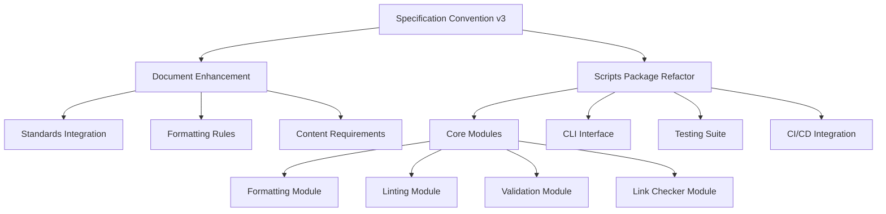
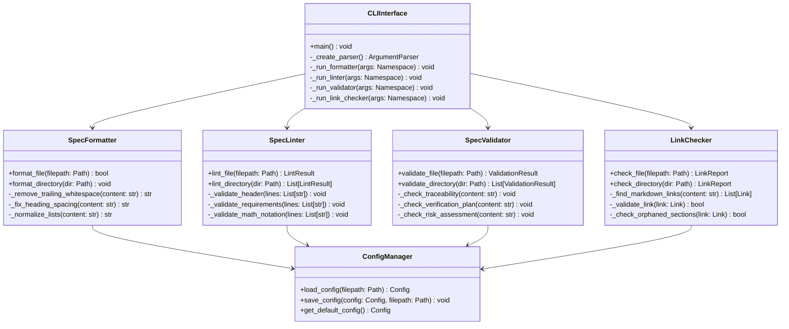
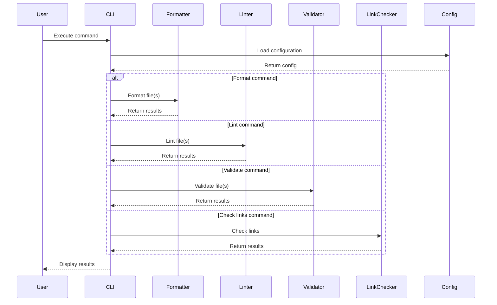

# Specification Convention v3 Refactor Requirements

* File:** `.specs/specification_convention_v3_refactor/requirements.md`
* Version:** 1.0.0
* Context:** Layer 1 (Specification Convention)
* Formalism:** Requirements Engineering (EARS Pattern)
* Status:** Draft
* Last Modified:** 2026-01-03
* Author:** Architect
* Reviewers:** TBD

---

## 1. Purpose and Scope

### 1.1 Purpose

This document defines the requirements for refactoring the Morph project's specification convention and associated tooling to achieve enterprise-grade quality, compliance with additional international standards, and production-ready automation.

### 1.2 Scope

This refactoring encompasses:
- Enhancement of the specification convention document ([`docs/conventions/specification_convention.md`](docs/conventions/specification_convention.md))
- Complete restructuring of the scripts directory into a modular Python package
- Implementation of comprehensive validation, formatting, and linting capabilities
- Integration with CI/CD pipelines
- Addition of security, performance, and maintainability specification requirements

### 1.3 Definitions, Acronyms, and Abbreviations

| Term | Definition |
|------|------------|
| EARS | Easy Approach to Requirements Syntax |
| ADR | Architecture Decision Record |
| STRIDE | Spoofing, Tampering, Repudiation, Information Disclosure, Denial of Service, Elevation of Privilege |
| BPMN | Business Process Model and Notation |
| CMMI | Capability Maturity Model Integration |
| SemVer | Semantic Versioning |
| PEP | Python Enhancement Proposal |
| CI/CD | Continuous Integration/Continuous Deployment |

### 1.4 References

- IEEE 830: Recommended Practice for Software Requirements Specifications
- IEEE 730: Standard for Software Quality Assurance Plans
- IEEE 829: Standard for Software Test Documentation
- IEEE 1016: Recommended Practice for Software Design Descriptions
- IEEE 1471: Recommended Practice for Architectural Description of Software-Intensive Systems
- ISO/IEC 29148: Systems and software engineering — Life cycle processes — Requirements engineering
- ISO/IEC 12207: Systems and software engineering — Software life cycle processes
- ISO/IEC 26514: Systems and software engineering — Requirements for designers and developers of user documentation
- ISO/IEC 15939: Systems and software engineering — Measurement process
- ISO/IEC 25010: Systems and software Quality Requirements and Evaluation (SQuaRE) — Quality model
- ISO/IEC 25012: Data Quality model
- ISO/IEC 15288: Systems and software engineering — System life cycle processes
- ISO/IEC 19514: Architecture Description Language
- ISO/IEC 19510: Business Process Model and Notation (BPMN)
- ISO/IEC 24765: Systems and Software Engineering Vocabulary
- DO-178C: Software Considerations in Airborne Systems and Equipment Certification
- IEC 61508: Functional Safety of E/E/PE Safety-related Systems

---

## 2. Formal Definitions

### 2.1 Specification Convention Document

Let $S$ be the specification convention document where:

$$
S = (H, C, F, R, A, T)
$$

Where:
- $H \in \mathcal{H}$: Document header metadata
- $C \in \mathcal{C}$: Content sections
- $F \in \mathcal{F}$: Formatting rules
- $R \in \mathcal{R}$: Requirements specification patterns
- $A \in \mathcal{A}$: Applicable standards
- $T \in \mathcal{T}$: Tooling requirements

### 2.2 Scripts Package Structure

Let $P$ be the scripts package where:

$$
P = (M, I, C, T, D)
$$

Where:
- $M \subseteq \mathcal{M}$: Modules (formatting, linting, validation, link checking)
- $I \in \mathcal{I}$: Interface definitions
- $C \in \mathcal{C}$: Configuration management
- $T \in \mathcal{T}$: Test suites
- $D \in \mathcal{D}$: Documentation

### 2.3 Quality Metrics

Let $Q$ be the set of quality metrics where:

$$
Q = \{q_1, q_2, \dots, q_n\}
$$

Each metric $q_i$ has:
- $q_i.name$: Metric name
- $q_i.formula$: Calculation formula
- $q_i.target$: Target value
- $q_i.threshold$: Warning threshold

---

## 3. Requirements

### 3.1 Specification Convention Document Requirements

#### 3.1.1 Document Structure Requirements

**CONV-REQ-001:** THE specification convention document SHALL include all mandatory sections defined in IEEE 830 and ISO/IEC 29148.

* **Priority:** Critical
* **Verification Method:** Inspection
* **Rationale:** Ensures compliance with international standards for requirements specification
* **Dependencies:** None
* **Traceability:** Section 2.1 (Specification Convention Document)

**CONV-REQ-002:** THE specification convention document SHALL fix all formatting issues, including horizontal rules using "---" instead of "- -".

* **Priority:** High
* **Verification Method:** Test
* **Rationale:** Ensures consistent markdown rendering across all platforms
* **Dependencies:** CONV-REQ-001
* **Traceability:** Section 3.1.2 (Formatting Requirements)

**CONV-REQ-003:** THE specification convention document SHALL incorporate all additional standards listed in the scope (IEEE 730, IEEE 829, ISO/IEC 25012, ISO/IEC 15288, ISO/IEC 19514, ISO/IEC 19510, ISO/IEC 24765, CMMI, DO-178C, IEC 61508).

* **Priority:** Critical
* **Verification Method:** Inspection
* **Rationale:** Expands compliance coverage to quality assurance, testing, systems engineering, and safety-critical domains
* **Dependencies:** CONV-REQ-001
* **Traceability:** Section 1.4 (References)

#### 3.1.2 Formatting Requirements

**CONV-REQ-004:** THE specification convention document SHALL define precise formatting rules for all markdown elements with no ambiguity.

* **Priority:** High
* **Verification Method:** Test
* **Rationale:** Enables automated validation and consistent document generation
* **Dependencies:** CONV-REQ-001
* **Traceability:** Section 3.1.2 (Formatting Requirements)

**CONV-REQ-005:** THE specification convention document SHALL specify exact spacing rules for headings, lists, code blocks, and paragraphs.

* **Priority:** High
* **Verification Method:** Test
* **Rationale:** Prevents formatting inconsistencies that affect readability
* **Dependencies:** CONV-REQ-004
* **Traceability:** Section 3.1.2 (Formatting Requirements)

**CONV-REQ-006:** THE specification convention document SHALL define line length limits with clear exceptions for code blocks and URLs.

* **Priority:** Medium
* **Verification Method:** Test
* **Rationale:** Ensures documents are readable across different display sizes
* **Dependencies:** CONV-REQ-004
* **Traceability:** Section 3.1.2 (Formatting Requirements)

#### 3.1.3 Content Requirements

**CONV-REQ-007:** THE specification convention document SHALL add requirements for traceability matrices linking requirements to design, implementation, and test cases.

* **Priority:** Critical
* **Verification Method:** Inspection
* **Rationale:** Enables end-to-end traceability required by ISO/IEC 29148 and DO-178C
* **Dependencies:** CONV-REQ-001
* **Traceability:** Section 3.1.3 (Content Requirements)

**CONV-REQ-008:** THE specification convention document SHALL add requirements for verification and validation plans including methods, criteria, and acceptance criteria.

* **Priority:** Critical
* **Verification Method:** Inspection
* **Rationale:** Ensures systematic verification as required by IEEE 829 and ISO/IEC 12207
* **Dependencies:** CONV-REQ-001
* **Traceability:** Section 3.1.3 (Content Requirements)

**CONV-REQ-009:** THE specification convention document SHALL add requirements for risk assessment documentation including identification, analysis, and mitigation strategies.

* **Priority:** High
* **Verification Method:** Inspection
* **Rationale:** Supports risk management as required by IEC 61508 and CMMI
* **Dependencies:** CONV-REQ-001
* **Traceability:** Section 3.1.3 (Content Requirements)

**CONV-REQ-010:** THE specification convention document SHALL add requirements for security specifications including STRIDE threat modeling and security controls.

* **Priority:** Critical
* **Verification Method:** Inspection
* **Rationale:** Addresses security requirements as specified in ISO/IEC 25010 and IEC 61508
* **Dependencies:** CONV-REQ-001
* **Traceability:** Section 3.1.3 (Content Requirements)

**CONV-REQ-011:** THE specification convention document SHALL add requirements for performance specifications including metrics, targets, and measurement methods.

* **Priority:** High
* **Verification Method:** Inspection
* **Rationale:** Ensures performance requirements are measurable as required by ISO/IEC 25010
* **Dependencies:** CONV-REQ-001
* **Traceability:** Section 3.1.3 (Content Requirements)

**CONV-REQ-012:** THE specification convention document SHALL add requirements for maintainability specifications including code quality metrics, documentation standards, and evolution strategies.

* **Priority:** High
* **Verification Method:** Inspection
* **Rationale:** Supports long-term maintainability as required by ISO/IEC 25010 and CMMI
* **Dependencies:** CONV-REQ-001
* **Traceability:** Section 3.1.3 (Content Requirements)

### 3.2 Scripts Package Requirements

#### 3.2.1 Package Structure Requirements

**SCR-REQ-001:** THE scripts directory SHALL be refactored into a modular Python package with proper package structure.

* **Priority:** Critical
* **Verification Method:** Test
* **Rationale:** Enables proper Python packaging, distribution, and maintainability
* **Dependencies:** None
* **Traceability:** Section 2.2 (Scripts Package Structure)

**SCR-REQ-002:** THE scripts package SHALL separate concerns into distinct modules: formatting, linting, validation, and link checking.

* **Priority:** Critical
* **Verification Method:** Inspection
* **Rationale:** Follows single responsibility principle and enables independent testing
* **Dependencies:** SCR-REQ-001
* **Traceability:** Section 2.2 (Scripts Package Structure)

**SCR-REQ-003:** THE scripts package SHALL use proper Python packaging with pyproject.toml following PEP 621.

* **Priority:** Critical
* **Verification Method:** Test
* **Rationale:** Modern Python packaging standard with declarative configuration
* **Dependencies:** SCR-REQ-001
* **Traceability:** Section 3.2.1 (Package Structure Requirements)

**SCR-REQ-004:** THE scripts package SHALL implement proper dependency management with explicit version constraints.

* **Priority:** High
* **Verification Method:** Test
* **Rationale:** Ensures reproducible builds and prevents dependency conflicts
* **Dependencies:** SCR-REQ-003
* **Traceability:** Section 3.2.1 (Package Structure Requirements)

#### 3.2.2 Code Quality Requirements

**SCR-REQ-005:** THE scripts package SHALL include type hints for all public functions and methods following PEP 484.

* **Priority:** High
* **Verification Method:** Test
* **Rationale:** Enables static type checking and improves code documentation
* **Dependencies:** SCR-REQ-001
* **Traceability:** Section 3.2.2 (Code Quality Requirements)

**SCR-REQ-006:** THE scripts package SHALL follow PEP 8 style guidelines with automated enforcement.

* **Priority:** High
* **Verification Method:** Test
* **Rationale:** Ensures consistent code style across the codebase
* **Dependencies:** SCR-REQ-001
* **Traceability:** Section 3.2.2 (Code Quality Requirements)

**SCR-REQ-007:** THE scripts package SHALL include comprehensive docstrings for all modules, classes, and functions following PEP 257.

* **Priority:** High
* **Verification Method:** Inspection
* **Rationale:** Provides clear documentation for API users
* **Dependencies:** SCR-REQ-001
* **Traceability:** Section 3.2.2 (Code Quality Requirements)

**SCR-REQ-008:** THE scripts package SHALL implement proper error handling with custom exception classes and informative error messages.

* **Priority:** High
* **Verification Method:** Test
* **Rationale:** Improves debugging and user experience
* **Dependencies:** SCR-REQ-001
* **Traceability:** Section 3.2.2 (Code Quality Requirements)

**SCR-REQ-009:** THE scripts package SHALL implement structured logging with configurable log levels and output formats.

* **Priority:** High
* **Verification Method:** Test
* **Rationale:** Enables debugging and monitoring in production environments
* **Dependencies:** SCR-REQ-001
* **Traceability:** Section 3.2.2 (Code Quality Requirements)

#### 3.2.3 Testing Requirements

**SCR-REQ-010:** THE scripts package SHALL include unit tests for all modules with minimum 80% code coverage.

* **Priority:** Critical
* **Verification Method:** Test
* **Rationale:** Ensures code correctness and enables safe refactoring
* **Dependencies:** SCR-REQ-001
* **Traceability:** Section 3.2.3 (Testing Requirements)

**SCR-REQ-011:** THE scripts package SHALL include integration tests for end-to-end workflows.

* **Priority:** High
* **Verification Method:** Test
* **Rationale:** Validates that components work together correctly
* **Dependencies:** SCR-REQ-010
* **Traceability:** Section 3.2.3 (Testing Requirements)

**SCR-REQ-012:** THE scripts package SHALL include test fixtures and mocks for external dependencies.

* **Priority:** Medium
* **Verification Method:** Test
* **Rationale:** Enables isolated unit testing
* **Dependencies:** SCR-REQ-010
* **Traceability:** Section 3.2.3 (Testing Requirements)

#### 3.2.4 CLI Interface Requirements

**SCR-REQ-013:** THE scripts package SHALL provide a unified CLI interface with subcommands for each module.

* **Priority:** Critical
* **Verification Method:** Test
* **Rationale:** Provides consistent user experience across all tools
* **Dependencies:** SCR-REQ-001
* **Traceability:** Section 3.2.4 (CLI Interface Requirements)

**SCR-REQ-014:** THE scripts package SHALL support configuration files for customizing tool behavior.

* **Priority:** High
* **Verification Method:** Test
* **Rationale:** Enables project-specific customization without code changes
* **Dependencies:** SCR-REQ-013
* **Traceability:** Section 3.2.4 (CLI Interface Requirements)

**SCR-REQ-015:** THE scripts package SHALL provide comprehensive help documentation and usage examples.

* **Priority:** High
* **Verification Method:** Inspection
* **Rationale:** Improves usability and reduces learning curve
* **Dependencies:** SCR-REQ-013
* **Traceability:** Section 3.2.4 (CLI Interface Requirements)

#### 3.2.5 CI/CD Integration Requirements

**SCR-REQ-016:** THE scripts package SHALL integrate with CI/CD pipelines for automated validation.

* **Priority:** Critical
* **Verification Method:** Test
* **Rationale:** Ensures continuous quality enforcement
* **Dependencies:** SCR-REQ-001
* **Traceability:** Section 3.2.5 (CI/CD Integration Requirements)

**SCR-REQ-017:** THE scripts package SHALL provide GitHub Actions workflow templates.

* **Priority:** High
* **Verification Method:** Test
* **Rationale:** Enables easy integration with GitHub repositories
* **Dependencies:** SCR-REQ-016
* **Traceability:** Section 3.2.5 (CI/CD Integration Requirements)

**SCR-REQ-018:** THE scripts package SHALL support pre-commit hooks for local validation.

* **Priority:** High
* **Verification Method:** Test
* **Rationale:** Catches issues before they reach the remote repository
* **Dependencies:** SCR-REQ-016
* **Traceability:** Section 3.2.5 (CI/CD Integration Requirements)

### 3.3 Non-Functional Requirements

#### 3.3.1 Performance Requirements

**CONV-NFR-001:** THE specification linter SHALL complete validation of a 1000-line specification file in less than 5 seconds.

* **Priority:** High
* **Verification Method:** Performance Test
* **Metric:** Validation time < 5s for 1000-line file
* **Rationale:** Ensures tools remain responsive for large specifications

**CONV-NFR-002:** THE link checker SHALL validate all cross-references in the spec directory in less than 30 seconds.

* **Priority:** High
* **Verification Method:** Performance Test
* **Metric:** Link check time < 30s for entire spec directory
* **Rationale:** Enables frequent validation during development

#### 3.3.2 Reliability Requirements

**CONV-NFR-003:** THE scripts package SHALL have zero unhandled exceptions in normal operation.

* **Priority:** Critical
* **Verification Method:** Test
* **Metric:** Unhandled exception count = 0
* **Rationale:** Ensures robust operation and good user experience

**CONV-NFR-004:** THE scripts package SHALL handle malformed input gracefully with informative error messages.

* **Priority:** High
* **Verification Method:** Test
* **Metric:** Error recovery rate = 100%
* **Rationale:** Prevents tool crashes and aids debugging

#### 3.3.3 Maintainability Requirements

**CONV-NFR-005:** THE scripts package SHALL maintain minimum 80% test coverage.

* **Priority:** High
* **Verification Method:** Test
* **Metric:** Code coverage ≥ 80%
* **Rationale:** Ensures code quality and enables safe refactoring

**CONV-NFR-006:** THE scripts package SHALL have maximum cyclomatic complexity of 10 per function.

* **Priority:** Medium
* **Verification Method:** Analysis
* **Metric:** Cyclomatic complexity ≤ 10
* **Rationale:** Maintains code readability and testability

#### 3.3.4 Usability Requirements

**CONV-NFR-007:** THE CLI interface SHALL provide clear error messages with actionable suggestions.

* **Priority:** High
* **Verification Method:** Inspection
* **Metric:** Error message clarity score ≥ 8/10
* **Rationale:** Improves user experience and reduces support burden

**CONV-NFR-008:** THE CLI interface SHALL support both verbose and quiet output modes.

* **Priority:** Medium
* **Verification Method:** Test
* **Metric:** Output modes = {verbose, normal, quiet}
* **Rationale:** Accommodates different use cases and user preferences

---

## 4. Design

### 4.1 Architecture Overview

The refactoring follows a modular architecture with clear separation of concerns:



### 4.2 Module Structure



### 4.3 Data Flow



---

## 5. Correctness Properties

### 5.1 Invariants

**INV-001:** $\forall f \in \text{Files}, \text{after_formatting}(f)$ SHALL satisfy all formatting rules defined in the specification convention.

**INV-002:** $\forall f \in \text{Files}, \text{after_linting}(f)$ SHALL have no critical errors if it passes validation.

**INV-003:** $\forall f \in \text{Files}, \text{link_check}(f)$ SHALL correctly identify all broken and orphaned references.

**INV-004:** $\forall c \in \text{Configs}, \text{load_config}(c) = \text{save_config}(\text{load_config}(c), c)$ (idempotency).

### 5.2 Theorems

**THEOREM-001:** If a specification file passes all validation checks, then it complies with the specification convention.

*Proof Sketch:* By construction, each validation check corresponds to a requirement in the specification convention. If all checks pass, all requirements are satisfied. ∎

**THEOREM-002:** The link checker terminates for any finite set of specification files.

*Proof Sketch:* The link checker processes each file exactly once, and each file has a finite number of links. Therefore, the total number of operations is bounded by $O(N \times L)$ where $N$ is the number of files and $L$ is the maximum number of links per file. ∎

---

## 6. Examples

### 6.1 Enhanced Specification Convention Example

```markdown
# Specification Convention Standard

* File:** `docs/conventions/specification_convention.md`
* Version:** 3.0.0
* Status:** Active
* Effective Date:** 2026-01-03
* Standards Reference:** IEEE 830, IEEE 730, IEEE 829, IEEE 1016, IEEE 1471, ISO/IEC 29148, ISO/IEC 12207, ISO/IEC 26514, ISO/IEC 15939, ISO/IEC 25010, ISO/IEC 25012, ISO/IEC 15288, ISO/IEC 19514, ISO/IEC 19510, ISO/IEC 24765, CMMI, DO-178C, IEC 61508

---

## 13. Traceability Requirements

### 13.1 Traceability Matrix

All specifications MUST include a traceability matrix linking:
- Requirements to design elements
- Requirements to implementation artifacts
- Requirements to test cases
- Design elements to implementation
- Implementation to tests

### 13.2 Traceability Matrix Template

```markdown
## Traceability Matrix

| Requirement ID | Design Element | Implementation | Test Case |
|----------------|----------------|----------------|-----------|
| AST-REQ-001 | Section 2.1 | ast_graph.py | test_ast_001 |
| AST-REQ-002 | Section 2.2 | ast_graph.py | test_ast_002 |
```

---

## 14. Verification and Validation Plans

### 14.1 Verification Plan

All specifications MUST include a verification plan specifying:
- Verification methods (Inspection, Analysis, Demonstration, Test)
- Verification criteria
- Acceptance criteria
- Verification schedule

### 14.2 Validation Plan

All specifications MUST include a validation plan specifying:
- User acceptance criteria
- Validation methods
- Validation environment
- Validation schedule

---

## 15. Risk Assessment

### 15.1 Risk Identification

All specifications MUST identify potential risks including:
- Technical risks
- Schedule risks
- Resource risks
- Quality risks

### 15.2 Risk Analysis

For each identified risk, specify:
- Probability (Low, Medium, High)
- Impact (Low, Medium, High)
- Risk score (Probability × Impact)

### 15.3 Risk Mitigation

For each high-risk item, specify:
- Mitigation strategy
- Contingency plan
- Owner
- Timeline

---

## 16. Security Specifications

### 16.1 Threat Modeling

All specifications MUST include STRIDE threat modeling:
- **S**poofing: Identity spoofing risks
- **T**ampering: Data tampering risks
- **R**epudiation: Non-repudiation requirements
- **I**nformation Disclosure: Data leakage risks
- **D**enial of Service: Availability risks
- **E**levation of Privilege: Authorization risks

### 16.2 Security Controls

All specifications MUST specify security controls for each identified threat:
- Preventive controls
- Detective controls
- Corrective controls

---

## 17. Performance Specifications

### 17.1 Performance Metrics

All specifications MUST define performance metrics:
- Response time
- Throughput
- Resource utilization
- Capacity limits

### 17.2 Performance Targets

For each metric, specify:
- Target value
- Acceptable threshold
- Measurement method
- Test conditions

---

## 18. Maintainability Specifications

### 18.1 Code Quality Metrics

All specifications MUST define code quality metrics:
- Cyclomatic complexity
- Code coverage
- Technical debt ratio
- Maintainability index

### 18.2 Documentation Standards

All specifications MUST specify:
- Documentation requirements
- Documentation format
- Documentation review process
- Documentation maintenance

### 18.3 Evolution Strategy

All specifications MUST include:
- Versioning strategy
- Deprecation policy
- Migration guide
- Backward compatibility requirements
```

### 6.2 Scripts Package Usage Example

```bash
# Install the package
pip install -e scripts/

# Format a specification file
spec-tools format spec/language/ast_graph_spec.md

# Lint a specification file
spec-tools lint spec/language/ast_graph_spec.md --verbose

# Validate a specification file
spec-tools validate spec/language/ast_graph_spec.md --check traceability

# Check links in all specifications
spec-tools check-links spec/ --output report.json

# Run all checks
spec-tools check-all spec/ --strict

# Generate a configuration file
spec-tools init-config --output .spec-tools.yaml
```

### 6.3 Configuration File Example

```yaml
# .spec-tools.yaml
formatting:
  max_line_length: 120
  enforce_trailing_whitespace: true
  normalize_lists: true
  fix_heading_spacing: true

linting:
  strict: false
  check_ears_pattern: true
  check_math_notation: true
  check_mermaid_syntax: true

validation:
  check_traceability: true
  check_verification_plan: true
  check_risk_assessment: true
  check_security_specs: true
  check_performance_specs: true
  check_maintainability_specs: true

link_checking:
  check_broken_links: true
  check_orphaned_sections: true
  check_duplicate_links: true
  check_self_references: false

output:
  format: text  # text or json
  verbose: false
  quiet: false
```

---

## Change Log

| Version | Date | Author | Changes |
|---------|------|--------|---------|
| 1.0.0 | 2026-01-03 | Architect | Initial version |
