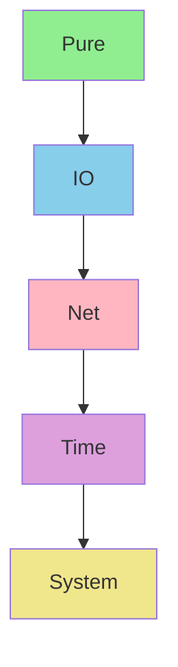
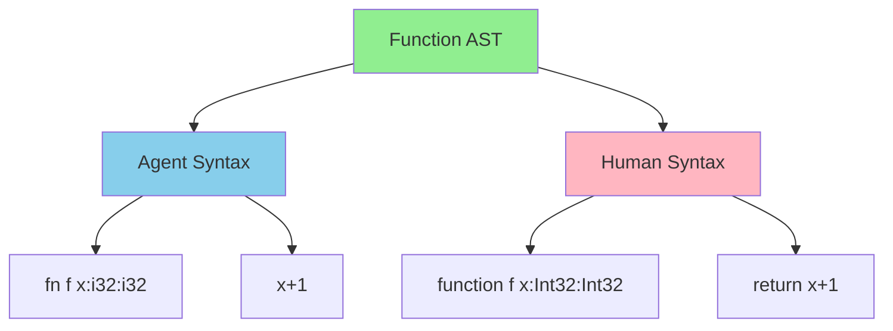
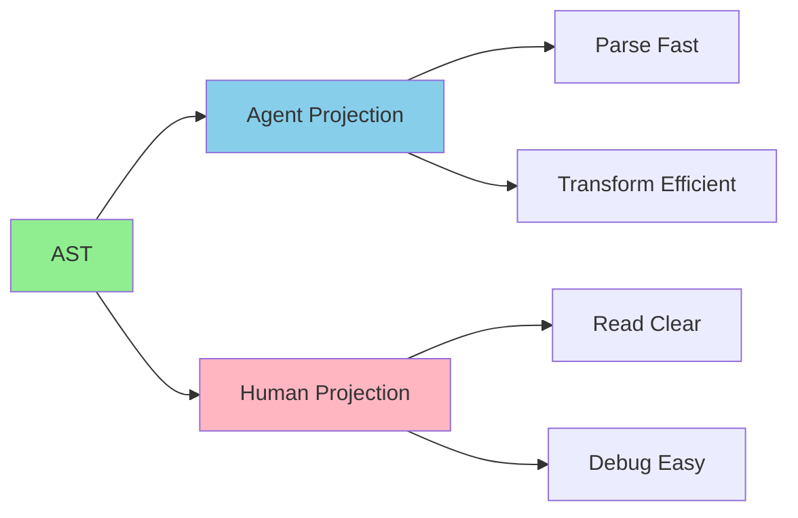

# Morph Specification Examples and Tutorials

**Document Version:** 1.0.0  
**Last Updated:** 2026-01-02  
**Status:** Active  
**Author:** Kilo Code

---

## Table of Contents

1. [Introduction](#1-introduction)
2. [Type System Examples](#2-type-system-examples)
   - [Pure Types](#21-pure-types)
   - [Effect System](#22-effect-system)
   - [Null-Coalescing Operator (??)](#23-null-coalescing-operator-)
   - [Capability Types](#24-capability-types)
3. [Language Features Examples](#3-language-features-examples)
   - [Dialects (min/hum)](#31-dialects-minhum)
   - [Syntax Translation](#32-syntax-translation)
   - [Dual Optimization](#33-dual-optimization)
4. [Concurrency Examples](#4-concurrency-examples)
   - [Scheduling Modes](#41-scheduling-modes)
   - [Layered Concurrency](#42-layered-concurrency)
5. [Memory Management Examples](#5-memory-management-examples)
   - [ARC with Affine Types](#51-arc-with-affine-types)
   - [Cycle Prevention](#52-cycle-prevention)
6. [Optimization Examples](#6-optimization-examples)
   - [Selective Monomorphization](#61-selective-monomorphization)
   - [Hot/Cold Path Detection](#62-hotcold-path-detection)
7. [Tutorials](#7-tutorials)
   - [Using Specifications](#71-using-specifications)
   - [Writing New Specifications](#72-writing-new-specifications)
   - [Validating Specifications](#73-validating-specifications)
8. [Best Practices](#8-best-practices)
9. [Version Information](#9-version-information)

---

## 1. Introduction

This document provides comprehensive examples and tutorials for Morph specifications. It serves as a practical guide for understanding, implementing, and validating Morph language features across all major specification areas.

### Purpose

- Demonstrate practical usage of Morph language features
- Provide step-by-step tutorials for common tasks
- Illustrate best practices for specification development
- Show integration between different specification areas

### Audience

This document is intended for:
- Language implementers
- Compiler developers
- Specification writers
- Advanced users of Morph language

### Prerequisites

Readers should be familiar with:
- Basic programming concepts
- Type theory fundamentals
- Functional programming principles
- Concurrent programming basics

---

## 2. Type System Examples

### 2.1 Pure Types

#### Example 2.1.1: Basic Pure Function

```morph
// Pure function: addition
pure fn add(x: i32, y: i32) -> i32 {
    ret x + y;
}

// Usage
let result = add(5, 3);  // result = 8
```

**Explanation:**
- The `pure` keyword indicates the function has no side effects
- Type: `i32 × i32 → Pure i32`
- Referential transparency: `add(5, 3)` always returns `8`
- No I/O, mutation, or external state access

**Properties:**
- Referential transparency: Same inputs always produce same outputs
- No side effects: Doesn't modify external state
- Deterministic: Always produces same result for same inputs
- Optimizable: Can be memoized, common subexpression eliminated

#### Example 2.1.2: Pure Higher-Order Function

```morph
// Pure higher-order function: map
pure fn map<A, B>(f: fn(A) -> B, list: List<A>) -> List<B> {
    match list {
        [] => [],
        [head, ...tail] => [f(head), ...map(f, tail)]
    }
}

// Usage
pure fn square(x: i32) -> i32 {
    ret x * x;
}

let numbers = [1, 2, 3, 4, 5];
let squares = map(square, numbers);  // squares = [1, 4, 9, 16, 25]
```

**Explanation:**
- `map` is pure because it only transforms data
- Type: `∀A,B. (A → Pure B) × List<A> → Pure List<B>`
- Higher-order: Takes a function as argument
- Generic: Works for any types A and B

#### Example 2.1.3: Pure Recursive Function

```morph
// Pure recursive function: factorial
pure fn factorial(n: i32) -> i32 {
    if (n <= 1) {
        ret 1;
    } else {
        ret n * factorial(n - 1);
    }
}

// Usage
let result = factorial(5);  // result = 120
```

**Explanation:**
- Recursive functions can be pure if they don't use side effects
- Type: `i32 → Pure i32`
- Deterministic: Always produces same result for same input
- Stack-safe: Compiler can optimize tail recursion

#### Example 2.1.4: Impure Function (for comparison)

```morph
// Impure function: reads from stdin
fn readInput() -> i32 {
    ret io::readInt();  // Side effect: I/O
}

// Type: void → IO i32
// Cannot be used in pure context
```

**Explanation:**
- Missing `pure` keyword indicates side effects
- Type: `void → IO i32`
- Not referentially transparent: May return different values
- Cannot be called from pure functions

---

### 2.2 Effect System

#### Example 2.2.1: Effect Composition

```morph
// Pure function
pure fn add(x: i32, y: i32) -> i32 {
    ret x + y;
}

// IO function
fn readFile(path: str) -> str {
    ret fs::read(path);  // Effect: IO
}

// Composed effects
fn processFile(path: str) -> str {
    let content = readFile(path);  // Effect: IO
    let parsed = parse(content);  // Effect: Pure
    ret parsed;  // Effect: IO ∪ Pure = IO
}
```

**Effect Analysis:**
- `add`: `i32 × i32 → Pure i32`
- `readFile`: `str → IO str`
- `processFile`: `str → IO str`
- Effect union: `IO ∪ Pure = IO`

#### Example 2.2.2: Effect Subtyping

```morph
// Pure function
pure fn add(x: i32, y: i32) -> i32 {
    ret x + y;
}

// IO function that calls Pure function
fn processAndPrint(x: i32, y: i32) -> void {
    let result = add(x, y);  // Allowed: Pure ⊆ IO
    print(result);  // Side effect: I/O
}
```

**Type Checking:**
- `add`: `i32 × i32 → Pure i32`
- `processAndPrint`: `i32 × i32 → IO void`
- Valid: `Pure ⊆ IO` (Pure functions can be used in IO contexts)

#### Example 2.2.3: Effect-Polymorphic Function

```morph
// Effect-polymorphic function
fn processFile<E>(path: str) -> Effect<str, IO | E> {
    let content = readFile(path);  // Effect: IO
    let parsed = parse(content);  // Effect: Pure
    ret parsed;  // Effect: IO ∪ Pure ∪ E = IO | E
}

// Instantiated with Net effect
fn processFileNet(path: str) -> Effect<str, Net> {
    ret processFile<Net>(path);  // Effect: IO | Net = Net
}
```

**Effect Analysis:**
- `processFile`: `∀E. str → (IO | E) str`
- `processFileNet`: `str → Net str`
- Effect polymorphism enables generic effect handling

#### Example 2.2.4: Effect Lattice Visualization



**Effect Hierarchy:**
- Pure: No side effects (bottom element)
- IO: File and console I/O
- Net: Network I/O (includes IO)
- Time: Time-dependent operations (includes Net)
- System: System-level operations (includes Time)

---

### 2.3 Null-Coalescing Operator (??)

#### Example 2.3.1: Basic Null-Coalescing

```morph
// Basic null-coalescing
let name: str? = getName();
let displayName = name ?? "Anonymous";

// If name is null, displayName is "Anonymous"
// If name is "Alice", displayName is "Alice"
```

**Type Analysis:**
- `name`: `str?`
- `"Anonymous"`: `str`
- `displayName`: `str`

**Evaluation:**
- If `name` is `null`, evaluates to `"Anonymous"`
- If `name` is `"Alice"`, evaluates to `"Alice"`

#### Example 2.3.2: Nested Null-Coalescing

```morph
// Nested null-coalescing
let value1: i32? = getValue1();
let value2: i32? = getValue2();
let result = value1 ?? value2 ?? 0;

// If value1 is non-null, result is value1
// If value1 is null and value2 is non-null, result is value2
// If both are null, result is 0
```

**Type Analysis:**
- `value1`: `i32?`
- `value2`: `i32?`
- `0`: `i32`
- `result`: `i32`

**Evaluation:**
- Right-associative: `(value1 ?? value2) ?? 0` is equivalent to `value1 ?? (value2 ?? 0)`

#### Example 2.3.3: Short-Circuit Evaluation

```morph
// Short-circuit evaluation
fn computeDefault() -> i32 {
    print("Computing default...");  // Side effect
    ret 42;
}

let value: i32? = getOptional();
let result = value ?? computeDefault();

// If value is non-null, computeDefault() is NOT called
// If value is null, computeDefault() IS called
```

**Effect Analysis:**
- `computeDefault()`: `void → IO i32`
- `value`: `i32?` with effect `Pure`
- `value ?? computeDefault()`: `i32` with effect `IO` if `value` is null, `Pure` otherwise

**Short-Circuiting:**
- Prevents unnecessary evaluation of `computeDefault()`
- Avoids side effects when not needed
- Performance optimization for non-null cases

#### Example 2.3.4: Type Inference with ??

```morph
// Type inference
let x: i32? = getOptionalInt();
let y = x ?? 42;  // Type inferred as i32

// Compiler infers:
// x: i32?
// 42: i32
// y: i32 (from ?? operator)
```

**Type Inference:**
- `x`: `i32?`
- `42`: `i32` (literal)
- `y`: `i32` (inferred from `x ?? 42`)

---

### 2.4 Capability Types

#### Example 2.4.1: File Read Capability

```morph
// Capability type for file reading
cap ReadFile<T> {
    read: fn() -> Effect<T, IO>
}

// Function that requires ReadFile capability
fn processFile<T>(file: ReadFile<T>) -> Effect<T, IO> {
    ret file.read();
}

// Usage
let file = openFile("data.txt");  // Returns ReadFile<str>
let content = processFile(file);  // Requires ReadFile capability
```

**Explanation:**
- Capability types track resource access
- `ReadFile<T>` encapsulates file reading operations
- Functions declare required capabilities in type signature
- Compiler ensures capabilities are available

#### Example 2.4.2: Network Capability

```morph
// Capability type for network access
cap NetworkAccess {
    get: fn(url: str) -> Effect<Response, Net>
    post: fn(url: str, data: Data) -> Effect<Response, Net>
}

// Function that requires NetworkAccess capability
fn fetchData(net: NetworkAccess, url: str) -> Effect<Data, Net> {
    ret net.get(url);
}
```

**Explanation:**
- `NetworkAccess` capability encapsulates network operations
- Functions declare network access requirements
- Type system ensures network capabilities are granted
- Enables effect-based security

---

## 3. Language Features Examples

### 3.1 Dialects (min/hum)

#### Example 3.1.1: Agent Syntax (min)

```morph
// Agent syntax: concise, optimized for AI agents
fn f(x:i32):i32 { x+1 }

// Higher-order function
fn map<A,B>(f:A->B, l:List<A>):List<B> {
    match l {
        [] => [],
        [h, ...t] => [f(h), ...map(f, t)]
    }
}

// Complete function
fn factorial(n:i32):i32 {
    if n <= 1 { 1 } else { n * factorial(n-1) }
}
```

**Characteristics:**
- Minimal syntax: `fn` instead of `function`
- Concise types: `i32` instead of `Int32`
- Implicit returns: Last expression is returned
- Compact control flow: `{ expr }` instead of `{ return expr; }`

#### Example 3.1.2: Human Syntax (hum)

```morph
// Human syntax: verbose, optimized for human developers
function f(x: Int32): Int32 {
    return x + 1;
}

// Higher-order function
function map<A, B>(f: A -> B, list: List<A>): List<B> {
    match (list) {
        case [] => [],
        case [head, ...tail] => [f(head), ...map(f, tail)]
    }
}

// Complete function
function factorial(n: Int32): Int32 {
    if (n <= 1) {
        return 1;
    } else {
        return n * factorial(n - 1);
    }
}
```

**Characteristics:**
- Verbose syntax: `function` instead of `fn`
- Descriptive types: `Int32` instead of `i32`
- Explicit returns: `return` keyword
- Familiar control flow: `{ return expr; }`

#### Example 3.1.3: Same AST, Different Syntax

Both agent and human syntax represent the same AST:



**AST Representation:**
```
Function
  name: "f"
  parameters: [Parameter(name: "x", type: Int32)]
  return_type: Int32
  body: BinaryOp(op: Add, left: Variable("x"), right: Literal(1))
```

---

### 3.2 Syntax Translation

#### Example 3.2.1: Agent to Human Translation

```morph
// Agent syntax
fn f(x:i32):i32 { x+1 }

// Translated to human syntax
function f(x: Int32): Int32 {
    return x + 1;
}
```

**Translation Rules:**
- `fn` → `function`
- `i32` → `Int32`
- `{ expr }` → `{ return expr; }`

#### Example 3.2.2: Human to Agent Translation

```morph
// Human syntax
function factorial(n: Int32): Int32 {
    if (n <= 1) {
        return 1;
    } else {
        return n * factorial(n - 1);
    }
}

// Translated to agent syntax
fn factorial(n:i32):i32 {
    if n <= 1 { 1 } else { n * factorial(n-1) }
}
```

**Translation Rules:**
- `function` → `fn`
- `Int32` → `i32`
- `{ return expr; }` → `{ expr }`
- `(condition)` → `condition`

#### Example 3.2.3: Round-Trip Translation

```morph
// Agent syntax
fn add(x:i32, y:i32):i32 { x+y }

// Agent → Human
function add(x: Int32, y: Int32): Int32 {
    return x + y;
}

// Human → Agent
fn add(x:i32, y:i32):i32 { x+y }

// Round-trip preserves semantics
```

**Round-Trip Properties:**
- Semantic equivalence: Both versions have same meaning
- Type preservation: Types are preserved across translation
- Behavior preservation: Runtime behavior is identical

---

### 3.3 Dual Optimization

#### Example 3.3.1: Agent-Optimized Code

```morph
// Agent syntax: optimized for AI agents
fn process(data:List<i32>):i32 {
    match data {
        [] => 0,
        [h] => h,
        [h, ...t] => h + process(t)
    }
}
```

**Optimizations:**
- Minimal syntax reduces parsing overhead
- Concise patterns improve pattern matching speed
- Dense representation improves cache locality

#### Example 3.3.2: Human-Optimized Code

```morph
// Human syntax: optimized for human developers
function process(data: List<Int32>): Int32 {
    match (data) {
        case [] => {
            return 0;
        }
        case [head] => {
            return head;
        }
        case [head, ...tail] => {
            return head + process(tail);
        }
    }
}
```

**Optimizations:**
- Verbose syntax improves readability
- Explicit structure aids debugging
- Clear control flow aids maintenance

#### Example 3.3.3: Dual Optimization Strategy



**Dual Optimization:**
- Agent projection: Optimized for parsing and transformation
- Human projection: Optimized for reading and debugging
- Both projections share same AST
- Users choose projection based on use case

---

## 4. Concurrency Examples

### 4.1 Scheduling Modes

#### Example 4.1.1: Deterministic Scheduling

```morph
// Enable deterministic scheduling
setSchedulingMode(Deterministic);
setRandomSeed(42);

// Deterministic work stealing
fn stealWorkDeterministic(worker: Worker) -> Option<Task> {
    // Select victim worker using deterministic algorithm
    let victim = selectVictimDeterministic(worker);
    ret victim.stealTask()
}

// Usage in testing
fn testConcurrentProcessing() -> void {
    setSchedulingMode(Deterministic);
    setRandomSeed(42);
    let result = processConcurrently(data);
    assert(result == expected);  // Reproducible
}
```

**Characteristics:**
- All scheduling decisions are deterministic
- Execution is reproducible across runs
- Work stealing uses deterministic selection
- Random number generation uses fixed seeds

**Use Cases:**
- Testing
- Debugging
- Reproducible builds
- Formal verification

#### Example 4.1.2: Randomized Scheduling

```morph
// Enable randomized scheduling
setSchedulingMode(Randomized);
useSystemEntropy();

// Randomized work stealing
fn stealWorkRandomized(worker: Worker) -> Option<Task> {
    // Select victim worker using random selection
    let victim = selectVictimRandomized(worker);
    ret victim.stealTask()
}

// Usage in production
fn processConcurrentlyProduction(data: Data) -> void {
    setSchedulingMode(Randomized);
    useSystemEntropy();
    let result = processConcurrently(data);
    // Optimized for performance
}
```

**Characteristics:**
- Scheduling decisions use randomization
- Execution is not reproducible
- Work stealing uses randomized selection
- Random number generation uses system entropy

**Use Cases:**
- Production execution
- Performance optimization
- Load balancing
- Avoiding contention

#### Example 4.1.3: Mode Transition

```morph
// Switch from deterministic to randomized
setSchedulingMode(Randomized);

// Switch from randomized to deterministic
setSchedulingMode(Deterministic);
setRandomSeed(42);

// Runtime mode switching
fn adaptiveProcessing(data: Data) -> void {
    if (isProduction()) {
        setSchedulingMode(Randomized);
    } else {
        setSchedulingMode(Deterministic);
        setRandomSeed(42);
    }
    process(data);
}
```

**Mode Transition:**
- Modes can be switched at runtime
- Randomized mode uses system entropy
- Deterministic mode uses fixed seeds
- Adaptive scheduling based on environment

---

### 4.2 Layered Concurrency

#### Example 4.2.1: Intra-Actor Unidirectional State

```morph
// Intra-actor: Unidirectional state transformations
actor Counter {
    state: i32,
    
    fn increment(self) -> Counter {
        Counter { state: self.state + 1 }
    }
    
    fn multiply(self, x: i32) -> Counter {
        Counter { state: self.state * x }
    }
}
```

**Characteristics:**
- State transformations are unidirectional
- No bidirectional state mutation
- Clear input/output boundaries
- Deterministic state evolution

#### Example 4.2.2: Inter-Actor Bidirectional Messaging

```morph
// Inter-actor: Bidirectional messaging
actor Client {
    fn request(self, server: Server) -> Effect<Response, IO> {
        server.sendRequest(Request { ... })
    }
}

actor Server {
    fn handleRequest(self, request: Request) -> Effect<Response, IO> {
        // Process request and send response
        Response { ... }
    }
}
```

**Characteristics:**
- Bidirectional message passing
- Request-response patterns
- Asynchronous communication
- Message-based coordination

#### Example 4.2.3: Complete Layered System

```morph
// Intra-actor: Unidirectional state
actor Calculator {
    state: i32,
    
    fn add(self, x: i32) -> Calculator {
        Calculator { state: self.state + x }
    }
    
    fn multiply(self, x: i32) -> Calculator {
        Calculator { state: self.state * x }
    }
}

// Inter-actor: Bidirectional messaging
actor Client {
    fn compute(self, calculator: Calculator, op: Operation) -> Effect<i32, IO> {
        calculator.sendOperation(op)
    }
}

actor CalculatorService {
    fn handleOperation(self, op: Operation) -> Effect<i32, IO> {
        // Process operation and send response
        match op {
            Add(x) => self.add(x).state,
            Multiply(x) => self.multiply(x).state
        }
    }
}
```

**Layered Architecture:**
- Intra-Actor Layer: Unidirectional state transformations
- Inter-Actor Layer: Bidirectional messaging between actors
- Clear boundaries between layers
- No shared state between actors

---

## 5. Memory Management Examples

### 5.1 ARC with Affine Types

#### Example 5.1.1: Affine Type Definition

```morph
// Affine type: each value used exactly once
affine struct Node {
    value: i32,
    next: Option<Node>
}

// Valid: linear chain
let n1 = Node { value: 1, next: None };
let n2 = Node { value: 2, next: Some(n1) };

// Invalid: cycle (rejected by type checker)
let n1 = Node { value: 1, next: ??? };  // Cannot reference n2
let n2 = Node { value: 2, next: Some(n1) };  // n1 not defined yet
```

**Affine Type Properties:**
- Each value used exactly once
- Linear typing prevents cycles
- Compiler enforces usage constraints
- Memory safety by construction

#### Example 5.1.2: ARC Operations

```morph
// Reference counting operations
fn retain<T>(value: T) -> T {
    value.refCount += 1;
    ret value;
}

fn release<T>(value: T) -> void {
    value.refCount -= 1;
    if (value.refCount == 0) {
        deallocate(value)
    }
}

// Usage
let data = allocateData();
let retained = retain(data);
// ... use retained ...
release(retained);
```

**ARC Implementation:**
- `retain`: Increments reference count
- `release`: Decrements reference count and deallocates if zero
- Automatic memory management
- No garbage collection needed

#### Example 5.1.3: Affine List

```morph
// Affine type: no cycles
affine struct List<T> {
    head: Option<T>,
    tail: Option<List<T>>
}

// Valid: linear chain
let list1 = List { head: Some(1), tail: None };
let list2 = List { head: Some(2), tail: Some(list1) };

// Invalid: cycle (rejected)
let list1 = List { head: Some(1), tail: Some(list2) };  // list2 not defined
let list2 = List { head: Some(2), tail: Some(list1) };  // Cycle rejected
```

**Affine List:**
- Linear chain structure
- No cycles possible
- Memory safe by construction
- Efficient deallocation

---

### 5.2 Cycle Prevention

#### Example 5.2.1: Weak References for Cycles

```morph
// Weak reference: does not increase reference count
struct WeakRef<T> {
    target: Weak<T>
}

// Example: parent-child relationship
struct Parent {
    children: List<Child>
}

struct Child {
    parent: WeakRef<Parent>  // Weak reference to avoid cycle
}

// Valid: no cycle
let parent = Parent { children: [] };
let child = Child { parent: WeakRef::new(parent) };
parent.children.push(child);
```

**Weak References:**
- Do not increase reference count
- Break reference cycles
- Enable parent-child relationships
- No memory leaks

#### Example 5.2.2: Cycle Detection

```morph
// Cycle detection algorithm
fn hasCycle<T>(graph: Graph<T>) -> bool {
    let visited = Set::new();
    ret hasCycleHelper(graph, graph.root, visited)
}

fn hasCycleHelper<T>(graph: Graph<T>, node: Node<T>, visited: Set<Node<T>>) -> bool {
    if (visited.contains(node)) {
        ret true;  // Cycle detected
    }
    visited.add(node);
    for (child in node.children) {
        if (hasCycleHelper(graph, child, visited)) {
            ret true;
        }
    }
    ret false;
}
```

**Cycle Detection:**
- Depth-first search with visited set
- Detects back edges (cycles)
- Prevents infinite loops
- Ensures graph is a DAG

---

## 6. Optimization Examples

### 6.1 Selective Monomorphization

#### Example 6.1.1: Force Monomorphization

```morph
// Force monomorphization
@monomorphize
fn hotPath<T>(x: T) -> T {
    x
}

// Usage
let a = hotPath(42);      // Monomorphized: specialized for i32
let b = hotPath("hello");  // Monomorphized: specialized for str
```

**Monomorphization:**
- Generates specialized code for each type
- Optimal performance for hot paths
- No runtime type checks
- Zero-cost abstraction

#### Example 6.1.2: Force Runtime Generics

```morph
// Force runtime generics
@generic
fn coldPath<T>(x: T) -> T {
    x
}

// Usage
let a = coldPath(42);      // Generic: shared implementation
let b = coldPath("hello");  // Generic: shared implementation
```

**Runtime Generics:**
- Single shared implementation
- Minimal code size
- Runtime type checks
- Suitable for cold paths

#### Example 6.1.3: Automatic Detection

```morph
// Hot path (detected)
fn map<A,B>(f:A->B, l:List<A>):List<B> {
    match l {
        [] => [],
        [h, ...t] => [f(h), ...map(f, t)]
    }
}

// Cold path (detected)
fn debug<T>(x: T) -> void {
    println(debugString(x))
}

// Automatic: compiler decides
fn process<T>(x: T) -> T {
    debug(x);  // Cold: generic
    add(x, x)  // Hot: monomorphized
}
```

**Hot/Cold Detection:**
- Compiler analyzes execution frequency
- Hot paths: Frequently executed code
- Cold paths: Rarely executed code
- Automatic optimization based on usage

---

### 6.2 Hot/Cold Path Detection

#### Example 6.2.1: Hot Path Example

```morph
// Hot path: frequently executed
fn processList<T>(list: List<T>) -> i32 {
    match list {
        [] => 0,
        [h] => 1,
        [h, ...t] => 1 + processList(t)
    }
}

// Called frequently in hot loop
fn hotLoop(data: List<List<i32>>) -> i32 {
    let total = 0;
    for (list in data) {
        total += processList(list);  // Hot path
    }
    ret total;
}
```

**Hot Path Characteristics:**
- Frequently executed
- Performance-critical
- Worth monomorphizing
- Optimized aggressively

#### Example 6.2.2: Cold Path Example

```morph
// Cold path: rarely executed
fn logError<T>(x: T) -> void {
    println(debugString(x))
}

// Called rarely in error handling
fn handleError(error: Error) -> void {
    logError(error);  // Cold path
    // ... error handling ...
}
```

**Cold Path Characteristics:**
- Rarely executed
- Not performance-critical
- Use runtime generics
- Minimize code size

#### Example 6.2.3: Optimization Flags

```morph
// Optimize for performance (default)
@optimize(performance)
fn fastSort<T>(list: List<T>) -> List<T> {
    // Performance-optimized implementation
    // ...
}

// Optimize for code size
@optimize(size)
fn compactSort<T>(list: List<T>) -> List<T> {
    // Size-optimized implementation
    // ...
}

// Balanced optimization
@optimize(balanced)
fn balancedSort<T>(list: List<T>) -> List<T> {
    // Balanced implementation
    // ...
}
```

**Optimization Flags:**
- `@optimize(performance)`: Prioritize speed
- `@optimize(size)`: Prioritize code size
- `@optimize(balanced)`: Balance speed and size

---

## 7. Tutorials

### 7.1 Using Specifications

#### Tutorial 7.1.1: Reading a Specification

**Step 1: Understand the Structure**

Each specification follows a standard structure:
1. **Header**: Version, context, formalism, status
2. **Introduction**: Purpose, scope, definitions
3. **Formal Definitions**: Mathematical definitions
4. **Requirements**: Functional and non-functional requirements
5. **Design**: Architecture, data structures, algorithms
6. **Correctness Properties**: Theorems and invariants
7. **Examples**: Practical code examples

**Step 2: Identify Key Concepts**

Look for:
- Formal definitions (Section 2)
- Type system rules (Section 4)
- Effect system integration (Section 4.5)
- Examples (Section 6)

**Step 3: Cross-Reference Related Specs**

Use the cross-references section to find related specifications:
- Type system specs
- Language specs
- Concurrency specs
- Memory management specs

**Example: Reading Pure Type Specification**

```markdown
# Pure Type Specification

## 1. Introduction
### 1.1 Purpose
This specification provides a formal mathematical definition of the Pure type...

## 2. Formal Definitions
### 2.1 Pure Type as a Kind
The Pure type is defined as a kind in the Morph type system:
$$
\text{Pure} : \text{Kind}
$$

## 6. Examples
### 6.1.1 Basic Pure Function
```morph
pure fn add(x: i32, y: i32) -> i32 {
    ret x + y;
}
```
```

**Key Takeaways:**
- Pure functions have no side effects
- Pure functions are referentially transparent
- Pure functions are deterministic
- Pure functions enable optimizations

---

#### Tutorial 7.1.2: Implementing a Specification

**Step 1: Understand the Requirements**

Read the requirements section carefully:
- Functional requirements (what the system must do)
- Non-functional requirements (how well it must do it)
- Priority levels (Critical, High, Medium)

**Step 2: Design the Implementation**

Based on the design section:
- Architecture overview
- Data structures
- Algorithms

**Step 3: Implement the Algorithms**

Follow the pseudocode in the design section:
- Ensure correctness
- Maintain invariants
- Handle edge cases

**Example: Implementing Pure Type Checking**

```python
# Step 1: Understand requirements
# PURE-REQ-001: Enforce referential transparency
# PURE-REQ-002: Enforce no side effects
# PURE-REQ-003: Enforce determinism

# Step 2: Design implementation
# Track effect annotations
# Infer effects from function bodies
# Validate purity by checking for side effects

# Step 3: Implement algorithm
def check_purity(function_body, type_env):
    # Check for side effects
    if has_io_operations(function_body):
        return False
    if has_mutation(function_body):
        return False
    if has_network_operations(function_body):
        return False
    
    # No side effects found
    return True
```

---

### 7.2 Writing New Specifications

#### Tutorial 7.2.1: Specification Template

```markdown
# [Specification Name]

* File:** `spec/[path]/[filename].md`
* Version:** 1.0.0
* Context:** Layer [X] ([Layer Name])
* Formalism:** [Formalism]
* Status:** Active
* Last Modified:** [Date]
* Author:** [Author]
* Reviewers:** Pending

---

## 1. Introduction

### 1.1 Purpose

[Brief description of what this specification defines and why it's needed]

### 1.2 Scope

This specification covers:
- [Feature 1]
- [Feature 2]
- [Feature 3]

This specification does not cover:
- [Out of scope 1]
- [Out of scope 2]

### 1.3 Definitions, Acronyms, and Abbreviations

| Term | Definition |
|-------|------------|
| **[Term 1]** | [Definition 1] |
| **[Term 2]** | [Definition 2] |

### 1.4 References

- [Reference 1]
- [Reference 2]

### 1.5 Cross-References

The [Specification Name] Specification is closely related to several other Morph specifications:

* [Category 1] Specifications:**
- `spec/[path]/[spec1].md` - [Description]
- `spec/[path]/[spec2].md` - [Description]

* Note:** This specification provides the authoritative definition of [feature] that supersedes all previous references in the listed specifications.

---

## 2. Formal Definitions

### 2.1 [Definition 1]

[Mathematical definition with LaTeX]

**Interpretation:** [Explanation of what the definition means]

### 2.2 [Definition 2]

[Mathematical definition with LaTeX]

**Interpretation:** [Explanation of what the definition means]

---

## 3. Requirements

### 3.1 Functional Requirements

* [ID]-REQ-001:** THE system SHALL [requirement].

* Priority:** [Critical/High/Medium]
* Verification Method:** [Test/Analysis/Demonstration]
* Rationale:** [Why this requirement is needed]
* Dependencies:** [Related requirements]
* Traceability:** Section [X.Y] ([Section Name])

### 3.2 Non-Functional Requirements

* [ID]-NFR-001:** THE system SHALL [requirement].

* Priority:** [High/Medium]
* Verification Method:** [Analysis/Demonstration]
* Metric:** [Specific metric]
* Rationale:** [Why this requirement is needed]

---

## 4. Design

### 4.1 Architecture Overview

[High-level architecture description]

### 4.2 Data Structures

#### 4.2.1 [Data Structure 1]

* [Data Structure Name]:** [Mathematical notation]

* Components:**
- [Component 1]: [Description]
- [Component 2]: [Description]

* Invariants:**
1. [Invariant 1]
2. [Invariant 2]

### 4.3 Algorithms

#### 4.3.1 [Algorithm 1]

* Algorithm Name:* [Name]

* Input:* [Input description]
* Output:* [Output description]

* Mathematical Definition:*
$$
[Mathematical definition]
$$

* Pseudocode:*
```
[pseudocode]
```

* Complexity:*
- Time: [Time complexity]
- Space: [Space complexity]

* Correctness:*
- **Invariant:** [What the algorithm maintains]
- **Termination:** [Why it terminates]

### 4.4 Mermaid Diagrams

#### 4.4.1 [Diagram 1]

```mermaid
[diagram]
```

---

## 5. Correctness Properties

### 5.1 Theorems

#### 5.1.1 [Theorem 1]

* Theorem:* [Statement of theorem]

* Formal Statement:*
$$
[Mathematical statement]
$$

* Proof:*

[Proof steps]

* [ID]-THM-001:* THE system SHALL guarantee [property].

* Priority:** [Critical/High/Medium]
* Verification Method:** [Analysis]
* Rationale:** [Why this theorem is important]
* Dependencies:** [Related requirements]
* Traceability:** Section 5.1.1 ([Theorem Name])

### 5.2 Invariants

#### 5.2.1 [Invariant Category 1]

* **[ID]-INV-001:** THE system SHALL maintain [invariant].
* **[ID]-INV-002:** THE system SHALL maintain [invariant].

---

## 6. Examples

### 6.1 [Example Category 1]

#### 6.1.1 [Example Name]

```morph
[code example]
```

* [Analysis Type]:*
- [Property 1]: [Description]
- [Property 2]: [Description]

* Evaluation:*
- [Step 1]: [Description]
- [Step 2]: [Description]

---

## Change Log

| Version | Date       | Author      | Changes                                                                 |
|---------|------------|-------------|-------------------------------------------------------------------------|
| 1.0.0   | [Date]     | [Author]    | Initial version with [summary of initial content] |
```

**Template Usage:**
1. Copy the template
2. Fill in placeholders with specification-specific content
3. Ensure all sections are complete
4. Add cross-references to related specs
5. Include comprehensive examples

---

#### Tutorial 7.2.2: Writing a Type System Specification

**Step 1: Define Formal Semantics**

Use mathematical notation to define types:
- Type judgments: $\Gamma \vdash e : T$
- Type rules: Inference rules with premises and conclusions
- Type constructors: How types are built

**Step 2: Define Type Checking Rules**

Create formal type checking rules:
- Base cases: Literals, variables
- Inductive cases: Function application, let binding
- Effect rules: How effects are tracked

**Step 3: Prove Correctness**

Provide formal proofs:
- Type safety theorem
- Progress theorem
- Preservation theorem

**Example: Type Rule Definition**

```markdown
### 4.3.1 Pure Function Rule

$$
\frac{\Gamma, x: A \vdash e: B \quad \text{isPure}(e)}{\Gamma \vdash \lambda x. e : A \xrightarrow{\text{Pure}} B}
$$

where $\text{isPure}(e)$ checks that expression $e$ has no side effects.

**Interpretation:** A lambda abstraction is Pure if its body has no side effects.
```

---

#### Tutorial 7.2.3: Writing a Concurrency Specification

**Step 1: Define Concurrency Model**

Specify the concurrency model:
- Actor model
- Shared memory model
- Message passing model

**Step 2: Define Scheduling Rules**

Specify scheduling behavior:
- Deterministic vs randomized
- Work stealing algorithm
- Load balancing strategy

**Step 3: Define Safety Properties**

Specify safety guarantees:
- Deadlock freedom
- Starvation freedom
- Progress guarantees

**Example: Scheduling Rule Definition**

```markdown
### 4.3.1 Deterministic Work Stealing

$$
\frac{\text{worker} \in \text{Workers} \quad \text{hasTasks}(\text{worker})}{\text{stealWorkDeterministic}(\text{worker})}
$$

**Interpretation:** A worker steals work deterministically when it has no tasks.
```

---

### 7.3 Validating Specifications

#### Tutorial 7.3.1: Using the Specification Linter

**Step 1: Run the Linter**

```bash
# Run linter on all specifications
python scripts/spec_linter.py spec/

# Run linter on specific specification
python scripts/spec_linter.py spec/type/pure_type_spec.md
```

**Step 2: Interpret Linter Output**

```
Errors:
   FAIL spec/type/pure_type_spec.md: Missing version header
   FAIL spec/type/effect_system_spec.md: Broken reference to spec/missing_spec.md

Warnings:
   WARN spec/language/morph_language_spec.md: Uses both 'Signal' and 'Stream' terminology
```

**Step 3: Fix Issues**

- Add missing version headers
- Fix broken cross-references
- Standardize terminology

---

#### Tutorial 7.3.2: Using the Link Checker

**Step 1: Run the Link Checker**

```bash
# Run link checker on all specifications
python scripts/spec_link_checker.py spec/

# Run link checker with verbose output
python scripts/spec_link_checker.py spec/ --verbose
```

**Step 2: Interpret Link Checker Output**

```
Checking links in spec/type/pure_type_spec.md...
   OK spec/type/type_system_spec.md exists
   OK spec/type/effect_system_spec.md exists
   FAIL spec/type/missing_spec.md does not exist

Checking links in spec/language/morph_language_spec.md...
   OK All links are valid

Summary:
  Total links: 150
  Valid links: 148
  Broken links: 2
```

**Step 3: Fix Broken Links**

- Create missing specifications
- Update incorrect paths
- Remove invalid references

---

#### Tutorial 7.3.3: Using the Version Validator

**Step 1: Run the Version Validator**

```bash
# Run version validator on all specifications
python scripts/spec_version_validator.py spec/

# Run version validator with compatibility check
python scripts/spec_version_validator.py spec/ --check-compatibility
```

**Step 2: Interpret Version Validator Output**

```
Checking version compatibility...
   OK morph_language_spec.md v0.3.0 compatible with type_system_spec.md v0.2.1+
   OK type_system_spec.md v0.2.1 compatible with effect_system_spec.md v1.0.0+
   FAIL build_lattice_spec.md v0.4.0-rc1 requires type_system_spec.md v0.3.0+ (found v0.2.1)

Compatibility Issues:
   FAIL build_lattice_spec.md requires type_system_spec.md v0.3.0+ (found v0.2.1)
```

**Step 3: Fix Compatibility Issues**

- Update version requirements
- Upgrade dependent specifications
- Document breaking changes

---

#### Tutorial 7.3.4: Running the Test Suite

**Step 1: Run All Tests**

```bash
# Run all specification tests
python -m pytest tests/

# Run specific test file
python -m pytest tests/test_spec_linter.py

# Run with coverage report
python -m pytest tests/ --cov=tests --cov-report=html
```

**Step 2: Interpret Test Results**

```
tests/test_spec_linter.py::test_terminology_consistency PASSED
tests/test_spec_linter.py::test_cross_references PASSED
tests/test_spec_linter.py::test_version_headers PASSED

tests/test_spec_link_checker.py::test_all_references_exist PASSED
tests/test_spec_link_checker.py::test_broken_links_detected PASSED

tests/test_spec_version_validator.py::test_version_compatibility PASSED

========================= 15 passed in 2.34s =========================
```

**Step 3: Fix Test Failures**

- Identify failing tests
- Fix specification issues
- Re-run tests to verify fixes

---

## 8. Best Practices

### 8.1 Specification Writing Best Practices

#### BP-001: Use Formal Mathematical Notation

**Good:**
```markdown
### 2.1 Pure Type Definition

$$
\text{pure}(f: A \to B) \iff
\begin{cases}
\forall x_1, x_2 \in A. \quad x_1 = x_2 \implies f(x_1) = f(x_2) \quad \land \\
\neg \text{hasSideEffects}(f) \quad \land \\
\forall x \in A. \quad \exists! y \in B. \quad f(x) = y
\end{cases}
$$
```

**Bad:**
```markdown
### 2.1 Pure Type Definition

A function is pure if it has no side effects and is deterministic.
```

**Why:** Formal notation is precise, unambiguous, and enables proofs.

---

#### BP-002: Provide Comprehensive Examples

**Good:**
```markdown
### 6.1 Pure Function Examples

#### 6.1.1 Basic Pure Function
```morph
pure fn add(x: i32, y: i32) -> i32 {
    ret x + y;
}
```

* Type:* `i32 × i32 → Pure i32`
* Effect:* Pure
* Properties:*
  - Referential transparency: ∀x₁,x₂,y₁,y₂. x₁=x₂∧y₁=y₂ ⇒ add(x₁,y₁)=add(x₂,y₂)
  - No side effects: No I/O, mutation, or external state access
  - Deterministic: Always produces same result for same inputs
```

**Bad:**
```markdown
### 6.1 Pure Function Examples

Here's a pure function:
```morph
pure fn add(x: i32, y: i32) -> i32 {
    ret x + y;
}
```
```

**Why:** Comprehensive examples include type analysis, effect analysis, and property explanations.

---

#### BP-003: Include Correctness Proofs

**Good:**
```markdown
### 5.1.1 Type Safety Theorem

* Theorem:* If a function type-checks as Pure, then it is type-safe and has no side effects.

* Formal Statement:*
$$
\Gamma \vdash f : A \xrightarrow{\text{Pure}} B \implies \text{safe}(f) \land \neg \text{hasSideEffects}(f)
$$

* Proof by Structural Induction:*

* Base Cases:*

1. **Literals:** For any literal $l$, $\Gamma \vdash l : T$ with effect $\text{Pure}$.
   - Literals are always type-safe by definition
   - Literals have no side effects
   - Therefore, $\text{safe}(l) \land \neg \text{hasSideEffects}(l)$

* Inductive Steps:*

3. **Function Application:** If $\Gamma \vdash e_1 : A \xrightarrow{\text{Pure}} B$ and $\Gamma \vdash e_2 : A$ with effect $\text{Pure}$, then $\Gamma \vdash e_1(e_2) : B$ with effect $\text{Pure}$.
   - By induction hypothesis, $e_1$ is type-safe and has no side effects
   - By induction hypothesis, $e_2$ is type-safe and has no side effects
   - Function application requires argument type matches parameter type
   - Pure functions have no side effects, so application has no side effects
   - Therefore, $\text{safe}(e_1(e_2)) \land \neg \text{hasSideEffects}(e_1(e_2))$

* Conclusion:*
By structural induction on the syntax of expressions, if $\Gamma \vdash e : T$ with effect $\text{Pure}$, then $\text{safe}(e) \land \neg \text{hasSideEffects}(e)$. Therefore, Pure type-checked functions are type-safe and have no side effects.
```

**Bad:**
```markdown
### 5.1.1 Type Safety Theorem

Pure functions are type-safe and have no side effects.
```

**Why:** Formal proofs provide mathematical guarantees and enable verification.

---

#### BP-004: Use Mermaid Diagrams

**Good:**
```markdown
### 4.5.1 Effect Lattice Visualization


```

**Bad:**
```markdown
### 4.5.1 Effect Lattice Visualization

The effect lattice is: Pure -> IO -> Net -> Time -> System
```

**Why:** Mermaid diagrams are visual, interactive, and render in documentation tools.

---

#### BP-005: Maintain Cross-References

**Good:**
```markdown
### 1.5 Cross-References

The Pure Type Specification is closely related to several other Morph specifications:

* Type System Specifications:**
- [`spec/type/type_system_spec.md`](../spec/type/type_system_spec.md) - Overall type system architecture and effect categories
- [`spec/type/type_category_spec.md`](../spec/type/type_category_spec.md) - Category theory foundations for types
- [`spec/type/type_unification_spec.md`](../spec/type/type_unification_spec.md) - Type unification algorithm

* Language Specifications:**
- [`spec/language/scoping_lambda_calculus_spec.md`](../spec/language/scoping_lambda_calculus_spec.md) - Lambda calculus and scoping rules
- [`spec/language/morph_language_spec.md`](../spec/language/morph_language_spec.md) - Core language syntax and semantics

* Note:** This specification provides the authoritative definition of Pure type that supersedes all previous references in the listed specifications.
```

**Bad:**
```markdown
### 1.5 Cross-References

See also: type_system_spec.md, scoping_lambda_calculus_spec.md
```

**Why:** Proper cross-references enable navigation and maintainability.

---

### 8.2 Implementation Best Practices

#### BP-006: Follow Specification Exactly

**Good:**
```python
# Implementation follows spec exactly
def check_purity(function_body, type_env):
    # Check for side effects
    if has_io_operations(function_body):
        return False
    if has_mutation(function_body):
        return False
    if has_network_operations(function_body):
        return False
    
    # No side effects found
    return True
```

**Bad:**
```python
# Implementation deviates from spec
def check_purity(function_body, type_env):
    # Only checks I/O, ignores mutation and network
    return not has_io_operations(function_body)
```

**Why:** Exact implementation ensures correctness and compatibility.

---

#### BP-007: Maintain Invariants

**Good:**
```python
# Maintain invariants
def retain(value):
    # Precondition: value is valid
    assert value.refCount >= 0
    
    value.refCount += 1
    
    # Postcondition: refCount increased
    assert value.refCount > 0
    assert value.is_valid()
    
    return value
```

**Bad:**
```python
# No invariant checking
def retain(value):
    value.refCount += 1
    return value
```

**Why:** Invariant checking catches bugs early and ensures correctness.

---

#### BP-008: Handle Edge Cases

**Good:**
```python
# Handle all edge cases
def null_coalesce(left, right):
    if left is None:
        return right
    elif left is not None:
        return left
    else:
        # Handle unexpected case
        raise ValueError("Invalid left operand")
```

**Bad:**
```python
# Doesn't handle edge cases
def null_coalesce(left, right):
    return left if left else right
```

**Why:** Edge case handling prevents crashes and undefined behavior.

---

### 8.3 Documentation Best Practices

#### BP-009: Document All Parameters

**Good:**
```markdown
### 4.3.1 Type Checking Algorithm

* Algorithm Name:* Check Null-Coalescing Expression

* Input:* Expressions $e_1, e_2$, type environment $\Gamma$

* Output:* Type $T$ or type error

* Mathematical Definition:*
$$
\text{checkNullCoalescing}(e_1, e_2, \Gamma) = 
\begin{cases}
T & \text{ if } \text{infer}(e_1, \Gamma) = T_1? \land \text{infer}(e_2, \Gamma) = T_2 \land T_1 = T_2 \\
\text{TypeError} & \text{ otherwise}
\end{cases}
$$
```

**Bad:**
```markdown
### 4.3.1 Type Checking Algorithm

Checks if null-coalescing expression is valid.
```

**Why:** Complete parameter documentation enables correct implementation.

---

#### BP-010: Provide Usage Examples

**Good:**
```markdown
### 6.1.1 Basic Null-Coalescing

```morph
// Basic null-coalescing
let name: str? = getName();
let displayName = name ?? "Anonymous";

// If name is null, displayName is "Anonymous"
// If name is "Alice", displayName is "Alice"
```

* Type Analysis:*
- `name`: `str?`
- `"Anonymous"`: `str`
- `displayName`: `str`

* Evaluation:*
- If `name` is `null`, evaluates to `"Anonymous"`
- If `name` is `"Alice"`, evaluates to `"Alice"`
```

**Bad:**
```markdown
### 6.1.1 Basic Null-Coalescing

```morph
let name = getName();
let displayName = name ?? "Anonymous";
```
```

**Why:** Usage examples with explanations demonstrate practical usage.

---

## 9. Version Information

### 9.1 Specification Versions

| Specification | Version | Status | Last Modified |
|---------------|---------|--------|---------------|
| pure_type_spec.md | 1.0.0 | Active | 2026-01-02 |
| effect_system_spec.md | 1.0.0 | Active | 2026-01-02 |
| operator_null_coalescing_spec.md | 1.0.0 | Active | 2026-01-02 |
| morph_language_spec.md | 0.3.0 | Stable | 2026-01-02 |
| type_system_spec.md | 0.2.1 | Stable | 2026-01-02 |

### 9.2 Document Version

| Version | Date | Author | Changes |
|---------|--------|---------|---------|
| 1.0.0 | 2026-01-02 | Kilo Code | Initial version with comprehensive examples and tutorials for all major specification areas |

---

## Appendix A: Quick Reference

### A.1 Type System Quick Reference

| Feature | Specification | Key Concepts |
|----------|-------------|---------------|
| Pure Types | [`spec/type/pure_type_spec.md`](../spec/type/pure_type_spec.md) | Referential transparency, no side effects, determinism |
| Effect System | [`spec/type/effect_system_spec.md`](../spec/type/effect_system_spec.md) | Effect lattice, effect algebra, effect polymorphism |
| ?? Operator | [`spec/language/operator_null_coalescing_spec.md`](../spec/language/operator_null_coalescing_spec.md) | Null-coalescing, short-circuit evaluation, type inference |
| Capability Types | [`spec/type/type_system_spec.md`](../spec/type/type_system_spec.md) | Resource access, effect-based security |

### A.2 Language Features Quick Reference

| Feature | Specification | Key Concepts |
|----------|-------------|---------------|
| Dialects | [`spec/language/dialect_projection_spec.md`](../spec/language/dialect_projection_spec.md) | Agent syntax, human syntax, projectional editing |
| Syntax Translation | [`spec/language/syntax_translation_spec.md`](../spec/language/syntax_translation_spec.md) | Bidirectional translation, round-trip properties |
| Dual Optimization | [`spec/language/dual_optimization_spec.md`](../spec/language/dual_optimization_spec.md) | Agent optimization, human optimization, dual projections |

### A.3 Concurrency Quick Reference

| Feature | Specification | Key Concepts |
|----------|-------------|---------------|
| Scheduling Modes | [`spec/concurrency/scheduling_modes_spec.md`](../spec/concurrency/scheduling_modes_spec.md) | Deterministic mode, randomized mode, mode transition |
| Layered Concurrency | [`spec/architecture/layered_concurrency_spec.md`](../spec/architecture/layered_concurrency_spec.md) | Intra-actor unidirectionality, inter-actor bidirectionality |

### A.4 Memory Management Quick Reference

| Feature | Specification | Key Concepts |
|----------|-------------|---------------|
| ARC with Affine Types | [`spec/memory/arc_affine_integration_spec.md`](../spec/memory/arc_affine_integration_spec.md) | Reference counting, affine typing, cycle prevention |
| Cycle Prevention | [`spec/memory/memory_acyclicity_spec.md`](../spec/memory/memory_acyclicity_spec.md) | Weak references, cycle detection, DAG structure |

### A.5 Optimization Quick Reference

| Feature | Specification | Key Concepts |
|----------|-------------|---------------|
| Selective Monomorphization | [`spec/optimization/selective_monomorphization_spec.md`](../spec/optimization/selective_monomorphization_spec.md) | Hot paths, cold paths, automatic detection |
| Hot/Cold Path Detection | [`spec/optimization/optimization_manifold_spec.md`](../spec/optimization/optimization_manifold_spec.md) | Performance optimization, code size optimization, balanced optimization |

---

## Appendix B: Glossary

| Term | Definition |
|-------|------------|
| **Pure Function** | A function with no side effects, referential transparency, and deterministic behavior |
| **Effect** | A type-level annotation describing side effects of a computation |
| **Effect Lattice** | A partially ordered set of effect types with Pure as the bottom element |
| **Null-Coalescing Operator (??)** | Binary operator that returns left operand if non-null, otherwise returns right operand |
| **Affine Type** | A type where each value must be used exactly once |
| **ARC (Automatic Reference Counting)** | Memory management technique that tracks reference counts and deallocates when count reaches zero |
| **Monomorphization** | Compiler optimization that generates specialized code for each type instantiation |
| **Deterministic Scheduling** | Scheduling mode where all decisions are deterministic and reproducible |
| **Randomized Scheduling** | Scheduling mode where decisions use randomization for performance |
| **Layered Concurrency** | Architecture with unidirectional state within actors and bidirectional messaging between actors |
| **Agent Syntax** | Concise syntax optimized for AI agents |
| **Human Syntax** | Verbose syntax optimized for human developers |
| **Projectional Editing** | Editing paradigm where multiple syntaxes are projections of the same AST |

---

## Appendix C: Further Reading

### C.1 Type Theory

- Pierce, B. C. (2002). "Types and Programming Languages"
- Harper, R. (2016). "Practical Foundations for Programming Languages"
- TAPL (Types and Programming Languages) - Online resource

### C.2 Effect Systems

- Wadler, P. (1998). "The Marriage of Effects and Monads"
- Plotkin, G. D., & Power, J. (2002). "Notions of Computation Determine Monads"
- Benton, P. N. (2002). "A Mixed Linear and Non-Linear Logic"

### C.3 Concurrency

- Herlihy, M., & Shavit, N. (1993). "The Art of Multiprocessor Programming"
- Culler, D., et al. (1981). "Communicating Sequential Processes"
- Hoare, C. A. R. (1985). "Communicating Sequential Processes"

### C.4 Memory Management

- Bacon, D. F., et al. (2001). "Fast Garbage Collection"
- Jones, R., & Lins, R. (1996). "Abstraction-Based Garbage Collection"
- Aiken, A., et al. (2003). "Region-Based Memory Management"

---

**End of Document**
