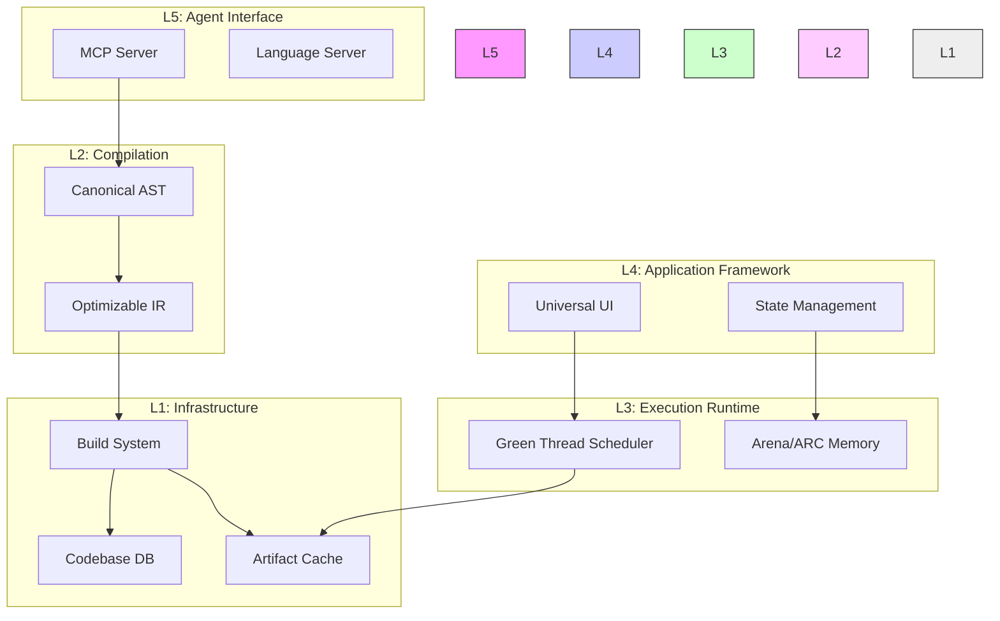

# Layering Architecture Document (LAD)

* System:** Morph Ecosystem
* Version:** 1.0.0-FINAL
* Architectural Style:** Strict Layered (Closed)
* Status:** Architecture Locked

- -

## 1. High-Level Stack Topology

The Morph architecture consists of **five distinct horizontal layers**.
Dependency flow is strictly **Top-to-Bottom**. A layer can only communicate with the layer directly beneath it (Closed Layering) to ensure modularity and replaceability.

| Layer ID | Layer Name                      | Primary Responsibility    | Key Components                                        |
| :------- | :------------------------------ | :------------------------ | :---------------------------------------------------- |
| **L5**   | **Agent Interface Layer**       | Communication & Semantics | MCP Server, LSP, Projectional Editor                  |
| **L4**   | **Application Framework Layer** | Logic & State Management  | Universal UI, BLoC, Supervisors, Routing              |
| **L3**   | **Execution Runtime Layer**     | Concurrency & Memory      | Actor Scheduler, Arena Allocator, ARC, FFI            |
| **L2**   | **Compilation Layer**           | Analysis & Optimization   | Canonical AST, Semantic Tree, MorphIR, OIR            |
| **L1**   | **Infrastructure Layer**        | Storage & Build           | MBS (Build System), MCM (Codebase DB), Artifact Cache |

- -

## 2. Layer Specifications

### 2.1 Layer 5: The Agent Interface Layer (Top)

* Role:** The "Senses" of the system. It translates high-level intent from Agents (or Humans) into structured data for the compiler.

- **L5.1 Model Context Protocol (MCP) Server:**
  - Acts as the API Gateway.
  - **Inbound:** Receives JSON-RPC commands (`patch_ast`, `query_symbol`).
  - **Outbound:** Streams structured diagnostics and accessibility trees.
- **L5.2 Language Server Protocol (LSP):**
  - Handles the **Projectional View** for human IDEs.
  - Decompiles AST $\rightarrow$ Verbose Human Syntax on the fly.
- **L5.3 Tabula Rasa Engine:**
  - Generates prompt context patches (RAG-retrieved docs + Contracts) to feed LLMs when they encounter unknown symbols.

### 2.2 Layer 4: The Application Framework Layer

* Role:** The "Business Logic" abstraction. It provides the standard library primitives that Agents use to construct software.

- **L4.1 Universal UI (MorphUI):**
  - Abstract Layout Engine (Flexbox-based).
  - **Render Backends:** DOM (Web), Skia (Native), TUI (Terminal).
- **L4.2 State Management (BLoC):**
  - Event Stream Processors.
  - State Transition definitions.
- **L4.3 Supervisor System:**
  - Declarative fault tolerance strategies (`OneForOne`).
  - Crash loop detection.

### 2.3 Layer 3: The Execution Runtime Layer

* Role:** The "Engine." It executes the logic with deterministic behavior. This layer is compiled into the final binary (`.mpx`).

- **L3.1 Green Thread Scheduler (M:N):**
  - Manages `logic` blocks (Actors).
  - Handles **Implicit Suspension** at I/O points.
  - **Preemptor:** Injects yield points into loops to prevent blocking.
- **L3.2 Memory Manager:**
  - **Arena Allocator:** Manages scope-local memory (linear allocation).
  - **ARC Engine:** Manages shared `val` objects.
- **L3.3 Observability Plane:**
  - **State Graph Recorder:** Captures variable history (Debug builds).
  - **Ring Buffer:** Captures crash telemetry (Release builds).

### 2.4 Layer 2: The Compilation Layer

* Role:** The "Translator." It converts high-level intent into optimized machine code.

- **L2.1 Frontend (Parser & Indexer):**
  - Parses Minimal Syntax $\rightarrow$ **Canonical AST**.
  - Computes Merkle Hashes for content addressing.
- **L2.2 Middle-End (Semantic Analysis):**
  - **Semantic Tree:** Symbol table and Type Checker.
  - **Contract Solver:** Validates `requires`/`ensures` clauses.
  - **Affinity Analyzer:** Infers Move Semantics vs. Copying.
- **L2.3 Backend (Optimizer):**
  - **MorphIR Emitter:** Generates stable bytecode.
  - **OIR Lowering:** Injects hardware traits (`SimdWidth`).
  - **Codegen:** LLVM / Wasm / PTX emission.

### 2.5 Layer 1: The Infrastructure Layer (Bottom)

* Role:** The "Foundation." It manages the physical storage and construction of artifacts.

- **L1.1 Morph Codebase Manager (MCM):**
  - SQLite/Vector DB storing the AST and Semantic Vectors.
  - Replaces the traditional file system.
- **L1.2 Morph Build System (MBS):**
  - **Graph Engine:** Resolves the Build Execution Graph.
  - **Sandbox Container:** Provides hermetic build environments.
- **L1.3 Artifact Cache:**
  - Content-Addressable Store for `.o` files, `.mar` libraries, and `.mpx` binaries.

- -

## 3. Cross-Cutting Concerns (Vertical Stacks)

Some features slice through multiple layers. These are managed via strictly defined **Vertical Interfaces**.

### 3.1 The Security Vertical

- **L5:** Authentication for MCP commands.
- **L4:** Logic Block isolation boundaries.
- **L3:** Memory safety (Capabilities) and Reference Counting.
- **L1:** Hermetic Sandboxing of the build process.

### 3.2 The Data Vertical

- **L5:** Presentation of Data (JSON).
- **L4:** BLoC State Definitions (`data` types).
- **L3:** In-memory representation (struct layout).
- **L2:** Type Checking and Serialization Generators.
- **L1:** Persistence of AST Data.

- -

## 4. Communication Interfaces

### 4.1 L5 $\leftrightarrow$ L4 (Intent to Logic)

- **Mechanism:** AST Generation.
- **Data:** The MCP (L5) generates AST nodes that utilize Standard Library primitives (L4).

### 4.2 L4 $\leftrightarrow$ L3 (Logic to Runtime)

- **Mechanism:** System Calls (Syscalls).
- **Data:** High-level `file.read()` (L4) translates to Runtime I/O Scheduler calls (L3).

### 4.3 L3 $\leftrightarrow$ L2 (Runtime to Compiler)

- **Mechanism:** Intrinsic Injection.
- **Data:** The Runtime (L3) relies on code generated by the Compiler (L2), specifically deserializers and state machines. _Note: In a running binary, L2 is absent, but L3 executes L2's output._

### 4.4 L2 $\leftrightarrow$ L1 (Compiler to Storage)

- **Mechanism:** Direct DB Access.
- **Data:** The Compiler (L2) queries the MCM (L1) for source code and writes artifacts to the Cache (L1).

- -

## 5. Deployment View

### 5.1 The Compiler Daemon (Dev Environment)

- **Contains:** L5, L2, L1.
- **Responsibility:** Editing, Compiling, Caching.

### 5.2 The Runtime Artifact (Prod Environment)

- **Contains:** L4, L3.
- **Responsibility:** Executing the `.mpx` binary. The Compiler (L2) and Interface (L5) are stripped out.

- -

## 6. Architecture Constraints

1.  **Violation of Layering:** L4 (Framework) MUST NOT access L1 (Storage) directly. It must go through L3 (Runtime) file abstractions.
2.  **Bypassing L2:** L5 (Agent) CANNOT write directly to L3 (Runtime Memory). It must modify the AST (L2), which re-compiles to L3 instructions.
3.  **Hermeticity:** L1 (Build) MUST NOT depend on L5 (Agent State). The build process must be stateless and deterministic.

- -

## 7. Diagrammatic Representation (Textual)

