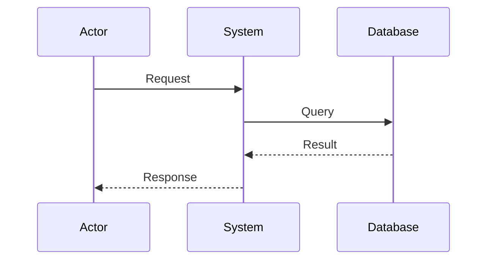
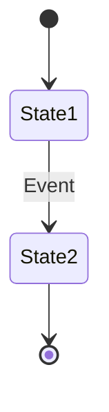
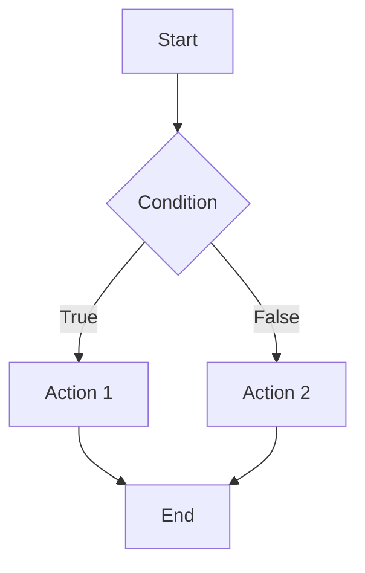
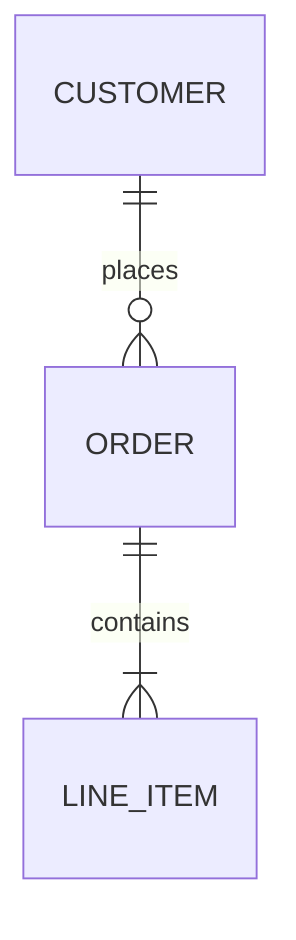
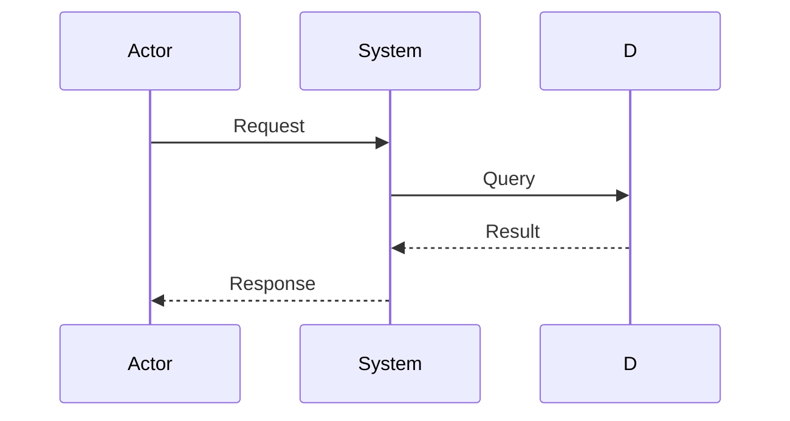
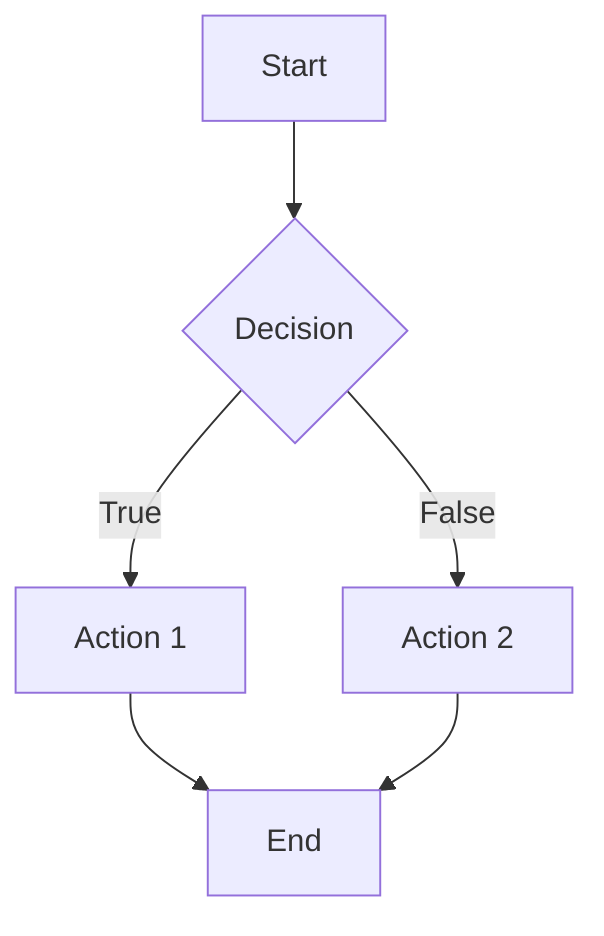

# Specification Convention Standard

- Document ID:* CONV-SPEC-001
- Version:* 2.0.0
- Status:* Active
- Effective Date:* 2026-01-01
- Standards Reference:* IEEE 830, IEEE 1016, IEEE 1471, IEEE 730, IEEE 829, ISO/IEC 29148, ISO/IEC 12207, ISO/IEC 26514, ISO/IEC 15939, ISO/IEC 25010, ISO/IEC 25012, ISO/IEC 15288, ISO/IEC 19514, ISO/IEC 19510, ISO/IEC 24765, CMMI, DO-178C, IEC 61508

---

## Table of Contents

1. [Purpose and Scope](#1-purpose-and-scope)
2. [Document Structure](#2-document-structure)
3. [Mathematical Notation Standards](#3-mathematical-notation-standards)
4. [Requirements Specification (EARS Pattern)](#4-requirements-specification-ears-pattern)
5. [Design Documentation Standards](#5-design-documentation-standards)
6. [Version Control and Change Management](#6-version-control-and-change-management)
7. [Quality Assurance and Review Process](#7-quality-assurance-and-review-process)
8. [Automated Formatting Standards](#8-automated-formatting-standards)
9. [Traceability Matrix](#9-traceability-matrix)
10. [Verification and Validation](#10-verification-and-validation)
11. [Risk Assessment](#11-risk-assessment)
12. [Security Specifications](#12-security-specifications)
13. [Performance Specifications](#13-performance-specifications)
14. [Maintainability Specifications](#14-maintainability-specifications)
15. [Precise Formatting Rules](#15-precise-formatting-rules)

---

## 1. Purpose and Scope

### 1.1 Purpose

This document establishes **Specification Convention Standard** for Morph project, ensuring all specification documents adhere to rigorous ISO/IEEE standards. This convention guarantees:

- **Consistency:** Uniform structure and notation across all specifications
- **Verifiability:** Every requirement is testable and measurable
- **Traceability:** Clear links between requirements, design, and implementation
- **Maintainability:** Clear version control and change management
- **Mathematical Rigor:** Formal definitions using established mathematical formalisms

### 1.2 Scope

This standard applies to all specification documents in `spec/` directory, including but not limited to:

- Language specifications
- Type system specifications
- Compiler architecture specifications
- Runtime system specifications
- Tooling specifications
- Mathematical foundation specifications

### 1.3 Applicable Standards

This convention is based on the following international standards:

- **IEEE 830:** Recommended Practice for Software Requirements Specifications
- **IEEE 1016:** Recommended Practice for Software Design Descriptions
- **IEEE 1471:** Recommended Practice for Architectural Description of Software-Intensive Systems
- **IEEE 730:** Recommended Practice for Software Quality Assurance
- **IEEE 829:** Recommended Practice for Software Test Documentation
- **ISO/IEC 29148:** Systems and software engineering — Life cycle processes — Requirements engineering
- **ISO/IEC 12207:** Systems and software engineering — Software life cycle processes
- **ISO/IEC 26514:** Systems and software engineering — Requirements for designers and developers of user documentation
- **ISO/IEC 15939:** Systems and software engineering — Measurement process
- **ISO/IEC 25010:** Systems and software Quality Requirements and Evaluation (SQuaRE) — Quality model
- **ISO/IEC 25012:** Systems and software Quality Requirements and Evaluation (SQuaRE) — Data Quality
- **ISO/IEC 15288:** Systems and Software Engineering Vocabulary
- **ISO/IEC 19514:** Architecture Description Language
- **ISO/IEC 19510:** Business Process Description Language
- **ISO/IEC 24765:** Systems and Software Engineering — Life Cycle Processes
- **CMMI:** Capability Maturity Model Integration
- **DO-178C:** Software Considerations in Airborne Systems and Equipment Certification
- **IEC 61508:** Functional Safety of Electrical/Electronic/Programmable Electronic Systems

---

## 2. Document Structure

### 2.1 Mandatory Document Header

Every specification document MUST begin with the following header block:

```markdown
# [Specification Title]

- File:* `spec/[filename].md`
- Version:* [X.Y.Z] (Semantic Versioning)
- Context:* Layer [N] ([Component Name])
- Formalism:* [Mathematical Formalism Used]
- Status:* [Draft | Active | Deprecated]
- Last Modified:* [YYYY-MM-DD]
- Author:* [Author Name]
- Reviewers:* [Reviewer Names]
```

- Requirements:*

* **File:** MUST match the actual filename exactly
* **Version:** MUST follow Semantic Versioning (MAJOR.MINOR.PATCH)
  - MAJOR: Incompatible changes
  - MINOR: Backwards-compatible additions
  - PATCH: Backwards-compatible bug fixes
* **Context:** MUST specify the architectural layer (1-5) and component
* **Formalism:** MUST specify the mathematical formalism (e.g., Category Theory, Graph Theory)
* **Status:** MUST be one of: Draft, Active, Deprecated

### 2.2 Section Hierarchy

Specifications MUST follow this hierarchical structure:

```markdown
## [N]. [Section Title]

### [N].[M]. [Subsection Title]

#### [N].[M].[P]. [Sub-subsection Title]
```

- Requirements:*

* Section numbers MUST be hierarchical (1, 1.1, 1.1.1)
* Section titles MUST be descriptive and concise
* Maximum nesting depth: 4 levels (####)

### 2.3 Mandatory Sections

Every specification MUST include the following sections (in order):

1. **Introduction** (Section 1)

   - Purpose
   - Scope
   - Definitions, Acronyms, and Abbreviations
   - References

2. **Formal Definitions** (Section 2)

   - Mathematical notation
   - Type signatures
   - Invariants

3. **Requirements** (Section 3)

   - Functional requirements (using EARS pattern)
   - Non-functional requirements
   - Constraints

4. **Design** (Section 4)

   - Architecture overview
   - Data structures
   - Algorithms
   - Mermaid diagrams (where applicable)

5. **Correctness Properties** (Section 5)

   - Invariants
   - Theorems
   - Proofs (or proof sketches)

6. **Examples** (Section 6)

   - Concrete examples
   - Use cases
   - Edge cases

---

## 3. Mathematical Notation Standards

### 3.1 LaTeX Formatting

All mathematical expressions MUST use LaTeX syntax within `$` (inline) or `$$` (block) delimiters.

- Examples:*

```markdown
Inline: Let $f: A \to B$ be a function.

Block:

$$
\sum_{i=1}^{n} x_i = \mu
$$
```

### 3.2 Symbol Naming Conventions

#### 3.2.1 Sets and Collections

- **Sets:** Uppercase letters ($A, B, C$)
- **Families of sets:** Calligraphic letters ($\mathcal{A}, \mathcal{B}, \mathcal{C}$)
- **Sequences:** Bold lowercase ($\mathbf{a}, \mathbf{b}, \mathbf{c}$)

#### 3.2.2 Functions and Mappings

- **Functions:** Lowercase letters ($f, g, h$)
- **Special functions:** Greek letters ($\mu, \lambda, \sigma$)
- **Function composition:** $\circ$ or `|>` (Morph-specific)

#### 3.2.3 Variables and Elements

- **Variables:** Lowercase letters ($x, y, z$)
- **Constants:** Uppercase letters ($X, Y, Z$)
- **Parameters:** Greek letters ($\alpha, \beta, \gamma$)

#### 3.2.4 Structures

- **Graphs:** Uppercase letters ($G, H$)
- **Nodes:** Lowercase letters ($v, u, w$)
- **Edges:** Lowercase letters ($e$) or tuples $(u, v)$
- **Trees:** Calligraphic letters ($\mathcal{T}$)

### 3.3 Type Signature Notation

Type signatures MUST follow this format:

```markdown
- Function Name:* $f: A \to B$

- Parameters:*

* $x \in A$: Description of parameter
* $y \in B$: Description of parameter

- Returns:*

* $C$: Description of return value
```

- Example:*

```markdown
- Hash Function:* $\mu: V \to \{0,1\}^{256}$

- Parameters:*

* $v \in V$: A node in the AST

- Returns:*

* A 256-bit content-addressing hash
```

### 3.4 Quantifier Usage

Quantifiers MUST be used precisely:

- **Universal quantifier:** $\forall$ (for all)
- **Existential quantifier:** $\exists$ (there exists)
- **Unique existential:** $\exists!$ (there exists exactly one)

- Examples:*

```markdown
$\forall v \in V, \exists! r \in R$ such that $r \to v$
```

### 3.5 Set Builder Notation

Set definitions MUST use set builder notation:

```markdown
$S = \{ x \in \mathbb{Z} \mid x > 0 \land x < 100 \}$
```

### 3.6 Logical Connectives

Logical connectives MUST be used consistently:

- $\land$: AND
- $\lor$: OR
- $\lnot$: NOT
- $\implies$: IMPLIES
- $\iff$: IF AND ONLY IF
- $\forall$: FOR ALL
- $\exists$: THERE EXISTS

---

## 4. Requirements Specification (EARS Pattern)

### 4.1 EARS Syntax Overview

All functional requirements MUST use the **Easy Approach to Requirements Syntax (EARS)** pattern, which ensures requirements are:

- **Atomic:** One requirement per statement
- **Unambiguous:** Clear and precise language
- **Testable:** Verifiable through testing
- **Traceable:** Unique identifiers

### 4.2 EARS Requirement Types

#### 4.2.1 Ubiquitous Requirements

- Pattern:* "THE system SHALL [requirement]"

- Example:*

```markdown
- REQ-001:* THE system SHALL maintain a single root node in the AST graph.
```

#### 4.2.2 Event-Driven Requirements

- Pattern:* "WHEN [trigger], THE system SHALL [requirement]"

- Example:*

```markdown
- REQ-002:* WHEN a node is modified, THE system SHALL recompute the hash of all ancestor nodes.
```

#### 4.2.3 State-Driven Requirements

- Pattern:* "WHILE [state], THE system SHALL [requirement]"

- Example:*

```markdown
- REQ-003:* WHILE the compiler is in optimization mode, THE system SHALL apply all available transformations.
```

#### 4.2.4 Optional Requirements

- Pattern:* "WHERE [condition], THE system SHALL [requirement]"

- Example:*

```markdown
- OPT-REQ-004:* WHERE the target architecture supports vectorization, THE system SHALL generate SIMD instructions.
```

### 4.3 Requirement Identification

Each requirement MUST have a unique identifier following this pattern:

```
[Component]-[Type]-[Number]
```

Where:

- **Component:** 3-4 letter abbreviation (e.g., AST, TYP, BLD)
- **Type:** REQ (requirement), CON (constraint), INV (invariant)
- **Number:** Sequential 3-digit number (001, 002, ...)

- Examples:*

- `AST-REQ-001`: AST requirement #1
- `TYP-INV-005`: Type invariant #5
- `BLD-CON-010`: Build constraint #10

### 4.4 Requirement Attributes

Each requirement MUST include the following attributes:

```markdown
- [REQ-ID]:* [Requirement Text]

- Priority:* [Critical | High | Medium | Low]
- Verification Method:* [Inspection | Analysis | Demonstration | Test]
- Rationale:* [Why this requirement exists]
- Dependencies:* [List of dependent requirements]
- Traceability:* [Links to design elements]
```

- Example:*

```markdown
- AST-REQ-001:* THE system SHALL maintain a single root node in the AST graph.

- Priority:* Critical
- Verification Method:* Inspection
- Rationale:* Ensures that the AST is a well-formed tree structure
- Dependencies:* None
- Traceability:* Section 2.1 (Graph Definition)
```

### 4.5 Non-Functional Requirements

Non-functional requirements MUST specify:

- **Performance:** Response time, throughput, resource usage
- **Reliability:** MTBF, MTTR, availability
- **Security:** Authentication, authorization, encryption
- **Maintainability:** Code quality, documentation
- **Scalability:** Load handling, growth capacity

- Example:*

```markdown
- AST-NFR-001:* THE system SHALL compute node hashes in O(1) time complexity.

- Priority:* High
- Verification Method:* Analysis
- Metric:* Hash computation time < 1μs per node
- Rationale:* Ensures efficient incremental compilation
```

---

## 5. Design Documentation Standards

### 5.1 Architecture Diagrams

All design documents MUST include Mermaid.js diagrams for:

- **Sequence Diagrams:** For interaction flows
- **State Diagrams:** For state machines
- **Flowcharts:** For algorithms
- **ER Diagrams:** For data relationships
- **Class Diagrams:** For type hierarchies

#### 5.1.1 Sequence Diagram Template



#### 5.1.2 State Diagram Template



#### 5.1.3 Flowchart Template



#### 5.1.4 ER Diagram Template



### 5.2 Data Structure Definitions

Data structures MUST be defined using mathematical notation:

```markdown
- Structure Name:* $S = (A, B, C)$

- Components:*

* $A \in \mathcal{A}$: Description
* $B \in \mathcal{B}$: Description
* $C \in \mathcal{C}$: Description

- Invariants:*

1. $\forall s \in S, \text{Invariant}_1(s)$
2. $\forall s \in S, \text{Invariant}_2(s)$
```

- Example:*

```markdown
- AST Node:* $N = (\tau, \mu, \chi)$

- Components:*

* $\tau \in T_{Node}$: Node type
* $\mu \in \{0,1\}^{256}$: Content hash
* $\chi \in N^*$: Ordered sequence of children

- Invariants:*

1. $\forall n \in N, \mu(n) = \text{SHA256}(\text{Content}(n) \parallel \mu(\chi_1) \parallel \dots \parallel \mu(\chi_k))$
2. $\forall n \in N, |\chi| < 1000$ (Maximum children limit)
```

### 5.3 Algorithm Specifications

Algorithms MUST be specified using:

1. **Mathematical notation** for core logic
2. **Pseudocode** for implementation details
3. **Complexity analysis** for performance characteristics

- Template:*

```markdown
- Algorithm Name:* [Name]

- Input:* [Input specification]
- Output:* [Output specification]

- Mathematical Definition:*

$$
\text{Algorithm}(x) = \begin{cases}
   \text{Result}_1 & \text{if } \text{Condition}_1(x) \\
   \text{Result}_2 & \text{if } \text{Condition}_2(x) \\
   \vdots & \vdots
   \end{cases}
   $$
```

- Pseudocode:*

````
function algorithm(x):
    if condition1(x):
        return result1
    elif condition2(x):
        return result2
    ...
```

- Complexity:**

- Time: $O(f(n))$
- Space: $O(g(n))$

- Correctness:**

- **Invariant:** [Loop invariant or state invariant]
- **Termination:** [Proof of termination]
```

### 5.4 Interface Specifications

Interfaces MUST be defined with:

1. **Type signatures**
2. **Preconditions**
3. **Postconditions**
4. **Error conditions**

- Template:*

```markdown
- Interface Name:* [Name]

- Signature:* $f: A \to B$

- Preconditions:*

* $\forall x \in A, \text{Precondition}_1(x)$
* $\forall x \in A, \text{Precondition}_2(x)$

- Postconditions:*

* $\forall x \in A, \text{Postcondition}_1(f(x))$
* $\forall x \in A, \text{Postcondition}_2(f(x))$

- Error Conditions:*

* If [condition], raise [Error]
* If [condition], return [ErrorValue]
```

---

## 6. Version Control and Change Management

### 6.1 Version Numbering

Specification versions MUST follow Semantic Versioning (SemVer):

```
MAJOR.MINOR.PATCH
```

- **MAJOR:** Incompatible API changes
- **MINOR:** Backwards-compatible functionality additions
- **PATCH:** Backwards-compatible bug fixes
```

### 6.2 Change Log

Each specification MUST maintain a change log at the end of the document:

```markdown
## Change Log

| Version | Date       | Author     | Changes                         |
| ------- | ---------- | ---------- | ------------------------------- |
| 1.0.0   | 2026-01-01 | John Doe   | Initial version                 |
| 1.1.0   | 2026-01-15 | Jane Smith | Added section on error handling |
| 1.1.1   | 2026-01-20 | John Doe   | Fixed typo in Section 3.2       |
```

### 6.3 Change Request Process

All changes to specifications MUST follow this process:

1. **Submit Change Request:** Create a GitHub issue with template
2. **Review:** Technical review by at least 2 reviewers
3. **Approval:** Approval by specification owner
4. **Update:** Update specification document
5. **Verify:** Run automated formatting and validation
6. **Commit:** Commit with descriptive message following convention

### 6.4 Commit Message Convention

Commit messages for specification changes MUST follow:

```
[Component]: [Brief description]

[Detailed description]

Closes #[Issue Number]
```

- Examples:*

```markdown
[AST]: Add hash recomputation invariant

Added requirement AST-INV-003 specifying that all ancestor
hashes must be recomputed when a node is modified.

Closes #123
```

---

## 7. Quality Assurance and Review Process

### 7.1 Review Checklist

Before a specification is marked as "Active", it MUST pass this checklist:

#### 7.1.1 Structure Checklist

- [ ] Document header is complete and accurate
- [ ] All mandatory sections are present
- [ ] Section numbering is correct and sequential
- [ ] Table of contents is up to date

#### 7.1.2 Content Checklist

- [ ] All requirements use EARS pattern
- [ ] All requirements have unique identifiers
- [ ] All requirements are testable
- [ ] Mathematical notation is correct and consistent
- [ ] All symbols are defined before use
- [ ] All invariants are clearly stated

#### 7.1.3 Formatting Checklist

- [ ] LaTeX syntax is correct
- [ ] Code blocks are properly formatted
- [ ] Mermaid diagrams are valid
- [ ] Links are working
- [ ] Spelling and grammar are correct

#### 7.1.4 Traceability Checklist

- [ ] Requirements trace to design elements
- [ ] Design elements trace to implementation
- [ ] All dependencies are documented
- [ ] Change log is up to date

### 7.2 Review Roles

#### 7.2.1 Author

- Creates the specification
- Ensures compliance with this convention
- Addresses review feedback

#### 7.2.2 Technical Reviewer

- Reviews technical accuracy
- Verifies mathematical correctness
- Checks consistency with other specifications

#### 7.2.3 Standards Reviewer

- Ensures compliance with this convention
- Checks formatting and structure
- Verifies completeness

#### 7.2.4 Approver

- Final approval for publication
- Ensures all reviews are complete
- Authorizes version bump

### 7.3 Review Process

1. **Draft Review:** Author creates draft, requests review
2. **Technical Review:** Technical reviewer reviews content
3. **Standards Review:** Standards reviewer reviews compliance
4. **Revision:** Author addresses feedback
5. **Approval:** Approver reviews and approves
6. **Publication:** Specification is marked as "Active"

---

## 8. Automated Formatting Standards

### 8.1 Markdown Formatting Rules

All markdown files MUST adhere to these formatting rules:

#### 8.1.1 Line Length

- Maximum line length: 120 characters
- Exception: Code blocks and URLs may exceed this limit

#### 8.1.2 Spacing

- One blank line between paragraphs
- No trailing whitespace
- One space after list markers
- Two spaces at end of line for line breaks in paragraphs

#### 8.1.3 Headings

- ATX-style headings (`#`, `##`, etc.)
- Exactly one space after `#` characters
- Heading levels must not skip (e.g., no `#` followed by `###`)

#### 8.1.4 Lists

- Use `-` for unordered lists
- Use `1.` for ordered lists
- Nested lists must be indented by 2 spaces

#### 8.1.5 Code Blocks

- Use triple backticks with language identifier
- Indent code blocks by 4 spaces when nested in lists

#### 8.1.6 Emphasis

- Use `*text*` for italic
- Use `**text**` for bold
- Do not use `_` for emphasis (reserved for LaTeX)

#### 8.1.7 Links

- Use reference-style links for repeated URLs
- Use inline links for one-time URLs

### 8.2 Automated Formatter

A Python script (`scripts/format_markdown.py`) MUST be used to automatically format all markdown files.

- Usage:*

```bash
python scripts/format_markdown.py [file_or_directory]
```

- Features:*

* Enforces line length limits
* Removes trailing whitespace
* Normalizes list formatting
* Fixes heading spacing
* Validates LaTeX syntax
* Validates Mermaid syntax
* Checks for broken links
```

### 8.3 VSCode Integration

The formatter MUST be integrated into VSCode via `.vscode/tasks.json`:

```json
{
  "version": "2.0.0",
  "tasks": [
    {
      "label": "Format Markdown",
      "type": "shell",
      "command": "python",
      "args": ["scripts/format_markdown.py", "${file}"],
      "group": "build",
      "presentation": {
        "reveal": "silent"
      }
    },
    {
      "label": "Format All Markdown",
      "type": "shell",
      "command": "python",
      "args": ["scripts/format_markdown.py", "."],
      "group": "build",
      "presentation": {
        "reveal": "silent"
      }
    }
  ]
}
```

### 8.4 Pre-commit Hook

A pre-commit hook MUST be configured to run the formatter on all markdown files before commit:

```bash
#!/bin/bash
# .git/hooks/pre-commit

python scripts/format_markdown.py .
git add -u
```

---

## 9. Quality Characteristics (ISO/IEC 25010)

### 9.1 Quality Model

All specifications MUST address the following quality characteristics as defined in ISO/IEC 25010:

#### 9.1.1 Functional Suitability

- **Functional Completeness:** The set of functions covers all specified tasks and user objectives
- **Functional Correctness:** Functions provide results with needed degree of precision
- **Functional Appropriateness:** Functions facilitate specified tasks and objectives

- Specification Requirement:*

```markdown
- Quality Attribute:* Functional Completeness
- Metric:* Percentage of specified features implemented
- Target:* 100%
- Verification Method:* Test
```

#### 9.1.2 Performance Efficiency

- **Time Behavior:** Response and processing times and throughput rates
- **Resource Utilization:** Amounts and types of resources used
- **Capacity:** Maximum limits of product parameters

- Specification Requirement:*

```markdown
- Quality Attribute:* Time Behavior
- Metric:* Operation execution time
- Target:* < 100ms for hash computation
- Verification Method:* Performance Test
```

#### 9.1.3 Compatibility

- **Co-existence:** Product can perform its required functions efficiently while sharing a common environment
- **Interoperability:** Two or more systems can exchange information and use the information

#### 9.1.4 Usability

- **Appropriateness Recognizability:** Users can recognize whether the product is appropriate
- **Learnability:** Users can learn to use the product
- **Operability:** Users can operate and control the product
- **User Error Protection:** System protects users against making errors
- **User Interface Aesthetics:** User interface enables pleasing interaction
- **Accessibility:** Product can be used by people with disabilities

#### 9.1.5 Reliability

- **Maturity:** System meets needs for reliability under normal operation
- **Availability:** System is available and operable when needed
- **Fault Tolerance:** System operates as intended despite hardware or software faults
- **Recoverability:** System can recover data and re-establish state of system after failure

- Specification Requirement:*

```markdown
- Quality Attribute:* Availability
- Metric:* Uptime percentage
- Target:* 99.9%
- Verification Method:* Monitoring
```

#### 9.1.6 Security

- **Confidentiality:** Product ensures that data are accessible only to those authorized
- **Integrity:** Product prevents unauthorized modification of data
- **Non-repudiation:** Actions or events can be proven to have taken place
- **Accountability:** Actions of an entity can be traced uniquely
- **Authenticity:** Identity of a subject or resource can be proved

- Specification Requirement:*

```markdown
- Quality Attribute:* Security
- Metric:* Number of security vulnerabilities
- Target:* 0 critical vulnerabilities
- Verification Method:* Security Audit
```

#### 9.1.7 Maintainability

- **Modularity:** System is composed of discrete components
- **Reusability:** Assets can be used in more than one system
- **Analyzability:** System can be diagnosed for deficiencies or causes of failures
- **Modifiability:** System can be modified without introducing defects
- **Testability:** System can be validated

- Specification Requirement:*

```markdown
- Quality Attribute:* Maintainability
- Metric:* Mean time to fix defects
- Target:* < 4 hours
- Verification Method:* Analysis
```

### 9.1.11 Pragmatic Considerations

#### 9.1.11.1 Purpose

This section provides guidance on balancing formal verification rigor with practical developer experience. While formal correctness is essential, specifications must also be pragmatic and implementable.

#### 9.1.11.2 Principles

1. **Formal Correctness First:** Mathematical rigor and formal proofs are the foundation of specification correctness. Never compromise formal correctness for the sake of simplicity.
2. **Pragmatic Implementation Second:** After establishing formal correctness, provide practical guidance for implementation. Include examples, edge cases, and common pitfalls.
3. **Developer Experience Matters:** Specifications should be readable and understandable to developers. Avoid excessive abstraction that obscures implementation details.
4. **Testability is Paramount:** Every requirement must be verifiable through testing. Untestable requirements are useless.
5. **Balance Theory and Practice:** Connect theoretical foundations to practical implementation. Explain why a formalism matters and how it applies in practice.

#### 9.1.11.3 Pragmatic Guidelines

**PRAG-001:** Specifications SHALL include concrete examples alongside formal definitions.

- **Rationale:** Examples bridge the gap between theory and practice, helping developers understand how to implement formal requirements.

- **Verification Method:** Review

**PRAG-002:** Specifications SHALL document common implementation pitfalls and how to avoid them.

- **Rationale:** Proactive guidance prevents common errors and reduces development time.

- **Example:**

```markdown
- Pitfall:* Forgetting to handle edge cases in algebraic axioms (e.g., empty data structures).
- Avoidance:* Always include explicit handling for empty/invalid inputs in axioms and examples.
```

**PRAG-003:** Specifications SHALL provide performance characteristics alongside correctness guarantees.

- **Rationale:** Correctness without performance is often impractical. Developers need to understand both dimensions.

- **Example:**

```markdown
- Correctness:* Stack operations satisfy all algebraic axioms.
- Performance:* Push operation is O(1) amortized, pop operation is O(1) worst-case.
```

**PRAG-004:** Specifications SHALL balance mathematical rigor with readability.

- **Rationale:** Overly formal notation can alienate developers. Use clear, consistent notation and explain symbols when first introduced.

- **Guidelines:**

* Define all symbols before use
* Use consistent notation throughout
* Provide plain-language explanations for complex formulas
* Include diagrams to visualize abstract concepts

**PRAG-005:** Specifications SHALL include migration and evolution guidance.

- **Rationale:** Systems evolve. Specifications should anticipate change and provide clear paths for evolution.

- **Example:**

```markdown
- Migration Path:* When adding new operations to an algebra, maintain backward compatibility through conservative extension.
- Evolution Strategy:* Use semantic versioning to signal breaking changes.
```

**PRAG-006:** Specifications SHALL distinguish between mandatory requirements and implementation suggestions.

- **Rationale:** Mandatory requirements must be satisfied. Implementation suggestions are recommendations that can be adapted to specific contexts.

- **Example:**

```markdown
- Mandatory:* THE system SHALL enforce Stack algebra axioms.
- Suggestion:* Consider using linked list implementation for better cache locality.
```

**PRAG-007:** Specifications SHALL provide tooling and automation guidance where applicable.

- **Rationale:** Automation reduces human error and ensures consistency. Specifications should leverage tooling where possible.

- **Example:**

```markdown
- Tooling:* Use automated theorem provers for verifying complex invariants.
- Automation:* Generate test cases automatically from algebraic axioms.
```

#### 9.1.11.4 Pragmatic Review Checklist

Before marking a specification as "Active", verify:

- [ ] Formal definitions are mathematically sound
- [ ] Concrete examples are provided for all key concepts
- [ ] Common pitfalls are documented
- [ ] Performance characteristics are specified
- [ ] Implementation guidance is practical and actionable
- [ ] Mathematical notation is explained when first introduced
- [ ] Balance between theory and practice is maintained
- [ ] Requirements are testable and verifiable
- [ ] Developer experience is considered (readability, clarity)
- [ ] Migration and evolution paths are clear

#### 9.1.11.5 Quality Metrics for Pragmatism

**PRAG-MET-001:** Example Coverage

- **Definition:** Percentage of key concepts with concrete examples
- **Formula:** `(Concepts with Examples / Total Key Concepts) × 100%`
- **Target:** ≥ 80%
- **Verification Method:** Review

**PRAG-MET-002:** Pitfall Documentation

- **Definition:** Number of documented common pitfalls
- **Target:** ≥ 5 per specification
- **Verification Method:** Review

**PRAG-MET-003:** Performance Specification

- **Definition:** Percentage of requirements with performance characteristics
- **Formula:** `(Requirements with Performance / Total Requirements) × 100%`
- **Target:** ≥ 60%
- **Verification Method:** Review
```

### 9.1.8 Portability

- **Adaptability:** System can be adapted for different specified environments
- **Installability:** System can be installed in a specified environment
- **Replaceability:** System can replace another specified system for the same purpose

- Specification Requirement:*

```markdown
- Quality Attribute:* Portability
- Metric:* Number of supported platforms
- Target:* 3+ platforms
- Verification Method:* Demonstration
```

## 10. Measurement and Metrics (ISO/IEC 15939)

### 10.1 Measurement Process

All specifications MUST define measurable attributes following ISO/IEC 15939:

#### 10.1.1 Measurement Information Model

```markdown
* Entity:* [What is being measured]
* Attribute:* [Characteristic of the entity]
* Base Measure:* [Direct measurement]
* Derived Measure:* [Calculated from base measures]
* Indicator:* [Provides interpretation of measures]
```

#### 10.1.2 Measurement Categories

- Process Measures:*

* Effort (person-hours)
* Schedule variance
* Defect density
* Review coverage

- Product Measures:*

* Lines of code (LOC)
* Cyclomatic complexity
* Test coverage
* Documentation completeness

- Project Measures:*

* Budget variance
* Milestone achievement
* Risk exposure

### 10.2 Metric Specification Template

```markdown
- Metric Name:* [Name]

- Metric ID:* [MET-XXX]

- Purpose:* [Why this metric is collected]

- Entity:* [What is measured]

- Attribute:* [Characteristic being measured]

- Base Measure:* [Direct measurement formula]

- Scale:* [Nominal | Ordinal | Interval | Ratio]

- Unit:* [Unit of measurement]

- Collection Method:* [How data is collected]

- Frequency:* [When data is collected]

- Thresholds:*

* **Target:** [Desired value]
* **Warning:** [Warning threshold]
* **Critical:** [Critical threshold]

- Interpretation:* [How to interpret results]
```

### 10.3 Mandatory Metrics for Specifications

All specifications MUST include these metrics:

1. **Completeness Metric:**

    - **Formula:** `(Implemented Requirements / Total Requirements) × 100%`
    - **Target:** 100%

2. **Test Coverage Metric:**

    - **Formula:** `(Tested Requirements / Total Requirements) × 100%`
    - **Target:** 100%

3. **Review Coverage Metric:**

    - **Formula:** `(Reviewed Sections / Total Sections) × 100%`
    - **Target:** 100%
```

## 11. Architectural Description (IEEE 1471)

### 11.1 Architectural Views

All specifications MUST include architectural views as defined in IEEE 1471:

#### 11.1.1 Stakeholder Identification

```markdown
## Stakeholders

| Stakeholder | Concerns           | Viewpoint        |
| ----------- | ------------------ | ---------------- |
| [Name]      | [List of concerns] | [Viewpoint name] |
```

#### 11.1.2 Architectural Viewpoints

- **Module Viewpoint:**

* Focuses on decomposition of system into modules
* Shows relationships between modules
* Addresses concerns about code organization

- **Component-and-Connector Viewpoint:**

* Focuses on runtime elements and their interactions
* Shows components and connectors
* Addresses concerns about runtime behavior

- **Allocation Viewpoint:**

* Focuses on mapping of software elements to hardware
* Shows deployment structure
* Addresses concerns about physical distribution

### 11.2 Architectural Description Template

```markdown
## Architecture Overview

### Stakeholders and Concerns

| Stakeholder | Concern 1, Concern 2, ...   |
| ----------- | --------------------------- |

### Architectural Views

#### [View Name] View

- Viewpoint:* [Viewpoint name]
- Stakeholders:* [List of stakeholders]
- Concerns Addressed:* [List of concerns]
- Description:* [Description of the view]
- Diagram:* [Mermaid diagram]
- Key Elements:*
- Relationships:*
```

## 12. Documentation Requirements (ISO/IEC 26514)

### 12.1 Documentation Quality

All documentation MUST meet ISO/IEC 26514 requirements:

#### 12.1.1 Documentation Characteristics

- **Completeness:** All necessary information is present
- **Correctness:** Information is accurate and error-free
- **Consistency:** Information is consistent within and across documents
- **Clarity:** Information is understandable to the intended audience
- **Conciseness:** Information is presented without unnecessary detail
- **Relevance:** Information is pertinent to the user's needs
- **Traceability:** Information can be traced to its source

#### 12.1.2 Documentation Structure

```markdown
## Document Structure

### Front Matter
- Title page
- Document control
- Table of contents
- List of figures
- List of tables

### Body
- Introduction
- Main content (organized by section)
- Appendices

### Back Matter
- Glossary
- References
- Index
```

### 12.2 Documentation Review Checklist

Before publication, all documentation MUST pass this checklist:

#### 12.2.1 Content Review

- [ ] All sections are complete
- [ ] All requirements are traceable
- [ ] All diagrams are accurate
- [ ] All examples are correct
- [ ] All references are valid

#### 12.2.2 Style Review

- [ ] Language is clear and concise
- [ ] Terminology is consistent
- [ ] Acronyms are defined
- [ ] Grammar and spelling are correct
- [ ] Formatting is consistent

#### 12.2.3 Technical Review

- [ ] Technical accuracy verified
- [ ] Mathematical notation correct
- [ ] Code examples compile
- [ ] Diagrams render correctly
- [ ] Links are working

---

## 13. Traceability Matrix

### 13.1 Purpose

The traceability matrix provides a systematic approach to linking requirements throughout the software development lifecycle, ensuring that every requirement is:

- **Traced:** Linked to design elements, implementation artifacts, and test cases
- **Verified:** Confirmed through testing or inspection
- **Validated:** Confirmed to meet stakeholder needs
- **Maintained:** Kept up-to-date as requirements evolve

### 13.2 Traceability Requirements

All specifications MUST maintain traceability links across the following dimensions:

#### 13.2.1 Requirements to Design Traceability

Every requirement MUST be linked to one or more design elements that implement it.

- **Requirements:**

* Each requirement MUST have at least one design element reference
* Design elements MUST be identified by section number or diagram reference
* Links MUST be bidirectional (requirement → design, design → requirement)
* Orphaned requirements (no design link) MUST be flagged

- **Example:**

```markdown
- AST-REQ-001:* THE system SHALL maintain a single root node in the AST graph.

- Traceability:*
  - Design: Section 2.1 (Graph Definition)
  - Design: Figure 3.1 (AST Structure Diagram)
```

#### 13.2.2 Requirements to Implementation Traceability

Every requirement MUST be linked to implementation artifacts (code modules, functions, classes).

- **Requirements:**

* Each requirement MUST have at least one implementation reference
* Implementation references MUST include file path and line numbers where applicable
* Links MUST be maintained in code comments or documentation
* Unimplemented requirements MUST be clearly marked

- **Example:**

```markdown
- AST-REQ-001:* THE system SHALL maintain a single root node in the AST graph.

- Traceability:*
  - Implementation: `src/ast/graph.py:45-52` (RootNode class)
  - Implementation: `src/ast/builder.py:120-135` (Root initialization)
```

#### 13.2.3 Requirements to Test Traceability

Every requirement MUST be linked to one or more test cases that verify it.

- **Requirements:**

* Each requirement MUST have at least one test case reference
* Test cases MUST be identified by test file and test function name
* Test coverage MUST be tracked and reported
* Untested requirements MUST be flagged

- **Example:**

```markdown
- AST-REQ-001:* THE system SHALL maintain a single root node in the AST graph.

- Traceability:*
  - Test: `tests/test_ast_graph.py::test_single_root_node`
  - Test: `tests/test_ast_builder.py::test_root_initialization`
```

### 13.3 Traceability Matrix Template

All specifications MUST include a traceability matrix in an appendix or separate document:

```markdown
## Traceability Matrix

### Requirements to Design

| Requirement ID | Requirement Text | Design Reference | Status |
| -------------- | ---------------- | ---------------- | ------ |
| AST-REQ-001    | Single root node | Section 2.1     | Linked |
| AST-REQ-002    | Hash recomputation | Section 3.2     | Linked |
| ...            | ...              | ...              | ...    |

### Requirements to Implementation

| Requirement ID | Implementation Reference | File Path | Status |
| -------------- | ----------------------- | ---------- | ------ |
| AST-REQ-001    | RootNode class          | src/ast/graph.py | Implemented |
| AST-REQ-002    | recompute_hash()       | src/ast/hash.py | Implemented |
| ...            | ...                    | ...              | ...    |

### Requirements to Tests

| Requirement ID | Test Case | Test File | Status |
| -------------- | --------- | --------- | ------ |
| AST-REQ-001    | test_single_root_node | tests/test_ast_graph.py | Passed |
| AST-REQ-002    | test_hash_recomputation | tests/test_ast_hash.py | Passed |
| ...            | ...                  | ...                    | ...    |
```

### 13.4 Traceability Status Values

The following status values MUST be used in traceability matrices:

- **Linked:** Requirement is linked to the target artifact
- **Implemented:** Requirement is implemented in code
- **Tested:** Requirement has passing tests
- **Pending:** Requirement is not yet linked/implemented/tested
- **Deprecated:** Requirement is no longer active
- **Blocked:** Requirement is blocked by dependency

### 13.5 Traceability Maintenance

Traceability information MUST be maintained throughout the project lifecycle:

- **On Requirement Addition:**
  1. Create requirement with unique ID
  2. Add to traceability matrix
  3. Mark status as "Pending"
  4. Update status as design, implementation, and tests progress

- **On Requirement Modification:**
  1. Update requirement text
  2. Review and update all traceability links
  3. Verify that linked artifacts still satisfy the requirement
  4. Update change log

- **On Requirement Deletion:**
  1. Mark requirement as "Deprecated" (do not delete)
  2. Document reason for deprecation
  3. Review impact on dependent requirements
  4. Update traceability matrix

### 13.6 Traceability Validation

Before a specification is marked as "Active", the following validation MUST be performed:

- [ ] All requirements have design links
- [ ] All requirements have implementation links
- [ ] All requirements have test links
- [ ] No orphaned requirements exist
- [ ] No orphaned design elements exist
- [ ] All traceability links are bidirectional
- [ ] Traceability matrix is up-to-date
- [ ] Change log reflects all traceability changes

### 13.7 Automated Traceability Tools

Where possible, automated tools SHOULD be used to maintain traceability:

- **Static Analysis:** Extract requirement IDs from code comments
- **Test Coverage:** Link test cases to requirements via naming conventions
- **Documentation Generation:** Auto-generate traceability matrices
- **Change Impact Analysis:** Identify affected requirements when code changes

- **Example Tool Integration:**

```python
# Example: Extracting requirement IDs from code comments
import re

def extract_requirements_from_file(filepath):
    """Extract requirement IDs from code comments."""
    with open(filepath, 'r') as f:
        content = f.read()
    
    # Pattern: # REQ-ID: or // REQ-ID:
    pattern = r'(?:#|//)\s*([A-Z]{3,4}-(?:REQ|CON|INV)-\d{3})'
    matches = re.findall(pattern, content)
    return matches
```

---

## 14. Verification and Validation

### 14.1 Purpose

Verification and Validation (V&V) are critical processes that ensure specifications and implementations meet stakeholder needs and requirements:

- **Verification:** "Are we building the product right?" - Confirms that the system meets specifications
- **Validation:** "Are we building the right product?" - Confirms that the system meets stakeholder needs

### 14.2 Verification Plan

Every specification MUST include a verification plan that defines how requirements will be verified.

#### 14.2.1 Verification Methods

The following verification methods MUST be used as appropriate:

- **Inspection:** Manual review of documents, code, or design
  - Use for: Requirements review, design review, code review
  - Deliverable: Review checklist with findings

- **Analysis:** Mathematical or logical analysis of properties
  - Use for: Complexity analysis, formal verification, performance modeling
  - Deliverable: Analysis report with conclusions

- **Demonstration:** Showing that system works in specific scenarios
  - Use for: User interface, workflow validation, integration testing
  - Deliverable: Demonstration script and results

- **Test:** Automated or manual testing of system behavior
  - Use for: Functional testing, performance testing, security testing
  - Deliverable: Test cases, test results, coverage reports

#### 14.2.2 Verification Plan Template

All specifications MUST include a verification plan:

```markdown
## Verification Plan

### Verification Methods

| Requirement ID | Method | Description | Responsibility | Schedule |
| -------------- | ------- | ----------- | -------------- | -------- |
| AST-REQ-001    | Test    | Unit tests for root node | QA Team | Week 2 |
| AST-REQ-002    | Analysis | Complexity analysis | Architect | Week 3 |
| ...            | ...     | ...                  | ...       | ...    |

### Verification Criteria

Each requirement MUST have defined acceptance criteria:

- **AST-REQ-001:** Single root node
  - Criteria: All test cases pass, code coverage ≥ 90%
  - Method: Automated unit tests
  - Evidence: Test report with coverage metrics

- **AST-REQ-002:** Hash recomputation
  - Criteria: O(1) time complexity, no memory leaks
  - Method: Performance analysis
  - Evidence: Profiling report

### Verification Schedule

| Phase | Activities | Start Date | End Date | Deliverables |
| ------ | ----------- | ----------- | --------- | ------------ |
| Design Review | Review design documents | 2026-01-15 | 2026-01-20 | Review report |
| Unit Testing | Write and run unit tests | 2026-01-21 | 2026-02-01 | Test results |
| Integration Testing | Test component integration | 2026-02-02 | 2026-02-10 | Integration report |
| ... | ... | ... | ... | ... |
```

#### 14.2.3 Verification Requirements

All specifications MUST meet these verification requirements:

- **VREQ-001:** Every requirement MUST have at least one verification method
- **VREQ-002:** Verification methods MUST be appropriate to requirement type
- **VREQ-003:** Verification criteria MUST be measurable and objective
- **VREQ-004:** Verification schedule MUST be realistic and achievable
- **VREQ-005:** Verification results MUST be documented and archived

### 14.3 Validation Plan

Every specification MUST include a validation plan that confirms stakeholder needs are met.

#### 14.3.1 Validation Activities

The following validation activities MUST be performed:

- **Stakeholder Review:** Review with stakeholders to confirm understanding
  - Purpose: Ensure requirements accurately reflect stakeholder needs
  - Participants: Stakeholders, requirements analyst, project manager
  - Deliverable: Signed-off requirements document

- **Prototype Review:** Review prototypes or mockups with stakeholders
  - Purpose: Validate design decisions and user experience
  - Participants: Stakeholders, designers, developers
  - Deliverable: Prototype feedback report

- **User Acceptance Testing:** Testing by actual users
  - Purpose: Confirm system meets user needs in real-world scenarios
  - Participants: End users, QA team
  - Deliverable: User acceptance test report

- **Field Testing:** Testing in production-like environment
  - Purpose: Validate system behavior under realistic conditions
  - Participants: Operations team, selected users
  - Deliverable: Field test report

#### 14.3.2 Validation Plan Template

All specifications MUST include a validation plan:

```markdown
## Validation Plan

### Stakeholder Identification

| Stakeholder | Role | Concerns | Validation Method |
| ----------- | ---- | --------- | ---------------- |
| End Users | Use system daily | Usability, performance | User acceptance testing |
| Operators | Maintain system | Reliability, maintainability | Field testing |
| Architects | Design system | Scalability, modularity | Prototype review |
| ... | ... | ... | ... |

### Validation Criteria

Each stakeholder concern MUST have defined acceptance criteria:

- **End User Concern:** System is easy to use
  - Criteria: Task completion time < 5 minutes, error rate < 2%
  - Method: User acceptance testing
  - Evidence: User satisfaction survey, task completion metrics

- **Operator Concern:** System is reliable
  - Criteria: Uptime ≥ 99.9%, MTBF ≥ 720 hours
  - Method: Field testing
  - Evidence: Monitoring reports, incident logs

### Validation Schedule

| Activity | Participants | Start Date | End Date | Deliverables |
| -------- | ------------- | ----------- | --------- | ------------ |
| Stakeholder Review | All stakeholders | 2026-01-10 | 2026-01-12 | Signed requirements |
| Prototype Review | Stakeholders, designers | 2026-02-01 | 2026-02-05 | Feedback report |
| User Acceptance Testing | End users, QA | 2026-03-01 | 2026-03-15 | UAT report |
| ... | ... | ... | ... | ... |
```

#### 14.3.3 Validation Requirements

All specifications MUST meet these validation requirements:

- **VREQ-006:** Every stakeholder concern MUST have a validation method
- **VREQ-007:** Validation criteria MUST be measurable and objective
- **VREQ-008:** Validation MUST involve actual stakeholders or users
- **VREQ-009:** Validation results MUST be documented and archived
- **VREQ-010:** Validation failures MUST trigger requirement revision

### 14.4 Acceptance Criteria

All specifications MUST define clear acceptance criteria for each requirement:

#### 14.4.1 Acceptance Criteria Template

```markdown
- [REQ-ID]:* [Requirement Text]

- Acceptance Criteria:*

1. **Criterion 1:** [Specific, measurable condition]
   - Measurement: [How to measure]
   - Target: [Target value]
   - Evidence: [Required evidence]

2. **Criterion 2:** [Specific, measurable condition]
   - Measurement: [How to measure]
   - Target: [Target value]
   - Evidence: [Required evidence]

- Verification Method:* [Inspection | Analysis | Demonstration | Test]
- Validation Method:* [Stakeholder review | Prototype review | UAT | Field testing]
```

#### 14.4.2 Acceptance Criteria Example

```markdown
- AST-REQ-001:* THE system SHALL maintain a single root node in the AST graph.

- Acceptance Criteria:*

1. **Criterion 1:** AST graph has exactly one root node
   - Measurement: Count root nodes in graph
   - Target: 1 root node
   - Evidence: Unit test output

2. **Criterion 2:** Root node is accessible from graph API
   - Measurement: Call get_root() method
   - Target: Returns non-null value
   - Evidence: Integration test log

- Verification Method:* Test
- Validation Method:* Stakeholder review
```

### 14.5 V&V Reporting

All verification and validation activities MUST be documented:

#### 14.5.1 Verification Report Template

```markdown
## Verification Report

- Specification:* [Specification Name]
- Version:* [X.Y.Z]
- Date:* [YYYY-MM-DD]
- Verifier:* [Name]

### Summary

- Total Requirements: [N]
- Requirements Verified: [M]
- Requirements Failed: [K]
- Verification Coverage: [M/N × 100%]

### Detailed Results

| Requirement ID | Method | Result | Evidence | Issues |
| -------------- | ------- | ------ | -------- | ------ |
| AST-REQ-001    | Test    | Pass   | Test report | None |
| AST-REQ-002    | Analysis | Pass   | Analysis report | None |
| ...            | ...     | ...    | ...        | ...    |

### Issues and Recommendations

- [Issue 1]: Description, impact, recommendation
- [Issue 2]: Description, impact, recommendation

### Conclusion

[Overall assessment and recommendation for approval]
```

#### 14.5.2 Validation Report Template

```markdown
## Validation Report

- Specification:* [Specification Name]
- Version:* [X.Y.Z]
- Date:* [YYYY-MM-DD]
- Validator:* [Name]

### Summary

- Total Stakeholder Concerns: [N]
- Concerns Validated: [M]
- Concerns Failed: [K]
- Validation Coverage: [M/N × 100%]

### Detailed Results

| Concern | Stakeholder | Method | Result | Feedback |
| ------- | ----------- | ------- | ------ | -------- |
| Usability | End Users | UAT | Pass | Positive feedback |
| Reliability | Operators | Field testing | Pass | Meets targets |
| ... | ... | ... | ... | ... |

### Stakeholder Feedback

- [Stakeholder 1]: Summary of feedback
- [Stakeholder 2]: Summary of feedback

### Issues and Recommendations

- [Issue 1]: Description, impact, recommendation
- [Issue 2]: Description, impact, recommendation

### Conclusion

[Overall assessment and recommendation for approval]
```

### 14.6 V&V Process Integration

Verification and validation MUST be integrated into the development lifecycle:

1. **Requirements Phase:**
   - Validate requirements with stakeholders
   - Verify requirements are complete and consistent

2. **Design Phase:**
   - Verify design meets requirements
   - Validate design decisions with stakeholders

3. **Implementation Phase:**
   - Verify implementation meets design
   - Validate implementation with users

4. **Testing Phase:**
   - Verify tests cover all requirements
   - Validate test results meet acceptance criteria

5. **Deployment Phase:**
   - Verify deployment meets operational requirements
   - Validate system in production environment

---

## 15. Risk Assessment

### 15.1 Purpose

Risk assessment is a systematic process for identifying, analyzing, and mitigating risks that could impact project success. All specifications MUST include a risk assessment to:

- **Identify:** Potential risks before they become problems
- **Analyze:** Understand likelihood and impact of each risk
- **Mitigate:** Develop strategies to reduce risk probability or impact
- **Monitor:** Track risks throughout project lifecycle
- **Respond:** Take action when risks materialize

### 15.2 Risk Identification

All specifications MUST identify potential risks in following categories:

#### 15.2.1 Technical Risks

Risks related to technology, architecture, or implementation:

- **Complexity Risk:** System complexity exceeds team capability
- **Technology Risk:** New or unproven technology
- **Integration Risk:** Difficulty integrating with existing systems
- **Performance Risk:** System may not meet performance requirements
- **Scalability Risk:** System may not scale to required load

#### 15.2.2 Project Risks

Risks related to project management and execution:

- **Schedule Risk:** Project may not be completed on time
- **Resource Risk:** Insufficient resources (people, budget, equipment)
- **Scope Risk:** Requirements may change or expand
- **Dependency Risk:** External dependencies may fail or delay

#### 15.2.3 Organizational Risks

Risks related to organization and stakeholders:

- **Stakeholder Risk:** Stakeholders may change requirements or priorities
- **Communication Risk:** Poor communication leads to misunderstandings
- **Skill Risk:** Team lacks required skills or expertise
- **Turnover Risk:** Key personnel may leave the project

#### 15.2.4 External Risks

Risks from external sources:

- **Regulatory Risk:** Changes in regulations or standards
- **Market Risk:** Market conditions may change
- **Vendor Risk:** Third-party vendors may fail or change terms
- **Security Risk:** Security vulnerabilities or attacks

### 15.3 Risk Analysis

Each identified risk MUST be analyzed for probability and impact.

#### 15.3.1 Probability Assessment

Assess the likelihood of each risk occurring:

- **Very High (VH):** > 70% probability
- **High (H):** 50-70% probability
- **Medium (M):** 30-50% probability
- **Low (L):** 10-30% probability
- **Very Low (VL):** < 10% probability

#### 15.3.2 Impact Assessment

Assess the severity of impact if risk occurs:

- **Critical (C):** Project failure, major financial loss, safety issues
- **High (H):** Significant schedule delay, budget overrun, major rework
- **Medium (M):** Moderate schedule delay, budget increase, some rework
- **Low (L):** Minor schedule impact, small budget increase, minimal rework
- **Negligible (N):** No significant impact

#### 15.3.3 Risk Score Calculation

Calculate risk score using probability and impact:

$$
\text{Risk Score} = \text{Probability} \times \text{Impact}
$$

Where:
- Probability: VH=5, H=4, M=3, L=2, VL=1
- Impact: C=5, H=4, M=3, L=2, N=1

- **Risk Score Interpretation:**

* 25: Extreme risk - Immediate action required
* 16-20: High risk - Priority mitigation
* 9-15: Medium risk - Monitor and plan mitigation
* 4-8: Low risk - Accept and monitor
* 1-3: Very low risk - Accept

### 15.4 Risk Mitigation

Each risk MUST have a mitigation strategy.

#### 15.4.1 Mitigation Strategies

- **Avoid:** Eliminate risk by changing plans or approach
- **Transfer:** Shift risk to third party (insurance, outsourcing)
- **Mitigate:** Reduce probability or impact through actions
- **Accept:** Acknowledge risk and prepare contingency plan

#### 15.4.2 Mitigation Plan Template

Each risk MUST have a documented mitigation plan:

```markdown
- Risk ID:* RISK-XXX

- Risk Description:* [Clear description of risk]

- Category:* [Technical | Project | Organizational | External]

- Probability:* [VH | H | M | L | VL]

- Impact:* [C | H | M | L | N]

- Risk Score:* [1-25]

- Mitigation Strategy:* [Avoid | Transfer | Mitigate | Accept]

- Mitigation Actions:*

1. [Action 1]: Description, owner, due date
2. [Action 2]: Description, owner, due date
3. [Action 3]: Description, owner, due date

- Contingency Plan:* [Actions to take if risk materializes]

- Owner:* [Person responsible for monitoring]

- Status:* [Open | In Progress | Closed | Materialized]
```

#### 15.4.3 Mitigation Examples

```markdown
- Risk ID:* RISK-001

- Risk Description:* New compiler optimization technology may not meet performance targets

- Category:* Technical

- Probability:* H

- Impact:* H

- Risk Score:* 16

- Mitigation Strategy:* Mitigate

- Mitigation Actions:*

1. Conduct proof-of-concept evaluation (Owner: Architect, Due: Week 2)
2. Develop fallback optimization approach (Owner: Lead Dev, Due: Week 4)
3. Establish performance benchmarks early (Owner: QA, Due: Week 3)

- Contingency Plan:* If POC fails, switch to proven optimization techniques

- Owner:* Technical Lead

- Status:* In Progress
```

### 15.5 Risk Assessment Template

All specifications MUST include a risk assessment:

```markdown
## Risk Assessment

### Risk Register

| Risk ID | Risk Description | Category | Probability | Impact | Score | Strategy | Owner | Status |
| -------- | --------------- | --------- | ------------ | ------- | -------- | ------ | ------ |
| RISK-001 | New technology may not work | Technical | H | H | 16 | Mitigate | Tech Lead | Open |
| RISK-002 | Schedule may slip due to scope changes | Project | M | M | 9 | Mitigate | PM | Open |
| RISK-003 | Key developer may leave | Organizational | L | H | 8 | Accept | PM | Open |
| ... | ... | ... | ... | ... | ... | ... | ... | ... |

### Risk Summary

- Total Risks: [N]
- Extreme Risks (Score 25): [X]
- High Risks (Score 16-20): [Y]
- Medium Risks (Score 9-15): [Z]
- Low Risks (Score 4-8): [W]
- Very Low Risks (Score 1-3): [V]

### Top Risks

1. [Risk ID]: [Description] - Score: [Score]
2. [Risk ID]: [Description] - Score: [Score]
3. [Risk ID]: [Description] - Score: [Score]
```

### 15.6 Risk Monitoring

Risks MUST be monitored throughout the project lifecycle:

#### 15.6.1 Monitoring Frequency

- **Extreme Risks (Score 25):** Daily monitoring
- **High Risks (Score 16-20):** Weekly monitoring
- **Medium Risks (Score 9-15):** Bi-weekly monitoring
- **Low Risks (Score 4-8):** Monthly monitoring
- **Very Low Risks (Score 1-3):** Quarterly monitoring

#### 15.6.2 Risk Review Process

1. **Weekly Risk Review:** Review all open risks, update status
2. **Monthly Risk Assessment:** Reassess probability and impact
3. **Quarterly Risk Audit:** Review risk management process effectiveness
4. **Ad-hoc Review:** Triggered by significant events or changes

#### 15.6.3 Risk Status Updates

Update risk status as conditions change:

- **Open:** Risk identified, mitigation in progress
- **In Progress:** Mitigation actions underway
- **Closed:** Risk eliminated or no longer relevant
- **Materialized:** Risk occurred, contingency plan executed

### 15.7 Risk Reporting

Risk assessment results MUST be reported to stakeholders:

#### 15.7.1 Risk Report Template

```markdown
## Risk Report

- Specification:* [Specification Name]
- Version:* [X.Y.Z]
- Report Date:* [YYYY-MM-DD]
- Prepared By:* [Name]

### Executive Summary

- Total Risks: [N]
- New Risks This Period: [X]
- Closed Risks This Period: [Y]
- Materialized Risks This Period: [Z]
- Overall Risk Level: [Extreme | High | Medium | Low]

### Risk Status Changes

| Risk ID | Previous Status | New Status | Reason |
| -------- | -------------- | ----------- | ------ |
| RISK-001 | Open | Closed | Mitigation successful |
| RISK-002 | Open | Materialized | Risk occurred, contingency executed |
| ... | ... | ... | ... |

### Top 5 Risks

| Rank | Risk ID | Description | Score | Trend |
| ---- | -------- | ----------- | ------ | ----- |
| 1 | RISK-XXX | ... | 25 | ↑ |
| 2 | RISK-YYY | ... | 20 | → |
| 3 | RISK-ZZZ | ... | 16 | ↓ |
| 4 | RISK-AAA | ... | 12 | → |
| 5 | RISK-BBB | ... | 9 | ↑ |

### Recommendations

1. [Recommendation 1]
2. [Recommendation 2]
3. [Recommendation 3]
```

### 15.8 Risk Management Requirements

All specifications MUST meet these risk management requirements:

- **RM-REQ-001:** Every specification MUST have a risk assessment
- **RM-REQ-002:** All risks MUST be analyzed for probability and impact
- **RM-REQ-003:** Every risk MUST have a mitigation strategy
- **RM-REQ-004:** Risks MUST be monitored at appropriate frequency
- **RM-REQ-005:** Risk status MUST be updated regularly
- **RM-REQ-006:** Risk reports MUST be provided to stakeholders
- **RM-REQ-007:** Materialized risks MUST trigger contingency plans
- **RM-REQ-008:** Risk assessment MUST be reviewed and updated periodically

---

## Appendix A: EARS Pattern Examples

### A.1 Ubiquitous Requirements

```markdown
- TYP-REQ-001:* THE system SHALL enforce type safety at compile time.

- Priority:* Critical
- Verification Method:* Test
- Rationale:* Prevents runtime type errors
- Dependencies:* None
- Traceability:* Section 2 (Type System)
```

### A.2 Event-Driven Requirements

```markdown
- AST-REQ-002:* WHEN a node is deleted, THE system SHALL remove all edges referencing that node.

- Priority:* High
- Verification Method:* Test
- Rationale:* Prevents dangling references
- Dependencies:* AST-REQ-001
- Traceability:* Section 3.1 (Graph Transformations)
```

### A.3 State-Driven Requirements

```markdown
- BLD-REQ-003:* WHILE the build system is in incremental mode, THE system SHALL only recompile modified files.

- Priority:* High
- Verification Method:* Demonstration
- Rationale:* Improves build performance
- Dependencies:* None
- Traceability:* Section 4 (Build System)
```

### A.4 Optional Requirements

```markdown
- OPT-REQ-004:* WHERE the target architecture supports vectorization, THE system SHALL generate SIMD instructions.

- Priority:* Medium
- Verification Method:* Analysis
- Rationale:* Improves performance on supported hardware
- Dependencies:* None
- Traceability:* Section 5 (Optimization)
```

---

## Appendix B: Mathematical Notation Quick Reference

| Symbol      | Meaning                  | Example                         |
| ----------- | ------------------------ | ------------------------------- |
| $\forall$   | For all                  | $\forall x \in S$               |
| $\exists$   | There exists             | $\exists x \in S$               |
| $\exists!$  | There exists exactly one | $\exists! x \in S$              |
| $\in$       | Element of               | $x \in S$                       |
| $\notin$    | Not element of           | $x \notin S$                    |
| $\subset$   | Proper subset            | $A \subset B$                   |
| $\subseteq$ | Subset or equal          | $A \subseteq B$                 |
| $\cup$      | Union                    | $A \cup B$                      |
| $\cap$      | Intersection             | $A \cap B$                      |
| $\times$    | Cartesian product        | $A \times B$                    |
| $\to$       | Function/mapping         | $f: A \to B$                    |
| $\implies$  | Implies                  | $A \implies B$                  |
| $\iff$      | If and only if           | $A \iff B$                      |
| $\land$     | Logical AND              | $A \land B$                     |
| $\lor$      | Logical OR               | $A \lor B$                      |
| $\lnot$     | Logical NOT              | $\lnot A$                       |
| $\sum$      | Summation                | $\sum_{i=1}^{n} x_i$            |
| $\prod$     | Product                  | $\prod_{i=1}^{n} x_i$           |
| $\int$      | Integral                 | $\int_{a}^{b} f(x) dx$          |
| $\partial$  | Partial derivative       | $\frac{\partial f}{\partial x}$ |
| $\nabla$    | Gradient                 | $\nabla f$                      |
| $\infty$    | Infinity                 | $\lim_{x \to \infty}$           |
```

---

## Appendix C: Mermaid Diagram Syntax Reference

### C.1 Sequence Diagram



### C.2 State Diagram


### C.3 Flowchart



### C.4 ER Diagram


---

## Appendix D: Document Templates

### D.1 Specification Document Template

```markdown
# [Specification Title]

- File:* `spec/[filename].md`
- Version:* 1.0.0
- Context:* Layer [N] ([Component Name])
- Formalism:* [Mathematical Formalism Used]
- Status:* Draft
- Last Modified:* [YYYY-MM-DD]
- Author:* [Author Name]
- Reviewers:* [Reviewer Names]
```

---

## 1. Purpose and Scope

### 1.1 Purpose

[Describe the purpose of this specification]

### 1.2 Scope

[Describe what is covered and what is not]

### 1.3 Definitions, Acronyms, and Abbreviations

| Term   | Definition   |
| ------ | ------------ |
| [Term] | [Definition] |

### 1.4 References

- [Reference 1]
- [Reference 2]
- [Reference 3]

---

## 2. Formal Definitions

[Provide mathematical definitions and notation]

---

## 3. Requirements

[Provide requirements using EARS pattern]

---

## 4. Design

[Provide design documentation with diagrams]

---

## 5. Correctness Properties

[Provide invariants, theorems, and proofs]

---

## 6. Examples

[Provide concrete examples and use cases]

---

## Change Log

| Version | Date   | Author   | Changes         |
| ------- | ------ | -------- | --------------- |
| 1.0.0   | [Date] | [Author] | Initial version |
