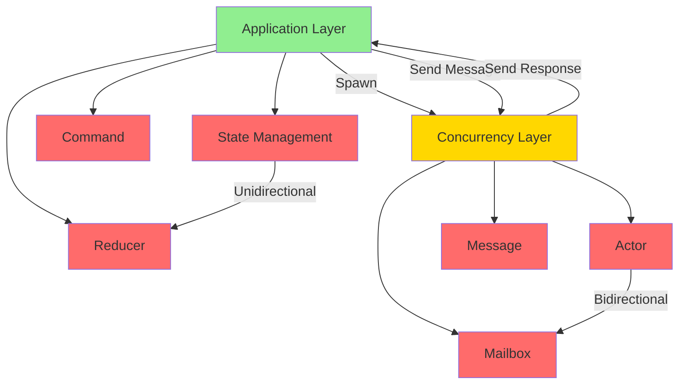
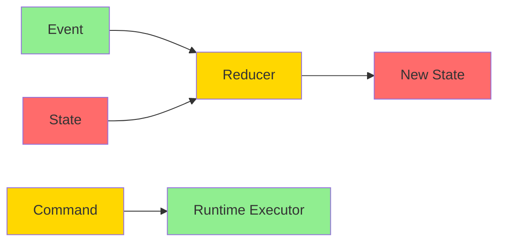

# Layered Concurrency Architecture Specification

* File:* `architecture\layered_concurrency_spec.md`
* Version:* 1.0.0
* Context:* Layer 2 (Semantic Analysis) & Layer 3 (Runtime)
* Formalism:* Category Theory (F-Coalgebras) & Process Algebra
* Status:* Active
* Last Modified:* 2026-01-02
* Author:* Kilo Code
* Reviewers:* Pending

---

## 1. Introduction

### 1.1 Purpose

This specification defines the **Layered Concurrency Architecture** for Morph, resolving the apparent conflict between strict state unidirectional and the actor model. The architecture provides a clear separation of concerns where state management follows strict unidirectional at the application layer, while actor communication uses bidirectional messaging at the concurrency layer. These two paradigms operate at different abstraction levels and are complementary rather than contradictory.

### 1.2 Scope

This specification covers:
- The layered architecture model with two distinct layers
- Application layer with strict unidirectional state flow (SSUS/UDF)
- Concurrency layer with bidirectional actor messaging
- Layer boundaries and interaction protocols
- State management at the application layer
- Message passing at the concurrency layer
- Integration between layers
- Correctness properties and invariants

This specification does not cover:
- Concrete implementation of actor mailboxes
- Performance optimization details
- Hardware-specific scheduling details

### 1.3 Definitions, Acronyms, and Abbreviations

| Term | Definition |
|-------|------------|
| **SSUS** | Strict State Unidirectional - strict separation of state updates from effects |
| **UDF** | Unidirectional Data Flow - strict one-way data flow |
| **Application Layer** | Layer where state management follows strict unidirectional |
| **Concurrency Layer** | Layer where actors communicate via bidirectional messaging |
| **Layer Boundary** | Well-defined interface between application and concurrency layers |
| **State Machine** | Unidirectional state transformation within an actor |
| **Actor** | Concurrent entity with mailbox and bidirectional messaging capability |
| **Reducer** | Pure function that transforms state based on events |
| **Command** | Effectful operation executed asynchronously by runtime |
| **Message** | Immutable data passed between actors |

### 1.4 References

- [`spec/language/strict_state_unidirectional_spec.md`](../language/strict_state_unidirectional_spec.md) - SSUS requirements
- [`spec/language/unidirectional_data_flow_spec.md`](../language/unidirectional_data_flow_spec.md) - UDF requirements
- [`spec/concurrency/execution_model_spec.md`](../concurrency/execution_model_spec.md) - Actor model
- [`SPEC_CONTRADICTIONS.md`](../../SPEC_CONTRADICTIONS.md) - Contradiction analysis
- [`SPEC_FIX_PROPOSAL.md`](../../SPEC_FIX_PROPOSAL.md) - Fix requirements
- IEEE 1016: Recommended Practice for Software Design Descriptions
- ISO/IEC 29148: Systems and software engineering — Requirements engineering

---

## 2. Formal Definitions

### 2.1 The Architectural Concept: Layered Separation

Instead of choosing between unidirectional and actor model, we define a **layered architecture** where both paradigms coexist at different abstraction levels.

#### 2.1.1 Layer 1: Application Layer (Unidirectional)

The **Application Layer** manages state using strict unidirectional:

$$ \text{ApplicationLayer} = (\text{State}, \text{Reducer}, \text{Command}) $$

* Properties:*
- State transformations flow in a single direction
- Reducers are pure functions (no side effects)
- Commands are pure descriptors (not executed)
- No bidirectional state mutation
- Clear input/output boundaries

* LCA-INV-001:* THE system SHALL define the application layer with strict unidirectional state flow.

#### 2.1.2 Layer 2: Concurrency Layer (Bidirectional)

The **Concurrency Layer** manages actor communication using bidirectional messaging:

$$ \text{ConcurrencyLayer} = (\text{Actor}, \text{Mailbox}, \text{Message}) $$

* Properties:*
- Actors communicate via bidirectional message passing
- Request-response patterns are supported
- Messages are immutable
- No shared state between actors
- Asynchronous communication

* LCA-INV-002:* THE system SHALL define the concurrency layer with bidirectional actor messaging.

### 2.2 The Layer Boundary

The **Layer Boundary** is the interface between application and concurrency layers:

$$ \text{LayerBoundary} = \text{ApplicationLayer} \times \text{ConcurrencyLayer} \to \text{Integration} $$

* Characteristics:*
- Application layer spawns actors in concurrency layer
- Application layer sends messages to actors
- Application layer receives responses from actors
- State remains unidirectional within application layer
- Communication is bidirectional across layer boundary

* LCA-INV-003:* THE system SHALL define a clear layer boundary between application and concurrency layers.

### 2.3 Mathematical Formalization

We formally define the layered architecture using **Category Theory (F-Coalgebras)** and **Process Algebra**.

#### 2.3.1 Application Layer as F-Coalgebra

The application layer is modeled as an **F-Coalgebra**:

$$ \alpha : S \to F(S) $$

where:
- $S$: Application state
- $F$: Functor representing state transitions
- $\alpha$: Coalgebra (state transition function)

By enforcing that $\alpha$ is a **Pure Function**, we guarantee unidirectional state flow.

* LCA-THM-001:* THE system SHALL guarantee that application layer state transitions are unidirectional.

* Proof Sketch:*
1. By definition of F-coalgebra, $\alpha$ is a function $S \to F(S)$
2. By definition of pure function, $\alpha$ has no side effects
3. Therefore, state transitions flow in one direction only

#### 2.3.2 Concurrency Layer as Process Algebra

The concurrency layer is modeled using **Process Algebra**:

$$ P ::= \text{send}(m) \mid \text{receive}(m) \mid P \parallel Q \mid P \mid Q $$

where:
- $\text{send}(m)$: Send message $m$
- $\text{receive}(m)$: Receive message $m$
- $P \parallel Q$: Parallel composition
- $P \mid Q$: Choice

By allowing bidirectional communication, actors can implement request-response patterns.

* LCA-THM-002:* THE system SHALL guarantee that concurrency layer supports bidirectional communication.

* Proof Sketch:*
1. By definition of process algebra, both send and receive are primitive operations
2. Therefore, bidirectional communication is supported

#### 2.3.3 Layer Integration

The integration between layers is defined as:

$$ \text{Integration} = \text{ApplicationLayer} \to \text{ConcurrencyLayer} \to \text{ApplicationLayer} $$

This represents:
1. Application layer spawns actor (Application → Concurrency)
2. Actor processes message (Concurrency)
3. Actor sends response (Concurrency → Application)
4. Application layer updates state (Application)

* LCA-THM-003:* THE system SHALL guarantee that layer integration maintains unidirectional within application layer.

* Proof Sketch:*
1. Application layer spawns actor (unidirectional: spawn operation)
2. Actor processes message (bidirectional: within concurrency layer)
3. Actor sends response (bidirectional: within concurrency layer)
4. Application layer updates state (unidirectional: state transition)
5. Therefore, application layer maintains unidirectional

### 2.4 The Type System Enforcement

We enforce layer separation at the type level.

#### 2.4.1 Application Layer Types

```morph
// Application layer types
type State<T> = T;
type Reducer<S, E> = (S, E) -> S;
type Command<S, E> = (S, E) -> CommandDescriptor;
```

* Properties:*
- State is immutable (returns new state)
- Reducer is pure function
- Command is pure descriptor

* LCA-INV-004:* THE system SHALL enforce pure function types for application layer reducers and commands.

#### 2.4.2 Concurrency Layer Types

```morph
// Concurrency layer types
type Actor<S, M> = {
    mailbox: Mailbox<M>,
    state: S,
    behavior: (M, S) -> (S, Option<M>)
};

type Message<T> = T;
type Mailbox<T> = MPSCQueue<T>;
```

* Properties:*
- Actor has mailbox for receiving messages
- Actor behavior can send responses
- Messages are immutable

* LCA-INV-005:* THE system SHALL enforce actor types with bidirectional messaging capability.

---

## 3. Requirements

### 3.1 Functional Requirements

* LCA-REQ-001:* THE system SHALL define application layer with strict unidirectional state flow.
  - **Priority:* Critical
  - **Verification Method:* Test
  - **Rationale:* Enables deterministic state management
  - **Dependencies:* LCA-INV-001
  - **Traceability:* Section 2.1.1 (Layer 1: Application Layer)

* LCA-REQ-002:* THE system SHALL define concurrency layer with bidirectional actor messaging.
  - **Priority:* Critical
  - **Verification Method:* Test
  - **Rationale:* Enables flexible actor communication
  - **Dependencies:* LCA-INV-002
  - **Traceability:* Section 2.1.2 (Layer 2: Concurrency Layer)

* LCA-REQ-003:* THE system SHALL define clear layer boundary between application and concurrency layers.
  - **Priority:* Critical
  - **Verification Method:* Test
  - **Rationale:* Prevents layer confusion and maintains separation
  - **Dependencies:* LCA-INV-003
  - **Traceability:* Section 2.2 (The Layer Boundary)

* LCA-REQ-004:* THE system SHALL enforce pure function types for application layer reducers and commands.
  - **Priority:* Critical
  - **Verification Method:* Test
  - **Rationale:* Ensures deterministic state transitions
  - **Dependencies:* LCA-INV-004
  - **Traceability:* Section 2.4.1 (Application Layer Types)

* LCA-REQ-005:* THE system SHALL enforce actor types with bidirectional messaging capability.
  - **Priority:* Critical
  - **Verification Method:* Test
  - **Rationale:* Enables request-response patterns
  - **Dependencies:* LCA-INV-005
  - **Traceability:* Section 2.4.2 (Concurrency Layer Types)

* LCA-REQ-006:* THE system SHALL allow application layer to spawn actors in concurrency layer.
  - **Priority:* High
  - **Verification Method:* Test
  - **Rationale:* Enables application to use concurrency primitives
  - **Dependencies:* LCA-INV-003
  - **Traceability:* Section 2.3.3 (Layer Integration)

* LCA-REQ-007:* THE system SHALL allow application layer to send messages to actors.
  - **Priority:* High
  - **Verification Method:* Test
  - **Rationale:* Enables application to communicate with actors
  - **Dependencies:* LCA-INV-003
  - **Traceability:* Section 2.3.3 (Layer Integration)

* LCA-REQ-008:* THE system SHALL allow application layer to receive responses from actors.
  - **Priority:* High
  - **Verification Method:* Test
  - **Rationale:* Enables request-response patterns
  - **Dependencies:* LCA-INV-003
  - **Traceability:* Section 2.3.3 (Layer Integration)

* LCA-REQ-009:* THE system SHALL maintain unidirectional state flow within application layer.
  - **Priority:* Critical
  - **Verification Method:* Test
  - **Rationale:* Ensures deterministic state management
  - **Dependencies:* LCA-INV-001, LCA-THM-001
  - **Traceability:* Section 2.3.1 (Application Layer as F-Coalgebra)

* LCA-REQ-010:* THE system SHALL maintain bidirectional messaging within concurrency layer.
  - **Priority:* Critical
  - **Verification Method:* Test
  - **Rationale:* Enables flexible actor communication
  - **Dependencies:* LCA-INV-002, LCA-THM-002
  - **Traceability:* Section 2.3.2 (Concurrency Layer as Process Algebra)

### 3.2 Non-Functional Requirements

* LCA-NFR-001:* THE system SHALL provide deterministic state transitions within application layer.
  - **Priority:* Critical
  - **Verification Method:* Test
  - **Metric:* Same inputs always produce same outputs
  - **Rationale:* Enables reproducible behavior and testing
  - **Dependencies:* LCA-THM-001
  - **Traceability:* Section 2.3.1 (Application Layer as F-Coalgebra)

* LCA-NFR-002:* THE system SHALL provide bounded memory usage for actor mailboxes.
  - **Priority:* High
  - **Verification Method:* Test
  - **Metric:* Mailbox size bounded by configuration
  - **Rationale:* Prevents OOM and ensures predictable memory usage
  - **Dependencies:* LCA-INV-002
  - **Traceability:* Section 2.1.2 (Layer 2: Concurrency Layer)

* LCA-NFR-003:* THE system SHALL support up to 1,000,000 concurrent actors.
  - **Priority:* Medium
  - **Verification Method:* Demonstration
  - **Metric:* 1M actors with < 10GB memory
  - **Rationale:* Supports large-scale concurrent systems
  - **Dependencies:* LCA-INV-002
  - **Traceability:* Section 2.1.2 (Layer 2: Concurrency Layer)

* LCA-NFR-004:* THE system SHALL provide zero-copy message passing between layers.
  - **Priority:* High
  - **Verification Method:* Analysis
  - **Metric:* No memory copies for message passing
  - **Rationale:* Ensures efficient inter-layer communication
  - **Dependencies:* LCA-INV-003
  - **Traceability:* Section 2.2 (The Layer Boundary)

---

## 4. Design

### 4.1 Architecture Overview

The Layered Concurrency Architecture is implemented as a two-layer system that:
1. Defines application layer with strict unidirectional state flow
2. Defines concurrency layer with bidirectional actor messaging
3. Enforces clear layer boundary
4. Provides integration protocols between layers
5. Maintains unidirectional within application layer
6. Maintains bidirectionality within concurrency layer

### 4.2 Data Structures

#### 4.2.1 Application Layer State

* Application State:* $S = (\text{fields})$

* Components:*
- $\text{fields}$: Map of field names to values

* Invariants:*
1. State is immutable (returns new state)
2. State transitions are unidirectional
3. Reducers are pure functions

#### 4.2.2 Concurrency Layer Actor

* Actor:* $A = (\text{mailbox}, \text{state}, \text{behavior})$

* Components:*
- $\text{mailbox}$: MPSC queue for receiving messages
- $\text{state}$: Actor state
- $\text{behavior}$: Message processing function

* Invariants:*
1. Mailbox is lock-free MPSC
2. Messages are immutable
3. Behavior processes messages sequentially

#### 4.2.3 Layer Boundary Interface

* Layer Boundary:* $LB = (\text{spawn}, \text{send}, \text{receive})$

* Components:*
- $\text{spawn}$: Spawn actor in concurrency layer
- $\text{send}$: Send message to actor
- $\text{receive}$: Receive response from actor

* Invariants:*
1. Spawn is unidirectional (application → concurrency)
2. Send is unidirectional (application → concurrency)
3. Receive is unidirectional (concurrency → application)
4. No shared state across boundary

### 4.3 Algorithms

#### 4.3.1 Application Layer State Transition Algorithm

* Algorithm Name:* Update State Unidirectional

* Input:* Event $e$, State $s$

* Output:* New State $s'$

* Mathematical Definition:*
$$
\text{update}(e, s) = s' \text{ where } s' = \text{pure\_function}(e, s) $$

* Pseudocode:*
```
function update(event, state):
    // Pure function: no side effects
    new_state = state.copy()
    match event:
        case Event1(v1):
            new_state.field1 = v1
        case Event2(v2):
            new_state.field2 = v2
        ...
    return new_state
```

* Complexity:*
- Time: $O(1)$
- Space: $O(1)$

* Correctness:*
- **Invariant:* Returns new state without modifying old state
- **Termination:* Always returns new state

#### 4.3.2 Concurrency Layer Message Processing Algorithm

* Algorithm Name:* Process Message Bidirectionally

* Input:* Message $m$, Actor State $s$

* Output:* New Actor State $s'$, Optional Response $r$

* Mathematical Definition:*
$$
\text{process}(m, s) = (s', r) \text{ where } s' = \text{behavior}(m, s) $$

* Pseudocode:*
```
function process(message, actor_state):
    // Process message and potentially send response
    new_state = actor_state.copy()
    match message:
        case Request(req):
            // Process request
            result = handle_request(req, new_state)
            // Send response (bidirectional)
            send_response(Response(result))
            return (new_state, None)
        case Query(q):
            // Process query and return response
            result = handle_query(q, new_state)
            return (new_state, Some(Response(result)))
        case Notification(n):
            // Process notification (no response)
            handle_notification(n, new_state)
            return (new_state, None)
```

* Complexity:*
- Time: $O(1)$
- Space: $O(1)$

* Correctness:*
- **Invariant:* Messages are processed sequentially
- **Termination:* Always returns new state and optional response

#### 4.3.3 Layer Integration Algorithm

* Algorithm Name:* Integrate Layers

* Input:* Application State $s$, Actor Reference $a$, Message $m$

* Output:* Application State $s'$, Optional Response $r$

* Mathematical Definition:*
$$
\text{integrate}(s, a, m) = \begin{cases}
\text{send}(a, m) \land \text{receive}(a, r) & \text{if } \text{is\_request}(m) \\
\text{send}(a, m) & \text{if } \text{is\_notification}(m)
\end{cases}
$$

* Pseudocode:*
```
function integrate(app_state, actor, message):
    // Application layer sends message to actor
    actor.send(message)
    
    // If request, wait for response
    if is_request(message):
        response = actor.receive()
        // Application layer updates state with response
        new_app_state = update(ResponseEvent(response), app_state)
        return (new_app_state, Some(response))
    else:
        // Notification, no response
        return (app_state, None)
```

* Complexity:*
- Time: $O(1)$ for send, $O(n)$ for receive (where n is queue length)
- Space: $O(1)$

* Correctness:*
- **Invariant:* Application state remains unidirectional
- **Termination:* Always returns new state and optional response

### 4.4 Mermaid Diagrams

#### 4.4.1 Layered Architecture Overview



#### 4.4.2 Application Layer State Flow



#### 4.4.3 Concurrency Layer Actor Communication

```mermaid
sequenceDiagram
    participant A as Actor A
    participant B as Actor B
    participant MA as Mailbox A
    participant MB as Mailbox B
    
    A->>MA: Send Message
    MA->>MB: Deliver Message
    B->>MB: Receive Message
    B->>MB: Send Response
    MB->>MA: Deliver Response
    MA-->>A: Receive Response
    
    style A fill:#90EE90
    style B fill:#90EE90
    style MA fill:#FFD700
    style MB fill:#FFD700
```

#### 4.4.4 Layer Integration Flow

```mermaid
sequenceDiagram
    participant App as Application Layer
    participant Conc as Concurrency Layer
    participant Actor as Actor
    
    App->>Conc: Spawn Actor
    Conc->>Actor: Initialize
    Actor-->>Conc: Ready
    
    App->>Conc: Send Request
    Conc->>Actor: Deliver Message
    Actor->>Actor: Process
    Actor->>Conc: Send Response
    Conc-->>App: Receive Response
    App->>App: Update State
    
    style App fill:#90EE90
    style Conc fill:#FFD700
    style Actor fill:#FF6B6B
```

---

## 5. Correctness Properties

### 5.1 Theorems

#### 5.1.1 Unidirectional Theorem

* Theorem:* If a program uses the application layer with pure reducers, then state transitions are unidirectional.

* Proof Sketch:*
1. By definition of LCA-THM-001, application layer uses F-coalgebra
2. By definition of pure function, reducers have no side effects
3. Therefore, state transitions flow in one direction only

* LCA-THM-004:* THE system SHALL guarantee unidirectional state transitions in application layer.

* Priority:* Critical
* Verification Method:* Test
* Rationale:* Ensures deterministic state management
* Dependencies:* LCA-THM-001
* Traceability:* Section 2.3.1 (Application Layer as F-Coalgebra)

#### 5.1.2 Bidirectionality Theorem

* Theorem:* If a program uses the concurrency layer with actors, then actor communication is bidirectional.

* Proof Sketch:*
1. By definition of LCA-THM-002, concurrency layer uses process algebra
2. By definition of process algebra, both send and receive are primitive operations
3. Therefore, actor communication is bidirectional

* LCA-THM-005:* THE system SHALL guarantee bidirectional communication in concurrency layer.

* Priority:* Critical
* Verification Method:* Test
* Rationale:* Enables request-response patterns
* Dependencies:* LCA-THM-002
* Traceability:* Section 2.3.2 (Concurrency Layer as Process Algebra)

#### 5.1.3 Layer Separation Theorem

* Theorem:* If a program uses layered architecture, then application layer unidirectional and concurrency layer bidirectionality are maintained.

* Proof Sketch:*
1. By definition of LCA-THM-003, layer integration maintains unidirectional within application layer
2. By definition of layer boundary, no shared state exists between layers
3. Therefore, both paradigms coexist without conflict

* LCA-THM-006:* THE system SHALL guarantee that layered architecture maintains both paradigms.

* Priority:* Critical
* Verification Method:* Test
* Rationale:* Resolves unidirectional/actor conflict
* Dependencies:* LCA-THM-001, LCA-THM-002, LCA-THM-003
* Traceability:* Section 2.3.3 (Layer Integration)

#### 5.1.4 Determinism Theorem

* Theorem:* If a program uses the application layer with pure reducers, then state transitions are deterministic.

* Proof Sketch:*
1. By definition of pure function, same inputs always produce same outputs
2. By definition of reducer, state transitions are pure functions
3. Therefore, state transitions are deterministic

* LCA-THM-007:* THE system SHALL guarantee deterministic state transitions in application layer.

* Priority:* Critical
* Verification Method:* Test
* Rationale:* Enables reproducible behavior and testing
* Dependencies:* LCA-INV-001, LCA-INV-004
* Traceability:* Section 2.1.1 (Layer 1: Application Layer)

### 5.2 Invariants

#### 5.2.1 Application Layer Invariants

- **LCA-INV-006:* THE system SHALL maintain that application layer state is immutable.
- **LCA-INV-007:* THE system SHALL maintain that application layer reducers are pure functions.
- **LCA-INV-008:* THE system SHALL maintain that application layer commands are pure descriptors.
- **LCA-INV-009:* THE system SHALL maintain that application layer state transitions are unidirectional.

#### 5.2.2 Concurrency Layer Invariants

- **LCA-INV-010:* THE system SHALL maintain that concurrency layer actors have mailboxes.
- **LCA-INV-011:* THE system SHALL maintain that concurrency layer messages are immutable.
- **LCA-INV-012:* THE system SHALL maintain that concurrency layer actors process messages sequentially.
- **LCA-INV-013:* THE system SHALL maintain that concurrency layer communication is bidirectional.

#### 5.2.3 Layer Boundary Invariants

- **LCA-INV-014:* THE system SHALL maintain that layer boundary has no shared state.
- **LCA-INV-015:* THE system SHALL maintain that layer boundary communication is message-based.
- **LCA-INV-016:* THE system SHALL maintain that layer boundary maintains unidirectional in application layer.
- **LCA-INV-017:* THE system SHALL maintain that layer boundary maintains bidirectionality in concurrency layer.

---

## 6. Examples

### 6.1 Simple Counter Application

```morph
// Application Layer: Unidirectional State Management
flow Counter {
    // State (Private) - The ONLY mutable data
    state: {
        count: i32 = 0
    },

    // Reducer (Pure Logic) - State + Event -> NewState
    reduce(msg: Input, s: &mut State) {
        fix msg {
            increment => s.count += 1,
            reset => s.count = 0
        }
    },

    // Output (Sink) - Automatically derived: Stream<#CounterState>
}

// Concurrency Layer: Bidirectional Actor Messaging
logic CounterActor {
    state: {
        count: i32 = 0
    },

    in: {
        Increment,
        GetCount
    },

    fn handle(msg: Input) {
        fix msg {
            Increment => {
                self.state.count += 1;
                // No response needed
            },
            GetCount => {
                // Send response (bidirectional)
                send(self.sender, self.state.count);
            }
        }
    }
}

// Layer Integration
fn main() {
    // Application layer spawns actor
    let counter_actor = spawn(CounterActor);
    
    // Application layer sends request
    counter_actor.send(GetCount);
    
    // Application layer receives response
    let count = receive();
    
    // Application layer updates state (unidirectional)
    let counter_flow = Counter { state: { count: count } };
}
```

* Properties:*
- Application layer uses unidirectional state flow
- Concurrency layer uses bidirectional messaging
- Layer boundary is clear (spawn, send, receive)
- No shared state between layers

### 6.2 Authentication System

```morph
// Application Layer: Unidirectional State Management
flow AuthSystem {
    state: {
        status: AuthStatus = Idle
    },

    in: {
        Login(user: str),
        LoginSuccess(token: str),
        LoginFail(err: str)
    },

    // Reducer (Pure Logic) - State + Event -> NewState
    reduce(msg: Input, s: &mut State) {
        fix msg {
            Login(_) => s.status = Loading,
            LoginSuccess(t) => s.status = Authenticated(t),
            LoginFail(e) => s.status = Error(e)
        }
    },

    // Command (Pure Logic) - State + Event -> Command
    command(msg: Input, s: &State) {
        fix msg {
            Login(user) => Command::Authenticate(user),
            LoginSuccess(t) => Command::SaveToken(t),
            LoginFail(e) => Command::LogError(e)
        }
    }
}

// Concurrency Layer: Bidirectional Actor Messaging
logic AuthService {
    state: {
        database: Database
    },

    in: {
        Authenticate(user: str),
        SaveToken(token: str),
        LogError(err: str)
    },

    fn handle(msg: Input) {
        fix msg {
            Authenticate(user) => {
                // Process authentication
                let result = self.state.database.authenticate(user);
                // Send response (bidirectional)
                send(self.sender, result);
            },
            SaveToken(token) => {
                self.state.database.save_token(token);
            },
            LogError(err) => {
                self.state.database.log_error(err);
            }
        }
    }
}

// Layer Integration
fn authenticate_user(user: str) {
    // Application layer spawns actor
    let auth_service = spawn(AuthService);
    
    // Application layer sends request
    auth_service.send(Authenticate(user));
    
    // Application layer receives response
    let result = receive();
    
    // Application layer updates state (unidirectional)
    match result {
        Success(token) => {
            auth_flow.send(LoginSuccess(token));
        },
        Failure(err) => {
            auth_flow.send(LoginFail(err));
        }
    }
}
```

* Properties:*
- Application layer maintains unidirectional state flow
- Concurrency layer handles bidirectional request-response
- Commands are pure descriptors (not executed)
- Layer boundary is clear

### 6.3 Request-Response Pattern

```morph
// Application Layer: Unidirectional State Management
flow Calculator {
    state: {
        result: Option<i32> = None
    },

    in: {
        SetResult(value: i32),
        ClearResult
    },

    reduce(msg: Input, s: &mut State) {
        fix msg {
            SetResult(v) => s.result = Some(v),
            ClearResult => s.result = None
        }
    }
}

// Concurrency Layer: Bidirectional Actor Messaging
logic CalculatorService {
    state: {
        // Internal state
    },

    in: {
        Add(a: i32, b: i32),
        Multiply(a: i32, b: i32)
    },

    fn handle(msg: Input) {
        fix msg {
            Add(a, b) => {
                let result = a + b;
                // Send response (bidirectional)
                send(self.sender, result);
            },
            Multiply(a, b) => {
                let result = a * b;
                // Send response (bidirectional)
                send(self.sender, result);
            }
        }
    }
}

// Layer Integration
fn calculate_sum(a: i32, b: i32) {
    // Application layer spawns actor
    let calculator = spawn(CalculatorService);
    
    // Application layer sends request
    calculator.send(Add(a, b));
    
    // Application layer receives response
    let result = receive();
    
    // Application layer updates state (unidirectional)
    calculator_flow.send(SetResult(result));
}
```

* Properties:*
- Application layer state flows unidirectionally
- Concurrency layer supports bidirectional request-response
- Clear separation of concerns
- No shared state between layers

### 6.4 Edge Cases

#### 6.4.1 Empty Application Layer

```morph
// Application Layer: No state
flow EmptyFlow {
    state: {
        // No state
    },

    in: {
        // No inputs
    },

    reduce(msg: Input, s: &mut State) {
        // No state changes
    }
}

// Concurrency Layer: Actor with no behavior
logic EmptyActor {
    state: {
        // No state
    },

    in: {
        // No messages
    },

    fn handle(msg: Input) {
        // No behavior
    }
}
```

* Properties:*
- Application layer with no state is valid
- Concurrency layer with no behavior is valid
- Layer boundary still enforced

#### 6.4.2 Multiple Actors

```morph
// Application Layer: Manages multiple actors
flow ActorManager {
    state: {
        actors: [ActorRef] = []
    },

    in: {
        SpawnActor(name: str),
        SendMessage(actor: ActorRef, msg: Message)
    },

    reduce(msg: Input, s: &mut State) {
        fix msg {
            SpawnActor(name) => {
                let actor = spawn(WorkerActor);
                s.actors.push(actor);
            },
            SendMessage(actor, msg) => {
                actor.send(msg);
            }
        }
    }
}

// Concurrency Layer: Multiple workers
logic WorkerActor {
    state: {
        // Worker state
    },

    in: {
        Work(task: Task),
        Stop
    },

    fn handle(msg: Input) {
        fix msg {
            Work(task) => {
                // Process task
                let result = process(task);
                // Send response (bidirectional)
                send(self.sender, result);
            },
            Stop => {
                // Stop processing
            }
        }
    }
}
```

* Properties:*
- Application layer manages multiple actors
- Concurrency layer has multiple workers
- Layer boundary handles multiple actors
- No shared state between layers

---

## Change Log

| Version | Date       | Author      | Changes                                                                 |
|---------|------------|-------------|-------------------------------------------------------------------------|
| 1.0.0   | 2026-01-02 | Kilo Code    | Initial version                                                        |
