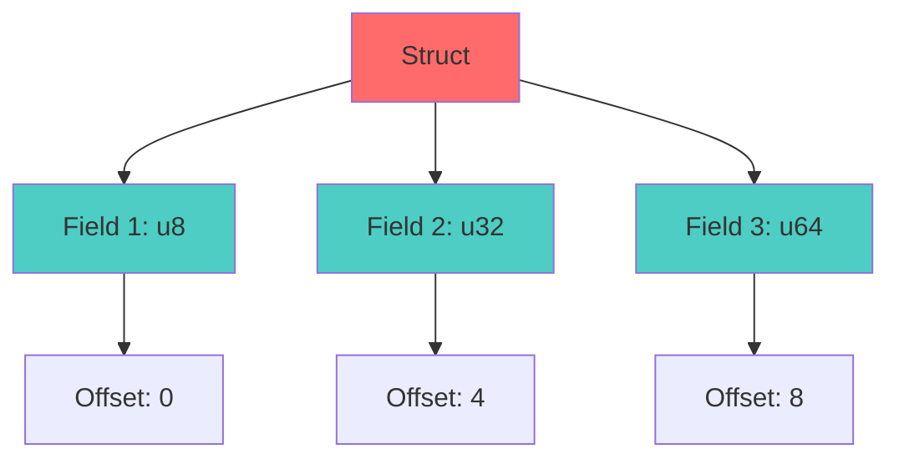
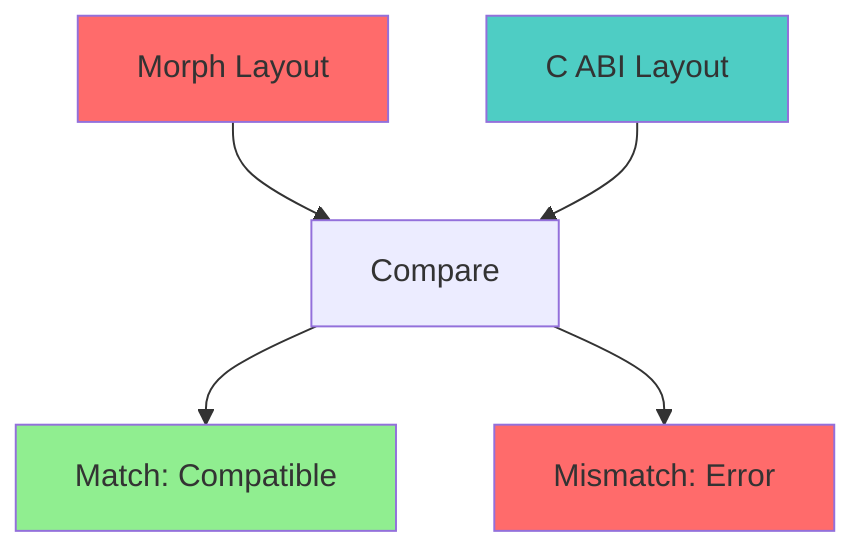

# Alignment Algebra Specification (ABI Layout)

* File:* `build\abi_alignment_algebra_spec.md`
* Version:* 1.0.0
* Context:* Layer 2 (Compiler) - CodeGen
* Formalism:* Modular Arithmetic & Lattice Theory
* Status:* Active
* Last Modified:* 2026-01-01
* Author:* Kilo Code
* Reviewers:* Pending

- -

## 1. Introduction

### 1.1 Purpose

This specification formalizes the **Data Layout Engine** using **Alignment Algebra**, providing mathematical foundation for binary compatibility with C ABI. This formalization enables the Morph compiler to guarantee that struct layouts match platform-specific ABI expectations precisely.

### 1.2 Scope

This specification covers:
- Layout function definition
- Primitive alignment rules
- Struct packing algebra
- Total alignment and size calculations
- C ABI compatibility guarantees

This specification does not cover:
- Concrete implementation of layout engine
- Platform-specific ABI details
- Performance optimization

### 1.3 Definitions, Acronyms, and Abbreviations

| Term | Definition |
|-------|------------|
| **Layout Function** | Function mapping types to physical layout |
| **Alignment** | Memory address alignment requirement |
| **Size** | Total memory size of type |
| **Offset** | Byte offset of field within struct |
| **Padding** | Unused bytes inserted for alignment |
| **Natural Alignment** | Alignment equal to type size |
| **ABI** | Application Binary Interface |

### 1.4 References

- IEEE 754: Standard for Floating-Point Arithmetic
- System V AMD64 ABI
- Microsoft x64 Calling Convention
- ISO/IEC 9899: Programming languages — C

- -

## 2. Formal Definitions

### 2.1 The Layout Function

We define a function $\mathcal{L}(T) \to (\text{Size}, \text{Align})$ representing the physical layout of type $T$.

* ABI-INV-001:* THE system SHALL define layout function for all types.

* ABI-REQ-001:* THE system SHALL compute layout for all types.

* Priority:* Critical
* Verification Method:* Test
* Rationale:* Enables ABI compatibility
* Dependencies:* ABI-INV-001
* Traceability:* Section 2.1 (The Layout Function)

#### 2.1.1 Primitive Alignment

For primitive $p$ of width $w$ bytes:

- $\text{Size}(p) = w$
- $\text{Align}(p) = w$ (Natural Alignment rule).

* ABI-INV-002:* THE system SHALL define natural alignment for primitives.

* ABI-REQ-002:* THE system SHALL use natural alignment for primitives.

* Priority:* Critical
* Verification Method:* Test
* Rationale:* Matches platform ABI expectations
* Dependencies:* ABI-INV-002
* Traceability:* Section 2.1.1 (Primitive Alignment)

### 2.2 Struct Packing Algebra

For a struct $S = \{f_1, f_2, \dots, f_n\}$:

Let $O_i$ be the offset of field $f_i$.

* ABI-INV-003:* THE system SHALL define struct packing algebra.

* ABI-REQ-003:* THE system SHALL compute struct layout using packing algebra.

* Priority:* Critical
* Verification Method:* Test
* Rationale:* Ensures correct struct layout
* Dependencies:* ABI-INV-003
* Traceability:* Section 2.2 (Struct Packing Algebra)

#### 2.2.1 Offset Calculation

1. **Offset Calculation:*
    $$ O_1 = 0 $$
    $$ O_{i+1} = \lceil (O_i + \text{Size}(f_i)) / \text{Align}(f_{i+1}) \rceil \cdot \text{Align}(f_{i+1}) $$
    * The ceiling function represents padding insertion).*

* ABI-THM-001:* THE system SHALL guarantee correct field offsets.

* Priority:* Critical
* Verification Method:* Analysis
* Rationale:* Ensures proper field alignment
* Dependencies:* ABI-INV-003
* Traceability:* Section 2.2.1 (Offset Calculation)

#### 2.2.2 Total Alignment

2. **Total Alignment:*
    $$ \text{Align}(S) = \max_{i} (\text{Align}(f_i)) $$

* ABI-THM-002:* THE system SHALL guarantee correct struct alignment.

* Priority:* Critical
* Verification Method:* Analysis
* Rationale:* Ensures struct meets alignment requirements
* Dependencies:* ABI-INV-003
* Traceability:* Section 2.2.2 (Total Alignment)

#### 2.2.3 Total Size

3. **Total Size:*
    $$ \text{Size}(S) = \lceil (O_n + \text{Size}(f_n)) / \text{Align}(S) \rceil \cdot \text{Align}(S) $$

* ABI-THM-003:* THE system SHALL guarantee correct struct size.

* Priority:* Critical
* Verification Method:* Analysis
* Rationale:* Ensures struct size includes padding
* Dependencies:* ABI-INV-003
* Traceability:* Section 2.2.3 (Total Size)

### 2.3 C ABI Compatibility

* ABI-INV-004:* THE system SHALL guarantee C ABI compatibility.

* ABI-REQ-004:* THE system SHALL match platform-specific ABI exactly.

* Priority:* Critical
* Verification Method:* Test
* Rationale:* Enables FFI with C libraries
* Dependencies:* ABI-INV-004
* Traceability:* Section 2.3 (C ABI Compatibility)

* ABI-THM-004:* THE system SHALL guarantee that struct layouts match C ABI.

* Priority:* Critical
* Verification Method:* Analysis
* Rationale:* Ensures binary compatibility
* Dependencies:* ABI-THM-001, ABI-THM-002, ABI-THM-003
* Traceability:* Section 2.3 (C ABI Compatibility)

- -

## 3. Requirements

### 3.1 Functional Requirements

* ABI-REQ-005:* THE system SHALL support primitive types with natural alignment.

* Priority:* Critical
* Verification Method:* Test
* Rationale:* Enables basic type layout
* Dependencies:* ABI-INV-002
* Traceability:* Section 2.1.1 (Primitive Alignment)

* ABI-REQ-006:* THE system SHALL support struct types with field alignment.

* Priority:* Critical
* Verification Method:* Test
* Rationale:* Enables complex type layout
* Dependencies:* ABI-INV-003
* Traceability:* Section 2.2 (Struct Packing Algebra)

* ABI-REQ-007:* THE system SHALL support array types with element alignment.

* Priority:* High
* Verification Method:* Test
* Rationale:* Enables array layout
* Dependencies:* ABI-INV-001
* Traceability:* Section 2.1 (The Layout Function)

* ABI-REQ-008:* THE system SHALL support pointer types with platform alignment.

* Priority:* High
* Verification Method:* Test
* Rationale:* Enables pointer layout
* Dependencies:* ABI-INV-001
* Traceability:* Section 2.1 (The Layout Function)

### 3.2 Non-Functional Requirements

* ABI-NFR-001:* THE system SHALL compute layout in O(n) time for n fields.

* Priority:* High
* Verification Method:* Performance test
* Metric:* Layout < 1ms for 100 fields
* Rationale:* Ensures fast compilation
* Dependencies:* None
* Traceability:* Section 2.2 (Struct Packing Algebra)

* ABI-NFR-002:* THE system SHALL support up to 1000 fields per struct.

* Priority:* Medium
* Verification Method:* Stress test
* Metric:* 1000 fields
* Rationale:* Supports complex data structures
* Dependencies:* None
* Traceability:* Section 2.2 (Struct Packing Algebra)

- -

## 4. Design

### 4.1 Architecture Overview

The Alignment Algebra Engine is implemented as a compiler component that:
1. Computes layout for all types
2. Applies primitive alignment rules
3. Calculates struct packing with padding
4. Ensures C ABI compatibility
5. Generates layout metadata for code generation

### 4.2 Data Structures

#### 4.2.1 Layout Metadata

* Layout Metadata:* $L = (\text{Size}, \text{Align}, \text{Offsets})$

* Components:*
- Total size in bytes
- Alignment requirement in bytes
- Field offsets (for structs)

* Invariants:*
1. Size is multiple of alignment
2. Offsets are properly aligned

#### 4.2.2 Field Layout

* Field Layout:* $F = (\text{Type}, \text{Offset}, \text{Size})$

* Components:*
- Field type
- Field offset
- Field size

* Invariants:*
1. Offset is multiple of field alignment
2. Size matches type size

### 4.3 Algorithms

#### 4.3.1 Layout Computation Algorithm

* Algorithm Name:* Compute Layout

* Input:* Type $T$

* Output:* Layout metadata $(\text{Size}, \text{Align}, \text{Offsets})$

* Mathematical Definition:*
$$
\mathcal{L}(T) = \begin{cases}
(w, w, []) & \text{if } T \text{ is primitive} \\
(\text{Size}(S), \text{Align}(S), [O_1, \dots, O_n]) & \text{if } T = \{f_1, \dots, f_n\} \\
\end{cases}
$$

* Pseudocode:*
```
function compute_layout(type):
    match type:
        Primitive(width):
            return (width, width, [])
        Struct(fields):
            offsets = []
            current_offset = 0
            max_align = 1

            for field in fields:
                field_layout = compute_layout(field.type)
                field_align = field_layout.align

                # Pad to alignment
                current_offset = ceil(current_offset / field_align) * field_align

                offsets.append(current_offset)
                current_offset += field_layout.size
                max_align = max(max_align, field_align)

            # Pad to struct alignment
            total_size = ceil(current_offset / max_align) * max_align

            return (total_size, max_align, offsets)
```

* Complexity:*
- Time: $O(n)$ where $n$ is number of fields
- Space: $O(n)$ for offset array

* Correctness:*
- **Invariant:* Offsets are properly aligned
- **Termination:* Single pass through fields

#### 4.3.2 ABI Verification Algorithm

* Algorithm Name:* Verify ABI Compatibility

* Input:* Morph type layout, C struct layout

* Output:* Boolean indicating compatibility

* Mathematical Definition:*
$$
\text{Compatible}(L_{morph}, L_{c}) \iff L_{morph} = L_{c}
$$

* Pseudocode:*
```
function verify_abi_compatibility(morph_layout, c_layout):
    return morph_layout.size == c_layout.size and
           morph_layout.align == c_layout.align and
           morph_layout.offsets == c_layout.offsets
```

* Complexity:*
- Time: $O(n)$ where $n$ is number of fields
- Space: $O(1)$

* Correctness:*
- **Invariant:* Layouts are identical
- **Termination:* Single comparison

### 4.4 Mermaid Diagrams

#### 4.4.1 Struct Layout



#### 4.4.2 Padding Insertion


#### 4.4.3 ABI Compatibility



- -

## 5. Correctness Properties

### 5.1 Theorems

#### 5.1.1 Alignment Theorem

* Theorem:* Field offsets are properly aligned.

* Proof Sketch:*
1. By definition of offset calculation, $O_{i+1} = \lceil (O_i + \text{Size}(f_i)) / \text{Align}(f_{i+1}) \rceil \cdot \text{Align}(f_{i+1})$
2. By property of ceiling function, $O_{i+1}$ is multiple of $\text{Align}(f_{i+1})$
3. Therefore, field offsets are properly aligned

* ABI-THM-005:* THE system SHALL guarantee field alignment.

* Priority:* Critical
* Verification Method:* Analysis
* Rationale:* Ensures correct memory access
* Dependencies:* ABI-THM-001
* Traceability:* Section 5.1.1 (Alignment Theorem)

#### 5.1.2 Size Theorem

* Theorem:* Struct size includes necessary padding.

* Proof Sketch:*
1. By definition of total size, $\text{Size}(S) = \lceil (O_n + \text{Size}(f_n)) / \text{Align}(S) \rceil \cdot \text{Align}(S)$
2. By property of ceiling function, size is multiple of alignment
3. Therefore, struct size includes padding

* ABI-THM-006:* THE system SHALL guarantee correct struct size.

* Priority:* Critical
* Verification Method:* Analysis
* Rationale:* Ensures correct memory allocation
* Dependencies:* ABI-THM-003
* Traceability:* Section 5.1.2 (Size Theorem)

### 5.2 Invariants

#### 5.2.1 Layout Invariants

- **ABI-INV-005:* THE system SHALL maintain that size is multiple of alignment
- **ABI-INV-006:* THE system SHALL maintain that offsets are properly aligned
- **ABI-INV-007:* THE system SHALL maintain that layouts match C ABI

- -

## 6. Examples

### 6.1 Simple Struct

```morph
// Simple struct: Basic alignment
struct Point {
    x: u32,  // Offset: 0, Size: 4
    y: u32,  // Offset: 4, Size: 4
    z: u32,  // Offset: 8, Size: 4
}
// Total Size: 12, Alignment: 4
```

* Layout Calculation:*
- $O_1 = 0$
- $O_2 = \lceil (0 + 4) / 4 \rceil \cdot 4 = 4$
- $O_3 = \lceil (4 + 4) / 4 \rceil \cdot 4 = 8$
- $\text{Size} = \lceil (8 + 4) / 4 \rceil \cdot 4 = 12$
- $\text{Align} = \max(4, 4, 4) = 4$

### 6.2 Padded Struct

```morph
// Padded struct: Mixed alignment
struct Mixed {
    a: u8,   // Offset: 0, Size: 1
    b: u32,  // Offset: 4, Size: 4 (padding: 3)
    c: u8,   // Offset: 8, Size: 1
    d: u64,  // Offset: 16, Size: 8 (padding: 7)
}
// Total Size: 24, Alignment: 8
```

* Layout Calculation:*
- $O_1 = 0$
- $O_2 = \lceil (0 + 1) / 4 \rceil \cdot 4 = 4$
- $O_3 = \lceil (4 + 4) / 1 \rceil \cdot 1 = 8$
- $O_4 = \lceil (8 + 1) / 8 \rceil \cdot 8 = 16$
- $\text{Size} = \lceil (16 + 8) / 8 \rceil \cdot 8 = 24$
- $\text{Align} = \max(1, 4, 1, 8) = 8$

### 6.3 C ABI Compatibility

```morph
// C ABI compatibility: Extern struct
extern struct CPoint {
    x: f32,
    y: f32,
    z: f32,
}

struct MorphPoint {
    x: f32,
    y: f32,
    z: f32,
}
// Both have identical layout: Size: 12, Alignment: 4
```

* ABI Verification:*
- $\mathcal{L}(\text{CPoint}) = (12, 4, [0, 4, 8])$
- $\mathcal{L}(\text{MorphPoint}) = (12, 4, [0, 4, 8])$
- $\text{Compatible}(\text{CPoint}, \text{MorphPoint}) = \text{True}$

### 6.4 Edge Cases

#### 6.4.1 Empty Struct

```morph
// Edge case: Empty struct
struct Empty {}
// Total Size: 0, Alignment: 1
```

* Layout Calculation:*
- $\text{Size} = 0$
- $\text{Align} = 1$

#### 6.4.2 Zero-Size Array

```morph
// Edge case: Zero-size array
struct ZeroArray {
    data: [u8; 0],
}
// Total Size: 0, Alignment: 1
```

* Layout Calculation:*
- $\text{Size} = 0$
- $\text{Align} = 1$

- -

## Change Log

| Version | Date       | Author      | Changes                                                                 |
|---------|------------|-------------|-------------------------------------------------------------------------|
| 1.0.0   | 2026-01-01 | Kilo Code    | Initial version                                                        |
