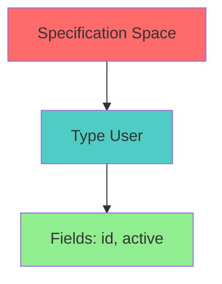
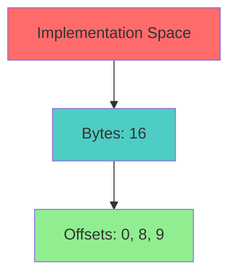
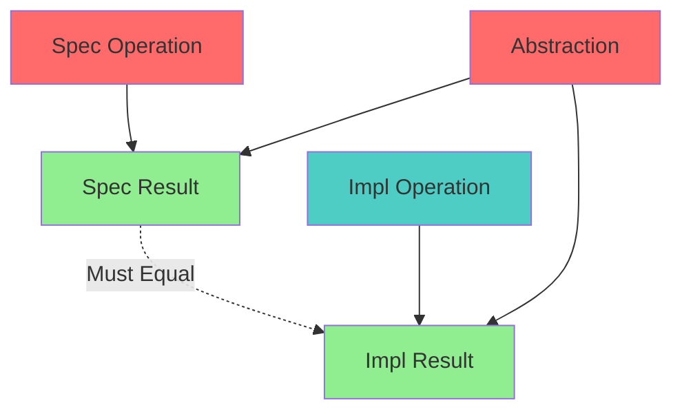

# Data Refinement Specification (ABI)

* File:* `build\abi_data_refinement_spec.md`
* Version:* 1.0.0
* Context:* Layer 3 (Runtime) - FFI & Layout
* Formalism:* Simulation Relations & Refinement Mappings
* Status:* Active
* Last Modified:* 2026-01-01
* Author:* Kilo Code
* Reviewers:* Pending

- -

## 1. Introduction

### 1.1 Purpose

This specification formalizes the **ABI Refinement** system using **Simulation Relations & Refinement Mappings**, providing mathematical foundation for binary layout. This formalization enables the Morph runtime to prove that High-Level Types map perfectly to Low-Level Bytes without information loss.

### 1.2 Scope

This specification covers:
- The Specification Space ($Spec$) for high-level types
- The Implementation Space ($Impl$) for low-level bytes
- The Abstraction Function ($Abs$) for mapping bytes to types
- Padding Formalization for alignment constraints

This specification does not cover:
- Concrete implementation of ABI layer
- Performance optimization details
- Integration with hardware specifications

### 1.3 Definitions, Acronyms, and Abbreviations

| Term | Definition |
|-------|------------|
| **Specification Space ($Spec$)** | High-Level Morph Types |
| **Implementation Space ($Impl$)** | Low-Level Byte Layout |
| **Abstraction Function ($Abs$)** | Maps bytes back to types |
| **Refinement Relation** | Correctness of layout mapping |
| **Alignment Constraint** | Hardware alignment requirement |

### 1.4 References

- Hoare, C. A. R. (1972). "Proof of Correctness of Data Representations"
- IEEE 1016: Recommended Practice for Software Design Descriptions
- ISO/IEC 29148: Systems and software engineering — Requirements engineering

- -

## 2. Formal Definitions

### 2.1 The Specification Space ($Spec$)

The High-Level Morph Types: `type User = { id: u64, active: bool }`.

* ABI-INV-001:* THE system SHALL define specification space for high-level types.

* ABI-REQ-001:* THE system SHALL represent high-level types as specification space.

* Priority:* Critical
* Verification Method:* Test
* Rationale:* Enables type-level reasoning
* Dependencies:* ABI-INV-001
* Traceability:* Section 2.1 (The Specification Space)

#### 2.1.1 Type Definition

* ABI-INV-002:* THE system SHALL define type structure for specification space.

* ABI-REQ-002:* THE system SHALL support structured types.

* Priority:* Critical
* Verification Method:* Test
* Rationale:* Enables complex types
* Dependencies:* ABI-INV-002
* Traceability:* Section 2.1.1 (Type Definition)

### 2.2 The Implementation Space ($Impl$)

The Low-Level Byte Layout: `[byte; 16]`.

* ABI-INV-003:* THE system SHALL define implementation space for low-level bytes.

* ABI-REQ-003:* THE system SHALL represent low-level bytes as implementation space.

* Priority:* Critical
* Verification Method:* Test
* Rationale:* Enables byte-level reasoning
* Dependencies:* ABI-INV-003
* Traceability:* Section 2.2 (The Implementation Space)

#### 2.2.1 Byte Layout

* ABI-INV-004:* THE system SHALL define byte layout for implementation space.

* ABI-REQ-004:* THE system SHALL support byte arrays.

* Priority:* Critical
* Verification Method:* Test
* Rationale:* Enables memory layout
* Dependencies:* ABI-INV-004
* Traceability:* Section 2.2.1 (Byte Layout)

### 2.3 The Abstraction Function ($Abs$)

We define a function $Abs: Impl \to Spec$ that maps bytes back to types.

* ABI-INV-005:* THE system SHALL define abstraction function for mapping bytes to types.

* ABI-REQ-005:* THE system SHALL support abstraction function.

* Priority:* Critical
* Verification Method:* Test
* Rationale:* Enables type reconstruction
* Dependencies:* ABI-INV-005
* Traceability:* Section 2.3 (The Abstraction Function)

#### 2.3.1 Refinement Property

A layout is valid if for every operation $Op_{spec}$ on types, there is a corresponding machine instruction $Op_{impl}$ on bytes such that:

$$ Abs(Op_{impl}(state_{impl})) \equiv Op_{spec}(Abs(state_{impl})) $$

* ABI-INV-006:* THE system SHALL define refinement property for layout correctness.

* ABI-REQ-006:* THE system SHALL enforce refinement property.

* Priority:* Critical
* Verification Method:* Test
* Rationale:* Ensures layout correctness
* Dependencies:* ABI-INV-006
* Traceability:* Section 2.3.1 (Refinement Property)

### 2.4 Padding Formalization

Let `u64` require 8-byte alignment.

- **User layout:* `[u64 id] [bool active] [7 bytes padding]`.
- **Proof:* If compiler generated a packed layout (9 bytes), hardware `Load-u64` instruction might fail (on ARM) or be slow (on x86). The Refinement Relation includes strict **Alignment Constraints** derived from Processor Spec.

* ABI-INV-007:* THE system SHALL define padding formalization for alignment.

* ABI-REQ-007:* THE system SHALL enforce alignment constraints.

* Priority:* Critical
* Verification Method:* Test
* Rationale:* Ensures hardware compatibility
* Dependencies:* ABI-INV-007
* Traceability:* Section 2.4 (Padding Formalization)

#### 2.4.1 Alignment Constraint

* ABI-INV-008:* THE system SHALL define alignment constraint for types.

* ABI-REQ-008:* THE system SHALL enforce alignment requirements.

* Priority:* Critical
* Verification Method:* Test
* Rationale:* Ensures hardware compatibility
* Dependencies:* ABI-INV-008
* Traceability:* Section 2.4.1 (Alignment Constraint)

* ABI-THM-001:* THE system SHALL guarantee that alignment constraints are satisfied.

* Priority:* Critical
* Verification Method:* Analysis
* Rationale:* Ensures hardware compatibility
* Dependencies:* ABI-INV-008
* Traceability:* Section 2.4.1 (Alignment Constraint)

- -

## 3. Requirements

### 3.1 Functional Requirements

* ABI-REQ-009:* THE system SHALL support specification space for high-level types.

* Priority:* Critical
* Verification Method:* Test
* Rationale:* Enables type-level reasoning
* Dependencies:* ABI-INV-001
* Traceability:* Section 2.1 (The Specification Space)

* ABI-REQ-010:* THE system SHALL support implementation space for low-level bytes.

* Priority:* Critical
* Verification Method:* Test
* Rationale:* Enables byte-level reasoning
* Dependencies:* ABI-INV-003
* Traceability:* Section 2.2 (The Implementation Space)

* ABI-REQ-011:* THE system SHALL support abstraction function for mapping bytes to types.

* Priority:* Critical
* Verification Method:* Test
* Rationale:* Enables type reconstruction
* Dependencies:* ABI-INV-005
* Traceability:* Section 2.3 (The Abstraction Function)

* ABI-REQ-012:* THE system SHALL enforce refinement property for layout correctness.

* Priority:* Critical
* Verification Method:* Test
* Rationale:* Ensures layout correctness
* Dependencies:* ABI-INV-006
* Traceability:* Section 2.3.1 (Refinement Property)

* ABI-REQ-013:* THE system SHALL enforce alignment constraints.

* Priority:* Critical
* Verification Method:* Test
* Rationale:* Ensures hardware compatibility
* Dependencies:* ABI-INV-008
* Traceability:* Section 2.4 (Padding Formalization)

### 3.2 Non-Functional Requirements

* ABI-NFR-001:* THE system SHALL perform layout computation in O(n) time for n fields.

* Priority:* High
* Verification Method:* Performance test
* Metric:* Layout computation < 10ms for 100 fields
* Rationale:* Ensures fast compilation
* Dependencies:* None
* Traceability:* Section 2.3 (The Abstraction Function)

- -

## 4. Design

### 4.1 Architecture Overview

The ABI Refinement Engine is implemented as a runtime component that:
1. Defines specification space for high-level types
2. Defines implementation space for low-level bytes
3. Implements abstraction function for mapping bytes to types
4. Enforces refinement property for layout correctness
5. Enforces alignment constraints for hardware compatibility

### 4.2 Data Structures

#### 4.2.1 Specification Type

* Specification Type:* $T = (\text{name}, \text{fields})$

* Components:*
- Name: $\text{name}$
- Fields: $\text{fields} = [(name_1, type_1), \dots, (name_n, type_n)]$

* Invariants:*
1. Type is well-formed
2. Fields are well-typed

#### 4.2.2 Implementation Layout

* Implementation Layout:* $L = (\text{bytes}, \text{offsets})$

* Components:*
- Bytes: $\text{bytes} = [b_0, b_1, \dots, b_{n-1}]$
- Offsets: $\text{offsets} = [o_0, o_1, \dots, o_n]$

* Invariants:*
1. Bytes are valid
2. Offsets are aligned

#### 4.2.3 Refinement Mapping

* Refinement Mapping:* $R = (Spec, Impl, Abs)$

* Components:*
- Specification: $Spec$
- Implementation: $Impl$
- Abstraction: $Abs$

* Invariants:*
1. Refinement property holds
2. Alignment constraints are satisfied

### 4.3 Algorithms

#### 4.3.1 Layout Computation Algorithm

* Algorithm Name:* Compute Layout

* Input:* Specification type $T$

* Output:* Implementation layout $L$

* Mathematical Definition:*
$$
L = \text{ComputeLayout}(T)
$$

* Pseudocode:*
```
function compute_layout(type):
    offset = 0
    bytes = []
    offsets = []

    for (name, field_type) in type.fields:
        field_size = get_size(field_type)
        field_align = get_alignment(field_type)

        # Align offset
        offset = align(offset, field_align)

        # Add field
        bytes.extend(get_bytes(field_type))
        offsets.append(offset)

        offset += field_size

    # Add padding
    total_size = align(offset, get_alignment(type))
    bytes.extend(padding)

    return Layout(bytes, offsets)
```

* Complexity:*
- Time: $O(n)$ where $n$ is number of fields
- Space: $O(n)$ for layout

* Correctness:*
- **Invariant:* Layout is correctly aligned
- **Termination:* Single pass through fields

#### 4.3.2 Abstraction Algorithm

* Algorithm Name:* Abstract Bytes

* Input:* Implementation layout $L$

* Output:* Specification type $T$

* Mathematical Definition:*
$$
T = Abs(L)
$$

* Pseudocode:*
```
function abstract_bytes(layout):
    fields = []
    offset = 0

    for (name, field_type) in type.fields:
        field_bytes = layout.bytes[offset:offset + get_size(field_type)]
        field_value = parse_bytes(field_bytes, field_type)
        fields.append((name, field_value))
        offset += get_size(field_type)

    return Type(type.name, fields)
```

* Complexity:*
- Time: $O(n)$ where $n$ is number of fields
- Space: $O(n)$ for type

* Correctness:*
- **Invariant:* Abstracted type is correct
- **Termination:* Single pass through fields

#### 4.3.3 Refinement Verification Algorithm

* Algorithm Name:* Verify Refinement

* Input:* Specification type $T$, Implementation layout $L$, Abstraction $Abs$

* Output:* Boolean indicating if refinement property holds

* Mathematical Definition:*
$$
\text{IsRefinement}(T, L, Abs) \iff \forall Op_{spec}, Op_{impl}. Abs(Op_{impl}(state_{impl})) \equiv Op_{spec}(Abs(state_{impl}))
$$

* Pseudocode:*
```
function verify_refinement(spec_type, impl_layout, abstraction):
    for operation in spec_operations:
        impl_op = find_impl_operation(operation, impl_layout)
        spec_op = apply_spec_operation(operation, abstraction)

        if impl_op != spec_op:
            return False

    return True
```

* Complexity:*
- Time: $O(n)$ where $n$ is number of operations
- Space: $O(1)$ for verification

* Correctness:*
- **Invariant:* Refinement property is verified
- **Termination:* Single pass through operations

### 4.4 Mermaid Diagrams

#### 4.4.1 Specification Space



#### 4.4.2 Implementation Space



#### 4.4.3 Abstraction Function


#### 4.4.4 Refinement Property



- -

## 5. Correctness Properties

### 5.1 Theorems

#### 5.1.1 Refinement Theorem

* Theorem:* Refinement property ensures layout correctness.

* Proof Sketch:*
1. By definition of refinement, all spec operations have corresponding impl operations
2. By definition of abstraction, impl operations map to spec operations
3. By definition of equivalence, spec and impl results are equal
4. Therefore, layout is correct

* ABI-THM-002:* THE system SHALL guarantee that refinement property holds.

* Priority:* Critical
* Verification Method:* Analysis
* Rationale:* Ensures layout correctness
* Dependencies:* ABI-THM-001
* Traceability:* Section 5.1.1 (Refinement Theorem)

### 5.2 Invariants

#### 5.2.1 Layout Invariants

- **ABI-INV-009:* THE system SHALL maintain that layout is correctly aligned
- **ABI-INV-010:* THE system SHALL maintain that offsets are correct

#### 5.2.2 Refinement Invariants

- **ABI-INV-011:* THE system SHALL maintain that refinement property holds
- **ABI-INV-012:* THE system SHALL maintain that alignment constraints are satisfied

- -

## 6. Examples

### 6.1 Simple Type Layout

```morph
// Simple type layout: User struct
type User = {
    id: u64,
    active: bool,
}
```

* Layout Computation:*
- Type: `User`
- Fields: `[(id, u64), (active, bool)]`
- Layout: `[u64 id] [bool active] [7 bytes padding]`
- Total size: 16 bytes (aligned to 8 bytes)

### 6.2 Alignment Constraint

```morph
// Alignment constraint: u64 requires 8-byte alignment
type User = {
    id: u64,  // 8-byte aligned
    active: bool,  // 1-byte aligned
}
```

* Layout Computation:*
- Type: `User`
- Fields: `[(id, u64), (active, bool)]`
- Layout: `[u64 id] [bool active] [7 bytes padding]`
- Alignment: `id` at offset 0 (8-byte aligned), `active` at offset 8 (1-byte aligned)

### 6.3 Refinement Verification

```morph
// Refinement verification: Operations preserve semantics
let user: User { id: 42, active: true };
let bytes = serialize(user);
let user2 = abstract(bytes);

// Operations should be equivalent
assert user.id == user2.id;
assert user.active == user2.active;
```

* Refinement Verification:*
- Spec: `User { id: u64, active: bool }`
- Impl: `[u64: 42] [bool: true] [padding]`
- Abs: `User { id: 42, active: true }`
- Refinement: Operations preserve semantics

### 6.4 Edge Cases

#### 6.4.1 Packed Layout

```morph
// Edge case: Packed layout (no padding)
#[repr(packed)]
type PackedUser = {
    id: u64,
    active: bool,
}
```

* Layout Computation:*
- Type: `PackedUser`
- Fields: `[(id, u64), (active, bool)]`
- Layout: `[u64 id] [bool active]` (9 bytes, packed)
- Total size: 9 bytes (not aligned)

#### 6.4.2 Nested Types

```morph
// Edge case: Nested types
type Outer = {
    inner: Inner,
}

type Inner = {
    value: i32,
}
```

* Layout Computation:*
- Type: `Outer`
- Fields: `[(inner, Inner)]`
- Layout: `[Inner { value: i32 }]` (4 bytes)
- Total size: 4 bytes (aligned to 4 bytes)

- -

## Change Log

| Version | Date       | Author      | Changes                                                                 |
|---------|------------|-------------|-------------------------------------------------------------------------|
| 1.0.0   | 2026-01-01 | Kilo Code    | Initial version                                                        |
