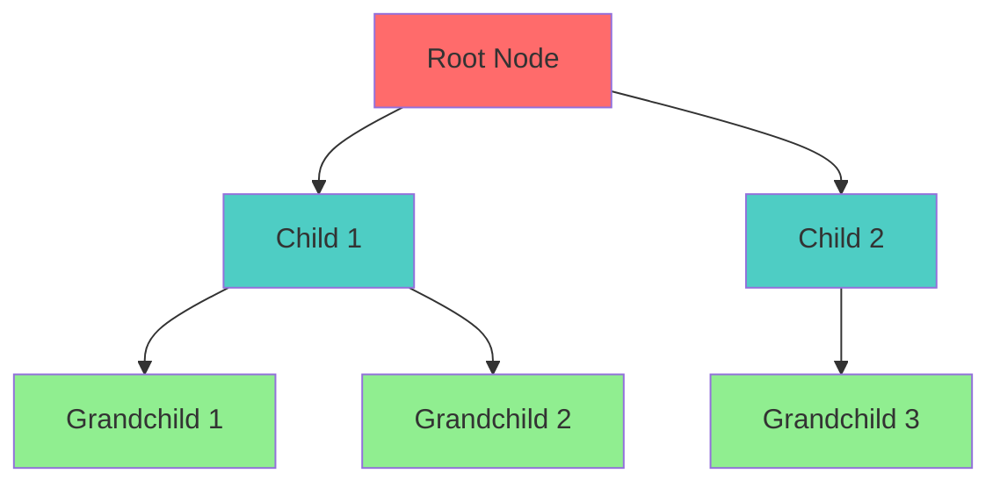
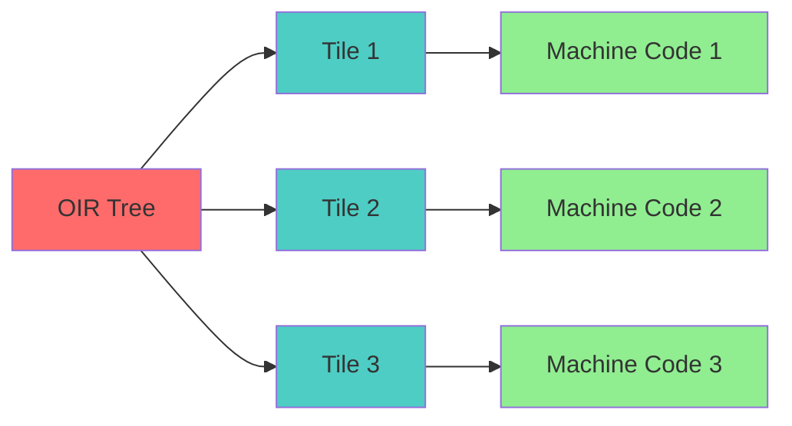
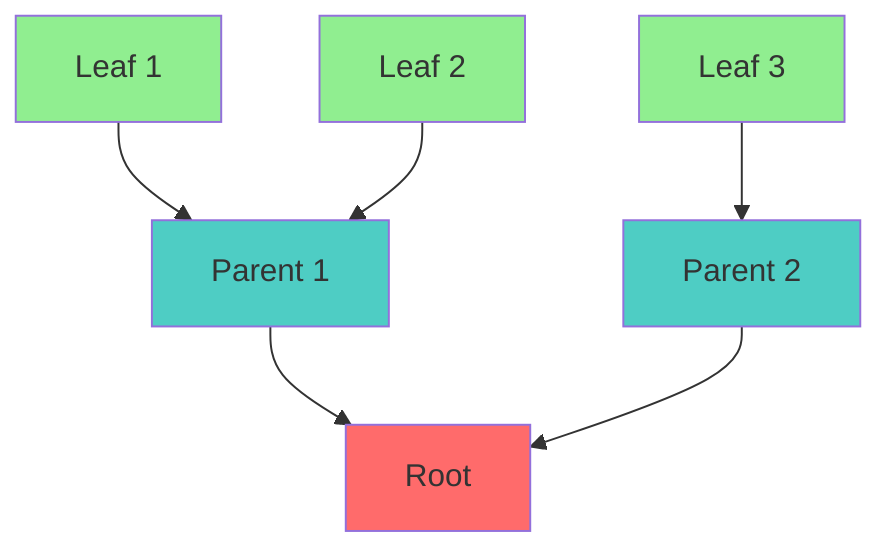

# Instruction Selection Specification (Tiling)

* File:* `build\backend_tiling_spec.md`
* Version:* 1.0.0
* Context:* Layer 2 (Backend) - OIR to Machine Code
* Formalism:* Tree Automata & Dynamic Programming
* Status:* Active
* Last Modified:* 2026-01-01
* Author:* Kilo Code
* Reviewers:* Pending

- -

## 1. Introduction

### 1.1 Purpose

This specification formalizes the **Instruction Selection Engine** using **Tree Covering Theory (Tiling)**, providing mathematical foundation for optimal code generation. This formalization enables the Morph compiler to select the best machine instructions for given OIR patterns.

### 1.2 Scope

This specification covers:
- Covering problem definition
- Tile set and cost model
- Dynamic programming solution
- Attribute-based tile selection (@gpu, @simd)
- Optimization for target architectures

This specification does not cover:
- Concrete implementation of tiling engine
- Machine instruction encoding
- Register allocation details

### 1.3 Definitions, Acronyms, and Abbreviations

| Term | Definition |
|-------|------------|
| **OIR** | Optimized Intermediate Representation |
| **Tile** | Machine instruction pattern covering OIR subtree |
| **Covering** | Set of tiles that exactly match OIR tree |
| **Cost** | Cycles or size metric for tile selection |
| **Dynamic Programming** | Optimization technique for solving covering problem |
| **Attribute** | Compiler directive (@gpu, @simd) modifying tile set |

### 1.4 References

- Aho, A. V., et al. (1986). "Compilers: Principles, Techniques, and Tools"
- IEEE 1016: Recommended Practice for Software Design Descriptions
- ISO/IEC 29148: Systems and software engineering — Requirements engineering

- -

## 2. Formal Definitions

### 2.1 The Covering Problem

The OIR is a tree of IR Operations. The Target Architecture (x86/ARM) supplies a set of **Tiles** (Machine Instructions).
Each Tile covers a specific pattern in the IR tree and has a **Cost** (Cycles/Size).

* TIL-INV-001:* THE system SHALL define covering problem for OIR to machine code.

* TIL-REQ-001:* THE system SHALL solve covering problem for optimal tile selection.

* Priority:* Critical
* Verification Method:* Test
* Rationale:* Enables optimal code generation
* Dependencies:* TIL-INV-001
* Traceability:* Section 2.1 (The Covering Problem)

#### 2.1.1 Input and Goal

- **Input:* OIR Tree $T$.
- **Goal:* Find a covering set of Tiles $\{t_i\}$ such that $\bigcup t_i = T$ and $\sum \text{Cost}(t_i)$ is minimized.

* TIL-INV-002:* THE system SHALL define covering goal as minimizing total cost.

* TIL-REQ-002:* THE system SHALL minimize total tile cost.

* Priority:* Critical
* Verification Method:* Test
* Rationale:* Ensures optimal code generation
* Dependencies:* TIL-INV-002
* Traceability:* Section 2.1.1 (Input and Goal)

### 2.2 Dynamic Programming Solution

For each node $n$ in the OIR Tree, we calculate the minimum cost $C(n)$ to cover the subtree rooted at $n$.

$$ C(n) = \min_{t \in \text{Matches}(n)} (\text{Cost}(t) + \sum_{c \in \text{Children}(t)} C(c)) $$

* TIL-INV-003:* THE system SHALL use dynamic programming for tile selection.

* TIL-REQ-003:* THE system SHALL compute minimum cost for each node.

* Priority:* Critical
* Verification Method:* Test
* Rationale:* Enables optimal tile selection
* Dependencies:* TIL-INV-003
* Traceability:* Section 2.2 (Dynamic Programming Solution)

#### 2.2.1 Cost Computation

* TIL-THM-001:* THE system SHALL guarantee that dynamic programming finds optimal covering.

* Priority:* Critical
* Verification Method:* Analysis
* Rationale:* Ensures optimal tile selection
* Dependencies:* TIL-INV-003
* Traceability:* Section 2.2 (Dynamic Programming Solution)

### 2.3 Attribute-Based Tile Selection

The `@gpu` or `@simd` attributes modify the Tile Set available to the solver.

* TIL-INV-004:* THE system SHALL support attribute-based tile selection.

* TIL-REQ-004:* THE system SHALL modify tile set based on attributes.

* Priority:* High
* Verification Method:* Test
* Rationale:* Enables architecture-specific optimizations
* Dependencies:* TIL-INV-004
* Traceability:* Section 2.3 (Attribute-Based Tile Selection)

#### 2.3.1 SIMD Attribute

If `@simd` is present, Scalar Tiles have infinite cost, forcing the solver to pick Vector Tiles or fail (proving vectorization).

* TIL-THM-002:* THE system SHALL guarantee that @simd forces vector tile selection.

* Priority:* High
* Verification Method:* Analysis
* Rationale:* Ensures SIMD optimization
* Dependencies:* TIL-INV-004
* Traceability:* Section 2.3.1 (SIMD Attribute)

#### 2.3.2 GPU Attribute

If `@gpu` is present, CPU-only Tiles have infinite cost, forcing the solver to pick GPU Tiles or fail.

* TIL-THM-003:* THE system SHALL guarantee that @gpu forces GPU tile selection.

* Priority:* High
* Verification Method:* Analysis
* Rationale:* Ensures GPU optimization
* Dependencies:* TIL-INV-004
* Traceability:* Section 2.3.2 (GPU Attribute)

- -

## 3. Requirements

### 3.1 Functional Requirements

* TIL-REQ-005:* THE system SHALL support OIR tree representation.

* Priority:* Critical
* Verification Method:* Test
* Rationale:* Enables tile selection
* Dependencies:* TIL-INV-001
* Traceability:* Section 2.1 (The Covering Problem)

* TIL-REQ-006:* THE system SHALL support tile set definition.

* Priority:* Critical
* Verification Method:* Test
* Rationale:* Enables instruction selection
* Dependencies:* TIL-INV-001
* Traceability:* Section 2.1 (The Covering Problem)

* TIL-REQ-007:* THE system SHALL support cost model for tiles.

* Priority:* Critical
* Verification Method:* Test
* Rationale:* Enables optimization
* Dependencies:* TIL-INV-001
* Traceability:* Section 2.1 (The Covering Problem)

* TIL-REQ-008:* THE system SHALL support dynamic programming solution.

* Priority:* Critical
* Verification Method:* Test
* Rationale:* Enables optimal tile selection
* Dependencies:* TIL-INV-003
* Traceability:* Section 2.2 (Dynamic Programming Solution)

* TIL-REQ-009:* THE system SHALL support @simd attribute.

* Priority:* High
* Verification Method:* Test
* Rationale:* Enables SIMD optimization
* Dependencies:* TIL-INV-004
* Traceability:* Section 2.3.1 (SIMD Attribute)

* TIL-REQ-010:* THE system SHALL support @gpu attribute.

* Priority:* High
* Verification Method:* Test
* Rationale:* Enables GPU optimization
* Dependencies:* TIL-INV-004
* Traceability:* Section 2.3.2 (GPU Attribute)

### 3.2 Non-Functional Requirements

* TIL-NFR-001:* THE system SHALL compute optimal tiling in O(n) time for n nodes.

* Priority:* High
* Verification Method:* Performance test
* Metric:* Tiling < 100ms for 1000 nodes
* Rationale:* Ensures fast compilation
* Dependencies:* None
* Traceability:* Section 2.2 (Dynamic Programming Solution)

* TIL-NFR-002:* THE system SHALL support up to 1000 tiles in tile set.

* Priority:* Medium
* Verification Method:* Stress test
* Metric:* 1000 tiles
* Rationale:* Supports complex instruction sets
* Dependencies:* None
* Traceability:* Section 2.1 (The Covering Problem)

- -

## 4. Design

### 4.1 Architecture Overview

The Tiling Engine is implemented as a compiler component that:
1. Represents OIR as tree structure
2. Maintains tile set with costs
3. Computes optimal covering using dynamic programming
4. Applies attribute-based tile selection
5. Generates machine code from selected tiles

### 4.2 Data Structures

#### 4.2.1 OIR Node

* OIR Node:* $N = (\text{Operation}, \text{Children}, \text{Cost})$

* Components:*
- IR operation
- Child nodes
- Minimum cost to cover subtree

* Invariants:*
1. Children form a tree
2. Cost is initialized to infinity

#### 4.2.2 Tile

* Tile:* $T = (\text{Pattern}, \text{Instruction}, \text{Cost})$

* Components:*
- OIR pattern to match
- Machine instruction to emit
- Cost (cycles or size)

* Invariants:*
1. Pattern is well-formed
2. Cost is non-negative

### 4.3 Algorithms

#### 4.3.1 Tiling Algorithm

* Algorithm Name:* Compute Optimal Tiling

* Input:* OIR Tree $T$, Tile Set $\mathcal{T}$

* Output:* Optimal tile selection and total cost

* Mathematical Definition:*
$$
\text{Optimal}(T) = \arg\min_{\{t_i\} \in \text{Coverings}(T)} \sum \text{Cost}(t_i)
$$

* Pseudocode:*
```
function compute_optimal_tiling(root, tiles):
    # Post-order traversal
    for node in post_order(root):
        node.cost = infinity

        for tile in tiles:
            if matches(node, tile.pattern):
                tile_cost = tile.cost
                for child in tile.children:
                    tile_cost += child.cost
                if tile_cost < node.cost:
                    node.cost = tile_cost
                    node.tile = tile
```

* Complexity:*
- Time: $O(n \cdot m)$ where $n$ is nodes, $m$ is tiles
- Space: $O(n)$ for cost storage

* Correctness:*
- **Invariant:* Each node has optimal tile
- **Termination:* Single pass through tree

#### 4.3.2 Tile Matching Algorithm

* Algorithm Name:* Match Tile Pattern

* Input:* OIR Node $n$, Tile Pattern $p$

* Output:* Boolean indicating if tile matches

* Mathematical Definition:*
$$
\text{Matches}(n, p) \iff \text{Structure}(n) = \text{Structure}(p)
$$

* Pseudocode:*
```
function matches(node, pattern):
    if node.operation != pattern.operation:
        return False
    if len(node.children) != len(pattern.children):
        return False
    for i in range(len(node.children)):
        if not matches(node.children[i], pattern.children[i]):
            return False
    return True
```

* Complexity:*
- Time: $O(k)$ where $k$ is pattern depth
- Space: $O(1)$

* Correctness:*
- **Invariant:* Match is structural
- **Termination:* Single comparison

#### 4.3.3 Attribute Filtering Algorithm

* Algorithm Name:* Filter Tiles by Attribute

* Input:* Tile Set $\mathcal{T}$, Attribute $a$

* Output:* Filtered Tile Set $\mathcal{T}'$

* Mathematical Definition:*
$$
\mathcal{T}' = \begin{cases}
\mathcal{T} & \text{if } a = \text{None} \\
\{t \in \mathcal{T} \mid \text{Compatible}(t, a)\} & \text{if } a \neq \text{None}
\end{cases}
$$

* Pseudocode:*
```
function filter_tiles(tiles, attribute):
    if attribute is None:
        return tiles
    filtered = []
    for tile in tiles:
        if is_compatible(tile, attribute):
            filtered.append(tile)
    return filtered
```

* Complexity:*
- Time: $O(m)$ where $m$ is number of tiles
- Space: $O(m)$ for filtered set

* Correctness:*
- **Invariant:* Filtered tiles are compatible with attribute
- **Termination:* Single pass through tiles

### 4.4 Mermaid Diagrams

#### 4.4.1 OIR Tree



#### 4.4.2 Tile Covering



#### 4.4.3 Dynamic Programming



- -

## 5. Correctness Properties

### 5.1 Theorems

#### 5.1.1 Optimality Theorem

* Theorem:* Dynamic programming finds optimal tile covering.

* Proof Sketch:*
1. By definition of dynamic programming, $C(n) = \min_{t \in \text{Matches}(n)} (\text{Cost}(t) + \sum C(c))$
2. By definition of optimal covering, $\text{Optimal}(T) = \arg\min_{\{t_i\}} \sum \text{Cost}(t_i)$
3. By property of dynamic programming, bottom-up computation ensures optimal sub-solutions
4. Therefore, dynamic programming finds optimal covering

* TIL-THM-004:* THE system SHALL guarantee optimal tile selection.

* Priority:* Critical
* Verification Method:* Analysis
* Rationale:* Ensures optimal code generation
* Dependencies:* TIL-THM-001
* Traceability:* Section 5.1.1 (Optimality Theorem)

#### 5.1.2 Attribute Enforcement Theorem

* Theorem:* Attribute-based filtering enforces tile selection.

* Proof Sketch:*
1. By definition of attribute filtering, incompatible tiles have infinite cost
2. By definition of cost minimization, infinite cost tiles are never selected
3. Therefore, attribute-based filtering enforces tile selection

* TIL-THM-005:* THE system SHALL guarantee attribute enforcement.

* Priority:* High
* Verification Method:* Analysis
* Rationale:* Ensures architecture-specific optimizations
* Dependencies:* TIL-THM-002, TIL-THM-003
* Traceability:* Section 5.1.2 (Attribute Enforcement Theorem)

### 5.2 Invariants

#### 5.2.1 Tiling Invariants

- **TIL-INV-005:* THE system SHALL maintain that each node has optimal tile
- **TIL-INV-006:* THE system SHALL maintain that tile costs are non-negative
- **TIL-INV-007:* THE system SHALL maintain that tiles form a valid covering

#### 5.2.2 Attribute Invariants

- **TIL-INV-008:* THE system SHALL maintain that incompatible tiles have infinite cost
- **TIL-INV-009:* THE system SHALL maintain that attribute filtering is applied

- -

## 6. Examples

### 6.1 Simple Tiling

```morph
// Simple tiling: Basic arithmetic
// OIR: Add operation
// Tiles: ADD, SUB, MUL, DIV

// Optimal tiling: Use ADD for addition
```

* Tile Selection:*
- Node: Add operation
- Tiles: ADD (cost: 1), SUB (cost: 1), MUL (cost: 3), DIV (cost: 3)
- Optimal: ADD (cost: 1)

### 6.2 SIMD Tiling

```morph
// SIMD tiling: Vector operations
@simd {
    // OIR: Vector addition
    // Tiles: VADD (cost: 1), VADD_SCALAR (cost: 4)

    // Optimal tiling: Use VADD
}
```

* Tile Selection:*
- Node: Vector addition
- Tiles: VADD (cost: 1), VADD_SCALAR (cost: 4)
- Optimal: VADD (cost: 1)
- Attribute: @simd forces VADD selection

### 6.3 GPU Tiling

```morph
// GPU tiling: GPU operations
@gpu {
    // OIR: Matrix multiplication
    // Tiles: GEMM (cost: 10), CPU_GEMM (cost: 100)

    // Optimal tiling: Use GEMM
}
```

* Tile Selection:*
- Node: Matrix multiplication
- Tiles: GEMM (cost: 10), CPU_GEMM (cost: 100)
- Optimal: GEMM (cost: 10)
- Attribute: @gpu forces GEMM selection

### 6.4 Edge Cases

#### 6.4.1 No Matching Tile

```morph
// Edge case: No tile matches pattern
// OIR: Complex operation
// Tiles: No matching tile

// Error: Cannot generate code
```

* Error:* No tile matches OIR pattern

#### 6.4.2 Multiple Optimal Tilings

```morph
// Edge case: Multiple optimal tilings
// OIR: Commutative operation
// Tiles: ADD (cost: 1), SUB (cost: 1)

// Both are optimal
```

* Tile Selection:*
- Node: Addition
- Tiles: ADD (cost: 1), SUB (cost: 1)
- Optimal: Either ADD or SUB (both cost: 1)

- -

## Change Log

| Version | Date       | Author      | Changes                                                                 |
|---------|------------|-------------|-------------------------------------------------------------------------|
| 1.0.0   | 2026-01-01 | Kilo Code    | Initial version                                                        |
