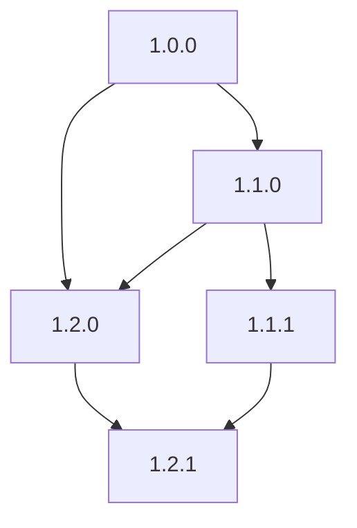
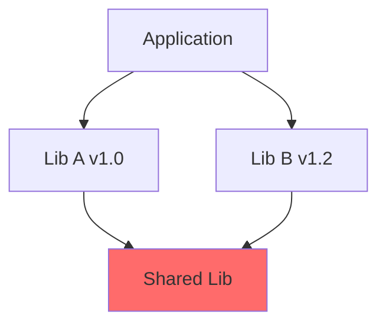
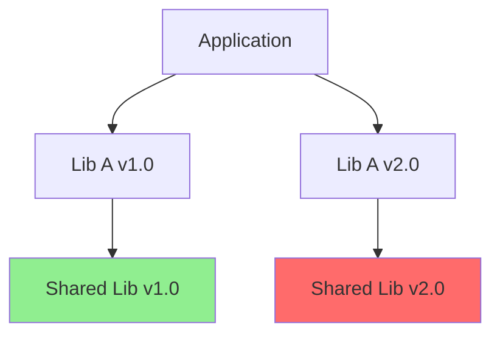
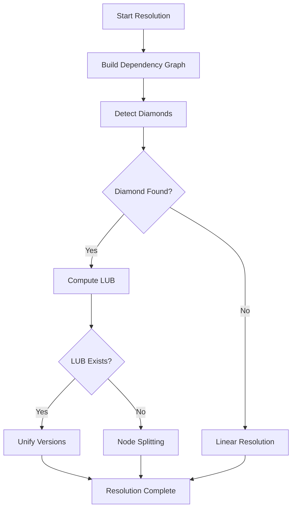

# Build Dependency Lattice Specification

- -
- `File:* `build\build_lattice_spec.md`
- `Version:* 2.0.0
- `Context:* Layer 1 (Build System)
- `Formalism:* Partially Ordered Sets (Posets) & Lattices
- `Status:* Active
- Last Modified:* 2026-01-01
- `Author:* Kilo Code
- `Reviewers:* Pending

- -

## 1. Introduction

### 1.1 Purpose

This specification formalizes the Build System's dependency resolution using **Lattice Theory**, providing mathematical foundation for version compatibility, diamond dependency resolution, and multi-version linking. This formalization ensures that builds are deterministic and reproducible.

### 1.2 Scope

This specification covers:
- The Version Lattice ($\mathcal{L}$) as a Partially Ordered Set
- The Partial Order ($\leq$) for version compatibility
- The Join Operation ($\vee$) for resolving diamond dependencies
- Node Splitting for incompatible versions

This specification does not cover:
- Concrete implementation of dependency graph storage
- Network fetching of dependencies
- Build artifact caching

### 1.3 Definitions, Acronyms, and Abbreviations

| Term | Definition |
|-------|------------|
| **Lattice** | A partially ordered set where every pair of elements has a least upper bound and greatest lower bound |
| **Poset** | Partially Ordered Set - a set with a binary relation that is reflexive, antisymmetric, and transitive |
| **SemVer** | Semantic Versioning - MAJOR.MINOR.PATCH versioning scheme |
| **Diamond Dependency** | A situation where two dependencies require different versions of the same library |
| **LUB** | Least Upper Bound - the smallest element that is greater than or equal to all elements in a set |
| **Node Splitting** | Treating incompatible versions as distinct elements in the build graph |

### 1.4 References

- Davey, B., et al. (2018). "Semantic Versioning 2.0.0"
- Davey, B., et al. (2018). "The Semantic Versioning Specification"
- ISO/IEC 19508: Information technology — Programming languages
- IEEE 1016: Recommended Practice for Software Design Descriptions

- -

## 2. Formal Definitions

### 2.1 The Version Lattice ($\mathcal{L}$)

Dependency resolution is defined over a Lattice of Versions.

#### 2.1.1 The Partial Order ($\leq$)

For two versions $v_a$ and $v_b$:

- $v_a \leq v_b$ if $v_b$ is compatible with and newer/equal to $v_a$
- This allows the Build System to formally verify "SemVer Compatibility" as a reachability problem in the Lattice.

- BLD-INV-001:* THE system SHALL maintain a partial order on version compatibility.

#### 2.1.2 The Join Operation ($\vee$)

When resolving Diamond Dependencies (Lib A needs $v1.0$, Lib B needs $v1.2$):

- We calculate the **Least Upper Bound (LUB)** or Join: $v_{res} = v1.0 \vee v1.2$
- If $v_{res}$ exists within the semantic constraints, we unify
- If $v_{res}$ does not exist (Major version mismatch, e.g., $v1.0 \vee v2.0$ is undefined in SemVer), the Graph Solver performs **Node Splitting** (Multi-Version Linking), treating them as distinct elements in the Build Graph

- BLD-REQ-001:* THE system SHALL compute the least upper bound for diamond dependencies.

- `Priority:* Critical
- Verification Method:* Test
- `Rationale:* Ensures correct dependency resolution
- `Dependencies:* BLD-INV-001
- `Traceability:* Section 2.1.2 (Join Operation)

### 2.2 Lattice Properties

#### 2.2.1 Lattice Axioms

A lattice $\mathcal{L} = (S, \leq)$ must satisfy:

1. **Reflexivity:* $\forall x \in S, x \leq x$
2. **Antisymmetry:* $\forall x, y \in S, x \leq y \land y \leq x \implies x = y$
3. **Transitivity:* $\forall x, y, z \in S, x \leq y \land y \leq z \implies x \leq z$
4. **Existence of LUB:* $\forall x, y \in S, \exists z \in S$ such that $x \leq z \land y \leq z \land \forall w, (x \leq w \land y \leq w) \implies z \leq w$

- BLD-INV-002:* THE system SHALL maintain lattice properties for version ordering.

#### 2.2.2 SemVer Compatibility

For Semantic Versioning $v = M.m.p$:

- $v_a \leq v_b$ if:
  - $M_a < M_b$, OR
  - $M_a = M_b \land m_a < m_b$, OR
  - $M_a = M_b \land m_a = m_b \land p_a \leq p_b$

- BLD-INV-003:* THE system SHALL enforce SemVer compatibility rules.

### 2.3 Node Splitting

When LUB does not exist (incompatible major versions):

$$ v_{res} = v1.0 \vee v2.0 = \text{undefined} $$

The Build System performs **Node Splitting**:

$$ \text{Split}(v_1, v_2) = (v_1', v_2') $$

where $v_1'$ and $v_2'$ are treated as distinct nodes in the build graph.

- BLD-REQ-002:* THE system SHALL perform node splitting for incompatible versions.

- `Priority:* High
- Verification Method:* Test
- `Rationale:* Enables multi-version linking
- `Dependencies:* BLD-INV-002
- `Traceability:* Section 2.3 (Node Splitting)

- -

## 3. Requirements

### 3.1 Functional Requirements

- BLD-REQ-003:* THE system SHALL detect diamond dependencies in the dependency graph.

- `Priority:* Critical
- Verification Method:* Test
- `Rationale:* Enables proper dependency resolution
- `Dependencies:* None
- `Traceability:* Section 2.1.2 (Join Operation)

- BLD-REQ-004:* THE system SHALL compute the least upper bound for compatible versions.

- `Priority:* Critical
- Verification Method:* Test
- `Rationale:* Ensures minimal version that satisfies all constraints
- `Dependencies:* BLD-REQ-001
- `Traceability:* Section 2.1.2 (Join Operation)

- BLD-REQ-005:* THE system SHALL reject incompatible major versions when LUB is undefined.

- `Priority:* High
- Verification Method:* Test
- `Rationale:* Prevents breaking changes
- `Dependencies:* BLD-INV-003
- `Traceability:* Section 2.2.2 (SemVer Compatibility)

- BLD-REQ-006:* THE system SHALL support multi-version linking through node splitting.

- `Priority:* High
- Verification Method:* Test
- `Rationale:* Enables coexistence of incompatible versions
- `Dependencies:* BLD-REQ-002
- `Traceability:* Section 2.3 (Node Splitting)

- BLD-REQ-007:* THE system SHALL maintain transitive closure of dependencies.

- `Priority:* High
- Verification Method:* Test
- `Rationale:* Ensures all indirect dependencies are included
- `Dependencies:* BLD-INV-002
- `Traceability:* Section 2.2.1 (Lattice Axioms)

### 3.2 Non-Functional Requirements

- BLD-NFR-001:* THE system SHALL resolve dependencies in O(V + E) time complexity.

- `Priority:* High
- Verification Method:* Analysis
- `Metric:* Resolution < 100ms for 10K dependencies
- `Rationale:* Ensures fast builds

- BLD-NFR-002:* THE system SHALL support dependency graphs with up to 100,000 nodes.

- `Priority:* Medium
- Verification Method:* Demonstration
- `Metric:* 100K nodes with < 1GB memory
- `Rationale:* Supports large-scale projects

- BLD-NFR-003:* THE system SHALL provide clear error messages for version conflicts.

- `Priority:* High
- Verification Method:* Demonstration
- `Metric:* Error message includes conflicting versions
- `Rationale:* Improves developer experience

- -

## 4. Design

### 4.1 Architecture Overview

The Build System implements a dependency resolver that operates on a version lattice. The resolver uses lattice theory to guarantee that dependency resolution is deterministic and produces the minimal compatible version.

### 4.2 Data Structures

#### 4.2.1 Version Node

- Version Node:* $V = (\text{name}, \text{version}, \text{dependencies})$

- `Components:*
- $\text{name} \in \text{String}$: Package name
- $\text{version} \in \text{SemVer}$: Version number
- $\text{dependencies} \in \mathcal{P}(V)$: Set of dependency nodes

- `Invariants:*
1. $\forall v \in V, \text{version}(v)$ is valid SemVer
2. $\forall v \in V, \text{dependencies}(v)$ is acyclic

#### 4.2.2 Dependency Graph

- Dependency Graph:* $G = (V, E)$

- `Components:*
- $V$: Set of version nodes
- $E \subset V \times V$: Dependency edges

- `Invariants:*
1. $G$ is a DAG (no cycles)
2. $\forall (u, v) \in E, \text{version}(u) \leq \text{version}(v)$

### 4.3 Algorithms

#### 4.3.1 LUB Computation Algorithm

- Algorithm Name:* Compute Least Upper Bound

- `Input:* Versions $v_1, v_2$

- `Output:* LUB version or undefined

- Mathematical Definition:*
$$
\text{LUB}(v_1, v_2) = \begin{cases}
\max(v_1, v_2) & \text{if } v_1 \leq v_2 \lor v_2 \leq v_1 \\
\text{undefined} & \text{otherwise}
\end{cases}
$$

- `Pseudocode:*
```
function compute_lub(v1, v2):
    if not compatible(v1, v2):
        return undefined
    if v1 <= v2:
        return v2
    if v2 <= v1:
        return v1
    // Find minimal version that is >= both
    return find_minimal_compatible(v1, v2)
```

- `Complexity:*
- Time: $O(1)$ for SemVer comparison
- Space: $O(1)$

- `Correctness:*
- **Invariant:* Returns LUB if it exists
- **Termination:* Always terminates

#### 4.3.2 Diamond Detection Algorithm

- Algorithm Name:* Detect Diamond Dependencies

- `Input:* Dependency graph $G = (V, E)$

- `Output:* Set of diamond conflicts

- Mathematical Definition:*
$$
\text{Diamond}(G) = \{ (v_1, v_2) \in V^2 \mid \exists u \in V, (u, v_1) \in E \land (u, v_2) \in E \land v_1 \neq v_2 \} $$
$$

- `Pseudocode:*
```
function detect_diamonds(graph):
    diamonds = []
    for node in graph.vertices:
        dependents = find_all_dependents(node)
        for i in 0..len(dependents):
            for j in i+1..len(dependents):
                if dependents[i].name == dependents[j].name:
                    if dependents[i].version != dependents[j].version:
                        diamonds.append((node, dependents[i], dependents[j]))
    return diamonds
```

- `Complexity:*
- Time: $O(V \cdot d^2)$ where $d$ is max dependents
- Space: $O(d^2)$

- `Correctness:*
- **Invariant:* Detects all diamond conflicts
- **Termination:* Loops terminate after processing all nodes

### 4.4 Mermaid Diagrams

#### 4.4.1 Version Lattice



#### 4.4.2 Diamond Dependency



#### 4.4.3 Node Splitting



#### 4.4.4 Dependency Resolution Flow



- -

## 5. Correctness Properties

### 5.1 Theorems

#### 5.1.1 LUB Uniqueness Theorem

- `Theorem:* In a lattice, the least upper bound of any two elements is unique.

- Proof Sketch:*
1. By definition of LUB, $z$ is the smallest element $\geq$ both $x$ and $y$
2. If there were two LUBs $z_1$ and $z_2$, then $z_1 \leq z_2$ and $z_2 \leq z_1$
3. By antisymmetry, $z_1 = z_2$
4. Therefore, LUB is unique

- BLD-THM-001:* THE system SHALL guarantee unique LUB for compatible versions.

- `Priority:* Critical
- Verification Method:* Analysis
- `Rationale:* Ensures deterministic resolution
- `Dependencies:* BLD-INV-002
- `Traceability:* Section 2.2.1 (Lattice Axioms)

#### 5.1.2 Diamond Resolution Theorem

- `Theorem:* If a diamond dependency exists and LUB is defined, using LUB produces a valid build.

- Proof Sketch:*
1. By definition of LUB, $v_{res}$ is compatible with both $v_1$ and $v_2$
2. Since $v_1$ and $v_2$ are compatible with their dependents, $v_{res}$ is also compatible
3. Therefore, build with $v_{res}$ is valid

- BLD-THM-002:* THE system SHALL guarantee valid builds for resolved diamonds.

- `Priority:* High
- Verification Method:* Analysis
- `Rationale:* Ensures correctness of dependency resolution
- `Dependencies:* BLD-REQ-004
- `Traceability:* Section 2.1.2 (Join Operation)

### 5.2 Invariants

#### 5.2.1 Lattice Invariants

- **BLD-INV-004:* THE system SHALL maintain that version ordering is reflexive
- **BLD-INV-005:* THE system SHALL maintain that version ordering is antisymmetric
- **BLD-INV-006:* THE system SHALL maintain that version ordering is transitive

#### 5.2.2 Resolution Invariants

- **BLD-INV-007:* THE system SHALL maintain that resolved version is compatible with all constraints
- **BLD-INV-008:* THE system SHALL maintain that resolved version is minimal among compatible versions
- **BLD-INV-009:* THE system SHALL maintain that node splitting preserves dependency structure

- -

## 6. Examples

### 6.1 Simple Dependency Resolution

```morph
// morph.toml
[dependencies]
lib_a = "1.0.0"
lib_b = "1.1.0"

// lib_a depends on shared = "1.0.0"
// lib_b depends on shared = "1.0.0"
```

- `Resolution:*
1. Both `lib_a` and `lib_b` require `shared = "1.0.0"`
2. LUB of `1.0.0` and `1.0.0` is `1.0.0`
3. Build uses `shared = "1.0.0"` (no conflict)

### 6.2 Diamond Dependency

```morph
// morph.toml
[dependencies]
lib_a = "1.0.0"
lib_b = "1.2.0"

// lib_a depends on shared = "1.0.0"
// lib_b depends on shared = "1.2.0"
```

- `Resolution:*
1. `lib_a` requires `shared = "1.0.0"`
2. `lib_b` requires `shared = "1.2.0"`
3. LUB of `1.0.0` and `1.2.0` is `1.2.0`
4. Build uses `shared = "1.2.0"` (upgrades `lib_a`'s dependency)

### 6.3 Incompatible Versions

```morph
// morph.toml
[dependencies]
lib_a = "1.0.0"
lib_b = "2.0.0"

// lib_a depends on shared = "1.0.0"
// lib_b depends on shared = "2.0.0"
```

- `Resolution:*
1. `lib_a` requires `shared = "1.0.0"`
2. `lib_b` requires `shared = "2.0.0"`
3. LUB of `1.0.0` and `2.0.0` is undefined (major version mismatch)
4. Build performs node splitting:
   - `lib_a` links to `shared = "1.0.0"`
   - `lib_b` links to `shared = "2.0.0"`
5. Both versions coexist in build

### 6.4 Transitive Dependencies

```morph
// morph.toml
[dependencies]
app = "1.0.0"

// app depends on lib_a = "1.0.0"
// lib_a depends on lib_b = "1.0.0"
// lib_b depends on shared = "1.0.0"
```

- `Resolution:*
1. Build computes transitive closure
2. Final dependency set: `{app, lib_a, lib_b, shared}`
3. All dependencies are resolved in topological order

### 6.5 Edge Cases

#### 6.5.1 Self-Dependency

```morph
// morph.toml
[dependencies]
lib = "1.0.0"

// lib depends on lib = "1.0.0" (circular!)
```

- `Error:* "Circular dependency detected: lib -> lib"

#### 6.5.2 Missing Dependency

```morph
// morph.toml
[dependencies]
app = "1.0.0"

// app depends on missing_lib = "1.0.0"
```

- `Error:* "Dependency not found: missing_lib"

#### 6.5.3 Version Range

```morph
// morph.toml
[dependencies]
app = "1.0.0"

// app depends on lib = "^1.2.0" (>= 1.2.0, < 2.0.0)
```

- `Resolution:*
1. Build searches for compatible version in range
2. Selects minimal version satisfying constraint
3. Uses selected version for build

- -

## Change Log

| Version | Date       | Author      | Changes                                                                 |
|---------|------------|-------------|-------------------------------------------------------------------------|
| 2.0.0   | 2026-01-01 | Kilo Code    | Refactored to match specification convention v2.0.0, added EARS requirements, Mermaid diagrams, and examples |
| 1.0.0   | 2025-12-01 | Kilo Code    | Initial version                                                        |
