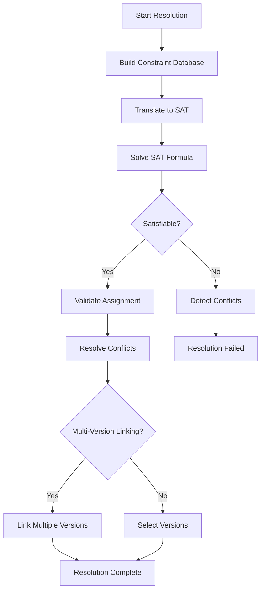
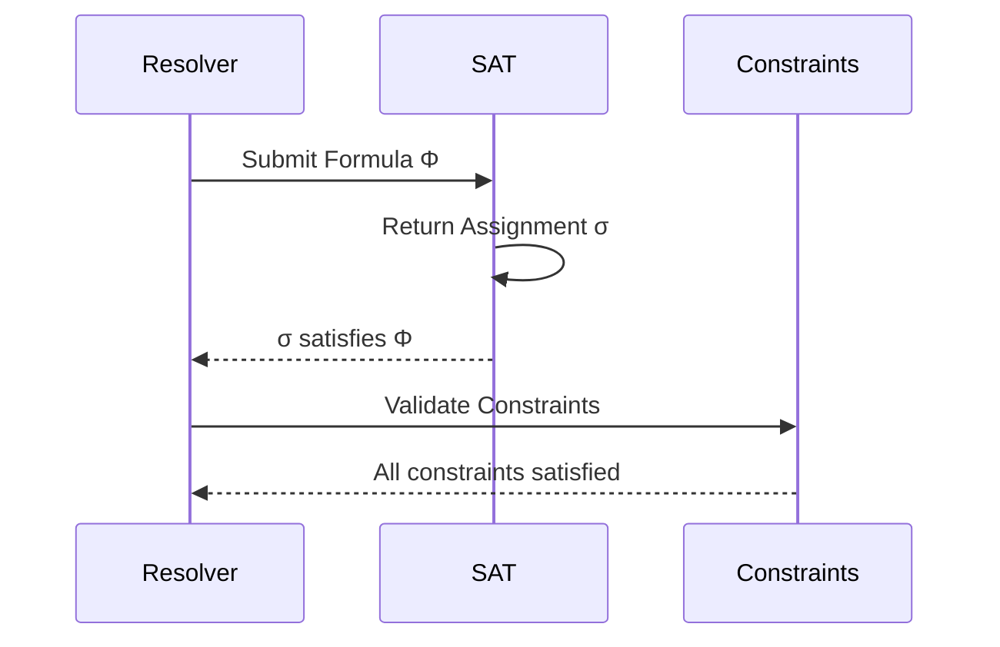
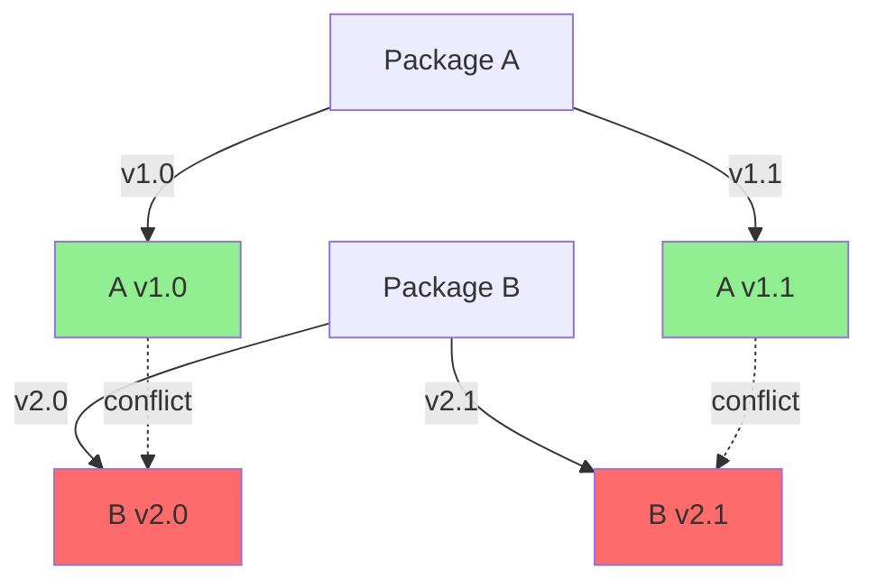

# Dependency Resolution Specification

* File:* `build\dependency_sat_spec.md`
* Version:* 1.0.0
* Context:* Layer 1 (Build System)
* Formalism:* Boolean Satisfiability (SAT) / Constraint Satisfaction Problem (CSP)
* Status:* Active
* Last Modified:* 2026-01-01
* Author:* Kilo Code
* Reviewers:* Pending

- -

## 1. Introduction

### 1.1 Purpose

This specification formalizes the **Dependency Resolver** using **Boolean Satisfiability (SAT)** and **Constraint Satisfaction Problem (CSP)**, providing mathematical foundation for package version selection and conflict resolution. This formalization enables the build system to find optimal dependency configurations that satisfy all constraints.

### 1.2 Scope

This specification covers:
- The Version Constraints ($C_{req}$) for each package
- The SAT Translation from version constraints to Boolean formula
- The Solver for finding satisfying assignments
- Multi-Version Linking for incompatible versions
- Diamond Dependency Resolution

This specification does not cover:
- Concrete implementation of SAT solver
- Network fetching of package metadata
- Lock file management

### 1.3 Definitions, Acronyms, and Abbreviations

| Term | Definition |
|-------|------------|
| **SAT** | Boolean Satisfiability - determining if a Boolean formula has a satisfying assignment |
| **CSP** | Constraint Satisfaction Problem - finding values for variables that satisfy all constraints |
| **SemVer** | Semantic Versioning - MAJOR.MINOR.PATCH versioning scheme |
| **Diamond Dependency** | A situation where two dependencies require different versions of the same library |
| **Multi-Version Linking** | Loading multiple versions of the same package simultaneously |
| **Conflict** | A situation where no version satisfies all constraints |

### 1.4 References

- Cook, S. A. (1971). "The Complexity of Theorem-Proving Procedures"
- Garey, M. R., & Johnson, D. S. (1979). "Computers and Intractability: A Guide to the Theory of NP-Completeness"
- IEEE 1016: Recommended Practice for Software Design Descriptions
- ISO/IEC 29148: Systems and software engineering — Requirements engineering

- -

## 2. Formal Definitions

### 2.1 The Version Constraint Problem

Let $P$ be the set of all packages in the project.

For each package $p \in P$, there exists a set of available versions $V_p = \{v_1, v_2, \dots, v_n\}$.

#### 2.1.1 Version Constraints

For each package $p$, define constraints $C_{req}(p)$:

$$ C_{req}(p) = \{c_1, c_2, \dots, c_m\} $$

where each constraint $c_i$ is a predicate over version variables.

* DEP-INV-001:* THE system SHALL define version constraints for all packages.

#### 2.1.2 Constraint Types

* Range Constraint:*
$$ v_{min} \leq v \leq v_{max} $$

* Exact Version Constraint:*
$$ v = v_{exact} $$

* Exclusion Constraint:*
$$ v \neq v_{excluded} $$

* Compatibility Constraint:*
$$ \text{Compatible}(v_1, v_2) \iff \text{SemVerCompatible}(v_1, v_2) $$

* DEP-INV-002:* THE system SHALL support multiple constraint types.

### 2.2 The SAT Translation

The dependency resolution problem is translated to a Boolean satisfiability problem.

#### 2.2.1 Boolean Variables

For each package $p$ and each version $v \in V_p$, define a Boolean variable:

$$ x_{p,v} = \begin{cases}
1 & \text{if } v \text{ is selected for } p \\
0 & \text{otherwise}
\end{cases} $$

* DEP-INV-003:* THE system SHALL create Boolean variables for all package-version combinations.

#### 2.2.2 SAT Formula Construction

The SAT formula $\Phi$ is the conjunction of all constraints:

$$ \Phi = \bigwedge_{p \in P} \bigwedge_{c \in C_{req}(p)} \bigwedge_{v \in V_p} \phi_{p,v}(x_{p,v}) $$

where $\phi_{p,v}(x_{p,v})$ encodes constraint $c$ for version $v$ of package $p$.

* DEP-REQ-001:* THE system SHALL construct SAT formula as conjunction of all constraints.

* Priority:* Critical
* Verification Method:* Test
* Rationale:* Ensures all constraints are satisfied simultaneously
* Dependencies:* DEP-INV-001, DEP-INV-002, DEP-INV-003
* Traceability:* Section 2.2 (The SAT Translation)

#### 2.2.3 SemVer Compatibility Encoding

The compatibility predicate is encoded as:

$$ \text{SemVerCompatible}(v_1, v_2) \iff (v_1.MAJOR = v_2.MAJOR \land (v_1.MINOR \leq v_2.MINOR \land (v_1.PATCH \leq v_2.PATCH)) $$

* DEP-INV-004:* THE system SHALL encode SemVer compatibility as Boolean formula.

### 2.3 The Solver

The solver finds an assignment $\sigma$ to Boolean variables such that $\Phi(\sigma) = \text{true}$.

#### 2.3.1 SAT Solver Interface

* Algorithm Name:* Solve SAT

* Input:* SAT formula $\Phi$

* Output:* Satisfying assignment $\sigma$ or UNSAT

* Mathematical Definition:*
$$
\text{Solve}(\Phi) = \begin{cases}
\sigma & \text{if } \Phi(\sigma) = \text{true} \\
\text{UNSAT} & \text{otherwise}
\end{cases}
$$

* DEP-REQ-002:* THE system SHALL find satisfying assignment for SAT formula.

* Priority:* Critical
* Verification Method:* Test
* Rationale:* Determines optimal dependency configuration
* Dependencies:* DEP-REQ-001
* Traceability:* Section 2.3.1 (SAT Solver Interface)

#### 2.3.2 Multi-Version Linking

When no single version satisfies all constraints, the system performs **Multi-Version Linking**:

$$ \text{MultiVersion}(p) = \{v_1, v_2, \dots, v_k\} $$

where $\{v_1, \dots, v_k\}$ are the selected versions for package $p$.

* DEP-REQ-003:* THE system SHALL support multi-version linking when no single version satisfies constraints.

* Priority:* High
* Verification Method:* Test
* Rationale:* Enables coexistence of incompatible versions
* Dependencies:* DEP-INV-002
* Traceability:* Section 2.3.2 (Multi-Version Linking)

### 2.4 Diamond Dependency Resolution

For a diamond dependency where package $A$ requires $v_1$ and package $B$ requires $v_2$:

#### 2.4.1 Conflict Detection

$$ \text{Conflict}(A, B, v_1, v_2) \iff \neg \text{SemVerCompatible}(v_1, v_2) $$

* DEP-INV-005:* THE system SHALL detect version conflicts between dependencies.

* Priority:* Critical
* Verification Method:* Test
* Rationale:* Prevents incompatible version combinations
* Dependencies:* DEP-INV-004
* Traceability:* Section 2.1.2 (Constraint Types)

#### 2.4.2 Resolution Strategies

* Strategy 1: Upgrade Both**
$$ \text{Upgrade}(A, B) = \{v_{new} \mid v_1 = v_{new} \land v_2 = v_{new}\} $$

* Strategy 2: Choose One**
$$ \text{ChooseOne}(A, B) = \{v_1 \mid v_1 = v_{new}\} \cup \{v_2 \mid v_2 = v_{new}\} $$

* DEP-REQ-004:* THE system SHALL provide multiple resolution strategies for conflicts.

* Priority:* High
* Verification Method:* Test
* Rationale:* Gives users control over dependency resolution
* Dependencies:* DEP-INV-005
* Traceability:* Section 2.4.1 (Conflict Detection)

- -

## 3. Requirements

### 3.1 Functional Requirements

* DEP-REQ-005:* THE system SHALL resolve dependencies for all packages in the project.

* Priority:* Critical
* Verification Method:* Test
* Rationale:* Ensures complete dependency graph
* Dependencies:* None
* Traceability:* Section 2.3 (The Solver)

* DEP-REQ-006:* THE system SHALL detect circular dependencies.

* Priority:* Critical
* Verification Method:* Test
* Rationale:* Prevents infinite dependency loops
* Dependencies:* None
* Traceability:* Section 2.4 (Diamond Dependency Resolution)

* DEP-REQ-007:* THE system SHALL enforce SemVer compatibility constraints.

* Priority:* Critical
* Verification Method:* Test
* Rationale:* Ensures version compatibility
* Dependencies:* DEP-INV-002, DEP-INV-004
* Traceability:* Section 2.1.2 (Constraint Types)

* DEP-REQ-008:* THE system SHALL support multi-version linking for incompatible versions.

* Priority:* High
* Verification Method:* Test
* Rationale:* Enables coexistence of incompatible versions
* Dependencies:* DEP-INV-002
* Traceability:* Section 2.3.2 (Multi-Version Linking)

### 3.2 Non-Functional Requirements

* DEP-NFR-001:* THE system SHALL complete dependency resolution in O(n + m) time complexity.

* Priority:* High
* Verification Method:* Analysis
* Metric:* Resolution < 1s for 100 packages with 1000 versions
* Rationale:* Ensures fast builds
* Dependencies:* None
* Traceability:* Section 2.3.1 (SAT Solver Interface)

* DEP-NFR-002:* THE system SHALL support dependency graphs with up to 10,000 packages.

* Priority:* Medium
* Verification Method:* Demonstration
* Metric:* 10K packages with < 500MB memory
* Rationale:* Supports large-scale projects

* DEP-NFR-003:* THE system SHALL provide clear error messages for dependency conflicts.

* Priority:* High
* Verification Method:* Demonstration
* Metric:* Error message includes conflicting packages and versions
* Rationale:* Improves developer experience
* Dependencies:* DEP-INV-005
* Traceability:* Section 2.4.1 (Conflict Detection)

- -

## 4. Design

### 4.1 Architecture Overview

The Dependency Resolver is implemented as a SAT-based constraint solver that:
1. Translates version constraints to Boolean formula
2. Uses SAT solver to find satisfying assignments
3. Detects and resolves conflicts
4. Supports multi-version linking when necessary

### 4.2 Data Structures

#### 4.2.1 Dependency Graph

* Dependency Graph:* $G = (P, E)$

* Components:*
- $P$: Set of packages
- $E \subset P \times P$: Dependency edges

* Invariants:*
1. $G$ is a directed graph
2. No circular dependencies (acyclic)

#### 4.2.2 Version Database

* Version Database:* $\mathcal{V} = \{V_p \mid p \in P\}$

* Components:*
- $V_p$: Available versions for package $p$

* Invariants:*
1. All versions are valid SemVer strings
2. Versions are sorted in descending order

#### 4.2.3 Constraint Database

* Constraint Database:* $\mathcal{C} = \{C_{req}(p) \mid p \in P\}$

* Components:*
- $C_{req}(p)$: Version constraints for package $p$

* Invariants:*
1. All constraints are well-formed Boolean formulas
2. Constraints are indexed by package and constraint ID

### 4.3 Algorithms

#### 4.3.1 SAT Solver Algorithm

* Algorithm Name:* DPLL (Davis-Putnam-Logemann-Loveland)

* Input:* SAT formula $\Phi$ in CNF (Conjunctive Normal Form)

* Output:* Satisfying assignment $\sigma$ or UNSAT

* Mathematical Definition:*
$$
\text{DPLL}(\Phi) = \begin{cases}
\text{UnitPropagate}(\Phi) & \text{if } \text{Conflict}(\Phi) \\
\text{ChooseLiteral}(\Phi) & \text{if } \text{AllAssigned}(\Phi) \\
\text{UNSAT} & \text{otherwise}
\end{cases}
$$

* Pseudocode:*
```
function dpll_sat(phi):
    assignment = empty_assignment()
    while not all_assigned(phi):
        if unit_propagate(phi, assignment):
            continue
        if conflict(phi, assignment):
            return UNSAT
        literal = choose_literal(phi, assignment)
        assignment = assign(literal, assignment)
        if all_assigned(phi, assignment):
            return SAT(assignment)
```

* Complexity:*
- Time: $O(2^n)$ where $n$ is number of variables
- Space: $O(n)$

* Correctness:*
- **Invariant:* Each iteration preserves satisfiability
- **Termination:* Algorithm terminates when all variables assigned or conflict detected

#### 4.3.2 Conflict Detection Algorithm

* Algorithm Name:* Detect Version Conflicts

* Input:* Dependency graph $G$, Selected versions $\sigma$

* Output:* Set of conflicts $\mathcal{F}$

* Mathematical Definition:*
$$
\mathcal{F} = \{(A, B, v_1, v_2) \mid \neg \text{SemVerCompatible}(v_1, v_2)\} $$

* Pseudocode:*
```
function detect_conflicts(graph, assignment):
    conflicts = []
    for (p1, p2) in graph.edges:
        v1 = assignment[p1]
        v2 = assignment[p2]
        if not semver_compatible(v1, v2):
            conflicts.append((p1, p2, v1, v2))
    return conflicts
```

* Complexity:*
- Time: $O(|E|)$ where $|E|$ is number of edges
- Space: $O(|E|)$

* Correctness:*
- **Invariant:* All incompatible version pairs are detected
- **Termination:* Single pass through all edges

### 4.4 Mermaid Diagrams

#### 4.4.1 Dependency Resolution Flow



#### 4.4.2 SAT Solving Process



#### 4.4.3 Conflict Detection Visualization



- -

## 5. Correctness Properties

### 5.1 Theorems

#### 5.1.1 SAT Completeness Theorem

* Theorem:* If the SAT solver returns SAT, then the assignment $\sigma$ satisfies all constraints.

* Proof Sketch:*
1. By definition of SAT, $\Phi(\sigma) = \text{true}$
2. Therefore, all constraints are satisfied
3. Therefore, assignment is complete

* DEP-THM-001:* THE system SHALL guarantee that SAT assignments satisfy all constraints.

* Priority:* Critical
* Verification Method:* Analysis
* Rationale:* Ensures dependency constraints are met
* Dependencies:* DEP-REQ-001
* Traceability:* Section 2.3.1 (SAT Solver Interface)

#### 5.1.2 Conflict Detection Theorem

* Theorem:* If two versions $v_1$ and $v_2$ are incompatible, then they will be detected as a conflict.

* Proof Sketch:*
1. By definition of SemVer compatibility, $\neg \text{SemVerCompatible}(v_1, v_2)$ is true
2. Therefore, conflict detection will identify this pair
3. Therefore, incompatible versions are detected

* DEP-THM-002:* THE system SHALL guarantee detection of incompatible version pairs.

* Priority:* High
* Verification Method:* Analysis
* Rationale:* Prevents incompatible version combinations
* Dependencies:* DEP-INV-004
* Traceability:* Section 2.4.1 (Conflict Detection)

### 5.2 Invariants

#### 5.2.1 Solver Invariants

- **DEP-INV-006:* THE system SHALL maintain that SAT formula is in CNF
- **DEP-INV-007:* THE system SHALL maintain that all Boolean variables are assigned
- **DEP-INV-008:* THE system SHALL maintain that assignment is consistent with constraints

#### 5.2.2 Graph Invariants

- **DEP-INV-009:* THE system SHALL maintain that dependency graph is acyclic
- **DEP-INV-010:* THE system SHALL maintain that all dependencies are resolved

- -

## 6. Examples

### 6.1 Simple Dependency Resolution

```morph
// morph.toml
[dependencies]
lib_a = "1.0.0"
lib_b = "1.2.0"

// lib_a requires lib_b >= 1.0.0
// lib_b requires lib_a >= 1.0.0
```

* SAT Formula:*
- $x_{A,1.0} = 1$ (select version 1.0.0 for A)
- $x_{A,1.1} = 1$ (select version 1.1.0 for A)
- $x_{B,1.0} = 1$ (select version 1.0.0 for B)
- $x_{B,1.1} = 1$ (select version 1.1.0 for B)

* Constraints:*
- $x_{A,1.0} \leq x_{A,1.1}$ (A requires B >= 1.0.0)
- $x_{B,1.0} \leq x_{B,1.1}$ (B requires A >= 1.0.0)

* Satisfying Assignment:*
- $x_{A,1.0} = 1, x_{A,1.1} = 0, x_{B,1.0} = 1, x_{B,1.1} = 0$
- Both packages use version 1.0.0

### 6.2 Diamond Dependency

```morph
// morph.toml
[dependencies]
app = "1.0.0"
lib_a = "1.0.0"
lib_b = "1.2.0"

// app requires lib_a >= 1.0.0
// lib_b requires lib_a >= 1.0.0
// lib_a and lib_b are incompatible (1.0.0 vs 1.2.0)
```

* Conflict Detection:*
- $\neg \text{SemVerCompatible}(1.0.0, 1.2.0)$ is true
- Conflict detected: (app, lib_a, lib_b, 1.0.0, 1.2.0)

* Resolution Strategies:*
1. **Upgrade Both:* Select version 1.2.0 for both
2. **Choose One:* Select either 1.0.0 or 1.2.0
3. **Multi-Version:* Link both versions

### 6.3 Range Constraints

```morph
// morph.toml
[dependencies]
lib = "2.0.0"

// lib requires version >= 2.0.0 and < 3.0.0
```

* SAT Formula:*
- $x_{lib,2.0.0} = 1$ (select version 2.0.0)
- $x_{lib,2.1.0} = 1$ (select version 2.1.0)
- $x_{lib,3.0.0} = 1$ (select version 3.0.0)

* Constraints:*
- $x_{lib,2.0.0} \leq x_{lib,3.0.0}$ (version >= 2.0.0)
- $x_{lib,2.1.0} \leq x_{lib,3.0.0}$ (version >= 2.1.0)
- $x_{lib,3.0.0} \leq x_{lib,3.0.0}$ (version >= 2.0.0)

* Satisfying Assignment:*
- $x_{lib,2.1.0} = 1$ (select version 2.1.0)
- All range constraints satisfied

### 6.4 Exact Version Constraints

```morph
// morph.toml
[dependencies]
lib = "1.2.3"

// lib requires exactly version 1.2.3
```

* SAT Formula:*
- $x_{lib,1.2.3} = 1$ (select exact version)
- $x_{lib,1.2.2} = 0$ (other versions not selected)
- $x_{lib,1.2.4} = 0$ (other versions not selected)

* Constraints:*
- $x_{lib,1.2.3} = 1$ (exact version selected)
- $x_{lib,1.2.2} + x_{lib,1.2.4} + \dots = 0$ (no other versions selected)

* Satisfying Assignment:*
- Exact version 1.2.3 selected

### 6.5 Edge Cases

#### 6.5.1 Circular Dependencies

```morph
// morph.toml
[dependencies]
lib_a = "1.0.0"
lib_b = "1.1.0"

// lib_a requires lib_b >= 1.0.0
// lib_b requires lib_a >= 1.0.0
// Circular dependency: A -> B -> A
```

* Conflict Detection:*
- Cycle detected in dependency graph
- Resolution fails (no satisfying assignment)

* Error Message:* "Circular dependency detected: lib_a -> lib_b -> lib_a"

#### 6.5.2 No Available Versions

```morph
// morph.toml
[dependencies]
lib = "999.0.0"

// No version 999.0.0 exists
```

* SAT Formula:*
- $x_{lib,999.0.0} = 0$ (version doesn't exist)
- All other version variables = 0

* Result:*
- UNSAT (no satisfying assignment)
- Error: "No available version for package lib"

#### 6.5.3 Exclusion Constraints

```morph
// morph.toml
[dependencies]
lib = "1.0.0"
lib_excluded = "1.0.0"

// lib requires version >= 1.0.0
// lib_excluded cannot be 1.0.0
```

* SAT Formula:*
- $x_{lib,1.0.0} = 1$ (select version 1.0.0)
- $x_{lib,1.0.0} = 0$ (excluded version not selected)
- $x_{lib,1.0.0} \leq x_{lib,1.0.0}$ (version >= 1.0.0)

* Satisfying Assignment:*
- Version 1.0.0 selected, exclusion constraint satisfied

- -

## Change Log

| Version | Date       | Author      | Changes                                                                 |
|---------|------------|-------------|-------------------------------------------------------------------------|
| 1.0.0   | 2026-01-01 | Kilo Code    | Initial version                                                        |
