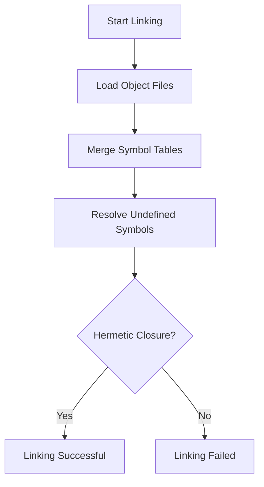
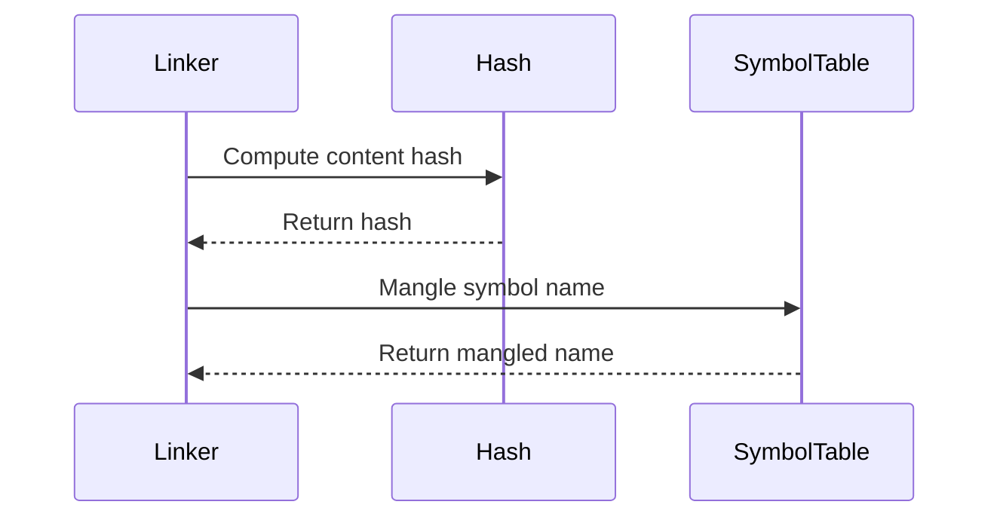

# Linker Logic Specification

* File:* `build\linker_logic_spec.md`
* Version:* 1.0.0
* Context:* Layer 1 (Build System)
* Formalism:* Relational Algebra & Symbol Resolution
* Status:* Active
* Last Modified:* 2026-01-01
* Author:* Kilo Code
* Reviewers:* Pending

- -

## 1. Introduction

### 1.1 Purpose

This specification formalizes the **Linker Logic** using **Relational Algebra & Symbol Resolution**, providing mathematical foundation for binary artifact linking and symbol resolution. This formalization enables the Morph build system to combine object files into executables with guaranteed symbol resolution.

### 1.2 Scope

This specification covers:
- The Symbol Table ($\Sigma$) for tracking defined and undefined symbols
- The Link Operation ($\oplus$) for combining object files
- The Hermetic Closure Condition for successful linking
- The Conflict Theorem for handling duplicate symbols
- Name Mangling for content-addressable linking

This specification does not cover:
- Concrete implementation of linker
- Object file format details
- Runtime loading and relocation

### 1.3 Definitions, Acronyms, and Abbreviations

| Term | Definition |
|-------|------------|
| **Symbol Table** | Mapping from symbol names to their definitions and references |
| **Defined Symbol** | Symbol that is defined in the current object file |
| **Undefined Symbol** | Symbol that is referenced but not defined in the current object file |
| **Link Operation** | Binary operation that combines two object files |
| **Hermetic Closure** | Property that all undefined symbols are resolved |
| **Name Mangling** | Process of renaming symbols to avoid collisions |
| **Content-Addressable** | Property that symbols are identified by their content hash |

### 1.4 References

- Aho, A. V., et al. (1986). "Compilers: Principles, Techniques, and Tools"
- Levine, J. R. (2000). "Linkers and Loaders"
- IEEE 1016: Recommended Practice for Software Design Descriptions
- ISO/IEC 29148: Systems and software engineering — Requirements engineering

- -

## 2. Formal Definitions

### 2.1 The Symbol Table ($\Sigma$)

Let a binary artifact be a set of defined symbols $D$ and undefined (required) symbols $U$.

$$ \text{Obj} = (D, U) $$

* LNK-INV-001:* THE system SHALL define object file as tuple of defined and undefined symbols.

#### 2.1.1 Symbol Definition

A defined symbol $d \in D$ is a tuple:

$$ d = (\text{name}, \text{type}, \text{address}) $$

* LNK-INV-002:* THE system SHALL define defined symbols with name, type, and address.

#### 2.1.2 Symbol Reference

An undefined symbol $u \in U$ is a tuple:

$$ u = (\text{name}, \text{type}) $$

* LNK-INV-003:* THE system SHALL define undefined symbols with name and type.

### 2.2 The Link Operation ($\oplus$)

Linking two objects $O_1$ and $O_2$ is a relational join:

$$ O_{res} = O_1 \oplus O_2 $$

$$ D_{res} = D_1 \cup D_2 $$

$$ U_{res} = (U_1 \cup U_2) \setminus D_{res} $$

* LNK-INV-004:* THE system SHALL define link operation as union of defined symbols and difference of undefined symbols.

* LNK-REQ-001:* THE system SHALL support linking of multiple object files.

* Priority:* Critical
* Verification Method:* Test
* Rationale:* Enables building executables from multiple object files
* Dependencies:* LNK-INV-001, LNK-INV-004
* Traceability:* Section 2.2 (The Link Operation)

### 2.3 The Hermetic Closure Condition

A build is successful if and only if final artifact $O_{final}$ satisfies:

$$ U_{final} = \emptyset $$

(No undefined symbols).

* LNK-INV-005:* THE system SHALL define hermetic closure condition as empty undefined symbol set.

* LNK-REQ-002:* THE system SHALL enforce hermetic closure condition.

* Priority:* Critical
* Verification Method:* Test
* Rationale:* Ensures all symbols are resolved
* Dependencies:* LNK-INV-005
* Traceability:* Section 2.3 (The Hermetic Closure Condition)

### 2.4 The Conflict Theorem (Diamond Dependencies)

If $d \in D_1$ and $d \in D_2$ (Duplicate Symbol Definition):

- **Standard Linker:* Error (Collision)
- **Morph Linker:* Applies **Name Mangling** Function $\mu(d, \text{Hash})$
  - $d_1 \to d_{\text{Hash1}}$
  - $d_2 \to d_{\text{Hash2}}$
  - Since $\text{Hash1} \neq \text{Hash2}$ (Merkle Property), $D_1 \cap D_2 = \emptyset$
  - **Proof:* Collisions are impossible in Content-Addressable Linking

* LNK-THM-001:* THE system SHALL guarantee that name mangling prevents symbol collisions.

* Priority:* Critical
* Verification Method:* Analysis
* Rationale:* Enables content-addressable linking
* Dependencies:* LNK-INV-004
* Traceability:* Section 2.4 (The Conflict Theorem)

#### 2.4.1 Name Mangling Function

The name mangling function $\mu$ transforms symbol names:

$$ \mu(d, h) = d_{\text{mangled}} $$

where $h = \text{Hash}(d)$ is the content hash of symbol $d$.

* LNK-INV-006:* THE system SHALL define name mangling function using content hash.

* LNK-REQ-003:* THE system SHALL apply name mangling to duplicate symbols.

* Priority:* High
* Verification Method:* Test
* Rationale:* Prevents symbol collisions
* Dependencies:* LNK-INV-006
* Traceability:* Section 2.4.1 (Name Mangling Function)

- -

## 3. Requirements

### 3.1 Functional Requirements

* LNK-REQ-004:* THE system SHALL support symbol table management.

* Priority:* Critical
* Verification Method:* Test
* Rationale:* Enables tracking of defined and undefined symbols
* Dependencies:* LNK-INV-001
* Traceability:* Section 2.1 (The Symbol Table)

* LNK-REQ-005:* THE system SHALL support symbol resolution.

* Priority:* Critical
* Verification Method:* Test
* Rationale:* Enables resolving undefined symbols
* Dependencies:* LNK-INV-002, LNK-INV-003
* Traceability:* Section 2.1 (The Symbol Table)

* LNK-REQ-006:* THE system SHALL detect duplicate symbol definitions.

* Priority:* High
* Verification Method:* Test
* Rationale:* Enables conflict detection
* Dependencies:* LNK-INV-002
* Traceability:* Section 2.4 (The Conflict Theorem)

* LNK-REQ-007:* THE system SHALL support content-addressable linking.

* Priority:* High
* Verification Method:* Test
* Rationale:* Enables deterministic linking
* Dependencies:* LNK-THM-001
* Traceability:* Section 2.4 (The Conflict Theorem)

### 3.2 Non-Functional Requirements

* LNK-NFR-001:* THE system SHALL perform linking in O(n) time complexity.

* Priority:* High
* Verification Method:* Analysis
* Metric:* Linking < 1s for 1000 symbols
* Rationale:* Ensures fast builds
* Dependencies:* None
* Traceability:* Section 2.2 (The Link Operation)

* LNK-NFR-002:* THE system SHALL support up to 1M symbols.

* Priority:* Medium
* Verification Method:* Demonstration
* Metric:* 1M symbols with < 100MB memory
* Rationale:* Supports large-scale projects
* Dependencies:* None
* Traceability:* Section 2.1 (The Symbol Table)

* LNK-NFR-003:* THE system SHALL provide clear error messages for linking failures.

* Priority:* High
* Verification Method:* Demonstration
* Metric:* Error message includes undefined symbols and locations
* Rationale:* Improves developer experience
* Dependencies:* LNK-REQ-002
* Traceability:* Section 2.3 (The Hermetic Closure Condition)

- -

## 4. Design

### 4.1 Architecture Overview

The Linker is implemented as a symbol resolution engine that:
1. Maintains symbol tables for each object file
2. Performs link operations to combine object files
3. Enforces hermetic closure condition
4. Detects and resolves symbol conflicts
5. Applies name mangling for content-addressable linking

### 4.2 Data Structures

#### 4.2.1 Symbol Table

* Symbol Table:* $\Sigma = \{D, U\}$

* Components:*
- Defined symbols: $D = \{d_1, d_2, \dots, d_n\}$
- Undefined symbols: $U = \{u_1, u_2, \dots, u_m\}$

* Invariants:*
1. All defined symbols have unique names (after mangling)
2. All undefined symbols are tracked

#### 4.2.2 Link Result

* Link Result:* $O_{res} = (D_{res}, U_{res})$

* Components:*
- Combined defined symbols: $D_{res}$
- Remaining undefined symbols: $U_{res}$

* Invariants:*
1. $D_{res} = D_1 \cup D_2 \cup \dots \cup D_n$
2. $U_{res} = (U_1 \cup U_2 \cup \dots \cup U_n) \setminus D_{res}$

#### 4.2.3 Name Mangling Table

* Name Mangling Table:* $\mathcal{M}: \text{Original Names} \to \text{Mangled Names}$

* Components:*
- Original symbol names
- Mangled symbol names
- Content hashes

* Invariants:*
1. Mangled names are unique
2. Content hashes are consistent

### 4.3 Algorithms

#### 4.3.1 Link Algorithm

* Algorithm Name:* Link Object Files

* Input:* Object files $O_1, O_2, \dots, O_n$

* Output:* Final artifact $O_{final}$

* Mathematical Definition:*
$$
O_{final} = O_1 \oplus O_2 \oplus \dots \oplus O_n
$$

* Pseudocode:*
```
function link_objects(objects):
    result = (D = {}, U = {})
    for obj in objects:
        result.D = result.D ∪ obj.D
        result.U = (result.U ∪ obj.U) \ result.D
    return result
```

* Complexity:*
- Time: $O(n \cdot m)$ where $n$ is number of objects, $m$ is number of symbols
- Space: $O(n \cdot m)$

* Correctness:*
- **Invariant:* All defined symbols are included
- **Termination:* Single pass through objects

#### 4.3.2 Symbol Resolution Algorithm

* Algorithm Name:* Resolve Undefined Symbols

* Input:* Link result $O_{res}$

* Output:* Boolean indicating hermetic closure

* Mathematical Definition:*
$$
\text{IsHermetic}(O_{res}) = (U_{res} = \emptyset)
$$

* Pseudocode:*
```
function is_hermetic(link_result):
    return link_result.U == {}
```

* Complexity:*
- Time: $O(1)$
- Space: $O(1)$

* Correctness:*
- **Invariant:* Hermetic closure is checked correctly
- **Termination:* Single comparison

#### 4.3.3 Name Mangling Algorithm

* Algorithm Name:* Mangle Symbol Names

* Input:* Defined symbols $D_1, D_2$

* Output:* Mangled symbols $D'_1, D'_2$

* Mathematical Definition:*
$$
D'_1 = \{\mu(d, \text{Hash}(d)) \mid d \in D_1\}
$$

$$
D'_2 = \{\mu(d, \text{Hash}(d)) \mid d \in D_2\}
$$

* Pseudocode:*
```
function mangle_symbols(symbols):
    mangled = {}
    for symbol in symbols:
        hash = compute_content_hash(symbol)
        mangled_name = symbol.name + "_" + hash
        mangled[symbol] = (name = mangled_name, hash = hash)
    return mangled
```

* Complexity:*
- Time: $O(n)$ where $n$ is number of symbols
- Space: $O(n)$

* Correctness:*
- **Invariant:* Mangled names are unique
- **Termination:* Single pass through symbols

### 4.4 Mermaid Diagrams

#### 4.4.1 Link Operation Flow



#### 4.4.2 Symbol Resolution Process

```mermaid
graph LR
    O1[Object 1] --> D1[Defined: D1]
    O1 --> U1[Undefined: U1]
    O2[Object 2] --> D2[Defined: D2]
    O2 --> U2[Undefined: U2]
    D1 --> Dres[Defined: D1 ∪ D2]
    D2 --> Dres
    U1 --> Ures[Undefined: (U1 ∪ U2) \ Dres]
    U2 --> Ures
```

#### 4.4.3 Name Mangling Process



- -

## 5. Correctness Properties

### 5.1 Theorems

#### 5.1.1 Hermetic Closure Theorem

* Theorem:* If $U_{final} = \emptyset$, then all symbols are resolved.

* Proof Sketch:*
1. By definition of hermetic closure, no undefined symbols remain
2. All undefined symbols have been resolved by defined symbols
3. Therefore, all symbols are resolved

* LNK-THM-002:* THE system SHALL guarantee that hermetic closure implies symbol resolution.

* Priority:* Critical
* Verification Method:* Analysis
* Rationale:* Ensures complete linking
* Dependencies:* LNK-INV-005
* Traceability:* Section 2.3 (The Hermetic Closure Condition)

#### 5.1.2 Uniqueness Theorem

* Theorem:* Name mangling produces unique symbol names.

* Proof Sketch:*
1. By definition of content hash, different symbols have different hashes
2. By definition of mangling, mangled names include content hash
3. Therefore, mangled names are unique

* LNK-THM-003:* THE system SHALL guarantee that name mangling produces unique names.

* Priority:* High
* Verification Method:* Analysis
* Rationale:* Prevents symbol collisions
* Dependencies:* LNK-INV-006
* Traceability:* Section 2.4.1 (Name Mangling Function)

### 5.2 Invariants

#### 5.2.1 Symbol Table Invariants

- **LNK-INV-007:* THE system SHALL maintain that defined symbols are unique
- **LNK-INV-008:* THE system SHALL maintain that undefined symbols are tracked

#### 5.2.2 Link Operation Invariants

- **LNK-INV-009:* THE system SHALL maintain that link operation is associative
- **LNK-INV-010:* THE system SHALL maintain that link operation is commutative

- -

## 6. Examples

### 6.1 Simple Linking

```morph
// Simple linking: Two object files
// Object 1 defines: foo, bar
// Object 2 defines: bar, baz
// Object 1 references: baz
// Object 2 references: foo
```

* Symbol Tables:*
- $O_1 = (D_1 = \{\text{foo}, \text{bar}\}, U_1 = \{\text{baz}\})$
- $O_2 = (D_2 = \{\text{bar}, \text{baz}\}, U_2 = \{\text{foo}\})$

* Link Operation:*
- $D_{res} = D_1 \cup D_2 = \{\text{foo}, \text{bar}, \text{baz}\}$
- $U_{res} = (U_1 \cup U_2) \setminus D_{res} = \emptyset$

* Result:* Hermetic closure achieved

### 6.2 Duplicate Symbol Detection

```morph
// Duplicate symbols: Both objects define foo
// Object 1 defines: foo
// Object 2 defines: foo
```

* Symbol Tables:*
- $O_1 = (D_1 = \{\text{foo}\}, U_1 = \emptyset)$
- $O_2 = (D_2 = \{\text{foo}\}, U_2 = \emptyset)$

* Conflict Detection:*
- $D_1 \cap D_2 = \{\text{foo}\} \neq \emptyset$

* Name Mangling:*
- $d_1 \to \text{foo}_{\text{hash1}}$
- $d_2 \to \text{foo}_{\text{hash2}}$
- $D'_1 \cap D'_2 = \emptyset$

* Result:* No collision

### 6.3 Hermetic Closure Failure

```morph
// Hermetic closure failure: Undefined symbol
// Object 1 defines: foo
// Object 2 references: bar
```

* Symbol Tables:*
- $O_1 = (D_1 = \{\text{foo}\}, U_1 = \emptyset)$
- $O_2 = (D_2 = \emptyset, U_2 = \{\text{bar}\})$

* Link Operation:*
- $D_{res} = D_1 \cup D_2 = \{\text{foo}\}$
- $U_{res} = (U_1 \cup U_2) \setminus D_{res} = \{\text{bar}\}$

* Result:* Hermetic closure failed (undefined symbol: bar)

### 6.4 Content-Addressable Linking

```morph
// Content-addressable linking: Hash-based names
// Object 1 defines: foo (hash: abc123)
// Object 2 defines: foo (hash: def456)
```

* Symbol Tables:*
- $O_1 = (D_1 = \{\text{foo}\}, U_1 = \emptyset)$
- $O_2 = (D_2 = \{\text{foo}\}, U_2 = \emptyset)$

* Name Mangling:*
- $d_1 \to \text{foo}_{\text{abc123}}$
- $d_2 \to \text{foo}_{\text{def456}}$
- $D'_1 \cap D'_2 = \emptyset$

* Result:* No collision (different content hashes)

### 6.5 Edge Cases

#### 6.5.1 Empty Object Files

```morph
// Empty object files: No symbols
// Object 1: empty
// Object 2: empty
```

* Symbol Tables:*
- $O_1 = (D_1 = \emptyset, U_1 = \emptyset)$
- $O_2 = (D_2 = \emptyset, U_2 = \emptyset)$

* Link Operation:*
- $D_{res} = \emptyset$
- $U_{res} = \emptyset$

* Result:* Hermetic closure achieved (empty artifact)

#### 6.5.2 Circular Dependencies

```morph
// Circular dependencies: Mutual references
// Object 1 defines: foo, references: bar
// Object 2 defines: bar, references: foo
```

* Symbol Tables:*
- $O_1 = (D_1 = \{\text{foo}\}, U_1 = \{\text{bar}\})$
- $O_2 = (D_2 = \{\text{bar}\}, U_2 = \{\text{foo}\})$

* Link Operation:*
- $D_{res} = \{\text{foo}, \text{bar}\}$
- $U_{res} = \emptyset$

* Result:* Hermetic closure achieved (mutual resolution)

#### 6.5.3 Large Symbol Tables

```morph
// Large symbol tables: Many symbols
// Object 1 defines: 1000 symbols
// Object 2 defines: 1000 symbols
```

* Symbol Tables:*
- $O_1 = (D_1 = \{d_1, \dots, d_{1000}\}, U_1 = \emptyset)$
- $O_2 = (D_2 = \{d'_1, \dots, d'_{1000}\}, U_2 = \emptyset)$

* Link Operation:*
- $D_{res} = D_1 \cup D_2$ (2000 symbols)
- $U_{res} = \emptyset$

* Result:* Hermetic closure achieved

- -

## Change Log

| Version | Date       | Author      | Changes                                                                 |
|---------|------------|-------------|-------------------------------------------------------------------------|
| 1.0.0   | 2026-01-01 | Kilo Code    | Initial version                                                        |
