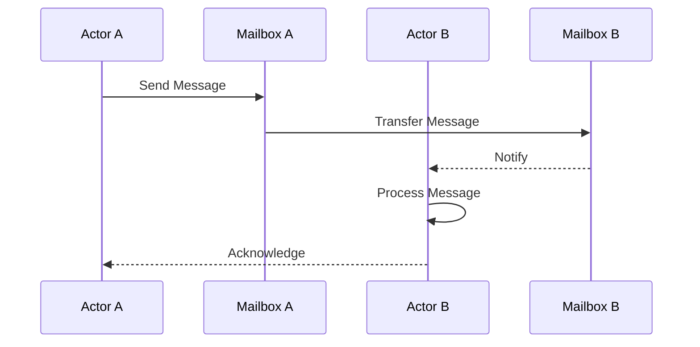
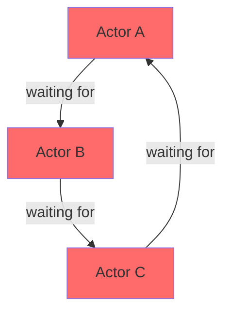
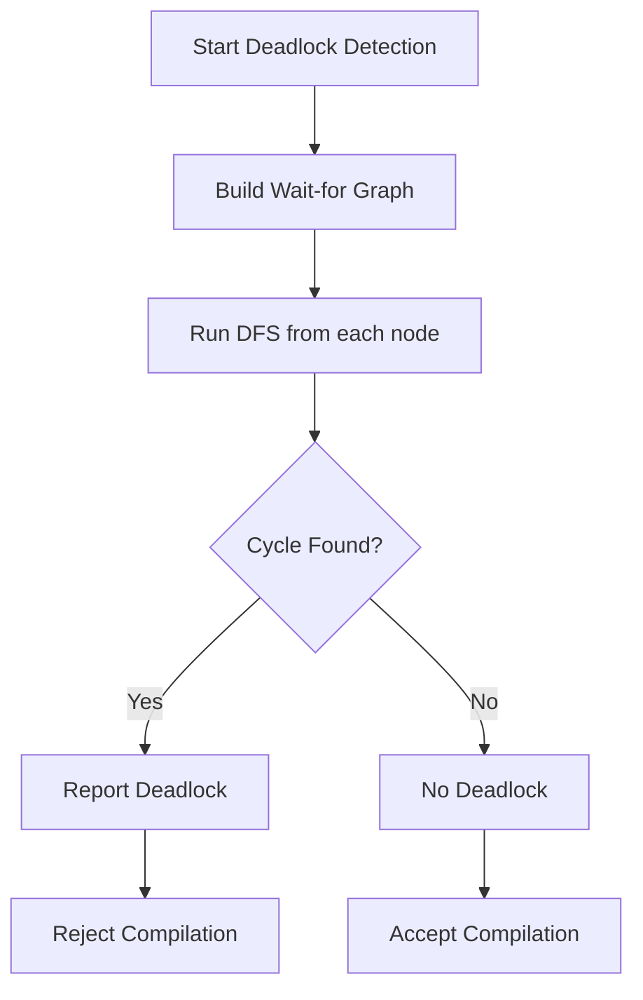
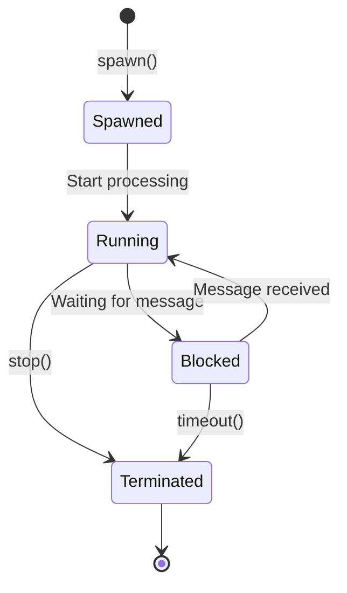

# Concurrency & Process Algebra Specification

- `File:* `concurrency\concurrency_process_algebra_spec.md`
- `Version:* 2.0.0
- `Context:* Layer 3 (Runtime Scheduler)
- `Formalism:* $\pi$-calculus (communicating processes)
- `Status:* Active
- Last Modified:* 2026-01-01
- `Author:* Kilo Code
- `Reviewers:* Pending

- -

## 1. Introduction

### 1.1 Purpose

This specification formalizes the Morph Runtime as a system of parallel processes communicating over channels (Mailboxes) using the $\pi$-calculus. This formalization provides mathematical foundation for actor-based concurrency, message passing, and deadlock analysis.

### 1.2 Scope

This specification covers:
- The Actor System Definition using $\pi$-calculus
- Communication Reduction Rules for message passing
- Deadlock Analysis using Wait-for Graphs
- Static analysis for detecting circular dependencies

This specification does not cover:
- Concrete implementation of actor scheduling
- Network communication protocols
- Thread pool management

### 1.3 Definitions, Acronyms, and Abbreviations

| Term | Definition |
|-------|------------|
| **$\pi$-calculus** | A process calculus for modeling concurrent systems |
| **Actor** | An independent concurrent entity with its own mailbox |
| **Mailbox** | A message queue for an actor |
| **Channel** | A communication endpoint for message passing |
| **Deadlock** | A situation where processes wait indefinitely for each other |
| **Wait-for Graph** | A directed graph showing dependencies between actors |
| **Backpressure** | Flow control mechanism to prevent mailbox overflow |

### 1.4 References

- Milner, R. (1999). "Communicating and Mobile Systems: The $\pi$-calculus"
- Hoare, C. A. R. (1985). "Communicating Sequential Processes"
- Agha, G. (1986). "ACTORS: A Model of Concurrent Computation in Distributed Systems"
- IEEE 1471: Recommended Practice for Architectural Description

- -

## 2. Formal Definitions

### 2.1 The Actor System Definition

Let the Morph Runtime be defined as a system of parallel processes $P, Q$ communicating over channels (Mailboxes).

#### 2.1.1 Syntax of Terms

- $x(y).P$: Receive input $y$ on channel $x$, then behave as $P$
- $\bar{x}\langle z \rangle.P$: Send output $z$ on channel $x$, then behave as $P$
- $P | Q$: Parallel composition (Actors running simultaneously)
- $(\nu x)P$: New channel creation (Spawning an Actor with a private mailbox)
- $!P$: Replication (Supervisors restarting Actors)

### 2.2 The Communication Reduction Rule

This rule formalizes the "Message Passing" mechanism in Morph.

$$ (\dots + x(y).P) \ | \ (\dots + \bar{x}\langle z \rangle.Q) \longrightarrow P[z/y] \ | \ Q $$

- Morph Meaning:* Actor $P$ (Receiver) is suspended waiting on `x`. Actor $Q$ (Sender) sends `z`.

- State Transition:* $P$ wakes up, replaces variable $y$ with data $z$, and continues. $Q$ continues.

- CON-INV-001:* THE system SHALL ensure that message passing follows the reduction rule.

### 2.3 Deadlock Analysis (Wait-for Graphs)

Let $W$ be a directed graph where nodes are Actors.

#### 2.3.1 Edge Definitions

- Edge $A \to B$ exists if $A$ is blocked waiting for a Future resolved by $B$
- Edge $A \dashrightarrow B$ exists if $A$ is blocked waiting to send to $B$'s full mailbox (Backpressure)

#### 2.3.2 Deadlock-Free Theorem

- `Theorem:* The system is Deadlock-Free if $W$ is acyclic.

- Proof Sketch:*
1. If $W$ is acyclic, there exists a topological ordering
2. Actors can be scheduled in topological order
3. No actor waits indefinitely for another in the cycle
4. Therefore, system is deadlock-free

- CON-THM-001:* THE system SHALL guarantee deadlock-freedom if wait-for graph is acyclic.

- `Priority:* High
- Verification Method:* Analysis
- `Rationale:* Ensures system progress
- `Dependencies:* CON-INV-001
- `Traceability:* Section 2.3 (Deadlock Analysis)

- Morph Mitigation:* The compiler's `async let` dependency analyzer attempts to construct $W$ statically. If a cycle is detected (Recursive Waiting), it emits a **Topology Error**.

- -

## 3. Requirements

### 3.1 Functional Requirements

- CON-REQ-001:* THE system SHALL support parallel composition of actors.

- `Priority:* Critical
- Verification Method:* Test
- `Rationale:* Enables concurrent execution
- `Dependencies:* None
- `Traceability:* Section 2.1.1 (Syntax of Terms)

- CON-REQ-002:* WHEN a message is sent, THE system SHALL deliver it to the recipient's mailbox.

- `Priority:* Critical
- Verification Method:* Test
- `Rationale:* Ensures reliable communication
- `Dependencies:* CON-INV-001
- `Traceability:* Section 2.2 (Communication Reduction Rule)

- CON-REQ-003:* WHEN an actor's mailbox is full, THE system SHALL apply backpressure.

- `Priority:* High
- Verification Method:* Test
- `Rationale:* Prevents memory exhaustion
- `Dependencies:* None
- `Traceability:* Section 2.3.1 (Edge Definitions)

- CON-REQ-004:* THE system SHALL detect cycles in the wait-for graph at compile time.

- `Priority:* Critical
- Verification Method:* Test
- `Rationale:* Prevents deadlocks before runtime
- `Dependencies:* CON-THM-001
- `Traceability:* Section 2.3 (Deadlock Analysis)

- CON-REQ-005:* THE system SHALL support private channels for actor communication.

- `Priority:* High
- Verification Method:* Test
- `Rationale:* Enables secure communication
- `Dependencies:* None
- `Traceability:* Section 2.1.1 (Syntax of Terms)

### 3.2 Non-Functional Requirements

- CON-NFR-001:* THE system SHALL support millions of concurrent actors.

- `Priority:* High
- Verification Method:* Demonstration
- `Metric:* 1M actors with < 4GB memory
- `Rationale:* Supports large-scale applications

- CON-NFR-002:* THE system SHALL deliver messages with sub-millisecond latency.

- `Priority:* High
- Verification Method:* Performance Test
- `Metric:* Message latency < 1ms (p99)
- `Rationale:* Ensures responsive system

- CON-NFR-003:* THE system SHALL perform deadlock detection in O(V + E) time complexity.

- `Priority:* High
- Verification Method:* Analysis
- `Metric:* Detection < 100ms for 100K actors
- `Rationale:* Ensures fast compilation

- -

## 4. Design

### 4.1 Architecture Overview

The Morph Runtime implements the Actor Model where each actor is an independent process with its own mailbox. Actors communicate exclusively through message passing, eliminating shared mutable state and preventing data races.

### 4.2 Data Structures

#### 4.2.1 Actor Structure

- `Actor:* $A = (id, mailbox, behavior, state)$

- `Components:*
- $id \in \mathbb{N}$: Unique identifier
- $mailbox \in \text{Queue}(\text{Message})$: Message queue
- $behavior: \text{Message} \to \text{Action}$: Message handler
- $state$: Internal state (immutable to other actors)

- `Invariants:*
1. $\forall a \in A, |mailbox(a)| < \text{MAX\_MAILBOX\_SIZE}$
2. $\forall a_1, a_2 \in A, a_1 \neq a_2 \implies id(a_1) \neq id(a_2)$

#### 4.2.2 Wait-for Graph Structure

- Wait-for Graph:* $W = (V, E)$

- `Components:*
- $V$: Set of actors
- $E \subset V \times V$: Dependency edges

- `Invariants:*
1. $\forall (u, v) \in E, u$ is blocked waiting for $v$
2. If $W$ contains a cycle, system is deadlocked

### 4.3 Algorithms

#### 4.3.1 Message Passing Algorithm

- Algorithm Name:* Send and Receive

- `Input:* Sender $P$, Receiver $Q$, Message $m$

- `Output:* Updated states of $P$ and $Q$

- Mathematical Definition:*
$$
\text{Send}(P, Q, m) = \begin{cases}
P' = P \text{ with } m \text{ removed} \\
Q' = Q \text{ with } m \text{ added to mailbox}
\end{cases}
$$

- `Pseudocode:*
```
function send_message(sender, receiver, message):
    if receiver.mailbox.is_full():
        apply_backpressure(sender)
        return BLOCKED
    receiver.mailbox.enqueue(message)
    return SUCCESS

function receive_message(actor):
    if actor.mailbox.is_empty():
        return BLOCKED
    message = actor.mailbox.dequeue()
    actor.behavior(message)
    return SUCCESS
```

- `Complexity:*
- Time: $O(1)$ for enqueue/dequeue
- Space: $O(n)$ where $n$ is mailbox size

- `Correctness:*
- **Invariant:* Messages are delivered in FIFO order
- **Termination:* Message is eventually delivered if system is live

#### 4.3.2 Deadlock Detection Algorithm

- Algorithm Name:* Detect Cycles in Wait-for Graph

- `Input:* Wait-for graph $W = (V, E)$

- `Output:* Boolean indicating if cycle exists

- Mathematical Definition:*
$$
\text{HasCycle}(W) = \begin{cases}
\text{true} & \text{if DFS finds back edge} \\
\text{false} & \text{otherwise}
\end{cases}
$$

- `Pseudocode:*
```
function detect_deadlock(wait_for_graph):
    visited = empty_set()
    rec_stack = empty_set()

    for actor in wait_for_graph.vertices:
        if not visited.contains(actor):
            if dfs_detect_cycle(actor, visited, rec_stack):
                return true
    return false

function dfs_detect_cycle(actor, visited, rec_stack):
    visited.add(actor)
    rec_stack.add(actor)

    for neighbor in wait_for_graph.neighbors(actor):
        if not visited.contains(neighbor):
            if dfs_detect_cycle(neighbor, visited, rec_stack):
                return true
        elif rec_stack.contains(neighbor):
            return true

    rec_stack.remove(actor)
    return false
```

- `Complexity:*
- Time: $O(V + E)$
- Space: $O(V)$

- `Correctness:*
- **Invariant:* Returns true iff cycle exists
- **Termination:* DFS terminates after visiting all vertices

### 4.4 Mermaid Diagrams

#### 4.4.1 Actor Communication Flow



#### 4.4.2 Wait-for Graph Example



#### 4.4.3 Deadlock Detection Process



#### 4.4.4 Actor Lifecycle



- -

## 5. Correctness Properties

### 5.1 Theorems

#### 5.1.1 Message Delivery Theorem

- `Theorem:* If system is live (no deadlock), every message is eventually delivered.

- Proof Sketch:*
1. By definition of actor model, messages are queued in mailboxes
2. If system is live, no actor is permanently blocked
3. Therefore, every actor eventually processes its mailbox
4. Therefore, every message is eventually delivered

- CON-THM-002:* THE system SHALL guarantee eventual message delivery in live systems.

- `Priority:* High
- Verification Method:* Analysis
- `Rationale:* Ensures reliability of communication
- `Dependencies:* CON-INV-001
- `Traceability:* Section 2.2 (Communication Reduction Rule)

#### 5.1.2 Backpressure Safety Theorem

- `Theorem:* Backpressure prevents mailbox overflow without message loss.

- Proof Sketch:*
1. When mailbox is full, sender is blocked
2. Blocked sender cannot send more messages
3. Therefore, mailbox size never exceeds capacity
4. Therefore, no messages are lost

- CON-THM-003:* THE system SHALL prevent mailbox overflow through backpressure.

- `Priority:* High
- Verification Method:* Analysis
- `Rationale:* Ensures memory safety
- `Dependencies:* CON-REQ-003
- `Traceability:* Section 4.3.1 (Message Passing Algorithm)

### 5.2 Invariants

#### 5.2.1 Communication Invariants

- **CON-INV-002:* THE system SHALL maintain FIFO ordering within each mailbox
- **CON-INV-003:* THE system SHALL ensure that messages are not duplicated
- **CON-INV-004:* THE system SHALL ensure that messages are not lost

#### 5.2.2 Deadlock Invariants

- **CON-INV-005:* THE system SHALL detect all cycles in wait-for graph
- **CON-INV-006:* THE system SHALL reject programs with potential deadlocks
- **CON-INV-007:* THE system SHALL provide clear error messages for deadlock conditions

- -

## 6. Examples

### 6.1 Simple Actor Communication

```morph
actor Counter {
    state count: i32 = 0;

    fn increment() {
        count = count + 1;
    }

    fn get_count() -> i32 {
        ret count;
    }
}

// Main
let counter = spawn Counter();
counter.increment();
let value = counter.get_count();
```

- Communication Flow:*
1. Main spawns `Counter` actor
2. Main sends `increment` message to `Counter`
3. `Counter` processes message and updates state
4. Main sends `get_count` message to `Counter`
5. `Counter` returns current count

### 6.2 Deadlock Example

```morph
actor A {
    fn run(b: Actor B) {
        b.wait_for_a();  // A waits for B
    }
}

actor B {
    fn run(c: Actor C) {
        c.wait_for_b();  // B waits for C
    }
}

actor C {
    fn run(a: Actor A) {
        a.wait_for_c();  // C waits for A
    }
}

// This creates a cycle: A -> B -> C -> A
```

- Wait-for Graph:*
```
A ──> B ──> C ──> A (cycle!)
```

- Compiler Error:* "Deadlock detected: Circular dependency between actors A, B, C"

### 6.3 Backpressure Example

```morph
actor Producer {
    fn produce(consumer: Actor Consumer) {
        for i in 0..1000 {
            consumer.send(i);  // May block if mailbox full
        }
    }
}

actor Consumer {
    state mailbox: Queue<i32> = Queue(max_size=10);

    fn receive(value: i32) {
        process(value);
    }
}
```

- `Behavior:*
1. `Producer` sends messages rapidly
2. When `Consumer` mailbox reaches 10 messages, `Producer` blocks
3. `Consumer` processes messages, freeing space
4. `Producer` resumes sending
5. No messages are lost, no memory overflow

### 6.4 Private Channel Example

```morph
actor Server {
    fn handle_client(client: Channel) {
        // Private channel for this client
        let private_channel = new_channel();
        client.connect(private_channel);

        loop {
            let msg = private_channel.receive();
            process(msg);
        }
    }
}
```

- Channel Privacy:*
1. `new_channel()` creates unique channel $(\nu x)$
2. Only `Server` and `client` have access to `private_channel`
3. Other actors cannot intercept messages

### 6.5 Edge Cases

#### 6.5.1 Empty Mailbox

```morph
actor Empty {
    fn receive() -> i32? {
        // Returns None if mailbox is empty
        ret mailbox.dequeue();
    }
}
```

- `Behavior:* Actor blocks until message arrives

#### 6.5.2 Actor Termination

```morph
actor Worker {
    fn process(items: List<i32>) {
        for item in items {
            process_item(item);
        }
        // Actor terminates automatically
    }
}
```

- `Lifecycle:*
1. Actor spawned
2. Processes all items
3. No more messages to process
4. Actor terminates gracefully

- -

## Change Log

| Version | Date       | Author      | Changes                                                                 |
|---------|------------|-------------|-------------------------------------------------------------------------|
| 2.0.0   | 2026-01-01 | Kilo Code    | Refactored to match specification convention v2.0.0, added EARS requirements, Mermaid diagrams, and examples |
| 1.0.0   | 2025-12-01 | Kilo Code    | Initial version                                                        |
