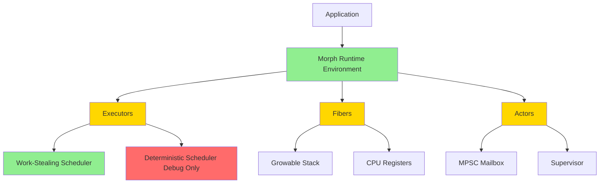
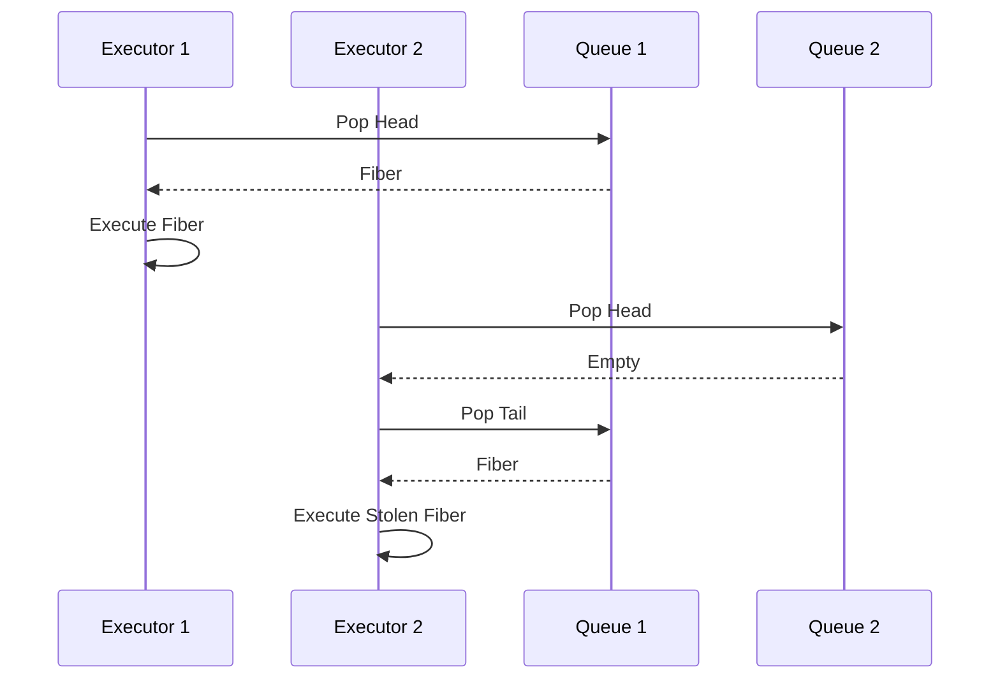
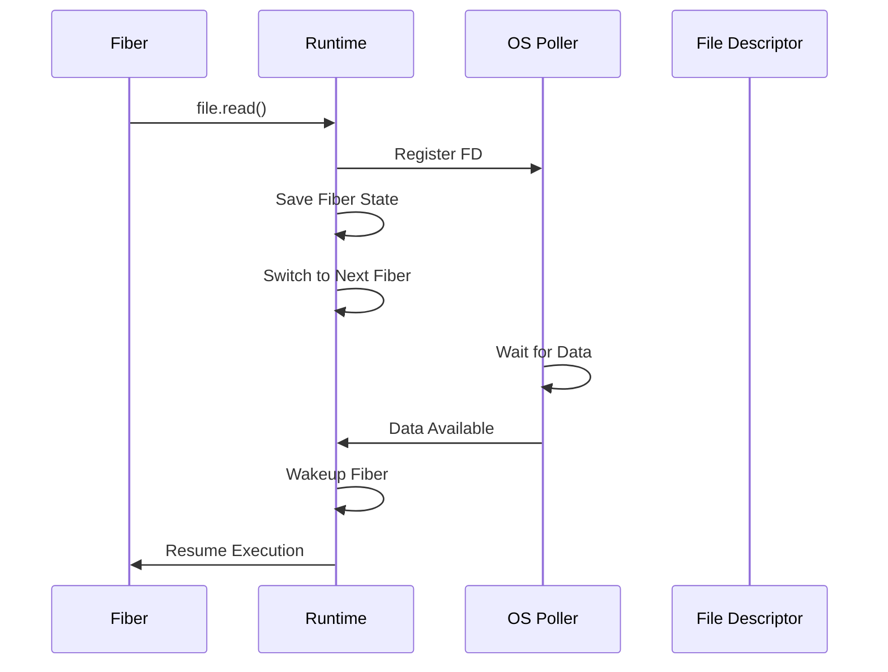
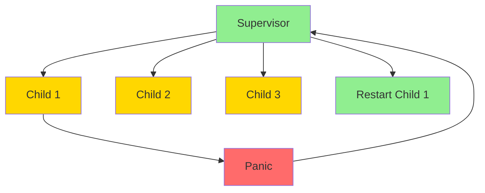

# Morph Execution Model Specification (EMS)

- `System:* Morph Programming Language
- `Version:* 2.0.0
- Context:* Layer 3 (Runtime)
- Formalism:* M:N Scheduling, Actor-Based, Non-Blocking
- Status:* Active
- Last Modified:* 2026-01-02
- Author:* Kilo Code
- Reviewers:* Pending

- -

## 1. Introduction

### 1.1 Purpose

This specification defines the Execution Model of Morph, providing formal foundation for runtime behavior, scheduling, and concurrency. The execution model uses a **Work-Stealing Scheduler** by default for all actors, with deterministic scheduling available only as a debug-mode shim.

### 1.2 Scope

This specification covers:
- The Runtime Library (MRE)
- The Execution Unit (Fiber)
- Concurrency Scheduling (Work-Stealing)
- Implicit Suspension Protocol
- Preemption Mechanism
- The Actor Model (`logic`)
- Supervision Trees
- Dataflow Parallelism (`async let`)
- Memory Management
- Foreign Function Interface (FFI)
- Observability & Debugging

This specification does not cover:
- Concrete implementation of schedulers
- Hardware-specific optimizations
- Performance tuning details

### 1.3 Definitions, Acronyms, and Abbreviations

| Term | Definition |
|-------|------------|
| **MRE** | Morph Runtime Environment - bare-metal runtime library |
| **Fiber** | Stackful coroutine - fundamental unit of execution |
| **M:N** | M Fibers mapped onto N OS Threads (Executors) |
| **Work Stealing** | Scheduler strategy where idle executors steal work from busy ones |
| **Deterministic Scheduler** | Debug-mode shim for reproducible execution |
| **MPSC** | Multi-Producer, Single-Consumer queue |
| **ARC** | Atomic Reference Counting |
| **FFI** | Foreign Function Interface |
| **IOCP** | Input/Output Completion Ports (Windows) |
| **io_uring** | Linux asynchronous I/O interface |
| **kqueue** | BSD/macOS event notification system |

### 1.4 References

- Lamport, L. (1979). "How to Make a Multiprocessor Computer That Correctly Executes Multiprocess Programs"
- Blumofe, R. D., & Leiserson, C. E. (1999). "Scheduling Multithreaded Computations by Work Stealing"
- ISO/IEC 29148: Systems and software engineering — Requirements engineering
- IEEE 1016: Recommended Practice for Software Design Descriptions

### 1.5 Cross-References

The Execution Model Specification is closely related to several other Morph specifications. The following cross-references provide additional context and detailed specifications for related concepts:

* Concurrency Specifications:*
- [`spec/concurrency/scheduling_modes_spec.md`](concurrency/scheduling_modes_spec.md) - Dual-mode scheduling specification (work-stealing and deterministic modes)
- [`spec/concurrency/concurrency_process_algebra_spec.md`](concurrency/concurrency_process_algebra_spec.md) - Process algebra formalization of concurrent communication

* Architecture Specifications:*
- [`spec/architecture/layered_concurrency_spec.md`](architecture/layered_concurrency_spec.md) - Layered concurrency architecture for integrating execution model with language-level patterns

* Type System Specifications:*
- [`spec/type/type_system_spec.md`](type/type_system_spec.md) - Type system with capability enforcement for memory safety
- [`spec/type/effect_system_spec.md`](type/effect_system_spec.md) - Effect system for tracking side effects

* Memory Specifications:*
- [`spec/memory/memory_model_spec.md`](memory/memory_model_spec.md) - Memory management model, ARC implementation, and runtime memory operations
- [`spec/memory/memory_affine_logic_spec.md`](memory/memory_affine_logic_spec.md) - Affine logic formalization for memory safety

* Note:* These cross-references help readers navigate the Morph specification ecosystem by providing links to related specifications that provide complementary or detailed information about concepts referenced in this document.

- -

## 2. Formal Definitions

### 2.1 The Runtime Architecture

#### 2.1.1 The Runtime Library (MRE)

Morph does not run on a Virtual Machine (like the JVM). It runs on a **Bare-Metal Runtime Library** that is statically linked into the final executable (`.mpx`).

* EMS-INV-001:* THE system SHALL use a bare-metal runtime library statically linked into the executable.

* Components:*
- **Role:* Abstraction of OS primitives (Threads, I/O, Memory)
- **Composition:* A lightweight kernel written in C++/Assembly (optimized for each architecture) controlled by MorphIR instructions

* EMS-REQ-001:* THE system SHALL provide a bare-metal runtime library for OS primitive abstraction.

* Priority:* Critical
* Verification Method:* Test
* Rationale:* Enables zero-overhead runtime without virtual machine
* Dependencies:* EMS-INV-001
* Traceability:* Section 2.1.1 (The Runtime Library)

#### 2.1.2 The Execution Unit: The Fiber

The fundamental unit of execution is a **Fiber** (Stackful Coroutine).

* EMS-INV-002:* THE system SHALL use stackful coroutines as the fundamental execution unit.

* Characteristics:*
- **Stack:* Growable, starting at 4KB (vs. 1MB for OS threads)
- **Cost:* Creating a Fiber takes nanoseconds
- **State:* Holds CPU registers and stack pointer

* Rationale:* "Colorless" async (implicit suspension) requires _Stackful_ coroutines. The runtime must be able to pause a function deep in the call stack without unwinding it (unlike Stackless `async/await` in Rust/JS).

* EMS-REQ-002:* THE system SHALL use stackful coroutines with growable stacks starting at 4KB.

* Priority:* Critical
* Verification Method:* Test
* Rationale:* Enables implicit suspension without stack unwinding
* Dependencies:* EMS-INV-002
* Traceability:* Section 2.1.2 (The Execution Unit: The Fiber)

#### 2.1.3 Fiber-Actor Relationship

* Fibers as Actor Execution Units:*

Fibers are the fundamental execution units in Morph. Actors are implemented as **stateful fibers** with additional messaging infrastructure.

* EMS-INV-024:* THE system SHALL implement actors as stateful fibers with mailboxes.

* Relationship:*

1. **Fiber:* The execution unit
   - Provides stackful coroutine execution
   - Can be suspended and resumed
   - Managed by M:N scheduler

2. **Actor:* A stateful fiber with messaging
   - Implemented as a stateful fiber (see Section 2.3.1)
   - Has a mailbox (MPSC queue) for receiving messages
   - Has a supervisor for failure handling
   - Processes messages sequentially within its fiber

* Mapping:*

$$
\text{Actor} = (\text{Fiber}, \text{Mailbox}, \text{Supervisor})
$$

Where:
- **Fiber:* Provides execution context (stack, registers, state)
- **Mailbox:* Provides message passing interface (MPSC queue)
- **Supervisor:* Provides failure recovery mechanism

* Execution Flow:*

1. Actor is spawned as a stateful fiber
2. Fiber enters message processing loop
3. Fiber waits for messages in mailbox (suspends if empty)
4. When message arrives, fiber wakes up and processes it
5. Fiber continues processing messages sequentially
6. If actor panics, supervisor handles failure

* Key Points:*

- **Fibers are execution mechanism:* All concurrent execution happens via fibers
- **Actors are a programming model:* Actors provide a structured way to write concurrent code
- **Actors use fibers for execution:* Each actor runs in its own fiber
- **Multiple actors can run on same fiber:* Not typical, but possible via message forwarding
- **Single fiber per actor:* Standard model is one fiber per actor for isolation

* EMS-REQ-018:* THE system SHALL implement actors as stateful fibers with mailboxes and supervisors.

* Priority:* Critical
* Verification Method:* Test
* Rationale:* Clarifies fiber-actor relationship and enables actor model
* Dependencies:* EMS-INV-002, EMS-INV-007, EMS-INV-024
* Traceability:* Section 2.1.2 (The Execution Unit: The Fiber), Section 2.3.1 (Actor Structure)

### 2.2 Concurrency Scheduling

#### 2.2.1 The M:N Scheduler with Work Stealing

The MRE implements an M:N scheduling model, mapping **M Fibers** onto **N OS Threads** (Executors).

* EMS-INV-003:* THE system SHALL implement M:N scheduling with work stealing.

* Components:*
- **N (Executors):* Typically equal to `Hardware_Cores`. Each Executor runs a local Work Queue
- **Work Stealing:* If an Executor runs out of Fibers, it steals jobs from the tail of another Executor's queue
- **Default Scheduler:* Work-stealing scheduler is the default and only production scheduler

* Rationale:* Maximizes CPU utilization. Prevents a single heavy task from blocking the entire application (as happens in Node.js single-threaded event loops).

* EMS-REQ-003:* THE system SHALL use work-stealing scheduler as the default and only production scheduler.

* Priority:* Critical
* Verification Method:* Test
* Rationale:* Maximizes CPU utilization and prevents blocking
* Dependencies:* EMS-INV-003
* Traceability:* Section 2.2.1 (The M:N Scheduler with Work Stealing)

#### 2.2.2 Deterministic Scheduler (Debug Mode Only)

The deterministic scheduler is strictly a **debug-mode shim**, not a production feature.

* EMS-INV-004:* THE system SHALL provide deterministic scheduler only in debug mode.

* Components:*
- **Purpose:* Reproducible execution for debugging and testing
- **Behavior:* Processes fibers in deterministic order (e.g., FIFO)
- **Limitation:* Not suitable for production due to poor performance

* Rationale:* Enables reproducible debugging without compromising production performance.

* EMS-REQ-004:* THE system SHALL provide deterministic scheduler only as a debug-mode shim.

* Priority:* High
* Verification Method:* Test
* Rationale:* Enables reproducible debugging
* Dependencies:* EMS-INV-004
* Traceability:* Section 2.2.2 (Deterministic Scheduler)

* EMS-REQ-005:* THE system SHALL NOT use deterministic scheduler in production mode.

* Priority:* Critical
* Verification Method:* Test
* Rationale:* Ensures production performance
* Dependencies:* EMS-INV-004
* Traceability:* Section 2.2.2 (Deterministic Scheduler)

#### 2.2.3 Implicit Suspension Protocol

Morph eliminates `async`/`await` keywords via **IO-Aware Yielding**.

* EMS-INV-005:* THE system SHALL implement IO-aware yielding for implicit suspension.

* Protocol:*
1. **The Call:* Agent writes `file.read()`
2. **The Trap:* The Runtime intercepts the syscall
3. **The Registration:* The Runtime registers the File Descriptor with the OS Poller (`io_uring`/`kqueue`/`IOCP`)
4. **The Switch:* The Runtime saves the current Fiber state and immediately switches the Executor to the next Fiber in the Ready Queue
5. **The Resume:* When the OS signals data availability, the Poller moves the original Fiber back to the Ready Queue

* Rationale:* Zero blocking. The CPU never idles waiting for I/O.

* EMS-REQ-006:* THE system SHALL implement IO-aware yielding for implicit suspension.

* Priority:* Critical
* Verification Method:* Test
* Rationale:* Eliminates blocking and maximizes CPU utilization
* Dependencies:* EMS-INV-005
* Traceability:* Section 2.2.3 (Implicit Suspension Protocol)

#### 2.2.4 Preemption (The "Anti-Hang" Mechanism)

* EMS-INV-006:* THE system SHALL implement preemption to prevent fiber starvation.

* Problem:* A Fiber entering `while(true) {}` could starve other Fibers on that core.

* Solution:* The Compiler injects **Checkpoints** at loop headers and function entries.

* Runtime Logic:*
```cpp
// Pseudo-code injected by compiler
if (runtime_ticks() > time_slice_limit) {
    yield();
}
```

* Rationale:* Guarantees system responsiveness (especially UI) even if the Agent writes inefficient algorithms.

* EMS-REQ-007:* THE system SHALL inject preemption checkpoints at loop headers and function entries.

* Priority:* High
* Verification Method:* Test
* Rationale:* Prevents fiber starvation and ensures responsiveness
* Dependencies:* EMS-INV-006
* Traceability:* Section 2.2.4 (Preemption)

### 2.3 The Actor Model (`logic`)

#### 2.3.1 Actor Structure

A `logic` block compiles into a **Stateful Fiber**.

* EMS-INV-007:* THE system SHALL compile `logic` blocks into stateful fibers.

* Components:*
- **Mailbox:* A lock-free MPSC (Multi-Producer, Single-Consumer) queue
- **Behavior:* The Fiber loops efficiently:
  - If Mailbox is empty $\rightarrow$ Fiber Suspend (0% CPU)
  - If Message arrives $\rightarrow$ Fiber Wakeup
- **Processing:* Messages are processed sequentially. This guarantees **Data Race Freedom** within the Actor

* EMS-REQ-008:* THE system SHALL compile `logic` blocks into stateful fibers with MPSC mailboxes.

* Priority:* Critical
* Verification Method:* Test
* Rationale:* Enables actor model with data race freedom
* Dependencies:* EMS-INV-007
* Traceability:* Section 2.3.1 (Actor Structure)

#### 2.3.2 Supervision Trees

* EMS-INV-008:* THE system SHALL implement supervision trees for actor failure recovery.

* Components:*
- **Concept:* Actors form a parent-child hierarchy
- **Failure Mode:* If an Actor panics (e.g., asserts fail), the Fiber terminates
- **Recovery:* The Runtime intercepts the panic signal and notifies the Supervisor
- **Strategy Execution:*
  - `OneForOne`: The Supervisor spawns a fresh instance of the failed Actor (fresh memory arena)
  - `OneForAll`: The Supervisor terminates and restarts all sibling Actors

* Rationale:* "Let It Crash." Agents cannot predict every error. The system must self-heal.

* EMS-REQ-009:* THE system SHALL implement supervision trees with OneForOne and OneForAll strategies.

* Priority:* High
* Verification Method:* Test
* Rationale:* Enables self-healing systems
* Dependencies:* EMS-INV-008
* Traceability:* Section 2.3.2 (Supervision Trees)

### 2.4 Dataflow Parallelism (`async let`)

#### 2.4.1 Implementation

`async let x = foo()` is sugar for spawning a **Ephemeral Fiber**.

* EMS-INV-009:* THE system SHALL implement `async let` as ephemeral fiber spawning.

* Components:*
- **Storage:* The return value is stored in a `Future<T>` slot in the Parent Fiber's stack frame
- **State:* The Future has three states: `Pending`, `Ready`, `Poisoned` (Panic)

* EMS-REQ-010:* THE system SHALL implement `async let` as ephemeral fiber spawning with Future slots.

* Priority:* High
* Verification Method:* Test
* Rationale:* Enables dataflow parallelism
* Dependencies:* EMS-INV-009
* Traceability:* Section 2.4.1 (Implementation)

#### 2.4.2 Wait-by-Necessity

* EMS-INV-010:* THE system SHALL implement wait-by-necessity for Future resolution.

* Mechanism:* When the code accesses `x`:
- **Case 1 (Ready):* Read value immediately (0 cost)
- **Case 2 (Pending):* The Parent Fiber yields (suspends). It is added to the "Dependency List" of the Child Fiber
- **Case 3 (Poisoned):* The Parent Fiber panics (propagating the error)

* Wakeup:* When the Child Fiber finishes, it writes the result to the `Future` slot and wakes up the Parent Fiber.

* EMS-REQ-011:* THE system SHALL implement wait-by-necessity for Future resolution.

* Priority:* High
* Verification Method:* Test
* Rationale:* Enables efficient dataflow parallelism
* Dependencies:* EMS-INV-010
* Traceability:* Section 2.4.2 (Wait-by-Necessity)

### 2.5 Memory Management

#### 2.5.1 The Unified Allocator

Morph uses a **Unified Global Allocator** with type-level rules (see [`memory_model_spec.md`](memory/memory_model_spec.md)).

* EMS-INV-011:* THE system SHALL use a unified global allocator with type-level rules.

* EMS-REQ-012:* THE system SHALL use a unified global allocator with type-level rules.

* Priority:* Critical
* Verification Method:* Test
* Rationale:* Enables unified memory management with type-level safety
* Dependencies:* EMS-INV-011
* Traceability:* Section 2.5.1 (The Unified Allocator)

#### 2.5.2 Capability Enforcement

* EMS-INV-012:* THE system SHALL enforce capability properties at runtime in debug mode.

* Runtime Check:* Debug builds verify that `iso` pointers passed between threads are indeed unique (detecting unsafe C++ FFI leaks). Release builds assume compile-time proofs are correct.

* EMS-REQ-013:* THE system SHALL enforce capability properties at runtime in debug mode.

* Priority:* High
* Verification Method:* Test
* Rationale:* Detects unsafe FFI leaks
* Dependencies:* EMS-INV-012
* Traceability:* Section 2.5.2 (Capability Enforcement)

### 2.6 Foreign Function Interface (FFI)

#### 2.6.1 The Dual-Pool Strategy

To prevent C/C++ code from blocking the M:N scheduler, Morph maintains two thread pools.

* EMS-INV-013:* THE system SHALL maintain dual thread pools for FFI.

* Components:*
1. **The Green Pool:* Runs Morph Fibers
2. **The System Pool:* Runs blocking OS threads

* EMS-REQ-014:* THE system SHALL maintain dual thread pools for FFI.

* Priority:* High
* Verification Method:* Test
* Rationale:* Prevents blocking of M:N scheduler
* Dependencies:* EMS-INV-013
* Traceability:* Section 2.6.1 (The Dual-Pool Strategy)

#### 2.6.2 The Switch Protocol

When a Morph Fiber calls a C function:

* EMS-INV-014:* THE system SHALL implement switch protocol for FFI calls.

* Default Behavior:*
1. Task is moved from Green Pool to System Pool
2. C function executes (blocking the System Thread)
3. Task is moved back to Green Pool

* Optimization (`[NonBlocking]` trait):*
1. Task remains on Green Pool
2. C function executes immediately
3. **Risk:* If C function sleeps, the Morph Executor hangs

* Rationale:* Safety by default. An Agent importing a buggy C library shouldn't freeze the GUI.

* EMS-REQ-015:* THE system SHALL implement switch protocol for FFI calls with default safety.

* Priority:* High
* Verification Method:* Test
* Rationale:* Prevents blocking of M:N scheduler
* Dependencies:* EMS-INV-014
* Traceability:* Section 2.6.2 (The Switch Protocol)

### 2.7 Observability & Debugging

#### 2.7.1 Time-Travel State Graph (Debug Mode)

* EMS-INV-015:* THE system SHALL maintain time-travel state graph in debug mode.

* Mechanism:* The Runtime maintains a **Shadow Stack**.

* Operation:* On every state mutation (assignment to `state` variable):
1. The old value is serialized (copy-on-write)
2. A node is added to the DAG: `(Timestamp, AST_ID, Previous_Hash, New_Value)`

* Crash Dump:* On panic, the Runtime exports this DAG to the MCP server.

* EMS-REQ-016:* THE system SHALL maintain time-travel state graph in debug mode.

* Priority:* Medium
* Verification Method:* Test
* Rationale:* Enables time-travel debugging
* Dependencies:* EMS-INV-015
* Traceability:* Section 2.7.1 (Time-Travel State Graph)

#### 2.7.2 The Flight Recorder (Release Mode)

* EMS-INV-016:* THE system SHALL maintain flight recorder in release mode.

* Mechanism:* A 1MB Circular Buffer per Executor.

* Logging:* Records compact "Event Codes" (e.g., `ActorSpawn`, `MsgStart`, `MsgEnd`, `Error`).

* Overhead:* < 1% CPU.

* Rationale:* Allows diagnosing production crashes ("What was the last message processed?") without full overhead.

* EMS-REQ-017:* THE system SHALL maintain flight recorder in release mode with < 1% CPU overhead.

* Priority:* Medium
* Verification Method:* Test
* Rationale:* Enables production crash diagnosis
* Dependencies:* EMS-INV-016
* Traceability:* Section 2.7.2 (The Flight Recorder)

- -

## 3. Requirements

### 3.1 Functional Requirements

* EMS-REQ-001:* THE system SHALL provide a bare-metal runtime library for OS primitive abstraction.
  - **Priority:* Critical
  - **Verification Method:* Test
  - **Rationale:* Enables zero-overhead runtime without virtual machine
  - **Dependencies:* EMS-INV-001
  - **Traceability:* Section 2.1.1 (The Runtime Library)

* EMS-REQ-002:* THE system SHALL use stackful coroutines with growable stacks starting at 4KB.
  - **Priority:* Critical
  - **Verification Method:* Test
  - **Rationale:* Enables implicit suspension without stack unwinding
  - **Dependencies:* EMS-INV-002
  - **Traceability:* Section 2.1.2 (The Execution Unit: The Fiber)

* EMS-REQ-003:* THE system SHALL use work-stealing scheduler as the default and only production scheduler.
  - **Priority:* Critical
  - **Verification Method:* Test
  - **Rationale:* Maximizes CPU utilization and prevents blocking
  - **Dependencies:* EMS-INV-003
  - **Traceability:* Section 2.2.1 (The M:N Scheduler with Work Stealing)

* EMS-REQ-004:* THE system SHALL provide deterministic scheduler only as a debug-mode shim.
  - **Priority:* High
  - **Verification Method:* Test
  - **Rationale:* Enables reproducible debugging
  - **Dependencies:* EMS-INV-004
  - **Traceability:* Section 2.2.2 (Deterministic Scheduler)

* EMS-REQ-005:* THE system SHALL NOT use deterministic scheduler in production mode.
  - **Priority:* Critical
  - **Verification Method:* Test
  - **Rationale:* Ensures production performance
  - **Dependencies:* EMS-INV-004
  - **Traceability:* Section 2.2.2 (Deterministic Scheduler)

* EMS-REQ-006:* THE system SHALL implement IO-aware yielding for implicit suspension.
  - **Priority:* Critical
  - **Verification Method:* Test
  - **Rationale:* Eliminates blocking and maximizes CPU utilization
  - **Dependencies:* EMS-INV-005
  - **Traceability:* Section 2.2.3 (Implicit Suspension Protocol)

* EMS-REQ-007:* THE system SHALL inject preemption checkpoints at loop headers and function entries.
  - **Priority:* High
  - **Verification Method:* Test
  - **Rationale:* Prevents fiber starvation and ensures responsiveness
  - **Dependencies:* EMS-INV-006
  - **Traceability:* Section 2.2.4 (Preemption)

* EMS-REQ-008:* THE system SHALL compile `logic` blocks into stateful fibers with MPSC mailboxes.
  - **Priority:* Critical
  - **Verification Method:* Test
  - **Rationale:* Enables actor model with data race freedom
  - **Dependencies:* EMS-INV-007
  - **Traceability:* Section 2.3.1 (Actor Structure)

* EMS-REQ-009:* THE system SHALL implement supervision trees with OneForOne and OneForAll strategies.
  - **Priority:* High
  - **Verification Method:* Test
  - **Rationale:* Enables self-healing systems
  - **Dependencies:* EMS-INV-008
  - **Traceability:* Section 2.3.2 (Supervision Trees)

* EMS-REQ-010:* THE system SHALL implement `async let` as ephemeral fiber spawning with Future slots.
  - **Priority:* High
  - **Verification Method:* Test
  - **Rationale:* Enables dataflow parallelism
  - **Dependencies:* EMS-INV-009
  - **Traceability:* Section 2.4.1 (Implementation)

* EMS-REQ-011:* THE system SHALL implement wait-by-necessity for Future resolution.
  - **Priority:* High
  - **Verification Method:* Test
  - **Rationale:* Enables efficient dataflow parallelism
  - **Dependencies:* EMS-INV-010
  - **Traceability:* Section 2.4.2 (Wait-by-Necessity)

* EMS-REQ-012:* THE system SHALL use a unified global allocator with type-level rules.
  - **Priority:* Critical
  - **Verification Method:* Test
  - **Rationale:* Enables unified memory management with type-level safety
  - **Dependencies:* EMS-INV-011
  - **Traceability:* Section 2.5.1 (The Unified Allocator)

* EMS-REQ-013:* THE system SHALL enforce capability properties at runtime in debug mode.
  - **Priority:* High
  - **Verification Method:* Test
  - **Rationale:* Detects unsafe FFI leaks
  - **Dependencies:* EMS-INV-012
  - **Traceability:* Section 2.5.2 (Capability Enforcement)

* EMS-REQ-014:* THE system SHALL maintain dual thread pools for FFI.
  - **Priority:* High
  - **Verification Method:* Test
  - **Rationale:* Prevents blocking of M:N scheduler
  - **Dependencies:* EMS-INV-013
  - **Traceability:* Section 2.6.1 (The Dual-Pool Strategy)

* EMS-REQ-015:* THE system SHALL implement switch protocol for FFI calls with default safety.
  - **Priority:* High
  - **Verification Method:* Test
  - **Rationale:* Prevents blocking of M:N scheduler
  - **Dependencies:* EMS-INV-014
  - **Traceability:* Section 2.6.2 (The Switch Protocol)

* EMS-REQ-016:* THE system SHALL maintain time-travel state graph in debug mode.
  - **Priority:* Medium
  - **Verification Method:* Test
  - **Rationale:* Enables time-travel debugging
  - **Dependencies:* EMS-INV-015
  - **Traceability:* Section 2.7.1 (Time-Travel State Graph)

* EMS-REQ-017:* THE system SHALL maintain flight recorder in release mode with < 1% CPU overhead.
  - **Priority:* Medium
  - **Verification Method:* Test
  - **Rationale:* Enables production crash diagnosis
  - **Dependencies:* EMS-INV-016
  - **Traceability:* Section 2.7.2 (The Flight Recorder)

### 3.2 Non-Functional Requirements

* EMS-NFR-001:* THE system SHALL provide fiber creation in nanoseconds.
  - **Priority:* High
  - **Verification Method:* Test
  - **Metric:* Fiber creation < 100ns
  - **Rationale:* Enables high-performance concurrency
  - **Dependencies:* EMS-INV-002
  - **Traceability:* Section 2.1.2 (The Execution Unit: The Fiber)

* EMS-NFR-002:* THE system SHALL provide work-stealing scheduler with O(1) steal operation.
  - **Priority:* High
  - **Verification Method:* Analysis
  - **Metric:* Steal operation < 10ns
  - **Rationale:* Ensures efficient load balancing
  - **Dependencies:* EMS-INV-003
  - **Traceability:* Section 2.2.1 (The M:N Scheduler with Work Stealing)

* EMS-NFR-003:* THE system SHALL provide implicit suspension with zero blocking.
  - **Priority:* Critical
  - **Verification Method:* Test
  - **Metric:* No blocking on I/O operations
  - **Rationale:* Maximizes CPU utilization
  - **Dependencies:* EMS-INV-005
  - **Traceability:* Section 2.2.3 (Implicit Suspension Protocol)

* EMS-NFR-004:* THE system SHALL provide preemption with bounded time slices.
  - **Priority:* High
  - **Verification Method:* Test
  - **Metric:* Time slice < 10ms
  - **Rationale:* Ensures responsiveness
  - **Dependencies:* EMS-INV-006
  - **Traceability:* Section 2.2.4 (Preemption)

* EMS-NFR-005:* THE system SHALL support up to 1,000,000 concurrent fibers.
  - **Priority:* Medium
  - **Verification Method:* Demonstration
  - **Metric:* 1M fibers with < 10GB memory
  - **Rationale:* Supports large-scale concurrent systems
  - **Dependencies:* EMS-INV-002
  - **Traceability:* Section 2.1.2 (The Execution Unit: The Fiber)

- -

## 4. Design

### 4.1 Architecture Overview

The Execution Model is implemented as a **Bare-Metal Runtime Library** that:
1. Provides OS primitive abstraction
2. Implements M:N scheduling with work stealing
3. Provides deterministic scheduler as debug-mode shim
4. Implements implicit suspension via IO-aware yielding
5. Implements preemption to prevent fiber starvation
6. Compiles `logic` blocks into stateful fibers
7. Implements supervision trees for failure recovery
8. Implements `async let` as ephemeral fiber spawning
9. Uses unified global allocator with type-level rules
10. Maintains dual thread pools for FFI
11. Provides observability via time-travel state graph and flight recorder

### 4.2 Data Structures

#### 4.2.1 Fiber

* Fiber:* $F = (\text{stack}, \text{registers}, \text{state})$

* Components:*
- $\text{stack}$: Growable stack starting at 4KB
- $\text{registers}$: CPU registers
- $\text{state}$: Fiber state (Ready, Running, Suspended)

* Invariants:*
1. Stack is growable
2. Registers are saved on context switch
3. State transitions are atomic

#### 4.2.2 Executor

* Executor:* $E = (\text{work\_queue}, \text{thread})$

* Components:*
- $\text{work\_queue}$: Local work queue (deque for work stealing)
- $\text{thread}$: OS thread

* Invariants:*
1. Work queue is lock-free
2. Thread runs work-stealing scheduler
3. Executor can steal from other executors

#### 4.2.3 Actor

* Actor:* $A = (\text{mailbox}, \text{fiber}, \text{supervisor})$

* Components:*
- $\text{mailbox}$: MPSC queue
- $\text{fiber}$: Stateful fiber
- $\text{supervisor}$: Parent actor

* Invariants:*
1. Mailbox is lock-free MPSC
2. Fiber processes messages sequentially
3. Supervisor handles failures

#### 4.2.4 Future

* Future:* $Ft = (\text{state}, \text{value}, \text{dependencies})$

* Components:*
- $\text{state}$: Future state (Pending, Ready, Poisoned)
- $\text{value}$: Result value
- $\text{dependencies}$: List of dependent fibers

* Invariants:*
1. State transitions are atomic
2. Value is written once
3. Dependencies are woken on completion

### 4.3 Algorithms

#### 4.3.1 Work Stealing Algorithm

* Algorithm Name:* Steal Work from Another Executor

* Input:* Executor $E$

* Output:* Fiber $F$ or null

* Mathematical Definition:*
$$
\text{steal}(E) = \begin{cases}
\text{pop\_tail}(E.\text{work\_queue}) & \text{if } \text{not\_empty} \\
\text{null} & \text{otherwise}
\end{cases}
$$

* Pseudocode:*
```
function steal(executor):
    for other in executors:
        if other != executor:
            fiber = other.work_queue.pop_tail()
            if fiber != null:
                return fiber
    return null
```

* Complexity:*
- Time: $O(N)$ where $N$ is number of executors
- Space: $O(1)$

* Correctness:*
- **Invariant:* Returns fiber or null
- **Termination:* Always returns

#### 4.3.2 IO-Aware Yielding Algorithm

* Algorithm Name:* Yield on I/O Operation

* Input:* I/O operation $op$

* Output:* None

* Mathematical Definition:*
$$
\text{yield\_on\_io}(op) = \begin{cases}
\text{register\_fd}(op.\text{fd}) \land \text{switch\_fiber}() & \text{if } \text{is\_blocking}(op) \\
\text{execute}(op) & \text{otherwise}
\end{cases}
$$

* Pseudocode:*
```
function yield_on_io(operation):
    if is_blocking(operation):
        register_fd(operation.fd)
        switch_fiber()
    else:
        execute(operation)
```

* Complexity:*
- Time: $O(1)$
- Space: $O(1)$

* Correctness:*
- **Invariant:* Never blocks on I/O
- **Termination:* Always returns

#### 4.3.3 Preemption Algorithm

* Algorithm Name:* Check Preemption

* Input:* None

* Output:* Boolean indicating if should yield

* Mathematical Definition:*
$$
\text{should\_yield}() = \text{runtime\_ticks}() > \text{time\_slice\_limit} $$

* Pseudocode:*
```
function should_yield():
    return runtime_ticks() > time_slice_limit
```

* Complexity:*
- Time: $O(1)$
- Space: $O(1)$

* Correctness:*
- **Invariant:* Returns boolean
- **Termination:* Always returns

### 4.4 Mermaid Diagrams

#### 4.4.1 Runtime Architecture



#### 4.4.2 Work Stealing



#### 4.4.3 IO-Aware Yielding



#### 4.4.4 Actor Supervision



- -

## 5. Correctness Properties

### 5.1 Theorems

#### 5.1.1 Work Stealing Theorem

* Theorem:* If the system uses work-stealing scheduler, then CPU utilization is maximized.

* Proof Sketch:*
1. By definition of work-stealing, idle executors steal work from busy executors
2. Therefore, no executor remains idle while work is available
3. Therefore, CPU utilization is maximized

* EMS-THM-001:* THE system SHALL guarantee maximized CPU utilization with work-stealing scheduler.

* Priority:* High
* Verification Method:* Analysis
* Rationale:* Ensures efficient resource utilization
* Dependencies:* EMS-INV-003
* Traceability:* Section 2.2.1 (The M:N Scheduler with Work Stealing)

#### 5.1.2 Data Race Freedom Theorem

* Theorem:* If the system uses actor model with MPSC mailboxes, then actors are data-race-free.

* Proof Sketch:*
1. By definition of actor model, each actor processes messages sequentially
2. By definition of MPSC mailbox, messages are delivered atomically
3. Therefore, no two actors can mutate the same memory simultaneously

* EMS-THM-002:* THE system SHALL guarantee data race freedom for actors.

* Priority:* Critical
* Verification Method:* Analysis
* Rationale:* Ensures thread safety without locks
* Dependencies:* EMS-INV-007
* Traceability:* Section 2.3.1 (Actor Structure)

#### 5.1.3 Zero Blocking Theorem

* Theorem:* If the system uses IO-aware yielding, then no fiber blocks on I/O.

* Proof Sketch:*
1. By definition of IO-aware yielding, fibers yield on blocking I/O
2. By definition of implicit suspension, fibers resume when I/O completes
3. Therefore, no fiber blocks on I/O

* EMS-THM-003:* THE system SHALL guarantee zero blocking on I/O operations.

* Priority:* Critical
* Verification Method:* Test
* Rationale:* Maximizes CPU utilization
* Dependencies:* EMS-INV-005
* Traceability:* Section 2.2.3 (Implicit Suspension Protocol)

### 5.2 Invariants

#### 5.2.1 Runtime Invariants

- **EMS-INV-017:* THE system SHALL maintain that all fibers are managed by executors.
- **EMS-INV-018:* THE system SHALL maintain that work-stealing scheduler is used in production.
- **EMS-INV-019:* THE system SHALL maintain that deterministic scheduler is used only in debug mode.

#### 5.2.2 Fiber Invariants

- **EMS-INV-020:* THE system SHALL maintain that fiber stacks are growable.
- **EMS-INV-021:* THE system SHALL maintain that fiber state transitions are atomic.

#### 5.2.3 Actor Invariants

- **EMS-INV-022:* THE system SHALL maintain that actor mailboxes are lock-free MPSC.
- **EMS-INV-023:* THE system SHALL maintain that actors process messages sequentially.

- -

## 6. Examples

### 6.1 Simple Actor

```morph
logic Counter {
    state: {
        count: i32 = 0
    },

    in: {
        Increment,
        GetCount
    },

    fn handle(msg: Input) {
        fix msg {
            Increment => self.state.count += 1,
            GetCount => send(self.sender, self.state.count)
        }
    }
}
```

* Properties:*
- Actor processes messages sequentially
- Data race freedom guaranteed
- MPSC mailbox ensures message delivery

### 6.2 Work Stealing

```morph
// Executor 1
fn executor1() {
    while true {
        fiber = self.work_queue.pop_head()
        if fiber == null:
            fiber = steal_from_other_executors()
        if fiber != null:
            execute(fiber)
    }
}

// Executor 2
fn executor2() {
    while true {
        fiber = self.work_queue.pop_head()
        if fiber == null:
            fiber = steal_from_other_executors()
        if fiber != null:
            execute(fiber)
    }
}
```

* Properties:*
- Idle executors steal work from busy executors
- CPU utilization maximized
- No executor remains idle while work is available

### 6.3 IO-Aware Yielding

```morph
fn read_file(path: str) -> str {
    // Runtime intercepts syscall
    // Registers FD with OS poller
    // Yields fiber
    // Resumes when data available
    ret file.read(path)
}
```

* Properties:*
- No blocking on I/O
- Fiber yields on blocking I/O
- Fiber resumes when I/O completes

### 6.4 Preemption

```morph
fn infinite_loop() {
    while true {
        // Compiler injects preemption checkpoint
        // if runtime_ticks() > time_slice_limit:
        //     yield()
        do_work()
    }
}
```

* Properties:*
- Prevention of fiber starvation
- Bounded time slices
- System responsiveness guaranteed

### 6.5 Supervision Tree

```morph
logic Supervisor {
    children: [Actor] = [],

    fn supervise(child: Actor) {
        self.children.push(child)
    },

    fn handle_failure(child: Actor) {
        // OneForOne strategy
        new_child = spawn(child.type)
        self.children.remove(child)
        self.children.push(new_child)
    }
}
```

* Properties:*
- Self-healing system
- OneForOne strategy restarts failed child
- System continues despite failures

### 6.6 Edge Cases

#### 6.6.1 Empty Work Queue

```morph
fn executor() {
    while true {
        fiber = self.work_queue.pop_head()
        if fiber == null:
            fiber = steal_from_other_executors()
        if fiber == null:
            // No work available, sleep
            sleep(1ms)
    }
}
```

* Properties:*
- Executor sleeps when no work available
- Wakes up when work becomes available
- CPU not wasted on idle loops

#### 6.6.2 Panic Propagation

```morph
logic Parent {
    fn handle_failure(child: Actor) {
        // Panic propagates to parent
        panic("Child failed")
    }
}

logic Child {
    fn handle(msg: Input) {
        // Panic on error
        panic("Error")
    }
}
```

* Properties:*
- Panic propagates to supervisor
- Supervisor handles failure
- System self-heals

#### 6.6.3 Future Poisoning

```morph
fn parent() {
    async let result = child()
    // Child panics
    // Future is poisoned
    // Parent panics when accessing result
    value = result  // Panic: Future poisoned
}
```

* Properties:*
- Future poisoned on child panic
- Parent panics when accessing poisoned future
- Error propagation guaranteed

- -

## Change Log

| Version | Date       | Author      | Changes                                                                 |
|---------|------------|-------------|-------------------------------------------------------------------------|
| 2.0.0   | 2026-01-02 | Kilo Code    | **Refined to match strategic refinements:*<br>1. Work-stealing scheduler as default and only production scheduler<br>2. Deterministic scheduler strictly as debug-mode shim<br>3. Updated all invariants and requirements<br>4. Added formal definitions and theorems |
| 1.0.0   | 2026-01-01 | Kilo Code    | Initial version                                                        |
