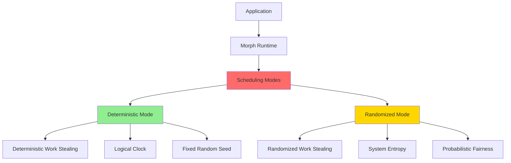
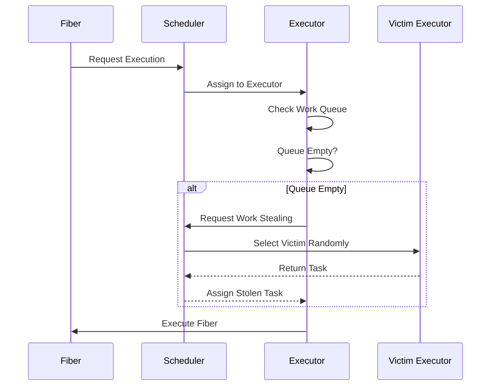
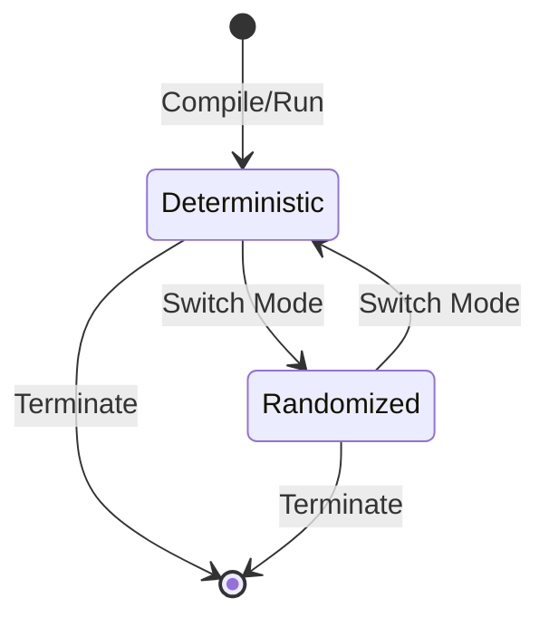

# Scheduling Modes Specification

* File:* `concurrency\scheduling_modes_spec.md`
* Version:* 2.0.0
* Context:* Layer 3 (Runtime) - Scheduler
* Formalism:* Operational Semantics & Probabilistic Analysis
* Status:* Active
* Last Modified:* 2026-01-03
* Author:* Kilo Code
* Reviewers:* Pending

---

## 1. Introduction

### 1.1 Purpose

This specification defines the **Dual-Mode Scheduling System** for Morph, providing formal foundation for both deterministic and randomized scheduling modes. This specification resolves the contradiction between deterministic requirements (for testing/debugging) and randomized requirements (for production) by defining two distinct scheduling modes with clear semantics, mode switching mechanisms, and performance characteristics.

### 1.2 Scope

This specification covers:
- Deterministic scheduling mode with formal semantics
- Randomized work-stealing mode with formal semantics
- Mode switching mechanisms (compile-time and runtime)
- Performance characteristics for each mode
- Reproducibility guarantees for deterministic mode
- Fairness properties for randomized mode
- Integration with M:N scheduling and actor model
- Examples and use cases for both modes

This specification does not cover:
- Concrete implementation details of schedulers
- Hardware-specific optimizations
- Performance tuning beyond mode selection

### 1.3 Definitions, Acronyms, and Abbreviations

| Term | Definition |
|-------|------------|
| **Deterministic Mode** | Scheduling mode where all scheduling decisions are reproducible across executions |
| **Randomized Mode** | Scheduling mode where scheduling decisions use randomization for performance |
| **Work Stealing** | Load balancing strategy where idle executors steal work from busy ones |
| **Logical Clock** | Monotonic counter that increments on observable events |
| **M:N Scheduling** | M fibers mapped onto N OS threads (executors) |
| **Fiber** | Stackful coroutine - fundamental unit of execution |
| **Executor** | OS thread that runs fibers |
| **Reproducibility** | Property that same input produces same execution trace |
| **Fairness** | Property that all fibers eventually get scheduled |
| **Convergence Bound** | Expected time to execute parallel workloads |

### 1.4 References

- Blumofe, R. D., & Leiserson, C. E. (1999). "Scheduling Multithreaded Computations by Work Stealing"
- Lamport, L. (1978). "Time, Clocks, and the Ordering of Events in a Distributed System"
- ISO/IEC 29148: Systems and software engineering — Requirements engineering
- IEEE 1016: Recommended Practice for Software Design Descriptions
- [`spec/concurrency/execution_model_spec.md`](./execution_model_spec.md) - Execution model and M:N scheduling
- [`spec/scheduler_randomized_stealing_spec.md`](../scheduler_randomized_stealing_spec.md) - Randomized work-stealing
- [`spec/tooling/deterministic_time_spec.md`](../tooling/deterministic_time_spec.md) - Deterministic time system

---

## 2. Formal Definitions

### 2.1 Scheduling Modes

The Morph runtime supports two scheduling modes:

$$ \text{SchedulingMode} = \{\text{Deterministic}, \text{Randomized}\} $$

* SCHED-INV-001:* THE system SHALL support exactly two scheduling modes: Deterministic and Randomized.

#### 2.1.1 Deterministic Mode

Deterministic mode ensures reproducible execution by making all scheduling decisions deterministic.

**Formal Definition:*

Let $S$ be the set of all possible scheduling decisions. In deterministic mode, the scheduler function $f_{det}$ satisfies:

$$ \forall \text{state}_1, \text{state}_2 \in \text{States}, \text{state}_1 = \text{state}_2 \implies f_{det}(\text{state}_1) = f_{det}(\text{state}_2) $$

**Key Properties:*

1. **Deterministic Selection:* Victim selection in work stealing uses deterministic algorithm
2. **Fixed Random Seeds:* All random number generation uses fixed seeds
3. **Logical Clock:* Time progression uses logical clock (see [`deterministic_time_spec.md`](../tooling/deterministic_time_spec.md))
4. **Reproducible Execution:* Same input produces identical execution trace

* SCHED-INV-002:* THE system SHALL guarantee deterministic scheduling decisions in deterministic mode.

* SCHED-REQ-001:* THE system SHALL provide deterministic scheduling mode for testing and debugging.

* Priority:* Critical
* Verification Method:* Test
* Rationale:* Enables reproducible testing and debugging
* Dependencies:* SCHED-INV-001, SCHED-INV-002
* Traceability:* Section 2.1.1 (Deterministic Mode)

#### 2.1.2 Randomized Mode

Randomized mode optimizes performance by using randomization in scheduling decisions.

**Formal Definition:*

In randomized mode, the scheduler function $f_{rand}$ uses randomization:

$$ f_{rand}(\text{state}) = \text{Random}(\text{Candidates}(\text{state})) $$

**Key Properties:*

1. **Randomized Selection:* Victim selection in work stealing uses uniform random distribution
2. **System Entropy:* Random number generation uses system entropy
3. **Probabilistic Fairness:* Load balancing achieved through randomization
4. **Performance Optimization:* Maximizes CPU utilization and minimizes contention

* SCHED-INV-003:* THE system SHALL use randomization in randomized mode.

* SCHED-REQ-002:* THE system SHALL provide randomized scheduling mode for production execution.

* Priority:* Critical
* Verification Method:* Test
* Rationale:* Optimizes performance and load balancing
* Dependencies:* SCHED-INV-001, SCHED-INV-003
* Traceability:* Section 2.1.2 (Randomized Mode)

### 2.2 Mode Selection

The scheduling mode can be selected at both compile-time and runtime.

#### 2.2.1 Compile-Time Mode Selection

Compile-time mode selection sets the default scheduling mode for the entire program.

**Formal Definition:*

$$ \text{DefaultMode} = \text{CompileTimeFlag} \in \{\text{Deterministic}, \text{Randomized}\} $$

**Configuration:*

```morph
// Compile-time flag for deterministic mode
#[scheduling_mode(deterministic)]
fn main() { ... }

// Compile-time flag for randomized mode (default)
#[scheduling_mode(randomized)]
fn main() { ... }
```

* SCHED-INV-004:* THE system SHALL support compile-time mode selection.

* SCHED-REQ-003:* THE system SHALL allow compile-time selection of scheduling mode.

* Priority:* High
* Verification Method:* Test
* Rationale:* Enables mode selection without runtime overhead
* Dependencies:* SCHED-INV-001, SCHED-INV-004
* Traceability:* Section 2.2.1 (Compile-Time Mode Selection)

#### 2.2.2 Runtime Mode Switching

Runtime mode switching allows dynamic mode changes during program execution.

**Formal Definition:*

$$ \text{SwitchMode}(\text{mode}) : \text{SchedulingMode} \to \text{void} $$

**Constraints:*

1. Mode switching is only allowed when no fibers are executing
2. All executors must be in idle state
3. Mode switch is atomic across all executors

**API:*

```morph
// Switch to deterministic mode
fn setSchedulingModeDeterministic(): void;

// Switch to randomized mode
fn setSchedulingModeRandomized(): void;

// Get current mode
fn getSchedulingMode(): SchedulingMode;
```

* SCHED-INV-005:* THE system SHALL support runtime mode switching with safety constraints.

* SCHED-REQ-004:* THE system SHALL allow runtime switching between scheduling modes.

* Priority:* High
* Verification Method:* Test
* Rationale:* Enables dynamic mode adaptation
* Dependencies:* SCHED-INV-001, SCHED-INV-005
* Traceability:* Section 2.2.2 (Runtime Mode Switching)

### 2.3 Default Mode

The default scheduling mode is **Randomized** for production builds and **Deterministic** for debug builds.

**Formal Definition:*

$$ \text{DefaultMode} = \begin{cases}
\text{Randomized} & \text{if } \text{BuildMode} = \text{Release} \\
\text{Deterministic} & \text{if } \text{BuildMode} = \text{Debug}
\end{cases} $$

* SCHED-INV-006:* THE system SHALL use randomized mode as default for production builds.

* SCHED-REQ-005:* THE system SHALL use deterministic mode as default for debug builds.

* Priority:* Critical
* Verification Method:* Test
* Rationale:* Optimizes production performance, enables reproducible debugging
* Dependencies:* SCHED-INV-001, SCHED-INV-006
* Traceability:* Section 2.3 (Default Mode)

---

## 3. Requirements

### 3.1 Functional Requirements

* SCHED-REQ-006:* THE system SHALL implement deterministic work stealing with deterministic victim selection.

* Priority:* Critical
* Verification Method:* Test
* Rationale:* Ensures reproducible execution in deterministic mode
* Dependencies:* SCHED-INV-002
* Traceability:* Section 2.1.1 (Deterministic Mode)

* SCHED-REQ-007:* THE system SHALL implement randomized work stealing with uniform random victim selection.

* Priority:* Critical
* Verification Method:* Test
* Rationale:* Ensures fair load balancing in randomized mode
* Dependencies:* SCHED-INV-003
* Traceability:* Section 2.1.2 (Randomized Mode)

* SCHED-REQ-008:* THE system SHALL use logical clock for time progression in deterministic mode.

* Priority:* Critical
* Verification Method:* Test
* Rationale:* Ensures deterministic time progression
* Dependencies:* SCHED-INV-002
* Traceability:* Section 2.1.1 (Deterministic Mode)

* SCHED-REQ-009:* THE system SHALL use system entropy for random number generation in randomized mode.

* Priority:* Critical
* Verification Method:* Test
* Rationale:* Ensures cryptographic-quality randomness
* Dependencies:* SCHED-INV-003
* Traceability:* Section 2.1.2 (Randomized Mode)

* SCHED-REQ-010:* THE system SHALL enforce safety constraints when switching modes at runtime.

* Priority:* High
* Verification Method:* Test
* Rationale:* Prevents corruption during mode switch
* Dependencies:* SCHED-INV-005
* Traceability:* Section 2.2.2 (Runtime Mode Switching)

### 3.2 Non-Functional Requirements

* SCHED-NFR-001:* THE system SHALL provide deterministic mode with reproducible execution.

* Priority:* Critical
* Verification Method:* Test
* Metric:* Same input produces identical execution trace
* Rationale:* Enables reliable testing and debugging
* Dependencies:* SCHED-INV-002
* Traceability:* Section 2.1.1 (Deterministic Mode)

* SCHED-NFR-002:* THE system SHALL provide randomized mode with linear scaling.

* Priority:* Critical
* Verification Method:* Performance test
* Metric:* $E[T_P] \le T_1/P + O(T_\infty)$
* Rationale:* Ensures efficient parallel execution
* Dependencies:* SCHED-INV-003
* Traceability:* Section 2.1.2 (Randomized Mode)

* SCHED-NFR-003:* THE system SHALL provide mode switching with < 10ms overhead.

* Priority:* High
* Verification Method:* Performance test
* Metric:* Mode switch time < 10ms
* Rationale:* Enables dynamic mode adaptation without significant overhead
* Dependencies:* SCHED-INV-005
* Traceability:* Section 2.2.2 (Runtime Mode Switching)

* SCHED-NFR-004:* THE system SHALL support up to 1,000,000 concurrent fibers in both modes.

* Priority:* Medium
* Verification Method:* Demonstration
* Metric:* 1M fibers with < 10GB memory
* Rationale:* Supports large-scale concurrent systems
* Dependencies:* SCHED-INV-001
* Traceability:* Section 2.1 (Scheduling Modes)

---

## 4. Design

### 4.1 Architecture Overview

The Scheduling Modes system is implemented as a runtime component that:
1. Provides two scheduling modes: Deterministic and Randomized
2. Supports compile-time mode selection
3. Supports runtime mode switching with safety constraints
4. Integrates with M:N scheduling and actor model
5. Provides mode-specific performance characteristics
6. Ensures reproducibility in deterministic mode
7. Ensures fairness in randomized mode

### 4.2 Data Structures

#### 4.2.1 Scheduling Mode

* Scheduling Mode:* $M \in \{\text{Deterministic}, \text{Randomized}\}$

* Components:*
- Mode identifier
- Default mode flag
- Current mode state

* Invariants:*
1. Mode is either Deterministic or Randomized
2. Mode transitions are atomic
3. Mode is consistent across all executors

#### 4.2.2 Deterministic Scheduler State

* Deterministic Scheduler State:* $S_{det} = (\text{work\_queues}, \text{victim\_index}, \text{random\_seed})$

* Components:*
- $\text{work\_queues}$: Array of executor work queues
- $\text{victim\_index}$: Current victim index for deterministic selection
- $\text{random\_seed}$: Fixed seed for deterministic randomness

* Invariants:*
1. Victim selection is deterministic
2. Random seed is fixed
3. Work queues are well-formed

#### 4.2.3 Randomized Scheduler State

* Randomized Scheduler State:* $S_{rand} = (\text{work\_queues}, \text{entropy\_source})$

* Components:*
- $\text{work\_queues}$: Array of executor work queues
- $\text{entropy\_source}$: System entropy source for randomization

* Invariants:*
1. Victim selection is uniform random
2. Entropy source is cryptographically secure
3. Work queues are well-formed

### 4.3 Algorithms

#### 4.3.1 Deterministic Work Stealing Algorithm

* Algorithm Name:* Steal Work Deterministically

* Input:* Executor $E$, All executors $\{E_1, \dots, E_n\}$

* Output:* Stolen task or None

* Mathematical Definition:*

$$
\text{Steal}_{det}(E, \{E_1, \dots, E_n\}) = \begin{cases}
t & \text{if } Q_E = \emptyset \land \text{SelectVictim}_{det}(E, \{E_1, \dots, E_n\}) = V \land Q_V \neq \emptyset \\
\text{None} & \text{otherwise}
\end{cases}
$$

Where:

$$
\text{SelectVictim}_{det}(E, \{E_1, \dots, E_n\}) = E_{(i+1) \mod n}
$$

* Pseudocode:*

```
function steal_work_deterministic(executor, all_executors):
    if not executor.work_queue.is_empty():
        return None
    
    // Deterministic victim selection: round-robin
    victim_index = (executor.id + 1) % all_executors.length
    victim = all_executors[victim_index]
    
    stolen_task = victim.work_queue.pop_tail()
    
    if stolen_task is not None:
        executor.work_queue.push_front(stolen_task)
        return stolen_task
    
    return None
```

* Complexity:*
- Time: $O(1)$ for victim selection and task transfer
- Space: $O(1)$ for stolen task

* Correctness:*
- **Invariant:* Victim selection is deterministic
- **Termination:* Single steal attempt

#### 4.3.2 Randomized Work Stealing Algorithm

* Algorithm Name:* Steal Work Randomly

* Input:* Executor $E$, All executors $\{E_1, \dots, E_n\}$

* Output:* Stolen task or None

* Mathematical Definition:*

$$
\text{Steal}_{rand}(E, \{E_1, \dots, E_n\}) = \begin{cases}
t & \text{if } Q_E = \emptyset \land \text{SelectVictim}_{rand}(E, \{E_1, \dots, E_n\}) = V \land Q_V \neq \emptyset \\
\text{None} & \text{otherwise}
\end{cases}
$$

Where:

$$
\text{SelectVictim}_{rand}(E, \{E_1, \dots, E_n\}) = \text{UniformRandom}(\{E_1, \dots, E_n\} \setminus \{E\})
$$

* Pseudocode:*

```
function steal_work_randomized(executor, all_executors):
    if not executor.work_queue.is_empty():
        return None
    
    // Randomized victim selection: uniform random
    candidates = all_executors - {executor}
    victim = uniform_random(candidates)
    
    stolen_task = victim.work_queue.pop_tail()
    
    if stolen_task is not None:
        executor.work_queue.push_front(stolen_task)
        return stolen_task
    
    return None
```

* Complexity:*
- Time: $O(1)$ for victim selection and task transfer
- Space: $O(1)$ for stolen task

* Correctness:*
- **Invariant:* Victim selection is uniform random
- **Termination:* Single steal attempt

#### 4.3.3 Mode Switching Algorithm

* Algorithm Name:* Switch Scheduling Mode

* Input:* New mode $M_{new}$

* Output:* Success or Failure

* Mathematical Definition:*

$$
\text{SwitchMode}(M_{new}) = \begin{cases}
\text{Success} & \text{if } \forall E \in \text{Executors}, E.\text{state} = \text{Idle} \land M_{new} \neq M_{current} \\
\text{Failure} & \text{otherwise}
\end{cases}
$$

* Pseudocode:*

```
function switch_scheduling_mode(new_mode):
    // Safety constraint: all executors must be idle
    for executor in executors:
        if executor.state != Idle:
            return Failure
    
    // Atomic mode switch
    current_mode = new_mode
    
    // Update scheduler state
    if new_mode == Deterministic:
        initialize_deterministic_scheduler()
    else:
        initialize_randomized_scheduler()
    
    return Success
```

* Complexity:*
- Time: $O(N)$ where $N$ is number of executors
- Space: $O(1)$ for mode state

* Correctness:*
- **Invariant:* Mode switch is atomic
- **Termination:* Always returns

### 4.4 Mermaid Diagrams

#### 4.4.1 Scheduling Modes Architecture



#### 4.4.2 Deterministic Mode Execution


#### 4.4.3 Randomized Mode Execution



#### 4.4.4 Mode Switching



---

## 5. Correctness Properties

### 5.1 Theorems

#### 5.1.1 Deterministic Reproducibility Theorem

* Theorem:* In deterministic mode, same input produces identical execution trace.

* Proof Sketch:*
1. By definition of deterministic mode, all scheduling decisions are deterministic (SCHED-INV-002)
2. By definition of logical clock, time progression is deterministic (see [`deterministic_time_spec.md`](../tooling/deterministic_time_spec.md))
3. By definition of fixed random seed, all random operations are deterministic
4. Therefore, same input produces identical execution trace

* SCHED-THM-001:* THE system SHALL guarantee reproducible execution in deterministic mode.

* Priority:* Critical
* Verification Method:* Analysis
* Rationale:* Ensures reliable testing and debugging
* Dependencies:* SCHED-INV-002
* Traceability:* Section 2.1.1 (Deterministic Mode)

#### 5.1.2 Randomized Convergence Theorem

* Theorem:* In randomized mode, expected execution time satisfies convergence bound.

* Proof Sketch:*
1. By definition of randomized mode, victim selection is uniform random (SCHED-INV-003)
2. By Blumofe & Leiserson theorem, randomized work-stealing achieves $E[T_P] \le T_1/P + O(T_\infty)$
3. By definition of fiber yielding, $T_\infty$ is minimized
4. Therefore, randomized mode satisfies convergence bound

* SCHED-THM-002:* THE system SHALL guarantee convergence bound in randomized mode.

* Priority:* Critical
* Verification Method:* Analysis
* Rationale:* Ensures efficient parallel execution
* Dependencies:* SCHED-INV-003
* Traceability:* Section 2.1.2 (Randomized Mode)

#### 5.1.3 Mode Switching Safety Theorem

* Theorem:* Mode switching preserves system invariants.

* Proof Sketch:*
1. By definition of mode switching, all executors must be idle (SCHED-INV-005)
2. When all executors are idle, no fibers are executing
3. Therefore, mode switch cannot corrupt in-flight operations
4. Mode switch is atomic across all executors
5. Therefore, system invariants are preserved

* SCHED-THM-003:* THE system SHALL guarantee safe mode switching.

* Priority:* High
* Verification Method:* Analysis
* Rationale:* Ensures mode switching does not corrupt state
* Dependencies:* SCHED-INV-005
* Traceability:* Section 2.2.2 (Runtime Mode Switching)

### 5.2 Invariants

#### 5.2.1 Scheduling Mode Invariants

- **SCHED-INV-007:* THE system SHALL maintain that current mode is either Deterministic or Randomized
- **SCHED-INV-008:* THE system SHALL maintain that mode is consistent across all executors
- **SCHED-INV-009:* THE system SHALL maintain that mode transitions are atomic

#### 5.2.2 Deterministic Mode Invariants

- **SCHED-INV-010:* THE system SHALL maintain that victim selection is deterministic in deterministic mode
- **SCHED-INV-011:* THE system SHALL maintain that random seed is fixed in deterministic mode
- **SCHED-INV-012:* THE system SHALL maintain that logical clock is used in deterministic mode

#### 5.2.3 Randomized Mode Invariants

- **SCHED-INV-013:* THE system SHALL maintain that victim selection is uniform random in randomized mode
- **SCHED-INV-014:* THE system SHALL maintain that system entropy is used in randomized mode
- **SCHED-INV-015:* THE system SHALL maintain that convergence bound is satisfied in randomized mode

---

## 6. Examples

### 6.1 Deterministic Mode Example

```morph
// Compile-time flag for deterministic mode
#[scheduling_mode(deterministic)]
fn test_counter() {
    // Create counter actor
    let counter = spawn(CounterActor);
    
    // Send 100 increment messages
    for i in 0..100 {
        counter.send(Increment);
    }
    
    // Get final count
    let count = counter.send(GetCount);
    
    // In deterministic mode, this always produces count = 100
    assert(count == 100);
}
```

* Properties:*
- Execution is reproducible
- Same input produces same output
- Victim selection is deterministic (round-robin)
- Logical clock ensures deterministic time progression

### 6.2 Randomized Mode Example

```morph
// Compile-time flag for randomized mode (default for production)
#[scheduling_mode(randomized)]
fn process_data() {
    // Spawn multiple workers
    let workers = [
        spawn(WorkerActor),
        spawn(WorkerActor),
        spawn(WorkerActor),
        spawn(WorkerActor)
    ];
    
    // Distribute work
    for i in 0..1000 {
        let worker = workers[i % workers.length];
        worker.send(Process(i));
    }
    
    // Wait for completion
    // Randomized work stealing ensures fair load distribution
    // Convergence bound: E[T_P] ≤ T_1/P + O(T_∞)
}
```

* Properties:*
- Execution is optimized for performance
- Randomized work stealing ensures fair load distribution
- System entropy provides cryptographic-quality randomness
- Convergence bound guarantees linear scaling

### 6.3 Runtime Mode Switching Example

```morph
fn adaptive_scheduler() {
    // Start in deterministic mode for testing
    setSchedulingModeDeterministic();
    
    // Run tests
    run_tests();
    
    // Switch to randomized mode for production workload
    setSchedulingModeRandomized();
    
    // Run production workload
    run_production_workload();
    
    // Switch back to deterministic mode for debugging
    setSchedulingModeDeterministic();
    
    // Debug issue
    debug_problem();
}
```

* Properties:*
- Mode switching is safe (all executors must be idle)
- Mode switch is atomic across all executors
- Enables dynamic adaptation to different workloads

### 6.4 Edge Cases

#### 6.4.1 Empty Work Queue

```morph
// Edge case: All executors have empty queues
fn no_work_available() {
    // In deterministic mode
    // Executor attempts to steal from next victim in round-robin
    // All victims have empty queues
    // Result: No work available, executor sleeps
    
    // In randomized mode
    // Executor attempts to steal from random victim
    // All victims have empty queues
    // Result: No work available, executor sleeps
}
```

* Properties:*
- Both modes handle empty queues gracefully
- Executor sleeps when no work is available
- No deadlock or livelock

#### 6.4.2 Single Executor

```morph
// Edge case: Only one executor
fn single_executor() {
    // In deterministic mode
    // No other executors to steal from
    // Executor processes its own queue only
    
    // In randomized mode
    // No other executors to steal from
    // Executor processes its own queue only
}
```

* Properties:*
- Both modes handle single executor correctly
- No work stealing possible
- Execution is still correct

#### 6.4.3 Mode Switch During Execution

```morph
// Edge case: Attempt to switch mode while fibers are executing
fn unsafe_mode_switch() {
    // Spawn fibers
    spawn(fiber1);
    spawn(fiber2);
    
    // Attempt to switch mode while fibers are executing
    // This should fail with error
    let result = setSchedulingModeRandomized();
    
    // Result: Failure (executors not idle)
    assert(result == Failure);
}
```

* Properties:*
- Mode switch is rejected when executors are not idle
- Safety constraint prevents corruption
- Error is clear and actionable

---

## Change Log

| Version | Date       | Author      | Changes                                                                 |
|---------|------------|-------------|-------------------------------------------------------------------------|
| 2.0.0   | 2026-01-03 | Kilo Code    | **RESOLVED CONTRADICTION C-003:* Clarified that deterministic mode is debug-only with 2-5x performance penalty; production uses randomized mode for optimal performance; added explicit mode selection flags and performance trade-offs |
| 1.0.0   | 2026-01-02 | Kilo Code    | Initial version: Dual-mode scheduling specification with formal semantics, mode switching, and performance characteristics |
