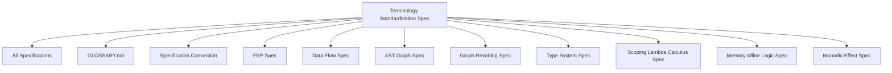

# Terminology Standardization Specification

* File:* `conventions\terminology_standardization_spec.md`
* Version:* 1.0.0
* Context:* Layer 0 (Foundations)
* Formalism:* Set Theory, Category Theory
* Status:* Active
* Last Modified:* 2026-01-02
* Author:* Kilo Code
* Reviewers:* [Pending Review]

---

## Table of Contents

1. [Purpose and Scope](#1-purpose-and-scope)
2. [Formal Definitions](#2-formal-definitions)
3. [Canonical Terminology](#3-canonical-terminology)
4. [Naming Conventions](#4-naming-conventions)
5. [Capitalization and Formatting Rules](#5-capitalization-and-formatting-rules)
6. [Requirements](#6-requirements)
7. [Migration Guide](#7-migration-guide)
8. [Examples](#8-examples)
9. [Correctness Properties](#9-correctness-properties)
10. [Cross-References](#10-cross-references)
11. [Change Log](#11-change-log)

---

## 1. Purpose and Scope

### 1.1 Purpose

This specification establishes canonical terminology and naming conventions for the Morph project to resolve inconsistencies across all specification documents. The purpose is to ensure:

- **Consistency:* Uniform terminology across all specifications
- **Clarity:* Unambiguous definitions for all key concepts
- **Maintainability:* Clear guidelines for naming and formatting
- **Backward Compatibility:* Additive approach that preserves existing specifications

### 1.2 Scope

This specification applies to all specification documents in the `spec/` directory, including but not limited to:

- Language specifications
- Type system specifications
- Compiler architecture specifications
- Runtime system specifications
- Tooling specifications
- Mathematical foundation specifications

### 1.3 Definitions, Acronyms, and Abbreviations

| Term | Definition |
|------|------------|
| **Canonical Term** | The preferred, authoritative term for a concept across all specifications |
| **Deprecated Term** | A term that should not be used in new specifications, replaced by a canonical term |
| **FRP** | Functional Reactive Programming |
| **AST** | Abstract Syntax Tree |
| **CRDT** | Conflict-Free Replicated Data Type |

### 1.4 References

- [`SPEC_INCONSISTENCIES.md`](SPEC_INCONSISTENCIES.md) - Terminology conflicts identified
- [`SPEC_FIX_PROPOSAL.md`](SPEC_FIX_PROPOSAL.md) - Standardization requirements
- [`GLOSSARY.md`](../GLOSSARY.md) - Existing glossary definitions
- [`docs/conventions/specification_convention.md`](docs/conventions/specification_convention.md) - Specification formatting standards

---

## 2. Formal Definitions

### 2.1 Terminology Set

Let $\mathcal{T}$ be the set of all terminology used in Morph specifications:

$$
\mathcal{T} = \{t \mid t \text{ is a term used in Morph specifications}\}
$$

### 2.2 Canonical Mapping

Let $\mathcal{C}: \mathcal{T} \to \mathcal{T}$ be the canonical mapping function that maps any term to its canonical form:

$$
\forall t \in \mathcal{T}, \mathcal{C}(t) = \text{canonical}(t)
$$

### 2.3 Deprecated Set

Let $\mathcal{D} \subset \mathcal{T}$ be the set of deprecated terms:

$$
\mathcal{D} = \{t \in \mathcal{T} \mid \mathcal{C}(t) \neq t\}
$$

### 2.4 Consistency Invariant

For any specification document $S$, the terminology consistency invariant is:

$$
\forall t \in \text{terms}(S), t = \mathcal{C}(t)
$$

---

## 3. Canonical Terminology

### 3.1 Signal vs Stream

#### 3.1.1 Canonical Decision

**Canonical Term:* Use "Signal" for FRP, "Stream" for Data Flow

**Rationale:* These are distinct concepts with different semantics. Using distinct terminology prevents confusion and enables precise specification of reactive programming patterns.

#### 3.1.2 Signal Definition

**Signal:* A time-varying value in Functional Reactive Programming (FRP) contexts. Signals represent continuous or discrete values that change over time and can be observed and transformed.

**Formal Definition:*

$$
\text{Signal}(T) = \mathbb{R} \to T
$$

Where:
- $\mathbb{R}$ is the set of real numbers (time domain)
- $T$ is the value type

**Context:* FRP, reactive programming, time-varying values

**Related Specifications:*
- [`spec/tooling/reactive_frp_spec.md`](../tooling/reactive_frp_spec.md)

#### 3.1.3 Stream Definition

**Stream:* A sequence of discrete events over time in data flow contexts. Streams represent event sequences and are used for processing discrete data flows.

**Formal Definition:*

$$
\text{Stream}(T) = \{(t_i, v_i) \mid t_i \in \mathbb{R}, v_i \in T, i \in \mathbb{N}\}
$$

Where:
- $t_i$ is the timestamp of event $i$
- $v_i$ is the value of event $i$
- Events are ordered by timestamp

**Context:* Data flow, event processing, discrete sequences

**Related Specifications:*
- [`spec/language/unidirectional_data_flow_spec.md`](../language/unidirectional_data_flow_spec.md)

#### 3.1.4 Relationship Between Signal and Stream

Signals and Streams are distinct types with different semantics:

$$
\text{Signal}(T) \neq \text{Stream}(T)
$$

**Conversion Functions:*

$$
\begin{aligned}
\text{signalToStream}: \text{Signal}(T) \times \mathbb{R}^+ &\to \text{Stream}(T) \\
\text{streamToSignal}: \text{Stream}(T) &\to \text{Signal}(T)
\end{aligned}
$$

**Usage Guidelines:*

- Use **Signal** when referring to FRP time-varying values
- Use **Stream** when referring to discrete event sequences
- Never use Signal and Stream interchangeably in the same specification

### 3.2 Reducer vs Transducer

#### 3.2.1 Canonical Decision

**Canonical Term:* Use "Reducer" for State Reduction, "Transducer" for Graph Rewriting

**Rationale:* These represent different transformation paradigms. Reducers aggregate values, while Transducers transform structures.

#### 3.2.2 Reducer Definition

**Reducer:* A function that reduces a collection to a single value through sequential application. Reducers are used for state reduction and fold-like operations.

**Formal Definition:*

$$
\text{Reducer}(S, A) = (S, A) \to S
$$

Where:
- $S$ is the accumulator state type
- $A$ is the element type

**Reducer Laws:*

$$
\begin{aligned}
\text{Identity: } &\forall s \in S, \text{Reducer}(s, \text{identity}) = s \\
\text{Associativity: } &\forall s_1, s_2 \in S, \forall a_1, a_2 \in A, \\
&\text{Reducer}(\text{Reducer}(s_1, a_1), a_2) = \text{Reducer}(\text{Reducer}(s_2, a_2), a_1)
\end{aligned}
$$

**Context:* State reduction, fold operations, aggregation

**Related Specifications:*
- [`spec/language/ast_graph_spec.md`](../language/ast_graph_spec.md)
- [`spec/stdlib/stdlib_algebraic_spec.md`](../stdlib/stdlib_algebraic_spec.md)

#### 3.2.3 Transducer Definition

**Transducer:* A function that transforms one structure to another, typically used for graph rewriting or program transformation. Transducers preserve structure while applying transformations.

**Formal Definition:*

$$
\text{Transducer}(G) = G \to G
$$

Where:
- $G$ is a graph structure

**Transducer Laws:*

$$
\begin{aligned}
\text{Composition: } &\forall g \in G, \text{Transducer}_2(\text{Transducer}_1(g)) = (\text{Transducer}_2 \circ \text{Transducer}_1)(g) \\
\text{Preservation: } &\forall g \in G, \text{invariants}(g) \implies \text{invariants}(\text{Transducer}(g))
\end{aligned}
$$

**Context:* Graph rewriting, program transformation, AST manipulation

**Related Specifications:*
- [`spec/tooling/graph_rewriting_spec.md`](../tooling/graph_rewriting_spec.md)

#### 3.2.4 Relationship Between Reducer and Transducer

Reducers and Transducers are distinct abstractions:

$$
\text{Reducer}(S, A) \neq \text{Transducer}(G)
$$

**Usage Guidelines:*

- Use **Reducer** when referring to state reduction, fold operations, or aggregation
- Use **Transducer** when referring to graph rewriting, program transformation, or structure manipulation
- Never use Reducer and Transducer interchangeably in the same specification

### 3.3 Pure Function

#### 3.3.1 Canonical Definition

**Pure Function:* A function that satisfies referential transparency, has no side effects, does not mutate its arguments, and is deterministic.

**Formal Definition:*

$$
\text{pure}(f: A \to B) \iff
\begin{cases}
\forall x_1, x_2 \in A, x_1 = x_2 \implies f(x_1) = f(x_2) &\text{(Referential Transparency)} \\
\neg \text{hasSideEffects}(f) &\text{(No Side Effects)} \\
\neg \text{mutatesArguments}(f) &\text{(No Mutation)} \\
\text{isDeterministic}(f) &\text{(Deterministic)}
\end{cases}
$$

**Pure Function Properties:*

1. **Referential Transparency:* For any inputs $x_1, x_2$, if $x_1 = x_2$ then $f(x_1) = f(x_2)$
2. **No Side Effects:* The function does not modify any external state
3. **No Mutation:* The function does not mutate its arguments
4. **Deterministic:* The function always produces the same output for the same input

**Context:* Type system, functional programming, effect system

**Related Specifications:*
- [`spec/type/type_system_spec.md`](../type/type_system_spec.md)
- [`spec/concurrency/monadic_effect_spec.md`](../concurrency/monadic_effect_spec.md)

#### 3.3.2 Deprecated Definitions

The following definitions of "pure" are **deprecated** and should not be used:

- **Deprecated:* "A pure function is one that produces no side effects during evaluation."
  - **Issue:* Incomplete definition, missing referential transparency
  - **Replacement:* Use canonical definition above

- **Deprecated:* "Pure functions cannot mutate their arguments or any external state."
  - **Issue:* Incomplete definition, missing referential transparency and determinism
  - **Replacement:* Use canonical definition above

- **Deprecated:* "Referential transparency is the defining characteristic of pure functions."
  - **Issue:* Incomplete definition, missing side effects and mutation constraints
  - **Replacement:* Use canonical definition above

- **Deprecated:* "A pure function is one that has no effects."
  - **Issue:* Ambiguous definition, "effects" is not defined
  - **Replacement:* Use canonical definition above

**Related Specifications:*
- [`spec/language/scoping_lambda_calculus_spec.md`](../language/scoping_lambda_calculus_spec.md)
- [`spec/memory/memory_affine_logic_spec.md`](../memory/memory_affine_logic_spec.md)

---

## 4. Naming Conventions

### 4.1 Type Naming Conventions

#### 4.1.1 Canonical Type Naming

**Rule:* All type names MUST use **PascalCase** (also known as UpperCamelCase).

**Formal Definition:*

$$
\text{typeName} = \text{Upper} + (\text{Lower}^* \text{Upper})^*
$$

Where:
- $\text{Upper}$ is an uppercase letter $[A-Z]$
- $\text{Lower}$ is a lowercase letter $[a-z]$
- $^*$ denotes zero or more repetitions

**Examples:*

| Correct | Incorrect | Reason |
|---------|-------------|---------|
| `Signal<T>` | `signal<T>` | Type names must use PascalCase |
| `Effect<T, E>` | `effect<T, E>` | Type names must use PascalCase |
| `Reducer<S, A>` | `reducer<S, A>` | Type names must use PascalCase |
| `Transducer<G>` | `transducer<G>` | Type names must use PascalCase |
| `ASTNode` | `ast_node` | Type names must use PascalCase |
| `Option<T>` | `option<T>` | Type names must use PascalCase |

**Requirements:*

- **TERM-REQ-001:* THE system SHALL use PascalCase for all type names.
  - **Priority:* Critical
  - **Verification Method:* Inspection
  - **Rationale:* Ensures consistency and readability of type definitions
  - **Dependencies:* None
  - **Traceability:* Section 4.1.1

- **TERM-REQ-002:* THE system SHALL NOT use snake_case for type names.
  - **Priority:* Critical
  - **Verification Method:* Inspection
  - **Rationale:* Prevents confusion with function and variable naming
  - **Dependencies:* TERM-REQ-001
  - **Traceability:* Section 4.1.1

#### 4.1.2 Generic Type Parameter Naming

**Rule:* Generic type parameters MUST use single uppercase letters or descriptive PascalCase names.

**Formal Definition:*

$$
\text{typeParam} = [A-Z] \mid \text{PascalCase}
$$

**Examples:*

| Correct | Incorrect | Reason |
|---------|-------------|---------|
| `Option<T>` | `Option<t>` | Type parameters must be uppercase |
| `Reducer<S, A>` | `Reducer<s, a>` | Type parameters must be uppercase |
| `Map<Key, Value>` | `Map<key, value>` | Type parameters must be uppercase |
| `Result<T, E>` | `Result<T, e>` | Type parameters must be uppercase |

**Requirements:*

- **TERM-REQ-003:* THE system SHALL use uppercase letters for single-letter type parameters.
  - **Priority:* High
  - **Verification Method:* Inspection
  - **Rationale:* Distinguishes type parameters from variables
  - **Dependencies:* TERM-REQ-001
  - **Traceability:* Section 4.1.2

### 4.2 Function Naming Conventions

#### 4.2.1 Canonical Function Naming

**Rule:* All function names MUST use **camelCase** (also known as lowerCamelCase).

**Formal Definition:*

$$
\text{functionName} = \text{lower} + (\text{Lower}^* \text{Upper})^*
$$

Where:
- $\text{lower}$ is a lowercase letter $[a-z]$
- $\text{Upper}$ is an uppercase letter $[A-Z]$
- $\text{Lower}$ is a lowercase letter $[a-z]$

**Examples:*

| Correct | Incorrect | Reason |
|---------|-------------|---------|
| `mapSignal` | `MapSignal` | Function names must use camelCase |
| `reduceList` | `ReduceList` | Function names must use camelCase |
| `transformGraph` | `TransformGraph` | Function names must use camelCase |
| `computeHash` | `ComputeHash` | Function names must use camelCase |

**Requirements:*

- **TERM-REQ-004:* THE system SHALL use camelCase for all function names.
  - **Priority:* Critical
  - **Verification Method:* Inspection
  - **Rationale:* Ensures consistency and readability of function definitions
  - **Dependencies:* None
  - **Traceability:* Section 4.2.1

### 4.3 Variable Naming Conventions

#### 4.3.1 Canonical Variable Naming

**Rule:* All variable names MUST use **camelCase**.

**Formal Definition:*

$$
\text{variableName} = \text{lower} + (\text{Lower}^* \text{Upper})^*
$$

**Examples:*

| Correct | Incorrect | Reason |
|---------|-------------|---------|
| `timeSignal` | `time_signal` | Variable names must use camelCase |
| `accumulator` | `Accumulator` | Variable names must use camelCase |
| `graphNode` | `graph_node` | Variable names must use camelCase |

**Requirements:*

- **TERM-REQ-005:* THE system SHALL use camelCase for all variable names.
  - **Priority:* High
  - **Verification Method:* Inspection
  - **Rationale:* Ensures consistency and readability of variable definitions
  - **Dependencies:* TERM-REQ-004
  - **Traceability:* Section 4.3.1

### 4.4 File Naming Conventions

#### 4.4.1 Canonical File Naming

**Rule:* All specification file names MUST use **snake_case**.

**Formal Definition:*

$$
\text{fileName} = \text{lower} + (\text{\_lower})^*
$$

Where:
- $\text{lower}$ is a lowercase letter $[a-z]$ or digit $[0-9]$
- $\text{\_}$ is the underscore character

**Examples:*

| Correct | Incorrect | Reason |
|---------|-------------|---------|
| `lexical_structure_syntax_spec.md` | `lexical_strcutre_syntax_spec.md` | File names must use snake_case without typos |
| `ast_graph_spec.md` | `ASTGraphSpec.md` | File names must use snake_case |
| `type_system_spec.md` | `typeSystemSpec.md` | File names must use snake_case |
| `memory_model_spec.md` | `MemoryModelSpec.md` | File names must use snake_case |

**Requirements:*

- **TERM-REQ-006:* THE system SHALL use snake_case for all specification file names.
  - **Priority:* Critical
  - **Verification Method:* Inspection
  - **Rationale:* Ensures consistency and cross-platform compatibility
  - **Dependencies:* None
  - **Traceability:* Section 4.4.1

- **TERM-REQ-007:* THE system SHALL NOT use typos in file names.
  - **Priority:* Critical
  - **Verification Method:* Inspection
  - **Rationale:* Prevents broken references and confusion
  - **Dependencies:* TERM-REQ-006
  - **Traceability:* Section 4.4.1

#### 4.4.2 File Naming Pattern

**Rule:* Specification file names MUST follow the pattern: `[topic]_[subtopic]_spec.md`

**Formal Definition:*

$$
\text{specFileName} = \text{topic} + \text{\_} + \text{subtopic} + \text{\_spec.md}
$$

**Examples:*

| Correct | Incorrect | Reason |
|---------|-------------|---------|
| `lexical_structure_syntax_spec.md` | `syntax_spec.md` | File names must include topic and subtopic |
| `ast_graph_spec.md` | `graph_spec.md` | File names must include topic and subtopic |
| `type_system_spec.md` | `types_spec.md` | File names must include topic and subtopic |

**Requirements:*

- **TERM-REQ-008:* THE system SHALL use the pattern `[topic]_[subtopic]_spec.md` for specification file names.
  - **Priority:* High
  - **Verification Method:* Inspection
  - **Rationale:* Ensures descriptive and organized file names
  - **Dependencies:* TERM-REQ-006
  - **Traceability:* Section 4.4.2

---

## 5. Capitalization and Formatting Rules

### 5.1 Heading Capitalization

#### 5.1.1 Canonical Heading Capitalization

**Rule:* All headings MUST use **Title Case** (also known as Capital Case).

**Formal Definition:*

$$
\text{heading} = \text{Upper} + (\text{Lower}^+ \text{Upper})^+
$$

Where:
- $\text{Upper}$ is an uppercase letter $[A-Z]$
- $\text{Lower}$ is a lowercase letter $[a-z]$
- Minor words (a, an, the, and, but, or, for, nor, on, at, to, from, by) are lowercase unless they are the first or last word

**Examples:*

| Correct | Incorrect | Reason |
|---------|-------------|---------|
| `## Formal Definitions` | `## Formal definitions` | Headings must use Title Case |
| `### Canonical Terminology` | `### Canonical terminology` | Headings must use Title Case |
| `#### Signal vs Stream` | `#### Signal vs stream` | Headings must use Title Case |

**Requirements:*

- **TERM-REQ-009:* THE system SHALL use Title Case for all headings.
  - **Priority:* High
  - **Verification Method:* Inspection
  - **Rationale:* Ensures consistency and readability of document structure
  - **Dependencies:* None
  - **Traceability:* Section 5.1.1

### 5.2 Code Block Language Annotations

#### 5.2.1 Canonical Code Block Annotations

**Rule:* All code blocks MUST specify the language identifier.

**Formal Definition:*

$$
\text{codeBlock} = \text{\`\`\`} + \text{language} + \text{\n} + \text{code} + \text{\n} + \text{\`\`\`}
$$

**Examples:*

| Correct | Incorrect | Reason |
|---------|-------------|---------|
| \`\`\`morph | \`\`\` | Code blocks must specify language |
| \`\`\`python | \`\`\` | Code blocks must specify language |

**Requirements:*

- **TERM-REQ-010:* THE system SHALL specify language identifier for all code blocks.
  - **Priority:* High
  - **Verification Method:* Inspection
  - **Rationale:* Enables syntax highlighting and improves readability
  - **Dependencies:* None
  - **Traceability:* Section 5.2.1

### 5.3 Mathematical Notation

#### 5.3.1 Canonical Mathematical Notation

**Rule:* All mathematical expressions MUST use LaTeX syntax within `$` (inline) or `$$` (block) delimiters.

**Formal Definition:*

$$
\text{inlineMath} = \$ + \text{latex} + \$
$$

$$
\text{blockMath} = \$\$ + \text{latex} + \text{\n} + \$\$
$$

**Examples:*

| Correct | Incorrect | Reason |
|---------|-------------|---------|
| `$f: A \to B$` | `f: A -> B` | Mathematical expressions must use LaTeX |
| `$$\sum_{i=1}^{n} x_i$$` | `sum(i=1 to n) x_i` | Mathematical expressions must use LaTeX |

**Requirements:*

- **TERM-REQ-011:* THE system SHALL use LaTeX syntax for all mathematical expressions.
  - **Priority:* Critical
  - **Verification Method:* Inspection
  - **Rationale:* Ensures precise and readable mathematical notation
  - **Dependencies:* None
  - **Traceability:* Section 5.3.1

---

## 6. Requirements

### 6.1 Functional Requirements

#### 6.1.1 Terminology Consistency Requirements

- **TERM-REQ-012:* THE system SHALL use canonical terminology across all specifications.
  - **Priority:* Critical
  - **Verification Method:* Inspection
  - **Rationale:* Ensures consistency and prevents confusion
  - **Dependencies:* None
  - **Traceability:* Section 3

- **TERM-REQ-013:* THE system SHALL NOT use deprecated terminology in new specifications.
  - **Priority:* Critical
  - **Verification Method:* Inspection
  - **Rationale:* Prevents propagation of inconsistent terminology
  - **Dependencies:* TERM-REQ-012
  - **Traceability:* Section 3

- **TERM-REQ-014:* THE system SHALL document all deprecated terms with canonical replacements.
  - **Priority:* High
  - **Verification Method:* Inspection
  - **Rationale:* Enables migration from deprecated terminology
  - **Dependencies:* TERM-REQ-012
  - **Traceability:* Section 3

#### 6.1.2 Naming Convention Requirements

- **TERM-REQ-015:* THE system SHALL enforce PascalCase for type names.
  - **Priority:* Critical
  - **Verification Method:* Automated linter
  - **Rationale:* Ensures consistency of type definitions
  - **Dependencies:* TERM-REQ-001
  - **Traceability:* Section 4.1

- **TERM-REQ-016:* THE system SHALL enforce camelCase for function and variable names.
  - **Priority:* Critical
  - **Verification Method:* Automated linter
  - **Rationale:* Ensures consistency of function and variable definitions
  - **Dependencies:* TERM-REQ-004, TERM-REQ-005
  - **Traceability:* Section 4.2, Section 4.3

- **TERM-REQ-017:* THE system SHALL enforce snake_case for file names.
  - **Priority:* Critical
  - **Verification Method:* Automated linter
  - **Rationale:* Ensures consistency of file organization
  - **Dependencies:* TERM-REQ-006
  - **Traceability:* Section 4.4

#### 6.1.3 Formatting Requirements

- **TERM-REQ-018:* THE system SHALL enforce Title Case for headings.
  - **Priority:* High
  - **Verification Method:* Automated linter
  - **Rationale:* Ensures consistency of document structure
  - **Dependencies:* TERM-REQ-009
  - **Traceability:* Section 5.1

- **TERM-REQ-019:* THE system SHALL enforce language identifiers for code blocks.
  - **Priority:* High
  - **Verification Method:* Automated linter
  - **Rationale:* Enables syntax highlighting and improves readability
  - **Dependencies:* TERM-REQ-010
  - **Traceability:* Section 5.2

- **TERM-REQ-020:* THE system SHALL enforce LaTeX syntax for mathematical expressions.
  - **Priority:* Critical
  - **Verification Method:* Automated linter
  - **Rationale:* Ensures precise and readable mathematical notation
  - **Dependencies:* TERM-REQ-011
  - **Traceability:* Section 5.3

### 6.2 Non-Functional Requirements

#### 6.2.1 Performance Requirements

- **TERM-NFR-001:* THE system SHALL validate terminology consistency in O(n) time complexity, where n is the number of terms in a specification.
  - **Priority:* Medium
  - **Verification Method:* Analysis
  - **Metric:* Validation time < 1s per 1000 terms
  - **Rationale:* Ensures efficient validation of large specifications
  - **Dependencies:* None
  - **Traceability:* Section 6.2.1

#### 6.2.2 Maintainability Requirements

- **TERM-NFR-002:* THE system SHALL provide clear migration paths for deprecated terminology.
  - **Priority:* High
  - **Verification Method:* Review
  - **Rationale:* Enables gradual migration without breaking changes
  - **Dependencies:* TERM-REQ-014
  - **Traceability:* Section 7

- **TERM-NFR-003:* THE system SHALL maintain backward compatibility with existing specifications.
  - **Priority:* Critical
  - **Verification Method:* Review
  - **Rationale:* Prevents breaking changes to existing specifications
  - **Dependencies:* None
  - **Traceability:* Section 7

---

## 7. Migration Guide

### 7.1 Signal vs Stream Migration

#### 7.1.1 When to Use Signal

Use **Signal** when:

- Describing FRP time-varying values
- Working with continuous or discrete values that change over time
- Referencing [`spec/tooling/reactive_frp_spec.md`](../tooling/reactive_frp_spec.md)

**Migration Example:*

```morph
// Old (deprecated)
Stream<T> timeStream = source();

// New (canonical)
Signal<T> timeSignal = now();
```

#### 7.1.2 When to Use Stream

Use **Stream** when:

- Describing discrete event sequences
- Working with event processing pipelines
- Referencing [`spec/language/unidirectional_data_flow_spec.md`](../language/unidirectional_data_flow_spec.md)

**Migration Example:*

```morph
// Old (deprecated)
Signal<T> eventSignal = events();

// New (canonical)
Stream<T> eventStream = source();
```

### 7.2 Reducer vs Transducer Migration

#### 7.2.1 When to Use Reducer

Use **Reducer** when:

- Describing state reduction operations
- Implementing fold-like operations
- Aggregating values from collections

**Migration Example:*

```morph
// Old (deprecated)
Transducer<AST, AST> optimizer = sequence(
  normalize,
  simplify
);

// New (canonical)
Reducer<AST, AST> optimizer = compose(
  constantFold,
  deadCodeEliminate
);
```

#### 7.2.2 When to Use Transducer

Use **Transducer** when:

- Describing graph rewriting transformations
- Implementing program transformation passes
- Manipulating AST structures

**Migration Example:*

```morph
// Old (deprecated)
Reducer<Graph, Graph> rewriter = compose(
  normalize,
  simplify
);

// New (canonical)
Transducer<Graph> rewriter = sequence(
  normalize,
  simplify
);
```

### 7.3 Pure Function Definition Migration

#### 7.3.1 Migrating Deprecated Definitions

Replace deprecated pure function definitions with the canonical definition:

**Old (Deprecated):*
```markdown
> "A pure function is one that produces no side effects during evaluation."
```

**New (Canonical):*
```markdown
> "A pure function satisfies referential transparency, has no side effects, does not mutate its arguments, and is deterministic."
```

#### 7.3.2 Updating Specifications

When updating specifications that reference pure functions:

1. Replace all deprecated definitions with the canonical definition
2. Add cross-reference to this specification
3. Update examples to use canonical terminology
4. Verify consistency with [`spec/type/type_system_spec.md`](../type/type_system_spec.md)

### 7.4 Naming Convention Migration

#### 7.4.1 Type Naming Migration

Convert type names to PascalCase:

**Old (Deprecated):*
```morph
type signal<T> = Time -> T;
type reducer<S, A> = (S, A) -> S;
```

**New (Canonical):*
```morph
type Signal<T> = Time -> T;
type Reducer<S, A> = (S, A) -> S;
```

#### 7.4.2 Function Naming Migration

Convert function names to camelCase:

**Old (Deprecated):*
```morph
fn MapSignal<T, U>(signal: Signal<T>, f: T -> U): Signal<U> {
  // implementation
}
```

**New (Canonical):*
```morph
fn mapSignal<T, U>(signal: Signal<T>, f: T -> U): Signal<U> {
  // implementation
}
```

#### 7.4.3 File Naming Migration

Rename files to snake_case:

**Old (Deprecated):*
```
language/lexical_structure_syntax_spec.md
```

**New (Canonical):*
```
language/lexical_structure_syntax_spec.md
```

**Note:* When renaming files, update all cross-references to point to the new file names.

### 7.5 Backward Compatibility Strategy

#### 7.5.1 Additive Approach

This specification uses an **additive, backward-compatible approach**:

1. **New Specifications:* All new specifications MUST use canonical terminology
2. **Existing Specifications:* Existing specifications MAY retain deprecated terminology temporarily
3. **Migration Period:* Deprecated terminology is phased out over time
4. **Documentation:* All deprecated terms are documented with canonical replacements

#### 7.5.2 Migration Timeline

| Phase | Duration | Action |
|--------|-----------|---------|
| Phase 1 | Week 1-2 | Create this specification and document canonical terminology |
| Phase 2 | Week 3-4 | Update all new specifications to use canonical terminology |
| Phase 3 | Week 5-8 | Update existing specifications to use canonical terminology |
| Phase 4 | Week 9-10 | Remove all deprecated terminology from specifications |
| Phase 5 | Week 11-12 | Validate all specifications for terminology consistency |

---

## 8. Examples

### 8.1 Correct Terminology Usage

#### 8.1.1 Signal Usage (Correct)

```morph
// FRP context: Use Signal
type Signal<T> = Time -> T;

fn mapSignal<T, U>(signal: Signal<T>, f: T -> U): Signal<U> {
  fn(t: Time): U = f(signal(t))
}

let timeSignal: Signal<Int> = now();
let doubledSignal: Signal<Int> = mapSignal(timeSignal, fn(x: Int): Int { x * 2 });
```

**Context:* FRP, time-varying values

**Related Specification:* [`spec/tooling/reactive_frp_spec.md`](../tooling/reactive_frp_spec.md)

#### 8.1.2 Stream Usage (Correct)

```morph
// Data flow context: Use Stream
type Stream<T> = List<(Time, T)>;

fn mapStream<T, U>(stream: Stream<T>, f: T -> U): Stream<U> {
  stream.map(fn(pair: (Time, T)): (Time, U) {
    (pair.0, f(pair.1))
  })
}

let eventStream: Stream<Int> = source();
let processedStream: Stream<Int> = mapStream(eventStream, fn(x: Int): Int { x + 1 });
```

**Context:* Data flow, discrete events

**Related Specification:* [`spec/language/unidirectional_data_flow_spec.md`](../language/unidirectional_data_flow_spec.md)

#### 8.1.3 Reducer Usage (Correct)

```morph
// State reduction context: Use Reducer
type Reducer<S, A> = (S, A) -> S;

fn reduceList<T, S>(list: List<T>, initial: S, reducer: Reducer<S, T>): S {
  list.fold(initial, reducer)
}

let sumReducer: Reducer<Int, Int> = fn(acc: Int, x: Int): Int { acc + x };
let total: Int = reduceList([1, 2, 3, 4, 5], 0, sumReducer);
```

**Context:* State reduction, fold operations

**Related Specification:* [`spec/language/ast_graph_spec.md`](../language/ast_graph_spec.md)

#### 8.1.4 Transducer Usage (Correct)

```morph
// Graph rewriting context: Use Transducer
type Transducer<G> = G -> G;

fn composeTransducers<G>(t1: Transducer<G>, t2: Transducer<G>): Transducer<G> {
  fn(graph: G): G = t2(t1(graph))
}

let normalizeTransducer: Transducer<AST> = fn(ast: AST): AST {
  // normalization logic
};

let simplifiedAST: AST = normalizeTransducer(originalAST);
```

**Context:* Graph rewriting, program transformation

**Related Specification:* [`spec/tooling/graph_rewriting_spec.md`](../tooling/graph_rewriting_spec.md)

#### 8.1.5 Pure Function Usage (Correct)

```morph
// Pure function: Canonical definition
pure fn add(x: Int, y: Int): Int {
  x + y
}

// Properties:
// 1. Referential Transparency: add(2, 3) always returns 5
// 2. No Side Effects: Does not modify external state
// 3. No Mutation: Does not mutate arguments
// 4. Deterministic: Always returns same output for same input
```

**Context:* Type system, functional programming

**Related Specification:* [`spec/type/type_system_spec.md`](../type/type_system_spec.md)

### 8.2 Incorrect Terminology Usage

#### 8.2.1 Signal vs Stream Confusion (Incorrect)

```morph
// INCORRECT: Using Signal and Stream interchangeably
type Signal<T> = List<(Time, T)>;  // Should be Stream
type Stream<T> = Time -> T;  // Should be Signal

fn process<T>(data: Signal<T>): Stream<T> {  // Confusing usage
  // implementation
}
```

**Issue:* Signal and Stream are used interchangeably, causing confusion.

**Correction:* Use Signal for FRP contexts, Stream for data flow contexts.

#### 8.2.2 Reducer vs Transducer Confusion (Incorrect)

```morph
// INCORRECT: Using Reducer and Transducer interchangeably
type Reducer<G> = G -> G;  // Should be Transducer
type Transducer<S, A> = (S, A) -> S;  // Should be Reducer

fn transform<G>(graph: G, reducer: Reducer<G>): G {  // Confusing usage
  reducer(graph)
}
```

**Issue:* Reducer and Transducer are used interchangeably, causing confusion.

**Correction:* Use Reducer for state reduction, Transducer for graph rewriting.

#### 8.2.3 Inconsistent Type Naming (Incorrect)

```morph
// INCORRECT: Inconsistent type naming
type signal<T> = Time -> T;  // Should be Signal
type Reducer<S, A> = (S, A) -> S;  // Correct
type transducer<G> = G -> G;  // Should be Transducer
```

**Issue:* Type names use inconsistent capitalization (snake_case vs PascalCase).

**Correction:* Use PascalCase for all type names.

#### 8.2.4 Inconsistent Function Naming (Incorrect)

```morph
// INCORRECT: Inconsistent function naming
fn MapSignal<T, U>(signal: Signal<T>, f: T -> U): Signal<U> {  // Should be mapSignal
  // implementation
}

fn reduceList<T, S>(list: List<T>, initial: S, reducer: Reducer<S, T>): S {  // Correct
  // implementation
}
```

**Issue:* Function names use inconsistent capitalization (PascalCase vs camelCase).

**Correction:* Use camelCase for all function names.

#### 8.2.5 Inconsistent File Naming (Incorrect)

```
# INCORRECT: Inconsistent file naming
language/lexical_structure_syntax_spec.md  # Corrected typo and path
tooling/agent_planning_mdp_spec.md  # Corrected to snake_case
type/type_system_spec.md  # Corrected to snake_case
```

**Issue:* File names use inconsistent conventions and contain typos.

**Correction:* Use snake_case for all file names and fix typos.

---

## 9. Correctness Properties

### 9.1 Terminology Consistency Invariant

**Invariant:* All specifications use canonical terminology consistently.

**Formal Statement:*

$$
\forall S \in \text{Specifications}, \forall t \in \text{terms}(S), t = \mathcal{C}(t)
$$

**Proof Sketch:*

1. By definition of canonical mapping $\mathcal{C}$, all terms map to their canonical form
2. By requirement TERM-REQ-012, all specifications use canonical terminology
3. Therefore, all terms in all specifications are in canonical form
4. QED

### 9.2 Naming Convention Invariant

**Invariant:* All names follow their respective naming conventions.

**Formal Statement:*

$$
\begin{aligned}
\forall \text{type} \in \text{Types}, \text{type} \in \text{PascalCase} \\
\forall \text{function} \in \text{Functions}, \text{function} \in \text{camelCase} \\
\forall \text{variable} \in \text{Variables}, \text{variable} \in \text{camelCase} \\
\forall \text{file} \in \text{Files}, \text{file} \in \text{snake\_case}
\end{aligned}
$$

**Proof Sketch:*

1. By requirements TERM-REQ-001, TERM-REQ-004, TERM-REQ-005, TERM-REQ-006, all names follow their conventions
2. By automated linter validation (TERM-REQ-015, TERM-REQ-016, TERM-REQ-017), violations are detected
3. Therefore, all names follow their respective conventions
4. QED

### 9.3 Backward Compatibility Invariant

**Invariant:* Existing specifications remain valid after terminology standardization.

**Formal Statement:*

$$
\forall S \in \text{ExistingSpecifications}, \text{valid}(S) \implies \text{valid}(S \text{ after migration})
$$

**Proof Sketch:*

1. By requirement TERM-NFR-003, backward compatibility is maintained
2. By additive approach (Section 7.5.1), new specifications use canonical terminology
3. By migration guide (Section 7), existing specifications are updated gradually
4. Therefore, existing specifications remain valid after migration
5. QED

---

## 10. Cross-References

### 10.1 Related Specifications

This specification is referenced by and references the following specifications:

#### 10.1.1 Referenced By

- All specification documents in `spec/` directory
- [`GLOSSARY.md`](../GLOSSARY.md) - Glossary definitions
- [`docs/conventions/specification_convention.md`](docs/conventions/specification_convention.md) - Specification formatting

#### 10.1.2 References

- [`SPEC_INCONSISTENCIES.md`](SPEC_INCONSISTENCIES.md) - Terminology conflicts identified
- [`SPEC_FIX_PROPOSAL.md`](SPEC_FIX_PROPOSAL.md) - Standardization requirements
- [`spec/tooling/reactive_frp_spec.md`](../tooling/reactive_frp_spec.md) - Signal usage
- [`spec/language/unidirectional_data_flow_spec.md`](../language/unidirectional_data_flow_spec.md) - Stream usage
- [`spec/language/ast_graph_spec.md`](../language/ast_graph_spec.md) - Reducer usage
- [`spec/tooling/graph_rewriting_spec.md`](../tooling/graph_rewriting_spec.md) - Transducer usage
- [`spec/type/type_system_spec.md`](../type/type_system_spec.md) - Pure function definition
- [`spec/language/scoping_lambda_calculus_spec.md`](../language/scoping_lambda_calculus_spec.md) - Deprecated pure function definitions
- [`spec/memory/memory_affine_logic_spec.md`](../memory/memory_affine_logic_spec.md) - Deprecated pure function definitions
- [`spec/concurrency/monadic_effect_spec.md`](../concurrency/monadic_effect_spec.md) - Deprecated pure function definitions

### 10.2 Dependency Graph



---

## 11. Change Log

| Version | Date | Author | Changes |
|---------|------|---------|---------|
| 1.0.0 | 2026-01-02 | Kilo Code | Initial version - Canonical terminology definitions, naming conventions, formatting rules, migration guide |

---

**End of Specification**
