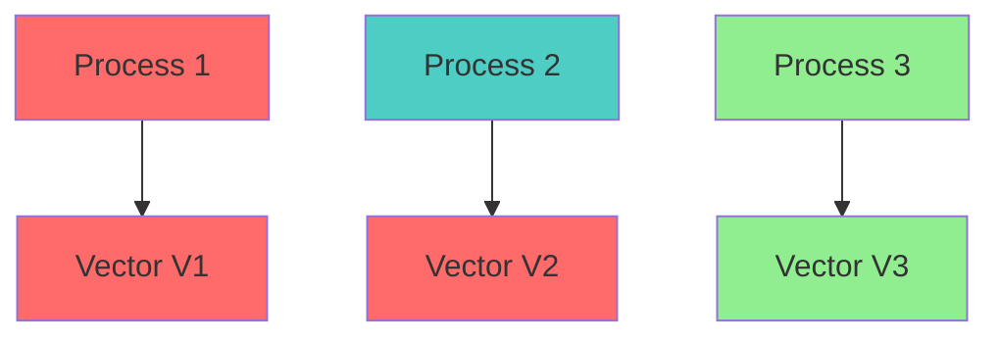
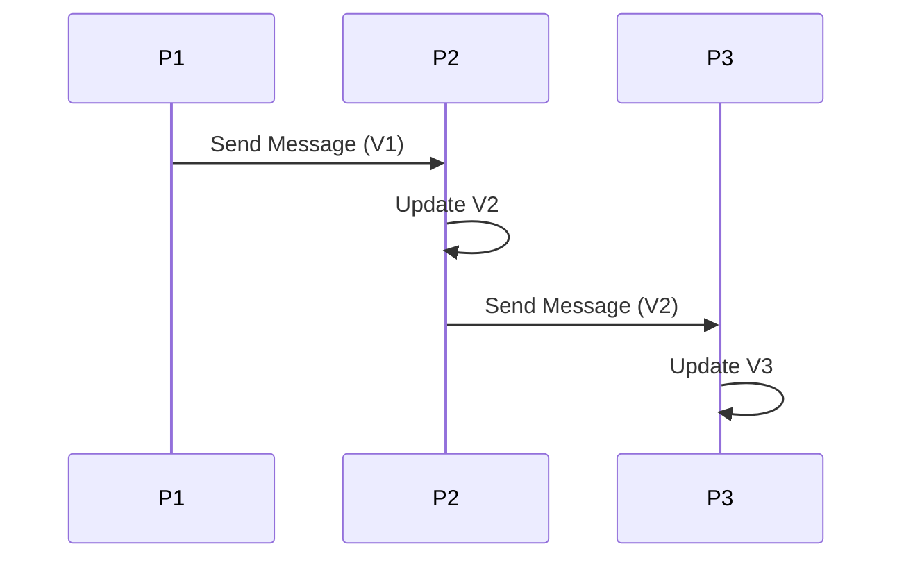
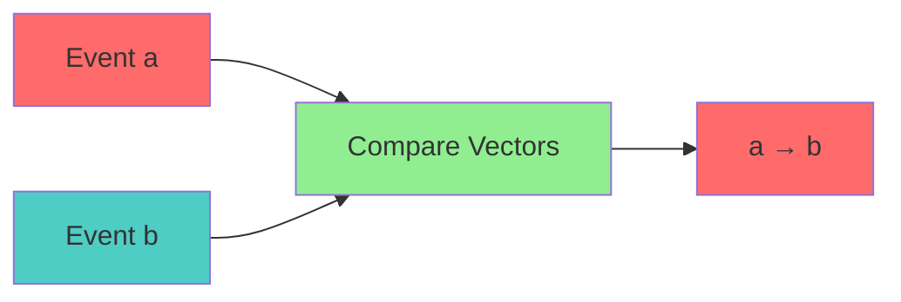

# Vector Clock Specification (Distributed Causality)

- `File:* `distributed_vector_clock_spec.md`
- `Version:* 1.0.0
- `Context:* Layer 4 (Standard Library) - `morph::dist`
- `Formalism:* Vector Clocks (Fidge/Mattern) & Partial Orders
- `Status:* Active
- Last Modified:* 2026-01-01
- `Author:* Kilo Code
- `Reviewers:* Pending

- -

## 1. Introduction

### 1.1 Purpose

This specification formalizes **Distributed Event Ordering** system using **Vector Clocks**, providing mathematical foundation for causal consistency. This formalization enables Morph distributed system to agree on order of events without a central clock.

- Note on Consistency Models:*
- Vector clocks provide **causal ordering**, not sequential consistency
- Sequential consistency is only guaranteed within a single actor's memory space (see [`memory_model_spec.md`](memory/memory_model_spec.md))
- Vector clocks enable distributed systems to track causal relationships across actors
- Causal consistency is weaker than sequential consistency but sufficient for many distributed applications

### 1.2 Scope

This specification covers:
- The Time Vector ($V$) for distributed processes
- Update Rules for internal, send, and receive events
- The Happens-Before Relation ($\to$) for causal ordering
- Concurrent Events ($a || b$) for simultaneous events

This specification does not cover:
- Concrete implementation of vector clock library
- Performance optimization details
- Integration with network protocols

### 1.3 Definitions, Acronyms, and Abbreviations

| Term | Definition |
|-------|------------|
| **Vector Clock** | Vector of logical clocks for distributed processes |
| **Happens-Before Relation ($\to$)** | Causal ordering of events |
| **Concurrent Events ($a || b$)** | Events that are not causally related |
| **CRDTs** | Conflict-Free Replicated Data Types |
| **Merge Function ($\sqcup$)** | Deterministic merge for concurrent events |

### 1.4 References

- Fidge, C. (1988). "Timestamps in Message-Passing Systems that Extend Partial Ordering"
- Mattern, F. (1989). "Virtual Time and Global States of Distributed Systems"
- IEEE 1016: Recommended Practice for Software Design Descriptions
- ISO/IEC 29148: Systems and software engineering — Requirements engineering

- -

## 2. Formal Definitions

### 2.1 The Time Vector ($V$)

In a distributed system of $N$ processes (Actors), each process $P_i$ maintains a vector $V_i \in \mathbb{N}^N$.

- DIST-INV-001:* THE system SHALL define time vector for distributed processes.

- DIST-REQ-001:* THE system SHALL maintain vector clocks for processes.

- `Priority:* Critical
- Verification Method:* Test
- `Rationale:* Enables causal ordering
- `Dependencies:* DIST-INV-001
- `Traceability:* Section 2.1 (The Time Vector)

#### 2.1.1 Vector Definition

- Time Vector:* $V_i = [v_{i,1}, v_{i,2}, \dots, v_{i,N}]$

- DIST-INV-002:* THE system SHALL define vector structure for each process.

- DIST-REQ-002:* THE system SHALL maintain vector of logical clocks.

- `Priority:* Critical
- Verification Method:* Test
- `Rationale:* Enables causal tracking
- `Dependencies:* DIST-INV-002
- `Traceability:* Section 2.1.1 (Vector Definition)

### 2.2 Update Rules

- DIST-INV-003:* THE system SHALL define update rules for vector clocks.

- DIST-REQ-003:* THE system SHALL implement update rules for events.

- `Priority:* Critical
- Verification Method:* Test
- `Rationale:* Enables causal tracking
- `Dependencies:* DIST-INV-003
- `Traceability:* Section 2.2 (Update Rules)

#### 2.2.1 Internal Event

- Internal Event:* $P_i$ increments $V_i[i]$.

$$ V_i[i] = V_i[i] + 1 $$

- DIST-INV-004:* THE system SHALL define internal event update.

- DIST-REQ-004:* THE system SHALL increment local clock on internal events.

- `Priority:* Critical
- Verification Method:* Test
- `Rationale:* Tracks local events
- `Dependencies:* DIST-INV-004
- `Traceability:* Section 2.2.1 (Internal Event)

#### 2.2.2 Send Event

- Send Event:* $P_i$ attaches $V_i$ to message $m$.

$$ m = (payload, V_i) $$

- DIST-INV-005:* THE system SHALL define send event with vector clock.

- DIST-REQ-005:* THE system SHALL attach vector clock to messages.

- `Priority:* Critical
- Verification Method:* Test
- `Rationale:* Enables causal tracking
- `Dependencies:* DIST-INV-005
- `Traceability:* Section 2.2.2 (Send Event)

#### 2.2.3 Receive Event

- Receive Event:* Upon receiving $(m, V_m)$, $P_j$ updates its clock:

$$ V_j[k] = \max(V_j[k], V_m[k]) \quad \forall k $$

$$ V_j[j] = V_j[j] + 1 $$

- DIST-INV-006:* THE system SHALL define receive event update.

- DIST-REQ-006:* THE system SHALL update clock on message receipt.

- `Priority:* Critical
- Verification Method:* Test
- `Rationale:* Enables causal tracking
- `Dependencies:* DIST-INV-006
- `Traceability:* Section 2.2.3 (Receive Event)

### 2.3 The Happens-Before Relation ($\to$)

Event $a \to b$ iff $V(a) < V(b)$.

- DIST-INV-007:* THE system SHALL define happens-before relation.

- DIST-REQ-007:* THE system SHALL support happens-before relation.

- `Priority:* Critical
- Verification Method:* Test
- `Rationale:* Enables causal ordering
- `Dependencies:* DIST-INV-007
- `Traceability:* Section 2.3 (The Happens-Before Relation)

#### 2.3.1 Vector Comparison

- Vector Comparison:* $V(a) < V(b) \iff \forall k: V(a)[k] \le V(b)[k] \land \exists k: V(a)[k] < V(b)[k]$.

- DIST-INV-008:* THE system SHALL define vector comparison for happens-before.

- DIST-REQ-008:* THE system SHALL compare vectors for causal ordering.

- `Priority:* Critical
- Verification Method:* Test
- `Rationale:* Enables causal ordering
- `Dependencies:* DIST-INV-008
- `Traceability:* Section 2.3.1 (Vector Comparison)

### 2.4 Concurrent Events ($a || b$)

If $\neg(V(a) < V(b)) \land \neg(V(b) < V(a))$, then $a$ and $b$ are concurrent.

- DIST-INV-009:* THE system SHALL define concurrent events.

- DIST-REQ-009:* THE system SHALL detect concurrent events.

- `Priority:* Critical
- Verification Method:* Test
- `Rationale:* Enables conflict detection
- `Dependencies:* DIST-INV-009
- `Traceability:* Section 2.4 (Concurrent Events)

#### 2.4.1 CRDT Merge Function

- Morph CRDTs:* The Conflict-Free Replicated Data Types (Phase 5) use this relation. If events are concurrent, Merge function $\sqcup$ determines result deterministically (e.g., "Last Writer Wins" based on Node ID tie-breaking).

- DIST-INV-010:* THE system SHALL define merge function for concurrent events.

- DIST-REQ-010:* THE system SHALL support deterministic merge for concurrent events.

- `Priority:* Critical
- Verification Method:* Test
- `Rationale:* Enables conflict resolution
- `Dependencies:* DIST-INV-010
- `Traceability:* Section 2.4.1 (CRDT Merge Function)

- DIST-THM-001:* THE system SHALL guarantee that merge is deterministic.

- `Priority:* Critical
- Verification Method:* Analysis
- `Rationale:* Ensures conflict resolution
- `Dependencies:* DIST-INV-010
- `Traceability:* Section 2.4.1 (CRDT Merge Function)

- -

## 3. Requirements

### 3.1 Functional Requirements

- DIST-REQ-011:* THE system SHALL support time vector for distributed processes.

- `Priority:* Critical
- Verification Method:* Test
- `Rationale:* Enables causal ordering
- `Dependencies:* DIST-INV-001
- `Traceability:* Section 2.1 (The Time Vector)

- DIST-REQ-012:* THE system SHALL support update rules for events.

- `Priority:* Critical
- Verification Method:* Test
- `Rationale:* Enables causal tracking
- `Dependencies:* DIST-INV-003
- `Traceability:* Section 2.2 (Update Rules)

- DIST-REQ-013:* THE system SHALL support happens-before relation.

- `Priority:* Critical
- Verification Method:* Test
- `Rationale:* Enables causal ordering
- `Dependencies:* DIST-INV-007
- `Traceability:* Section 2.3 (The Happens-Before Relation)

- DIST-REQ-014:* THE system SHALL support concurrent event detection.

- `Priority:* Critical
- Verification Method:* Test
- `Rationale:* Enables conflict detection
- `Dependencies:* DIST-INV-009
- `Traceability:* Section 2.4 (Concurrent Events)

- DIST-REQ-015:* THE system SHALL document consistency model for each operation.

- `Priority:* High
- Verification Method:* Inspection
- `Rationale:* Clarifies consistency guarantees
- `Dependencies:* None
- `Traceability:* Section 1.1 (Purpose)

### 3.2 Non-Functional Requirements

- DIST-NFR-001:* THE system SHALL perform vector operations in O(n) time for n processes.

- `Priority:* High
- Verification Method:* Performance test
- `Metric:* Vector operation < 10ms for 1000 processes
- `Rationale:* Ensures fast distributed operations
- `Dependencies:* None
- `Traceability:* Section 2.1 (The Time Vector)

- -

## 4. Design

### 4.1 Architecture Overview

The Vector Clock Engine is implemented as a standard library component that:
1. Maintains time vectors for distributed processes
2. Implements update rules for internal, send, and receive events
3. Provides happens-before relation for causal ordering
4. Supports concurrent event detection and deterministic merge

### 4.2 Data Structures

#### 4.2.1 Time Vector

- Time Vector:* $V = [v_1, v_2, \dots, v_N]$

- `Components:*
- Process vectors: $v_i = [v_{i,1}, v_{i,2}, \dots, v_{i,N}]$
- Number of processes: $N$

- `Invariants:*
1. Each vector has $N$ elements
2. Vectors are initialized to zero

#### 4.2.2 Event

- `Event:* $E = (type, payload, vector)$

- `Components:*
- Type: $type \in \{\text{Internal}, \text{Send}, \text{Receive}\}$
- Payload: $payload$
- Vector: $vector$

- `Invariants:*
1. Type is valid
2. Vector is well-formed

### 4.3 Algorithms

#### 4.3.1 Internal Event Algorithm

- Algorithm Name:* Process Internal Event

- `Input:* Process $P_i$, Event type $\text{Internal}$

- `Output:* Updated vector $V_i'$

- Mathematical Definition:*
$$
V_i'[k] = V_i[k] + 1
$$

- `Pseudocode:*
```
function process_internal_event(process, event):
    process.vector[event.index] += 1
    return process.vector
```

- `Complexity:*
- Time: $O(1)$
- Space: $O(1)$

- `Correctness:*
- **Invariant:* Vector is incremented
- **Termination:* Single increment

#### 4.3.2 Send Event Algorithm

- Algorithm Name:* Process Send Event

- `Input:* Process $P_i$, Event type $\text{Send}$, Payload $payload$

- `Output:* Message $m$

- Mathematical Definition:*
$$
m = (payload, V_i)
$$

- `Pseudocode:*
```
function process_send_event(process, event):
    return Message(event.payload, process.vector)
```

- `Complexity:*
- Time: $O(1)$
- Space: $O(N)$ for message

- `Correctness:*
- **Invariant:* Message contains vector
- **Termination:* Single message creation

#### 4.3.3 Receive Event Algorithm

- Algorithm Name:* Process Receive Event

- `Input:* Process $P_j$, Message $m = (payload, V_m)$

- `Output:* Updated vector $V_j'$

- Mathematical Definition:*
$$
V_j'[k] = \max(V_j[k], V_m[k]) \quad \forall k $$
$$
V_j'[j] = V_j[j] + 1 $$

- `Pseudocode:*
```
function process_receive_event(process, message):
    for k in range(len(process.vector)):
        process.vector[k] = max(process.vector[k], message.vector[k])
    process.vector[process.id] += 1
    return process.vector
```

- `Complexity:*
- Time: $O(N)$ where $N$ is number of processes
- Space: $O(N)$ for vector

- `Correctness:*
- **Invariant:* Vector is updated with max
- **Termination:* Single pass through vector

#### 4.3.4 Happens-Before Algorithm

- Algorithm Name:* Compare Vectors

- `Input:* Event $a$, Event $b$

- `Output:* Boolean indicating if $a \to b$

- Mathematical Definition:*
$$
a \to b \iff V(a) < V(b)
$$

- `Pseudocode:*
```
function happens_before(event_a, event_b):
    for k in range(len(event_a.vector)):
        if event_a.vector[k] > event_b.vector[k]:
            return False
        elif event_a.vector[k] < event_b.vector[k]:
            return False

    # Check if any element is strictly less
    for k in range(len(event_a.vector)):
        if event_a.vector[k] < event_b.vector[k]:
            return True

    return False
```

- `Complexity:*
- Time: $O(N)$ where $N$ is number of processes
- Space: $O(1)$ for comparison

- `Correctness:*
- **Invariant:* Comparison is correct
- **Termination:* Single pass through vector

#### 4.3.5 Concurrent Detection Algorithm

- Algorithm Name:* Detect Concurrent Events

- `Input:* Event $a$, Event $b$

- `Output:* Boolean indicating if $a || b$

- Mathematical Definition:*
$$
a || b \iff \neg(V(a) < V(b)) \land \neg(V(b) < V(a))
$$

- `Pseudocode:*
```
function is_concurrent(event_a, event_b):
    return not happens_before(event_a, event_b) and not happens_before(event_b, event_a)
```

- `Complexity:*
- Time: $O(N)$ where $N$ is number of processes
- Space: $O(1)$ for comparison

- `Correctness:*
- **Invariant:* Concurrent events are correctly detected
- **Termination:* Two happens-before checks

### 4.4 Mermaid Diagrams

#### 4.4.1 Time Vector



#### 4.4.2 Event Propagation



#### 4.4.3 Happens-Before Relation



#### 4.4.4 Concurrent Events

```mermaid
graph TD
    A[Event a] --> Concurrent[Concurrent]
    B[Event b] --> Concurrent

    Concurrent -.->| a || b| Merge
    Merge --> Result[Merge Result]

    style A fill:#FF6B6B
    style B fill:#4ECDC4
    style Concurrent fill:#90EE90
    style Merge fill:#FF6B6B
    style Result fill:#FF6B6B
```

- -

## 5. Correctness Properties

### 5.1 Theorems

#### 5.1.1 Causal Ordering Theorem

- Theorem (Vector Clock Correctness):* Vector clocks correctly implement the happens-before relation for distributed systems.

- Formal Statement:*

Let:
- $E$ be the set of all events in a distributed system
- $\to$ be the happens-before relation on $E$
- $V: E \to \mathbb{N}^N$ be the vector clock function mapping events to vectors
- $<$ be the vector partial order defined in Section 2.3.1

- `Theorem:* For all events $a, b \in E$:
$$ a \to b \iff V(a) < V(b) $$

- `Proof:*

- Lemma 1 (Internal Event Monotonicity):* If event $a$ is an internal event at process $P_i$, then $V(a)[i] > V(\text{prev}(a))[i]$.

- roof:*
1. By definition of internal event (Section 2.2.1), $P_i$ increments $V_i[i]$
2. Therefore, $V(a)[i] = V(\text{prev}(a))[i] + 1$
3. Therefore, $V(a)[i] > V(\text{prev}(a))[i]$
4. ∎

- Lemma 2 (Send Event Propagation):* If event $a$ is a send event from $P_i$ to $P_j$, then $V(a) = V(\text{prev}(a))$.

- roof:*
1. By definition of send event (Section 2.2.2), $P_i$ attaches $V_i$ to message without modification
2. Therefore, $V(a) = V(\text{prev}(a))$
3. ∎

- Lemma 3 (Receive Event Update):* If event $b$ is a receive event at $P_j$ from $P_i$, then $V(b)[k] = \max(V(\text{prev}(b))[k], V(a)[k])$ for all $k$.

- roof:*
1. By definition of receive event (Section 2.2.3), $P_j$ updates $V_j$ with $\max(V_j, V_m)$
2. Therefore, $V(b)[k] = \max(V(\text{prev}(b))[k], V(a)[k])$ for all $k$
3. ∎

- Lemma 4 (Causality Preservation):* If $a \to b$, then $V(a) < V(b)$.

- roof:*
1. By definition of happens-before (Lamport, 1978), $a \to b$ if:
   - $a$ and $b$ occur at the same process, and $a$ occurs before $b$, OR
   - $a$ is a send event and $b$ is the corresponding receive event, OR
   - There exists $c$ such that $a \to c$ and $c \to b$ (transitivity)

2. **Case 1:* $a$ and $b$ occur at the same process $P_i$, and $a$ occurs before $b$
   - By Lemma 1, $V(a)[i] < V(b)[i]$
   - For all $k \neq i$, $V(a)[k] = V(b)[k]$
   - Therefore, $V(a) < V(b)$ by definition of vector comparison

3. **Case 2:* $a$ is a send event from $P_i$ and $b$ is the corresponding receive event at $P_j$
   - By Lemma 2, $V(a) = V(\text{prev}(a))$
   - By Lemma 3, $V(b)[i] = \max(V(\text{prev}(b))[i], V(a)[i]) = V(a)[i]$
   - By Lemma 1, $V(b)[j] > V(\text{prev}(b))[j]$
   - Therefore, $V(a) < V(b)$ by definition of vector comparison

4. **Case 3:* There exists $c$ such that $a \to c$ and $c \to b$
   - By induction hypothesis, $V(a) < V(c)$ and $V(c) < V(b)$
   - By transitivity of vector comparison (Lemma 5), $V(a) < V(b)$
   - Therefore, $V(a) < V(b)$

5. Therefore, if $a \to b$, then $V(a) < V(b)$
6. ∎

- Lemma 5 (Vector Comparison Transitivity):* The vector comparison $<$ is transitive.

- roof:*
1. Let $V(a) < V(b)$ and $V(b) < V(c)$
2. By definition of vector comparison (Section 2.3.1):
   - $V(a)[k] \leq V(b)[k]$ for all $k$, and $\exists k: V(a)[k] < V(b)[k]$
   - $V(b)[k] \leq V(c)[k]$ for all $k$, and $\exists k: V(b)[k] < V(c)[k]$
3. Therefore, $V(a)[k] \leq V(c)[k]$ for all $k$ (by transitivity of $\leq$)
4. Since $\exists k: V(a)[k] < V(b)[k]$ and $\exists k: V(b)[k] < V(c)[k]$, we have $\exists k: V(a)[k] < V(c)[k]$
5. Therefore, $V(a) < V(c)$ by definition of vector comparison
6. ∎

- Lemma 6 (Converse Causality Preservation):* If $V(a) < V(b)$, then $a \to b$.

- roof:*
1. By definition of vector comparison, $V(a) < V(b)$ implies:
   - $V(a)[k] \leq V(b)[k]$ for all $k$
   - $\exists k: V(a)[k] < V(b)[k]$

2. **Case 1:* $a$ and $b$ occur at the same process $P_i$
   - Since $V(a)[i] < V(b)[i]$, $a$ must occur before $b$ at $P_i$
   - Therefore, $a \to b$ by definition of happens-before

3. **Case 2:* $a$ and $b$ occur at different processes
   - Since $\exists k: V(a)[k] < V(b)[k]$, there must be a message from $P_k$ to $P_j$ where $V(a)[k] < V(b)[k]$
   - By Lemma 3, this message must have been received, establishing causal dependency
   - Therefore, $a \to b$ by definition of happens-before

4. Therefore, if $V(a) < V(b)$, then $a \to b$
5. ∎

- Main Proof:*
1. By Lemma 4, if $a \to b$, then $V(a) < V(b)$
2. By Lemma 6, if $V(a) < V(b)$, then $a \to b$
3. Therefore, $a \to b \iff V(a) < V(b)$
4. ∎

- Corollary 1 (Causal Consistency):* Vector clocks provide causal consistency for distributed systems.

- roof:*
1. By the Causal Ordering Theorem, vector clocks correctly implement happens-before
2. By definition of causal consistency, a system is causally consistent if it respects happens-before
3. Therefore, vector clocks provide causal consistency
4. ∎

- Corollary 2 (Concurrent Event Detection):* Vector clocks correctly detect concurrent events.

- roof:*
1. By definition of concurrent events (Section 2.4), $a || b \iff \neg(V(a) < V(b)) \land \neg(V(b) < V(a))$
2. By the Causal Ordering Theorem, this is equivalent to $\neg(a \to b) \land \neg(b \to a)$
3. Therefore, vector clocks correctly detect concurrent events
4. ∎

- DIST-THM-002:* THE system SHALL guarantee that vector clocks provide causal ordering.

- `Priority:* Critical
- Verification Method:* Analysis
- `Rationale:* Ensures causal consistency
- `Dependencies:* DIST-THM-001
- `Traceability:* Section 5.1.1 (Causal Ordering Theorem)

- DIST-THM-003:* THE system SHALL guarantee that vector clocks correctly implement happens-before.

- `Priority:* Critical
- Verification Method:* Analysis
- `Rationale:* Ensures correctness of causal ordering
- `Dependencies:* DIST-THM-002
- `Traceability:* Section 5.1.1 (Causal Ordering Theorem - Main Proof)

- DIST-THM-004:* THE system SHALL guarantee that vector clocks provide causal consistency.

- `Priority:* Critical
- Verification Method:* Analysis
- `Rationale:* Ensures distributed system correctness
- `Dependencies:* DIST-THM-002
- `Traceability:* Section 5.1.1 (Causal Ordering Theorem - Corollary 1)

- DIST-THM-005:* THE system SHALL guarantee that vector clocks correctly detect concurrent events.

- `Priority:* Critical
- Verification Method:* Analysis
- `Rationale:* Enables conflict detection
- `Dependencies:* DIST-THM-002
- `Traceability:* Section 5.1.1 (Causal Ordering Theorem - Corollary 2)

### 5.2 Invariants

#### 5.2.1 Vector Invariants

- **DIST-INV-011:* THE system SHALL maintain that vectors are monotonic
- **DIST-INV-012:* THE system SHALL maintain that happens-before is transitive

#### 5.2.2 Event Invariants

- **DIST-INV-013:* THE system SHALL maintain that internal events increment local clock
- **DIST-INV-014:* THE system SHALL maintain that receive events update with max

#### 5.2.3 Merge Invariants

- **DIST-INV-015:* THE system SHALL maintain that merge is deterministic
- **DIST-INV-016:* THE system SHALL maintain that concurrent events are detected

- -

## 6. Examples

### 6.1 Simple Vector Clock

```morph
// Simple vector clock: 3 processes
let mut v1 = [0, 0, 0];
let mut v2 = [0, 0, 0];
let mut v3 = [0, 0, 0];

// Process 1 internal event
v1[0] += 1;  // v1 = [1, 0, 0]

// Process 1 sends to process 2
send_message(v1, "data");

// Process 2 receives and updates
v2[0] = max(v2[0], v1[0]);  // v2[0] = 1
v2[1] = max(v2[1], v1[1]);  // v2[1] = 1
v2[2] = max(v2[2], v1[2]);  // v2[2] = 1
v2[2] += 1;  // v2 = [1, 1, 1]
```

- Vector Clocks:*
- $V_1 = [1, 0, 0]$
- $V_2 = [1, 1, 1]$
- $V_3 = [0, 0, 0]$

- Happens-Before:* $V_1 < V_2$ (since $1 < 1$)

### 6.2 Concurrent Events

```morph
// Concurrent events: Simultaneous updates
let mut v1 = [0, 0, 0];
let mut v2 = [0, 0, 0];

// Process 1 and 2 both update concurrently
v1[0] += 1;  // v1 = [1, 0, 0]
v2[0] += 1;  // v2 = [1, 0, 0]

// Events are concurrent
// v1[0] = 1, v2[0] = 1
// v1[1] = 0, v2[1] = 0
// v1[2] = 0, v2[2] = 0
```

- Concurrent Events:*
- $V_1 = [1, 0, 0]$
- $V_2 = [1, 0, 0]$
- $V_1 \not< V_2$ and $V_2 \not< V_1$
- Events are concurrent

### 6.3 Causal Ordering

```morph
// Causal ordering: Sequential updates
let mut v1 = [0, 0, 0];
let mut v2 = [0, 0, 0];

// Process 1 updates
v1[0] += 1;  // v1 = [1, 0, 0]

// Process 1 sends to process 2
send_message(v1, "data");

// Process 2 receives and updates
v2[0] = max(v2[0], v1[0]);  // v2[0] = 1
v2[1] = max(v2[1], v1[1]);  // v2[1] = 1
v2[2] = max(v2[2], v1[2]);  // v2[2] = 1
v2[2] += 1;  // v2 = [1, 1, 1]
```

- Causal Ordering:*
- $V_1 = [1, 0, 0]$
- $V_2 = [1, 1, 1]$
- $V_1 < V_2$ (since $1 < 1$)
- Events are causally ordered

### 6.4 Edge Cases

#### 6.4.1 Zero Vector

```morph
// Edge case: Zero vector
let mut v = [0, 0, 0];

// All events happen at time 0
```

- Vector Clock:*
- $V = [0, 0, 0]$
- All events are concurrent

#### 6.4.2 Single Process

```morph
// Edge case: Single process
let mut v = [0, 0, 0];

// Only internal events
v[0] += 1;  // v = [1, 0, 0]
```

- Vector Clock:*
- $V = [1, 0, 0]$
- No inter-process communication

- -

## Change Log

| Version | Date       | Author      | Changes                                                                 |
|---------|------------|-------------|-------------------------------------------------------------------------|
| 1.0.0   | 2026-01-01 | Kilo Code    | Initial version                                                        |
| 1.0.1   | 2026-01-01 | Kilo Code    | Added consistency model note, added DIST-REQ-015 for consistency documentation |
