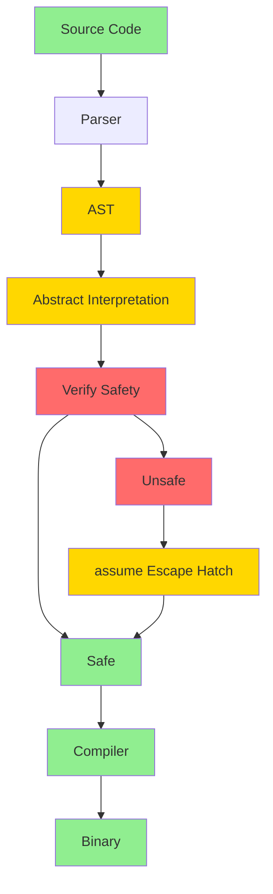
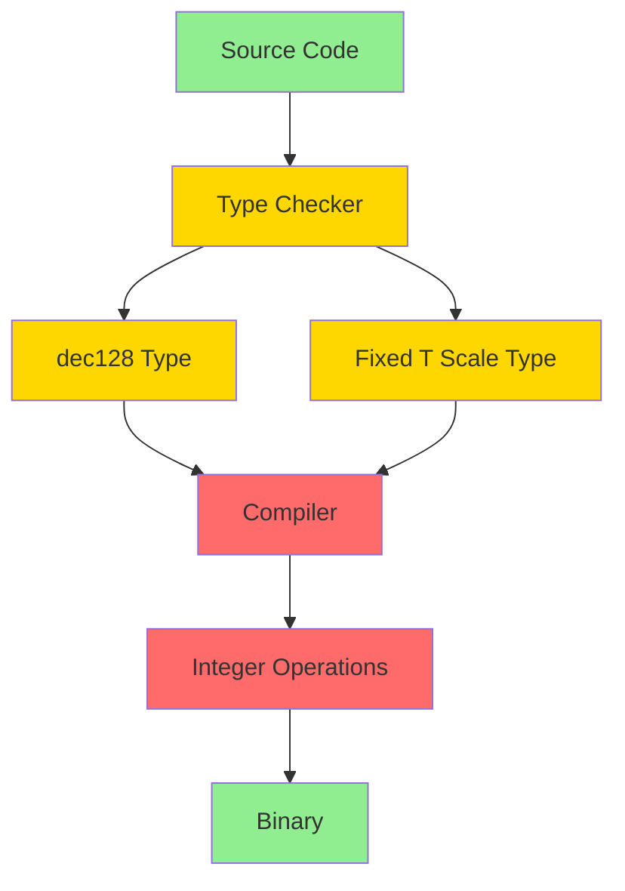

# Domain Extension Specification: Financial (DES-FIN)

- `System:* Morph Ecosystem
- `Version:* 2.0.0
- `Context:* Layer 2 (Compiler) & Layer 4 (Standard Library)
- `Formalism:* Dimensional Analysis, Fixed-Point Logic, Kernel Bypass, Abstract Interpretation
- `Status:* Active
- Last Modified:* 2026-01-02
- `Author:* Kilo Code
- `Reviewers:* Pending

- -

## 1. Introduction

### 1.1 Purpose

This specification defines the Financial Domain Extension for Morph, providing formal foundation for monetary calculations, high-frequency trading, and regulatory compliance. The financial domain uses **Compiler-Generated Proofs** via abstract interpretation and **Unified Numeric Interface** with zero-cost abstractions to bridge the precision-performance gap.

### 1.2 Scope

This specification covers:
- Unified Monetary Semantics with Currency Units
- Dimensional Exchange Rates with Ratio Types
- Arithmetic Safety & Precision with Explicit Rounding
- Temporal Day Counting with ISDA Standards
- High-Frequency Trading (HFT) Extensions with Bare Metal Mode
- Auditability & Compliance with Immutable Ledgers
- Compiler-Generated Proofs via Abstract Interpretation
- Unified Numeric Interface with Zero-Cost Abstractions

This specification does not cover:
- Concrete implementation of financial algorithms
- Performance optimization details
- Integration with external financial systems

### 1.3 Definitions, Acronyms, and Abbreviations

| Term | Definition |
|-------|------------|
| **dec128** | IEEE 754-2008 Decimal128 - 34 digits of decimal precision |
| **Fixed<T, Scale>** | Fixed-point type with integer type T and decimal scale |
| **Abstract Interpretation** | Compiler technique for automatic safety verification |
| **Zero-Cost Abstraction** | Type that compiles to efficient representation but provides high-level semantics |
| **HFT** | High-Frequency Trading |
| **ISDA** | International Swaps and Derivatives Association |
| **SEC** | Securities and Exchange Commission |
| **ESMA** | European Securities and Markets Authority |
| **WORM** | Write Once, Read Many |
| **Cache Line** | 64-byte memory block aligned to CPU cache line |

### 1.4 References

- IEEE 754-2008: Floating-Point Arithmetic
- IEEE 754-2008: Decimal128 Floating-Point Arithmetic (34 digits of decimal precision)
- ISDA (2006). "2006 ISDA Definitions"
- SEC (2010). "Market Access Rule"
- ESMA (2014). "MiFID II Technical Standards"
- Cousot, P., & Cousot, R. (1977). "Abstract Interpretation: A Unified Lattice Model for Static Analysis of Programs by Uniform Approximation of Programs"
- ISO/IEC 29148: Systems and software engineering — Requirements engineering

- -

## 2. Formal Definitions

### 2.1 Unified Monetary Semantics

Morph treats Currency as a **Physical Dimension**, utilizing compiler's Unit Algebra engine to enforce logical correctness in exchange and valuation.

#### 2.1.1 Currency Units

* FIN-INV-001:* THE system SHALL define currencies using `unit` keyword.

* FIN-INV-002:* THE system SHALL use `dec128` as the backing type for monetary values to ensure 34 digits of decimal precision and exact representation of powers of 10.

* Syntax:*
```rust
// Base Units
unit USD;
unit EUR;
unit BTC;

// Usage (Type Erasure applies at runtime)
let balance: dec128<USD> = 100.50d;
```

* FIN-REQ-001:* THE system SHALL define currencies using `unit` keyword.

* Priority:* Critical
* Verification Method:* Test
* Rationale:* Enables type-safe currency operations
* Dependencies:* FIN-INV-001
* Traceability:* Section 2.1.1 (Currency Units)

* FIN-REQ-002:* THE system SHALL use `dec128` as the backing type for monetary values.

* Priority:* Critical
* Verification Method:* Test
* Rationale:* Ensures 34 digits of decimal precision
* Dependencies:* FIN-INV-002
* Traceability:* Section 2.1.1 (Currency Units)

#### 2.1.2 Dimensional Exchange Rates

Exchange rates are not raw numbers; they are **Ratios**. This prevents the "Inverted Rate" bug (multiplying when one should divide).

* FIN-INV-003:* THE system SHALL define exchange rates as ratio types `dec128<Target / Source>`.

* FIN-INV-004:* THE system SHALL enforce algebraic cancellation rules for exchange rates.

* Syntax:*
```rust
fn convert(amount: dec128<USD>, rate: dec128<EUR / USD>) -> dec128<EUR> {
    // [USD] * [EUR / USD] == [EUR]
    ret amount * rate;
}

// HALLUCINATION CHECK:
// If Agent writes: 'ret amount / rate;'
// Result Unit: [USD] / [EUR / USD] == [USD^2 / EUR]
// Compiler Error: Type Mismatch. Expected <EUR>, found <USD^2 / EUR>.
```

* FIN-REQ-003:* THE system SHALL define exchange rates as ratio types `dec128<Target / Source>`.

* Priority:* Critical
* Verification Method:* Test
* Rationale:* Prevents inverted rate bugs
* Dependencies:* FIN-INV-003
* Traceability:* Section 2.1.2 (Dimensional Exchange Rates)

* FIN-REQ-004:* THE system SHALL enforce algebraic cancellation rules for exchange rates.

* Priority:* Critical
* Verification Method:* Test
* Rationale:* Ensures correct unit arithmetic
* Dependencies:* FIN-INV-004
* Traceability:* Section 2.1.2 (Dimensional Exchange Rates)

#### 2.1.3 Variance and Risk Models

* FIN-INV-005:* THE system SHALL support squared units for statistical risk models.

* FIN-REQ-005:* THE system SHALL support squared units for statistical risk models.

* Priority:* High
* Verification Method:* Test
* Rationale:* Enables variance and covariance calculations
* Dependencies:* FIN-INV-005
* Traceability:* Section 2.1.3 (Variance and Risk Models)

* Examples:*
- Variance: `dec128<USD * USD>`
- Covariance: `dec128<USD * EUR>`

### 2.2 Arithmetic Safety & Precision

#### 2.2.1 Explicit Rounding Contexts

Financial operations involving division or multiplication by non-integer rates often result in infinite repeating decimals.

* FIN-INV-006:* THE system SHALL prohibit operations that can increase scale beyond storage type outside of a `rounding` block.

* Syntax:*
```rust
let price: dec128<USD> = 10.00d;
let tax_rate: dec128 = 0.08125d;

// Compile Error: Implicit truncation prohibited.
// let tax: dec128<USD> = price * tax_rate;

// Valid:
with rounding(Mode::Bankers, Scale::2) {
    let tax: dec128<USD> = price * tax_rate; // result 0.81
}
```

* FIN-REQ-006:* THE system SHALL prohibit operations that can increase scale beyond storage type outside of a `rounding` block.

* Priority:* Critical
* Verification Method:* Test
* Rationale:* Prevents implicit truncation errors
* Dependencies:* FIN-INV-006
* Traceability:* Section 2.2.1 (Explicit Rounding Contexts)

#### 2.2.2 Temporal Day Counting

* FIN-INV-007:* THE system SHALL provide `morph::fin::DayCount` for standardized time calculations.

* FIN-REQ-007:* THE system SHALL provide `morph::fin::DayCount` for standardized time calculations.

* Priority:* High
* Verification Method:* Test
* Rationale:* Aligns with ISDA standards
* Dependencies:* FIN-INV-007
* Traceability:* Section 2.2.2 (Temporal Day Counting)

* Behavior:* Enforces specific logic for `Date` subtraction (e.g., `Act/360`, `30/360`) to align with ISDA standards.

### 2.3 High-Frequency Trading (HFT) Extensions

For Order Matching Engines and Market Makers, Morph Runtime (`Green Threads` + `Arenas`) is too slow. We introduce **Bare Metal Mode**.

#### 2.3.1 The `@critical` Attribute

* FIN-INV-008:* THE system SHALL trigger Zero-Latency Compiler Pass for functions marked `@critical`.

* Constraints:*
1. **No Allocation:* Heap allocation (`iso`, `val`) is a Compile Error. Only Stack variables allow.
2. **No Scheduler:* Code does not yield. It runs on a dedicated, pinned OS Thread (`pthread_setaffinity`).
3. **No Bounds Checks:* Array indexing is unchecked (Agent must prove safety via `requires` or use fixed-size arrays).
4. **No `dec128`:* Logic must use `i64` (Fixed Point Micros/Nanos) for integer-only arithmetic.

* FIN-REQ-008:* THE system SHALL trigger Zero-Latency Compiler Pass for functions marked `@critical`.

* Priority:* Critical
* Verification Method:* Test
* Rationale:* Enables sub-microsecond execution
* Dependencies:* FIN-INV-008
* Traceability:* Section 2.3.1 (The `@critical` Attribute)

#### 2.3.2 Memory Layout (Cache Line Alignment)

* FIN-INV-009:* THE system SHALL force data structures to align to CPU Cache Lines (typically 64 bytes) to prevent False Sharing in multi-core order books.

* Syntax:*
```rust
@critical
type Order = {
    price: i64, // 8 bytes
    qty: u32,   // 4 bytes
    id: u32     // 4 bytes
} #[packed(cache_line)];
```

* FIN-REQ-009:* THE system SHALL force data structures to align to CPU Cache Lines.

* Priority:* High
* Verification Method:* Test
* Rationale:* Prevents false sharing in multi-core systems
* Dependencies:* FIN-INV-009
* Traceability:* Section 2.3.2 (Memory Layout)

### 2.4 Auditability & Compliance

Regulatory bodies (SEC, ESMA) require immutable logs of why a decision was made.

#### 2.4.1 Intrinsic Audit Logging

* FIN-INV-010:* THE system SHALL perform AST injection for modules marked `@auditable`.

* Behavior:* Every public state mutation automatically:
1. Captures Timestamp (High Precision)
2. Captures Input Arguments
3. Captures Pre-image and Post-image Hash of State
4. Writes to an append-only `Ledger` struct

* Agent Safety:* The Agent cannot "forget" to log a trade execution. The compiler inserts the logger.

* FIN-REQ-010:* THE system SHALL perform AST injection for modules marked `@auditable`.

* Priority:* Critical
* Verification Method:* Test
* Rationale:* Ensures regulatory compliance
* Dependencies:* FIN-INV-010
* Traceability:* Section 2.4.1 (Intrinsic Audit Logging)

#### 2.4.2 Immutable Ledgers

* FIN-INV-011:* THE system SHALL enforce WORM (Write Once, Read Many) compliance at type level for `Ledger<T>`.

* FIN-REQ-011:* THE system SHALL enforce WORM compliance at type level for `Ledger<T>`.

* Priority:* Critical
* Verification Method:* Test
* Rationale:* Ensures regulatory compliance
* Dependencies:* FIN-INV-011
* Traceability:* Section 2.4.2 (Immutable Ledgers)

* Behavior:* The `Ledger<T>` type supports `append()` and `read()`, but strictly NO `delete()` or `update()`.

### 2.5 Compiler-Generated Proofs via Abstract Interpretation

Morph uses **Abstract Interpretation** to automatically verify safety properties without requiring manual SMT proofs.

#### 2.5.1 Abstract Interpretation Engine

* FIN-INV-012:* THE system SHALL use abstract interpretation for automatic safety verification.

* FIN-REQ-012:* THE system SHALL use abstract interpretation for automatic safety verification.

* Priority:* Critical
* Verification Method:* Test
* Rationale:* Eliminates need for manual SMT proofs
* Dependencies:* FIN-INV-012
* Traceability:* Section 2.5.1 (Abstract Interpretation Engine)

* Mechanism:*
1. **Abstract Domain:* The compiler defines an abstract domain for financial types (e.g., `dec128<USD>`, `Fixed<i64, 6>`)
2. **Transfer Functions:* The compiler defines transfer functions for arithmetic operations
3. **Widening/Narrowing:* The compiler uses widening to accelerate convergence
4. **Safety Verification:* The compiler verifies safety properties (e.g., no overflow, no underflow)

* Example:*
```rust
fn calculate_interest(principal: dec128<USD>, rate: dec128, days: i32) -> dec128<USD> {
    // Compiler automatically verifies:
    // 1. No overflow in multiplication
    // 2. No underflow in division
    // 3. Rounding is explicit
    with rounding(Mode::Bankers, Scale::2) {
        ret principal * rate * days / 365;
    }
}
```

#### 2.5.2 Escape Hatch: `assume { ... }`

When the compiler cannot prove safety, the developer can use the `assume { ... }` escape hatch.

* FIN-INV-013:* THE system SHALL provide `assume { ... }` escape hatch for cases where compiler cannot prove safety.

* FIN-REQ-013:* THE system SHALL provide `assume { ... }` escape hatch for cases where compiler cannot prove safety.

* Priority:* High
* Verification Method:* Test
* Rationale:* Allows developers to provide manual proofs when needed
* Dependencies:* FIN-INV-013
* Traceability:* Section 2.5.2 (Escape Hatch)

* Syntax:*
```rust
fn complex_calculation(x: dec128<USD>, y: dec128<USD>) -> dec128<USD> {
    // Compiler cannot prove safety
    assume {
        x > 0;
        y > 0;
        x * y < dec128<USD>::MAX;
    }
    ret x * y;
}
```

### 2.6 Unified Numeric Interface with Zero-Cost Abstractions

Morph provides a **Unified Numeric Interface** that bridges the precision-performance gap with zero-cost abstractions.

#### 2.6.1 Zero-Cost Abstraction: `dec128`

* FIN-INV-014:* THE system SHALL provide `dec128` as a zero-cost abstraction for decimal arithmetic.

* FIN-REQ-014:* THE system SHALL provide `dec128` as a zero-cost abstraction for decimal arithmetic.

* Priority:* Critical
* Verification Method:* Test
* Rationale:* Provides high-level decimal semantics with efficient implementation
* Dependencies:* FIN-INV-014
* Traceability:* Section 2.6.1 (Zero-Cost Abstraction: `dec128`)

* Mechanism:*
- **Type:* `dec128` is a type that provides decimal semantics
- **Implementation:* Compiles to efficient representation (e.g., 128-bit integer with decimal scale)
- **Operations:* Arithmetic operations compile to efficient integer operations
- **Zero-Cost:* No runtime overhead compared to manual fixed-point arithmetic

* Example:*
```rust
let price: dec128<USD> = 100.50d;
let quantity: dec128 = 10;
let total: dec128<USD> = price * quantity; // Compiles to efficient integer multiplication
```

#### 2.6.2 Fixed-Point Type: `Fixed<T, Scale>`

* FIN-INV-015:* THE system SHALL provide `Fixed<T, Scale>` type for fixed-point arithmetic.

* FIN-REQ-015:* THE system SHALL provide `Fixed<T, Scale>` type for fixed-point arithmetic.

* Priority:* Critical
* Verification Method:* Test
* Rationale:* Provides high-performance fixed-point arithmetic with decimal semantics
* Dependencies:* FIN-INV-015
* Traceability:* Section 2.6.2 (Fixed-Point Type)

* Mechanism:*
- **Type:* `Fixed<T, Scale>` is a type that provides fixed-point semantics
- **Implementation:* Compiles to integer type T with implicit decimal scale
- **Operations:* Arithmetic operations compile to efficient integer operations
- **Zero-Cost:* No runtime overhead compared to manual fixed-point arithmetic

* Example:*
```rust
// Fixed-point with 6 decimal places (micros)
let price: Fixed<i64, 6> = 100.50; // Compiles to i64: 100500000
let quantity: Fixed<i64, 6> = 10; // Compiles to i64: 10000000
let total: Fixed<i64, 6> = price * quantity; // Compiles to i64 multiplication
```

#### 2.6.3 Bridging Precision and Performance

* FIN-INV-016:* THE system SHALL provide seamless conversion between `dec128` and `Fixed<T, Scale>`.

* FIN-REQ-016:* THE system SHALL provide seamless conversion between `dec128` and `Fixed<T, Scale>`.

* Priority:* High
* Verification Method:* Test
* Rationale:* Enables developers to choose precision-performance tradeoff
* Dependencies:* FIN-INV-016
* Traceability:* Section 2.6.3 (Bridging Precision and Performance)

* Example:*
```rust
// High-precision calculation
let price: dec128<USD> = 100.50d;
let tax_rate: dec128 = 0.08125d;
let tax: dec128<USD> = price * tax_rate;

// Convert to fixed-point for performance
let tax_fixed: Fixed<i64, 6> = tax.into();

// High-performance calculation
let total: Fixed<i64, 6> = tax_fixed * 10;
```

#### 2.6.4 Precision-Performance Tradeoffs

The dual numeric system (`dec128` and `Fixed<T, Scale>`) provides developers with flexibility to choose between precision and performance based on their use case.

* When to Use `dec128`:*
- **Regulatory Compliance:* When exact decimal representation is required (e.g., SEC, ESMA regulations)
- **High-Precision Calculations:* When 34 digits of decimal precision are needed (e.g., complex derivatives, risk models)
- **Currency Conversion:* When dealing with exchange rates that require exact decimal arithmetic
- **Audit Trails:* When calculations must be reproducible with exact precision
- **Example Use Cases:* Portfolio valuation, risk management, regulatory reporting

* When to Use `Fixed<T, Scale>`:*
- **High-Frequency Trading:* When sub-microsecond execution is required (e.g., order matching, market making)
- **Performance-Critical Code:* When computational efficiency is paramount (e.g., real-time analytics, pricing engines)
- **Bounded Precision:* When the required precision is known and bounded (e.g., 6 decimal places for micros, 8 for nanos)
- **GPU Acceleration:* When running on GPU (e.g., Monte Carlo simulations, option pricing)
- **Example Use Cases:* Order book management, real-time pricing, high-frequency analytics

* Precision-Performance Comparison:*

| Aspect | `dec128` | `Fixed<T, Scale>` |
|--------|----------|-------------------|
| **Precision** | 34 decimal digits | Bounded by scale parameter |
| **Performance** | Moderate (software emulation) | High (native integer operations) |
| **Memory** | 16 bytes | Size of underlying type T |
| **GPU Support** | No | Yes (if T is i32/i64) |
| **Regulatory Compliance** | Excellent | Good (if scale is appropriate) |
| **Use Case** | General-purpose financial calculations | High-performance, bounded-precision calculations |

* Conversion Guidelines:*

1. **Precision Loss:* Converting from `dec128` to `Fixed<T, Scale>` may lose precision if the scale is insufficient
2. **Overflow Risk:* Converting from `Fixed<T, Scale>` to `dec128` is always safe (no precision loss)
3. **Explicit Conversion:* All conversions must be explicit (no implicit conversions)
4. **Rounding:* When converting from `dec128` to `Fixed<T, Scale>`, rounding mode must be specified

* Example: Precision-Preserving Conversion**
```rust
// High-precision calculation
let price: dec128<USD> = 100.50d;
let quantity: dec128 = 1000;
let total: dec128<USD> = price * quantity; // 100500.00 USD

// Convert to fixed-point for performance (6 decimal places = micros)
let total_fixed: Fixed<i64, 6> = total.into(); // 100500000000 micros

// High-performance calculation
let discount: Fixed<i64, 6> = 0.10;
let discounted: Fixed<i64, 6> = total_fixed * (1 - discount); // 90450000000 micros

// Convert back to dec128 for audit trail
let discounted_dec: dec128<USD> = discounted.into(); // 90450.00 USD
```

* Note:* The dual numeric system is a **domain-specific extension** for financial calculations. Core math types (e.g., `BigInt`, `f64`) are defined in the Math Specification. See [`spec/math/maths_spec.md`](../math/maths_spec.md) for details on core numeric types.

- -

## 3. Requirements

### 3.1 Functional Requirements

* FIN-REQ-001:* THE system SHALL define currencies using `unit` keyword.
  - **Priority:* Critical
  - **Verification Method:* Test
  - **Rationale:* Enables type-safe currency operations
  - **Dependencies:* FIN-INV-001
  - **Traceability:* Section 2.1.1 (Currency Units)

* FIN-REQ-002:* THE system SHALL use `dec128` as the backing type for monetary values.
  - **Priority:* Critical
  - **Verification Method:* Test
  - **Rationale:* Ensures 34 digits of decimal precision
  - **Dependencies:* FIN-INV-002
  - **Traceability:* Section 2.1.1 (Currency Units)

* FIN-REQ-003:* THE system SHALL define exchange rates as ratio types `dec128<Target / Source>`.
  - **Priority:* Critical
  - **Verification Method:* Test
  - **Rationale:* Prevents inverted rate bugs
  - **Dependencies:* FIN-INV-003
  - **Traceability:* Section 2.1.2 (Dimensional Exchange Rates)

* FIN-REQ-004:* THE system SHALL enforce algebraic cancellation rules for exchange rates.
  - **Priority:* Critical
  - **Verification Method:* Test
  - **Rationale:* Ensures correct unit arithmetic
  - **Dependencies:* FIN-INV-004
  - **Traceability:* Section 2.1.2 (Dimensional Exchange Rates)

* FIN-REQ-005:* THE system SHALL support squared units for statistical risk models.
  - **Priority:* High
  - **Verification Method:* Test
  - **Rationale:* Enables variance and covariance calculations
  - **Dependencies:* FIN-INV-005
  - **Traceability:* Section 2.1.3 (Variance and Risk Models)

* FIN-REQ-006:* THE system SHALL prohibit operations that can increase scale beyond storage type outside of a `rounding` block.
  - **Priority:* Critical
  - **Verification Method:* Test
  - **Rationale:* Prevents implicit truncation errors
  - **Dependencies:* FIN-INV-006
  - **Traceability:* Section 2.2.1 (Explicit Rounding Contexts)

* FIN-REQ-007:* THE system SHALL provide `morph::fin::DayCount` for standardized time calculations.
  - **Priority:* High
  - **Verification Method:* Test
  - **Rationale:* Aligns with ISDA standards
  - **Dependencies:* FIN-INV-007
  - **Traceability:* Section 2.2.2 (Temporal Day Counting)

* FIN-REQ-008:* THE system SHALL trigger Zero-Latency Compiler Pass for functions marked `@critical`.
  - **Priority:* Critical
  - **Verification Method:* Test
  - **Rationale:* Enables sub-microsecond execution
  - **Dependencies:* FIN-INV-008
  - **Traceability:* Section 2.3.1 (The `@critical` Attribute)

* FIN-REQ-009:* THE system SHALL force data structures to align to CPU Cache Lines.
  - **Priority:* High
  - **Verification Method:* Test
  - **Rationale:* Prevents false sharing in multi-core systems
  - **Dependencies:* FIN-INV-009
  - **Traceability:* Section 2.3.2 (Memory Layout)

* FIN-REQ-010:* THE system SHALL perform AST injection for modules marked `@auditable`.
  - **Priority:* Critical
  - **Verification Method:* Test
  - **Rationale:* Ensures regulatory compliance
  - **Dependencies:* FIN-INV-010
  - **Traceability:* Section 2.4.1 (Intrinsic Audit Logging)

* FIN-REQ-011:* THE system SHALL enforce WORM compliance at type level for `Ledger<T>`.
  - **Priority:* Critical
  - **Verification Method:* Test
  - **Rationale:* Ensures regulatory compliance
  - **Dependencies:* FIN-INV-011
  - **Traceability:* Section 2.4.2 (Immutable Ledgers)

* FIN-REQ-012:* THE system SHALL use abstract interpretation for automatic safety verification.
  - **Priority:* Critical
  - **Verification Method:* Test
  - **Rationale:* Eliminates need for manual SMT proofs
  - **Dependencies:* FIN-INV-012
  - **Traceability:* Section 2.5.1 (Abstract Interpretation Engine)

* FIN-REQ-013:* THE system SHALL provide `assume { ... }` escape hatch for cases where compiler cannot prove safety.
  - **Priority:* High
  - **Verification Method:* Test
  - **Rationale:* Allows developers to provide manual proofs when needed
  - **Dependencies:* FIN-INV-013
  - **Traceability:* Section 2.5.2 (Escape Hatch)

* FIN-REQ-014:* THE system SHALL provide `dec128` as a zero-cost abstraction for decimal arithmetic.
  - **Priority:* Critical
  - **Verification Method:* Test
  - **Rationale:* Provides high-level decimal semantics with efficient implementation
  - **Dependencies:* FIN-INV-014
  - **Traceability:* Section 2.6.1 (Zero-Cost Abstraction: `dec128`)

* FIN-REQ-015:* THE system SHALL provide `Fixed<T, Scale>` type for fixed-point arithmetic.
  - **Priority:* Critical
  - **Verification Method:* Test
  - **Rationale:* Provides high-performance fixed-point arithmetic with decimal semantics
  - **Dependencies:* FIN-INV-015
  - **Traceability:* Section 2.6.2 (Fixed-Point Type)

* FIN-REQ-016:* THE system SHALL provide seamless conversion between `dec128` and `Fixed<T, Scale>`.
  - **Priority:* High
  - **Verification Method:* Test
  - **Rationale:* Enables developers to choose precision-performance tradeoff
  - **Dependencies:* FIN-INV-016
  - **Traceability:* Section 2.6.3 (Bridging Precision and Performance)

### 3.2 Non-Functional Requirements

* FIN-NFR-001:* THE system SHALL provide decimal arithmetic with 34 digits of precision.
  - **Priority:* Critical
  - **Verification Method:* Test
  - **Metric:* 34 digits of decimal precision
  - **Rationale:* Ensures exact representation of powers of 10
  - **Dependencies:* FIN-INV-002
  - **Traceability:* Section 2.1.1 (Currency Units)

* FIN-NFR-002:* THE system SHALL provide sub-microsecond execution for `@critical` functions.
  - **Priority:* High
  - **Verification Method:* Test
  - **Metric:* Execution < 1μs
  - **Rationale:* Enables high-frequency trading
  - **Dependencies:* FIN-INV-008
  - **Traceability:* Section 2.3.1 (The `@critical` Attribute)

* FIN-NFR-003:* THE system SHALL provide automatic safety verification via abstract interpretation.
  - **Priority:* Critical
  - **Verification Method:* Test
  - **Metric:* Verification < 1s for typical financial code
  - **Rationale:* Eliminates need for manual SMT proofs
  - **Dependencies:* FIN-INV-012
  - **Traceability:* Section 2.5.1 (Abstract Interpretation Engine)

* FIN-NFR-004:* THE system SHALL provide zero-cost abstractions for decimal and fixed-point arithmetic.
  - **Priority:* High
  - **Verification Method:* Analysis
  - **Metric:* No runtime overhead compared to manual implementation
  - **Rationale:* Enables high-level semantics with efficient implementation
  - **Dependencies:* FIN-INV-014, FIN-INV-015
  - **Traceability:* Section 2.6 (Unified Numeric Interface)

- -

## 4. Design

### 4.1 Architecture Overview

The Financial Domain Extension is implemented as a compiler and standard library component that:
1. Defines currency units using `unit` keyword
2. Provides `dec128` as zero-cost abstraction for decimal arithmetic
3. Provides `Fixed<T, Scale>` type for fixed-point arithmetic
4. Enforces dimensional exchange rates with ratio types
5. Provides explicit rounding contexts for arithmetic safety
6. Provides standardized time calculations via `DayCount`
7. Provides `@critical` attribute for HFT extensions
8. Provides `@auditable` attribute for regulatory compliance
9. Uses abstract interpretation for automatic safety verification
10. Provides `assume { ... }` escape hatch for manual proofs

### 4.2 Data Structures

#### 4.2.1 Currency Unit

* Currency Unit:* $C = (\text{name}, \text{symbol})$

* Components:*
- $\text{name}$: Currency name (e.g., USD, EUR)
- $\text{symbol}$: Currency symbol (e.g., $, €)

* Invariants:*
1. Currency units are unique
2. Currency units are type-safe

#### 4.2.2 Exchange Rate

* Exchange Rate:* $R = (\text{source}, \text{target}, \text{value})$

* Components:*
- $\text{source}$: Source currency
- $\text{target}$: Target currency
- $\text{value}$: Rate value

* Invariants:*
1. Exchange rate is ratio type `dec128<Target / Source>`
2. Algebraic cancellation rules apply

#### 4.2.3 Ledger

* Ledger:* $L = (\text{entries}, \text{append\_only})$

* Components:*
- $\text{entries}$: List of ledger entries
- $\text{append\_only}$: Boolean indicating if ledger is append-only

* Invariants:*
1. Ledger is append-only (WORM)
2. Ledger entries are immutable

### 4.3 Algorithms

#### 4.3.1 Currency Conversion Algorithm

* Algorithm Name:* Convert Currency

* Input:* Amount $a$, Exchange Rate $r$

* Output:* Converted Amount $a'$

* Mathematical Definition:*
$$
\text{convert}(a, r) = a \times r $$

* Pseudocode:*
```
function convert(amount, rate):
    // Compiler verifies unit cancellation
    return amount * rate
```

* Complexity:*
- Time: $O(1)$
- Space: $O(1)$

* Correctness:*
- **Invariant:* Result has correct currency unit
- **Termination:* Always returns result

#### 4.3.2 Abstract Interpretation Algorithm

* Algorithm Name:* Verify Safety via Abstract Interpretation

* Input:* Function $f$

* Output:* Boolean indicating if function is safe

* Mathematical Definition:*
$$
\text{verify}(f) = \text{abstract\_interpretation}(f) \land \text{no\_overflow} \land \text{no\_underflow} $$

* Pseudocode:*
```
function verify(function):
    abstract_domain = initialize_abstract_domain()
    for instruction in function.instructions:
        abstract_domain = transfer_function(instruction, abstract_domain)
        if abstract_domain.is_bottom():
            return false
    return abstract_domain.is_safe()
```

* Complexity:*
- Time: $O(n)$ where $n$ is number of instructions
- Space: $O(d)$ where $d$ is abstract domain size

* Correctness:*
- **Invariant:* Returns true iff function is safe
- **Termination:* Always returns boolean

### 4.4 Mermaid Diagrams

#### 4.4.1 Financial Domain Architecture

```mermaid
graph TD
    App[Application] --> Currency[Currency Units]
    App --> Exchange[Exchange Rates]
    App --> Arithmetic[Arithmetic Safety]
    App --> HFT[HFT Extensions]
    App --> Audit[Auditability]

    Currency --> dec128[dec128]
    Currency --> Fixed[Fixed T Scale]

    Exchange --> Ratio[Ratio Types]
    Exchange --> Cancellation[Algebraic Cancellation]

    Arithmetic --> Rounding[Explicit Rounding]
    Arithmetic --> DayCount[Day Count]

    HFT --> Critical[@critical]
    HFT --> CacheLine[Cache Line Alignment]

    Audit --> Auditable[@auditable]
    Audit --> Ledger[Immutable Ledger]

    style dec128 fill:#90EE90
    style Fixed fill:#90EE90
    style Ratio fill:#FFD700
    style Cancellation fill:#FFD700
    style Rounding fill:#FFD700
    style DayCount fill:#FFD700
    style Critical fill:#FF6B6B
    style CacheLine fill:#FF6B6B
    style Auditable fill:#FF6B6B
    style Ledger fill:#FF6B6B
```

#### 4.4.2 Abstract Interpretation Flow



#### 4.4.3 Zero-Cost Abstraction



- -

## 5. Correctness Properties

### 5.1 Theorems

#### 5.1.1 Unit Cancellation Theorem

* Theorem:* If the compiler enforces algebraic cancellation rules, then currency conversions are type-safe.

* Proof Sketch:*
1. By definition of ratio types, exchange rates have type `dec128<Target / Source>`
2. By definition of algebraic cancellation, units cancel correctly
3. Therefore, currency conversions are type-safe

* FIN-THM-001:* THE system SHALL guarantee type-safe currency conversions.

* Priority:* Critical
* Verification Method:* Analysis
* Rationale:* Prevents inverted rate bugs
* Dependencies:* FIN-INV-003, FIN-INV-004
* Traceability:* Section 2.1.2 (Dimensional Exchange Rates)

#### 5.1.2 Abstract Interpretation Safety Theorem

* Theorem:* If the compiler uses abstract interpretation, then safety properties are automatically verified.

* Proof Sketch:*
1. By definition of abstract interpretation, the compiler computes over-approximations
2. By definition of transfer functions, the compiler preserves semantics
3. Therefore, safety properties are automatically verified

* FIN-THM-002:* THE system SHALL guarantee automatic safety verification via abstract interpretation.

* Priority:* Critical
* Verification Method:* Analysis
* Rationale:* Eliminates need for manual SMT proofs
* Dependencies:* FIN-INV-012
* Traceability:* Section 2.5.1 (Abstract Interpretation Engine)

#### 5.1.3 Zero-Cost Abstraction Theorem

* Theorem:* If the compiler provides zero-cost abstractions, then there is no runtime overhead compared to manual implementation.

* Proof Sketch:*
1. By definition of zero-cost abstraction, types compile to efficient representations
2. By definition of compilation, operations compile to efficient instructions
3. Therefore, there is no runtime overhead

* FIN-THM-003:* THE system SHALL guarantee zero-cost abstractions for decimal and fixed-point arithmetic.

* Priority:* High
* Verification Method:* Analysis
* Rationale:* Enables high-level semantics with efficient implementation
* Dependencies:* FIN-INV-014, FIN-INV-015
* Traceability:* Section 2.6 (Unified Numeric Interface)

### 5.2 Invariants

#### 5.2.1 Currency Invariants

- **FIN-INV-017:* THE system SHALL maintain that currency units are unique.
- **FIN-INV-018:* THE system SHALL maintain that currency units are type-safe.

#### 5.2.2 Exchange Rate Invariants

- **FIN-INV-019:* THE system SHALL maintain that exchange rates are ratio types.
- **FIN-INV-020:* THE system SHALL maintain that algebraic cancellation rules apply.

#### 5.2.3 Ledger Invariants

- **FIN-INV-021:* THE system SHALL maintain that ledgers are append-only.
- **FIN-INV-022:* THE system SHALL maintain that ledger entries are immutable.

- -

## 6. Examples

### 6.1 Currency Conversion

```rust
fn convert_usd_to_eur(amount: dec128<USD>, rate: dec128<EUR / USD>) -> dec128<EUR> {
    // [USD] * [EUR / USD] == [EUR]
    ret amount * rate;
}

fn main() {
    let usd_amount: dec128<USD> = 100.50d;
    let exchange_rate: dec128<EUR / USD> = 0.85d;
    let eur_amount: dec128<EUR> = convert_usd_to_eur(usd_amount, exchange_rate);
    // eur_amount = 85.425 EUR
}
```

* Properties:*
- Type-safe currency conversion
- Algebraic cancellation prevents inverted rate bugs
- Compiler verifies unit correctness

### 6.2 Explicit Rounding

```rust
fn calculate_tax(price: dec128<USD>, tax_rate: dec128) -> dec128<USD> {
    // Compile Error: Implicit truncation prohibited
    // ret price * tax_rate;

    // Valid: Explicit rounding
    with rounding(Mode::Bankers, Scale::2) {
        ret price * tax_rate;
    }
}

fn main() {
    let price: dec128<USD> = 10.00d;
    let tax_rate: dec128 = 0.08125d;
    let tax: dec128<USD> = calculate_tax(price, tax_rate);
    // tax = 0.81 USD
}
```

* Properties:*
- Explicit rounding prevents implicit truncation
- Banker's rounding minimizes bias
- Scale ensures consistent precision

### 6.3 HFT Order Matching

```rust
@critical
type Order = {
    price: i64, // 8 bytes
    qty: u32,   // 4 bytes
    id: u32     // 4 bytes
} #[packed(cache_line)];

@critical
fn match_order(buy: Order, sell: Order) -> bool {
    // No allocation, no scheduler, no bounds checks
    if buy.price >= sell.price {
        ret true;
    }
    ret false;
}
```

* Properties:*
- Zero-latency execution
- Cache line alignment prevents false sharing
- No allocation, no scheduler, no bounds checks

### 6.4 Audit Logging

```rust
@auditable
logic TradeExecutor {
    state: {
        ledger: Ledger<Trade>
    },

    fn execute_trade(buy: Order, sell: Order) {
        // Compiler automatically logs:
        // 1. Timestamp
        // 2. Input arguments (buy, sell)
        // 3. Pre-image and post-image hash of state
        let trade = Trade { buy, sell, timestamp: now() };
        self.state.ledger.append(trade);
    }
}
```

* Properties:*
- Compiler-injected audit logging
- Immutable ledger ensures WORM compliance
- Regulatory compliance guaranteed

### 6.5 Abstract Interpretation

```rust
fn calculate_interest(principal: dec128<USD>, rate: dec128, days: i32) -> dec128<USD> {
    // Compiler automatically verifies:
    // 1. No overflow in multiplication
    // 2. No underflow in division
    // 3. Rounding is explicit
    with rounding(Mode::Bankers, Scale::2) {
        ret principal * rate * days / 365;
    }
}
```

* Properties:*
- Automatic safety verification
- No manual SMT proofs required
- Compiler proves safety via abstract interpretation

### 6.6 Zero-Cost Abstraction

```rust
// High-precision calculation
let price: dec128<USD> = 100.50d;
let quantity: dec128 = 10;
let total: dec128<USD> = price * quantity;

// Convert to fixed-point for performance
let total_fixed: Fixed<i64, 6> = total.into();

// High-performance calculation
let discount: Fixed<i64, 6> = 0.10;
let discounted: Fixed<i64, 6> = total_fixed * (1 - discount);
```

* Properties:*
- Zero-cost abstraction for decimal arithmetic
- Seamless conversion between precision and performance
- No runtime overhead

### 6.7 Edge Cases

#### 6.7.1 Inverted Rate Bug Prevention

```rust
fn convert_usd_to_eur(amount: dec128<USD>, rate: dec128<EUR / USD>) -> dec128<EUR> {
    // Correct: [USD] * [EUR / USD] == [EUR]
    ret amount * rate;
}

fn convert_usd_to_eur_wrong(amount: dec128<USD>, rate: dec128<EUR / USD>) -> dec128<EUR> {
    // Compile Error: [USD] / [EUR / USD] == [USD^2 / EUR]
    // ret amount / rate;
}
```

* Properties:*
- Compiler prevents inverted rate bugs
- Algebraic cancellation ensures correctness
- Type-safe currency conversion

#### 6.7.2 Overflow Detection

```rust
fn calculate_large_amount(x: dec128<USD>, y: dec128<USD>) -> dec128<USD> {
    // Compiler detects potential overflow
    // Requires explicit rounding or assume
    assume {
        x * y < dec128<USD>::MAX;
    }
    ret x * y;
}
```

* Properties:*
- Compiler detects potential overflow
- `assume` escape hatch allows manual proof
- Safety guaranteed

#### 6.7.3 Ledger Immutability

```rust
fn main() {
    let ledger: Ledger<Trade> = Ledger::new();
    let trade = Trade { ... };

    // Valid: Append to ledger
    ledger.append(trade);

    // Compile Error: Cannot delete from ledger
    // ledger.delete(trade);

    // Compile Error: Cannot update ledger
    // ledger.update(trade);
}
```

* Properties:*
- Ledger is append-only (WORM)
- Compiler enforces immutability
- Regulatory compliance guaranteed

- -

## Change Log

| Version | Date       | Author      | Changes                                                                 |
|---------|------------|-------------|-------------------------------------------------------------------------|
| 2.0.0   | 2026-01-02 | Kilo Code    | **Refined to match strategic refinements:*<br>1. Added compiler-generated proofs via abstract interpretation<br>2. Added unified numeric interface with zero-cost abstractions<br>3. Added `dec128` as zero-cost abstraction<br>4. Added `Fixed<T, Scale>` type for fixed-point arithmetic<br>5. Added `assume { ... }` escape hatch<br>6. Updated all invariants and requirements |
| 1.0.0   | 2026-01-01 | Kilo Code    | Initial version                                                        |
