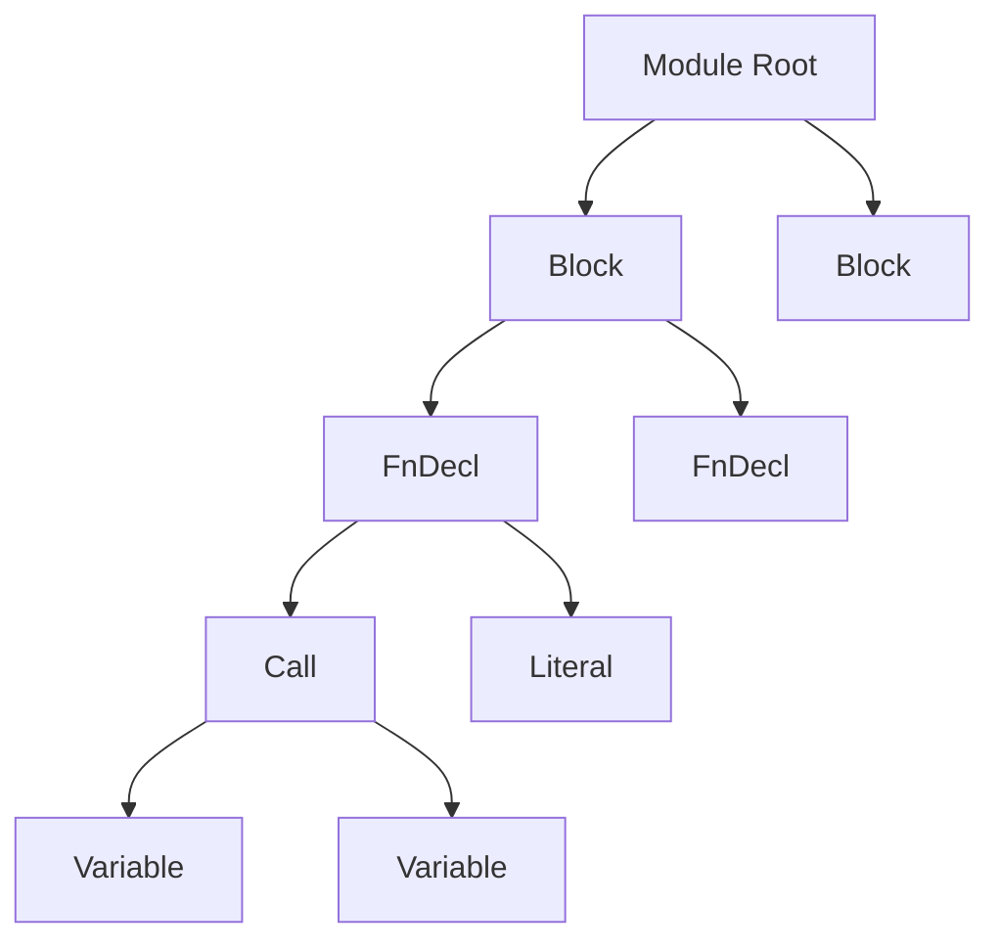
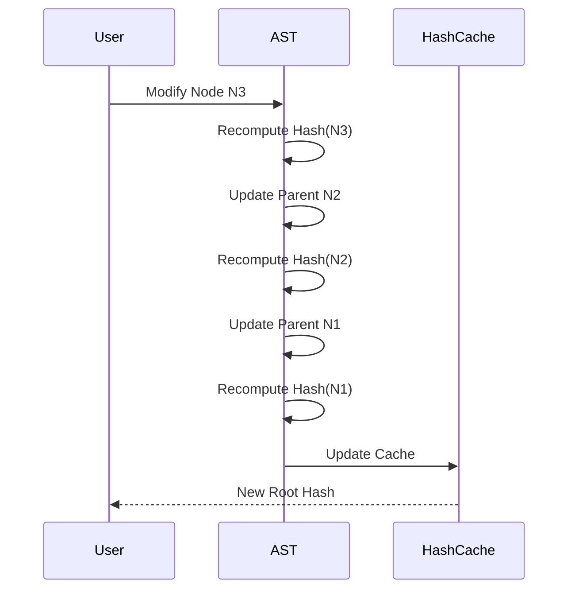
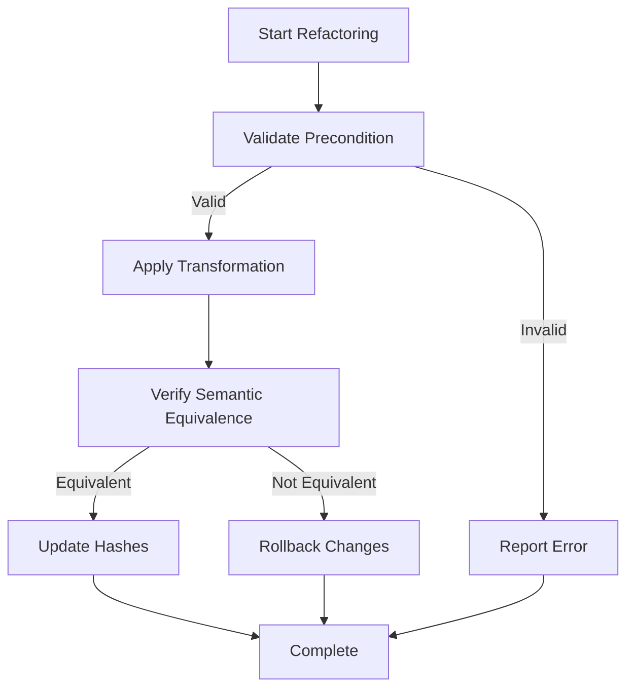

# AST Graph Theory Specification

- `File:* `language\ast_graph_spec.md`
- `Version:* 2.0.0
- `Context:* Layer 2 (Compiler)
- `Formalism:* Directed Acyclic Graph (DAG), Merkle Trees
- `Status:* Active
- Last Modified:* 2026-01-01
- `Author:* Kilo Code
- `Reviewers:* Pending

- -

## 1. Introduction

### 1.1 Purpose

This specification defines the formal mathematical structure of the Morph Abstract Syntax Tree (AST) as a Typed, Ordered, Rooted, Merkle Directed Acyclic Graph (DAG). This formalization provides the theoretical foundation for incremental compilation, content-addressable storage, and semantic analysis.

### 1.2 Scope

This specification covers:
- The mathematical definition of the AST graph structure
- Node taxonomy and type system
- Graph transformation operations for refactoring
- Merkle hash computation and propagation
- Invariants that must be maintained

This specification does not cover:
- Concrete implementation details of the AST data structures
- Parsing algorithms for source code
- Code generation from the AST

### 1.3 Definitions, Acronyms, and Abbreviations

| Term | Definition |
|-------|------------|
| **AST** | Abstract Syntax Tree - a tree representation of source code structure |
| **DAG** | Directed Acyclic Graph - a directed graph with no cycles |
| **Merkle Tree** | A hash tree where each node's hash depends on its children's hashes |
| **Content-Addressable** | Storage where data is retrieved by its cryptographic hash |
| **SHA256** | Secure Hash Algorithm 256-bit - cryptographic hash function |

### 1.4 References

- IEEE 1016: Recommended Practice for Software Design Descriptions
- Merkle, R. C. (1987). "A Digital Signature Based on a Conventional Encryption Function"
- Cormen, T. H., et al. (2009). "Introduction to Algorithms" (3rd ed.)

- -

## 2. Formal Definitions

### 2.1 Graph Definition

The Morph Abstract Syntax Tree is formally defined as a **Typed, Ordered, Rooted, Merkle DAG**.

Let $G_{AST} = (V, E, \mu, \tau, \omega)$ where:

- $V$ is the set of vertices (Nodes)
- $E \subset V \times V$ is the set of directed edges (Child relationships)
- $\mu: V \rightarrow \{0,1\}^{256}$ is the Content-Addressing Hash function
- $\tau: V \rightarrow T_{Node}$ is the Node Type mapping
- $\omega: E \rightarrow \mathbb{N}$ is the edge ordering (sibling order)

### 2.2 Invariants

#### 2.2.1 Acyclicity Invariant

$$ \nexists v \in V \text{ such that there is a path } v \to \dots \to v $$

- AST-INV-001:* THE system SHALL ensure the AST graph contains no cycles.

#### 2.2.2 Single Root Invariant

$$ \exists! r \in V \text{ (The Module Root) such that } \forall v \in V, \exists \text{ path } r \to \dots \to v $$

- AST-INV-002:* THE system SHALL maintain exactly one root node in the AST graph.

#### 2.2.3 Merkle Property Invariant

For any node $v$, its hash $\mu(v)$ is a function of its content and the hashes of its children:

$$ \mu(v) = \text{SHA256}(\text{Content}(v) \parallel \mu(c_1) \parallel \dots \parallel \mu(c_n)) $$

where $(v, c_i) \in E$ and ordered by $\omega$.

- AST-INV-003:* THE system SHALL compute node hashes as a function of content and ordered child hashes.

### 2.3 Node Taxonomy ($\tau$)

The set of Node Types $T_{Node}$ is partitioned into three classes:

#### 2.3.1 Structural Nodes (S)

Nodes that define hierarchy but have no execution semantics.

- `Module`, `Block`, `impl`, `trait`

#### 2.3.2 Nominal Nodes (N)

Nodes that introduce a symbol into the Semantic Tree.

- `FnDecl`, `TypeDecl`, `ActDecl`, `ConstDecl`

- `Property:* $\forall v \in N$, $\mu(v)$ must be unique within the parent Scope.

- AST-INV-004:* THE system SHALL ensure nominal nodes have unique hashes within their parent scope.

#### 2.3.3 Expression Nodes (X)

Nodes representing computation.

- `BinaryOp`, `Call`, `Literal`, `Match`, `Return`

- -

## 3. Requirements

### 3.1 Functional Requirements

- AST-REQ-001:* THE system SHALL maintain a single root node in the AST graph.

- `Priority:* Critical
- Verification Method:* Inspection
- `Rationale:* Ensures the AST is a well-formed tree structure
- `Dependencies:* None
- `Traceability:* Section 2.2.2 (Single Root Invariant)

- AST-REQ-002:* WHEN a node is modified, THE system SHALL recompute the hash of all ancestor nodes.

- `Priority:* Critical
- Verification Method:* Test
- `Rationale:* Ensures Merkle property is maintained after modifications
- `Dependencies:* AST-INV-003
- `Traceability:* Section 2.2.3 (Merkle Property Invariant)

- AST-REQ-003:* WHEN a node is deleted, THE system SHALL remove all edges referencing that node.

- `Priority:* High
- Verification Method:* Test
- `Rationale:* Prevents dangling references in the graph
- `Dependencies:* AST-REQ-001
- `Traceability:* Section 3.1 (Graph Transformations)

- AST-REQ-004:* THE system SHALL enforce the acyclicity invariant for all graph operations.

- `Priority:* Critical
- Verification Method:* Analysis
- `Rationale:* Prevents infinite loops and ensures well-formedness
- `Dependencies:* AST-INV-001
- `Traceability:* Section 2.2.1 (Acyclicity Invariant)

- AST-REQ-005:* THE system SHALL maintain edge ordering for all child relationships.

- `Priority:* High
- Verification Method:* Test
- `Rationale:* Ensures deterministic hash computation and code generation
- `Dependencies:* None
- `Traceability:* Section 2.1 (Graph Definition)

### 3.2 Non-Functional Requirements

- AST-NFR-001:* THE system SHALL compute node hashes in O(1) time complexity for cached nodes.

- `Priority:* High
- Verification Method:* Analysis
- `Metric:* Hash computation time < 1μs per node
- `Rationale:* Ensures efficient incremental compilation

- AST-NFR-002:* THE system SHALL support AST graphs with up to 1,000,000 nodes.

- `Priority:* Medium
- Verification Method:* Demonstration
- `Metric:* Memory usage < 1GB for 1M nodes
- `Rationale:* Supports large-scale projects

- AST-NFR-003:* THE system SHALL detect cycles in O(V + E) time complexity.

- `Priority:* High
- Verification Method:* Analysis
- `Metric:* Cycle detection < 100ms for 100K nodes
- `Rationale:* Ensures fast validation of graph operations

- -

## 4. Design

### 4.1 Architecture Overview

The AST graph is implemented as a content-addressable data structure where each node is uniquely identified by its cryptographic hash. This design enables:

- **Incremental Compilation:* Only modified subtrees need to be recompiled
- **Distributed Caching:* Nodes can be cached by hash across build systems
- **Deterministic Builds:* Hash-based identification ensures reproducibility

### 4.2 Data Structures

#### 4.2.1 Node Structure

- AST Node:* $N = (\tau, \mu, \chi)$

- `Components:*
- $\tau \in T_{Node}$: Node type
- $\mu \in \{0,1\}^{256}$: Content hash
- $\chi \in N^*$: Ordered sequence of children

- `Invariants:*
1. $\forall n \in N, \mu(n) = \text{SHA256}(\text{Content}(n) \parallel \mu(\chi_1) \parallel \dots \parallel \mu(\chi_k))$
2. $\forall n \in N, |\chi| < 1000$ (Maximum children limit)

### 4.3 Algorithms

#### 4.3.1 Hash Recomputation Algorithm

- Algorithm Name:* Recompute Ancestor Hashes

- `Input:* Modified node $v_{modified}$

- `Output:* Updated root hash $\mu(root')$

- Mathematical Definition:*
$$
\text{Recompute}(v) = \begin{cases}
\text{SHA256}(\text{Content}(v) \parallel \dots) & \text{if } v \text{ is modified} \\
\text{Recompute}(\text{parent}(v)) & \text{otherwise}
\end{cases}
$$

- `Pseudocode:*
```
function recompute_ancestor_hashes(modified_node):
    current = modified_node
    while current is not None:
        current.hash = compute_hash(current)
        current = current.parent
    return root.hash
```

- `Complexity:*
- Time: $O(h)$ where $h$ is tree height
- Space: $O(1)$

- `Correctness:*
- **Invariant:* All ancestor hashes reflect the modification
- **Termination:* Loop terminates when reaching root

### 4.4 Graph Transformations

#### 4.4.1 Refactoring Operations

An atomic refactoring is a function $\rho: G \rightarrow G'$.

##### 4.4.1.1 Isomorphism Preservation

A refactoring is **Semantically Neutral** if the Evaluation Function $\mathcal{E}$ remains invariant:

$$ \mathcal{E}(G) \equiv \mathcal{E}(\rho(G)) $$

- AST-REQ-006:* THE system SHALL verify semantic equivalence for all refactoring operations.

- `Priority:* High
- Verification Method:* Test
- `Rationale:* Ensures refactoring does not change program behavior
- `Dependencies:* None
- `Traceability:* Section 4.4.1 (Graph Transformations)

##### 4.4.1.2 Renaming Transformation

Let `Rename(target_hash, new_name)` be an operation.

Since Morph is Content-Addressable:

1. Identify node $v$ where $\mu(v) == \text{target\_hash}$
2. Create $v'$ with `Content(v')` updated to `new_name`
3. Propagate the hash change up the tree to the Root $r$, creating $r'$
4. **Crucially:* All edges $E$ pointing to $v$ (Usage) are updated to point to $v'$

- `Algorithm:*
```
function rename_node(target_hash, new_name):
    node = find_node_by_hash(target_hash)
    new_node = copy_node(node)
    new_node.name = new_name
    new_node.hash = compute_hash(new_node)
    update_all_references(node, new_node)
    recompute_ancestor_hashes(new_node)
    return new_node
```

### 4.5 Mermaid Diagrams

#### 4.5.1 AST Structure Diagram



#### 4.5.2 Hash Propagation Flow



#### 4.5.3 Refactoring Process



- -

## 5. Correctness Properties

### 5.1 Theorems

#### 5.1.1 Merkle Tree Correctness Theorem

- `Theorem:* For any two AST graphs $G_1$ and $G_2$, if $\mu(root_1) = \mu(root_2)$, then $G_1$ and $G_2$ are structurally identical.

- Proof Sketch:*
1. By definition of $\mu$, the root hash depends on all descendant hashes
2. If root hashes are equal, all descendant hashes must be equal
3. Equal hashes imply equal content (collision resistance of SHA256)
4. Therefore, all nodes have equal content and structure

- AST-THM-001:* THE system SHALL guarantee that equal root hashes imply identical AST structures.

- `Priority:* Critical
- Verification Method:* Analysis
- `Rationale:* Enables content-addressable caching and deduplication
- `Dependencies:* AST-INV-003
- `Traceability:* Section 2.2.3 (Merkle Property Invariant)

#### 5.1.2 Incremental Update Correctness Theorem

- `Theorem:* After modifying a node $v$ and recomputing ancestor hashes, the new root hash $\mu(root')$ correctly represents the modified AST.

- Proof Sketch:*
1. By induction on the path from $v$ to root
2. Base case: $\mu(v')$ correctly reflects the modification
3. Inductive step: If $\mu(parent')$ is correct, then $\mu(grandparent')$ is correct
4. Therefore, $\mu(root')$ is correct

### 5.2 Invariants

#### 5.2.1 Structural Invariants

- **AST-INV-005:* THE system SHALL maintain the tree property (single parent per node, except root)
- **AST-INV-006:* THE system SHALL maintain deterministic edge ordering
- **AST-INV-007:* THE system SHALL maintain type consistency across the graph

#### 5.2.2 Hash Invariants

- **AST-INV-008:* THE system SHALL ensure hash uniqueness for distinct node contents
- **AST-INV-009:* THE system SHALL ensure hash stability for unchanged nodes
- **AST-INV-010:* THE system SHALL ensure hash propagation completeness

- -

## 6. Examples

### 6.1 Simple AST Example

Consider the following Morph code:

```morph
fn add(a: i32, b: i32) -> i32 {
    ret a + b;
}
```

The corresponding AST structure:

```
Module (Root)
└── FnDecl (name: "add", hash: 0xabc...)
    ├── Param (name: "a", type: i32, hash: 0x123...)
    ├── Param (name: "b", type: i32, hash: 0x456...)
    └── Block
        └── Return
            └── BinaryOp (+)
                ├── Variable (name: "a")
                └── Variable (name: "b")
```

### 6.2 Hash Computation Example

For the `BinaryOp` node above:

$$
\mu(\text{BinaryOp}) = \text{SHA256}(
    \text{"BinaryOp"} \parallel
    \text{"+"} \parallel
    \mu(\text{Variable } a) \parallel
    \mu(\text{Variable } b)
)
$$

### 6.3 Refactoring Example

- `Operation:* Rename function `add` to `sum`

- `Before:*
```
FnDecl (name: "add", hash: 0xabc...)
```

- `After:*
```
FnDecl (name: "sum", hash: 0xdef...)
```

- Hash Propagation:*
1. Compute new hash for `FnDecl`: 0xdef...
2. Update parent `Block` hash: 0x789...
3. Update root `Module` hash: 0xghi...

### 6.4 Edge Cases

#### 6.4.1 Empty Module

```
Module (Root)
└── (no children)
```

- `Hash:* $\mu(\text{Module}) = \text{SHA256}(\text{"Module"} \parallel \emptyset)$

#### 6.4.2 Maximum Children

A node with 999 children (at the limit):

```
Block
├── Child 1
├── Child 2
├── ...
└── Child 999
```

- AST-INV-011:* THE system SHALL reject operations that would create a node with > 1000 children.

- `Priority:* High
- Verification Method:* Test
- `Rationale:* Prevents resource exhaustion
- `Dependencies:* None
- `Traceability:* Section 4.2.1 (Node Structure)

- -

## Change Log

| Version | Date       | Author      | Changes                                                                 |
|---------|------------|-------------|-------------------------------------------------------------------------|
| 2.0.0   | 2026-01-01 | Kilo Code    | Refactored to match specification convention v2.0.0, added EARS requirements, Mermaid diagrams, and examples |
| 1.0.0   | 2025-12-01 | Kilo Code    | Initial version                                                        |
