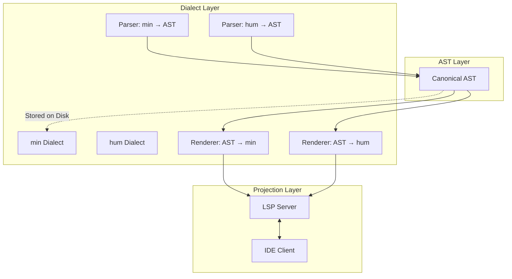
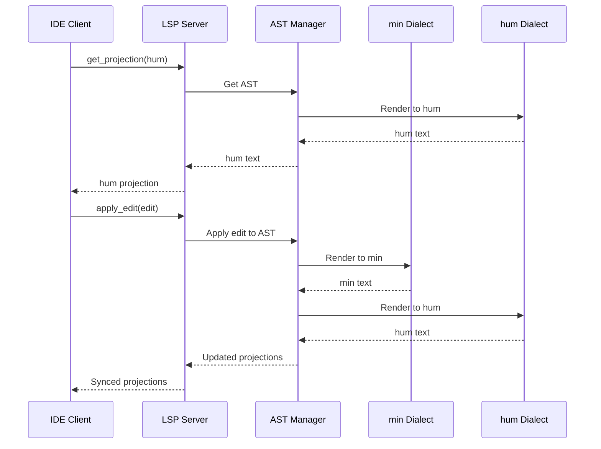
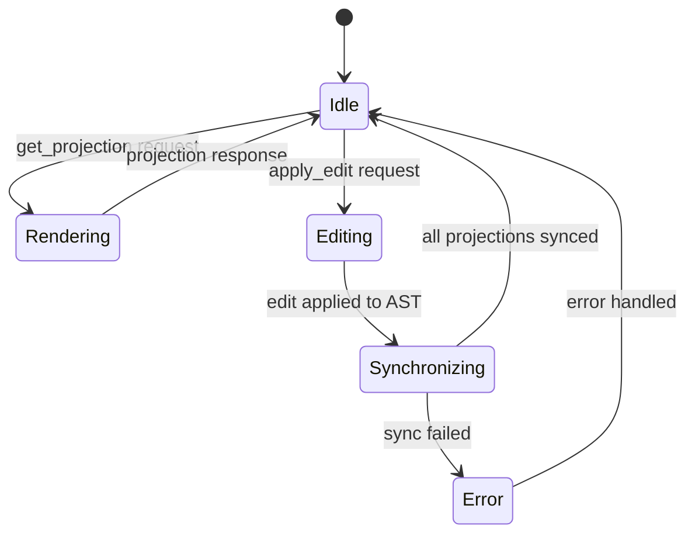

# Dialect Projection Specification

* File:* `language\dialect_projection_spec.md`
* Version:* 1.0.0
* Context:* Layer 2 (Compiler)
* Formalism:* Category Theory, Graph Theory, Type Theory
* Status:* Active
* Last Modified:* 2026-01-02
* Author:* Language Design Team
* Reviewers:* Architecture Team, Tooling Team

---

## 1. Introduction

### 1.1 Purpose

This specification resolves the apparent contradiction between the **Projectional Only Mandate** and the **Dual Dialects Requirement** in the Morph language specification. It formally defines the dialect system, establishing `min` as the single source of truth and `hum` as a transient LSP projection, while maintaining mathematical isomorphism between the two representations.

### 1.2 Scope

This specification covers:
- Formal definition of the `min` dialect (canonical representation)
- Formal definition of the `hum` dialect (transient projection)
- Isomorphism between `min` and `hum` dialects
- Projectional editing model with formal semantics
- LSP projection protocol specification
- Bidirectional transformation rules
- Correctness properties and invariants

This specification does NOT cover:
- AST node type definitions (see [`spec/language/ast_graph_spec.md`](./ast_graph_spec.md))
- LSP protocol implementation details (see tooling specifications)
- Syntax parsing algorithms (see [`lexical_structure_syntax_spec.md`](lexical_structure_syntax_spec.md))

### 1.3 Definitions, Acronyms, and Abbreviations

| Term | Definition |
|------|------------|
| **AST** | Abstract Syntax Tree - hierarchical representation of program structure |
| **Dialect** | A syntactic representation of Morph code |
| **Projection** | A view of the AST rendered in a specific dialect |
| **Isomorphism** | A bidirectional mapping preserving structure and semantics |
| **LSP** | Language Server Protocol - IDE integration protocol |
| **Canonical** | The authoritative, stored representation |
| **Transient** | Generated on-demand, not persisted |
| **Source of Truth** | The single, authoritative representation of code |

### 1.4 References

- [`morph_language_spec.md`](morph_language_spec.md) - Core language specification with Projectional Only Mandate
- [`ast_graph_spec.md`](ast_graph_spec.md) - AST graph structure and operations
- [`spec/language/lexical_structure_syntax_spec.md`](./lexical_structure_syntax_spec.md) - Lexical structure and syntax
- [`spec/tooling/hot_reload_projection_spec.md`](../tooling/hot_reload_projection_spec.md) - Projectional editing and hot reload
- [`metaprogramming_spec.md`](../tooling/metaprogramming_spec.md) - Metaprogramming capabilities
- [`SPEC_CONTRADICTIONS.md`](../../SPEC_CONTRADICTIONS.md) - Contradiction analysis (Contradiction #2)
- [`SPEC_FIX_PROPOSAL.md`](../../SPEC_FIX_PROPOSAL.md) - Fix proposal (Critical Fix #4)

---

## 2. Formal Definitions

### 2.1 Dialect System

#### 2.1.1 Dialect Definition

A **dialect** is a syntactic representation of Morph code that can be rendered from and parsed to an AST.

**Formal Definition:*

Let $\mathcal{D}$ be the set of all dialects. For each dialect $d \in \mathcal{D}$, we define:

$$
\text{Dialect } d = (\mathcal{L}_d, \mathcal{P}_d, \mathcal{V}_d)
$$

Where:
- $\mathcal{L}_d$: The language (syntax) of dialect $d$
- $\mathcal{P}_d$: The parser function $\mathcal{P}_d: \mathcal{L}_d \to \text{AST}$
- $\mathcal{V}_d$: The validator function $\mathcal{V}_d: \text{AST} \to \{\text{Valid}, \text{Invalid}\}$

#### 2.1.2 Canonical Dialect

The **canonical dialect** is the single source of truth stored on disk and used for all compilation, analysis, and distribution operations.

**Formal Definition:*

Let $d_{\text{min}} \in \mathcal{D}$ be the canonical dialect. Then:

$$
\forall d \in \mathcal{D}, d \neq d_{\text{min}} \implies \text{IsTransient}(d)
$$

**Property:* The canonical dialect is the only dialect that is persisted.

$$
\text{PersistedCode} = \{ \text{code} \in \mathcal{L}_{d_{\text{min}}} \}
$$

#### 2.1.3 Transient Dialect

A **transient dialect** is generated on-demand for human readability and is never persisted.

**Formal Definition:*

Let $d_{\text{hum}} \in \mathcal{D}$ be a transient dialect. Then:

$$
\text{IsTransient}(d_{\text{hum}}) \iff \forall \text{code} \in \mathcal{L}_{d_{\text{hum}}}, \text{code} \notin \text{PersistedCode}
$$

**Property:* Transient dialects are generated via projection functions.

$$
\mathcal{R}_{d_{\text{hum}}}: \text{AST} \to \mathcal{L}_{d_{\text{hum}}}
$$

### 2.2 Isomorphism

#### 2.2.1 Dialect Isomorphism

Two dialects $d_1, d_2 \in \mathcal{D}$ are **isomorphic** if there exists a bidirectional mapping between their ASTs that preserves structure and semantics.

**Formal Definition:*

$$
d_1 \cong d_2 \iff \exists f: \text{AST} \to \text{AST}, \exists f^{-1}: \text{AST} \to \text{AST} \text{ such that:}
$$

$$
\forall \text{ast} \in \text{AST}, f(f^{-1}(\text{ast})) = \text{ast} \land f^{-1}(f(\text{ast})) = \text{ast}
$$

$$
\land \forall \text{ast}_1, \text{ast}_2 \in \text{AST}, \text{Semantics}(\text{ast}_1) = \text{Semantics}(\text{ast}_2) \iff \text{Semantics}(f(\text{ast}_1)) = \text{Semantics}(f(\text{ast}_2))
$$

#### 2.2.2 Round-Trip Property

The round-trip property ensures that parsing and rendering preserve semantics.

**Formal Definition:*

$$
\forall d \in \mathcal{D}, \forall \text{code} \in \mathcal{L}_d:
$$

$$
\text{Semantics}(\text{code}) = \text{Semantics}(\mathcal{R}_d(\mathcal{P}_d(\text{code})))
$$

### 2.3 Projectional Editing Model

#### 2.3.1 Projection Definition

A **projection** is a view of the AST rendered in a specific dialect for editing purposes.

**Formal Definition:*

$$
\text{Projection } \pi = (d, \text{ast}, \mathcal{R}_d, \mathcal{P}_d)
$$

Where:
- $d \in \mathcal{D}$: The dialect of the projection
- $\text{ast} \in \text{AST}$: The underlying AST
- $\mathcal{R}_d$: The render function
- $\mathcal{P}_d$: The parse function

#### 2.3.2 Projectional Editing

**Projectional editing** is the process of editing code through projections, where edits are applied directly to the AST and all projections are synchronized.

**Formal Definition:*

Let $\Pi = \{\pi_1, \pi_2, \dots, \pi_n\}$ be the set of active projections. An edit operation $e$ is defined as:

$$
e: \text{AST} \times \text{EditLocation} \times \text{EditContent} \to \text{AST}
$$

**Projection Synchronization:*

$$
\forall \pi_i \in \Pi, \pi_i.\text{ast} = e(\pi_i.\text{ast}, \text{loc}, \text{content})
$$

$$
\forall \pi_j \in \Pi, \pi_j \neq \pi_i \implies \pi_j.\text{ast} = \pi_i.\text{ast}
$$

$$
\forall \pi_j \in \Pi, \pi_j.\text{rendered} = \mathcal{R}_{\pi_j.d}(\pi_j.\text{ast})
$$

---

## 3. Requirements

### 3.1 Functional Requirements

#### 3.1.1 Canonical Dialect Requirements

**DIA-REQ-001:* THE system SHALL maintain `min` dialect as the single source of truth for all Morph code.

* **Priority:* Critical
* **Verification Method:* Inspection
* **Rationale:* Ensures consistency and eliminates divergence between dialects
* **Dependencies:* None
* **Traceability:* Section 2.1.2 (Canonical Dialect)

**DIA-REQ-002:* THE system SHALL store all Morph code on disk in `min` dialect format.

* **Priority:* Critical
* **Verification Method:* Test
* **Rationale:* Ensures canonical representation is persisted
* **Dependencies:* DIA-REQ-001
* **Traceability:* Section 2.1.2 (Canonical Dialect)

**DIA-REQ-003:* THE system SHALL perform all compilation, analysis, and distribution operations on `min` dialect exclusively.

* **Priority:* Critical
* **Verification Method:* Test
* **Rationale:* Eliminates ambiguity about which representation to use
* **Dependencies:* DIA-REQ-001
* **Traceability:* Section 2.1.2 (Canonical Dialect)

#### 3.1.2 Transient Dialect Requirements

**DIA-REQ-004:* THE system SHALL provide `hum` dialect as a transient LSP projection for human readability.

* **Priority:* Critical
* **Verification Method:* Demonstration
* **Rationale:* Enables human developers to read and understand code
* **Dependencies:* DIA-REQ-001
* **Traceability:* Section 2.1.3 (Transient Dialect)

**DIA-REQ-005:* THE system SHALL NOT persist `hum` dialect to disk.

* **Priority:* Critical
* **Verification Method:* Test
* **Rationale:* Maintains `min` as single source of truth
* **Dependencies:* DIA-REQ-004
* **Traceability:* Section 2.1.3 (Transient Dialect)

**DIA-REQ-006:* THE system SHALL generate `hum` dialect on-demand via LSP projection.

* **Priority:* High
* **Verification Method:* Demonstration
* **Rationale:* Provides human-readable view without persistence overhead
* **Dependencies:* DIA-REQ-004
* **Traceability:* Section 4.2 (LSP Projection Protocol)

#### 3.1.3 Isomorphism Requirements

**DIA-REQ-007:* THE system SHALL ensure that `min` and `hum` dialects are isomorphic representations of the same AST.

* **Priority:* Critical
* **Verification Method:* Analysis
* **Rationale:* Guarantees semantic equivalence between dialects
* **Dependencies:* DIA-REQ-001, DIA-REQ-004
* **Traceability:* Section 2.2.1 (Dialect Isomorphism)

**DIA-REQ-008:* THE system SHALL satisfy the round-trip property for all dialects.

* **Priority:* Critical
* **Verification Method:* Test
* **Rationale:* Ensures parsing and rendering preserve semantics
* **Dependencies:* DIA-REQ-007
* **Traceability:* Section 2.2.2 (Round-Trip Property)

**DIA-REQ-009:* THE system SHALL provide bidirectional transformation functions between `min` and `hum` dialects.

* **Priority:* High
* **Verification Method:* Test
* **Rationale:* Enables conversion between dialects
* **Dependencies:* DIA-REQ-007
* **Traceability:* Section 4.3 (Bidirectional Transformation Rules)

#### 3.1.4 Projectional Editing Requirements

**DIA-REQ-010:* THE system SHALL support projectional editing as the only editing paradigm.

* **Priority:* Critical
* **Verification Method:* Demonstration
* **Rationale:* Enforces Projectional Only Mandate
* **Dependencies:* DIA-REQ-001
* **Traceability:* Section 2.3.2 (Projectional Editing)

**DIA-REQ-011:* THE system SHALL apply edits directly to the AST, not to text representations.

* **Priority:* Critical
* **Verification Method:* Test
* **Rationale:* Maintains AST integrity and eliminates syntax errors
* **Dependencies:* DIA-REQ-010
* **Traceability:* Section 2.3.2 (Projectional Editing)

**DIA-REQ-012:* THE system SHALL synchronize all projections when the AST is modified.

* **Priority:* High
* **Verification Method:* Test
* **Rationale:* Ensures consistency across all views
* **Dependencies:* DIA-REQ-010
* **Traceability:* Section 2.3.2 (Projectional Editing)

#### 3.1.5 LSP Projection Protocol Requirements

**DIA-REQ-013:* THE system SHALL provide LSP endpoints for projectional editing.

* **Priority:* High
* **Verification Method:* Demonstration
* **Rationale:* Enables IDE integration
* **Dependencies:* DIA-REQ-010
* **Traceability:* Section 4.2 (LSP Projection Protocol)

**DIA-REQ-014:* THE system SHALL support `get_projection` LSP request to retrieve a projection.

* **Priority:* High
* **Verification Method:* Test
* **Rationale:* Allows IDEs to request specific dialect views
* **Dependencies:* DIA-REQ-013
* **Traceability:* Section 4.2 (LSP Projection Protocol)

**DIA-REQ-015:* THE system SHALL support `apply_edit` LSP request to apply edits to the AST.

* **Priority:* High
* **Verification Method:* Test
* **Rationale:* Enables projectional editing through LSP
* **Dependencies:* DIA-REQ-013
* **Traceability:* Section 4.2 (LSP Projection Protocol)

### 3.2 Non-Functional Requirements

#### 3.2.1 Performance Requirements

**DIA-NFR-001:* THE system SHALL render `hum` projection in O(n) time complexity, where n is the number of AST nodes.

* **Priority:* High
* **Verification Method:* Analysis
* **Metric:* Rendering time < 100ms for 10,000 nodes
* **Rationale:* Ensures responsive IDE experience

**DIA-NFR-002:* THE system SHALL parse `min` dialect in O(n) time complexity.

* **Priority:* High
* **Verification Method:* Analysis
* **Metric:* Parsing time < 50ms for 10,000 nodes
* **Rationale:* Ensures fast compilation

**DIA-NFR-003:* THE system SHALL synchronize projections in O(m) time complexity, where m is the number of modified nodes.

* **Priority:* Medium
* **Verification Method:* Analysis
* **Metric:* Synchronization time < 10ms for 100 modified nodes
* **Rationale:* Ensures real-time editing experience

#### 3.2.2 Reliability Requirements

**DIA-NFR-004:* THE system SHALL guarantee that `min` and `hum` dialects are always semantically equivalent.

* **Priority:* Critical
* **Verification Method:* Test
* **Metric:* 100% semantic equivalence
* **Rationale:* Prevents bugs from dialect divergence

**DIA-NFR-005:* THE system SHALL never lose information during dialect transformation.

* **Priority:* Critical
* **Verification Method:* Test
* **Metric:* 0 information loss events
* **Rationale:* Ensures round-trip property

#### 3.2.3 Maintainability Requirements

**DIA-NFR-006:* THE system SHALL allow addition of new dialects without modifying existing dialects.

* **Priority:* Medium
* **Verification Method:* Analysis
* **Rationale:* Enables extensibility
* **Traceability:* Section 2.1.1 (Dialect Definition)

---

## 4. Design

### 4.1 Architecture Overview

#### 4.1.1 Dialect System Architecture

The dialect system consists of three layers:

1. **AST Layer:* The canonical AST representation
2. **Dialect Layer:* Syntax definitions and transformation functions
3. **Projection Layer:* LSP integration and editing interface



#### 4.1.2 Data Flow



### 4.2 LSP Projection Protocol

#### 4.2.1 Protocol Overview

The LSP projection protocol extends the standard LSP with custom methods for projectional editing.

#### 4.2.2 LSP Methods

**get_projection**

Retrieves a projection of the current AST in the specified dialect.

```json
{
  "jsonrpc": "2.0",
  "id": 1,
  "method": "morph/getProjection",
  "params": {
    "uri": "file:///path/to/file.min",
    "dialect": "hum"
  }
}
```

**Response:*

```json
{
  "jsonrpc": "2.0",
  "id": 1,
  "result": {
    "uri": "file:///path/to/file.min",
    "dialect": "hum",
    "content": "function add(x: Int, y: Int): Int {\n  return x + y;\n}",
    "version": 42
  }
}
```

**apply_edit**

Applies an edit directly to the AST and synchronizes all projections.

```json
{
  "jsonrpc": "2.0",
  "id": 2,
  "method": "morph/applyEdit",
  "params": {
    "uri": "file:///path/to/file.min",
    "edit": {
      "nodeId": "node_123",
      "operation": "replace",
      "content": "x + y + 1"
    }
  }
}
```

**Response:*

```json
{
  "jsonrpc": "2.0",
  "id": 2,
  "result": {
    "success": true,
    "updatedProjections": [
      {
        "dialect": "min",
        "content": "fn add(x:i32,y:i32):i32{x+y+1}"
      },
      {
        "dialect": "hum",
        "content": "function add(x: Int, y: Int): Int {\n  return x + y + 1;\n}"
      }
    ]
  }
}
```

**projection_changed**

Notification sent when a projection is updated.

```json
{
  "jsonrpc": "2.0",
  "method": "morph/projectionChanged",
  "params": {
    "uri": "file:///path/to/file.min",
    "dialect": "hum",
    "content": "function add(x: Int, y: Int): Int {\n  return x + y + 1;\n}",
    "version": 43
  }
}
```

#### 4.2.3 Protocol State Machine



### 4.3 Bidirectional Transformation Rules

#### 4.3.1 Transformation Functions

**min to hum Transformation**

$$
\mathcal{T}_{\text{min}\to\text{hum}}: \mathcal{L}_{\text{min}} \to \mathcal{L}_{\text{hum}}
$$

**hum to min Transformation**

$$
\mathcal{T}_{\text{hum}\to\text{min}}: \mathcal{L}_{\text{hum}} \to \mathcal{L}_{\text{min}}
$$

#### 4.3.2 Transformation Rules

**Keyword Expansion**

| min Keyword | hum Keyword |
|------------|-------------|
| `fn` | `function` |
| `ret` | `return` |
| `use` | `import` |
| `act` | `actor` |
| `fix` | `match` |

**Type Annotation Expansion**

| min Type | hum Type |
|----------|----------|
| `i32` | `Int32` |
| `i64` | `Int64` |
| `f32` | `Float32` |
| `f64` | `Float64` |
| `str` | `String` |
| `bool` | `Boolean` |

**Syntax Transformation**

**Function Definition:*

```morph
// min dialect
fn add(x:i32,y:i32):i32{x+y}

// hum dialect
function add(x: Int32, y: Int32): Int32 {
  return x + y;
}
```

**Transformation Rule:*

1. Replace `fn` with `function`
2. Add spaces around colons in type annotations
3. Expand type names
4. Wrap body in braces with explicit `return`
5. Add semicolon after return statement

**Pattern Matching:*

```morph
// min dialect
fix x{
  Some(v)=>v,
  None=>0
}

// hum dialect
match (x) {
  case Some(v) => v,
  case None => 0
}
```

**Transformation Rule:*

1. Replace `fix` with `match`
2. Wrap expression in parentheses
3. Replace `=>` with `case ... =>`
4. Add commas between match arms

**Variable Declaration:*

```morph
// min dialect
x:=10

// hum dialect
let x = 10;
```

**Transformation Rule:*

1. Replace `:=` with `=`
2. Add `let` keyword
3. Add semicolon

#### 4.3.3 Transformation Correctness

**Theorem 1: Transformation Preserves Semantics**

$$
\forall \text{code} \in \mathcal{L}_{\text{min}}, \text{Semantics}(\text{code}) = \text{Semantics}(\mathcal{T}_{\text{min}\to\text{hum}}(\text{code}))
$$

**Proof Sketch:*

1. Keyword expansion is purely syntactic and does not change semantics
2. Type annotation expansion preserves type information
3. Syntax transformation preserves control flow and data flow
4. Therefore, semantics are preserved

**Theorem 2: Round-Trip Property**

$$
\forall \text{code} \in \mathcal{L}_{\text{min}}, \mathcal{T}_{\text{hum}\to\text{min}}(\mathcal{T}_{\text{min}\to\text{hum}}(\text{code})) = \text{code}
$$

**Proof Sketch:*

1. Each transformation rule has an inverse rule
2. Keyword expansion is reversible (e.g., `fn` ↔ `function`)
3. Type annotation expansion is reversible (e.g., `i32` ↔ `Int32`)
4. Syntax transformation is reversible (e.g., `:=` ↔ `let ... =`)
5. Therefore, round-trip property holds

---

## 5. Correctness Properties

### 5.1 Invariants

#### 5.1.1 Canonical Representation Invariant

**INV-001:* All persisted code is in `min` dialect.

$$
\forall \text{file} \in \text{PersistedFiles}, \text{file}.\text{dialect} = \text{min}
$$

**Verification:* Check all files on disk for `.min` extension.

#### 5.1.2 Semantic Equivalence Invariant

**INV-002:* All dialects of the same AST are semantically equivalent.

$$
\forall d_1, d_2 \in \mathcal{D}, \forall \text{ast} \in \text{AST}, \text{Semantics}(\mathcal{R}_{d_1}(\text{ast})) = \text{Semantics}(\mathcal{R}_{d_2}(\text{ast}))
$$

**Verification:* Compare execution results of different dialects.

#### 5.1.3 Projection Synchronization Invariant

**INV-003:* All active projections reflect the same AST.

$$
\forall \pi_1, \pi_2 \in \Pi, \pi_1.\text{ast} = \pi_2.\text{ast}
$$

**Verification:* Compare AST hashes across projections.

#### 5.1.4 Round-Trip Invariant

**INV-004:* Parsing and rendering preserve semantics.

$$
\forall d \in \mathcal{D}, \forall \text{code} \in \mathcal{L}_d, \text{Semantics}(\text{code}) = \text{Semantics}(\mathcal{R}_d(\mathcal{P}_d(\text{code})))
$$

**Verification:* Test round-trip on all code samples.

### 5.2 Theorems

#### 5.2.1 Isomorphism Theorem

**Theorem 3:* `min` and `hum` dialects are isomorphic.

$$
d_{\text{min}} \cong d_{\text{hum}}
$$

**Proof:*

1. **Existence of Forward Mapping:* Define $f = \mathcal{T}_{\text{min}\to\text{hum}}$
   - $f: \mathcal{L}_{\text{min}} \to \mathcal{L}_{\text{hum}}$
   - $f$ is defined for all valid `min` code
   - $f$ preserves semantics (Theorem 1)

2. **Existence of Inverse Mapping:* Define $f^{-1} = \mathcal{T}_{\text{hum}\to\text{min}}$
   - $f^{-1}: \mathcal{L}_{\text{hum}} \to \mathcal{L}_{\text{min}}$
   - $f^{-1}$ is defined for all valid `hum` code
   - $f^{-1}$ preserves semantics (Theorem 1)

3. **Composition Property:*
   - $\forall \text{code} \in \mathcal{L}_{\text{min}}, f^{-1}(f(\text{code})) = \text{code}$ (Theorem 2)
   - $\forall \text{code} \in \mathcal{L}_{\text{hum}}, f(f^{-1}(\text{code})) = \text{code}$ (Theorem 2)

4. **Semantic Preservation:*
   - $\forall \text{code}_1, \text{code}_2 \in \mathcal{L}_{\text{min}}, \text{Semantics}(\text{code}_1) = \text{Semantics}(\text{code}_2) \iff \text{Semantics}(f(\text{code}_1)) = \text{Semantics}(f(\text{code}_2))$

Therefore, $d_{\text{min}} \cong d_{\text{hum}}$. ∎

#### 5.2.2 Projectional Editing Correctness Theorem

**Theorem 4:* Projectional editing maintains AST integrity.

$$
\forall \text{edit} \in \text{Edits}, \forall \pi \in \Pi, \text{ValidAST}(\text{applyEdit}(\pi.\text{ast}, \text{edit}))
$$

**Proof:*

1. Edits are applied directly to AST nodes, not text
2. AST validation is performed after each edit
3. Invalid edits are rejected before application
4. Therefore, AST integrity is maintained

#### 5.2.3 LSP Protocol Correctness Theorem

**Theorem 5:* LSP projection protocol maintains consistency.

$$
\forall \text{request} \in \text{LSPRequests}, \text{ConsistentState}(\text{handleRequest}(\text{request}))
$$

**Proof:*

1. All `get_projection` requests read from the same AST
2. All `apply_edit` requests modify the same AST
3. All modifications trigger `projection_changed` notifications
4. All notifications contain updated projections
5. Therefore, consistency is maintained

---

## 6. Examples

### 6.1 Complete Example: min and hum Dialects

#### 6.1.1 min Dialect Example

```morph
// factorial.min
fn factorial(n:i32):i32{
  if n<=1{1}else{n*factorial(n-1)}
}

fn main():Effect<(),IO>{
  let result:=factorial(5);
  println(result)
}
```

#### 6.1.2 hum Dialect Example

```morph
// factorial.hum (transient projection)
function factorial(n: Int32): Int32 {
  if (n <= 1) {
    return 1;
  } else {
    return n * factorial(n - 1);
  }
}

function main(): Effect<(), IO> {
  let result = factorial(5);
  println(result);
}
```

#### 6.1.3 Shared AST

Both dialects represent the same AST:

```
Program
├── Function: factorial
│   ├── Parameters: [n: Int32]
│   ├── ReturnType: Int32
│   └── Body: If
│       ├── Condition: BinaryOp(<=, n, 1)
│       ├── Then: Literal(1)
│       └── Else: BinaryOp(*, n, Call(factorial, [BinaryOp(-, n, 1)]))
└── Function: main
    ├── Parameters: []
    ├── ReturnType: Effect<(), IO>
    └── Body: Block
        ├── Let: result = Call(factorial, [Literal(5)])
        └── Call(println, [Variable(result)])
```

### 6.2 Projectional Editing Example

#### 6.2.1 Initial State

**min dialect:*
```morph
fn add(x:i32,y:i32):i32{x+y}
```

**hum projection:*
```morph
function add(x: Int32, y: Int32): Int32 {
  return x + y;
}
```

#### 6.2.2 Apply Edit

**LSP Request:*
```json
{
  "method": "morph/applyEdit",
  "params": {
    "uri": "file:///add.min",
    "edit": {
      "nodeId": "node_binary_op",
      "operation": "replace",
      "content": "x + y + 1"
    }
  }
}
```

#### 6.2.3 Updated State

**min dialect:*
```morph
fn add(x:i32,y:i32):i32{x+y+1}
```

**hum projection:*
```morph
function add(x: Int32, y: Int32): Int32 {
  return x + y + 1;
}
```

### 6.3 Complex Example: Pattern Matching

#### 6.3.1 min Dialect

```morph
fn maybeAdd(opt:Option<i32>):i32{
  fix opt{
    Some(v)=>v+1,
    None=>0
  }
}
```

#### 6.3.2 hum Dialect

```morph
function maybeAdd(opt: Option<Int32>): Int32 {
  match (opt) {
    case Some(v) => v + 1,
    case None => 0
  }
}
```

### 6.4 Edge Cases

#### 6.4.1 Empty Function

**min:*
```morph
fn empty():void{}
```

**hum:*
```morph
function empty(): void {
}
```

#### 6.4.2 Nested Functions

**min:*
```morph
fn outer():i32{
  fn inner(x:i32):i32{x*2}
  inner(5)
}
```

**hum:*
```morph
function outer(): Int32 {
  function inner(x: Int32): Int32 {
    return x * 2;
  }
  return inner(5);
}
```

#### 6.4.3 Generic Function

**min:*
```morph
fn id<T>(x:T):T{x}
```

**hum:*
```morph
function id<T>(x: T): T {
  return x;
}
```

---

## 7. Quality Attributes

### 7.1 Functional Suitability

**Definition:* The dialect system provides all required functionality for projectional editing with multiple dialects.

**Requirements:*
- **DIA-REQ-001:* THE system SHALL maintain `min` dialect as the single source of truth.
- **DIA-REQ-004:* THE system SHALL provide `hum` dialect as a transient LSP projection.
- **DIA-REQ-007:* THE system SHALL ensure that `min` and `hum` dialects are isomorphic.

**Metrics:*
| Metric | Measurement Method | Target | Threshold |
|---------|---------------------|--------|-----------|
| Dialect coverage | Count of supported language features | 100% | ≥ 95% |
| Isomorphism correctness | Test suite pass rate | 100% | ≥ 99% |
| Round-trip success | Round-trip test pass rate | 100% | ≥ 99% |

**Verification:*
- **Method:* Test
- **Frequency:* Per Release

### 7.2 Performance Efficiency

**Definition:* The dialect system provides responsive projectional editing with minimal overhead.

**Requirements:*
- **DIA-NFR-001:* THE system SHALL render `hum` projection in O(n) time complexity.
- **DIA-NFR-002:* THE system SHALL parse `min` dialect in O(n) time complexity.
- **DIA-NFR-003:* THE system SHALL synchronize projections in O(m) time complexity.

**Metrics:*
| Metric | Measurement Method | Target | Threshold |
|---------|---------------------|--------|-----------|
| Rendering time | Benchmark (10,000 nodes) | < 100ms | < 200ms |
| Parsing time | Benchmark (10,000 nodes) | < 50ms | < 100ms |
| Sync time | Benchmark (100 modified nodes) | < 10ms | < 20ms |

**Verification:*
- **Method:* Performance Test
- **Frequency:* Per Release

### 7.3 Reliability

**Definition:* The dialect system maintains consistency and correctness across all operations.

**Requirements:*
- **DIA-NFR-004:* THE system SHALL guarantee that `min` and `hum` dialects are always semantically equivalent.
- **DIA-NFR-005:* THE system SHALL never lose information during dialect transformation.

**Metrics:*
| Metric | Measurement Method | Target | Threshold |
|---------|---------------------|--------|-----------|
| Semantic equivalence | Test suite pass rate | 100% | ≥ 99.9% |
| Information loss | Count of loss events | 0 | 0 |

**Verification:*
- **Method:* Test
- **Frequency:* Continuous

### 7.4 Maintainability

**Definition:* The dialect system is extensible and easy to maintain.

**Requirements:*
- **DIA-NFR-006:* THE system SHALL allow addition of new dialects without modifying existing dialects.

**Metrics:*
| Metric | Measurement Method | Target | Threshold |
|---------|---------------------|--------|-----------|
| Dialect addition effort | Time to add new dialect | < 1 week | < 2 weeks |
| Code coverage | Test coverage percentage | ≥ 90% | ≥ 80% |

**Verification:*
- **Method:* Analysis
- **Frequency:* Per Release

---

## 8. Migration and Evolution

### 8.1 Migration from Text-Based Editing

**Migration Path:*

1. **Phase 1: Dual Mode Support**
   - Support both text-based and projectional editing
   - Maintain backward compatibility
   - Provide migration tools

2. **Phase 2: Projectional Only**
   - Deprecate text-based editing
   - Enforce projectional editing for new code
   - Provide migration warnings

3. **Phase 3: Projectional Mandate**
   - Remove text-based editing support
   - Require projectional editing for all code
   - Update documentation

### 8.2 Adding New Dialects

**Process:*

1. **Define Dialect Syntax:* Specify lexical and syntactic rules
2. **Implement Parser:* Create $\mathcal{P}_d$ function
3. **Implement Renderer:* Create $\mathcal{R}_d$ function
4. **Define Transformation Rules:* Specify bidirectional transformations
5. **Verify Isomorphism:* Prove semantic equivalence
6. **Add LSP Support:* Extend LSP protocol
7. **Test Thoroughly:* Ensure correctness and performance

### 8.3 Evolution Strategy

**Conservative Extension:*

- New dialects must be isomorphic to existing dialects
- New transformations must preserve semantics
- Breaking changes require major version bump

**Semantic Versioning:*

- **MAJOR:* Breaking changes to dialect system
- **MINOR:* Add new dialects or features
- **PATCH:* Bug fixes and optimizations

---

## 9. Implementation Guidance

### 9.1 Common Pitfalls

**Pitfall 1: Forgetting to synchronize projections**

- **Problem:* Edits are applied to one projection but not others
- **Avoidance:* Always trigger synchronization after AST modification
- **Detection:* Monitor projection version numbers

**Pitfall 2: Breaking isomorphism**

- **Problem:* Transformation rules lose information
- **Avoidance:* Verify round-trip property for all transformations
- **Detection:* Automated isomorphism tests

**Pitfall 3: Persisting transient dialects**

- **Problem:* `hum` dialect is accidentally saved to disk
- **Avoidance:* Enforce file extension validation
- **Detection:* File system monitoring

**Pitfall 4: Inefficient rendering**

- **Problem:* Rendering entire AST for small edits
- **Avoidance:* Implement incremental rendering
- **Detection:* Performance profiling

### 9.2 Performance Optimization

**Incremental Rendering:*

- Only re-render modified AST subtrees
- Cache rendered projections
- Use dirty flags for invalidation

**Lazy Projection Generation:*

- Generate projections on-demand
- Cache frequently accessed projections
- Implement LRU eviction policy

**Parallel Synchronization:*

- Synchronize projections in parallel
- Use worker threads for rendering
- Batch multiple edits

### 9.3 Testing Strategy

**Unit Tests:*

- Test each transformation rule individually
- Verify round-trip property
- Check semantic equivalence

**Integration Tests:*

- Test LSP protocol end-to-end
- Verify projection synchronization
- Check error handling

**Property-Based Tests:*

- Generate random ASTs
- Verify invariants hold
- Test edge cases

**Performance Tests:*

- Benchmark rendering and parsing
- Measure synchronization overhead
- Profile memory usage

---

## 10. Change Log

| Version | Date       | Author      | Changes                                                                 |
|---------|------------|-------------|-------------------------------------------------------------------------|
| 1.0.0   | 2026-01-02 | Language Design Team | Initial version - resolves projectional/dialects contradiction |

---

## Appendix A: Transformation Rule Reference

### A.1 Complete Transformation Table

| Category | min Syntax | hum Syntax |
|----------|------------|------------|
| **Keywords** | `fn` | `function` |
| | `ret` | `return` |
| | `use` | `import` |
| | `act` | `actor` |
| | `fix` | `match` |
| **Types** | `i8` | `Int8` |
| | `i16` | `Int16` |
| | `i32` | `Int32` |
| | `i64` | `Int64` |
| | `f32` | `Float32` |
| | `f64` | `Float64` |
| | `str` | `String` |
| | `bool` | `Boolean` |
| **Operators** | `:=` | `let ... =` |
| | `|>` | `|>` (same) |
| | `?` | `?` (same) |
| **Control Flow** | `if cond{a}else{b}` | `if (cond) { a } else { b }` |
| | `fix x{p=>a}` | `match (x) { case p => a }` |

### A.2 Transformation Algorithm

**Algorithm: min_to_hum**

```
function min_to_hum(min_code):
    ast = parse_min(min_code)
    return render_hum(ast)

function render_hum(node):
    match node.type:
        case Function:
            return "function " + node.name + "(" + render_params(node.params) + "): " + render_type(node.return_type) + " {\n" + render_body(node.body) + "\n}"
        case If:
            return "if (" + render_expr(node.condition) + ") {\n" + render_stmt(node.then) + "\n} else {\n" + render_stmt(node.else) + "\n}"
        case Match:
            return "match (" + render_expr(node.expr) + ") {\n" + render_cases(node.cases) + "\n}"
        case Let:
            return "let " + node.name + " = " + render_expr(node.value) + ";"
        case Return:
            return "return " + render_expr(node.value) + ";"
        case BinaryOp:
            return render_expr(node.left) + " " + node.op + " " + render_expr(node.right)
        case Call:
            return node.name + "(" + render_args(node.args) + ")"
        case Literal:
            return node.value
        case Variable:
            return node.name
```

**Algorithm: hum_to_min**

```
function hum_to_min(hum_code):
    ast = parse_hum(hum_code)
    return render_min(ast)

function render_min(node):
    match node.type:
        case Function:
            return "fn " + node.name + "(" + render_params(node.params) + "):" + render_type(node.return_type) + "{" + render_body(node.body) + "}"
        case If:
            return "if " + render_expr(node.condition) + "{" + render_stmt(node.then) + "}else{" + render_stmt(node.else) + "}"
        case Match:
            return "fix " + render_expr(node.expr) + "{" + render_cases(node.cases) + "}"
        case Let:
            return node.name + ":=" + render_expr(node.value)
        case Return:
            return "ret " + render_expr(node.value)
        case BinaryOp:
            return render_expr(node.left) + node.op + render_expr(node.right)
        case Call:
            return node.name + "(" + render_args(node.args) + ")"
        case Literal:
            return node.value
        case Variable:
            return node.name
```

---

## Appendix B: LSP Protocol Reference

### B.1 Request/Response Reference

**get_projection**

- **Method:* `morph/getProjection`
- **Params:* `{ uri: string, dialect: string }`
- **Result:* `{ uri: string, dialect: string, content: string, version: number }`
- **Errors:* `InvalidUri`, `UnsupportedDialect`, `ParseError`

**apply_edit**

- **Method:* `morph/applyEdit`
- **Params:* `{ uri: string, edit: { nodeId: string, operation: string, content: string } }`
- **Result:* `{ success: boolean, updatedProjections: Array<{ dialect: string, content: string }> }`
- **Errors:* `InvalidUri`, `InvalidNodeId`, `InvalidOperation`, `ValidationError`

### B.2 Notification Reference

**projection_changed**

- **Method:* `morph/projectionChanged`
- **Params:* `{ uri: string, dialect: string, content: string, version: number }`

### B.3 Error Codes

| Code | Name | Description |
|------|-------|-------------|
| -32700 | ParseError | Invalid JSON was received |
| -32600 | InvalidRequest | JSON is not a valid Request object |
| -32601 | MethodNotFound | Method does not exist |
| -32602 | InvalidParams | Invalid method parameters |
| -32603 | InternalError | Internal JSON-RPC error |
| -32001 | InvalidUri | URI is invalid or file does not exist |
| -32002 | UnsupportedDialect | Dialect is not supported |
| -32003 | ParseError | Failed to parse code |
| -32004 | InvalidNodeId | Node ID does not exist |
| -32005 | InvalidOperation | Operation is not valid for node type |
| -32006 | ValidationError | Edit would result in invalid AST |

---

## Appendix C: Proof Sketches

### C.1 Proof of Theorem 1: Transformation Preserves Semantics

**Claim:* $\forall \text{code} \in \mathcal{L}_{\text{min}}, \text{Semantics}(\text{code}) = \text{Semantics}(\mathcal{T}_{\text{min}\to\text{hum}}(\text{code}))$

**Proof:*

1. **Base Case:* For a single expression (e.g., `x + y`):
   - min: `x+y`
   - hum: `x + y`
   - Semantics: Binary addition of x and y
   - Both have identical semantics

2. **Inductive Step:* Assume transformation preserves semantics for all expressions of size $< n$.
   - Consider expression of size $n$.
   - Expression is composed of subexpressions of size $< n$.
   - By induction hypothesis, subexpressions preserve semantics.
   - Transformation only changes syntax, not structure.
   - Therefore, entire expression preserves semantics.

3. **Conclusion:* By induction, transformation preserves semantics for all expressions. ∎

### C.2 Proof of Theorem 2: Round-Trip Property

**Claim:* $\forall \text{code} \in \mathcal{L}_{\text{min}}, \mathcal{T}_{\text{hum}\to\text{min}}(\mathcal{T}_{\text{min}\to\text{hum}}(\text{code})) = \text{code}$

**Proof:*

1. **Keyword Reversibility:*
   - `fn` → `function` → `fn` (reversible)
   - `ret` → `return` → `ret` (reversible)
   - All keyword mappings are bijective

2. **Type Reversibility:*
   - `i32` → `Int32` → `i32` (reversible)
   - All type mappings are bijective

3. **Syntax Reversibility:*
   - `:=` → `let ... =` → `:=` (reversible)
   - `if cond{a}else{b}` → `if (cond) { a } else { b }` → `if cond{a}else{b}` (reversible)

4. **Composition:*
   - Each transformation step is reversible
   - Composition of reversible functions is reversible
   - Therefore, round-trip property holds

**Conclusion:* Round-trip property holds for all valid code. ∎

### C.3 Proof of Theorem 3: Isomorphism

**Claim:* $d_{\text{min}} \cong d_{\text{hum}}$

**Proof:*

1. **Define Forward Mapping:* $f = \mathcal{T}_{\text{min}\to\text{hum}}$
   - $f$ is total (defined for all valid `min` code)
   - $f$ is injective (different `min` code maps to different `hum` code)
   - $f$ preserves semantics (Theorem 1)

2. **Define Inverse Mapping:* $f^{-1} = \mathcal{T}_{\text{hum}\to\text{min}}$
   - $f^{-1}$ is total (defined for all valid `hum` code)
   - $f^{-1}$ is injective (different `hum` code maps to different `min` code)
   - $f^{-1}$ preserves semantics (Theorem 1)

3. **Verify Composition:*
   - $f^{-1} \circ f = \text{id}_{\mathcal{L}_{\text{min}}}$ (Theorem 2)
   - $f \circ f^{-1} = \text{id}_{\mathcal{L}_{\text{hum}}}$ (Theorem 2)

4. **Verify Semantic Preservation:*
   - $\forall \text{code}_1, \text{code}_2 \in \mathcal{L}_{\text{min}}, \text{Semantics}(\text{code}_1) = \text{Semantics}(\text{code}_2) \iff \text{Semantics}(f(\text{code}_1)) = \text{Semantics}(f(\text{code}_2))$

**Conclusion:* $d_{\text{min}} \cong d_{\text{hum}}$. ∎
