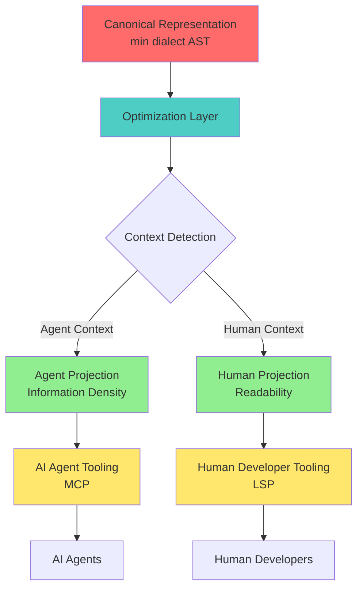

# Dual Optimization Specification

* File:* `language\dual_optimization_spec.md`
* Version:* 1.0.0
* Context:* Layer 2 (Compiler) - Language Design Philosophy
* Formalism:* Category Theory, Optimization Theory
* Status:* Active
* Last Modified:* 2026-01-02
* Author:* Kilo Code
* Reviewers:* Pending

---

## 1. Introduction

### 1.1 Purpose

This specification resolves the apparent contradiction between **Agent-First** and **Human-First** design philosophies in the Morph language. It establishes a **Dual Optimization** framework where both AI agents and human developers are optimized for their respective use cases without conflict.

### 1.2 Scope

This specification covers:
- Agent-First optimization as a tooling and automation target
- Human-First usability as a developer experience target
- Coexistence of both optimizations without conflict
- Transparent optimization layers
- Tooling for AI agents (MCP, automated refactoring)
- Tooling for human developers (LSP, projectional editing)
- Examples demonstrating dual optimization

This specification does not cover:
- Implementation details of specific tools
- Performance benchmarks
- User interface design

### 1.3 Definitions, Acronyms, and Abbreviations

| Term | Definition |
|-------|------------|
| **Agent-First** | Optimization target for AI agents, prioritizing information density, parsing efficiency, and transformation friendliness |
| **Human-First** | Usability target for human developers, prioritizing readability, cognitive load reduction, and familiarity |
| **Dual Optimization** | Framework where both Agent-First and Human-First optimizations coexist without conflict |
| **Optimization Layer** | Transparent abstraction that applies optimizations appropriate to the context (agent or human) |
| **Projection** | Transient, generated view of the canonical AST representation |
| **Canonical Representation** | The single source of truth (`min` dialect) stored and processed by the system |

### 1.4 References

- [`spec/language/morph_language_spec.md`](morph_language_spec.md) - Morph language specification with Projectional Only Mandate
- [`spec/tooling/agent_planning_mdp_spec.md`](../tooling/agent_planning_mdp_spec.md) - Agent planning using Markov Decision Processes
- [`spec/language/dialect_projection_spec.md`](dialect_projection_spec.md) - Dialect and projection specification
- IEEE 830: Recommended Practice for Software Requirements Specifications
- ISO/IEC 25010: Systems and software Quality Requirements and Evaluation (SQuaRE)

---

## 2. Formal Definitions

### 2.1 Dual Optimization Framework

We define the Dual Optimization framework as a tuple $(\mathcal{A}, \mathcal{H}, \mathcal{O}, \mathcal{T})$ where:

- $\mathcal{A}$: Agent-First optimization space
- $\mathcal{H}$: Human-First optimization space
- $\mathcal{O}$: Optimization layer function
- $\mathcal{T}$: Tooling interface

* DUAL-OPT-INV-001:* THE system SHALL define dual optimization framework with separate optimization spaces for agents and humans.

* DUAL-OPT-REQ-001:* THE system SHALL maintain separate optimization targets for AI agents and human developers.

* Priority:* Critical
* Verification Method:* Analysis
* Rationale:* Enables optimization for both use cases without conflict
* Dependencies:* DUAL-OPT-INV-001
* Traceability:* Section 2.1 (Dual Optimization Framework)

#### 2.1.1 Agent-First Optimization Space ($\mathcal{A}$)

The Agent-First optimization space is defined as:

$$
\mathcal{A} = \{ \text{Information Density}, \text{Parsing Efficiency}, \text{Transformation Friendliness} \}
$$

* Characteristics:*
- **Information Density:* Maximize semantic information per token
- **Parsing Efficiency:* Minimize parsing complexity for LLMs
- **Transformation Friendliness:* Enable efficient AST manipulation

* DUAL-OPT-INV-002:* THE system SHALL define Agent-First optimization space with information density, parsing efficiency, and transformation friendliness.

* DUAL-OPT-REQ-002:* THE system SHALL optimize for information density in agent-facing representations.

* Priority:* Critical
* Verification Method:* Test
* Rationale:* Maximizes LLM context window utilization
* Dependencies:* DUAL-OPT-INV-002
* Traceability:* Section 2.1.1 (Agent-First Optimization Space)

#### 2.1.2 Human-First Optimization Space ($\mathcal{H}$)

The Human-First optimization space is defined as:

$$
\mathcal{H} = \{ \text{Readability}, \text{Cognitive Load Reduction}, \text{Familiarity} \}
$$

* Characteristics:*
- **Readability:* Verbose, self-documenting syntax
- **Cognitive Load Reduction:* Clear structure and formatting
- **Familiarity:* Conventional programming language patterns

* DUAL-OPT-INV-003:* THE system SHALL define Human-First optimization space with readability, cognitive load reduction, and familiarity.

* DUAL-OPT-REQ-003:* THE system SHALL optimize for readability in human-facing representations.

* Priority:* Critical
* Verification Method:* Test
* Rationale:* Improves developer experience and adoption
* Dependencies:* DUAL-OPT-INV-003
* Traceability:* Section 2.1.2 (Human-First Optimization Space)

### 2.2 Optimization Layer Function ($\mathcal{O}$)

The optimization layer function maps context to appropriate optimization:

$$
\mathcal{O}: \text{Context} \to \{\mathcal{A}, \mathcal{H}\}
$$

Where:
- $\mathcal{O}(\text{Agent Context}) = \mathcal{A}$
- $\mathcal{O}(\text{Human Context}) = \mathcal{H}$

* DUAL-OPT-INV-004:* THE system SHALL define optimization layer function that selects appropriate optimization based on context.

* DUAL-OPT-REQ-004:* THE system SHALL apply Agent-First optimization when interacting with AI agents.

* Priority:* Critical
* Verification Method:* Test
* Rationale:* Ensures optimal performance for AI agents
* Dependencies:* DUAL-OPT-INV-004
* Traceability:* Section 2.2 (Optimization Layer Function)

* DUAL-OPT-REQ-005:* THE system SHALL apply Human-First optimization when interacting with human developers.

* Priority:* Critical
* Verification Method:* Test
* Rationale:* Ensures optimal experience for human developers
* Dependencies:* DUAL-OPT-INV-004
* Traceability:* Section 2.2 (Optimization Layer Function)

### 2.3 Canonical Representation

Let $\mathcal{C}$ be the canonical AST representation:

$$
\mathcal{C} = \text{min dialect AST}
$$

The canonical representation is the single source of truth for all Morph code.

* DUAL-OPT-INV-005:* THE system SHALL maintain canonical representation as single source of truth.

* DUAL-OPT-REQ-006:* THE system SHALL store and process all code using canonical representation.

* Priority:* Critical
* Verification Method:* Inspection
* Rationale:* Ensures consistency and eliminates divergence
* Dependencies:* DUAL-OPT-INV-005
* Traceability:* Section 2.3 (Canonical Representation)

### 2.4 Projection Functions

Define projection functions:

$$
\pi_{\text{agent}}: \mathcal{C} \to \text{Agent Syntax}
$$

$$
\pi_{\text{human}}: \mathcal{C} \to \text{Human Syntax}
$$

Where:
- $\pi_{\text{agent}}$ applies Agent-First optimization
- $\pi_{\text{human}}$ applies Human-First optimization

* DUAL-OPT-INV-006:* THE system SHALL define projection functions for agent and human syntax.

* DUAL-OPT-REQ-007:* THE system SHALL generate agent projection optimized for AI agents.

* Priority:* Critical
* Verification Method:* Test
* Rationale:* Provides optimal interface for AI agents
* Dependencies:* DUAL-OPT-INV-006
* Traceability:* Section 2.4 (Projection Functions)

* DUAL-OPT-REQ-008:* THE system SHALL generate human projection optimized for human developers.

* Priority:* Critical
* Verification Method:* Test
* Rationale:* Provides optimal interface for human developers
* Dependencies:* DUAL-OPT-INV-006
* Traceability:* Section 2.4 (Projection Functions)

---

## 3. Requirements

### 3.1 Functional Requirements

* DUAL-OPT-REQ-009:* THE system SHALL support dual optimization without conflict between Agent-First and Human-First targets.

* Priority:* Critical
* Verification Method:* Test
* Rationale:* Resolves contradiction between optimization targets
* Dependencies:* DUAL-OPT-INV-001
* Traceability:* Section 2.1 (Dual Optimization Framework)

* DUAL-OPT-REQ-010:* THE system SHALL maintain canonical representation as single source of truth.

* Priority:* Critical
* Verification Method:* Inspection
* Rationale:* Ensures consistency and eliminates divergence
* Dependencies:* DUAL-OPT-INV-005
* Traceability:* Section 2.3 (Canonical Representation)

* DUAL-OPT-REQ-011:* THE system SHALL provide agent projection optimized for information density.

* Priority:* Critical
* Verification Method:* Test
* Rationale:* Maximizes LLM context window utilization
* Dependencies:* DUAL-OPT-INV-006
* Traceability:* Section 2.4 (Projection Functions)

* DUAL-OPT-REQ-012:* THE system SHALL provide human projection optimized for readability.

* Priority:* Critical
* Verification Method:* Test
* Rationale:* Improves developer experience
* Dependencies:* DUAL-OPT-INV-006
* Traceability:* Section 2.4 (Projection Functions)

* DUAL-OPT-REQ-013:* THE system SHALL apply optimizations transparently based on context.

* Priority:* High
* Verification Method:* Test
* Rationale:* Provides seamless experience for both agents and humans
* Dependencies:* DUAL-OPT-INV-004
* Traceability:* Section 2.2 (Optimization Layer Function)

* DUAL-OPT-REQ-014:* THE system SHALL support Model Context Protocol (MCP) for AI agent tooling.

* Priority:* High
* Verification Method:* Test
* Rationale:* Enables AI agent interaction with the system
* Dependencies:* None
* Traceability:* Section 4.2 (AI Agent Tooling)

* DUAL-OPT-REQ-015:* THE system SHALL support Language Server Protocol (LSP) for human developer tooling.

* Priority:* High
* Verification Method:* Test
* Rationale:* Enables IDE integration for human developers
* Dependencies:* None
* Traceability:* Section 4.3 (Human Developer Tooling)

* DUAL-OPT-REQ-016:* THE system SHALL support projectional editing for both agent and human projections.

* Priority:* High
* Verification Method:* Test
* Rationale:* Maintains AST integrity during editing
* Dependencies:* None
* Traceability:* Section 4.3 (Human Developer Tooling)

### 3.2 Non-Functional Requirements

* DUAL-OPT-NFR-001:* THE system SHALL switch between optimization layers in O(1) time.

* Priority:* High
* Verification Method:* Performance test
* Metric:* Layer switch < 1ms
* Rationale:* Ensures responsive experience
* Dependencies:* None
* Traceability:* Section 2.2 (Optimization Layer Function)

* DUAL-OPT-NFR-002:* THE system SHALL maintain projection isomorphism with canonical representation.

* Priority:* Critical
* Verification Method:* Analysis
* Metric:* 100% isomorphism
* Rationale:* Ensures consistency across projections
* Dependencies:* DUAL-OPT-INV-006
* Traceability:* Section 2.4 (Projection Functions)

* DUAL-OPT-NFR-003:* THE system SHALL generate projections in O(n) time where n is AST size.

* Priority:* Medium
* Verification Method:* Performance test
* Metric:* Projection generation < 100ms for 10k nodes
* Rationale:* Ensures acceptable performance
* Dependencies:* None
* Traceability:* Section 2.4 (Projection Functions)

---

## 4. Design

### 4.1 Architecture Overview

The Dual Optimization architecture consists of:

1. **Canonical Representation Layer:* Single source of truth (`min` dialect)
2. **Optimization Layer:* Context-aware optimization selection
3. **Projection Layer:* Generates optimized views for agents and humans
4. **Tooling Layer:* Provides interfaces for both agents and humans



### 4.2 AI Agent Tooling

#### 4.2.1 Model Context Protocol (MCP) Integration

AI agents interact with Morph through MCP endpoints:

- **`patch_ast`**: Modify AST directly
- **`query_symbol`**: Query symbol information
- **`optimize_code`**: Apply agent-optimized transformations
- **`get_projection`**: Retrieve agent projection

* DUAL-OPT-INV-007:* THE system SHALL provide MCP endpoints optimized for AI agent interaction.

* DUAL-OPT-REQ-017:* THE system SHALL support `patch_ast` MCP endpoint for AST modification.

* Priority:* High
* Verification Method:* Test
* Rationale:* Enables AI agent code modification
* Dependencies:* DUAL-OPT-INV-007
* Traceability:* Section 4.2.1 (MCP Integration)

* DUAL-OPT-REQ-018:* THE system SHALL support `query_symbol` MCP endpoint for symbol information.

* Priority:* High
* Verification Method:* Test
* Rationale:* Enables AI agent code understanding
* Dependencies:* DUAL-OPT-INV-007
* Traceability:* Section 4.2.1 (MCP Integration)

#### 4.2.2 Agent Planning Integration

The agent planning system (MDP) uses agent-optimized projections:

- **State Space:* AST configurations in agent projection
- **Action Space:* MCP commands
- **Reward Function:* Based on compilation diagnostics
- **Policy:* Optimized for agent-optimized syntax

* DUAL-OPT-INV-008:* THE system SHALL integrate with agent planning MDP system.

* DUAL-OPT-REQ-019:* THE system SHALL provide agent projection to MDP planning system.

* Priority:* High
* Verification Method:* Test
* Rationale:* Enables optimal agent planning
* Dependencies:* DUAL-OPT-INV-008
* Traceability:* Section 4.2.2 (Agent Planning Integration)

### 4.3 Human Developer Tooling

#### 4.3.1 Language Server Protocol (LSP) Integration

Human developers interact with Morph through LSP:

- **`textDocument/completion`**: Code completion in human syntax
- **`textDocument/hover`**: Type information and documentation
- **`textDocument/definition`**: Go to definition
- **`textDocument/rename`**: Symbol renaming
- **`textDocument/formatting`**: Code formatting

* DUAL-OPT-INV-009:* THE system SHALL provide LSP endpoints optimized for human developer interaction.

* DUAL-OPT-REQ-020:* THE system SHALL support code completion in human syntax.

* Priority:* High
* Verification Method:* Test
* Rationale:* Improves developer productivity
* Dependencies:* DUAL-OPT-INV-009
* Traceability:* Section 4.3.1 (LSP Integration)

* DUAL-OPT-REQ-021:* THE system SHALL support hover information in human syntax.

* Priority:* High
* Verification Method:* Test
* Rationale:* Improves code understanding
* Dependencies:* DUAL-OPT-INV-009
* Traceability:* Section 4.3.1 (LSP Integration)

#### 4.3.2 Projectional Editing

Human developers edit through projectional editing:

1. User edits human projection
2. LSP parses edits to AST
3. AST is validated
4. All projections are re-rendered
5. Changes are synchronized

* DUAL-OPT-INV-010:* THE system SHALL support projectional editing for human developers.

* DUAL-OPT-REQ-022:* THE system SHALL parse human projection edits to canonical AST.

* Priority:* High
* Verification Method:* Test
* Rationale:* Maintains AST integrity during editing
* Dependencies:* DUAL-OPT-INV-010
* Traceability:* Section 4.3.2 (Projectional Editing)

* DUAL-OPT-REQ-023:* THE system SHALL re-render all projections after AST modification.

* Priority:* High
* Verification Method:* Test
* Rationale:* Ensures consistency across projections
* Dependencies:* DUAL-OPT-INV-010
* Traceability:* Section 4.3.2 (Projectional Editing)

### 4.4 Data Structures

#### 4.4.1 Optimization Context

```markdown
* Optimization Context:* $C = (\text{Type}, \text{Preferences})$

* Components:*
- $\text{Type} \in \{\text{Agent}, \text{Human}\}$: Optimization type
- $\text{Preferences}$: User or agent preferences

* Invariants:*
1. Type is either Agent or Human
2. Preferences are valid for type
```

#### 4.4.2 Projection

```markdown
* Projection:* $P = (\text{Name}, \text{Render}, \text{Parse}, \text{Validate})$

* Components:*
- $\text{Name} \in \{\text{agent}, \text{human}\}$: Projection name
- $\text{Render}: \mathcal{C} \to \text{String}$: Render function
- $\text{Parse}: \text{String} \to \mathcal{C}$: Parse function
- $\text{Validate}: \mathcal{C} \to \text{Result}$: Validate function

* Invariants:*
1. Render and Parse are inverses (up to formatting)
2. Validate ensures AST invariants
```

### 4.5 Algorithms

#### 4.5.1 Optimization Selection Algorithm

* Algorithm Name:* Select Optimization

* Input:* Context $C$

* Output:* Optimization space $\mathcal{O} \in \{\mathcal{A}, \mathcal{H}\}$

* Mathematical Definition:*
$$
\mathcal{O}(C) = \begin{cases}
\mathcal{A} & \text{if } C.\text{Type} = \text{Agent} \\
\mathcal{H} & \text{if } C.\text{Type} = \text{Human}
\end{cases}
$$

* Pseudocode:*
```
function select_optimization(context):
    if context.type == "Agent":
        return AgentOptimization
    elif context.type == "Human":
        return HumanOptimization
    else:
        raise InvalidContextError
```

* Complexity:*
- Time: $O(1)$
- Space: $O(1)$

* Correctness:*
- **Invariant:* Returns correct optimization for context
- **Termination:* Single conditional check

#### 4.5.2 Projection Generation Algorithm

* Algorithm Name:* Generate Projection

* Input:* Canonical AST $\mathcal{C}$, Projection type $P \in \{\text{agent}, \text{human}\}$

* Output:* Projected syntax string $S$

* Mathematical Definition:*
$$
S = \pi_P(\mathcal{C})
$$

* Pseudocode:*
```
function generate_projection(ast, projection_type):
    if projection_type == "agent":
        return render_agent_syntax(ast)
    elif projection_type == "human":
        return render_human_syntax(ast)
    else:
        raise InvalidProjectionTypeError
```

* Complexity:*
- Time: $O(n)$ where $n$ is AST size
- Space: $O(n)$ for output string

* Correctness:*
- **Invariant:* Generated syntax is valid for projection type
- **Termination:* Single pass through AST

---

## 5. Correctness Properties

### 5.1 Theorems

#### 5.1.1 Optimization Coexistence Theorem

* Theorem:* Agent-First and Human-First optimizations can coexist without conflict.

* Proof Sketch:*
1. By definition, $\mathcal{A}$ and $\mathcal{H}$ operate on different optimization spaces
2. By DUAL-OPT-INV-004, $\mathcal{O}$ selects optimization based on context
3. By DUAL-OPT-INV-005, $\mathcal{C}$ is the single source of truth
4. By DUAL-OPT-INV-006, $\pi_{\text{agent}}$ and $\pi_{\text{human}}$ are projections of $\mathcal{C}$
5. Therefore, $\mathcal{A}$ and $\mathcal{H}$ operate on different views of the same canonical representation
6. Since they operate on different views, they cannot conflict
7. Therefore, Agent-First and Human-First optimizations can coexist without conflict

* DUAL-OPT-THM-001:* THE system SHALL guarantee that Agent-First and Human-First optimizations coexist without conflict.

* Priority:* Critical
* Verification Method:* Analysis
* Rationale:* Ensures contradiction is resolved
* Dependencies:* DUAL-OPT-INV-004, DUAL-OPT-INV-005, DUAL-OPT-INV-006
* Traceability:* Section 5.1.1 (Optimization Coexistence Theorem)

#### 5.1.2 Projection Isomorphism Theorem

* Theorem:* Agent and human projections are isomorphic representations of the canonical AST.

* Proof Sketch:*
1. By definition, $\pi_{\text{agent}}: \mathcal{C} \to \text{Agent Syntax}$
2. By definition, $\pi_{\text{human}}: \mathcal{C} \to \text{Human Syntax}$
3. By DUAL-OPT-INV-006, both projections are derived from $\mathcal{C}$
4. By DUAL-OPT-INV-005, $\mathcal{C}$ is the single source of truth
5. Therefore, both projections represent the same semantic structure
6. Therefore, agent and human projections are isomorphic

* DUAL-OPT-THM-002:* THE system SHALL guarantee that agent and human projections are isomorphic.

* Priority:* Critical
* Verification Method:* Analysis
* Rationale:* Ensures consistency across projections
* Dependencies:* DUAL-OPT-INV-005, DUAL-OPT-INV-006
* Traceability:* Section 5.1.2 (Projection Isomorphism Theorem)

#### 5.1.3 Transparency Theorem

* Theorem:* Optimization layer is transparent to both agents and humans.

* Proof Sketch:*
1. By definition, $\mathcal{O}: \text{Context} \to \{\mathcal{A}, \mathcal{H}\}$
2. By DUAL-OPT-REQ-013, optimizations are applied transparently based on context
3. By DUAL-OPT-INV-004, $\mathcal{O}$ selects optimization without explicit user/agent intervention
4. Therefore, optimization layer is transparent to both agents and humans
5. Therefore, transparency is guaranteed

* DUAL-OPT-THM-003:* THE system SHALL guarantee that optimization layer is transparent.

* Priority:* High
* Verification Method:* Analysis
* Rationale:* Ensures seamless experience
* Dependencies:* DUAL-OPT-INV-004, DUAL-OPT-REQ-013
* Traceability:* Section 5.1.3 (Transparency Theorem)

### 5.2 Invariants

#### 5.2.1 Dual Optimization Invariants

- **DUAL-OPT-INV-011:* THE system SHALL maintain that canonical representation is single source of truth
- **DUAL-OPT-INV-012:* THE system SHALL maintain that projections are derived from canonical representation
- **DUAL-OPT-INV-013:* THE system SHALL maintain that optimization selection is context-dependent
- **DUAL-OPT-INV-014:* THE system SHALL maintain that agent and human optimizations do not interfere

#### 5.2.2 Projection Invariants

- **DUAL-OPT-INV-015:* THE system SHALL maintain that projections are isomorphic to canonical representation
- **DUAL-OPT-INV-016:* THE system SHALL maintain that projection changes are synchronized
- **DUAL-OPT-INV-017:* THE system SHALL maintain that projection rendering is deterministic

---

## 6. Examples

### 6.1 Simple Function Example

#### 6.1.1 Canonical Representation

```morph
// Canonical AST (min dialect)
fn add(x:i32,y:i32):i32 { x+y }
```

#### 6.1.2 Agent Projection

```morph
// Agent projection (optimized for information density)
fn add(x:i32,y:i32):i32 { x+y }
```

* Characteristics:*
- Compressed keywords (`fn` instead of `function`)
- Minimal whitespace
- Dense type annotations (`i32` instead of `Int32`)
- No explicit return statement

#### 6.1.3 Human Projection

```morph
// Human projection (optimized for readability)
function add(x: Int32, y: Int32): Int32 {
  return x + y;
}
```

* Characteristics:*
- Verbose keywords (`function` instead of `fn`)
- Proper spacing and formatting
- Descriptive type annotations (`Int32` instead of `i32`)
- Explicit return statement

### 6.2 Complex Example: Pattern Matching

#### 6.2.1 Canonical Representation

```morph
// Canonical AST (min dialect)
fn process(opt:Option<i32>):i32 {
  fix opt {
    Some(v)=>v,
    None=>0
  }
}
```

#### 6.2.2 Agent Projection

```morph
// Agent projection (optimized for information density)
fn process(opt:Option<i32>):i32 {
  fix opt {
    Some(v)=>v,
    None=>0
  }
}
```

* Characteristics:*
- Compressed pattern matching keyword (`fix` instead of `match`)
- Concise case syntax (`=>` instead of `case ... =>`)
- Minimal formatting

#### 6.2.3 Human Projection

```morph
// Human projection (optimized for readability)
function process(opt: Option<Int32>): Int32 {
  match (opt) {
    case Some(v) => v,
    case None => 0
  }
}
```

* Characteristics:*
- Verbose pattern matching keyword (`match` instead of `fix`)
- Explicit case syntax (`case ... =>`)
- Clear formatting and indentation

### 6.3 AI Agent Interaction Example

#### 6.3.1 Agent Planning

```python
# AI agent uses MCP to plan refactoring
state = mcp.query_symbol("add")
diagnostics = mcp.compile()

# MDP planning
action = mdp.plan(state, diagnostics)
# Action: patch_ast to optimize function

# Execute action
result = mcp.patch_ast(action.patch)
```

* Characteristics:*
- Agent works with agent projection
- Uses MDP for optimal action selection
- Direct AST manipulation via MCP

### 6.4 Human Developer Interaction Example

#### 6.4.1 LSP Interaction

```typescript
// Human developer uses LSP for code completion
const completion = await lsp.textDocument.completion({
  textDocument: { uri: "file:///src/main.morph" },
  position: { line: 5, character: 10 }
});

// Returns completion items in human syntax
const items = completion.items.map(item => ({
  label: item.label,  // "function", "return", etc.
  kind: item.kind,
  detail: item.detail  // Type information
}));
```

* Characteristics:*
- Human works with human projection
- Uses LSP for IDE integration
- Receives completions in human syntax

### 6.5 Dual Optimization Coexistence Example

#### 6.5.1 Scenario: AI Agent Refactors Code

```python
# AI agent refactors code using agent projection
agent_code = """
fn process(data:List<i32>):i32 {
  data|>map(|x|x*2)|>sum
}
"""

# Agent sends patch via MCP
patch = {
  "node_id": "123",
  "new_code": agent_code
}

result = mcp.patch_ast(patch)
# Canonical AST is updated
```

#### 6.5.2 Scenario: Human Developer Views Refactored Code

```typescript
// Human developer views refactored code in human projection
const humanCode = await lsp.textDocument.format({
  textDocument: { uri: "file:///src/main.morph" }
});

// Returns human projection
console.log(humanCode);
/*
function process(data: List<Int32>): Int32 {
  return data
    |> map(function(x: Int32): Int32 {
        return x * 2;
      })
    |> sum;
}
*/
```

* Characteristics:*
- Both agent and human work with same canonical AST
- Agent sees optimized (dense) syntax
- Human sees readable (verbose) syntax
- Changes are synchronized transparently

---

## 7. Cross-References

This specification resolves the contradiction documented in:
- [`SPEC_CONTRADICTIONS.md`](../../SPEC_CONTRADICTIONS.md) - Contradiction #1: Agent-First vs Human Usability

This specification is referenced by:
- [`spec/language/morph_language_spec.md`](morph_language_spec.md) - Projectional Only Mandate
- [`spec/tooling/agent_planning_mdp_spec.md`](../tooling/agent_planning_mdp_spec.md) - Agent planning system
- [`spec/language/dialect_projection_spec.md`](dialect_projection_spec.md) - Dialect and projection specification

This specification implements the resolution proposed in:
- [`SPEC_FIX_PROPOSAL.md`](../../SPEC_FIX_PROPOSAL.md) - Week 5-6 High Priority: Resolve agent-first/human usability

---

## Change Log

| Version | Date       | Author      | Changes                                                                 |
|---------|------------|-------------|-------------------------------------------------------------------------|
| 1.0.0   | 2026-01-02 | Kilo Code    | Initial version - Dual optimization framework specification |
