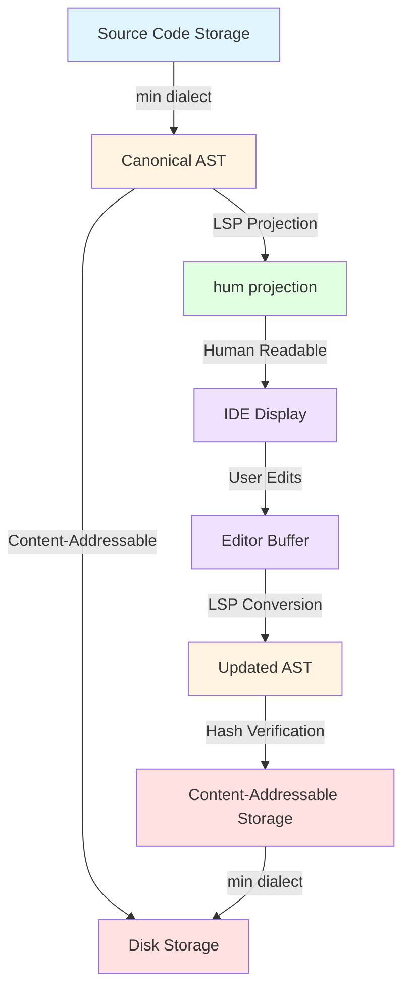
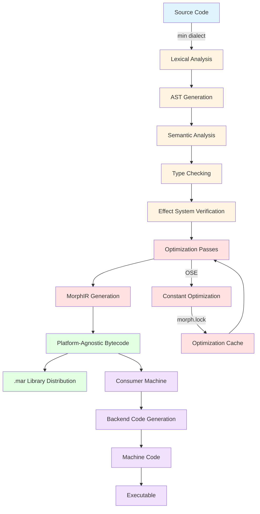
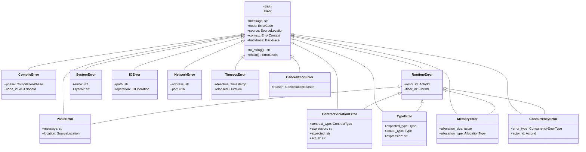
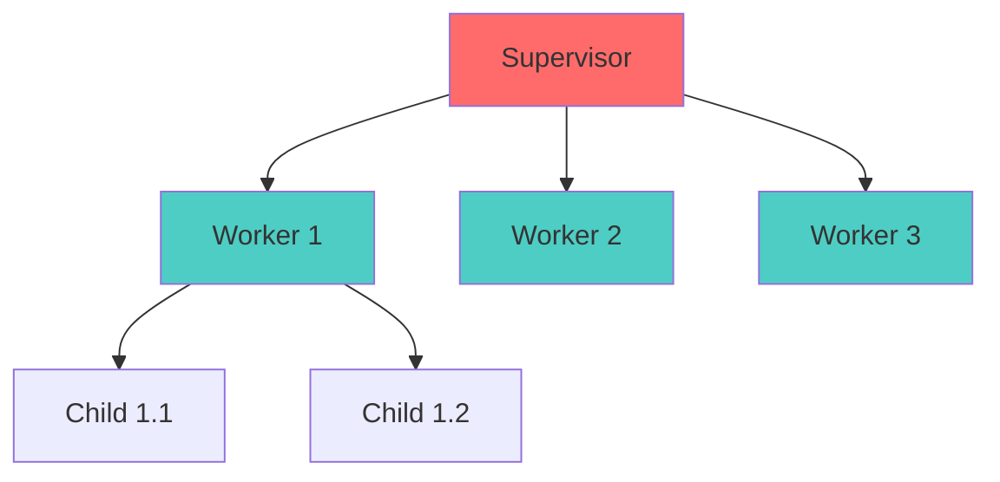

# Morph Language Specification

- File: `spec/language/morph_language_spec.md`
- Version: 2.0.0
- Context: Layer 2 (Compiler) - Formalism
- Status: Active
- Last Modified: 2026-01-03
- Author: Morph Language Team
- Reviewers: [Pending Review]

---

## 1. Introduction

### 1.1 Purpose

To define **Morph**, a "Post-Text" programming language. Morph addresses the limitations of Large Language Models (Context Window limits, Hallucination, Runtime Indeterminism) by treating code as a structural graph rather than a string of text, enforcing architectural correctness via strict compiler constraints.

### 1.2 Core Philosophy

1. **Agent-First:* The canonical representation (`min` dialect) is optimized for information density, not human typing speed.
2. **Constraint-Based:* The compiler acts as a constraint solver, utilizing Types, Effects, and Contracts to prevent the generation of syntactically valid but logically broken code.
3. **Content-Addressable:* Code is referenced by the Hash of its Abstract Syntax Tree (AST), enabling atomic refactoring and eliminating dependency hell.

### 1.2.1 Projectional Only Mandate

* Important:* Morph follows a **Projectional Only** design philosophy that resolves the apparent tension between Agent-First optimization and human usability.

* The Mandate:*
- **Single Source of Truth:** The `min` dialect is the canonical, authoritative representation of Morph code. All compilation, analysis, and storage operations operate on `min` dialect exclusively.
- **Transient Projections:** The `hum` projection is a **transient, generated projection** created by the Language Server Protocol (LSP) for human auditing and readability. It is not a separate source of truth.
- **Hard Constraint:** The `hum` projection is a transient in-memory representation, **never persisted to disk**. If `hum` exists as a file format, you create sync issues. This must be a hard constraint in the specification.

* Resolution of Apparent Contradiction:*

The specification may appear contradictory when claiming both "Agent-First" (compressed keywords for LLM efficiency) and "human usability" (readable keywords for developers). The **Projectional Only Mandate** resolves this tension:

1. **Primary Target Audience:** Morph is primarily designed for LLM generation and automated tooling. The `min` dialect optimizes for this use case with:
   - Compressed keywords (22 total) to maximize context window utilization
   - Dense symbols for information density
   - Strict syntax to prevent hallucinations
   - Content-addressable storage for atomic refactoring

2. **Secondary Human Usability:** Human developers interact with Morph through the `hum` projection, which provides:
   - Verbose, readable syntax for human comprehension
   - Formatted code with proper indentation and spacing
   - Semantic highlighting and IDE integration via LSP
   - Type annotations and documentation for clarity

3. **No Trade-Off Required:** Because `hum` is a **projection** (not a separate dialect), there is no trade-off between Agent efficiency and human usability. The language can be optimized for both:
   - **Agents** work directly with `min` dialect (optimal for LLMs)
   - **Humans** work with `hum` projection (optimal for readability)
   - **Both** represent the same underlying AST (isomorphic views)

* Implications:*

- **Tooling:** All Morph tooling (compilers, formatters, linters, package managers) operate on `min` dialect
- **Storage:** All Morph code is stored and distributed as `min` dialect
- **Version Control:** All Morph code is versioned as `min` dialect
- **Human Editing:** Developers write in `hum` projection, which is automatically converted to `min` dialect by the LSP
- **Agent Generation:** LLMs generate `min` dialect directly (or `hum` projection which is then converted)

* Benefits of Projectional Only Mandate:*

1. **Eliminates Divergence:** No risk of `min` and `hum` projections diverging over time
2. **Simplifies Tooling:** Tooling only needs to handle one canonical format
3. **Optimizes for Both:** Language can be optimized for LLM efficiency (`min`) and human readability (`hum` projection) simultaneously
4. **Reduces Confusion:** Clear separation between source of truth (`min`) and human-readable view (`hum`)

* LANG-REQ-001:* THE system SHALL maintain `min` dialect as the single source of truth for all Morph code.

* LANG-REQ-002:* THE system SHALL provide `hum` projection as a transient LSP projection for human readability.

* LANG-REQ-003:* THE system SHALL ensure that `min` and `hum` projections are isomorphic representations of the same AST.

* Priority:* Critical
* Verification Method:* Review
* Rationale:* Resolves Agent-First vs Human Usability contradiction
* Dependencies:* None
* Traceability:* Section 1.2.1 (Projectional Only Mandate)

- -

## 2. Lexical Structure & Syntax (LS3)

### 2.1 Representation Layer

- **LANG-REQ-004 (Dual Representations):* The system SHALL support two isomorphic views of the source code:
  - **`min` (Canonical):* Stripped whitespace, dense symbols. This is the source of truth stored on disk.
  - **`hum` (Projection):* A verbose, formatted view generated by the Language Server Protocol (LSP) for human auditing. This is a transient in-memory representation, never persisted to disk.

**Priority:** Critical
**Verification Method:** Test
**Rationale:** Enables Agent-First optimization while maintaining human usability through projectional editing
**Dependencies:** LANG-REQ-001, LANG-REQ-002, LANG-REQ-003
**Traceability:** Section 2.1 (Representation Layer)

- **LANG-REQ-005 (Delimiters):* Mandatory braces `{}` and semicolons `;` are required to prevent indentation-based hallucinations common in Python-like generation.

**Priority:** Critical
**Verification Method:** Test
**Rationale:** Prevents LLM hallucinations from indentation errors common in Python-like languages
**Dependencies:** LANG-REQ-004
**Traceability:** Section 2.1 (Representation Layer)

### 2.2 Compressed Keyword Set

- **LANG-REQ-006 (Token Density):* The language reserves a compressed set of 22 keywords to maximize context window usage. Mappings include:
  - `function` $\rightarrow$ `fn`
  - `return` $\rightarrow$ `ret`
  - `import` $\rightarrow$ `use`
  - `logic` $\rightarrow$ `act` (Actor)
  - `match` $\rightarrow$ `fix`

**Priority:** High
**Verification Method:** Test
**Rationale:** Maximizes LLM context window utilization for Agent-First design
**Dependencies:** LANG-REQ-001
**Traceability:** Section 2.2 (Compressed Keyword Set)

- **LANG-REQ-007 (Walrus Operator):* The `:=` operator SHALL be used for inferred variable declaration (`x := 10;`), replacing verbose `var`/`let` keywords.

**Priority:** Medium
**Verification Method:** Test
**Rationale:** Reduces token count while maintaining clarity for type inference
**Dependencies:** LANG-REQ-006
**Traceability:** Section 2.2 (Compressed Keyword Set)

### 2.3 String Literals

- **LANG-REQ-008 (Line-Prefix Strings):* The `\\` sequence at the start of a line denotes a raw string (Zig-style). This eliminates the need for a closing delimiter, preventing "unclosed string" hallucinations.

**Priority:** High
**Verification Method:** Test
**Rationale:** Prevents LLM hallucinations from unclosed string delimiters
**Dependencies:** LANG-REQ-005
**Traceability:** Section 2.3 (String Literals)

- **LANG-REQ-009 (Fenced Blocks):* The ` ``` ` sequence denotes multi-line raw blobs. Support for optional semantic tagging (e.g., ` ```json `) is required for embedded DSLs.

**Priority:** Medium
**Verification Method:** Test
**Rationale:** Enables embedded DSL support with clear delimiters
**Dependencies:** LANG-REQ-008
**Traceability:** Section 2.3 (String Literals)

### 2.4 Operators

- **LANG-REQ-010 (Pipeline):* The `|>` operator enforces left-to-right data flow (`x |> f()`), aligning with autoregressive token generation.

**Priority:** High
**Verification Method:** Test
**Rationale:** Aligns with LLM autoregressive token generation patterns
**Dependencies:** LANG-REQ-006
**Traceability:** Section 2.4 (Operators)

- **LANG-REQ-011 (Propagation):* The `?` postfix operator propagates `Result::Err` up the call stack.

**Priority:** High
**Verification Method:** Test
**Rationale:** Provides ergonomic error handling without verbose try-catch blocks
**Dependencies:** LANG-REQ-010
**Traceability:** Section 2.4 (Operators)

- -

## 3. Type System (TSS)

### 3.1 Primitive Types

- **LANG-REQ-012 (Scalars):* The language supports `u8`..`u64`, `i8`..`i64`, `f32`, `f64`, `bool`, and `void`.
- **LANG-REQ-013 (Text vs Binary):* Strict separation between `str` (UTF-8, immutable) and `^Bytes` (Raw `u8` array).
- **LANG-REQ-014 (BigInt):* The `BigInt` primitive SHALL utilize **Small-Object Optimization (SOO)**. Values fitting in a machine register are stored inline; larger values spill to the heap automatically.

### 3.2 Algebraic Data Types (ADTs)

- **LANG-REQ-015 (Unified Declaration):* The `type` keyword defines both Product (Struct) and Sum (Enum) types.

**Priority:** High
**Verification Method:** Test
**Rationale:** Simplifies type system with unified syntax for ADTs
**Dependencies:** LANG-REQ-012
**Traceability:** Section 3.2 (Algebraic Data Types)

- **LANG-REQ-016 (Intrinsic Traits):* All types automatically derive `Equality`, `Hash`, and `Serialization` (JSON/Binary) logic without boilerplate.

**Priority:** High
**Verification Method:** Test
**Rationale:** Reduces boilerplate and ensures consistent trait implementations
**Dependencies:** LANG-REQ-015
**Traceability:** Section 3.2 (Algebraic Data Types)

### 3.3 Reference Capabilities (Ownership)

- **LANG-REQ-017 (Sigils):*
  - `^T` (**Iso**): Unique/Move-only.
  - `#T` (**Val**): Shared/Immutable.
  - `&T` (**Ref**): Local/Mutable.
  - `T?` (**Opt**): Nullable.

**Priority:** Critical
**Verification Method:** Test
**Rationale:** Provides clear ownership semantics for memory safety
**Dependencies:** LANG-REQ-012
**Traceability:** Section 3.3 (Reference Capabilities)

- **LANG-REQ-018 (Send Safety):* The compiler SHALL enforce that `ref` types CANNOT be sent between Actors. `iso` types must be consumed (moved) upon sending.

**Priority:** Critical
**Verification Method:** Test
**Rationale:** Prevents data races in concurrent actor model
**Dependencies:** LANG-REQ-017, LANG-REQ-022
**Traceability:** Section 3.3 (Reference Capabilities)

### 3.4 Unified Unit Algebra

- **LANG-REQ-019 (Unit Keyword):* `unit Name;` defines a base dimension (e.g., `unit Meter;`, `unit USD;`).

**Priority:** Medium
**Verification Method:** Test
**Rationale:** Enables compile-time dimensional analysis for domain-specific correctness
**Dependencies:** LANG-REQ-012
**Traceability:** Section 3.4 (Unified Unit Algebra)

- **LANG-REQ-020 (Algebraic Consistency):* The compiler enforces unit algebra (e.g., `<USD> / <EUR/USD> = <EUR>`).

**Priority:** High
**Verification Method:** Test
**Rationale:** Prevents unit conversion errors at compile time
**Dependencies:** LANG-REQ-019
**Traceability:** Section 3.4 (Unified Unit Algebra)

- **LANG-REQ-021 (Erasure):* Units are erased at runtime (Zero Cost). `f64<Meter>` compiles to raw `f64`.

**Priority:** High
**Verification Method:** Test
**Rationale:** Ensures zero-cost abstraction for type safety
**Dependencies:** LANG-REQ-019, LANG-REQ-020
**Traceability:** Section 3.4 (Unified Unit Algebra)

- -

## 4. Execution Model (EMS)

### 4.1 Concurrency

- **LANG-REQ-022 (Actors):* The `act` keyword defines an Actor. Execution within an Actor is strictly sequential.

**Priority:** Critical
**Verification Method:** Test
**Rationale:** Provides actor-based concurrency model with guaranteed sequential execution
**Dependencies:** LANG-REQ-018
**Traceability:** Section 4.1 (Concurrency)

- **LANG-REQ-023 (Implicit Suspension):* There are no `async`/`await` keywords. I/O functions marked `performs IO` automatically yield the Green Thread (Fiber).

**Priority:** High
**Verification Method:** Test
**Rationale:** Eliminates async/await boilerplate while maintaining non-blocking I/O
**Dependencies:** LANG-REQ-022, LANG-REQ-041
**Traceability:** Section 4.1 (Concurrency)

- **LANG-REQ-024 (Dataflow):* The `async let x = foo()` statement spawns a task. Accessing `x` later triggers **Wait-by-Necessity**.

**Priority:** High
**Verification Method:** Test
**Rationale:** Enables ergonomic task spawning with automatic synchronization
**Dependencies:** LANG-REQ-022, LANG-REQ-023
**Traceability:** Section 4.1 (Concurrency)

### 4.1.1 Relationship Between `act` and `flow`

The `flow` construct is a **strict subset of `act` with additional constraints for unidirectional data flow and state management.

* Key Differences:*

| Feature | `act` (General Actor) | `flow` (Constrained Actor) |
|----------|------------------------|----------------------------|
| **Message Handling** | Arbitrary message processing patterns | Restricted to specific patterns (UDF or SSUS) |
| **State Management** | Flexible state management | Strict state management with enforced patterns |
| **Effect Handling** | Flexible effect handling | Explicit effect separation (SSUS) or pure transformation (UDF) |
| **Data Flow** | Bidirectional communication allowed | Unidirectional data flow enforced |
| **Topology** | Arbitrary actor graphs | DAG topology enforced (no cycles) |

* When to Use `act`:*
- General-purpose concurrent entities
- Bidirectional communication patterns
- Flexible state management requirements
- Custom message handling logic

* When to Use `flow`:*
- Unidirectional data flow requirements
- Strict state management patterns
- Deterministic state transitions
- Reactive stream processing

* Restrictions on `flow`:*
- `flow` cannot use arbitrary message handling patterns
- `flow` must use either UDF pattern (`reduce`) or SSUS pattern (`update` + `command`)
- `flow` enforces DAG topology (no cycles allowed)
- `flow` restricts effect handling to pattern-specific semantics

* See Also:*
- [`strict_state_unidirectional_spec.md`](strict_state_unidirectional_spec.md) - SSUS pattern specification
- [`unidirectional_data_flow_spec.md`](unidirectional_data_flow_spec.md) - UDF pattern specification
- [`spec/language/dialect_projection_spec.md`](language/dialect_projection_spec.md) - Dialect and projection specification, formalizing the relationship between `min` and `hum` projections

### 4.2 Memory Management

- **LANG-REQ-025 (Hybrid Model):*
  - **Arenas:** Used for `act` local scope (freed O(1) at message completion).
  - **ARC:** Used for `#Val` shared types (Atomic Reference Counting).

**Priority:** Critical
**Verification Method:** Test
**Rationale:** Combines arena allocation for actor-local data with ARC for shared data
**Dependencies:** LANG-REQ-017, LANG-REQ-022
**Traceability:** Section 4.2 (Memory Management)

- **LANG-REQ-026 (No GC):* Strict prohibition of Tracing Garbage Collection to ensure deterministic latency.

**Priority:** Critical
**Verification Method:** Test
**Rationale:** Ensures deterministic memory management without GC pauses
**Dependencies:** LANG-REQ-025
**Traceability:** Section 4.2 (Memory Management)

### 4.3 FFI & System Threads

- **LANG-REQ-027 (Pessimistic FFI):* Foreign Function calls assume blocking behavior and are automatically dispatched to a dedicated OS Thread Pool.

**Priority:** High
**Verification Method:** Test
**Rationale:** Prevents blocking FFI calls from blocking green thread scheduler
**Dependencies:** LANG-REQ-022, LANG-REQ-023
**Traceability:** Section 4.3 (FFI & System Threads)

- **LANG-REQ-028 (Non-Blocking):* The `trait [NonBlocking]` allows FFI execution on the Green Thread scheduler for optimized, non-blocking C functions.

**Priority:** Medium
**Verification Method:** Test
**Rationale:** Enables optimization for known non-blocking C functions
**Dependencies:** LANG-REQ-027
**Traceability:** Section 4.3 (FFI & System Threads)

- -

### 4.4 Mermaid Diagrams

#### 4.4.1 Dual Dialect Architecture Flowchart

This diagram illustrates the Projectional Only Mandate, showing how the `min` dialect serves as the single source of truth while the `hum` projection is a transient projection for human readability.



#### 4.4.2 Compilation Pipeline Flowchart

This diagram shows the complete compilation pipeline from source code to executable, including the dual dialect system, optimization stages, and final code generation.



## 5. Metaprogramming (MGS)

### 5.1 Generics & Constraints

- **LANG-REQ-029 (Monomorphization):* Generics compile to specialized implementations per concrete type.

**Priority:** High
**Verification Method:** Test
**Rationale:** Provides zero-cost generics through compile-time specialization
**Dependencies:** LANG-REQ-012
**Traceability:** Section 5.1 (Generics & Constraints)

- **LANG-REQ-030 (Disambiguation):*
  - `where T: Trait`: Defines **Type Constraints**.
  - `requires { val > 0 }`: Defines **Value Constraints** (Contracts).
  - Mixing these keywords is a compile error.

**Priority:** High
**Verification Method:** Test
**Rationale:** Prevents confusion between type and value constraints
**Dependencies:** LANG-REQ-029
**Traceability:** Section 5.1 (Generics & Constraints)

### 5.2 Comptime & Reflection

- **LANG-REQ-031 (Staged Compilation):* `comptime { ... }` blocks execute during the semantic analysis phase.

**Priority:** High
**Verification Method:** Test
**Rationale:** Enables compile-time code generation and optimization
**Dependencies:** LANG-REQ-029
**Traceability:** Section 5.2 (Comptime & Reflection)

- **LANG-REQ-032 (Introspection):* `meta.fields(T)` allows static iteration over type structures for generator logic (e.g., serializers).

**Priority:** High
**Verification Method:** Test
**Rationale:** Enables automatic code generation for serialization and other boilerplate
**Dependencies:** LANG-REQ-031
**Traceability:** Section 5.2 (Comptime & Reflection)

### 5.3 Optimization Search Engine (OSE)

- **LANG-REQ-033 (Holes):* The `??` operator denotes a Search Space for constants.

**Priority:** Medium
**Verification Method:** Test
**Rationale:** Enables automatic optimization of constants through search
**Dependencies:** LANG-REQ-031
**Traceability:** Section 5.3 (Optimization Search Engine)

- **LANG-REQ-034 (Search Strategy):* The OSE uses Hill Climbing or Grid Search to optimize the value against an objective (`speed`, `size`).

**Priority:** Medium
**Verification Method:** Test
**Rationale:** Provides automated optimization for performance-critical constants
**Dependencies:** LANG-REQ-033
**Traceability:** Section 5.3 (Optimization Search Engine)

- **LANG-REQ-035 (Locking):* Optimization results are cached in `morph.lock` to ensure reproducible builds.

**Priority:** High
**Verification Method:** Test
**Rationale:** Ensures reproducible builds by caching optimization results
**Dependencies:** LANG-REQ-034
**Traceability:** Section 5.3 (Optimization Search Engine)

### 5.4 Compiler Directives (Attributes)

- **LANG-REQ-036 (Syntax):* Directives use the `@` prefix (e.g., `@gpu`, `@simd`).

**Priority:** Medium
**Verification Method:** Test
**Rationale:** Provides clear syntax for compiler directives
**Dependencies:** LANG-REQ-031
**Traceability:** Section 5.4 (Compiler Directives)

- **LANG-REQ-037 (Targeting):* The `@gpu` attribute forces compilation to SPIR-V/PTX and strictly bans System I/O within the function scope.

**Priority:** High
**Verification Method:** Test
**Rationale:** Enables GPU compilation with safety guarantees
**Dependencies:** LANG-REQ-036, LANG-REQ-041
**Traceability:** Section 5.4 (Compiler Directives)

- -

## 6. Infrastructure & Safety (ISCS)

### 6.1 Design by Contract

- **LANG-REQ-038 (Clauses):* Support for `requires`, `ensures`, and `invariant`.

**Priority:** High
**Verification Method:** Test
**Rationale:** Enables Design by Contract for formal verification
**Dependencies:** LANG-REQ-030
**Traceability:** Section 6.1 (Design by Contract)

- **LANG-REQ-039 (Optimization):* In Release mode, contracts serve as optimization hints (`llvm.assume`).

**Priority:** Medium
**Verification Method:** Test
**Rationale:** Enables contract-based optimization in release builds
**Dependencies:** LANG-REQ-038
**Traceability:** Section 6.1 (Design by Contract)

### 6.2 Effect System

- **LANG-REQ-040 (Taxonomy):* Defined effects: `Pure`, `IO`, `Net`, `Sys`.

**Priority:** Critical
**Verification Method:** Test
**Rationale:** Provides effect system for tracking side effects
**Dependencies:** LANG-REQ-023
**Traceability:** Section 6.2 (Effect System)

- **LANG-REQ-041 (Enforcement):* Functions must declare effects. Pure functions cannot call Impure functions.

**Priority:** Critical
**Verification Method:** Test
**Rationale:** Enforces effect system to prevent impure calls in pure functions
**Dependencies:** LANG-REQ-040
**Traceability:** Section 6.2 (Effect System)

### 6.3 Intrinsic Infrastructure

- **LANG-REQ-042 (Context):* An implicit `ctx` object is propagated for deadline management and cancellation.

**Priority:** High
**Verification Method:** Test
**Rationale:** Enables deadline management and cancellation for distributed systems
**Dependencies:** LANG-REQ-022
**Traceability:** Section 6.3 (Intrinsic Infrastructure)

- **LANG-REQ-043 (Routing):* A declarative `routing` block maps external signals (URL/Socket) to internal Actor Events.

**Priority:** High
**Verification Method:** Test
**Rationale:** Provides declarative routing for external event handling
**Dependencies:** LANG-REQ-042
**Traceability:** Section 6.3 (Intrinsic Infrastructure)

### 6.4 Auto-Fuzzing

- **LANG-REQ-044 (Generation):* The compiler auto-generates Fuzz Tests for functions marked `@fuzz`, using Type and Contract definitions to generate valid/invalid inputs.

**Priority:** High
**Verification Method:** Test
**Rationale:** Automates fuzz testing for improved security and reliability
**Dependencies:** LANG-REQ-038, LANG-REQ-039
**Traceability:** Section 6.4 (Auto-Fuzzing)

- -

## 7. Build System & Modules (BSAD/MSS)

### 7.1 Organization

- **LANG-REQ-045 (Implicit Graph):* The dependency graph is derived solely from AST `use` statements. No build scripts.

**Priority:** High
**Verification Method:** Test
**Rationale:** Eliminates build script complexity through automatic dependency resolution
**Dependencies:** LANG-REQ-001
**Traceability:** Section 7.1 (Organization)

- **LANG-REQ-046 (Virtual Workspace):* Monorepo dependencies resolve via Name (Head). Registry dependencies resolve via Hash (Pinned).

**Priority:** High
**Verification Method:** Test
**Rationale:** Enables flexible dependency resolution for monorepos and registries
**Dependencies:** LANG-REQ-045
**Traceability:** Section 7.1 (Organization)

### 7.2 Hermeticity

- **LANG-REQ-047 (Sandboxing):* Builds execute in isolated containers with no access to host system paths.

**Priority:** High
**Verification Method:** Test
**Rationale:** Ensures reproducible and secure builds through isolation
**Dependencies:** LANG-REQ-045
**Traceability:** Section 7.2 (Hermeticity)

- **LANG-REQ-048 (C-Vendoring):* C/C++ dependencies must be vendored and compiled by the internal Clang driver.

**Priority:** High
**Verification Method:** Test
**Rationale:** Ensures reproducible builds by controlling C/C++ compilation
**Dependencies:** LANG-REQ-047
**Traceability:** Section 7.2 (Hermeticity)

### 7.3 Distribution

- **LANG-REQ-049 (MorphIR):* Libraries are distributed as Platform-Agnostic Bytecode (`.mar`).

**Priority:** High
**Verification Method:** Test
**Rationale:** Enables platform-agnostic library distribution
**Dependencies:** LANG-REQ-045
**Traceability:** Section 7.3 (Distribution)

- **LANG-REQ-050 (Consumer Compile):* Final machine code generation occurs on the Consumer's machine to ensure ABI stability.

**Priority:** High
**Verification Method:** Test
**Rationale:** Ensures ABI stability by deferring machine code generation to consumer
**Dependencies:** LANG-REQ-049
**Traceability:** Section 7.3 (Distribution)

- -

## 8. Domain Extensions

### 8.1 Financial (DES-FIN)

- **LANG-REQ-051 (Currency Units):* Currencies are defined as `unit`. Exchange rates are defined as `dec128<Target/Source>`.

**Priority:** Medium
**Verification Method:** Test
**Rationale:** Enables compile-time dimensional analysis for financial calculations
**Dependencies:** LANG-REQ-019, LANG-REQ-020
**Traceability:** Section 8.1 (Financial)

- **LANG-REQ-052 (Rounding):* Division requiring scale change is prohibited outside `with rounding(...)` blocks.

**Priority:** High
**Verification Method:** Test
**Rationale:** Prevents rounding errors in financial calculations
**Dependencies:** LANG-REQ-051
**Traceability:** Section 8.1 (Financial)

- **LANG-REQ-053 (HFT Mode):* The `@critical` attribute enforces Zero-Allocation, Thread-Pinned execution (Kernel Bypass).

**Priority:** High
**Verification Method:** Test
**Rationale:** Enables ultra-low latency for high-frequency trading
**Dependencies:** LANG-REQ-022, LANG-REQ-025
**Traceability:** Section 8.1 (Financial)

- **LANG-REQ-054 (Auditability):* The `@auditable` attribute injects immutable logging sidecars for state mutations.

**Priority:** High
**Verification Method:** Test
**Rationale:** Enables regulatory compliance through immutable audit trails
**Dependencies:** LANG-REQ-053
**Traceability:** Section 8.1 (Financial)

### 8.2 Scientific (DES-SCI)

- **LANG-REQ-055 (Tensor Primitives):* `tensor<T, Dims>` primitive with Python-like slicing.

**Priority:** Medium
**Verification Method:** Test
**Rationale:** Provides efficient tensor operations for scientific computing
**Dependencies:** LANG-REQ-012
**Traceability:** Section 8.2 (Scientific)

- **LANG-REQ-056 (AutoDiff):* The `grad(f)` operator provides source-to-source differentiation.

**Priority:** High
**Verification Method:** Test
**Rationale:** Enables automatic differentiation for gradient computation
**Dependencies:** LANG-REQ-055
**Traceability:** Section 8.2 (Scientific)

- **LANG-REQ-057 (JIT):* Support for `jit` build target for REPL usage.

**Priority:** Medium
**Verification Method:** Test
**Rationale:** Enables rapid development iteration through JIT compilation
**Dependencies:** LANG-REQ-050
**Traceability:** Section 8.2 (Scientific)

### 8.3 Frontend (DES-UI)

- **LANG-REQ-058 (Design System):* `trait DesignSystem` defines theme contracts.

**Priority:** Medium
**Verification Method:** Test
**Rationale:** Enables consistent theming across UI components
**Dependencies:** LANG-REQ-012
**Traceability:** Section 8.3 (Frontend)

- **LANG-REQ-059 (Implicit Theme):* `ctx.theme` provides access to semantic values.

**Priority:** Medium
**Verification Method:** Test
**Rationale:** Provides ergonomic access to theme values throughout UI
**Dependencies:** LANG-REQ-042
**Traceability:** Section 8.3 (Frontend)

- **LANG-REQ-060 (MUI-IR):* Platform-independent vector command buffer for rendering.

**Priority:** High
**Verification Method:** Test
**Rationale:** Enables cross-platform rendering through platform-agnostic IR
**Dependencies:** LANG-REQ-058
**Traceability:** Section 8.3 (Frontend)

- **LANG-REQ-061 (Smart Assets):* `comptime` scanner maps file extensions to Phantom Types (e.g., `Asset<Png>`).

**Priority:** Medium
**Verification Method:** Test
**Rationale:** Enables type-safe asset management through phantom types
**Dependencies:** LANG-REQ-031, LANG-REQ-015
**Traceability:** Section 8.3 (Frontend)

- **LANG-REQ-062 (Type Hierarchy):* Phantom types implement traits (`Png` implements `Image` and `Lossless`).

**Priority:** Medium
**Verification Method:** Test
**Rationale:** Enables polymorphic asset handling through trait hierarchy
**Dependencies:** LANG-REQ-061
**Traceability:** Section 8.3 (Frontend)

- **LANG-REQ-063 (Optical Scales):* UI Widgets accept `Scale` enums, prohibiting raw pixel values.

**Priority:** High
**Verification Method:** Test
**Rationale:** Ensures responsive UI design through optical scaling
**Dependencies:** LANG-REQ-058
**Traceability:** Section 8.3 (Frontend)

- -

## 9. Tooling & Security

### 9.1 Model Context Protocol (MCP)

- **LANG-REQ-064 (Endpoints):* `patch_ast`, `query_symbol`.

**Priority:** High
**Verification Method:** Test
**Rationale:** Provides MCP endpoints for AST manipulation and symbol queries
**Dependencies:** LANG-REQ-001
**Traceability:** Section 9.1 (Model Context Protocol)

- **LANG-REQ-065 (Structured Diagnostics):* Errors are returned as JSON with `node_id`, `context`, and `suggested_fixes`.

**Priority:** High
**Verification Method:** Test
**Rationale:** Enables structured error reporting for automated tooling
**Dependencies:** LANG-REQ-064
**Traceability:** Section 9.1 (Model Context Protocol)

### 9.2 Accessibility (SAP)

- **LANG-REQ-066 (Semantic Tree):* Runtime exposes the computed UI tree (Role, Rect, Visibility) via MCP.

**Priority:** High
**Verification Method:** Test
**Rationale:** Enables accessibility tools to inspect UI structure
**Dependencies:** LANG-REQ-058, LANG-REQ-059
**Traceability:** Section 9.2 (Accessibility)

- **LANG-REQ-067 (Interaction):* Support for `simulate_interaction(node_id, action)` for E2E testing.

**Priority:** High
**Verification Method:** Test
**Rationale:** Enables automated E2E testing through MCP
**Dependencies:** LANG-REQ-066
**Traceability:** Section 9.2 (Accessibility)

### 9.3 Licensing & Compliance (LCS)

- **LANG-REQ-068 (Policy Gating):* Build fails if dependencies violate `morph.pkg` license policy.

**Priority:** High
**Verification Method:** Test
**Rationale:** Ensures license compliance across dependencies
**Dependencies:** LANG-REQ-045, LANG-REQ-046
**Traceability:** Section 9.3 (Licensing & Compliance)

- **LANG-REQ-069 (Agent Filtering):* MCP hides incompatible packages from Agent search results.

**Priority:** Medium
**Verification Method:** Test
**Rationale:** Prevents agents from discovering incompatible packages
**Dependencies:** LANG-REQ-068
**Traceability:** Section 9.3 (Licensing & Compliance)

- **LANG-REQ-070 (SBOM):* `morph audit` generates SPDX SBOM.

**Priority:** High
**Verification Method:** Test
**Rationale:** Enables supply chain transparency through SBOM generation
**Dependencies:** LANG-REQ-068
**Traceability:** Section 9.3 (Licensing & Compliance)

### 9.4 Input & Security

- **LANG-REQ-071 (Input Normalization):* Runtime exposes only **Morph Canonical Input Events (MCIE)**.

**Priority:** High
**Verification Method:** Test
**Rationale:** Ensures consistent input handling across platforms
**Dependencies:** LANG-REQ-042
**Traceability:** Section 9.4 (Input & Security)

- **LANG-REQ-072 (Input Replay):* Input Ring Buffer enables deterministic replay debugging.

**Priority:** High
**Verification Method:** Test
**Rationale:** Enables deterministic debugging through input replay
**Dependencies:** LANG-REQ-071
**Traceability:** Section 9.4 (Input & Security)

- **LANG-REQ-073 (Content Addressing):* Prevents Supply Chain Spoofing via AST Hashing.

**Priority:** Critical
**Verification Method:** Test
**Rationale:** Ensures supply chain security through content addressing
**Dependencies:** LANG-REQ-001
**Traceability:** Section 9.4 (Input & Security)

- -

## 10. Architecture Layering (LAD)

- **L5 (Agent):* MCP, LSP, Tabula Rasa Engine.
- **L4 (Framework):* MorphUI, BLoC, Supervisors.
- **L3 (Runtime):* Scheduler, Arena/ARC, FFI.
- **L2 (Compiler):* AST, OIR, MorphIR, Semantic Tree.
- **L1 (Infrastructure):* MBS, MCM, Artifact Cache.

---

## 11. Examples

### 11.1 Basic Examples

#### 11.1.1 Hello World (min dialect)

```morph
fn main() -> void {
    use std::io;
    io::print("Hello, World!");
}
```

#### 11.1.2 Hello World (hum projection)

```morph
function main() -> void {
    import std::io;
    io::print("Hello, World!");
}
```

#### 11.1.3 Actor Definition

```morph
act Counter {
    state: i64;
    
    init() {
        self.state = 0;
    }
    
    msg increment() {
        self.state = self.state + 1;
    }
    
    msg get() -> i64 {
        ret self.state;
    }
}
```

#### 11.1.4 Reference Capabilities

```morph
fn process_data(data: ^Bytes) -> void {
    // data is unique (Iso), can be moved
    let shared: #Bytes = data.share();
    // shared is immutable (Val), can be shared across actors
}
```

### 11.2 Advanced Examples

#### 11.2.1 Generic Function with Constraints

```morph
fn sort<T>(arr: &[T]) -> &[T]
where T: Ord
requires { arr.len() > 0 }
{
    // Implementation
}
```

#### 11.2.2 Comptime Reflection

```morph
fn serialize<T>(obj: &T) -> Bytes
comptime {
    let fields = meta.fields(T);
    // Generate serialization code
}
```

#### 11.2.3 Optimization Search

```morph
fn matrix_multiply(A: Tensor<f64, [N,M]>, B: Tensor<f64, [M,P]>)
    -> Tensor<f64, [N,P]>
{
    let alpha: f64 = ?? optimize for speed;
    // Implementation with optimized alpha
}
```

### 11.3 Edge Cases

#### 11.3.1 Nullable Handling

```morph
fn safe_divide(a: f64, b: f64?) -> f64? {
    if b == null {
        ret null;
    }
    ret a / b;
}
```

#### 11.3.2 Effect System

```morph
fn pure_function(x: i64) -> i64 {
    // Pure function, no side effects
    ret x * 2;
}

fn impure_function(x: i64) -> i64 performs IO {
    // Impure function, performs I/O
    io::print(x);
    ret x * 2;
}
```

---

## 12. Cross-References

### 12.1 Type System Specifications

- [`spec/type/type_system_spec.md`](spec/type/type_system_spec.md) - Comprehensive type system specification
- [`spec/type/pure_type_spec.md`](spec/type/pure_type_spec.md) - Pure type theory
- [`spec/type/type_category_spec.md`](spec/type/type_category_spec.md) - Category theory foundations
- [`spec/type/type_unification_spec.md`](spec/type/type_unification_spec.md) - Type unification algorithms
- [`spec/type/effect_system_spec.md`](spec/type/effect_system_spec.md) - Effect system specification

### 12.2 Memory Specifications

- [`spec/memory/memory_model_spec.md`](spec/memory/memory_model_spec.md) - Memory model and ARC
- [`spec/memory/memory_affine_logic_spec.md`](spec/memory/memory_affine_logic_spec.md) - Affine type logic
- [`spec/memory/arc_affine_integration_spec.md`](spec/memory/arc_affine_integration_spec.md) - ARC and affine types
- [`spec/memory/memory_acyclicity_spec.md`](spec/memory/memory_acyclicity_spec.md) - Memory acyclicity

### 12.3 Concurrency Specifications

- [`spec/concurrency/execution_model_spec.md`](spec/concurrency/execution_model_spec.md) - Execution model
- [`spec/concurrency/scheduling_modes_spec.md`](spec/concurrency/scheduling_modes_spec.md) - Scheduling modes
- [`spec/concurrency/concurrency_process_algebra_spec.md`](spec/concurrency/concurrency_process_algebra_spec.md) - Process algebra
- [`spec/concurrency/monadic_effect_spec.md`](spec/concurrency/monadic_effect_spec.md) - Monadic effects

### 12.4 Build System Specifications

- [`spec/build/build_lattice_spec.md`](spec/build/build_lattice_spec.md) - Build dependency lattice
- [`spec/build/dependency_sat_spec.md`](spec/build/dependency_sat_spec.md) - Dependency satisfaction
- [`spec/build/linker_logic_spec.md`](spec/build/linker_logic_spec.md) - Linker logic
- [`spec/build/backend_tiling_spec.md`](spec/build/backend_tiling_spec.md) - Backend tiling

### 12.5 Security Specifications

- [`spec/security/security_flow_spec.md`](spec/security/security_flow_spec.md) - Security information flow
- [`spec/security/infrastructure_safety_contracts_spec.md`](spec/security/infrastructure_safety_contracts_spec.md) - Safety contracts
- [`spec/security_ocap_spec.md`](spec/security_ocap_spec.md) - Object capabilities

### 12.6 Tooling Specifications

- [`spec/tooling/metaprogramming_spec.md`](spec/tooling/metaprogramming_spec.md) - Metaprogramming
- [`spec/tooling/operational_semantics_spec.md`](spec/tooling/operational_semantics_spec.md) - Operational semantics
- [`spec/tooling/comptime_partial_eval_spec.md`](spec/tooling/comptime_partial_eval_spec.md) - Compile-time evaluation

---

## 13. Verification and Validation Plan

### 13.1 Verification Strategy

#### 13.1.1 Formal Verification

- **Type Safety:** Mechanized proof of type soundness using proof assistant (e.g., Coq, Lean)
- **Memory Safety:** Formal verification of ARC correctness and affine type system
- **Concurrency Safety:** Verification of actor isolation and message passing guarantees
- **Security:** Formal proof of non-interference property for information flow

#### 13.1.2 Static Analysis

- **Compiler Checks:** All requirements verified through compiler implementation
- **Linter Rules:** Automated linting for common errors and anti-patterns
- **Contract Verification:** Automated checking of preconditions, postconditions, and invariants
- **Effect System Enforcement:** Static analysis of effect annotations

### 13.2 Validation Strategy

#### 13.2.1 Unit Testing

- **Test Coverage:** Minimum 90% code coverage for all language features
- **Property-Based Testing:** Use QuickCheck-style testing for algebraic properties
- **Fuzz Testing:** Automated fuzzing for all public APIs
- **Regression Testing:** Comprehensive test suite for all bug fixes

#### 13.2.2 Integration Testing

- **End-to-End Tests:** Full compilation pipeline from source to executable
- **Cross-Platform Testing:** Validation on Windows, Linux, macOS
- **Performance Testing:** Benchmark suite for all performance claims
- **Security Testing:** Penetration testing and vulnerability scanning

#### 13.2.3 Real-World Validation

- **Pilot Programs:** Early adopter projects using Morph in production
- **Developer Surveys:** Feedback on language usability and specification clarity
- **Bug Analysis:** Tracking and analysis of common bugs and their root causes
- **Case Studies:** Documentation of successful Morph projects

### 13.3 Test Plan

#### 13.3.1 Test Categories

| Category | Description | Priority |
|----------|-------------|----------|
| **Type System** | Type inference, unification, generics | Critical |
| **Memory Management** | ARC, weak references, deallocation | Critical |
| **Concurrency** | Actors, fibers, scheduling | Critical |
| **Security** | Information flow, capabilities | Critical |
| **Metaprogramming** | Comptime, reflection, macros | High |
| **Build System** | Dependency resolution, caching | High |
| **Tooling** | LSP, MCP, diagnostics | Medium |

#### 13.3.2 Test Execution

- **CI/CD Integration:** All tests run on every commit
- **Nightly Builds:** Full test suite execution with performance benchmarks
- **Release Testing:** Comprehensive testing before each release
- **Continuous Monitoring:** Automated monitoring of test failures and performance regressions

---

## 14. Risk Assessment

### 14.1 Technical Risks

| Risk | Probability | Impact | Mitigation |
|-------|-------------|--------|-------------|
| **ARC Performance** | High | Critical | Conduct ARC latency micro-benchmark Day 1; if too slow, reconsider Memory Model design |
| **Type System Complexity** | Medium | High | Incremental implementation; extensive testing; formal verification |
| **Concurrency Bugs** | Medium | Critical | Formal verification; extensive testing; deterministic scheduler for debugging |
| **Security Vulnerabilities** | Low | Critical | Formal proofs; penetration testing; security audits |
| **Metaprogramming Complexity** | Medium | Medium | Clear documentation; examples; gradual rollout |
| **Build System Complexity** | Medium | High | Incremental implementation; extensive testing; fallback mechanisms |

### 14.2 Implementation Risks

| Risk | Probability | Impact | Mitigation |
|-------|-------------|--------|-------------|
| **Timeline Overrun** | Medium | High | Phased approach; prioritize critical features; buffer time |
| **Resource Constraints** | Low | Medium | Realistic resource planning; cross-training; automation |
| **Tooling Delays** | Medium | Medium | Prioritize critical tools; use existing solutions |
| **Adoption Barriers** | Medium | High | Early adopter program; documentation; examples; tutorials |
| **Ecosystem Fragmentation** | Low | Medium | Clear conventions; automated tools; governance |

### 14.3 Mitigation Strategies

1. **Incremental Implementation:**
   - Implement features in phases
   - Deliver value early with critical features
   - Iterate based on feedback

2. **Early Validation:**
   - Validate assumptions early
   - Create prototypes for critical features
   - Conduct pilot studies

3. **Automation:**
   - Automate repetitive tasks
   - Use CI/CD for validation
   - Generate documentation automatically

4. **Contingency Planning:**
   - Allocate buffer time for each phase
   - Have backup plans for critical path items
   - Monitor progress and adjust as needed

---

## 15. Error Handling (EH)

### 15.1 Error Types

#### 15.1.1 Error Type Hierarchy

Morph provides a comprehensive error type system with a clear hierarchy for categorizing and handling errors. All errors implement the base `Error` trait.



#### 15.1.2 Complete Error Type Enumeration

**LANG-REQ-071 (Error Type Enumeration):* The language SHALL provide the following error types:

| Error Type | Description | Recoverable | Phase |
|------------|-------------|-------------|-------|
| **CompileError** | Errors during compilation | No | Compile-time |
| **SyntaxError** | Invalid syntax | No | Compile-time |
| **LexicalError** | Invalid tokens | No | Compile-time |
| **ParseError** | Parsing failures | No | Compile-time |
| **TypeError** | Type mismatches | No | Compile-time |
| **UnificationError** | Type unification failures | No | Compile-time |
| **EffectError** | Effect system violations | No | Compile-time |
| **ContractViolationError** | Design by contract violations | Yes | Runtime |
| **PanicError** | Unrecoverable runtime errors | No | Runtime |
| **RuntimeError** | General runtime errors | Yes | Runtime |
| **SystemError** | Operating system errors | Yes | Runtime |
| **IOError** | Input/output errors | Yes | Runtime |
| **NetworkError** | Network communication errors | Yes | Runtime |
| **TimeoutError** | Operation timeout | Yes | Runtime |
| **CancellationError** | Operation cancellation | Yes | Runtime |
| **MemoryError** | Memory allocation failures | No | Runtime |
| **ConcurrencyError** | Concurrency violations | No | Runtime |
| **ActorError** | Actor communication errors | Yes | Runtime |
| **MessageError** | Message handling errors | Yes | Runtime |
| **FFIError** | Foreign function interface errors | Yes | Runtime |
| **SecurityError** | Security violations | No | Runtime |
| **CapabilityError** | Object capability violations | No | Runtime |

**Priority:** Critical
**Verification Method:** Test
**Rationale:** Provides complete error type enumeration for comprehensive error handling
**Dependencies:** LANG-REQ-012, LANG-REQ-017, LANG-REQ-022
**Traceability:** Section 15.1.2 (Complete Error Type Enumeration)

#### 15.1.3 Error Code System

**LANG-REQ-072 (Error Codes):* Each error type SHALL have a unique error code following the pattern `ERR_CATEGORY_SPECIFIC`:

| Category | Prefix | Example |
|----------|--------|---------|
| **Compile** | `ERR_COMPILE_` | `ERR_COMPILE_SYNTAX` |
| **Type** | `ERR_TYPE_` | `ERR_TYPE_MISMATCH` |
| **Runtime** | `ERR_RUNTIME_` | `ERR_RUNTIME_PANIC` |
| **System** | `ERR_SYSTEM_` | `ERR_SYSTEM_IO` |
| **Network** | `ERR_NETWORK_` | `ERR_NETWORK_TIMEOUT` |
| **Memory** | `ERR_MEMORY_` | `ERR_MEMORY_ALLOCATION` |
| **Concurrency** | `ERR_CONCURRENCY_` | `ERR_CONCURRENCY_DEADLOCK` |
| **Security** | `ERR_SECURITY_` | `ERR_SECURITY_CAPABILITY` |

**Priority:** High
**Verification Method:** Test
**Rationale:** Enables programmatic error handling and categorization
**Dependencies:** LANG-REQ-071
**Traceability:** Section 15.1.3 (Error Code System)

### 15.2 Error Propagation Rules

#### 15.2.1 Propagation Mechanisms

**LANG-REQ-073 (Propagation Operator):* The `?` operator SHALL propagate `Result::Err` values up the call stack:

```morph
fn read_config(path: str) -> Result<Config, IOError> {
    let content = std::fs::read_to_string(path)?;  // Propagates IOError
    ret parse_config(content)?;
}
```

**Priority:** Critical
**Verification Method:** Test
**Rationale:** Provides ergonomic error propagation without verbose try-catch blocks
**Dependencies:** LANG-REQ-011
**Traceability:** Section 15.2.1 (Propagation Mechanisms)

#### 15.2.2 Propagation Rules

**LANG-REQ-074 (Propagation Semantics):* Error propagation SHALL follow these rules:

1. **Early Return:** The `?` operator returns the error immediately from the current function
2. **Type Conversion:** Errors are automatically converted to the function's error type if they implement `From<OtherError>`
3. **Context Preservation:** Error context and backtrace are preserved during propagation
4. **Error Chaining:** Propagated errors maintain a chain of all intermediate errors
5. **Actor Boundaries:** Errors crossing actor boundaries are serialized and deserialized

**Priority:** Critical
**Verification Method:** Test
**Rationale:** Ensures predictable and safe error propagation
**Dependencies:** LANG-REQ-073
**Traceability:** Section 15.2.2 (Propagation Rules)

#### 15.2.3 Error Conversion

**LANG-REQ-075 (Error Conversion):* Errors SHALL support automatic conversion via the `From` trait:

```morph
impl From<IOError> for ConfigError {
    fn from(err: IOError) -> ConfigError {
        ConfigError::IOFailed(err)
    }
}
```

**Priority:** High
**Verification Method:** Test
**Rationale:** Enables ergonomic error handling with automatic type conversion
**Dependencies:** LANG-REQ-074
**Traceability:** Section 15.2.3 (Error Conversion)

### 15.3 Panic vs Error Return

#### 15.3.1 Panic Semantics

**LANG-REQ-076 (Panic Definition):* A panic SHALL be an unrecoverable error that terminates the current fiber and propagates to the actor supervisor:

```morph
fn critical_operation() -> void {
    if !precondition_met() {
        panic!("Critical precondition failed");
    }
}
```

**Priority:** Critical
**Verification Method:** Test
**Rationale:** Provides mechanism for handling unrecoverable errors
**Dependencies:** LANG-REQ-022
**Traceability:** Section 15.3.1 (Panic Semantics)

#### 15.3.2 Panic vs Error Return Guidelines

**LANG-REQ-077 (Panic Guidelines):* Panics SHALL be used only for:

1. **Invariant Violations:** When internal invariants are violated
2. **Unrecoverable State:** When the system state is corrupted beyond recovery
3. **Logic Errors:** When programmer errors indicate bugs in the code
4. **Resource Exhaustion:** When critical resources are unavailable

**LANG-REQ-078 (Error Return Guidelines):* Error returns SHALL be used for:

1. **Expected Failures:** I/O errors, network failures, timeouts
2. **Invalid Input:** User input validation failures
3. **Resource Unavailability:** Temporary resource shortages
4. **Business Logic Errors:** Expected error conditions in business logic

**Priority:** Critical
**Verification Method:** Review
**Rationale:** Provides clear guidance on when to use panic vs error return
**Dependencies:** LANG-REQ-076
**Traceability:** Section 15.3.2 (Panic vs Error Return Guidelines)

#### 15.3.3 Panic Propagation

**LANG-REQ-079 (Panic Propagation):* Panics SHALL propagate according to these rules:

1. **Fiber Termination:** The current fiber is terminated immediately
2. **Actor Isolation:** Panics do not cross actor boundaries by default
3. **Supervisor Notification:** The actor supervisor is notified of the panic
4. **Supervision Strategy:** The supervisor decides whether to restart, stop, or escalate
5. **Backtrace Capture:** A full backtrace is captured at the panic site

**Priority:** Critical
**Verification Method:** Test
**Rationale:** Ensures predictable panic behavior in actor system
**Dependencies:** LANG-REQ-022, LANG-REQ-076
**Traceability:** Section 15.3.3 (Panic Propagation)

### 15.4 Error Recovery Mechanisms

#### 15.4.1 Result Type

**LANG-REQ-080 (Result Type):* The `Result<T, E>` type SHALL represent either success (`Ok(T)`) or failure (`Err(E)`):

```morph
fn divide(a: f64, b: f64) -> Result<f64, DivisionError> {
    if b == 0.0 {
        ret Err(DivisionError::ZeroDivision);
    }
    ret Ok(a / b);
}
```

**Priority:** Critical
**Verification Method:** Test
**Rationale:** Provides explicit error handling without exceptions
**Dependencies:** LANG-REQ-012
**Traceability:** Section 15.4.1 (Result Type)

#### 15.4.2 Error Matching

**LANG-REQ-081 (Error Matching):* Errors SHALL be matched using pattern matching:

```morph
match result {
    Ok(value) => {
        // Handle success
    }
    Err(DivisionError::ZeroDivision) => {
        // Handle specific error
    }
    Err(err) => {
        // Handle other errors
    }
}
```

**Priority:** High
**Verification Method:** Test
**Rationale:** Enables precise error handling based on error type
**Dependencies:** LANG-REQ-080
**Traceability:** Section 15.4.2 (Error Matching)

#### 15.4.3 Error Recovery Strategies

**LANG-REQ-082 (Recovery Strategies):* The language SHALL support the following error recovery strategies:

| Strategy | Description | Use Case |
|----------|-------------|----------|
| **Retry** | Retry the operation with exponential backoff | Transient failures |
| **Fallback** | Use an alternative implementation or value | Degraded functionality |
| **Circuit Breaker** | Stop calling failing operations temporarily | Cascading failures |
| **Bulkhead** | Isolate failures to prevent system-wide impact | Resource isolation |
| **Timeout** | Fail fast if operation takes too long | Unresponsive services |
| **Graceful Degradation** | Reduce functionality instead of failing | Non-critical features |

**Priority:** High
**Verification Method:** Test
**Rationale:** Provides comprehensive error recovery mechanisms
**Dependencies:** LANG-REQ-080
**Traceability:** Section 15.4.3 (Error Recovery Strategies)

#### 15.4.4 Retry Mechanism

**LANG-REQ-083 (Retry Attribute):* The `@retry` attribute SHALL enable automatic retry with configurable backoff:

```morph
@retry(max_attempts: 3, backoff: exponential(initial_ms: 100, multiplier: 2))
fn fetch_data(url: str) -> Result<Data, NetworkError> {
    // Implementation
}
```

**Priority:** Medium
**Verification Method:** Test
**Rationale:** Provides declarative retry mechanism for transient failures
**Dependencies:** LANG-REQ-082
**Traceability:** Section 15.4.4 (Retry Mechanism)

### 15.5 Error Context and Backtraces

#### 15.5.1 Error Context

**LANG-REQ-084 (Error Context):* Errors SHALL carry contextual information:

```morph
struct ErrorContext {
    file: str,
    line: u32,
    column: u32,
    function: str,
    module: str,
    timestamp: Timestamp,
    additional: Map<str, str>,
}
```

**Priority:** High
**Verification Method:** Test
**Rationale:** Enables rich error context for debugging and logging
**Dependencies:** LANG-REQ-071
**Traceability:** Section 15.5.1 (Error Context)

#### 15.5.2 Backtrace Capture

**LANG-REQ-085 (Backtrace Capture):* The language SHALL capture backtraces for all errors:

```morph
struct Backtrace {
    frames: Vec<Frame>,
    captured_at: Timestamp,
}

struct Frame {
    address: usize,
    symbol: str,
    file: str,
    line: u32,
    module: str,
}
```

**Priority:** High
**Verification Method:** Test
**Rationale:** Provides detailed stack traces for debugging
**Dependencies:** LANG-REQ-084
**Traceability:** Section 15.5.2 (Backtrace Capture)

#### 15.5.3 Error Chaining

**LANG-REQ-086 (Error Chaining):* Errors SHALL support chaining to preserve the full error history:

```morph
fn load_config() -> Result<Config, ConfigError> {
    let content = std::fs::read_to_string("config.toml")
        .map_err(|e| ConfigError::IOFailed(e).chain("Failed to read config file"))?;
    
    ret parse_config(content)
        .map_err(|e| ConfigError::ParseFailed(e).chain("Failed to parse config"))?;
}
```

**Priority:** High
**Verification Method:** Test
**Rationale:** Preserves complete error history for debugging
**Dependencies:** LANG-REQ-084, LANG-REQ-085
**Traceability:** Section 15.5.3 (Error Chaining)

#### 15.5.4 Context Addition

**LANG-REQ-087 (Context Addition):* The `context()` method SHALL add contextual information to errors:

```morph
fn process_user(id: u64) -> Result<User, ProcessingError> {
    let user = fetch_user(id)
        .context(format!("Failed to fetch user with id {}", id))?;
    
    ret Ok(user);
}
```

**Priority:** Medium
**Verification Method:** Test
**Rationale:** Enables ergonomic error context addition
**Dependencies:** LANG-REQ-086
**Traceability:** Section 15.5.4 (Context Addition)

### 15.6 Error Suppression Mechanisms

#### 15.6.1 Explicit Suppression

**LANG-REQ-088 (Explicit Suppression):* Errors SHALL be explicitly suppressed using the `@suppress` attribute:

```morph
@suppress(error: "deprecated_function")
fn legacy_code() -> void {
    deprecated_function();
}
```

**Priority:** Medium
**Verification Method:** Test
**Rationale:** Allows intentional error suppression with documentation
**Dependencies:** LANG-REQ-036
**Traceability:** Section 15.6.1 (Explicit Suppression)

#### 15.6.2 Suppression Rules

**LANG-REQ-089 (Suppression Rules):* Error suppression SHALL follow these rules:

1. **Explicit Only:** Errors must be explicitly suppressed; no implicit suppression
2. **Documentation Required:** All suppressions must include a reason comment
3. **Scoped:** Suppressions apply only to the annotated scope
4. **Audit Trail:** All suppressions are tracked and reported in build output
5. **Review Required:** Suppressions of critical errors require code review

**Priority:** High
**Verification Method:** Review
**Rationale:** Ensures error suppression is intentional and documented
**Dependencies:** LANG-REQ-088
**Traceability:** Section 15.6.2 (Suppression Rules)

#### 15.6.3 Warning Levels

**LANG-REQ-090 (Warning Levels):* The language SHALL support configurable warning levels:

| Level | Description | Behavior |
|-------|-------------|----------|
| **Error** | Treat as compilation error | Build fails |
| **Warning** | Emit warning | Build succeeds |
| **Allow** | Suppress warning | No output |
| **Deny** | Always error | Build fails |

**Priority:** Medium
**Verification Method:** Test
**Rationale:** Provides flexible warning configuration
**Dependencies:** LANG-REQ-089
**Traceability:** Section 15.6.3 (Warning Levels)

### 15.7 Async Error Handling

#### 15.7.1 Async Error Propagation

**LANG-REQ-091 (Async Error Propagation):* Errors in async contexts SHALL propagate through the `Result` type:

```morph
async fn fetch_data(url: str) -> Result<Data, NetworkError> {
    let response = http::get(url).await?;
    ret parse_response(response)?;
}
```

**Priority:** Critical
**Verification Method:** Test
**Rationale:** Ensures consistent error handling in async code
**Dependencies:** LANG-REQ-023, LANG-REQ-080
**Traceability:** Section 15.7.1 (Async Error Propagation)

#### 15.7.2 Async Error Aggregation

**LANG-REQ-092 (Async Error Aggregation):* The language SHALL provide utilities for aggregating errors from multiple async operations:

```morph
async fn fetch_all(urls: Vec<str>) -> Result<Vec<Data>, AggregatedError> {
    let results = try_join_all(urls.iter().map(|url| fetch_data(url))).await?;
    ret Ok(results);
}
```

**Priority:** High
**Verification Method:** Test
**Rationale:** Enables handling errors from concurrent operations
**Dependencies:** LANG-REQ-091
**Traceability:** Section 15.7.2 (Async Error Aggregation)

#### 15.7.3 Async Error Recovery

**LANG-REQ-093 (Async Error Recovery):* Async operations SHALL support error recovery patterns:

```morph
async fn resilient_fetch(url: str) -> Result<Data, NetworkError> {
    retry_with_backoff(|| fetch_data(url), max_attempts: 3).await
}
```

**Priority:** High
**Verification Method:** Test
**Rationale:** Enables resilient async error handling
**Dependencies:** LANG-REQ-082, LANG-REQ-091
**Traceability:** Section 15.7.3 (Async Error Recovery)

### 15.8 Error Propagation Across Actors

#### 15.8.1 Actor Error Boundaries

**LANG-REQ-094 (Actor Error Boundaries):* Errors SHALL NOT cross actor boundaries by default:

```morph
act Service {
    msg process_request(req: Request) -> Result<Response, ServiceError> {
        // Errors are contained within this actor
        ret handle_request(req)?;
    }
}
```

**Priority:** Critical
**Verification Method:** Test
**Rationale:** Ensures actor isolation and prevents error propagation
**Dependencies:** LANG-REQ-022
**Traceability:** Section 15.8.1 (Actor Error Boundaries)

#### 15.8.2 Error Messages

**LANG-REQ-095 (Error Messages):* Actors SHALL communicate errors via messages:

```morph
type ServiceMessage = enum {
    Request(Request),
    Error(ServiceError),
};

act Client {
    msg send_request(service: Actor<Service>, req: Request) -> Result<Response, ClientError> {
        service.send(ServiceMessage::Request(req));
        // Wait for response or error message
    }
}
```

**Priority:** High
**Verification Method:** Test
**Rationale:** Enables explicit error communication between actors
**Dependencies:** LANG-REQ-094
**Traceability:** Section 15.8.2 (Error Messages)

#### 15.8.3 Supervision Trees

**LANG-REQ-096 (Supervision Trees):* Actors SHALL be organized in supervision trees with configurable supervision strategies:



**Priority:** High
**Verification Method:** Test
**Rationale:** Provides structured error handling in actor systems
**Dependencies:** LANG-REQ-022, LANG-REQ-079
**Traceability:** Section 15.8.3 (Supervision Trees)

#### 15.8.4 Supervision Strategies

**LANG-REQ-097 (Supervision Strategies):* The language SHALL support the following supervision strategies:

| Strategy | Description | Use Case |
|----------|-------------|----------|
| **One-For-One** | Restart only the failed child | Isolated failures |
| **One-For-All** | Restart all children when one fails | Tightly coupled components |
| **Rest-For-One** | Restart failed child and all siblings | Dependent components |
| **Escalate** | Escalate error to parent supervisor | Unrecoverable errors |

**Priority:** High
**Verification Method:** Test
**Rationale:** Provides flexible supervision strategies for different failure scenarios
**Dependencies:** LANG-REQ-096
**Traceability:** Section 15.8.4 (Supervision Strategies)

### 15.9 Timeout and Cancellation Error Handling

#### 15.9.1 Timeout Errors

**LANG-REQ-098 (Timeout Errors):* Operations SHALL support timeout specification:

```morph
async fn fetch_with_timeout(url: str, timeout: Duration) -> Result<Data, TimeoutError> {
    tokio::time::timeout(timeout, fetch_data(url)).await?
}
```

**Priority:** High
**Verification Method:** Test
**Rationale:** Enables timeout-based error handling for long-running operations
**Dependencies:** LANG-REQ-023, LANG-REQ-042
**Traceability:** Section 15.9.1 (Timeout Errors)

#### 15.9.2 Cancellation Errors

**LANG-REQ-099 (Cancellation Errors):* Operations SHALL respect cancellation signals:

```morph
async fn cancellable_operation(ctx: Context) -> Result<Data, CancellationError> {
    ctx.check_cancelled()?;
    // Perform operation
    ret Ok(data);
}
```

**Priority:** High
**Verification Method:** Test
**Rationale:** Enables graceful cancellation of operations
**Dependencies:** LANG-REQ-042
**Traceability:** Section 15.9.2 (Cancellation Errors)

#### 15.9.3 Context Propagation

**LANG-REQ-100 (Context Propagation):* The `ctx` object SHALL be propagated through all async operations:

```morph
async fn process_request(ctx: Context, req: Request) -> Result<Response, ProcessingError> {
    let data = fetch_data(ctx, req.url)?;
    let result = transform_data(ctx, data)?;
    ret Ok(Response { result });
}
```

**Priority:** High
**Verification Method:** Test
**Rationale:** Ensures consistent deadline and cancellation handling
**Dependencies:** LANG-REQ-042, LANG-REQ-099
**Traceability:** Section 15.9.3 (Context Propagation)

#### 15.9.4 Deadline Management

**LANG-REQ-101 (Deadline Management):* The context SHALL support deadline specification:

```morph
async fn operation_with_deadline(ctx: Context) -> Result<Data, TimeoutError> {
    let deadline = ctx.deadline();
    if deadline.elapsed() {
        ret Err(TimeoutError::DeadlineExceeded);
    }
    // Perform operation
}
```

**Priority:** Medium
**Verification Method:** Test
**Rationale:** Enables deadline-based error handling
**Dependencies:** LANG-REQ-042, LANG-REQ-098
**Traceability:** Section 15.9.4 (Deadline Management)

### 15.10 Error Message Format Specification

#### 15.10.1 Error Message Structure

**LANG-REQ-102 (Error Message Structure):* Error messages SHALL follow this structure:

```
[ERROR_CODE] Error Category: Error Message
  --> file:line:column
   |
nn |  code_line
   |  ^^^^^^^^^^ error_here
   |
   = help: Suggested fix or explanation
   = note: Additional context
```

**Priority:** High
**Verification Method:** Test
**Rationale:** Provides consistent and informative error messages
**Dependencies:** LANG-REQ-072
**Traceability:** Section 15.10.1 (Error Message Structure)

#### 15.10.2 Error Message Components

**LANG-REQ-103 (Error Message Components):* Error messages SHALL include:

| Component | Description | Required |
|-----------|-------------|----------|
| **Error Code** | Unique error identifier | Yes |
| **Category** | Error category (e.g., Type, Runtime) | Yes |
| **Message** | Human-readable error description | Yes |
| **Location** | File, line, and column | Yes |
| **Code Snippet** | Relevant source code | Yes |
| **Pointer** | Exact location in code | Yes |
| **Help** | Suggested fix or explanation | Yes |
| **Note** | Additional context | Optional |
| **Backtrace** | Stack trace (if available) | Optional |

**Priority:** High
**Verification Method:** Test
**Rationale:** Ensures comprehensive error information
**Dependencies:** LANG-REQ-102
**Traceability:** Section 15.10.2 (Error Message Components)

#### 15.10.3 Error Message Examples

**LANG-REQ-104 (Error Message Examples):* Error messages SHALL follow these examples:

**Type Error Example:**
```
[ERR_TYPE_MISMATCH] Type Error: expected type `i64`, found type `f64`
  --> src/main.morph:42:10
   |
42 |     let x: i64 = 3.14;
   |              ^^^   ^^^
   |              |     |
   |              |     found type `f64`
   |              expected type `i64`
   |
   = help: consider changing the type annotation or using a cast
   = note: if you intended to perform a floating-point operation, use `f64` instead
```

**Runtime Error Example:**
```
[ERR_RUNTIME_INDEX_OUT_OF_BOUNDS] Runtime Error: index out of bounds: the len is 3 but the index is 5
  --> src/main.morph:78:15
   |
78 |     let value = arr[5];
   |               ^^^^^^ index 5 is out of bounds
   |
   = help: ensure the index is within the valid range [0, 3)
   = note: this error occurred while processing request #12345
```

**Priority:** Medium
**Verification Method:** Review
**Rationale:** Provides clear examples of error message format
**Dependencies:** LANG-REQ-102, LANG-REQ-103
**Traceability:** Section 15.10.3 (Error Message Examples)

### 15.11 Error Location Information

#### 15.11.1 Source Location

**LANG-REQ-105 (Source Location):* Errors SHALL include precise source location information:

```morph
struct SourceLocation {
    file: str,
    line: u32,
    column: u32,
    span: Span,
}

struct Span {
    start: Position,
    end: Position,
}

struct Position {
    line: u32,
    column: u32,
    offset: usize,
}
```

**Priority:** High
**Verification Method:** Test
**Rationale:** Enables precise error location reporting
**Dependencies:** LANG-REQ-084
**Traceability:** Section 15.11.1 (Source Location)

#### 15.11.2 AST Node Location

**LANG-REQ-106 (AST Node Location):* Compile-time errors SHALL include AST node identifiers:

```morph
struct CompileError {
    phase: CompilationPhase,
    node_id: ASTNodeId,
    location: SourceLocation,
    // ... other fields
}
```

**Priority:** High
**Verification Method:** Test
**Rationale:** Enables precise error location in AST for tooling
**Dependencies:** LANG-REQ-105
**Traceability:** Section 15.11.2 (AST Node Location)

#### 15.11.3 Runtime Location

**LANG-REQ-107 (Runtime Location):* Runtime errors SHALL include actor and fiber identifiers:

```morph
struct RuntimeError {
    actor_id: ActorId,
    fiber_id: FiberId,
    location: SourceLocation,
    backtrace: Backtrace,
    // ... other fields
}
```

**Priority:** High
**Verification Method:** Test
**Rationale:** Enables precise error location in concurrent systems
**Dependencies:** LANG-REQ-105
**Traceability:** Section 15.11.3 (Runtime Location)

### 15.12 Suggested Fixes and Recovery Strategies

#### 15.12.1 Suggested Fixes

**LANG-REQ-108 (Suggested Fixes):* Error messages SHALL include suggested fixes when applicable:

```morph
struct ErrorSuggestion {
    message: str,
    code_snippet: str,
    applicability: Applicability,
}

enum Applicability {
    MachineApplicable,  // Can be automatically applied
    HasPlaceholders,     // Requires user input
    MaybeIncorrect,     // May not be correct
}
```

**Priority:** High
**Verification Method:** Test
**Rationale:** Provides actionable suggestions for error resolution
**Dependencies:** LANG-REQ-102
**Traceability:** Section 15.12.1 (Suggested Fixes)

#### 15.12.2 Recovery Strategy Documentation

**LANG-REQ-109 (Recovery Strategies):* Error messages SHALL document recovery strategies:

```
[ERR_NETWORK_TIMEOUT] Network Error: connection timeout after 30s
  --> src/network.morph:123:15
   |
123 |     let response = http::get(url).await?;
   |               ^^^^^^^^^^^^^^^^^^^^^^^^
   |
   = help: increase timeout or implement retry logic
   = note: consider using @retry attribute for automatic retries
   = recovery:
       1. Increase timeout duration
       2. Implement exponential backoff retry
       3. Use circuit breaker pattern
       4. Provide fallback data source
```

**Priority:** Medium
**Verification Method:** Review
**Rationale:** Provides actionable recovery strategies
**Dependencies:** LANG-REQ-108
**Traceability:** Section 15.12.2 (Recovery Strategy Documentation)

#### 15.12.3 Error Documentation Links

**LANG-REQ-110 (Documentation Links):* Error messages SHALL include links to documentation:

```
[ERR_TYPE_UNIFICATION] Type Error: failed to unify types `T` and `U`
  --> src/types.morph:45:10
   |
45 |     let x: T = value;
   |              ^^^^^
   |
   = help: ensure types are compatible or add type constraints
   = note: see https://docs.morph-lang.org/errors/type-unification for more information
   = learn: https://docs.morph-lang.org/guides/type-system
```

**Priority:** Medium
**Verification Method:** Review
**Rationale:** Provides additional learning resources
**Dependencies:** LANG-REQ-109
**Traceability:** Section 15.12.3 (Error Documentation Links)

### 15.13 Error Handling Best Practices

#### 15.13.1 Error Handling Guidelines

**LANG-REQ-111 (Error Handling Guidelines):* Developers SHALL follow these error handling guidelines:

1. **Explicit Handling:** Always handle errors explicitly; never ignore them
2. **Context Preservation:** Add context when propagating errors
3. **Specific Errors:** Use specific error types instead of generic ones
4. **Recovery Planning:** Plan for error recovery from the start
5. **Logging:** Log errors with appropriate severity and context
6. **Testing:** Test error paths as thoroughly as happy paths
7. **Documentation:** Document error conditions and recovery strategies

**Priority:** High
**Verification Method:** Review
**Rationale:** Provides best practices for error handling
**Dependencies:** LANG-REQ-080, LANG-REQ-084
**Traceability:** Section 15.13.1 (Error Handling Guidelines)

#### 15.13.2 Anti-Patterns

**LANG-REQ-112 (Anti-Patterns):* The following error handling anti-patterns SHALL be avoided:

| Anti-Pattern | Description | Alternative |
|--------------|-------------|-------------|
| **Silent Ignoring** | Ignoring errors without handling | Explicit handling or propagation |
| **Generic Errors** | Using generic error types | Specific error types |
| **Panic on Errors** | Panicking on recoverable errors | Return errors |
| **Error Swallowing** | Catching and discarding errors | Handle or propagate |
| **Missing Context** | Propagating errors without context | Add context with `context()` |
| **Overly Broad Catches** | Catching all errors | Catch specific errors |

**Priority:** High
**Verification Method:** Review
**Rationale:** Prevents common error handling mistakes
**Dependencies:** LANG-REQ-111
**Traceability:** Section 15.13.2 (Anti-Patterns)

#### 15.13.3 Error Testing

**LANG-REQ-113 (Error Testing):* Error paths SHALL be tested comprehensively:

```morph
#[test]
fn test_divide_by_zero() {
    let result = divide(10.0, 0.0);
    assert!(matches!(result, Err(DivisionError::ZeroDivision)));
}

#[test]
fn test_network_timeout() {
    let result = fetch_with_timeout("http://timeout.example.com", Duration::from_secs(1)).await;
    assert!(matches!(result, Err(NetworkError::Timeout(_))));
}
```

**Priority:** High
**Verification Method:** Test
**Rationale:** Ensures error handling code is correct
**Dependencies:** LANG-REQ-111
**Traceability:** Section 15.13.3 (Error Testing)

### 15.14 Error Handling Examples

#### 15.14.1 Basic Error Handling

```morph
fn read_file(path: str) -> Result<str, IOError> {
    let content = std::fs::read_to_string(path)?;
    ret Ok(content);
}

fn main() -> void {
    match read_file("config.toml") {
        Ok(content) => {
            println!("Config loaded: {}", content);
        }
        Err(IOError::NotFound) => {
            println!("Config file not found, using defaults");
        }
        Err(err) => {
            eprintln!("Failed to load config: {}", err);
            std::process::exit(1);
        }
    }
}
```

#### 15.14.2 Error Context and Chaining

```morph
fn load_config() -> Result<Config, ConfigError> {
    let content = std::fs::read_to_string("config.toml")
        .map_err(|e| ConfigError::IOFailed(e)
            .context("Failed to read config file"))?;
    
    let config: Config = toml::from_str(&content)
        .map_err(|e| ConfigError::ParseFailed(e)
            .context("Failed to parse config as TOML"))?;
    
    ret Ok(config);
}
```

#### 15.14.3 Async Error Handling

```morph
async fn fetch_all(urls: Vec<str>) -> Result<Vec<Data>, FetchError> {
    let results = try_join_all(urls.iter().map(|url| {
        fetch_data(url).await
            .map_err(|e| FetchError::NetworkFailed(e)
                .context(format!("Failed to fetch {}", url)))
    })).await?;
    
    ret Ok(results);
}
```

#### 15.14.4 Actor Error Handling

```morph
act Service {
    state: ServiceState;
    
    msg process_request(req: Request) -> Result<Response, ServiceError> {
        match self.handle_request(req) {
            Ok(response) => ret Ok(response),
            Err(ServiceError::Temporary(_)) => {
                // Retry later
                ret Err(ServiceError::RetryLater);
            }
            Err(err) => {
                // Log and propagate
                log::error!("Request failed: {}", err);
                ret Err(err);
            }
        }
    }
}
```

#### 15.14.5 Timeout and Cancellation

```morph
async fn operation_with_timeout(ctx: Context) -> Result<Data, OperationError> {
    tokio::select! {
        result = long_running_operation() => {
            ret result?;
        }
        _ = tokio::time::sleep(Duration::from_secs(30)) => {
            ret Err(OperationError::Timeout);
        }
        _ = ctx.cancelled() => {
            ret Err(OperationError::Cancelled);
        }
    }
}
```

---

## 16. Change Log

| Version | Date | Author | Changes |
|---------|------|---------|---------|
| 2.0.0 | 2025-12-31 | Morph Language Team | Initial specification with Projectional Only Mandate |
| 2.0.1 | 2026-01-03 | Kilo Code | Standardized header format to match convention v2.0.0 |
| 2.0.1 | 2026-01-03 | Kilo Code | Added missing mandatory sections (Examples, Cross-References, Verification/Validation Plan, Risk Assessment, Change Log) |
| 2.0.1 | 2026-01-03 | Kilo Code | Fixed EARS requirement ID prefixes to standard format |
| 2.0.2 | 2026-01-03 | Kilo Code | Enforced hard constraint: `hum` is in-memory projection only, never persisted to disk. Updated Section 1.2.1 and Section 2.1 to clarify `min` is single source of truth. |
| 2.0.3 | 2026-01-04 | Kilo Code | Added comprehensive error handling specification (Section 15) with complete error type enumeration, error hierarchy, propagation rules, panic vs error return, recovery mechanisms, context and backtraces, suppression mechanisms, async error handling, actor error propagation, timeout and cancellation handling, error message format, location information, and suggested fixes. |
