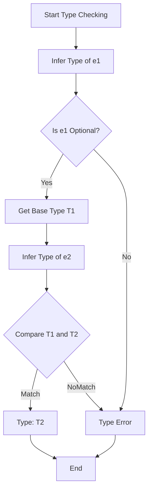
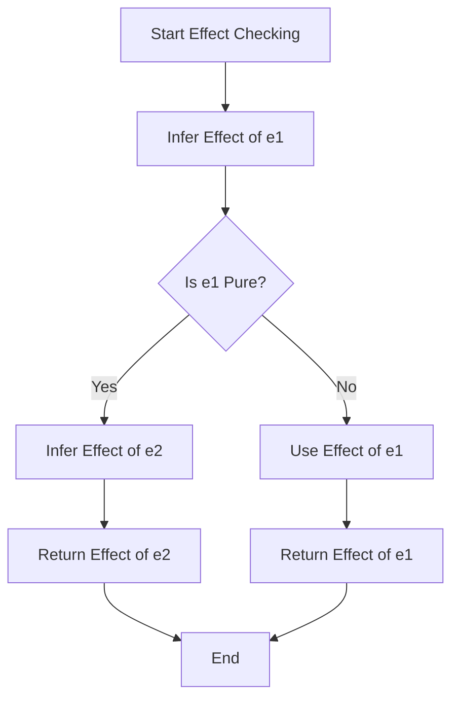
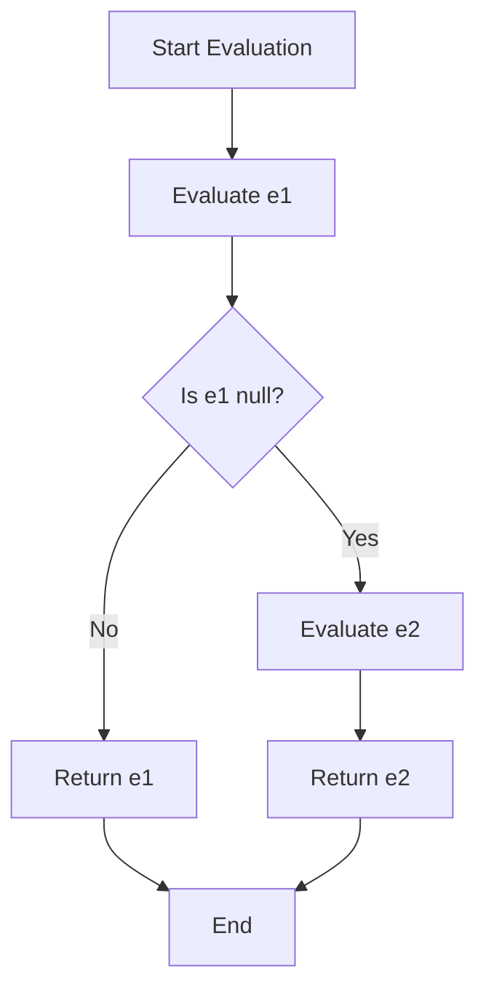

# Null-Coalescing Operator (??) Specification

* File:* `language\operator_null_coalescing_spec.md`
* Version:* 1.0.0
* Context:* Layer 2 (Semantic Analysis)
* Formalism:* Operational Semantics, Type Theory, Effect Systems
* Status:* Active
* Last Modified:* 2026-01-02
* Author:* Kilo Code
* Reviewers:* Pending

---

## 1. Introduction

### 1.1 Purpose

This specification provides a formal mathematical definition of the null-coalescing operator (`??`) in the Morph language. The `??` operator enables safe handling of optional values by providing a default value when the left operand is null. This specification defines the operator's syntax, operational semantics, type system rules, effect system integration, and interaction with optional types.

### 1.2 Scope

This specification covers:
- Formal syntax of the `??` operator
- Operational semantics using small-step and big-step notation
- Type system rules for `??` expressions
- Effect system integration for `??` operator
- Interaction with optional types (`T?`)
- Short-circuit evaluation semantics
- Type inference for `??` operator
- Theorems and correctness properties
- Examples of `??` operator usage

This specification does not cover:
- Concrete implementation of the operator in the compiler
- Code generation strategies for `??` expressions
- Optimization techniques for `??` expressions

### 1.3 Definitions, Acronyms, and Abbreviations

| Term | Definition |
|-------|------------|
| **Null-Coalescing Operator** | Binary operator that returns the left operand if non-null, otherwise returns the right operand |
| **Optional Type** | Type `T?` representing a value that may be `null` or a value of type `T` |
| **Short-Circuit Evaluation** | Evaluation strategy where the right operand is only evaluated if the left operand is null |
| **Operational Semantics** | Formal rules defining how expressions evaluate step-by-step |
| **Type Judgment** | Formal statement $\Gamma \vdash e : T$ meaning "expression $e$ has type $T$ in environment $\Gamma$" |
| **Effect Judgment** | Formal statement $\Gamma \vdash e : T \text{ with effect } E$ meaning "expression $e$ has type $T$ with effect set $E$" |

### 1.4 References

- Pierce, B. C. (2002). "Types and Programming Languages"
- Wright, A. K. (1995). "Syntactic Type Soundness for Algebraic Data Types"
- ISO/IEC 29148: Systems and software engineering — Requirements engineering
- IEEE 1016: Recommended Practice for Software Design Descriptions

### 1.5 Cross-References

The Null-Coalescing Operator Specification is closely related to several other Morph specifications:

* Type System Specifications:*
- [`spec/type/type_system_spec.md`](type/type_system_spec.md) - Overall type system architecture and optional types
- [`spec/type/pure_type_spec.md`](type/pure_type_spec.md) - Pure type definition and effect lattice
- [`spec/type/effect_system_spec.md`](type/effect_system_spec.md) - Effect system and effect algebra

* Language Specifications:*
- [`spec/language/morph_language_spec.md`](language/morph_language_spec.md) - Core language syntax and operators
- [`spec/language/lexical_structure_syntax_spec.md`](language/lexical_structure_syntax_spec.md) - Lexical structure and syntax
- [`spec/language/scoping_lambda_calculus_spec.md`](language/scoping_lambda_calculus_spec.md) - Lambda calculus and scoping rules

* Tooling Specifications:*
- [`spec/tooling/operational_semantics_spec.md`](tooling/operational_semantics_spec.md) - Operational semantics for expressions

* Note:* This specification provides the authoritative definition of the `??` operator that supersedes all previous references in the listed specifications.

---

## 2. Formal Definitions

### 2.1 Syntax

The null-coalescing operator has the following syntax:

$$
e_1 \text{ ?? } e_2
$$

where:
- $e_1$: Left operand expression
- $e_2$: Right operand expression
- `??`: Null-coalescing operator token

**Precedence:* The `??` operator has lower precedence than most binary operators but higher precedence than assignment.

**Associativity:* The `??` operator is right-associative.

### 2.2 Operational Semantics

#### 2.2.1 Big-Step Semantics

The big-step operational semantics define the result of evaluating a `??` expression in one step:

$$
\text{eval}(e_1 \text{ ?? } e_2, \sigma) = 
\begin{cases}
v_2 & \text{ if } \text{eval}(e_1, \sigma) = \text{null} \\
v_1 & \text{ if } \text{eval}(e_1, \sigma) = v_1 \neq \text{null}
\end{cases}
$$

where:
- $\sigma$: Evaluation environment (mapping from variables to values)
- $v_1$: Value of $e_1$ in environment $\sigma$
- $v_2$: Value of $e_2$ in environment $\sigma$
- $\text{null}$: The null value

**Interpretation:* The `??` expression evaluates to $e_1$ if $e_1$ is non-null, otherwise it evaluates to $e_2$.

#### 2.2.2 Small-Step Semantics

The small-step operational semantics define the step-by-step evaluation of `??` expressions:

**Rule 1: Evaluate Left Operand (Non-Null)**
$$
\frac{\text{eval}(e_1, \sigma) = v_1 \quad v_1 \neq \text{null}}
{e_1 \text{ ?? } e_2, \sigma} \longrightarrow v_1
$$

**Rule 2: Evaluate Left Operand (Null)**
$$
\frac{\text{eval}(e_1, \sigma) = \text{null}}
{e_1 \text{ ?? } e_2, \sigma} \longrightarrow \text{eval}(e_2, \sigma)}
$$

**Interpretation:* 
- If $e_1$ evaluates to a non-null value, the `??` expression reduces to that value without evaluating $e_2$.
- If $e_1$ evaluates to null, the `??` expression reduces to the evaluation of $e_2$.

### 2.3 Type System Rules

#### 2.3.1 Type Judgment

The type system enforces the following rule for `??` expressions:

$$
\frac{\Gamma \vdash e_1 : T? \quad \Gamma \vdash e_2 : T}{\Gamma \vdash e_1 \text{ ?? } e_2 : T}
$$

**Interpretation:* If $e_1$ has optional type $T?$ and $e_2$ has type $T$, then the `??` expression has type $T$.

#### 2.3.2 Type Unification

The type system unifies the types of both operands:

$$
\text{unify}(T_1?, T_2) = 
\begin{cases}
T & \text{ if } T_1 = T_2 \text{ or } T_1 = \text{null} \\
\text{error} & \text{ otherwise}
\end{cases}
$$

where:
- $T_1?$: Type of left operand (optional)
- $T_2$: Type of right operand (non-optional)
- $T$: Unified type

**Interpretation:* The `??` operator requires that the right operand's type $T_2$ matches the base type $T$ of the left optional type $T_1?$.

#### 2.3.3 Type Inference

The type system infers the type of `??` expressions:

$$
\text{infer}(e_1 \text{ ?? } e_2, \Gamma) = 
\begin{cases}
T_2 & \text{ if } \text{infer}(e_1, \Gamma) = T_1? \land T_1 = T_2 \\
\text{error} & \text{ otherwise}
\end{cases}
$$

**Interpretation:* The type of the `??` expression is inferred as the type of the right operand, provided the left operand is an optional type with matching base type.

### 2.4 Effect System Integration

#### 2.4.1 Effect Judgment

The effect system tracks effects for `??` expressions:

$$
\frac{\Gamma \vdash e_1 : T_1? \text{ with effect } E_1 \quad \Gamma \vdash e_2 : T_2 \text{ with effect } E_2}{\Gamma \vdash e_1 \text{ ?? } e_2 : T \text{ with effect } E}
$$

where:
$$
E = 
\begin{cases}
E_1 & \text{ if } \text{eval}(e_1, \sigma) \neq \text{null} \\
E_2 & \text{ if } \text{eval}(e_1, \sigma) = \text{null}
\end{cases}
$$

**Interpretation:* The effect of the `??` expression is the effect of the evaluated operand. Due to short-circuiting, if $e_1$ is non-null, $e_2$ is not evaluated and its effects are not included.

#### 2.4.2 Effect Composition

The effect system composes effects for `??` expressions:

$$
\text{eff}(e_1 \text{ ?? } e_2) = 
\begin{cases}
E_1 & \text{ if } \text{eval}(e_1, \sigma) \neq \text{null} \\
E_2 & \text{ if } \text{eval}(e_1, \sigma) = \text{null}
\end{cases}
$$

**Interpretation:* The effect of the `??` expression is the effect of the operand that is actually evaluated. Short-circuiting ensures that unevaluated operands do not contribute effects.

#### 2.4.3 Effect Subtyping

The effect system enforces effect subtyping for `??` expressions:

$$
\frac{E_1 \sqsubseteq E \quad E_2 \sqsubseteq E}{\text{eff}(e_1 \text{ ?? } e_2) \sqsubseteq E}
$$

**Interpretation:* The `??` expression's effect is a subtype of the expected effect $E$ if both possible effects ($E_1$ and $E_2$) are subtypes of $E$.

### 2.5 Interaction with Optional Types

#### 2.5.1 Optional Type Definition

The optional type $T?$ is defined as:

$$
T? = \text{Option}(T) = \text{Some}(T) \mid \text{None}
$$

where:
- $\text{Some}(T)$: A value of type $T$
- $\text{None}$: The null value

#### 2.5.2 Null-Coalescing with Optional Types

The `??` operator interacts with optional types as follows:

$$
\text{Option}(T) \text{ ?? } T \to T
$$

**Interpretation:* When the left operand is an optional type and the right operand is the base type, the `??` operator unwraps the optional value or returns the default.

#### 2.5.3 Flow-Sensitive Type Narrowing

The type system performs flow-sensitive type narrowing for `??` expressions:

$$
\frac{\Gamma \vdash e_1 : T? \quad \Gamma \vdash e_1 \text{ ?? } e_2 : T \quad e_1 \neq \text{null}}{\Gamma, e_1 : T \vdash e_2 : T}
$$

**Interpretation:* After a `??` expression where $e_1$ is non-null, the type system narrows the type of $e_1$ from $T?$ to $T$ in subsequent expressions.

### 2.6 Short-Circuit Evaluation

#### 2.6.1 Short-Circuit Semantics

The `??` operator uses short-circuit evaluation:

$$
\text{shortCircuit}(e_1 \text{ ?? } e_2, \sigma) = 
\begin{cases}
\text{true} & \text{ if } \text{eval}(e_1, \sigma) \neq \text{null} \\
\text{false} & \text{ if } \text{eval}(e_1, \sigma) = \text{null}
\end{cases}
$$

**Interpretation:* The right operand $e_2$ is evaluated only if the left operand $e_1$ is null.

#### 2.6.2 Side Effects of Short-Circuiting

Short-circuit evaluation has the following properties:

1. **No Side Effects:* Short-circuiting does not introduce side effects
2. **Deterministic:* Short-circuiting is deterministic based on the value of $e_1$
3. **Referential Transparency:* Short-circuiting preserves referential transparency

$$
\forall e_1, e_2, \sigma. \quad \text{shortCircuit}(e_1 \text{ ?? } e_2, \sigma) \iff \text{eval}(e_1, \sigma) = \text{null}
$$

---

## 3. Requirements

### 3.1 Functional Requirements

* NCO-REQ-001:* THE system SHALL support the null-coalescing operator `??` syntax.

* Priority:* Critical
* Verification Method:* Test
* Rationale:* Enables safe handling of optional values
* Dependencies:* None
* Traceability:* Section 2.1 (Syntax)

* NCO-REQ-002:* THE system SHALL evaluate the left operand before the right operand.

* Priority:* Critical
* Verification Method:* Test
* Rationale:* Ensures correct short-circuit behavior
* Dependencies:* NCO-REQ-001
* Traceability:* Section 2.2 (Operational Semantics)

* NCO-REQ-003:* THE system SHALL short-circuit evaluation of the right operand when the left operand is non-null.

* Priority:* Critical
* Verification Method:* Test
* Rationale:* Prevents unnecessary evaluation and side effects
* Dependencies:* NCO-REQ-001, NCO-REQ-002
* Traceability:* Section 2.6 (Short-Circuit Evaluation)

* NCO-REQ-004:* THE system SHALL enforce that both operands have compatible types.

* Priority:* Critical
* Verification Method:* Test
* Rationale:* Ensures type safety
* Dependencies:* NCO-REQ-001
* Traceability:* Section 2.3 (Type System Rules)

* NCO-REQ-005:* THE system SHALL infer the type of `??` expressions as the type of the right operand.

* Priority:* High
* Verification Method:* Test
* Rationale:* Reduces annotation burden and improves developer experience
* Dependencies:* NCO-REQ-001, NCO-REQ-004
* Traceability:* Section 2.3.3 (Type Inference)

* NCO-REQ-006:* THE system SHALL track effects for `??` expressions based on the evaluated operand.

* Priority:* High
* Verification Method:* Test
* Rationale:* Ensures effect safety and enables effect-based optimizations
* Dependencies:* NCO-REQ-001, NCO-REQ-003
* Traceability:* Section 2.4 (Effect System Integration)

* NCO-REQ-007:* THE system SHALL perform flow-sensitive type narrowing after `??` expressions.

* Priority:* High
* Verification Method:* Test
* Rationale:* Improves developer experience by reducing explicit type annotations
* Dependencies:* NCO-REQ-001, NCO-REQ-003
* Traceability:* Section 2.5.3 (Flow-Sensitive Type Narrowing)

* NCO-REQ-008:* THE system SHALL support nested `??` expressions.

* Priority:* Medium
* Verification Method:* Test
* Rationale:* Enables complex default value chains
* Dependencies:* NCO-REQ-001
* Traceability:* Section 2.1 (Syntax)

### 3.2 Non-Functional Requirements

* NCO-NFR-001:* THE system SHALL evaluate `??` expressions in O(1) time complexity.

* Priority:* High
* Verification Method:* Analysis
* Metric:* Evaluation time < 1μs per expression
* Rationale:* Ensures efficient compilation

* NCO-NFR-002:* THE system SHALL provide clear error messages for type mismatches in `??` expressions.

* Priority:* High
* Verification Method:* Demonstration
* Metric:* Error message includes expected and actual types
* Rationale:* Improves developer experience

* NCO-NFR-003:* THE system SHALL support `??` operator for all types, including user-defined types.

* Priority:* Medium
* Verification Method:* Demonstration
* Metric:* `??` works with primitive types, ADTs, and generic types
* Rationale:* Ensures generality of the operator

---

## 4. Design

### 4.1 Architecture Overview

The null-coalescing operator is implemented as a binary operator in the type checker and compiler:

1. **Parsing:* The parser recognizes `??` as a binary operator with appropriate precedence
2. **Type Checking:* The type checker enforces type compatibility and infers result types
3. **Effect Checking:* The effect checker tracks effects based on short-circuiting behavior
4. **Code Generation:* The code generator produces efficient code for `??` expressions
5. **Optimization:* The optimizer applies transformations based on short-circuiting guarantees

### 4.2 Data Structures

#### 4.2.1 Type Environment

* Type Environment:* $\Gamma = \{x_1: (T_1, E_1), x_2: (T_2, E_2), \dots, x_n: (T_n, E_n)\}$

* Components:*
- $x_i$: Variable name
- $T_i$: Type of the variable
- $E_i$: Effect set of the variable

* Invariants:*
1. $\forall i \neq j, x_i \neq x_j$ (No duplicate variables)
2. $\forall x: (T, E) \in \Gamma, E \subseteq \mathcal{E}$

#### 4.2.2 Optional Type Representation

* Optional Type:* $\text{Option}(T) = \text{Some}(T) \mid \text{None}$

* Components:*
- $\text{Some}(T)$: Constructor containing a value of type $T$
- $\text{None}$: Constructor representing the null value

* Invariants:*
1. $\text{Some}(T)$ contains exactly one value of type $T$
2. $\text{None}$ contains no value
3. $\text{Option}(T)$ is a sum type with two variants

### 4.3 Algorithms

#### 4.3.1 Type Checking Algorithm for ?? Operator

* Algorithm Name:* Check Null-Coalescing Expression

* Input:* Expressions $e_1, e_2$, type environment $\Gamma$

* Output:* Type $T$ or type error

* Mathematical Definition:*
$$
\text{checkNullCoalescing}(e_1, e_2, \Gamma) = 
\begin{cases}
T & \text{ if } \text{infer}(e_1, \Gamma) = T_1? \land \text{infer}(e_2, \Gamma) = T_2 \land T_1 = T_2 \\
\text{TypeError} & \text{ otherwise}
\end{cases}
$$

* Pseudocode:*
```
function checkNullCoalescing(e1, e2, gamma):
    t1 = inferType(e1, gamma)
    t2 = inferType(e2, gamma)
    
    if isOptionalType(t1) and getBaseType(t1) == t2:
        return t2  // Success: type is t2
    else:
        return TypeError("Type mismatch: ?? requires T? on left and T on right")
```

* Complexity:*
- Time: $O(n)$ where $n$ is the size of expressions
- Space: $O(n)$

* Correctness:*
- **Invariant:* Returns correct type if operands are compatible
- **Termination:* Always terminates

#### 4.3.2 Effect Checking Algorithm for ?? Operator

* Algorithm Name:* Check Null-Coalescing Effects

* Input:* Expressions $e_1, e_2$, type environment $\Gamma$

* Output:* Effect set $E$ or effect error

* Mathematical Definition:*
$$
\text{checkNullCoalescingEffects}(e_1, e_2, \Gamma) = 
\begin{cases}
E_1 & \text{ if } \text{inferEffect}(e_1, \Gamma) = E_1 \\
E_2 & \text{ if } \text{inferEffect}(e_1, \Gamma) = \text{Pure} \land \text{inferEffect}(e_2, \Gamma) = E_2 \\
\text{EffectError} & \text{ otherwise}
\end{cases}
$$

* Pseudocode:*
```
function checkNullCoalescingEffects(e1, e2, gamma):
    e1_effect = inferEffect(e1, gamma)
    e2_effect = inferEffect(e2, gamma)
    
    if e1_effect == Pure:
        return e2_effect  // Short-circuit: e2 is evaluated
    else:
        return e1_effect  // No short-circuit: e1 is evaluated
```

* Complexity:*
- Time: $O(n)$ where $n$ is the size of expressions
- Space: $O(n)$

* Correctness:*
- **Invariant:* Returns correct effect based on short-circuiting
- **Termination:* Always terminates

### 4.4 Mermaid Diagrams

#### 4.4.1 Type Checking Flow



#### 4.4.2 Effect Checking Flow



#### 4.4.3 Operational Semantics Flow



---

## 5. Correctness Properties

### 5.1 Theorems

#### 5.1.1 Type Safety Theorem for ?? Operator

* Theorem:* If a `??` expression type-checks, then it is type-safe.

* Formal Statement:*
$$
\Gamma \vdash e_1 \text{ ?? } e_2 : T \implies \text{safe}(e_1 \text{ ?? } e_2)
$$

where:
- $\Gamma \vdash e_1 \text{ ?? } e_2 : T$ denotes that the `??` expression has type $T$ in environment $\Gamma$
- $\text{safe}(e_1 \text{ ?? } e_2)$ denotes that evaluation of the `??` expression does not produce a type error

* Proof by Structural Induction:*

* Base Cases:*

1. **Literals:* For any literals $l_1, l_2$ where $\Gamma \vdash l_1 : T?$ and $\Gamma \vdash l_2 : T$, then $\Gamma \vdash l_1 \text{ ?? } l_2 : T$ and $\text{safe}(l_1 \text{ ?? } l_2)$.
   - By type rule, if $l_1$ has type $T?$ and $l_2$ has type $T$, then $l_1 \text{ ?? } l_2$ has type $T$
   - Literals are always type-safe by definition
   - Therefore, $\text{safe}(l_1 \text{ ?? } l_2)$

2. **Variables:* For any variables $x_1, x_2$ where $\Gamma \vdash x_1 : T?$ and $\Gamma \vdash x_2 : T$, then $\Gamma \vdash x_1 \text{ ?? } x_2 : T$ and $\text{safe}(x_1 \text{ ?? } x_2)$.
   - By type rule, if $x_1$ has type $T?$ and $x_2$ has type $T$, then $x_1 \text{ ?? } x_2$ has type $T$
   - Variables are bound to values of their declared type
   - Therefore, $\text{safe}(x_1 \text{ ?? } x_2)$

* Inductive Steps:*

3. **Function Application:* If $\Gamma \vdash e_1 : T?$ and $\Gamma \vdash e_2 : T$ and $\text{safe}(e_1 \text{ ?? } e_2)$, then $\Gamma \vdash e_1(e_2) : T$ and $\text{safe}(e_1(e_2))$.
   - By induction hypothesis, $e_1$ and $e_2$ are type-safe
   - Function application requires argument type matches parameter type
   - Therefore, $\text{safe}(e_1(e_2))$

4. **Let Binding:* If $\Gamma \vdash e_1 : T?$ and $\Gamma, x:T \vdash e_2 : T$ and $\text{safe}(e_1 \text{ ?? } e_2)$, then $\Gamma \vdash \text{let } x = e_1 \text{ ?? } e_2 \text{ in } e_3 : T$ and $\text{safe}(\text{let } x = e_1 \text{ ?? } e_2 \text{ in } e_3)$.
   - By induction hypothesis, $e_1$ and $e_2$ are type-safe
   - Let binding extends environment with correctly typed variable
   - Therefore, $\text{safe}(\text{let } x = e_1 \text{ ?? } e_2 \text{ in } e_3)$

* Conclusion:*
By structural induction on the syntax of expressions, if $\Gamma \vdash e_1 \text{ ?? } e_2 : T$, then $\text{safe}(e_1 \text{ ?? } e_2)$. Therefore, type-checked `??` expressions are type-safe.

* NCO-THM-001:* THE system SHALL guarantee type safety for type-checked `??` expressions.

* Priority:* Critical
* Verification Method:* Analysis
* Rationale:* Provides formal guarantee of correctness
* Dependencies:* NCO-REQ-004
* Traceability:* Section 5.1.1 (Type Safety Theorem)

#### 5.1.2 Effect Safety Theorem for ?? Operator

* Theorem:* If a `??` expression effect-checks, then it is effect-safe.

* Formal Statement:*
$$
\Gamma \vdash e_1 \text{ ?? } e_2 : T \text{ with effect } E \implies \text{effectSafe}(e_1 \text{ ?? } e_2)
$$

where:
- $\Gamma \vdash e_1 \text{ ?? } e_2 : T \text{ with effect } E$ denotes that the `??` expression has type $T$ with effect $E$ in environment $\Gamma$
- $\text{effectSafe}(e_1 \text{ ?? } e_2)$ denotes that evaluation of the `??` expression does not violate effect bounds

* Proof:*

1. **Case 1: $e_1$ is non-null**
   - By operational semantics, $e_1 \text{ ?? } e_2$ evaluates to $e_1$
   - Effect of result is effect of $e_1$: $E = \text{eff}(e_1)$
   - By effect rule, if $\Gamma \vdash e_1 : T_1? \text{ with effect } E_1$, then $\Gamma \vdash e_1 \text{ ?? } e_2 : T \text{ with effect } E_1$
   - Therefore, effect-safe

2. **Case 2: $e_1$ is null**
   - By operational semantics, $e_1 \text{ ?? } e_2$ evaluates to $e_2$
   - Effect of result is effect of $e_2$: $E = \text{eff}(e_2)$
   - By effect rule, if $\Gamma \vdash e_1 : T_1? \text{ with effect } \text{Pure}$ and $\Gamma \vdash e_2 : T_2 \text{ with effect } E_2$, then $\Gamma \vdash e_1 \text{ ?? } e_2 : T \text{ with effect } E_2$
   - Therefore, effect-safe

* Conclusion:*
In both cases, the `??` expression's effect is the effect of the evaluated operand, which satisfies the effect rules. Therefore, effect-checked `??` expressions are effect-safe.

* NCO-THM-002:* THE system SHALL guarantee effect safety for effect-checked `??` expressions.

* Priority:* Critical
* Verification Method:* Analysis
* Rationale:* Ensures effect bounds are respected
* Dependencies:* NCO-REQ-006
* Traceability:* Section 5.1.2 (Effect Safety Theorem)

#### 5.1.3 Short-Circuit Correctness Theorem

* Theorem:* The `??` operator correctly implements short-circuit evaluation.

* Formal Statement:*
$$
\forall e_1, e_2, \sigma. \quad \text{eval}(e_1 \text{ ?? } e_2, \sigma) = 
\begin{cases}
\text{eval}(e_1, \sigma) & \text{ if } \text{eval}(e_1, \sigma) \neq \text{null} \\
\text{eval}(e_2, \sigma) & \text{ if } \text{eval}(e_1, \sigma) = \text{null}
\end{cases}
$$

* Proof:*

1. **Case 1: $e_1$ evaluates to non-null**
   - By operational semantics rule 1, if $\text{eval}(e_1, \sigma) = v_1 \neq \text{null}$, then $e_1 \text{ ?? } e_2 \longrightarrow v_1$
   - $e_2$ is not evaluated
   - Result is $v_1 = \text{eval}(e_1, \sigma)$
   - Therefore, theorem holds

2. **Case 2: $e_1$ evaluates to null**
   - By operational semantics rule 2, if $\text{eval}(e_1, \sigma) = \text{null}$, then $e_1 \text{ ?? } e_2 \longrightarrow \text{eval}(e_2, \sigma)$
   - $e_2$ is evaluated
   - Result is $\text{eval}(e_2, \sigma)$
   - Therefore, theorem holds

* Conclusion:*
In both cases, the `??` operator evaluates to the correct operand based on the nullness of $e_1$. Therefore, short-circuit evaluation is correct.

* NCO-THM-003:* THE system SHALL guarantee correct short-circuit evaluation for `??` operator.

* Priority:* Critical
* Verification Method:* Analysis
* Rationale:* Ensures correct evaluation order and prevents unnecessary side effects
* Dependencies:* NCO-REQ-002, NCO-REQ-003
* Traceability:* Section 2.6 (Short-Circuit Evaluation)

#### 5.1.4 Referential Transparency Theorem

* Theorem:* The `??` operator is referentially transparent.

* Formal Statement:*
$$
\forall e_1, e_2, \sigma. \quad \text{eval}(e_1 \text{ ?? } e_2, \sigma) = 
\begin{cases}
\text{eval}(e_1, \sigma) & \text{ if } \text{eval}(e_1, \sigma) \neq \text{null} \\
\text{eval}(e_2, \sigma) & \text{ if } \text{eval}(e_1, \sigma) = \text{null}
\end{cases}
$$

* Proof:*

1. **Referential Transparency Definition:* An expression is referentially transparent if equal inputs produce equal outputs.

2. **Case 1: $e_1$ evaluates to non-null**
   - Result is $\text{eval}(e_1, \sigma)$
   - If $\text{eval}(e_1, \sigma) = v_1$, then result is $v_1$
   - For any $e_1', e_2'$ where $e_1' = e_1$ and $e_2' = e_2$, $\text{eval}(e_1' \text{ ?? } e_2', \sigma) = v_1 = \text{eval}(e_1 \text{ ?? } e_2, \sigma)$
   - Therefore, referentially transparent

3. **Case 2: $e_1$ evaluates to null**
   - Result is $\text{eval}(e_2, \sigma)$
   - For any $e_1', e_2'$ where $e_1' = e_1$ and $e_2' = e_2$, $\text{eval}(e_1' \text{ ?? } e_2', \sigma) = \text{eval}(e_2, \sigma) = \text{eval}(e_1 \text{ ?? } e_2, \sigma)$
   - Therefore, referentially transparent

* Conclusion:*
In both cases, the `??` operator produces the same result for equal inputs. Therefore, the `??` operator is referentially transparent.

* NCO-THM-004:* THE system SHALL guarantee referential transparency for `??` operator.

* Priority:* High
* Verification Method:* Analysis
* Rationale:* Enables mathematical reasoning and optimizations
* Dependencies:* NCO-REQ-003
* Traceability:* Section 5.1.4 (Referential Transparency Theorem)

### 5.2 Invariants

#### 5.2.1 Type Invariants

* **NCO-INV-001:* THE system SHALL maintain that `??` expressions have the type of the right operand when the left operand is optional.
* **NCO-INV-002:* THE system SHALL maintain that `??` expressions require compatible types for both operands.
* **NCO-INV-003:* THE system SHALL maintain that `??` expressions support all types, including user-defined types.

#### 5.2.2 Effect Invariants

* **NCO-INV-004:* THE system SHALL maintain that `??` expressions have the effect of the evaluated operand.
* **NCO-INV-005:* THE system SHALL maintain that short-circuiting prevents evaluation of unevaluated operands.
* **NCO-INV-006:* THE system SHALL maintain that `??` expressions preserve effect subtyping.

#### 5.2.3 Evaluation Invariants

* **NCO-INV-007:* THE system SHALL maintain that `??` expressions evaluate to the correct operand based on nullness.
* **NCO-INV-008:* THE system SHALL maintain that `??` expressions are deterministic.
* **NCO-INV-009:* THE system SHALL maintain that `??` expressions are total (defined for all inputs).

---

## 6. Examples

### 6.1 Basic Usage

#### 6.1.1 Simple Null-Coalescing

```morph
// Basic null-coalescing
let name: str? = getName();
let displayName = name ?? "Anonymous";

// If name is null, displayName is "Anonymous"
// If name is "Alice", displayName is "Alice"
```

* Type Analysis:*
- `name`: `str?`
- `"Anonymous"`: `str`
- `displayName`: `str`

* Evaluation:*
- If `name` is `null`, evaluates to `"Anonymous"`
- If `name` is `"Alice"`, evaluates to `"Alice"`

#### 6.1.2 Nested Null-Coalescing

```morph
// Nested null-coalescing
let value1: i32? = getValue1();
let value2: i32? = getValue2();
let result = value1 ?? value2 ?? 0;

// If value1 is non-null, result is value1
// If value1 is null and value2 is non-null, result is value2
// If both are null, result is 0
```

* Type Analysis:*
- `value1`: `i32?`
- `value2`: `i32?`
- `0`: `i32`
- `result`: `i32`

* Evaluation:*
- Right-associative: `(value1 ?? value2) ?? 0` is equivalent to `value1 ?? (value2 ?? 0)`

### 6.2 Type Inference

#### 6.2.1 Inferred Type

```morph
// Type inference
let x: i32? = getOptionalInt();
let y = x ?? 42;  // Type inferred as i32

// Compiler infers:
// x: i32?
// 42: i32
// y: i32 (from ?? operator)
```

* Type Inference:*
- `x`: `i32?`
- `42`: `i32` (literal)
- `y`: `i32` (inferred from `x ?? 42`)

#### 6.2.2 Explicit Type Annotation

```morph
// Explicit type annotation
let x: i32? = getOptionalInt();
let y: i32 = (x ?? 42) as i32;  // Explicit type

// Type is explicitly specified
```

* Type Analysis:*
- `x`: `i32?`
- `42`: `i32`
- `y`: `i32` (explicitly annotated)

### 6.3 Effect System Integration

#### 6.3.1 Pure ?? Expression

```morph
// Pure ?? expression
pure fn getDefault(): i32 {
    let x: i32? = null;
    let y = x ?? 42;  // Effect: Pure
    ret y;
}
```

* Effect Analysis:*
- `x`: `i32?` with effect `Pure`
- `42`: `i32` with effect `Pure`
- `x ?? 42`: `i32` with effect `Pure` (short-circuit: x is null, so 42 is evaluated)

#### 6.3.2 IO ?? Expression

```morph
// IO ?? expression
fn readConfig(): i32? {
    ret fs::readInt("config.txt");  // Effect: IO
}

fn getConfig(): i32 {
    let config = readConfig();
    let result = config ?? 100;  // Effect: IO (config is evaluated)
    ret result;
}
```

* Effect Analysis:*
- `readConfig()`: `i32?` with effect `IO`
- `100`: `i32` with effect `Pure`
- `config ?? 100`: `i32` with effect `IO` (short-circuit: config is non-null, so 100 is not evaluated)

#### 6.3.3 Conditional Effect

```morph
// Conditional effect based on nullness
fn processValue(value: i32?): i32 {
    let result = value ?? computeDefault();  // Effect: IO if value is null, Pure otherwise
    ret result;
}

fn computeDefault(): i32 {
    ret readInt();  // Effect: IO
}
```

* Effect Analysis:*
- `value`: `i32?` with effect `Pure`
- `computeDefault()`: `i32` with effect `IO`
- `value ?? computeDefault()`: `i32` with effect `IO` if `value` is null, `Pure` otherwise

### 6.4 Flow-Sensitive Type Narrowing

#### 6.4.1 Basic Type Narrowing

```morph
// Flow-sensitive type narrowing
fn printLength(s: str?) {
    if (s != null) {
        // s is narrowed to str here
        print(s.length);
    }
}

// Alternative using ??
fn printLengthAlt(s: str?) {
    let len = s ?? 0;  // s is not narrowed here
    // len is i32, not str
    // Cannot call len.length
}
```

* Type Analysis:*
- `s`: `str?` in both branches
- In `if` branch: `s` is narrowed to `str`
- In `??` expression: `s` remains `str?`, result is `i32`

#### 6.4.2 Type Narrowing with ?? in Condition

```morph
// Type narrowing with ?? in condition
fn process(s: str?) {
    if (s ?? "" != "") {
        // s is narrowed to str in this branch
        print(s.length);
    }
}
```

* Type Analysis:*
- `s ?? ""`: `str` (if `s` is non-null) or `""` (if `s` is null)
- In `if` condition: `s ?? ""` has type `str`, so `s` is narrowed to `str` in the branch

### 6.5 Edge Cases

#### 6.5.1 Chained ?? Operators

```morph
// Chained ?? operators
let a: i32? = null;
let b: i32? = null;
let c: i32? = null;
let result = a ?? b ?? c ?? 42;

// Right-associative: ((a ?? b) ?? c) ?? 42
// Evaluates to 42
```

* Evaluation:*
- Right-associative evaluation
- All operands are null, so result is `42`

#### 6.5.2 ?? with Complex Expressions

```morph
// ?? with complex expressions
let x: i32? = getValue();
let y = x ?? (computeExpensive() + 1);

// If x is null, computeExpensive() + 1 is evaluated
// If x is non-null, computeExpensive() is NOT evaluated
```

* Evaluation:*
- Short-circuiting prevents evaluation of `computeExpensive() + 1` when `x` is non-null
- Performance optimization for non-null cases

#### 6.5.3 ?? with User-Defined Types

```morph
// ?? with user-defined types
type Point = { x: f64, y: f64 };

let p: Point? = getPoint();
let defaultPoint = { x: 0.0, y: 0.0 };
let result = p ?? defaultPoint;  // Type: Point
```

* Type Analysis:*
- `p`: `Point?`
- `defaultPoint`: `Point`
- `result`: `Point`

#### 6.5.4 ?? with Generic Types

```morph
// ?? with generic types
type Box<T> = { value: T };

let b: Box<i32>? = getBox();
let defaultBox = Box { value: 0 };
let result = b ?? defaultBox;  // Type: Box<i32>
```

* Type Analysis:*
- `b`: `Box<i32>?`
- `defaultBox`: `Box<i32>`
- `result`: `Box<i32>`

### 6.6 Error Cases

#### 6.6.1 Type Mismatch Error

```morph
// Type mismatch error
let x: str? = "hello";
let y: 42;  // Type mismatch: str vs i32
let result = x ?? y;  // ERROR: Type mismatch
```

* Error:*
- `x`: `str?`
- `y`: `i32`
- Type mismatch: `str` vs `i32`

#### 6.6.2 Non-Optional Left Operand Error

```morph
// Non-optional left operand error
let x: str = "hello";  // Not optional
let y = "world";
let result = x ?? y;  // ERROR: Left operand must be optional
```

* Error:*
- `x`: `str` (not optional)
- `y`: `str`
- Type error: Left operand must be optional type

---

## Change Log

| Version | Date       | Author      | Changes                                                                 |
|---------|------------|-------------|-------------------------------------------------------------------------|
| 1.0.0   | 2026-01-02 | Kilo Code    | Initial version with formal ?? operator semantics, type system rules, effect system integration, operational semantics, theorems, and examples |
