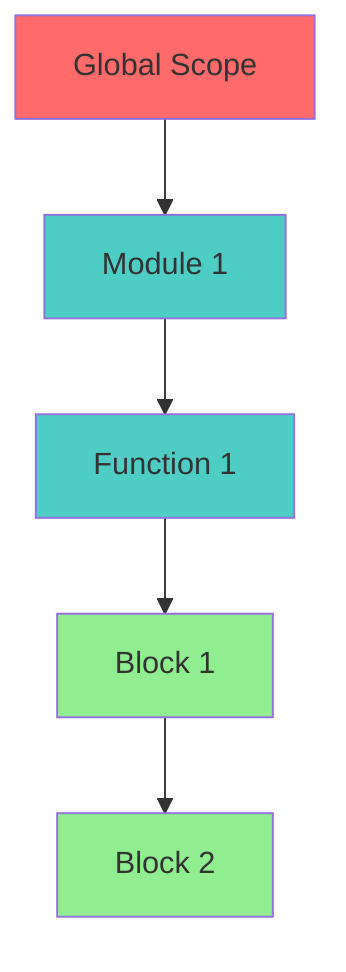
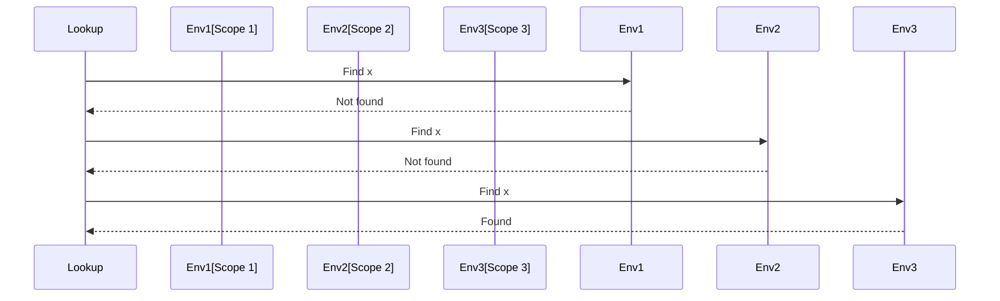
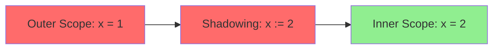

# Scoping & Environment Specification

* File:* `language\scoping_lambda_calculus_spec.md`
* Version:* 1.0.0
* Context:* Layer 2 (Semantic Analysis) - Resolver
* Formalism:* $\lambda$-calculus with Environments
* Status:* Active
* Last Modified:* 2026-01-01
* Author:* Kilo Code
* Reviewers:* Pending

- -

## 1. Introduction

### 1.1 Purpose

This specification formalizes the **Scoping System** using **$\lambda$-calculus with Environments**, providing mathematical foundation for variable resolution, visibility rules, and shadowing semantics. This formalization enables the Morph compiler to guarantee that variables are resolved correctly and that visibility rules are enforced.

### 1.2 Scope

This specification covers:
- Environment definition and structure
- Lookup operation semantics
- Visibility predicates (Private, Pub, Pub(Global))
- Shadowing semantics (Walrus `:=`)
- Module and package scoping

This specification does not cover:
- Concrete implementation of resolver
- Performance optimization details
- Macro expansion

### 1.3 Definitions, Acronyms, and Abbreviations

| Term | Definition |
|-------|------------|
| **Environment** | Mapping from names to symbols |
| **Scope** | Lexical context for variable resolution |
| **Lookup** | Operation to find symbol in environment |
| **Visibility** | Access control for symbols |
| **Shadowing** | Creating new binding that hides outer binding |
| **Walrus** | Morph operator for shadowing (`:=`) |
| **$\rho$** | Environment variable in formal notation |

### 1.4 References

- Pierce, B. C. (2002). "Types and Programming Languages"
- IEEE 1016: Recommended Practice for Software Design Descriptions
- ISO/IEC 29148: Systems and software engineering — Requirements engineering

- -

## 2. Formal Definitions

### 2.1 The Environment ($\rho$)

The Semantic Tree is modeled as a nested set of Environments (Scopes).
$$ \rho : \text{Name} \to \text{Symbol} $$

* SC-INV-001:* THE system SHALL define Environment as mapping from names to symbols.

* SC-REQ-001:* THE system SHALL maintain nested environments for scoping.

* Priority:* Critical
* Verification Method:* Test
* Rationale:* Enables lexical scoping
* Dependencies:* SC-INV-001
* Traceability:* Section 2.1 (The Environment)

#### 2.1.1 Environment Structure

* Environment:* $\rho = (\text{Parent}, \text{Bindings})$

* Components:*
- Parent environment $\rho_{parent}$
- Bindings map $\text{Bindings}: \text{Name} \to \text{Symbol}$

* Invariants:*
1. Parent forms a chain to global scope
2. Bindings are unique within scope

### 2.2 The Lookup Operation

Defining the scope of a variable $x$:

$$ \text{Lookup}(x, \rho) = \begin{cases} \rho(x) & \text{if } x \in \text{dom}(\rho) \\ \text{Lookup}(x, \text{Parent}(\rho)) & \text{if } \text{Parent}(\rho) \neq \bot \\ \text{Error} & \text{otherwise} \end{cases} $$

* SC-INV-002:* THE system SHALL define lookup operation with parent traversal.

* SC-REQ-002:* THE system SHALL traverse parent chain for lookup.

* Priority:* Critical
* Verification Method:* Test
* Rationale:* Enables lexical scoping
* Dependencies:* SC-INV-002
* Traceability:* Section 2.2 (The Lookup Operation)

* SC-THM-001:* THE system SHALL guarantee that lookup finds innermost binding.

* Priority:* Critical
* Verification Method:* Analysis
* Rationale:* Ensures correct shadowing behavior
* Dependencies:* SC-INV-002
* Traceability:* Section 2.2 (The Lookup Operation)

### 2.3 Visibility Predicates

Morph adds a visibility function $V(s, \text{Context})$ to the lookup.

* SC-INV-003:* THE system SHALL define visibility predicates for symbols.

* SC-REQ-003:* THE system SHALL enforce visibility rules during lookup.

* Priority:* Critical
* Verification Method:* Test
* Rationale:* Enables access control
* Dependencies:* SC-INV-003
* Traceability:* Section 2.3 (Visibility Predicates)

#### 2.3.1 Visibility Levels

- **Private:* Visible iff $\text{Module}(\text{Context}) = \text{Module}(s)$.
- **Pub(Package):* Visible iff $\text{Package}(\text{Context}) = \text{Package}(s)$.
- **Pub(Global):* Always visible.

* SC-INV-004:* THE system SHALL define three visibility levels.

* SC-REQ-004:* THE system SHALL enforce visibility rules for all symbols.

* Priority:* Critical
* Verification Method:* Test
* Rationale:* Enables module encapsulation
* Dependencies:* SC-INV-004
* Traceability:* Section 2.3.1 (Visibility Levels)

#### 2.3.2 Visibility Function

$$ V(s, \text{Context}) = \begin{cases} \text{True} & \text{if } \text{Visibility}(s) = \text{Pub(Global)} \\ \text{True} & \text{if } \text{Visibility}(s) = \text{Pub(Package)} \land \text{Package}(\text{Context}) = \text{Package}(s) \\ \text{True} & \text{if } \text{Visibility}(s) = \text{Private} \land \text{Module}(\text{Context}) = \text{Module}(s) \\ \text{False} & \text{otherwise} \end{cases} $$

* SC-THM-002:* THE system SHALL guarantee that visibility is enforced correctly.

* Priority:* Critical
* Verification Method:* Analysis
* Rationale:* Ensures proper encapsulation
* Dependencies:* SC-INV-003, SC-INV-004
* Traceability:* Section 2.3.2 (Visibility Function)

### 2.4 Shadowing Semantics (The Walrus `:=`)

The operation `x := v` implies the creation of a new environment $\rho'$.

$$ \rho' = \rho[x \mapsto v] $$

This formalized shadowing ensures that `x` refers to the *new* binding in the continuation, preventing accidental mutation of outer `x` (which would be `x = v` in a mutable environment).

* SC-INV-005:* THE system SHALL define shadowing semantics for Walrus operator.

* SC-REQ-005:* THE system SHALL create new environment for shadowing.

* Priority:* Critical
* Verification Method:* Test
* Rationale:* Enables safe variable rebinding
* Dependencies:* SC-INV-005
* Traceability:* Section 2.4 (Shadowing Semantics)

* SC-THM-003:* THE system SHALL guarantee that shadowing creates new binding.

* Priority:* Critical
* Verification Method:* Analysis
* Rationale:* Prevents accidental mutation
* Dependencies:* SC-INV-005
* Traceability:* Section 2.4 (Shadowing Semantics)

- -

## 3. Requirements

### 3.1 Functional Requirements

* SC-REQ-006:* THE system SHALL support nested environments.

* Priority:* Critical
* Verification Method:* Test
* Rationale:* Enables lexical scoping
* Dependencies:* SC-INV-001
* Traceability:* Section 2.1 (The Environment)

* SC-REQ-007:* THE system SHALL support lookup with parent traversal.

* Priority:* Critical
* Verification Method:* Test
* Rationale:* Enables variable resolution
* Dependencies:* SC-INV-002
* Traceability:* Section 2.2 (The Lookup Operation)

* SC-REQ-008:* THE system SHALL support Private visibility.

* Priority:* Critical
* Verification Method:* Test
* Rationale:* Enables module encapsulation
* Dependencies:* SC-INV-004
* Traceability:* Section 2.3.1 (Visibility Levels)

* SC-REQ-009:* THE system SHALL support Pub(Package) visibility.

* Priority:* High
* Verification Method:* Test
* Rationale:* Enables package-level exports
* Dependencies:* SC-INV-004
* Traceability:* Section 2.3.1 (Visibility Levels)

* SC-REQ-010:* THE system SHALL support Pub(Global) visibility.

* Priority:* High
* Verification Method:* Test
* Rationale:* Enables global exports
* Dependencies:* SC-INV-004
* Traceability:* Section 2.3.1 (Visibility Levels)

* SC-REQ-011:* THE system SHALL support shadowing with Walrus operator.

* Priority:* Critical
* Verification Method:* Test
* Rationale:* Enables safe variable rebinding
* Dependencies:* SC-INV-005
* Traceability:* Section 2.4 (Shadowing Semantics)

### 3.2 Non-Functional Requirements

* SC-NFR-001:* THE system SHALL resolve variables in O(n) time for n scopes.

* Priority:* High
* Verification Method:* Performance test
* Metric:* Lookup < 1ms for 100 scopes
* Rationale:* Ensures fast compilation
* Dependencies:* None
* Traceability:* Section 2.2 (The Lookup Operation)

* SC-NFR-002:* THE system SHALL support up to 1000 nested scopes.

* Priority:* Medium
* Verification Method:* Stress test
* Metric:* 1000 scopes
* Rationale:* Supports deeply nested code
* Dependencies:* None
* Traceability:* Section 2.1 (The Environment)

- -

## 4. Design

### 4.1 Architecture Overview

The Scoping Engine is implemented as a compiler component that:
1. Maintains nested environments
2. Performs lookup with parent traversal
3. Enforces visibility rules
4. Handles shadowing semantics
5. Reports undefined variable errors

### 4.2 Data Structures

#### 4.2.1 Environment

* Environment:* $\rho = (\text{Parent}, \text{Bindings})$

* Components:*
- Parent environment pointer
- Bindings map

* Invariants:*
1. Parent chain terminates at global scope
2. Bindings are unique within scope

#### 4.2.2 Symbol

* Symbol:* $S = (\text{Name}, \text{Type}, \text{Visibility}, \text{Module}, \text{Package})$

* Components:*
- Symbol name
- Symbol type
- Visibility level
- Defining module
- Defining package

* Invariants:*
1. Name is unique within scope
2. Visibility is one of Private, Pub(Package), Pub(Global)

### 4.3 Algorithms

#### 4.3.1 Lookup Algorithm

* Algorithm Name:* Lookup Symbol

* Input:* Symbol name $x$, Current environment $\rho$

* Output:* Symbol or Error

* Mathematical Definition:*
$$
\text{Lookup}(x, \rho) = \begin{cases} \rho(x) & \text{if } x \in \text{dom}(\rho) \land V(\rho(x), \text{Context}) \\ \text{Lookup}(x, \text{Parent}(\rho)) & \text{if } \text{Parent}(\rho) \neq \bot \\ \text{Error} & \text{otherwise} \end{cases}
$$

* Pseudocode:*
```
function lookup(name, env):
    while env != null:
        if name in env.bindings:
            symbol = env.bindings[name]
            if is_visible(symbol, env.context):
                return symbol
        env = env.parent
    return Error("Undefined variable: " + name)
```

* Complexity:*
- Time: $O(n)$ where $n$ is depth of environment chain
- Space: $O(1)$

* Correctness:*
- **Invariant:* Returns innermost visible binding
- **Termination:* Environment chain terminates at global scope

#### 4.3.2 Shadowing Algorithm

* Algorithm Name:* Apply Shadowing

* Input:* Variable name $x$, Value $v$, Current environment $\rho$

* Output:* New environment $\rho'$

* Mathematical Definition:*
$$
\rho' = \rho[x \mapsto v]
$$

* Pseudocode:*
```
function apply_shadowing(env, name, value):
    new_env = copy(env)
    new_env.bindings[name] = value
    return new_env
```

* Complexity:*
- Time: $O(m)$ where $m$ is number of bindings
- Space: $O(m)$ for new environment

* Correctness:*
- **Invariant:* New binding shadows outer binding
- **Termination:* Single copy operation

#### 4.3.3 Visibility Check Algorithm

* Algorithm Name:* Check Visibility

* Input:* Symbol $s$, Context

* Output:* Boolean indicating if symbol is visible

* Mathematical Definition:*
$$
V(s, \text{Context}) = \begin{cases} \text{True} & \text{if } \text{Visibility}(s) = \text{Pub(Global)} \\ \text{True} & \text{if } \text{Visibility}(s) = \text{Pub(Package)} \land \text{Package}(\text{Context}) = \text{Package}(s) \\ \text{True} & \text{if } \text{Visibility}(s) = \text{Private} \land \text{Module}(\text{Context}) = \text{Module}(s) \\ \text{False} & \text{otherwise} \end{cases}
$$

* Pseudocode:*
```
function is_visible(symbol, context):
    if symbol.visibility == Pub(Global):
        return True
    if symbol.visibility == Pub(Package):
        return context.package == symbol.package
    if symbol.visibility == Private:
        return context.module == symbol.module
    return False
```

* Complexity:*
- Time: $O(1)$
- Space: $O(1)$

* Correctness:*
- **Invariant:* Visibility rules are enforced
- **Termination:* Single comparison

### 4.4 Mermaid Diagrams

#### 4.4.1 Environment Chain



#### 4.4.2 Lookup Process



#### 4.4.3 Shadowing



- -

## 5. Correctness Properties

### 5.1 Theorems

#### 5.1.1 Lookup Theorem

* Theorem:* Lookup returns the innermost visible binding.

* Proof Sketch:*
1. By definition of lookup, search starts at current scope
2. By definition of lookup, search proceeds to parent if not found
3. By definition of visibility, only visible bindings are returned
4. By definition of environment chain, search terminates at global scope
5. Therefore, lookup returns innermost visible binding

* SC-THM-004:* THE system SHALL guarantee correct lookup behavior.

* Priority:* Critical
* Verification Method:* Analysis
* Rationale:* Ensures correct variable resolution
* Dependencies:* SC-THM-001
* Traceability:* Section 5.1.1 (Lookup Theorem)

#### 5.1.2 Visibility Theorem

* Theorem:* Visibility rules are enforced correctly.

* Proof Sketch:*
1. By definition of visibility function, Pub(Global) is always visible
2. By definition of visibility function, Pub(Package) is visible in same package
3. By definition of visibility function, Private is visible only in defining module
4. By definition of lookup, visibility is checked before returning symbol
5. Therefore, visibility rules are enforced correctly

* SC-THM-005:* THE system SHALL guarantee visibility enforcement.

* Priority:* Critical
* Verification Method:* Analysis
* Rationale:* Ensures proper encapsulation
* Dependencies:* SC-THM-002
* Traceability:* Section 5.1.2 (Visibility Theorem)

#### 5.1.3 Shadowing Theorem

* Theorem:* Shadowing creates new binding without affecting outer binding.

* Proof Sketch:*
1. By definition of shadowing, new environment is created
2. By definition of shadowing, new binding is added to new environment
3. By definition of environment copy, outer environment is unchanged
4. Therefore, shadowing creates new binding without affecting outer binding

* SC-THM-006:* THE system SHALL guarantee safe shadowing.

* Priority:* Critical
* Verification Method:* Analysis
* Rationale:* Prevents accidental mutation
* Dependencies:* SC-THM-003
* Traceability:* Section 5.1.3 (Shadowing Theorem)

### 5.2 Invariants

#### 5.2.1 Environment Invariants

- **SC-INV-006:* THE system SHALL maintain that environment chain terminates at global scope
- **SC-INV-007:* THE system SHALL maintain that bindings are unique within scope

#### 5.2.2 Lookup Invariants

- **SC-INV-008:* THE system SHALL maintain that lookup returns visible bindings only
- **SC-INV-009:* THE system SHALL maintain that lookup returns innermost binding

- -

## 6. Examples

### 6.1 Simple Scoping

```morph
// Simple scoping: Nested scopes
act {
    let x = 1;  // Scope 1
    {
        let y = 2;  // Scope 2
        {
            let z = 3;  // Scope 3
            // x, y, z are all visible
        }
        // x, y are visible, z is not
    }
    // x is visible, y, z are not
}
```

* Environment Chain:*
- Scope 3: $\{z \mapsto 3\}$, Parent: Scope 2
- Scope 2: $\{y \mapsto 2\}$, Parent: Scope 1
- Scope 1: $\{x \mapsto 1\}$, Parent: Global

### 6.2 Visibility

```morph
// Visibility: Module encapsulation
module my_module {
    private x = 1;  // Private to my_module
    pub y = 2;      // Pub to package
}

module other_module {
    // x is not visible (Private)
    // y is visible if in same package (Pub(Package))
}
```

* Visibility Rules:*
- $V(x, \text{other\_module}) = \text{False}$ (Private)
- $V(y, \text{other\_module}) = \text{True}$ if same package (Pub(Package))

### 6.3 Shadowing

```morph
// Shadowing: Walrus operator
act {
    let x = 1;
    {
        x := 2;  // Shadows outer x
        // x refers to 2
    }
    // x refers to 1
}
```

* Shadowing Semantics:*
- Inner scope: $\rho' = \rho[x \mapsto 2]$
- Outer scope: $\rho = \{x \mapsto 1\}$

### 6.4 Edge Cases

#### 6.4.1 Undefined Variable

```morph
// Edge case: Undefined variable
act {
    let x = 1;
    let y = z;  // z is undefined
}
```

* Error:* Undefined variable: z

#### 6.4.2 Circular Reference

```morph
// Edge case: Circular reference (prevented by scoping)
act {
    let x = y;  // y not defined yet
    let y = 1;
}
```

* Error:* Undefined variable: y (at point of use)

- -

## Change Log

| Version | Date       | Author      | Changes                                                                 |
|---------|------------|-------------|-------------------------------------------------------------------------|
| 1.0.0   | 2026-01-01 | Kilo Code    | Initial version                                                        |
