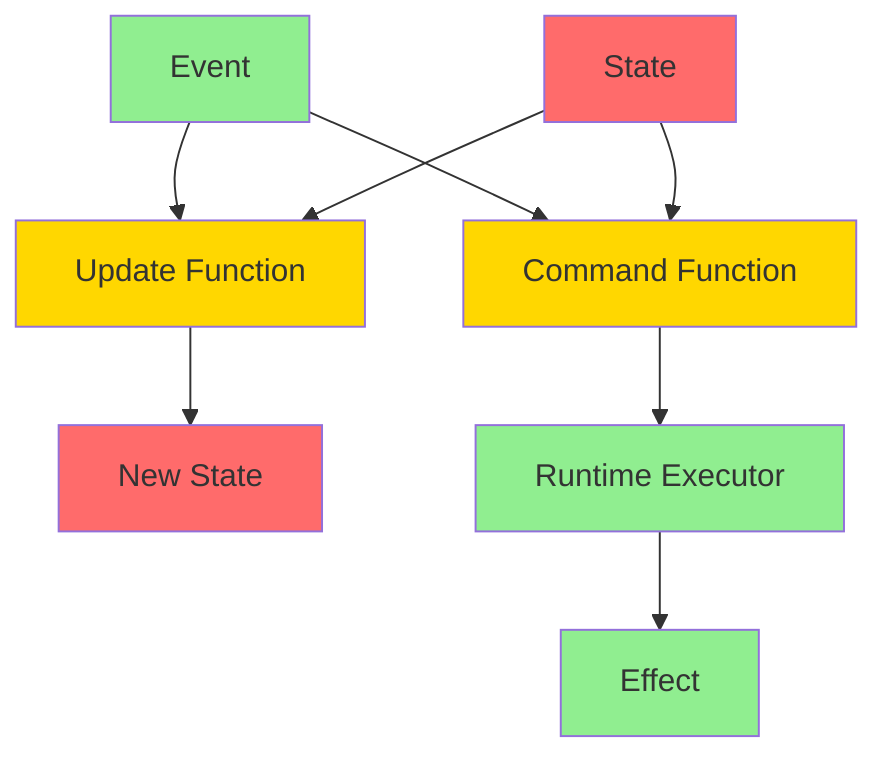
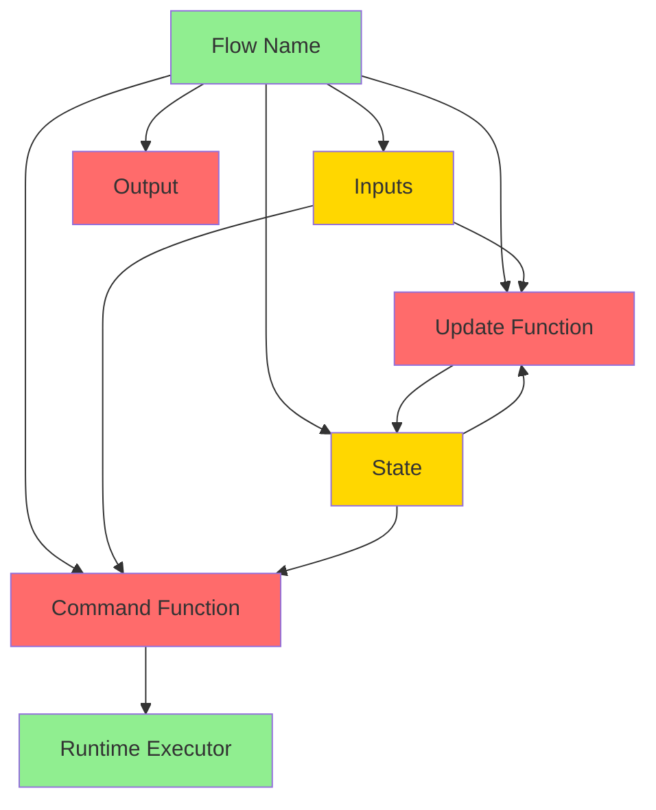
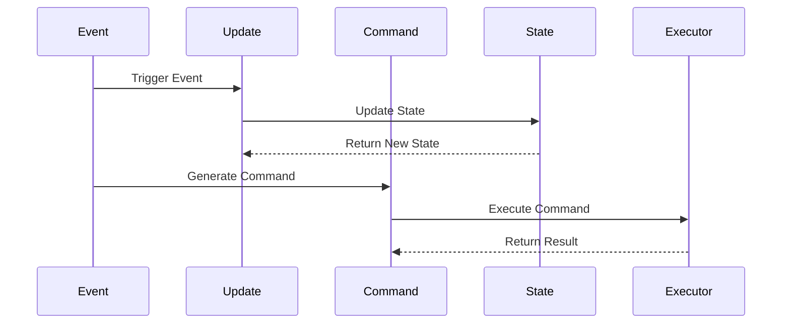
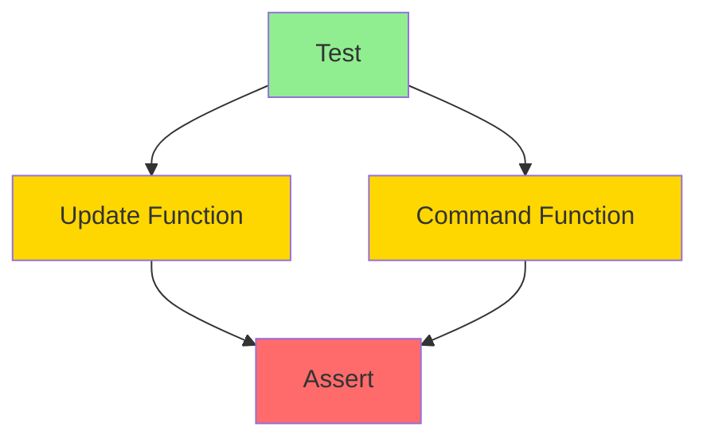

# Strict State Unidirectional Specification (SSUS)

* File:* `language\strict_state_unidirectional_spec.md`
* Version:* 1.0.0
* Context:* Layer 2 (Semantic Analysis) & Layer 3 (Runtime)
* Formalism:* Category Theory (F-Coalgebras) & Automata Theory
* Status:* Active
* Last Modified:* 2026-01-02
* Author:* Kilo Code
* Reviewers:* Pending

- -

## 1. Introduction

### 1.1 Purpose

This specification formalizes **Strict State Unidirectional (SSUS)** for Morph, providing mathematical foundation for the Reducer Pattern that separates mutation from effects. This formalization enables Morph to enforce best practices from modern high-assurance software (Rust managed state, Elm, React Fiber) without the overhead of a JavaScript runtime.

### 1.2 Scope

This specification covers:
- The Reducer Pattern for state management
- Separation of pure state updates from effect commands
- The `update` and `command` functions in `flow` blocks
- Runtime executor for asynchronous command execution
- Deterministic state transitions
- Perfect testability through pure functions

* See Also:*
- [`unidirectional_data_flow_spec.md`](unidirectional_data_flow_spec.md) - Signal vs Stream terminology

This specification does not cover:
- Concrete implementation of runtime executor
- Performance optimization details
- Integration with existing actor model

### 1.3 Definitions, Acronyms, and Abbreviations

| Term | Definition |
|-------|------------|
| **SSUS** | Strict State Unidirectional - strict separation of state updates from effects |
| **Reducer** | Pure function that transforms state based on events |
| **Command** | Effectful operation executed asynchronously by runtime |
| **Event** | Input to reducer that triggers state change |
| **State** | Immutable data representing current application state |
| **Effect** | Side effect (IO, async, randomness) executed by runtime |
| **Mealy Machine** | State machine with output based on state and input |
| **Deterministic** | Same inputs always produce same outputs |

### 1.4 References

- Elm Architecture (2020). "The Elm Architecture"
- React Fiber (2021). "React Fiber Architecture"
- Redux (2020). "Redux Documentation"
- Lamport, L. (1979). "How to Make a Multiprocessor Computer That Correctly Executes Multiprocess Programs"
- IEEE 1016: Recommended Practice for Software Design Descriptions
- ISO/IEC 29148: Systems and software engineering — Requirements engineering

### 1.5 Cross-References

The Strict State Unidirectional Specification is closely related to several other Morph specifications. The following cross-references provide additional context and detailed specifications for related concepts:

* Language Specifications:*
- [`spec/language/unidirectional_data_flow_spec.md`](./unidirectional_data_flow_spec.md) - Unidirectional Data Flow (UDF) pattern specification
- [`spec/language/dialect_projection_spec.md`](./dialect_projection_spec.md) - Dialect and projection specification

* Concurrency Specifications:*
- [`spec/concurrency/execution_model_spec.md`](../concurrency/execution_model_spec.md) - Execution model, actor model, and scheduler implementation
- [`spec/concurrency/scheduling_modes_spec.md`](../concurrency/scheduling_modes_spec.md) - Dual-mode scheduling specification

* Architecture Specifications:*
- [`spec/architecture/layered_concurrency_spec.md`](../architecture/layered_concurrency_spec.md) - Layered concurrency architecture for integrating SSUS pattern with execution model

* Type System Specifications:*
- [`spec/type/type_system_spec.md`](../type/type_system_spec.md) - Type system with capability enforcement and effect tracking
- [`spec/type/effect_system_spec.md`](../type/effect_system_spec.md) - Effect system for tracking side effects and enforcing purity

* Note:* These cross-references help readers navigate the Morph specification ecosystem by providing links to related specifications that provide complementary or detailed information about concepts referenced in this document.

- -

## 2. Formal Definitions

### 2.1 The Architectural Concept: Reducer Pattern

Instead of allowing arbitrary mutation and effects anywhere, we define a strict separation between **State Updates** and **Effect Commands**.

#### 2.1.1 The Core: Reducer

* Reducers** are pure functions that transform state based on events:

$$ \text{Reducer} = (\text{State}, \text{Event}) \to \text{State} $$

* Properties:*
- Pure function (no side effects)
- Deterministic (same input always produces same output)
- State is immutable (returns new state, doesn't modify old state)

* SSUS-INV-001:* THE system SHALL define reducers as pure functions.

#### 2.1.2 The Effect: Command

* Commands** are effectful operations executed asynchronously by runtime:

$$ \text{Command} = (\text{State}, \text{Event}) \to \text{Command} $$

* Properties:*
- Pure function (no side effects)
- Returns command descriptor (doesn't execute effect)
- Runtime executes command asynchronously

* SSUS-INV-002:* THE system SHALL define commands as pure functions returning command descriptors.

### 2.2 The `flow` Construct with SSUS

We extend the `flow` construct to include `update` and `command` functions.

The `flow` construct supports **two complementary patterns** for different use cases:

1. **SSUS Pattern** (this specification): Reducer pattern with explicit effect separation using `update` and `command` functions
2. **UDF Pattern** (see [`unidirectional_data_flow_spec.md`](unidirectional_data_flow_spec.md)): Pure functional transformation with unidirectional data flow using `reduce` function

Both patterns can coexist and interoperate within the same codebase.

#### 2.2.1 Flow Structure (SSUS Pattern)

```morph
flow FlowName {
    // 1. Inputs (Sources) - The ONLY way to trigger change
    in: {
        event1: Signal<T1>,
        event2: Signal<T2>,
        ...
    },

    // 2. State (Private) - The ONLY mutable data
    state: {
        field1: Type1 = initial_value,
        field2: Type2 = initial_value,
        ...
    },

    // 3. Update (Pure Logic) - State + Event -> NewState
    update(msg: Input, s: &mut State) {
        // Pure logic: no IO, no async, no randomness
        // Returns new state
    },

    // 4. Command (Pure Logic) - State + Event -> Command
    command(msg: Input, s: &State) {
        // Pure logic: returns command descriptor
        // Runtime executes command asynchronously
    }

    // 5. Output (Sink) - Automatically derived: Stream<#FlowNameState>
}
```

* SSUS-REQ-001:* THE system SHALL support the `flow` construct with `update` and `command` functions.

* Priority:* Critical
* Verification Method:* Test
* Rationale:* Enables strict separation of state updates from effects
* Dependencies:* SSUS-INV-001, SSUS-INV-002
* Traceability:* Section 2.2 (The `flow` Construct with SSUS)

### 2.3 Mathematical Formalization

We formally define SSUS using **Category Theory (F-Coalgebras)** and **Automata Theory**.

#### 2.3.1 The State Machine

The logic within a flow is modeled as a **Mealy Machine**.

$$ \delta : S \times \Sigma \to S \times \Omega $$

where:
- $S$: Current State
- $\Sigma$: Input Alphabet (Events)
- $\Omega$: Output Alphabet (Commands)

By enforcing that $\delta$ is a **Pure Function** (via Effect System), we guarantee that given the same history of inputs, state is mathematically deterministic.

* SSUS-THM-001:* THE system SHALL guarantee that state transitions are deterministic.

* Proof Sketch:*
1. By definition of pure function, no side effects
2. Same inputs always produce same outputs
3. Therefore, state is deterministic

* SSUS-REQ-002:* THE system SHALL enforce that `update` and `command` functions are pure.

* Priority:* Critical
* Verification Method:* Test
* Rationale:* Ensures deterministic state transitions
* Dependencies:* SSUS-INV-001, SSUS-INV-002
* Traceability:* Section 2.3.1 (The State Machine)

#### 2.3.2 The Runtime Executor

The runtime executor is responsible for executing commands asynchronously.

$$ \text{Executor} : \text{Command} \to \text{Effect} $$

* Properties:*
- Executes commands asynchronously
- Handles IO, async, randomness
- Does not modify state directly

* SSUS-INV-003:* THE system SHALL define runtime executor for asynchronous command execution.

* SSUS-REQ-003:* THE system SHALL execute commands asynchronously via runtime executor.

* Priority:* Critical
* Verification Method:* Test
* Rationale:* Enables effectful operations without breaking determinism
* Dependencies:* SSUS-INV-003
* Traceability:* Section 2.3.2 (The Runtime Executor)

### 2.4 The Type System Enforcement

We enforce strict separation of state updates from effects at the type level.

#### 2.4.1 Pure Function Type

We introduce a **Pure Function Type** to enforce purity.

$$ \text{Pure} : (A \to B) \to \text{Type} $$

* Properties:*
- Pure functions cannot have side effects
- Pure functions cannot perform IO
- Pure functions cannot be async

* Note:* "Pure" is defined as an **effect** in the Effect System, not as a type modifier. See [`type_system_spec.md`](../type/type_system_spec.md) for complete Effect System specification.

* SSUS-INV-004:* THE system SHALL enforce pure function type for `update` and `command` functions.

* SSUS-REQ-004:* THE system SHALL enforce pure function type for `update` and `command` functions.

* Priority:* Critical
* Verification Method:* Test
* Rationale:* Ensures deterministic state transitions
* Dependencies:* SSUS-INV-004
* Traceability:* Section 2.4 (The Type System Enforcement)

#### 2.4.2 Command Type

We introduce a **Command Type** to represent effectful operations.

$$ \text{Command} = \text{EffectDescriptor} $$

* Properties:*
- Command is a descriptor (not executed)
- Command is pure (no side effects)
- Runtime executes command

* SSUS-INV-005:* THE system SHALL define command type for effectful operations.

* SSUS-REQ-005:* THE system SHALL support command type for effectful operations.

* Priority:* Critical
* Verification Method:* Test
* Rationale:* Enables effectful operations without breaking determinism
* Dependencies:* SSUS-INV-005
* Traceability:* Section 2.4.2 (Command Type)

### 2.5 The "Best Practice" Implementation: Perfect Testability

By separating state updates from effects, we enable perfect testability.

#### 2.5.1 Testing State Updates

Since `update` is pure, we can test it without mocking:

```morph
fn test_update() {
    let initial_state = State { count: 0 };
    let event = Event::Increment;
    let new_state = update(event, initial_state);
    assert_eq!(new_state.count, 1);
}
```

* Properties:*
- No mocking required
- Deterministic behavior
- Fast execution

* SSUS-THM-002:* THE system SHALL enable perfect testability for state updates.

* Proof Sketch:*
1. `update` is pure function
2. Pure functions are deterministic
3. Therefore, state updates are perfectly testable

#### 2.5.2 Testing Commands

Since `command` is pure, we can test it without mocking:

```morph
fn test_command() {
    let state = State { user: "alice" };
    let event = Event::Login;
    let cmd = command(event, state);
    assert_eq!(cmd, Command::FetchProfile("alice"));
}
```

* Properties:*
- No mocking required
- Deterministic behavior
- Fast execution

* SSUS-THM-003:* THE system SHALL enable perfect testability for commands.

* Proof Sketch:*
1. `command` is pure function
2. Pure functions are deterministic
3. Therefore, commands are perfectly testable

- -

## 3. Requirements

### 3.1 Functional Requirements

* SSUS-REQ-001:* THE system SHALL support the `flow` construct with `update` and `command` functions.
  - **Priority:* Critical
  - **Verification Method:* Test
  - **Rationale:* Enables strict separation of state updates from effects
  - **Dependencies:* SSUS-INV-001, SSUS-INV-002
  - **Traceability:* Section 2.2 (The `flow` Construct with SSUS)

* SSUS-REQ-002:* THE system SHALL enforce that `update` and `command` functions are pure.
  - **Priority:* Critical
  - **Verification Method:* Test
  - **Rationale:* Ensures deterministic state transitions
  - **Dependencies:* SSUS-INV-001, SSUS-INV-002
  - **Traceability:* Section 2.3.1 (The State Machine)

* SSUS-REQ-003:* THE system SHALL execute commands asynchronously via runtime executor.
  - **Priority:* Critical
  - **Verification Method:* Test
  - **Rationale:* Enables effectful operations without breaking determinism
  - **Dependencies:* SSUS-INV-003
  - **Traceability:* Section 2.3.2 (The Runtime Executor)

* SSUS-REQ-004:* THE system SHALL enforce pure function type for `update` and `command` functions.
  - **Priority:* Critical
  - **Verification Method:* Test
  - **Rationale:* Ensures deterministic state transitions
  - **Dependencies:* SSUS-INV-004
  - **Traceability:* Section 2.4 (The Type System Enforcement)

* SSUS-REQ-005:* THE system SHALL support command type for effectful operations.
  - **Priority:* Critical
  - **Verification Method:* Test
  - **Rationale:* Enables effectful operations without breaking determinism
  - **Dependencies:* SSUS-INV-005
  - **Traceability:* Section 2.4.2 (Command Type)

### 3.2 Non-Functional Requirements

* SSUS-NFR-001:* THE system SHALL provide deterministic state transitions for all flows.
  - **Priority:* Critical
  - **Verification Method:* Test
  - **Metric:* Same inputs always produce same outputs
  - **Rationale:* Enables reproducible behavior and testing
  - **Dependencies:* SSUS-THM-001
  - **Traceability:* Section 2.3.1 (The State Machine)

* SSUS-NFR-002:* THE system SHALL enable perfect testability for state updates and commands.
  - **Priority:* High
  - **Verification Method:* Test
  - **Metric:* No mocking required for testing
  - **Rationale:* Reduces testing complexity and improves reliability
  - **Dependencies:* SSUS-THM-002, SSUS-THM-003
  - **Traceability:* Section 2.5 (The "Best Practice" Implementation)

* SSUS-NFR-003:* THE system SHALL execute commands asynchronously without blocking state updates.
  - **Priority:* High
  - **Verification Method:* Test
  - **Metric:* State updates complete in < 1ms
  - **Rationale:* Ensures responsive UI and high throughput
  - **Dependencies:* SSUS-INV-003
  - **Traceability:* Section 2.3.2 (The Runtime Executor)

* SSUS-NFR-004:* THE system SHALL support up to 1,000,000 concurrent flows.
  - **Priority:* Medium
  - **Verification Method:* Demonstration
  - **Metric:* 1M flows with < 10GB memory
  - **Rationale:* Supports large-scale concurrent systems
  - **Dependencies:* SSUS-INV-001
  - **Traceability:* Section 2.1 (The Architectural Concept)

- -

## 4. Design

### 4.1 Architecture Overview

The SSUS Engine is implemented as a compiler and runtime component that:
1. Defines `flow` blocks with `update` and `command` functions
2. Enforces pure function type for `update` and `command`
3. Executes commands asynchronously via runtime executor
4. Ensures deterministic state transitions
5. Enables perfect testability

### 4.2 Data Structures

#### 4.2.1 Flow Block

* Flow Block:* $F = (\text{name}, \text{inputs}, \text{state}, \text{update}, \text{command})$

* Components:*
- $\text{name}$: Flow name
- $\text{inputs}$: Map of event names to types
- $\text{state}$: Map of field names to initial values
- $\text{update}$: Update function (pure)
- $\text{command}$: Command function (pure)

* Invariants:*
1. All inputs are read-only
2. State is private to flow
3. Update is pure function
4. Command is pure function

#### 4.2.2 Event

* Event:* $E = (\text{type}, \text{value})$

* Components:*
- $\text{type}$: Event type
- $\text{value}$: Event value

* Invariants:*
1. Event is immutable
2. Event can trigger state change

#### 4.2.3 State

* State:* $S = (\text{fields})$

* Components:*
- $\text{fields}$: Map of field names to values

* Invariants:*
1. State is immutable (returns new state)
2. State is private to flow

#### 4.2.4 Command

* Command:* $C = (\text{type}, \text{params})$

* Components:*
- $\text{type}$: Command type
- $\text{params}$: Command parameters

* Invariants:*
1. Command is descriptor (not executed)
2. Command is pure (no side effects)

### 4.3 Algorithms

#### 4.3.1 Update Algorithm

* Algorithm Name:* Update State

* Input:* Event $e$, State $s$

* Output:* New State $s'$

* Mathematical Definition:*
$$
\text{update}(e, s) = s' \text{ where } s' = \text{pure\_function}(e, s) $$

* Pseudocode:*
```
function update(event, state):
    // Pure function: no side effects
    new_state = state.copy()
    match event:
        case Event1(v1):
            new_state.field1 = v1
        case Event2(v2):
            new_state.field2 = v2
        ...
    return new_state
```

* Complexity:*
- Time: $O(1)$
- Space: $O(1)$

* Correctness:*
- **Invariant:* Returns new state without modifying old state
- **Termination:* Always returns new state

#### 4.3.2 Command Algorithm

* Algorithm Name:* Generate Command

* Input:* Event $e$, State $s$

* Output:* Command $c$

* Mathematical Definition:*
$$
\text{command}(e, s) = c \text{ where } c = \text{pure\_function}(e, s) $$

* Pseudocode:*
```
function command(event, state):
    // Pure function: no side effects
    match event:
        case Event1(v1):
            return Command::FetchData(v1)
        case Event2(v2):
            return Command::SaveData(v2)
        ...
```

* Complexity:*
- Time: $O(1)$
- Space: $O(1)$

* Correctness:*
- **Invariant:* Returns command descriptor without executing effect
- **Termination:* Always returns command

#### 4.3.3 Runtime Executor Algorithm

* Algorithm Name:* Execute Command

* Input:* Command $c$

* Output:* Effect result

* Mathematical Definition:*
$$
\text{execute}(c) = \text{effect}(c) $$

* Pseudocode:*
```
function execute(command):
    // Execute command asynchronously
    match command:
        case Command::FetchData(url):
            return async_fetch(url)
        case Command::SaveData(data):
            return async_save(data)
        ...
```

* Complexity:*
- Time: Depends on command
- Space: Depends on command

* Correctness:*
- **Invariant:* Executes effect without modifying state
- **Termination:* Depends on command

### 4.4 Mermaid Diagrams

#### 4.4.1 SSUS Architecture



#### 4.4.2 Flow Block Structure



#### 4.4.3 Execution Flow



#### 4.4.4 Testing Flow



- -

## 5. Correctness Properties

### 5.1 Theorems

#### 5.1.1 Determinism Theorem

* Theorem:* If a program uses `flow` blocks with pure `update` and `command` functions, then state transitions are deterministic.

* Proof Sketch:*
1. By definition of SSUS-THM-001, `update` and `command` are pure functions
2. Pure functions are deterministic (same input always produces same output)
3. Therefore, state transitions are deterministic

* SSUS-THM-004:* THE system SHALL guarantee deterministic state transitions for `flow` programs with pure `update` and `command` functions.

* Priority:* Critical
* Verification Method:* Test
* Rationale:* Enables reproducible behavior and testing
* Dependencies:* SSUS-THM-001
* Traceability:* Section 2.3.1 (The State Machine)

#### 5.1.2 Testability Theorem

* Theorem:* If a program uses `flow` blocks with pure `update` and `command` functions, then state updates and commands are perfectly testable.

* Proof Sketch:*
1. By definition of SSUS-THM-002 and SSUS-THM-003, `update` and `command` are pure functions
2. Pure functions are deterministic and require no mocking
3. Therefore, state updates and commands are perfectly testable

* SSUS-THM-005:* THE system SHALL guarantee perfect testability for `flow` programs with pure `update` and `command` functions.

* Priority:* High
* Verification Method:* Test
* Rationale:* Reduces testing complexity and improves reliability
* Dependencies:* SSUS-THM-002, SSUS-THM-003
* Traceability:* Section 2.5 (The "Best Practice" Implementation)

#### 5.1.3 Atomicity Theorem

* Theorem:* If a program uses `flow` blocks with pure `update` functions, then state transitions are atomic.

* Proof Sketch:*
1. By definition of pure function, `update` returns new state without side effects
2. State is immutable (returns new state, doesn't modify old state)
3. Therefore, state transitions are atomic

* SSUS-THM-006:* THE system SHALL guarantee atomic state transitions for `flow` programs with pure `update` functions.

* Priority:* High
* Verification Method:* Test
* Rationale:* Prevents partial state updates and race conditions
* Dependencies:* SSUS-INV-001
* Traceability:* Section 2.1.1 (The Core: Reducer)

### 5.2 Invariants

#### 5.2.1 Flow Invariants

- **SSUS-INV-006:* THE system SHALL maintain that all inputs are read-only.
- **SSUS-INV-007:* THE system SHALL maintain that state is private to flow.
- **SSUS-INV-008:* THE system SHALL maintain that `update` and `command` functions are pure.

#### 5.2.2 State Invariants

- **SSUS-INV-009:* THE system SHALL maintain that state is immutable (returns new state).
- **SSUS-INV-010:* THE system SHALL maintain that state transitions are deterministic.

#### 5.2.3 Command Invariants

- **SSUS-INV-011:* THE system SHALL maintain that commands are descriptors (not executed).
- **SSUS-INV-012:* THE system SHALL maintain that commands are pure (no side effects).

- -

## 6. Examples

### 6.1 Simple Counter Flow

```morph
flow Counter {
    // 1. Inputs (Sources) - The ONLY way to trigger change
    in: {
        increment: Signal<void>,
        reset: Signal<void>
    },

    // 2. State (Private) - The ONLY mutable data
    state: {
        count: i32 = 0
    },

    // 3. Update (Pure Logic) - State + Event -> NewState
    update(msg: Input, s: &mut State) {
        fix msg {
            increment => s.count += 1,
            reset => s.count = 0
        }
    },

    // 4. Command (Pure Logic) - State + Event -> Command
    command(msg: Input, s: &State) {
        fix msg {
            increment => Command::Log("Incremented"),
            reset => Command::Log("Reset")
        }
    }

    // 5. Output (Sink) - Automatically derived: Stream<#CounterState>
}
```

* Properties:*
- Inputs are read-only signals
- State is private to flow
- Update is pure (no side effects)
- Command is pure (returns descriptor)
- Runtime executes command asynchronously

### 6.2 Authentication Flow

```morph
flow AuthSystem {
    // 1. Define Data
    state: {
        status: Status = Idle
    },

    // 2. Define Messages
    in: {
        Login(user: str),
        LoginSuccess(token: str),
        LoginFail(err: str)
    },

    // 3. The Pure Update (Updates Data)
    // ONLY this block can modify 'state'
    update(msg: Input, s: &mut State) {
        fix msg {
            Login(_) => s.status = Loading,
            LoginSuccess(t) => s.status = Authenticated(t),
            LoginFail(e) => s.status = Error(e)
        }
    },

    // 4. The Pure Command (Returns Command Descriptor)
    // Runtime executes command asynchronously
    command(msg: Input, s: &State) {
        fix msg {
            Login(user) => Command::Authenticate(user),
            LoginSuccess(t) => Command::SaveToken(t),
            LoginFail(e) => Command::LogError(e)
        }
    }

    // 5. Output (Sink) - Automatically derived: Stream<#AuthSystemState>
}
```

* Properties:*
- State transitions are deterministic
- No side effects in update
- Commands are pure descriptors
- Runtime executes commands asynchronously

### 6.3 Testing State Updates

```morph
fn test_update() {
    let initial_state = State { count: 0 };
    let event = Event::Increment;
    let new_state = update(event, initial_state);
    assert_eq!(new_state.count, 1);
}
```

* Properties:*
- No mocking required
- Deterministic behavior
- Fast execution

### 6.4 Testing Commands

```morph
fn test_command() {
    let state = State { user: "alice" };
    let event = Event::Login;
    let cmd = command(event, state);
    assert_eq!(cmd, Command::Authenticate("alice"));
}
```

* Properties:*
- No mocking required
- Deterministic behavior
- Fast execution

### 6.5 Edge Cases

#### 6.5.1 Empty Flow

```morph
flow EmptyFlow {
    in: {
        // No inputs
    },

    state: {
        value: i32 = 0
    },

    update(msg: Input, s: &mut State) {
        // No messages to process
    },

    command(msg: Input, s: &State) {
        // No commands to generate
    }
}
```

* Properties:*
- Flow with no inputs is valid
- State remains constant
- No side effects

#### 6.5.2 Single Event Flow

```morph
flow SingleEvent {
    in: {
        trigger: Signal<void>
    },

    state: {
        count: i32 = 0
    },

    update(msg: Input, s: &mut State) {
        fix msg {
            trigger => s.count += 1
        }
    },

    command(msg: Input, s: &State) {
        fix msg {
            trigger => Command::Log("Triggered")
        }
    }
}
```

* Properties:*
- Single event triggers state change
- Deterministic behavior

#### 6.5.3 Multiple Event Flow

```morph
flow MultiEvent {
    in: {
        event1: Signal<T1>,
        event2: Signal<T2>,
        event3: Signal<T3>
    },

    state: {
        value1: T1 = initial,
        value2: T2 = initial,
        value3: T3 = initial
    },

    update(msg: Input, s: &mut State) {
        fix msg {
            event1(v) => s.value1 = v,
            event2(v) => s.value2 = v,
            event3(v) => s.value3 = v
        }
    },

    command(msg: Input, s: &State) {
        fix msg {
            event1(v) => Command::Process1(v),
            event2(v) => Command::Process2(v),
            event3(v) => Command::Process3(v)
        }
    }
}
```

* Properties:*
- Multiple events can trigger state changes
- Each event processed independently
- Deterministic behavior

- -

## Change Log

| Version | Date       | Author      | Changes                                                                 |
|---------|------------|-------------|-------------------------------------------------------------------------|
| 1.0.0   | 2026-01-02 | Kilo Code    | Initial version                                                        |
