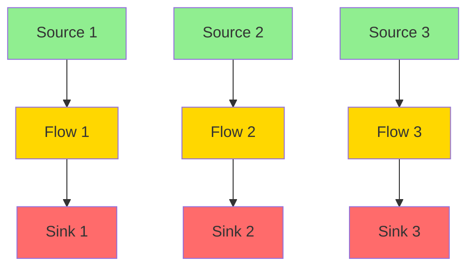
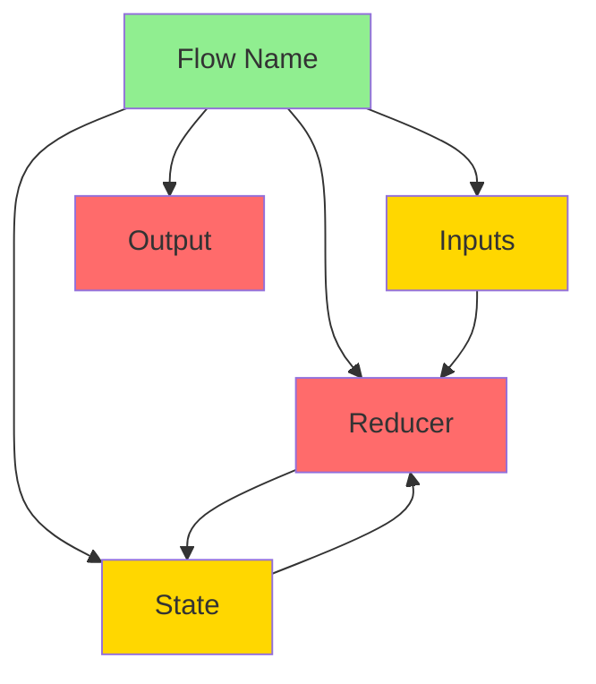
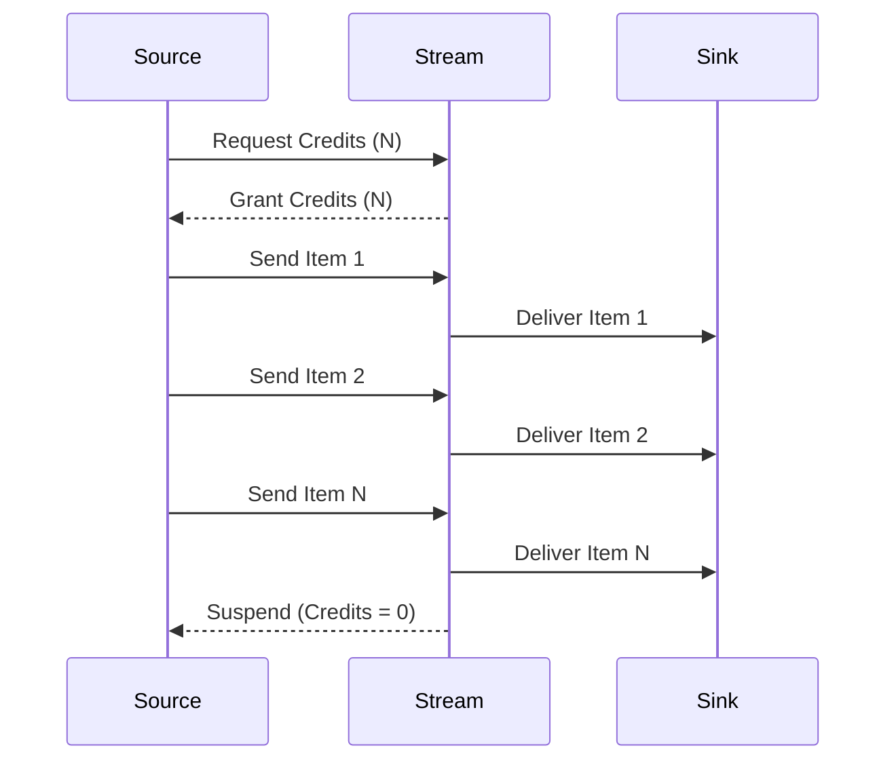
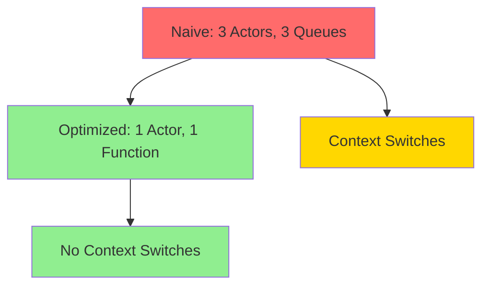

# Unidirectional Data Flow Specification (UDF)

* File:* `language\unidirectional_data_flow_spec.md`
* Version:* 1.0.0
* Context:* Layer 2 (Semantic Analysis) & Layer 3 (Runtime)
* Formalism:* Category Theory (F-Coalgebras) & Graph Theory
* Status:* Active
* Last Modified:* 2026-01-02
* Author:* Kilo Code
* Reviewers:* Pending

- -

## 1. Introduction

### 1.1 Purpose

This specification formalizes **Unidirectional Data Flow (UDF)** for Morph, providing mathematical foundation for preventing logic cycles, race conditions, and "spaghetti state" by enforcing strict stream topologies. This formalization enables Morph to enforce best practices from modern high-assurance software (Rust managed state, Elm, React Fiber) without the overhead of a JavaScript runtime.

### 1.2 Scope

This specification covers:
- The `flow` construct for unidirectional data flow
- Source-Sink dualism with polarity types
- Topological acyclicity enforcement
- Reducer semantics (Mealy machines)
- Push-Pull reactive streams with backpressure
- Stream fusion optimization

This specification does not cover:
- Concrete implementation of stream runtime
- Performance optimization details
- Integration with existing actor model

### 1.3 Definitions, Acronyms, and Abbreviations

| Term | Definition |
|-------|------------|
| **UDF** | Unidirectional Data Flow - strict one-way data flow |
| **Source** | Read-only event producer (upstream) |
| **Sink** | Read-only state consumer (downstream) |
| **Transducer** | Pure function transforming input to output |
| **Polarity** | Directional type annotation (<T for source, >T for sink) |
| **Backpressure** | Flow control mechanism preventing producer/consumer mismatch |
| **Stream Fusion** | Compiler optimization merging linear flow chains |
| **Mealy Machine** | State machine with output based on state and input |
| **DAG** | Directed Acyclic Graph - no cycles allowed |

### 1.4 References

- Fidge, C. (1988). "Timestamps in Message-Passing Systems that Extend Partial Ordering"
- Mattern, F. (1989). "Virtual Time and Global States of Distributed Systems"
- Elm Architecture (2020). "The Elm Architecture"
- React Fiber (2021). "React Fiber Architecture"
- Lamport, L. (1979). "How to Make a Multiprocessor Computer That Correctly Executes Multiprocess Programs"
- IEEE 1016: Recommended Practice for Software Design Descriptions
- ISO/IEC 29148: Systems and software engineering — Requirements engineering

### 1.5 Cross-References

The Unidirectional Data Flow Specification is closely related to several other Morph specifications. The following cross-references provide additional context and detailed specifications for related concepts:

* Language Specifications:*
- [`spec/language/strict_state_unidirectional_spec.md`](./strict_state_unidirectional_spec.md) - Strict State Unidirectional (SSUS) pattern specification
- [`spec/language/dialect_projection_spec.md`](./dialect_projection_spec.md) - Dialect and projection specification

* Concurrency Specifications:*
- [`spec/concurrency/execution_model_spec.md`](../concurrency/execution_model_spec.md) - Execution model, actor model, and scheduler implementation
- [`spec/concurrency/scheduling_modes_spec.md`](../concurrency/scheduling_modes_spec.md) - Dual-mode scheduling specification

* Architecture Specifications:*
- [`spec/architecture/layered_concurrency_spec.md`](../architecture/layered_concurrency_spec.md) - Layered concurrency architecture for integrating UDF pattern with execution model

* Type System Specifications:*
- [`spec/type/type_system_spec.md`](../type/type_system_spec.md) - Type system with capability enforcement and effect tracking
- [`spec/type/effect_system_spec.md`](../type/effect_system_spec.md) - Effect system for tracking side effects and enforcing purity

* Note:* These cross-references help readers navigate the Morph specification ecosystem by providing links to related specifications that provide complementary or detailed information about concepts referenced in this document.

- -

## 2. Formal Definitions

### 2.1 The Architectural Concept: Source-Sink Dualism

Instead of an Actor that can send anywhere, we define logical units as **Transducers**.

#### 2.1.1 Upstream (Sources)

* Sources** are read-only event producers:

$$ \text{Source} = \{\text{Signal}<T> \mid T \in \text{Types}\} $$

* Properties:*
- Can only be read from
- Cannot be written to
- Emit signals to downstream

* UDF-INV-001:* THE system SHALL define sources as read-only event producers.

#### 2.1.2 Downstream (Sinks)

* Sinks** are read-only state consumers:

$$ \text{Sink} = \{\text{Stream}<T> \mid T \in \text{Types}\} $$

* Properties:*
- Can only be written to
- Cannot be read from
- Consume signals from upstream

* UDF-INV-002:* THE system SHALL define sinks as read-only state consumers.

#### 2.1.3 Signal vs Stream Relationship

* Signal<T>** and **Stream<T>** are complementary types representing different stages in the data flow:

| Type | Role | Direction | Usage |
|------|-------|-----------|--------|
| **Signal<T>** | Read-only event producer | Upstream (Source) | Emits events to downstream |
| **Stream<T>** | Read-only state consumer | Downstream (Sink) | Consumes events from upstream |

* Key Relationship:*
- A `Stream<T>` is a `Signal<T>` that has been emitted and is now available for consumption
- `Signal<T>` represents the **source** of events (producer side)
- `Stream<T>` represents the **sink** of events (consumer side)
- The transformation from `Signal<T>` to `Stream<T>` occurs when a source emits to a sink

* Example:*
```morph
// Signal<T> - Producer side
let input_signal: Signal<i32> = ...;

// Stream<T> - Consumer side
let output_stream: Stream<i32> = input_signal |> transform();

// Signal<T> can be piped to Stream<T>
input_signal |> pipe_to(output_stream);
```

* UDF-INV-002.1:* THE system SHALL maintain that `Signal<T>` represents producers and `Stream<T>` represents consumers.

#### 2.1.3 The Core: Transducer

* Transducers** are pure functions transforming input to output:

$$ \text{Transducer} = (\text{Input}, \text{State}) \to \text{State} $$

* Properties:*
- Pure function (no side effects)
- Deterministic (same input always produces same output)
- State is private to transducer

* UDF-INV-003:* THE system SHALL define transducers as pure functions.

### 2.2 The `flow` Construct

We introduce a specialized semantic block called `flow` (a strict subset of `act`).

The `flow` construct supports **two complementary patterns** for different use cases:

1. **UDF Pattern** (this specification): Pure functional transformation with unidirectional data flow using `reduce` function
2. **SSUS Pattern** (see [`strict_state_unidirectional_spec.md`](strict_state_unidirectional_spec.md)): Reducer pattern with explicit effect separation using `update` and `command` functions

Both patterns can coexist and interoperate within the same codebase.

#### 2.2.1 Flow Structure (UDF Pattern)

```morph
flow FlowName {
    // 1. Inputs (Sources) - The ONLY way to trigger change
    in: {
        signal1: Signal<T1>,
        signal2: Signal<T2>,
        ...
    },

    // 2. State (Private) - The ONLY mutable data
    state: {
        field1: Type1 = initial_value,
        field2: Type2 = initial_value,
        ...
    },

    // 3. Reducer (Pure Logic) - State + Input -> NewState
    reduce(msg: Input, s: &mut State) {
        // Pure logic: no IO, no async, no randomness
        // Returns new state
    },

    // 4. Output (Sink) - The ONLY public surface
    // Automatically derived: Stream<#FlowNameState>
}
```

* UDF-REQ-001:* THE system SHALL support the `flow` construct with Input, State, and Reducer sections.

#### 2.2.2 Flow Structure (SSUS Pattern)

For flows requiring explicit separation of state updates from effect commands, the SSUS pattern provides `update` and `command` functions. See [`strict_state_unidirectional_spec.md`](strict_state_unidirectional_spec.md:2.2) for complete specification.

```morph
flow FlowName {
    // 1. Inputs (Sources) - The ONLY way to trigger change
    in: {
        event1: Signal<T1>,
        event2: Signal<T2>,
        ...
    },

    // 2. State (Private) - The ONLY mutable data
    state: {
        field1: Type1 = initial_value,
        field2: Type2 = initial_value,
        ...
    },

    // 3. Update (Pure Logic) - State + Event -> NewState
    update(msg: Input, s: &mut State) {
        // Pure logic: no IO, no async, no randomness
        // Returns new state
    },

    // 4. Command (Pure Logic) - State + Event -> Command
    command(msg: Input, s: &State) {
        // Pure logic: returns command descriptor
        // Runtime executes command asynchronously
    }

    // 5. Output (Sink) - Automatically derived: Stream<#FlowNameState>
}
```

* UDF-REQ-001.1:* THE system SHALL support the `flow` construct with `update` and `command` functions (SSUS pattern).

* Note:* A `flow` block may use either the UDF pattern (`reduce`) or the SSUS pattern (`update` + `command`), but not both simultaneously. The choice depends on whether explicit effect separation is required.

* Priority:* Critical
* Verification Method:* Test
* Rationale:* Enables unidirectional data flow
* Dependencies:* UDF-INV-001, UDF-INV-002, UDF-INV-003
* Traceability:* Section 2.2 (The `flow` Construct)

### 2.3 Mathematical Formalization

We formally define UDF using **Category Theory (F-Coalgebras)** and **Graph Theory**.

#### 2.3.1 The Flow Graph ($\mathcal{G}$)

Let application be a directed graph where Nodes are `flow` blocks and Edges are data dependencies.

* Theorem (The UDF Invariant):*
The Data Flow Graph $\mathcal{G}$ must be a **Directed Acyclic Graph (DAG)**.

$$ \nexists \text{ path } v_1 \to v_2 \to \dots \to v_1 $$

* UDF-THM-001:* THE system SHALL guarantee that the data flow graph is a DAG.

* Proof Sketch:*
1. By definition of DAG, no cycles exist
2. Cycles would create feedback loops
3. Feedback loops violate unidirectional
4. Therefore, graph must be acyclic

* Compiler Check:* During Semantic Analysis, compiler builds dependency graph of all `flow` blocks. If a cycle is detected (e.g., A listens to B, B listens to A), build **fails** with a "Feedback Loop Error."

#### 2.3.2 Exception (Explicit Feedback)

Cycles are allowed *only* if explicitly marked with a `feedback` delay buffer (breaking temporal cycle), ensuring $State_{t+1}$ depends on $State_t$, not $State_{t+1}$.

* UDF-REQ-002:* THE system SHALL allow explicit feedback only through `feedback` delay buffers.

* Priority:* Critical
* Verification Method:* Test
* Rationale:* Enables controlled feedback while preventing accidental cycles
* Dependencies:* UDF-THM-001
* Traceability:* Section 2.3.1 (The Flow Graph)

#### 2.3.3 The Reducer Semantics

The logic within a flow is modeled as a **Mealy Machine**.

$$ \delta : S \times \Sigma \to S \times \Omega $$

where:
- $S$: Current State
- $\Sigma$: Input Alphabet (Signals)
- $\Omega$: Output Alphabet (State Snapshots)

By enforcing that $\delta$ is a **Pure Function** (via Effect System), we guarantee that given the same history of inputs, state is mathematically deterministic.

* Note:* "Pure" is defined as an **effect** in the Effect System, not as a type modifier. See [`type_system_spec.md`](type_system_spec.md:2.6) for complete Effect System specification.

* UDF-THM-002:* THE system SHALL guarantee that reducers are pure functions.

* Proof Sketch:*
1. By definition of pure function, no side effects
2. Same inputs always produce same outputs
3. Therefore, state is deterministic

* UDF-REQ-003:* THE system SHALL enforce that reducer functions are pure.

* Priority:* Critical
* Verification Method:* Test
* Rationale:* Ensures deterministic state transitions
* Dependencies:* UDF-INV-003
* Traceability:* Section 2.3.3 (The Reducer Semantics)

### 2.4 The Type System Enforcement

We introduce **Polarity Types** to enforce directionality at the API level.

#### 2.4.1 Source and Sink Capabilities

We refine the Capability System with Directional Bounds.

- **`<T` (Source / Producer):* You can only *read* (listen) from this. You cannot send.
- **`>T` (Sink / Consumer):* You can only *write* (send) to this. You cannot read.

* UDF-INV-004:* THE system SHALL enforce polarity types for stream endpoints.

* UDF-REQ-004:* THE system SHALL support `<T` (Source) and `>T` (Sink) polarity types.

* Priority:* Critical
* Verification Method:* Test
* Rationale:* Enforces unidirectional data flow at type level
* Dependencies:* UDF-INV-004
* Traceability:* Section 2.4 (The Type System Enforcement)

#### 2.4.2 Topology Enforcement

```morph
fn connect(source: <Event>, sink: >Event) {
    // Valid: Piping Source to Sink
    source |> pipe_to(sink);
}

// Compile Error: Polarity Mismatch
// Cannot write to a Source. Cannot read from a Sink.
```

* UDF-REQ-005:* THE system SHALL enforce topology constraints at compile time.

* Priority:* Critical
* Verification Method:* Test
* Rationale:* Prevents invalid topologies
* Dependencies:* UDF-INV-004, UDF-REQ-004
* Traceability:* Section 2.4.1 (Source and Sink Capabilities)

### 2.5 The "Best Practice" Implementation: Reactive Streams

To implement this efficiently (Zero-Cost), we adopt **Push-Pull Reactive Stream** model.

#### 2.5.1 Backpressure (The Hydraulic Analogy)

In a pure push system (Redux), fast producers drown slow consumers (OOM).
In Morph UDF, every `>Sink` has a **Credit System**.

* Mechanism:*
1. Downstream issues $N$ credits (demand).
2. Upstream sends $N$ items.
3. Upstream **suspends** (yields fiber) if credits = 0.

* Math:* This enforces **Bounded Buffers**. The memory usage of entire flow graph is strictly bounded by $\sum \text{BufferSizes}$.

* UDF-THM-003:* THE system SHALL guarantee bounded memory usage through credit-based backpressure.

* Proof Sketch:*
1. Each sink has $N$ credits
2. Upstream can send at most $N$ items
3. Total memory bounded by $\sum N \times \text{ItemSize}$
4. Therefore, memory usage is bounded

* UDF-REQ-006:* THE system SHALL implement credit-based backpressure for all streams.

* Priority:* Critical
* Verification Method:* Test
* Rationale:* Prevents OOM and ensures bounded memory
* Dependencies:* UDF-THM-003
* Traceability:* Section 2.5.1 (Backpressure)

#### 2.5.2 Stream Fusion (Optimization)

If we have `Flow A -> Flow B -> Flow C`.

* Naive:* 3 Actors, 3 Queues, Context Switches.

* Morph Optimization:* The Compiler identifies this is a linear chain (1:1). It performs **Stream Fusion**, compiling A, B, and C into a **Single Function** executed by one Actor.

* Result:* Zero-copy, zero-latency logic pipeline.

* UDF-THM-004:* THE system SHALL perform stream fusion for linear flow chains.

* Proof Sketch:*
1. Compiler identifies linear chain (1:1 relationship)
2. Merges reducers into single function
3. Eliminates intermediate queues
4. Eliminates context switches
5. Result: Zero-copy, zero-latency

* UDF-REQ-007:* THE system SHALL perform stream fusion optimization for linear flow chains.

* Priority:* High
* Verification Method:* Analysis
* Rationale:* Eliminates overhead of intermediate actors
* Dependencies:* UDF-THM-001
* Traceability:* Section 2.5.2 (Stream Fusion)

- -

## 3. Requirements

### 3.1 Functional Requirements

* UDF-REQ-001:* THE system SHALL support the `flow` construct with Input, State, and Reducer sections.
  - **Priority:* Critical
  - **Verification Method:* Test
  - **Rationale:* Enables unidirectional data flow
  - **Dependencies:* UDF-INV-001, UDF-INV-002, UDF-INV-003
  - **Traceability:* Section 2.2 (The `flow` Construct)

* UDF-REQ-002:* THE system SHALL allow explicit feedback only through `feedback` delay buffers.
  - **Priority:* Critical
  - **Verification Method:* Test
  - **Rationale:* Enables controlled feedback while preventing accidental cycles
  - **Dependencies:* UDF-THM-001
  - **Traceability:* Section 2.3.1 (Exception (Explicit Feedback))

* UDF-REQ-003:* THE system SHALL enforce that reducer functions are pure.
  - **Priority:* Critical
  - **Verification Method:* Test
  - **Rationale:* Ensures deterministic state transitions
  - **Dependencies:* UDF-INV-003
  - **Traceability:* Section 2.3.3 (The Reducer Semantics)

* UDF-REQ-004:* THE system SHALL support `<T` (Source) and `>T` (Sink) polarity types.
  - **Priority:* Critical
  - **Verification Method:* Test
  - **Rationale:* Enforces unidirectional data flow at type level
  - **Dependencies:* UDF-INV-004
  - **Traceability:* Section 2.4 (The Type System Enforcement)

* UDF-REQ-005:* THE system SHALL enforce topology constraints at compile time.
  - **Priority:* Critical
  - **Verification Method:* Test
  - **Rationale:* Prevents invalid topologies
  - **Dependencies:* UDF-INV-004, UDF-REQ-004
  - **Traceability:* Section 2.4.2 (Topology Enforcement)

* UDF-REQ-006:* THE system SHALL implement credit-based backpressure for all streams.
  - **Priority:* Critical
  - **Verification Method:* Test
  - **Rationale:* Prevents OOM and ensures bounded memory
  - **Dependencies:* UDF-THM-003
  - **Traceability:* Section 2.5.1 (Backpressure)

* UDF-REQ-007:* THE system SHALL perform stream fusion optimization for linear flow chains.
  - **Priority:* High
  - **Verification Method:* Analysis
  - **Rationale:* Eliminates overhead of intermediate actors
  - **Dependencies:* UDF-THM-001
  - **Traceability:* Section 2.5.2 (Stream Fusion)

### 3.2 Non-Functional Requirements

* UDF-NFR-001:* THE system SHALL perform topological analysis in O(V + E) time complexity.
  - **Priority:* High
  - **Verification Method:* Analysis
  - **Metric:* Topological analysis < 100ms for 10,000 flows
  - **Rationale:* Ensures fast compilation
  - **Dependencies:* UDF-THM-001
  - **Traceability:* Section 2.3.1 (The Flow Graph)

* UDF-NFR-002:* THE system SHALL support up to 1,000,000 concurrent flows.
  - **Priority:* Medium
  - **Verification Method:* Demonstration
  - **Metric:* 1M flows with < 10GB memory
  - **Rationale:* Supports large-scale concurrent systems
  - **Dependencies:* UDF-INV-001
  - **Traceability:* Section 2.1 (The Architectural Concept)

* UDF-NFR-003:* THE system SHALL provide bounded memory guarantees for all flows.
  - **Priority:* High
  - **Verification Method:* Test
  - **Metric:* Memory usage bounded by sum of buffer sizes
  - **Rationale:* Prevents OOM and ensures predictable memory usage
  - **Dependencies:* UDF-THM-003
  - **Traceability:* Section 2.5.1 (Backpressure)

* UDF-NFR-004:* THE system SHALL perform stream fusion in O(V + E) time complexity.
  - **Priority:* Medium
  - **Verification Method:* Analysis
  - **Metric:* Stream fusion < 10ms for 10,000 flows
  - **Rationale:* Ensures fast optimization
  - **Dependencies:* UDF-THM-004
  - **Traceability:* Section 2.5.2 (Stream Fusion)

- -

## 4. Design

### 4.1 Architecture Overview

The UDF Engine is implemented as a compiler and runtime component that:
1. Defines `flow` blocks with Input, State, and Reducer
2. Enforces topological acyclicity
3. Enforces polarity types for streams
4. Implements credit-based backpressure
5. Performs stream fusion optimization

### 4.2 Data Structures

#### 4.2.1 Flow Block

* Flow Block:* $F = (\text{name}, \text{inputs}, \text{state}, \text{reducer})$

* Components:*
- $\text{name}$: Flow name
- $\text{inputs}$: Map of signal names to types
- $\text{state}$: Map of field names to initial values
- $\text{reducer}$: Reducer function

* Invariants:*
1. All inputs are read-only
2. State is private to flow
3. Reducer is pure function

#### 4.2.2 Signal

* Signal:* $S = (\text{type}, \text{value})$

* Components:*
- $\text{type}$: Signal type
- $\text{value}$: Signal value

* Invariants:*
1. Signal is immutable
2. Signal can be sent to sinks

#### 4.2.3 Stream

* Stream:* $St = (\text{type}, \text{producer}, \text{consumer})$

* Components:*
- $\text{type}$: Stream type
- $\text{producer}$: Source (upstream)
- $\text{consumer}$: Sink (downstream)

* Invariants:*
1. Producer can only write to stream
2. Consumer can only read from stream
3. Stream has bounded buffer

#### 4.2.4 Credit System

* Credit System:* $CS = (\text{available}, \text{total})$

* Components:*
- $\text{available}$: Available credits
- $\text{total}$: Total credits (buffer size)

* Invariants:*
1. $0 \leq \text{available} \leq \text{total}$
2. Credits are atomically updated
3. Producer suspends when available = 0

### 4.3 Algorithms

#### 4.3.1 Topological Analysis Algorithm

* Algorithm Name:* Detect Cycles in Flow Graph

* Input:* Flow graph $\mathcal{G}$

* Output:* Boolean indicating if graph is acyclic

* Mathematical Definition:*
$$
\text{is\_acyclic}(\mathcal{G}) = \neg \exists \text{cycle} \in \mathcal{G} $$

* Pseudocode:*
```
function is_acyclic(graph):
    visited = empty_set()
    recursion_stack = empty_stack()

    for node in graph.nodes:
        if node in visited:
            continue

        if has_cycle_from(node, visited, recursion_stack):
            return false

        visited.add(node)
        recursion_stack.push(node)

    return true

function has_cycle_from(node, visited, recursion_stack):
    if node in recursion_stack:
        return true

    for neighbor in graph.outgoing_edges[node]:
        if neighbor in visited:
            continue

        if has_cycle_from(neighbor, visited, recursion_stack):
            return true

    return false
```

* Complexity:*
- Time: $O(V + E)$ where $V$ is vertices, $E$ is edges
- Space: $O(V)$ for visited set and recursion stack

* Correctness:*
- **Invariant:* Returns true iff graph is acyclic
- **Termination:* Visits each node exactly once

#### 4.3.2 Backpressure Algorithm

* Algorithm Name:* Credit-Based Flow Control

* Input:* Stream $St$, item to send

* Output:* Boolean indicating if item was sent

* Mathematical Definition:*
$$
\text{send}(st, item) = \begin{cases}
\text{available} > 0 \land \text{send\_item} \\
\text{suspend}() \land \text{otherwise}
\end{cases}
$$

* Pseudocode:*
```
function send(stream, item):
    if stream.credits.available > 0:
        stream.credits.available -= 1
        stream.consumer.send(item)
        return true
    else:
        stream.producer.suspend()
        return false
```

* Complexity:*
- Time: $O(1)$
- Space: $O(1)$

* Correctness:*
- **Invariant:* Never exceeds buffer size
- **Termination:* Always returns boolean

#### 4.3.3 Stream Fusion Algorithm

* Algorithm Name:* Fuse Linear Flow Chains

* Input:* Flow graph $\mathcal{G}$

* Output:* Fused flow blocks

* Mathematical Definition:*
$$
\text{fuse}(\mathcal{G}) = \begin{cases}
\text{is\_linear\_chain}(\mathcal{G}) \to \text{fused\_flow} \\
\text{no\_fusion}(\mathcal{G}) \land \text{otherwise}
\end{cases}
$$

* Pseudocode:*
```
function is_linear_chain(graph, start_node):
    if graph.outgoing_edges[start_node].length != 1:
        return false

    current = start_node
    chain = [start_node]

    while graph.outgoing_edges[current].length == 1:
        next = graph.outgoing_edges[current][0]
        chain.append(next)
        current = next

    return true

function fuse_linear_chains(graph):
    visited = empty_set()
    fused_flows = []

    for node in graph.nodes:
        if node in visited:
            continue

        if is_linear_chain(graph, node):
            fused_flow = create_fused_flow(chain_from(node))
            visited.add_all(chain_from(node))
            fused_flows.append(fused_flow)

    return fused_flows
```

* Complexity:*
- Time: $O(V + E)$ where $V$ is vertices, $E$ is edges
- Space: $O(V)$ for visited set

* Correctness:*
- **Invariant:* Linear chains are fused into single flow
- **Termination:* Visits each node exactly once

### 4.4 Mermaid Diagrams

#### 4.4.1 Flow Architecture



#### 4.4.2 Flow Block Structure



#### 4.4.3 Backpressure Flow



#### 4.4.4 Stream Fusion



- -

## 5. Correctness Properties

### 5.1 Theorems

#### 5.1.1 Acyclicity Theorem

* Theorem:* If a program uses `flow` blocks and the compiler accepts it, then the data flow graph is acyclic.

* Proof Sketch:*
1. By definition of UDF-THM-001, compiler rejects cyclic graphs
2. Therefore, accepted programs have acyclic data flow
3. Acyclic data flow prevents feedback loops

* UDF-THM-005:* THE system SHALL guarantee that accepted `flow` programs have acyclic data flow.

* Priority:* Critical
* Verification Method:* Analysis
* Rationale:* Prevents feedback loops and ensures unidirectional
* Dependencies:* UDF-THM-001
* Traceability:* Section 2.3.1 (The Flow Graph)

#### 5.1.2 Determinism Theorem

* Theorem:* If a program uses `flow` blocks with pure reducers, then state transitions are deterministic.

* Proof Sketch:*
1. By definition of UDF-THM-002, reducers are pure functions
2. Pure functions are deterministic (same input always produces same output)
3. Therefore, state transitions are deterministic

* UDF-THM-006:* THE system SHALL guarantee deterministic state transitions for `flow` programs with pure reducers.

* Priority:* Critical
* Verification Method:* Test
* Rationale:* Enables reproducible behavior and testing
* Dependencies:* UDF-THM-002
* Traceability:* Section 2.3.3 (The Reducer Semantics)

#### 5.1.3 Bounded Memory Theorem

* Theorem:* If a program uses `flow` blocks with credit-based backpressure, then memory usage is bounded.

* Proof Sketch:*
1. By definition of UDF-THM-003, each stream has bounded buffer
2. Total memory bounded by sum of buffer sizes
3. Therefore, memory usage is bounded

* UDF-THM-007:* THE system SHALL guarantee bounded memory usage for `flow` programs with backpressure.

* Priority:* High
* Verification Method:* Test
* Rationale:* Prevents OOM and ensures predictable memory usage
* Dependencies:* UDF-THM-003
* Traceability:* Section 2.5.1 (Backpressure)

### 5.2 Invariants

#### 5.2.1 Flow Invariants

- **UDF-INV-005:* THE system SHALL maintain that all inputs are read-only.
- **UDF-INV-006:* THE system SHALL maintain that state is private to flow.
- **UDF-INV-007:* THE system SHALL maintain that reducers are pure functions.

#### 5.2.2 Stream Invariants

- **UDF-INV-008:* THE system SHALL maintain that producer can only write to stream.
- **UDF-INV-009:* THE system SHALL maintain that consumer can only read from stream.
- **UDF-INV-010:* THE system SHALL maintain that stream buffer size is bounded.

#### 5.2.3 Topology Invariants

- **UDF-INV-011:* THE system SHALL maintain that data flow graph is acyclic.
- **UDF-INV-012:* THE system SHALL maintain that polarity types are enforced.

- -

## 6. Examples

### 6.1 Simple Counter Flow

```morph
flow Counter {
    // 1. Inputs (Sources) - The ONLY way to trigger change
    in: {
        increment: Signal<void>,
        reset: Signal<void>
    },

    // 2. State (Private) - The ONLY mutable data
    state: {
        count: i32 = 0
    },

    // 3. Reducer (Pure Logic) - State + Input -> NewState
    reduce(msg: Input, s: &mut State) {
        fix msg {
            increment => s.count += 1,
            reset => s.count = 0
        }
    }

    // 4. Output (Sink) - Automatically derived: Stream<#CounterState>
}
```

* Properties:*
- Inputs are read-only signals
- State is private to flow
- Reducer is pure (no side effects)
- Output is automatically derived stream

### 6.2 Authentication Flow

```morph
flow AuthSystem {
    // 1. Define Data
    state: {
        status: Status = Idle
    },

    // 2. Define Messages
    in: {
        Login(user: str),
        LoginSuccess(token: str),
        LoginFail(err: str)
    },

    // 3. The Pure Reducer (Updates Data)
    // ONLY this block can modify 'state'
    update(msg: Input, s: &mut State) {
        fix msg {
            Login(_) => s.status = Loading,
            LoginSuccess(t) => s.status = Authenticated(t),
            LoginFail(e) => s.status = Error(e)
        }
    }

    // 4. Output (Sink) - Automatically derived: Stream<#AuthSystemState>
}
```

* Properties:*
- State transitions are deterministic
- No side effects in reducer
- Clear separation of concerns

### 6.3 Polarity Type Enforcement

```morph
// Valid: Piping Source to Sink
fn connect(source: <Event>, sink: >Event) {
    source |> pipe_to(sink);
}

// Compile Error: Polarity Mismatch
// Cannot write to a Source. Cannot read from a Sink.
fn invalid_connect(source: <Event>, sink: <Event>) {
    sink.send_to(source);  // Error: cannot write to source
    source.read_from(sink);  // Error: cannot read from sink
}
```

* Properties:*
- Polarity types enforced at compile time
- Prevents invalid topologies

### 6.4 Backpressure Example

```morph
flow Producer {
    in: {
        produce: Signal<Item>
    },

    state: {
        buffer: [Item; 10] = [],
        credits: usize = 10
    },

    // Producer sends items if credits available
    reduce(msg: Input, s: &mut State) {
        fix msg {
            produce(item) => {
                if s.credits > 0 {
                    s.buffer.push(item);
                    s.credits -= 1;
                    // Send to consumer
                } else {
                    // Suspend until credits available
                }
            }
        }
    }
}

flow Consumer {
    in: {
        consume: Signal<Item>
    },

    // Consumer grants credits when buffer has space
    reduce(msg: Input, s: &mut State) {
        fix msg {
            consume(item) => {
                if s.buffer.len < 10 {
                    // Grant credit to producer
                    s.credits += 1;
                }
            }
        }
    }
}
```

* Properties:*
- Bounded buffer (10 items)
- Producer suspends when buffer full
- Consumer grants credits when space available
- Memory usage bounded

### 6.5 Stream Fusion Example

```morph
// Naive: 3 flows, 3 actors, 3 queues
flow A {
    in: { input: Signal<T> },
    reduce(msg: Input, s: &mut State) {
        s.value = transform(msg);
    }
}

flow B {
    in: { input: Signal<T> },
    reduce(msg: Input, s: &mut State) {
        s.value = transform(msg);
    }
}

flow C {
    in: { input: Signal<T> },
    reduce(msg: Input, s: &mut State) {
        s.value = transform(msg);
    }
}

// Optimized: 1 flow, 1 actor, no queues
flow Optimized {
    in: { input: Signal<T> },
    reduce(msg: Input, s: &mut State) {
        // Fused reducers from A, B, C
        s.value = transform_A(transform_B(transform_C(msg)));
    }
}
```

* Properties:*
- Naive: 3 actors, 3 queues, context switches
- Optimized: 1 actor, no queues, no context switches
- Zero-copy, zero-latency

### 6.6 Edge Cases

#### 6.6.1 Empty Flow

```morph
flow EmptyFlow {
    in: {
        // No inputs
    },

    state: {
        value: i32 = 0
    },

    reduce(msg: Input, s: &mut State) {
        // No messages to process
    }
}
```

* Properties:*
- Flow with no inputs is valid
- State remains constant
- No side effects

#### 6.6.2 Single Input Flow

```morph
flow SingleInput {
    in: {
        trigger: Signal<void>
    },

    state: {
        count: i32 = 0
    },

    reduce(msg: Input, s: &mut State) {
        fix msg {
            trigger => s.count += 1
        }
    }
}
```

* Properties:*
- Single input triggers state change
- Deterministic behavior

#### 6.6.3 Multiple Input Flow

```morph
flow MultiInput {
    in: {
        input1: Signal<T1>,
        input2: Signal<T2>,
        input3: Signal<T3>
    },

    state: {
        value1: T1 = initial,
        value2: T2 = initial,
        value3: T3 = initial
    },

    reduce(msg: Input, s: &mut State) {
        fix msg {
            input1(v) => s.value1 = v,
            input2(v) => s.value2 = v,
            input3(v) => s.value3 = v
        }
    }
}
```

* Properties:*
- Multiple inputs can trigger state changes
- Each input processed independently
- Deterministic behavior

- -

## Change Log

| Version | Date       | Author      | Changes                                                                 |
|---------|------------|-------------|-------------------------------------------------------------------------|
| 1.0.0   | 2026-01-02 | Kilo Code    | Initial version                                                        |
