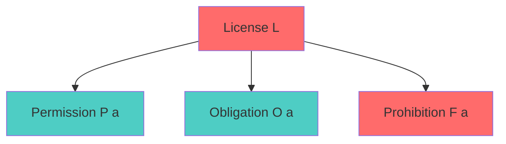
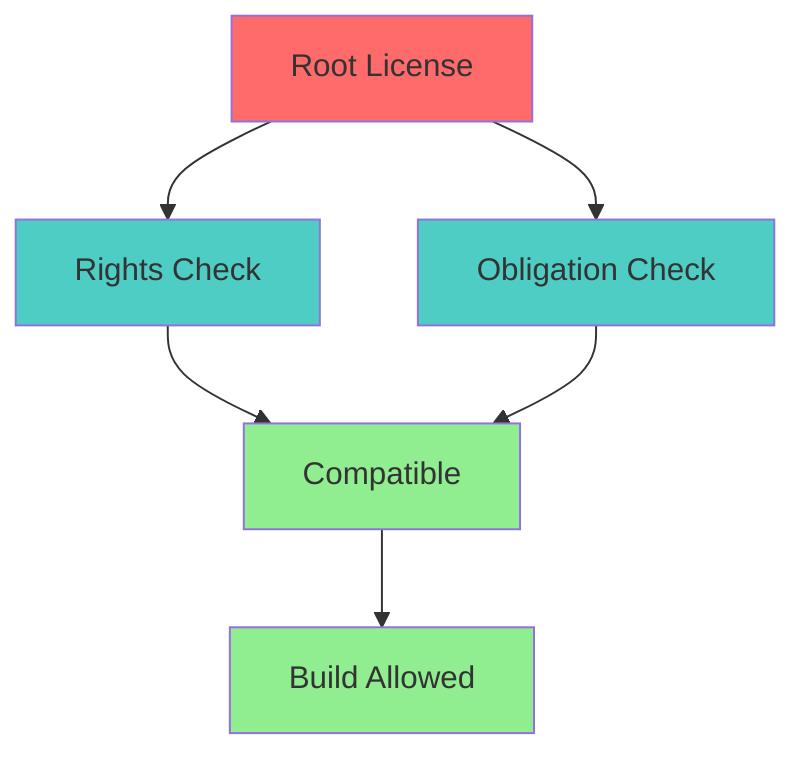
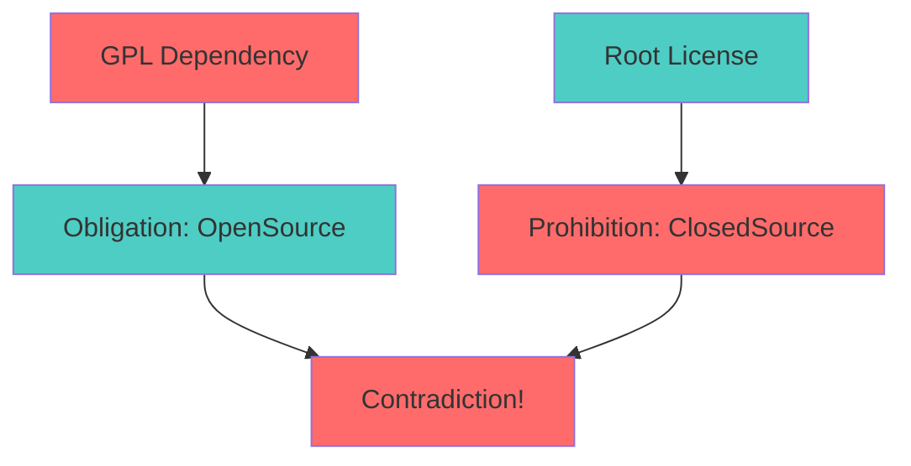
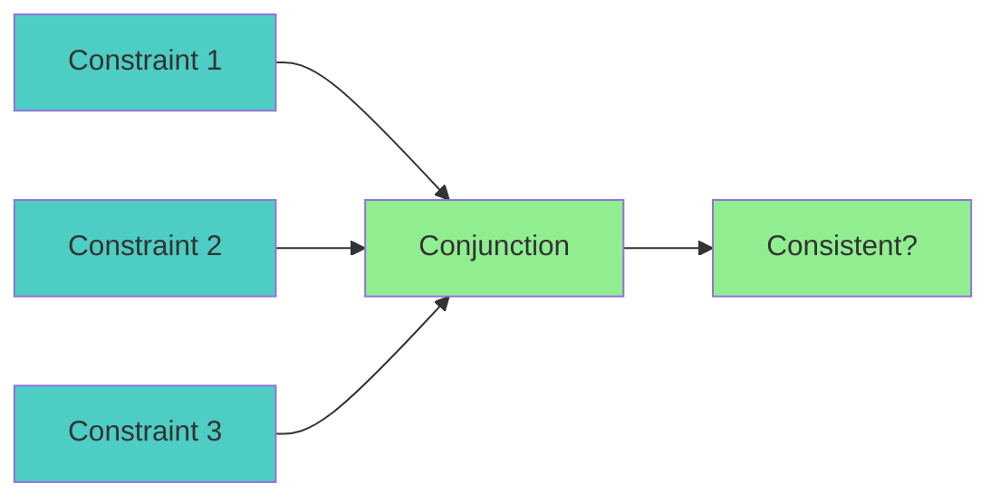

# Deontic Logic Specification (Licensing)

* File:* `licensing\license_deontic_logic_spec.md`
* Version:* 1.0.0
* Context:* Layer 1 (Build) & Layer 5 (LCS)
* Formalism:* Deontic Logic (Modal Logic of Obligation)
* Status:* Active
* Last Modified:* 2026-01-01
* Author:* Kilo Code
* Reviewers:* Pending

- -

## 1. Introduction

### 1.1 Purpose

This specification formalizes the **License Compliance Engine** using **Deontic Logic**, providing mathematical foundation for license compatibility checking. This formalization enables the Morph build system to mathematically prove license compatibility (e.g., GPL infection rules) and reject builds that violate license constraints.

### 1.2 Scope

This specification covers:
- License predicates (Permission, Obligation, Prohibition)
- Compatibility algebra
- GPL infection theorem
- License conflict detection
- Policy engine as theorem prover

This specification does not cover:
- Concrete implementation of license parser
- License text parsing details
- Legal advice or interpretation

### 1.3 Definitions, Acronyms, and Abbreviations

| Term | Definition |
|-------|------------|
| **Deontic Logic** | Modal logic of obligation and permission |
| **License Predicate** | Logical statement about license permissions |
| **Permission** | May do action ($P(a)$) |
| **Obligation** | Must do action ($O(a)$) |
| **Prohibition** | Must not do action ($F(a)$) |
| **Compatibility** | Ability to use licenses together |
| **Infection** | Viral spread of copyleft requirements |
| **Theorem Prover** | System that proves logical consistency |

### 1.4 References

- IEEE 1016: Recommended Practice for Software Design Descriptions
- ISO/IEC 29148: Systems and software engineering — Requirements engineering
- GNU General Public License (GPL) v3
- Mozilla Public License (MPL) 2.0

- -

## 2. Formal Definitions

### 2.1 The License Predicates

We model a License $L$ as a set of logical predicates over a set of Actions $A$.

* LIC-INV-001:* THE system SHALL define license as set of predicates over actions.

* LIC-REQ-001:* THE system SHALL model licenses using deontic predicates.

* Priority:* Critical
* Verification Method:* Test
* Rationale:* Enables formal license reasoning
* Dependencies:* LIC-INV-001
* Traceability:* Section 2.1 (The License Predicates)

#### 2.1.1 Predicate Types

- **$P(a)$:* Permission (May do $a$).
- **$O(a)$:* Obligation (Must do $a$).
- **$F(a)$:* Prohibition (Must not do $a$). ($F(a) \iff O(\neg a)$).

* LIC-INV-002:* THE system SHALL define three predicate types.

* LIC-REQ-002:* THE system SHALL support Permission, Obligation, and Prohibition predicates.

* Priority:* Critical
* Verification Method:* Test
* Rationale:* Enables complete license modeling
* Dependencies:* LIC-INV-002
* Traceability:* Section 2.1.1 (Predicate Types)

#### 2.1.2 Attributes

Actions include: `LinkStatic`, `LinkDynamic`, `Modify`, `Distribute`, `CommercialUse`, `CloseSource`.

* LIC-INV-003:* THE system SHALL define action set for license predicates.

* LIC-REQ-003:* THE system SHALL support all defined actions.

* Priority:* Critical
* Verification Method:* Test
* Rationale:* Enables comprehensive license modeling
* Dependencies:* LIC-INV-003
* Traceability:* Section 2.1.2 (Attributes)

### 2.2 Compatibility Algebra

Let $L_{root}$ be the Project License and $L_{dep}$ be a Dependency License.

The dependency is **Compatible** if and only if:

* LIC-INV-004:* THE system SHALL define compatibility as logical conjunction.

* LIC-REQ-004:* THE system SHALL verify license compatibility logically.

* Priority:* Critical
* Verification Method:* Test
* Rationale:* Ensures legal license combinations
* Dependencies:* LIC-INV-004
* Traceability:* Section 2.2 (Compatibility Algebra)

#### 2.2.1 Rights Check

The project does not perform forbidden actions.

$$ \forall a \in \text{ProjectActions}, \neg F_{dep}(a) $$

* LIC-THM-001:* THE system SHALL guarantee that project actions are permitted.

* Priority:* Critical
* Verification Method:* Analysis
* Rationale:* Ensures legal project actions
* Dependencies:* LIC-INV-004
* Traceability:* Section 2.2.1 (Rights Check)

#### 2.2.2 Obligation Propagation

The project inherits obligations (Viral/Copyleft).

$$ \forall a, O_{dep}(a) \implies O_{root}(a) $$

* LIC-THM-002:* THE system SHALL guarantee that obligations propagate to root.

* Priority:* Critical
* Verification Method:* Analysis
* Rationale:* Ensures viral license compliance
* Dependencies:* LIC-INV-004
* Traceability:* Section 2.2.2 (Obligation Propagation)

### 2.3 The GPL Infection Theorem

* LIC-INV-005:* THE system SHALL define GPL infection rules.

* LIC-REQ-005:* THE system SHALL enforce GPL compatibility rules.

* Priority:* Critical
* Verification Method:* Test
* Rationale:* Prevents GPL license violations
* Dependencies:* LIC-INV-005
* Traceability:* Section 2.3 (The GPL Infection Theorem)

#### 2.3.1 GPL Definition

- Let $L_{GPL}$ define $O(\text{OpenSource})$.
- Let $L_{Prop}$ define $F(\text{OpenSource})$.

* LIC-INV-006:* THE system SHALL define GPL license predicates.

* LIC-REQ-006:* THE system SHALL model GPL license obligations.

* Priority:* Critical
* Verification Method:* Test
* Rationale:* Enables GPL compatibility checking
* Dependencies:* LIC-INV-006
* Traceability:* Section 2.3.1 (GPL Definition)

#### 2.3.2 Conflict

- **Conflict:*
    $$ O_{GPL}(\text{OpenSource}) \implies O_{root}(\text{OpenSource}) $$
    $$ F_{root}(\text{OpenSource}) \implies \neg \text{OpenSource} $$
    $$ \text{Contradiction!} $$

* LIC-THM-003:* THE system SHALL detect GPL license conflicts.

* Priority:* Critical
* Verification Method:* Analysis
* Rationale:* Prevents incompatible license combinations
* Dependencies:* LIC-THM-001, LIC-THM-002
* Traceability:* Section 2.3.2 (Conflict)

#### 2.3.3 Policy Engine

The Policy Engine behaves as a **Theorem Prover**. It rejects the build if the logical conjunction of all dependency constraints leads to $\bot$ (False).

* LIC-INV-007:* THE system SHALL implement policy engine as theorem prover.

* LIC-REQ-007:* THE system SHALL reject builds with license contradictions.

* Priority:* Critical
* Verification Method:* Test
* Rationale:* Ensures legal compliance
* Dependencies:* LIC-INV-007
* Traceability:* Section 2.3.3 (Policy Engine)

* LIC-THM-004:* THE system SHALL guarantee that policy engine detects contradictions.

* Priority:* Critical
* Verification Method:* Analysis
* Rationale:* Ensures license compatibility
* Dependencies:* LIC-THM-003
* Traceability:* Section 2.3.3 (Policy Engine)

- -

## 3. Requirements

### 3.1 Functional Requirements

* LIC-REQ-008:* THE system SHALL support Permission predicates.

* Priority:* Critical
* Verification Method:* Test
* Rationale:* Enables permission modeling
* Dependencies:* LIC-INV-002
* Traceability:* Section 2.1.1 (Predicate Types)

* LIC-REQ-009:* THE system SHALL support Obligation predicates.

* Priority:* Critical
* Verification Method:* Test
* Rationale:* Enables obligation modeling
* Dependencies:* LIC-INV-002
* Traceability:* Section 2.1.1 (Predicate Types)

* LIC-REQ-010:* THE system SHALL support Prohibition predicates.

* Priority:* Critical
* Verification Method:* Test
* Rationale:* Enables prohibition modeling
* Dependencies:* LIC-INV-002
* Traceability:* Section 2.1.1 (Predicate Types)

* LIC-REQ-011:* THE system SHALL support compatibility checking.

* Priority:* Critical
* Verification Method:* Test
* Rationale:* Enables license combination validation
* Dependencies:* LIC-INV-004
* Traceability:* Section 2.2 (Compatibility Algebra)

* LIC-REQ-012:* THE system SHALL support GPL infection detection.

* Priority:* Critical
* Verification Method:* Test
* Rationale:* Prevents GPL license violations
* Dependencies:* LIC-INV-005
* Traceability:* Section 2.3 (The GPL Infection Theorem)

* LIC-REQ-013:* THE system SHALL support theorem proving.

* Priority:* Critical
* Verification Method:* Test
* Rationale:* Ensures logical consistency
* Dependencies:* LIC-INV-007
* Traceability:* Section 2.3.3 (Policy Engine)

### 3.2 Non-Functional Requirements

* LIC-NFR-001:* THE system SHALL check license compatibility in O(n) time for n dependencies.

* Priority:* High
* Verification Method:* Performance test
* Metric:* Compatibility check < 1s for 100 dependencies
* Rationale:* Ensures fast builds
* Dependencies:* None
* Traceability:* Section 2.2 (Compatibility Algebra)

* LIC-NFR-002:* THE system SHALL support up to 1000 licenses.

* Priority:* Medium
* Verification Method:* Stress test
* Metric:* 1000 licenses
* Rationale:* Supports large-scale projects
* Dependencies:* None
* Traceability:* Section 2.1 (The License Predicates)

- -

## 4. Design

### 4.1 Architecture Overview

The License Compliance Engine is implemented as a build component that:
1. Parses license definitions
2. Models licenses using deontic predicates
3. Checks compatibility between licenses
4. Detects GPL infection and conflicts
5. Acts as theorem prover to reject invalid builds

### 4.2 Data Structures

#### 4.2.1 License

* License:* $L = (\text{Predicates}, \text{Actions})$

* Components:*
- Set of predicates over actions
- Set of defined actions

* Invariants:*
1. Predicates are well-formed
2. Actions are defined

#### 4.2.2 Predicate

* Predicate:* $P = (\text{Type}, \text{Action}, \text{Value})$

* Components:*
- Predicate type (Permission, Obligation, Prohibition)
- Action being evaluated
- Boolean value

* Invariants:*
1. Type is valid
2. Action is defined

### 4.3 Algorithms

#### 4.3.1 Compatibility Checking Algorithm

* Algorithm Name:* Check Compatibility

* Input:* Project License $L_{root}$, Dependency License $L_{dep}$

* Output:* Boolean indicating compatibility

* Mathematical Definition:*
$$
\text{Compatible}(L_{root}, L_{dep}) \iff \forall a \in \text{ProjectActions}, \neg F_{dep}(a) \land \forall a, O_{dep}(a) \implies O_{root}(a)
$$

* Pseudocode:*
```
function check_compatibility(root_license, dep_license):
    # Rights check
    for action in project_actions:
        if is_forbidden(dep_license, action):
            return False

    # Obligation propagation
    for action in project_actions:
        if has_obligation(dep_license, action) and
           not has_obligation(root_license, action):
            return False

    return True
```

* Complexity:*
- Time: $O(n)$ where $n$ is number of actions
- Space: $O(1)$

* Correctness:*
- **Invariant:* Returns True only if compatible
- **Termination:* Single pass through actions

#### 4.3.2 GPL Infection Detection Algorithm

* Algorithm Name:* Detect GPL Infection

* Input:* Project License $L_{root}$, Dependency License $L_{dep}$

* Output:* Boolean indicating GPL infection

* Mathematical Definition:*
$$
\text{Infected}(L_{root}, L_{dep}) \iff O_{GPL}(\text{OpenSource}) \land O_{root}(\text{OpenSource}) \land F_{root}(\text{OpenSource})
$$

* Pseudocode:*
```
function detect_gpl_infection(root_license, dep_license):
    if is_gpl(dep_license) and
       has_obligation(dep_license, "OpenSource") and
       has_obligation(root_license, "OpenSource") and
       has_prohibition(root_license, "OpenSource"):
        return True
    return False
```

* Complexity:*
- Time: $O(1)$
- Space: $O(1)$

* Correctness:*
- **Invariant:* Returns True only if infected
- **Termination:* Single predicate evaluation

#### 4.3.3 Theorem Proving Algorithm

* Algorithm Name:* Prove Theorems

* Input:* Set of License Constraints $\mathcal{C}$

* Output:* Boolean indicating consistency

* Mathematical Definition:*
$$
\text{Consistent}(\mathcal{C}) \iff \bigwedge_{c \in \mathcal{C}} c \neq \bot
$$

* Pseudocode:*
```
function prove_theorems(constraints):
    for constraint in constraints:
        if not evaluate(constraint):
            return False
    return True
```

* Complexity:*
- Time: $O(n)$ where $n$ is number of constraints
- Space: $O(n)$ for constraint stack

* Correctness:*
- **Invariant:* Returns True only if all constraints hold
- **Termination:* Single pass through constraints

### 4.4 Mermaid Diagrams

#### 4.4.1 License Predicates



#### 4.4.2 Compatibility Checking



#### 4.4.3 GPL Infection



#### 4.4.4 Theorem Proving



- -

## 5. Correctness Properties

### 5.1 Theorems

#### 5.1.1 Compatibility Theorem

* Theorem:* Compatibility check ensures legal license combinations.

* Proof Sketch:*
1. By definition of compatibility, rights check ensures no forbidden actions
2. By definition of compatibility, obligation propagation ensures viral compliance
3. By definition of compatibility, both conditions must hold
4. Therefore, compatibility check ensures legal license combinations

* LIC-THM-005:* THE system SHALL guarantee compatibility correctness.

* Priority:* Critical
* Verification Method:* Analysis
* Rationale:* Ensures legal license combinations
* Dependencies:* LIC-THM-001, LIC-THM-002
* Traceability:* Section 5.1.1 (Compatibility Theorem)

#### 5.1.2 GPL Infection Theorem

* Theorem:* GPL infection is detected when obligations and prohibitions conflict.

* Proof Sketch:*
1. By definition of GPL, $O_{GPL}(\text{OpenSource})$ requires open source
2. By definition of GPL, $F_{Prop}$ prohibits closed source
3. By definition of infection, both conditions must hold
4. By definition of contradiction, $O \land F$ is impossible
5. Therefore, GPL infection is correctly detected

* LIC-THM-006:* THE system SHALL guarantee GPL infection detection.

* Priority:* Critical
* Verification Method:* Analysis
* Rationale:* Prevents GPL license violations
* Dependencies:* LIC-THM-003
* Traceability:* Section 5.1.2 (GPL Infection Theorem)

#### 5.1.3 Theorem Proving Theorem

* Theorem:* Theorem prover detects logical contradictions.

* Proof Sketch:*
1. By definition of theorem proving, all constraints must be satisfiable
2. By definition of conjunction, $\bigwedge c$ is satisfiable iff all $c$ are satisfiable
3. By definition of evaluation, unsatisfiable constraints return False
4. Therefore, theorem prover detects contradictions

* LIC-THM-007:* THE system SHALL guarantee theorem proving correctness.

* Priority:* Critical
* Verification Method:* Analysis
* Rationale:* Ensures logical consistency
* Dependencies:* LIC-THM-004
* Traceability:* Section 5.1.3 (Theorem Proving Theorem)

### 5.2 Invariants

#### 5.2.1 License Invariants

- **LIC-INV-008:* THE system SHALL maintain that predicates are well-formed
- **LIC-INV-009:* THE system SHALL maintain that actions are defined

#### 5.2.2 Compatibility Invariants

- **LIC-INV-010:* THE system SHALL maintain that compatibility is transitive
- **LIC-INV-011:* THE system SHALL maintain that obligations propagate correctly

#### 5.2.3 Theorem Proving Invariants

- **LIC-INV-012:* THE system SHALL maintain that contradictions are detected
- **LIC-INV-013:* THE system SHALL maintain that satisfiable constraints are accepted

- -

## 6. Examples

### 6.1 Simple Compatibility

```morph
// Simple compatibility: MIT + MIT
// Root license: MIT
// Dependency license: MIT
// Result: Compatible (no conflicts)
```

* Compatibility Check:*
- Rights: No forbidden actions
- Obligations: None (MIT has no obligations)
- Result: Compatible

### 6.2 GPL Infection

```morph
// GPL infection: Proprietary + GPL
// Root license: Proprietary (ClosedSource)
// Dependency license: GPL (OpenSource obligation)
// Result: Infection detected
```

* Infection Detection:*
- $O_{GPL}(\text{OpenSource}) = \text{True}$
- $O_{root}(\text{OpenSource}) = \text{False}$
- $F_{root}(\text{OpenSource}) = \text{True}$
- Result: Infected

### 6.3 Obligation Propagation

```morph
// Obligation propagation: GPL + MIT
// Root license: MIT
// Dependency license: GPL (OpenSource obligation)
// Result: Incompatible (MIT doesn't have OpenSource obligation)
```

* Compatibility Check:*
- Rights: No forbidden actions
- Obligations: GPL requires OpenSource, MIT doesn't require it
- Result: Incompatible

### 6.4 Theorem Proving

```morph
// Theorem proving: Consistent constraints
// Constraint 1: MIT allows commercial use
// Constraint 2: GPL requires open source
// Result: Contradiction (cannot be both)
```

* Theorem Proving:*
- Constraint 1: $P_{MIT}(\text{CommercialUse}) = \text{True}$
- Constraint 2: $O_{GPL}(\text{OpenSource}) \implies O_{MIT}(\text{OpenSource})$
- Result: Contradiction detected

### 6.5 Edge Cases

#### 6.5.1 No License

```morph
// Edge case: No license specified
// Result: Error (license required)
```

* Error:* License required

#### 6.5.2 Unknown License

```morph
// Edge case: Unknown license type
// Result: Warning (license not recognized)
```

* Warning:* License not recognized

- -

## Change Log

| Version | Date       | Author      | Changes                                                                 |
|---------|------------|-------------|-------------------------------------------------------------------------|
| 1.0.0   | 2026-01-01 | Kilo Code    | Initial version                                                        |
