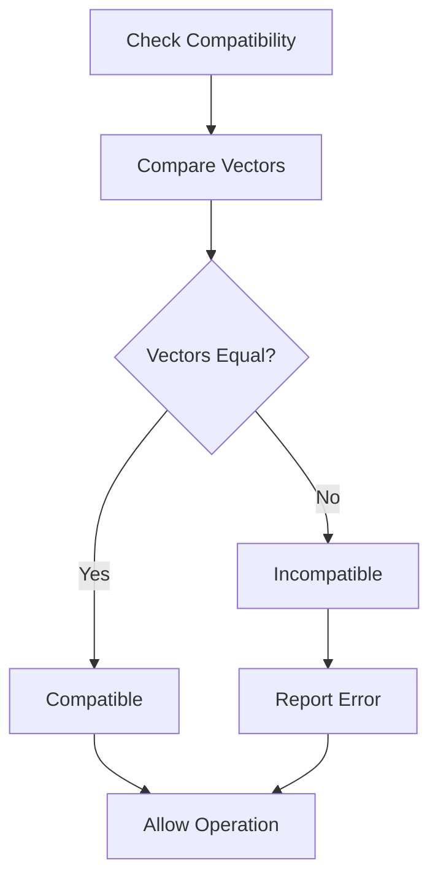
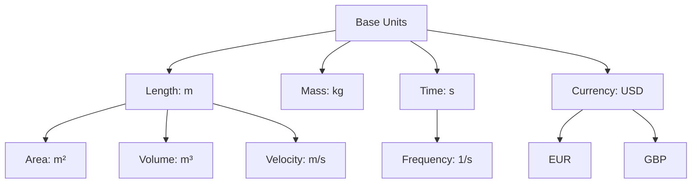

# Dimensional Algebra Specification (Unit Theory)

- `File:* `math\unit_group_theory_spec.md`
- `Version:* 2.0.0
- `Context:* Layer 2 (Compiler) - Scientific/Financial
- `Formalism:* Free Abelian Groups
- `Status:* Active
- Last Modified:* 2026-01-01
- `Author:* Kilo Code
- `Reviewers:* Pending

- -

## 1. Introduction

### 1.1 Purpose

This specification formalizes the Unit System of Morph as a **Free Abelian Group**, providing mathematical foundation for dimensional analysis, type-safe unit conversions, and compile-time unit checking. This formalization ensures that physical quantities are handled correctly at the type level.

* Note:* This specification provides the **formal mathematical foundation** for the unit system. The **practical syntax** for declaring and using units is defined in [`spec/math/maths_spec.md`](./maths_spec.md). The formal structures defined here map directly to the syntax defined in Math Spec.

### 1.2 Scope

This specification covers:
- The Group of Dimensions ($\mathcal{D}$) as a Free Abelian Group
- Group operations for unit arithmetic (multiplication, division)
- The "Exchange Rate" Invariant for currency conversion
- Type system integration for unit checking

This specification does not cover:
- Concrete implementation of unit storage
- Runtime unit conversion algorithms
- User-defined unit extensions

### 1.3 Definitions, Acronyms, and Abbreviations

| Term | Definition |
|-------|------------|
| **Free Abelian Group** | A group where elements can be uniquely expressed as linear combinations of basis elements |
| **Dimension** | A physical quantity type (e.g., Length, Mass, Time) |
| **Unit** | A specific measurement scale (e.g., Meter, Kilogram, Second) |
| **Base Unit** | A fundamental unit from which all others are derived |
| **Derived Unit** | A unit expressed as combination of base units |
| **Exchange Rate** | Conversion factor between two units of same dimension |

### 1.4 References

- ISO 80000: Quantities and units
- IEEE 754: Floating-point arithmetic
- Kennedy, A. J. (1996). "Dimensional Analysis and Its Applications"
- ISO/IEC 29148: Systems and software engineering — Requirements engineering

- -

### 1.5 Algebra to Syntax Mapping

The formal algebraic structures defined in this specification map directly to practical syntax defined in [`spec/math/maths_spec.md`](./maths_spec.md).

#### 1.5.1 Unit Vector to Syntax Mapping

* Formal Representation (this spec):*
- Base unit: $\vec{v} = [1, 0, 0, 0]$ (e.g., Meter)
- Derived unit: $\vec{v} = [1, 0, -1, 0]$ (e.g., Velocity = Meter / Second)

* Syntax (Math Spec):*
```rust
unit Meter;           // Maps to [1, 0, 0, 0]
unit Second;          // Maps to [0, 0, 1, 0]
unit Velocity = Meter / Second;  // Maps to [1, 0, -1, 0]
```

* Mathematical Operation:*
$$ \vec{v}_{Velocity} = \vec{v}_{Meter} - \vec{v}_{Second} = [1, 0, 0, 0] - [0, 0, 1, 0] = [1, 0, -1, 0] $$

#### 1.5.2 Group Operations to Syntax Mapping

* Formal Representation (this spec):*
- Multiplication: $\vec{v}_1 + \vec{v}_2$ (vector addition)
- Division: $\vec{v}_1 - \vec{v}_2$ (vector subtraction)
- Identity: $\vec{0}$ (dimensionless)

* Syntax (Math Spec):*
```rust
let dist: f64<Meter> = 100.0;      // Vector: [1, 0, 0, 0]
let time: f64<Second> = 9.8;        // Vector: [0, 0, 1, 0]
let speed = dist / time;              // Vector: [1, 0, 0, 0] - [0, 0, 1, 0] = [1, 0, -1, 0]
let area = dist * dist;               // Vector: [1, 0, 0, 0] + [1, 0, 0, 0] = [2, 0, 0, 0]
let ratio = dist / dist;             // Vector: [1, 0, 0, 0] - [1, 0, 0, 0] = [0, 0, 0, 0] (scalar)
```

* Mathematical Operations:*
$$ \vec{v}_{speed} = \vec{v}_{dist} - \vec{v}_{time} $$
$$ \vec{v}_{area} = \vec{v}_{dist} + \vec{v}_{dist} $$
$$ \vec{v}_{ratio} = \vec{v}_{dist} - \vec{v}_{dist} = \vec{0} $$

#### 1.5.3 Compatibility Check to Syntax Mapping

* Formal Representation (this spec):*
$$ \text{Compatible}(\vec{v}_1, \vec{v}_2) = (\vec{v}_1 = \vec{v}_2) $$

* Syntax (Math Spec):*
```rust
let x: f64<Meter> = 10.0;  // Vector: [1, 0, 0, 0]
let y: f64<Second> = 5.0;  // Vector: [0, 0, 1, 0]
let z = x + y;              // ERROR: [1, 0, 0, 0] ≠ [0, 0, 1, 0]
```

* Error Message:* "Type error: Cannot add 'm' and 's' (incompatible dimensions)"

* Note:* The compiler performs vector equality check to determine compatibility.

#### 1.5.4 Exchange Rate to Syntax Mapping

* Formal Representation (this spec):*
$$ \vec{v}_{EUR/USD} = \vec{v}_{EUR} - \vec{v}_{USD} = [0, 0, 0, 1]_{EUR} - [0, 0, 0, 1]_{USD} $$

* Syntax (Math Spec):*
```rust
let rate: f64<EUR / USD> = 0.85;  // Maps to [0, 0, 0, 1]_{EUR} - [0, 0, 0, 1]_{USD}
let usd_amount: f64<USD> = 100.0;  // Vector: [0, 0, 0, 1]_{USD}
let eur_amount = usd_amount * rate;    // Vector: [0, 0, 0, 1]_{USD} + ([0, 0, 0, 1]_{EUR} - [0, 0, 0, 1]_{USD}) = [0, 0, 0, 1]_{EUR}
```

* Mathematical Operation:*
$$ \vec{v}_{eur\_amount} = \vec{v}_{usd\_amount} + \vec{v}_{rate} $$
$$ = [0, 0, 0, 1]_{USD} + ([0, 0, 0, 1]_{EUR} - [0, 0, 0, 1]_{USD}) $$
$$ = [0, 0, 0, 1]_{EUR} $$

* Note:* This formalization ensures that exchange rates are type-safe and algebraically correct.

- -

## 2. Formal Definitions

### 2.1 The Group of Dimensions ($\mathcal{D}$)

The Unit System is not just string matching; it is a **Free Abelian Group**.

#### 2.1.1 Definition

Let $B = \{L, M, T, \$\}$ be the set of Base Units (Length, Mass, Time, Currency).

Any Type $U$ is an element of the group $\mathbb{Z}^n$ (where $n = |B|$).

A unit is represented by a vector of exponents:

$$ v = [e_L, e_M, e_T, e_\$] $$

- `Examples:*
- `Meter` ($L$): $[1, 0, 0, 0]$
- `Second` ($T$): $[0, 0, 1, 0]$
- `Velocity` ($L/T$): $[1, 0, -1, 0]$
- `USD` ($\$$): $[0, 0, 0, 1]$

- UNT-INV-001:* THE system SHALL represent units as exponent vectors in $\mathbb{Z}^n$.

### 2.2 Group Operations (Compiler Logic)

#### 2.2.1 Multiplication (Vector Addition)

When types are multiplied ($x \cdot y$), their unit vectors are added.

$$ U_x \cdot U_y \implies \vec{v}_x + \vec{v}_y $$

- `Example:* $m \cdot m = [1,0,0,0] + [1,0,0,0] = [2,0,0,0]$ ($m^2$, Area).

- UNT-REQ-001:* THE system SHALL add unit vectors when multiplying types.

- `Priority:* Critical
- Verification Method:* Test
- `Rationale:* Ensures correct dimensional analysis
- `Dependencies:* UNT-INV-001
- `Traceability:* Section 2.2.1 (Multiplication)

#### 2.2.2 Division (Vector Subtraction)

$$ U_x / U_y \implies \vec{v}_x - \vec{v}_y $$

- `Example:* $m / s = [1,0,0,0] - [0,0,1,0] = [1,0,-1,0]$ (Velocity).

- UNT-REQ-002:* THE system SHALL subtract unit vectors when dividing types.

- `Priority:* Critical
- Verification Method:* Test
- `Rationale:* Ensures correct dimensional analysis
- `Dependencies:* UNT-INV-001
- `Traceability:* Section 2.2.2 (Division)

#### 2.2.3 Identity (Scalar)

The scalar type `f64` (dimensionless) is the identity element $\vec{0} = [0,0,0,0]$.

- UNT-INV-002:* THE system SHALL treat dimensionless types as identity element.

### 2.3 The "Exchange Rate" Invariant

An exchange rate `EUR/USD` is mathematically:

$$ \vec{v}_{EUR} - \vec{v}_{USD} = [0,0,0,1]_{EUR} - [0,0,0,1]_{USD} $$

To convert `USD` to `EUR`:

$$ \text{Amount} \cdot \text{Rate} \implies [0,0,0,1]_{USD} + ([0,0,0,1]_{EUR} - [0,0,0,1]_{USD}) = [0,0,0,1]_{EUR} $$

- UNT-THM-001:* THE system SHALL guarantee that Dimensional Analysis ensures correct Currency Conversion.

- `Priority:* High
- Verification Method:* Analysis
- `Rationale:* Provides formal guarantee for financial calculations
- `Dependencies:* UNT-INV-001
- `Traceability:* Section 2.3 (Exchange Rate Invariant)

- -

## 3. Requirements

### 3.1 Functional Requirements

- UNT-REQ-003:* THE system SHALL reject operations with incompatible dimensions.

- `Priority:* Critical
- Verification Method:* Test
- `Rationale:* Prevents type errors in physical calculations
- `Dependencies:* UNT-INV-001
- `Traceability:* Section 2.1.1 (Definition)

- UNT-REQ-004:* THE system SHALL support user-defined units as combinations of base units.

- `Priority:* High
- Verification Method:* Test
- `Rationale:* Enables extensibility for domain-specific units
- `Dependencies:* None
- `Traceability:* Section 2.1 (Group of Dimensions)

- UNT-REQ-005:* THE system SHALL compute derived units automatically from expressions.

- `Priority:* High
- Verification Method:* Test
- `Rationale:* Reduces boilerplate and ensures correctness
- `Dependencies:* UNT-REQ-001, UNT-REQ-002
- `Traceability:* Section 2.2 (Group Operations)

- UNT-REQ-006:* THE system SHALL validate exchange rates at compile time.

- `Priority:* High
- Verification Method:* Test
- `Rationale:* Prevents runtime conversion errors
- `Dependencies:* UNT-THM-001
- `Traceability:* Section 2.3 (Exchange Rate Invariant)

### 3.2 Non-Functional Requirements

- UNT-NFR-001:* THE system SHALL perform unit checking in O(1) time complexity.

- `Priority:* High
- Verification Method:* Analysis
- `Metric:* Unit check < 1μs per operation
- `Rationale:* Ensures fast compilation

- UNT-NFR-002:* THE system SHALL support up to 100 base units.

- `Priority:* Medium
- Verification Method:* Demonstration
- `Metric:* 100 base units with < 10MB memory
- `Rationale:* Supports complex scientific applications

- UNT-NFR-003:* THE system SHALL provide clear error messages for dimension mismatches.

- `Priority:* High
- Verification Method:* Demonstration
- `Metric:* Error message includes expected and actual dimensions
- `Rationale:* Improves developer experience

- -

## 4. Design

### 4.1 Architecture Overview

The unit system is implemented as a compile-time type checker that operates on exponent vectors. The checker ensures dimensional consistency by verifying that operations preserve the group structure.

### 4.2 Data Structures

#### 4.2.1 Unit Vector

- Unit Vector:* $\vec{v} = [e_1, e_2, \dots, e_n]$

- `Components:*
- $e_i \in \mathbb{Z}$: Exponent for base unit $i$
- $n$: Number of base units

- `Invariants:*
1. $\forall i, e_i \in \mathbb{Z}$ (Integer exponents)
2. $\vec{v} = \vec{0}$ for dimensionless types

#### 4.2.2 Unit Definition

- `Unit:* $U = (\text{name}, \vec{v}, \text{scale})$

- `Components:*
- $\text{name} \in \text{String}$: Unit name (e.g., "meter")
- $\vec{v} \in \mathbb{Z}^n$: Dimension vector
- $\text{scale} \in \mathbb{R}$: Conversion factor to SI unit

- `Invariants:*
1. $\text{scale} > 0$ (Positive scale)
2. $\vec{v}$ is unique per unit name

### 4.3 Algorithms

#### 4.3.1 Unit Addition Algorithm

- Algorithm Name:* Add Unit Vectors

- `Input:* Unit vectors $\vec{v}_1, \vec{v}_2$

- `Output:* Result vector $\vec{v}_{result}$

- Mathematical Definition:*
$$ \vec{v}_{result} = \vec{v}_1 + \vec{v}_2 = [e_{1,1} + e_{2,1}, \dots, e_{1,n} + e_{2,n}] $$

- `Pseudocode:*
```
function add_units(v1, v2):
    result = []
    for i in 0..n:
        result.append(v1[i] + v2[i])
    return result
```

- `Complexity:*
- Time: $O(n)$ where $n$ is number of base units
- Space: $O(n)$

- `Correctness:*
- **Invariant:* Result is valid unit vector
- **Termination:* Loop terminates after $n$ iterations

#### 4.3.2 Unit Compatibility Check Algorithm

- Algorithm Name:* Check Dimension Compatibility

- `Input:* Unit vectors $\vec{v}_1, \vec{v}_2$

- `Output:* Boolean indicating compatibility

- Mathematical Definition:*
$$ \text{Compatible}(\vec{v}_1, \vec{v}_2) = (\vec{v}_1 = \vec{v}_2) $$

- `Pseudocode:*
```
function are_compatible(v1, v2):
    for i in 0..n:
        if v1[i] != v2[i]:
            return false
    return true
```

- `Complexity:*
- Time: $O(n)$
- Space: $O(1)$

- `Correctness:*
- **Invariant:* Returns true iff vectors are equal
- **Termination:* Loop terminates after $n$ iterations

### 4.4 Mermaid Diagrams

#### 4.4.1 Unit Vector Addition

```mermaid
graph LR
    V1[v1 = [1,0,0,0]] --> Add[+]
    V2[v2 = [0,0,1,0]] --> Add
    Add --> Result[v3 = [1,0,1,0]]
    Result --> Label[Velocity: m/s]
```

#### 4.4.2 Dimension Compatibility Check



#### 4.4.3 Unit System Hierarchy



- -

## 5. Correctness Properties

### 5.1 Theorems

#### 5.1.1 Group Closure Theorem

- `Theorem:* The set of unit vectors $\mathbb{Z}^n$ with vector addition forms an Abelian Group.

- Proof Sketch:*
1. **Closure:* $\forall \vec{v}_1, \vec{v}_2 \in \mathbb{Z}^n, \vec{v}_1 + \vec{v}_2 \in \mathbb{Z}^n$
2. **Associativity:* $(\vec{v}_1 + \vec{v}_2) + \vec{v}_3 = \vec{v}_1 + (\vec{v}_2 + \vec{v}_3)$
3. **Identity:* $\vec{0} + \vec{v} = \vec{v}$
4. **Inverse:* $\forall \vec{v}, \exists -\vec{v}$ such that $\vec{v} + (-\vec{v}) = \vec{0}$
5. **Commutativity:* $\vec{v}_1 + \vec{v}_2 = \vec{v}_2 + \vec{v}_1$

- UNT-THM-002:* THE system SHALL maintain group properties for unit operations.

- `Priority:* Critical
- Verification Method:* Analysis
- `Rationale:* Ensures mathematical correctness
- `Dependencies:* UNT-INV-001
- `Traceability:* Section 2.1 (Group of Dimensions)

#### 5.1.2 Dimensional Consistency Theorem

- `Theorem:* If an expression type-checks with unit vectors, then the expression is dimensionally consistent.

- Proof Sketch:*
1. By induction on expression structure
2. Base case: Literals have correct units
3. Inductive step: If subexpressions are consistent, operations preserve consistency
4. Therefore, entire expression is consistent

- UNT-THM-003:* THE system SHALL guarantee dimensional consistency for type-checked expressions.

- `Priority:* Critical
- Verification Method:* Analysis
- `Rationale:* Prevents physical calculation errors
- `Dependencies:* UNT-REQ-003
- `Traceability:* Section 3.1 (Functional Requirements)

### 5.2 Invariants

#### 5.2.1 Unit Invariants

- **UNT-INV-003:* THE system SHALL maintain that unit vectors have integer exponents
- **UNT-INV-004:* THE system SHALL maintain that dimensionless type is identity element
- **UNT-INV-005:* THE system SHALL maintain that unit names are unique

#### 5.2.2 Operation Invariants

- **UNT-INV-006:* THE system SHALL maintain that multiplication adds vectors
- **UNT-INV-007:* THE system SHALL maintain that division subtracts vectors
- **UNT-INV-008:* THE system SHALL maintain that exponentiation multiplies vectors

- -

## 6. Examples

### 6.1 Basic Unit Operations

```morph
let distance: f64<m> = 10.0;
let time: f64<s> = 5.0;
let velocity: f64<m/s> = distance / time;  // [1,0,0,0] - [0,0,1,0] = [1,0,-1,0]
```

- Unit Computation:*
1. `distance`: $[1, 0, 0, 0]$ (meters)
2. `time`: $[0, 0, 1, 0]$ (seconds)
3. `velocity`: $[1, 0, -1, 0]$ (meters/second)

### 6.2 Dimensional Error

```morph
let length: f64<m> = 10.0;
let time: f64<s> = 5.0;
let error = length + time;  // ERROR: Cannot add m and s
```

- Error Message:* "Type error: Cannot add 'm' and 's' (incompatible dimensions)"

### 6.3 Currency Conversion

```morph
let rate: f64<USD/EUR> = 0.85;
let usd_amount: f64<USD> = 100.0;
let eur_amount: f64<EUR> = usd_amount * rate;
```

- Unit Computation:*
1. `usd_amount`: $[0, 0, 0, 1]_{USD}$
2. `rate`: $[0, 0, 0, 1]_{EUR} - [0, 0, 0, 1]_{USD}$
3. `eur_amount`: $[0, 0, 0, 1]_{USD} + ([0, 0, 0, 1]_{EUR} - [0, 0, 0, 1]_{USD}) = [0, 0, 0, 1]_{EUR}$

### 6.4 Derived Units

```morph
type Area = f64<m²>;
type Volume = f64<m³>;
type Density = f64<kg/m³>;

let side: f64<m> = 2.0;
let area: Area = side * side;  // [1,0,0,0] + [1,0,0,0] = [2,0,0,0]
let volume: Volume = area * side;  // [2,0,0,0] + [1,0,0,0] = [3,0,0,0]
let mass: f64<kg> = 8.0;
let density: Density = mass / volume;  // [0,1,0,0] - [3,0,0,0] = [-3,1,0,0]
```

### 6.5 User-Defined Units

```morph
unit Pixel = m / 96;  // 1 pixel = 1/96 meter
unit DPI = 1 / m;

let width_px: f64<Pixel> = 1920;
let height_px: f64<Pixel> = 1080;
let width_m: f64<m> = width_px * (1 / 96);
let dpi: f64<DPI> = width_px / width_m;
```

- Unit Computation:*
1. `Pixel`: $[1, 0, 0, 0] - [0, 0, 0, 0] = [1, 0, 0, 0]$ (still meters, just scaled)
2. `DPI`: $[0, 0, 0, 0] - [1, 0, 0, 0] = [-1, 0, 0, 0]$ (1/meter)

### 6.6 Edge Cases

#### 6.6.1 Zero Exponent

```morph
let value: f64<m⁰> = 10.0;  // Dimensionless
let result: f64 = value * 5.0;  // Allowed: both dimensionless
```

- Unit Computation:*
1. `value`: $[0, 0, 0, 0]$ (dimensionless)
2. `result`: $[0, 0, 0, 0]$ (dimensionless)

#### 6.6.2 Negative Exponent

```morph
let area: f64<m²> = 100.0;
let length: f64<m> = sqrt(area);  // [2,0,0,0] / 2 = [1,0,0,0]
```

- Unit Computation:*
1. `area`: $[2, 0, 0, 0]$ (square meters)
2. `length`: $[1, 0, 0, 0]$ (meters)

- -

## Change Log

| Version | Date       | Author      | Changes                                                                 |
|---------|------------|-------------|-------------------------------------------------------------------------|
| 2.0.0   | 2026-01-01 | Kilo Code    | Refactored to match specification convention v2.0.0, added EARS requirements, Mermaid diagrams, and examples |
| 1.0.0   | 2025-12-01 | Kilo Code    | Initial version                                                        |
