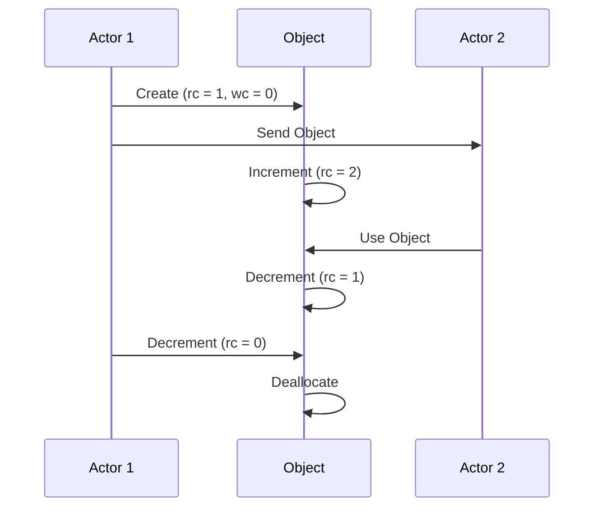
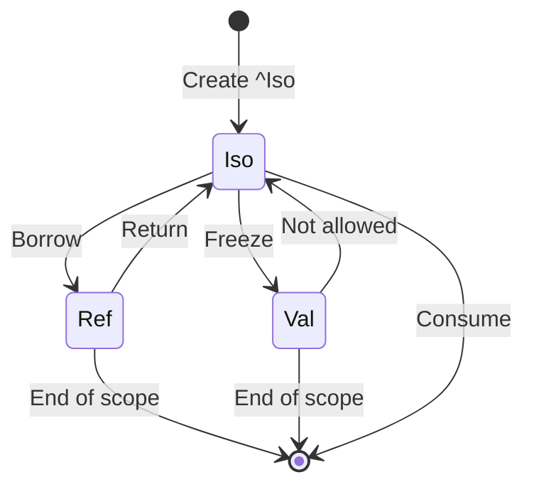
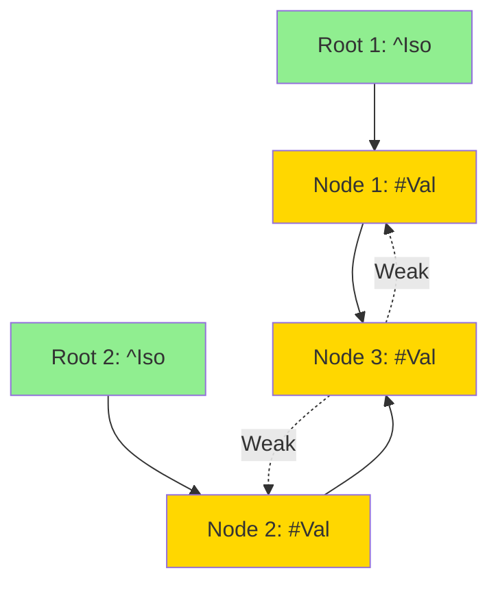
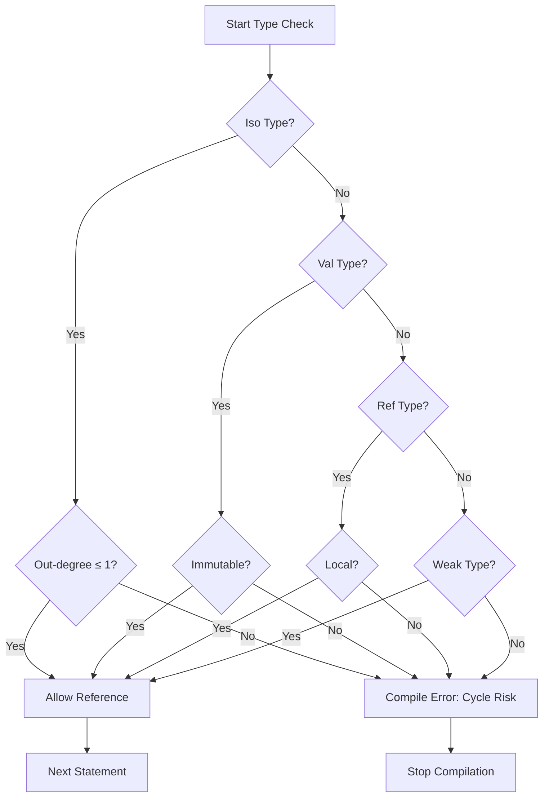

# ARC with Affine Types Integration Specification

- `File:* `memory\arc_affine_integration_spec.md`
- `Version:* 1.0.0
- `Context:* Layer 2 (Semantic Analysis) & Layer 3 (Runtime)
- `Formalism:* Reference Counting with Substructural Type Theory
- `Status:* Active
- Last Modified:* 2026-01-02
- `Author:* Kilo Code
- `Reviewers:* Pending

---

## 1. Introduction

### 1.1 Purpose

This specification defines the integration of Atomic Reference Counting (ARC) with affine types in the Morph memory model. This integration provides deterministic memory management without tracing garbage collection while ensuring memory safety through compile-time type constraints. The specification formalizes how ARC and affine types work together to prevent reference cycles, guarantee memory safety, and provide bounded latency guarantees.

### 1.2 Scope

This specification covers:
- Formal semantics of Atomic Reference Counting (ARC)
- Formal semantics of affine types and substructural logic
- Integration mechanisms between ARC and affine types
- Cycle prevention through compile-time and runtime mechanisms
- Memory safety guarantees (no use-after-free, no double-free, no memory leaks)
- Performance characteristics of ARC with affine types
- Examples demonstrating ARC and affine type integration
- Theorems proving cycle prevention and memory safety
- Invariants maintained by the integrated system

This specification does not cover:
- Concrete implementation details of atomic operations
- Hardware-specific memory barriers
- Tracing garbage collection algorithms (prohibited in Morph)
- Runtime memory profiling tools

### 1.3 Definitions, Acronyms, and Abbreviations

| Term | Definition |
|-------|------------|
| **ARC** | Atomic Reference Counting - thread-safe reference counting for shared objects |
| **Affine Type** | A type that can be used at most once (move semantics) |
| **Linear Type** | A type that must be used exactly once (cannot be dropped) |
| **Control Block** | Metadata structure containing reference counts and weak reference counts |
| **Strong Reference** | A reference that prevents deallocation (Iso, Val, Ref) |
| **Weak Reference** | A non-owning reference that does not prevent deallocation |
| **Capability** | A type modifier specifying how a value can be used (Iso, Val, Ref, Weak) |
| **DAG** | Directed Acyclic Graph - a directed graph with no cycles |
| **Memory Safety** | Guarantee of no use-after-free, no double-free, no data races, no memory leaks |
| **Bounded Latency** | Guaranteed maximum execution time for operations |

### 1.4 References

- Pierce, B. C. (2002). "Types and Programming Languages"
- Girard, J.-Y. (1987). "Linear Logic"
- Wadler, P. (1990). "Linear types can change the world!"
- Tarditi, D. (2012). "The Pony Language"
- ISO/IEC 29148: Systems and software engineering — Requirements engineering
- IEEE 754: Floating-point arithmetic

### 1.5 Cross-References

The ARC with Affine Types Integration Specification is closely related to several other Morph specifications. The following cross-references provide additional context and detailed specifications for related concepts:

* Memory Model Specifications:*
- [`spec/memory/memory_model_spec.md`](./memory_model_spec.md) - Memory management model, ARC implementation, and runtime memory operations
- [`spec/memory/memory_affine_logic_spec.md`](./memory_affine_logic_spec.md) - Affine logic formalization for memory safety
- [`spec/memory/memory_acyclicity_spec.md`](./memory_acyclicity_spec.md) - Memory acyclicity enforcement using affine logic and graph theory

* Type System Specifications:*
- [`spec/type/type_system_spec.md`](../type/type_system_spec.md) - Type system, capability sigils, and affine logic formalization
- [`spec/type/type_category_spec.md`](../type/type_category_spec.md) - Type category theory and algebraic type foundations

* Concurrency Specifications:*
- [`spec/concurrency/execution_model_spec.md`](../concurrency/execution_model_spec.md) - Execution model, actor model, and scheduler implementation
- [`spec/concurrency/concurrency_process_algebra_spec.md`](../concurrency/concurrency_process_algebra_spec.md) - Process algebra formalization of concurrent communication

* Contradiction Resolution:*
- [`SPEC_CONTRADICTIONS.md`](../../SPEC_CONTRADICTIONS.md) - Contradiction #4: ARC vs Tracing GC analysis
- [`SPEC_FIX_PROPOSAL.md`](../../SPEC_FIX_PROPOSAL.md) - Week 9-10 Medium Priority: Document ARC with affine types

* Note:* These cross-references help readers navigate the Morph specification ecosystem by providing links to related specifications that provide complementary or detailed information about concepts referenced in this document.

---

## 2. Formal Definitions

### 2.1 Atomic Reference Counting (ARC)

#### 2.1.1 ARC Formal Semantics

Let $\mathcal{O}$ be the set of all heap-allocated objects. For each object $o \in \mathcal{O}$, define a control block:

$$ CB(o) = (rc_o, wc_o, ptr_o) $$

where:
- $rc_o \in \mathbb{N}$: Strong reference count (atomic)
- $wc_o \in \mathbb{N}$: Weak reference count (atomic)
- $ptr_o \in \mathbb{N}$: Pointer to object data

**ARC-AAI-INV-001:* THE system SHALL maintain that $rc_o \geq 0$ and $wc_o \geq 0$ for all objects.

#### 2.1.2 ARC Operations

Define ARC operations with atomic semantics:

**Increment (Retain):*
$$ \text{retain}(o) = \text{fetch\_add}(rc_o, 1, \text{memory\_order\_relaxed}) $$

**Decrement (Release):*
$$ \text{release}(o) = \begin{cases}
\text{deallocate}(o) & \text{if } \text{fetch\_sub}(rc_o, 1, \text{memory\_order\_acq\_rel}) = 0 \\
\text{noop} & \text{otherwise}
\end{cases} $$

**Weak Increment:*
$$ \text{weak\_retain}(o) = \text{fetch\_add}(wc_o, 1, \text{memory\_order\_relaxed}) $$

**Weak Decrement:*
$$ \text{weak\_release}(o) = \begin{cases}
\text{deallocate}(o) & \text{if } rc_o = 0 \land \text{fetch\_sub}(wc_o, 1, \text{memory\_order\_acq\_rel}) = 0 \\
\text{noop} & \text{otherwise}
\end{cases} $$

**ARC-AAI-INV-002:* THE system SHALL perform all ARC operations atomically.

#### 2.1.3 ARC Memory Ordering

ARC operations use specific memory ordering guarantees:

- **Increment:* `memory_order_relaxed` - No synchronization required
- **Decrement:* `memory_order_acq_rel` - Acquire-release semantics for deallocation
- **Weak operations:* `memory_order_relaxed` - No synchronization required

**ARC-AAI-INV-003:* THE system SHALL use acquire-release semantics for decrement operations.

### 2.2 Affine Types Formal Semantics

#### 2.2.1 Affine Type Definition

A type $T$ is **Affine** if:

$$ \forall x: T, \text{uses}(x) \leq 1 $$

A type $T$ is **Linear** if:

$$ \forall x: T, \text{uses}(x) = 1 $$

**ARC-AAI-INV-004:* THE system SHALL enforce affine type usage constraints at compile time.

#### 2.2.2 Context Splitting

For affine types, the typing context $\Gamma$ must be split for operations consuming multiple resources:

$$ \frac{\Gamma_1 \vdash e_1 : A \quad \Gamma_2 \vdash e_2 : B}{\Gamma_1, \Gamma_2 \vdash (e_1, e_2) : A \otimes B} $$

where $\Gamma_1 \cap \Gamma_2 = \emptyset$ (disjoint contexts).

**ARC-AAI-INV-005:* THE system SHALL ensure disjoint context splitting for affine operations.

#### 2.2.3 Capability Modalities

Define capability modalities as type constructors:

**Iso Modality (Affine):*
$$ \text{Iso}(T) = \{ x: T \mid \text{uses}(x) \leq 1 \} $$

**Val Modality (Unrestricted):*
$$ \text{Val}(T) = \{ x: T \mid \text{uses}(x) \in \mathbb{N} \} $$

**Ref Modality (Borrowed):*
$$ \text{Ref}(T) = \{ x: T \mid \exists \rho, x \text{ valid in } \rho \} $$

**Weak Modality (Non-owning):*
$$ \text{Weak}(T) = \{ x: \text{Val}(T) \mid \text{does\_not\_prevent\_deallocation}(x) \} $$

**ARC-AAI-INV-006:* THE system SHALL enforce capability modality semantics.

### 2.3 Integration of ARC and Affine Types

#### 2.3.1 Reference Graph Definition

Define the reference graph $G = (V, E)$ where:
- $V = \mathcal{O}$: Set of all heap-allocated objects
- $E = \{ (o_1, o_2) \mid o_1 \text{ holds strong reference to } o_2 \}$

**ARC-AAI-INV-007:* THE system SHALL maintain that strong references form a directed graph.

#### 2.3.2 Strong Reference Invariant

For all objects $o \in \mathcal{O}$:

$$ \text{StrongReferences}(o) = \{ o' \in \mathcal{O} \mid (o, o') \in E \} $$

**ARC-AAI-INV-008:* THE system SHALL maintain that strong references are tracked in the reference graph.

#### 2.3.3 Affine Type Constraint on Reference Graph

Affine types impose structural constraints on the reference graph:

**Iso Constraint:*
$$ \forall o: \text{Iso}(T), |\text{StrongReferences}(o)| \leq 1 $$

**Val Constraint:*
$$ \forall o: \text{Val}(T), \text{Immutable}(o) $$

**Ref Constraint:*
$$ \forall o: \text{Ref}(T), \neg \text{Sendable}(o) $$

**ARC-AAI-INV-009:* THE system SHALL enforce affine type constraints on reference graph structure.

### 2.4 Cycle Prevention Mechanisms

#### 2.4.1 Compile-Time Cycle Prevention

Affine types prevent cycles at compile time through structural constraints:

**Theorem 1: Iso Types Cannot Form Cycles**

$$ \forall o_1, o_2, \dots, o_n: \text{Iso}(T), \neg \exists \text{cycle}(o_1, o_2, \dots, o_n) $$

**Proof:*
1. By definition of Iso, each object can have at most one strong reference
2. A cycle requires each object to have at least one incoming and one outgoing reference
3. If $o_1$ references $o_2$, then $o_1$ cannot be referenced by any other object
4. Therefore, $o_2$ cannot reference back to $o_1$
5. By induction, no cycle can form

**ARC-AAI-THM-001:* THE system SHALL guarantee that Iso types cannot form reference cycles.

#### 2.4.2 Runtime Cycle Prevention

Weak references break cycles at runtime:

**Weak Reference Property:*
$$ \forall o: \text{Weak}(T), \text{does\_not\_prevent\_deallocation}(o) $$

**Cycle Breaking:*
$$ \forall o \in \mathcal{O}, \text{if } rc_o = 0 \land wc_o > 0, \text{then } \text{deallocate}(o) $$

**ARC-AAI-INV-010:* THE system SHALL allow deallocation when strong reference count is zero, regardless of weak references.

#### 2.4.3 Acyclicity Theorem

**Theorem 2: Strong Reference Graph is Acyclic**

$$ \forall G = (V, E) \text{ formed by strong references}, G \text{ is a DAG} $$

**Proof:*
1. By Theorem 1, Iso types cannot form cycles
2. Val types are immutable, so cycles cannot be created after construction
3. Ref types are local and cannot be sent between actors
4. Therefore, no cycle can form through strong references
5. Weak references do not prevent deallocation, so they cannot create cycles
6. Hence, the strong reference graph is acyclic

**ARC-AAI-THM-002:* THE system SHALL guarantee that strong references form a Directed Acyclic Graph (DAG).

### 2.5 Memory Safety Guarantees

#### 2.5.1 Use-After-Free Prevention

**Theorem 3: No Use-After-Free**

$$ \forall o \in \mathcal{O}, \neg \exists \text{use\_after\_free}(o) $$

**Proof:*
1. When $rc_o = 0$, object $o$ is deallocated
2. Affine types ensure $o$ cannot be used after being moved
3. Type checker prevents accessing deallocated objects
4. Therefore, use-after-free is impossible

**ARC-AAI-THM-003:* THE system SHALL guarantee no use-after-free errors.

#### 2.5.2 Double-Free Prevention

**Theorem 4: No Double-Free**

$$ \forall o \in \mathcal{O}, \neg \exists \text{double\_free}(o) $$

**Proof:*
1. Deallocation occurs only when $rc_o = 0$
2. Atomic decrement ensures only one thread observes $rc_o = 0$
3. After deallocation, $o$ is removed from $\mathcal{O}$
4. Therefore, double-free is impossible

**ARC-AAI-THM-004:* THE system SHALL guarantee no double-free errors.

#### 2.5.3 Memory Leak Prevention

**Theorem 5: No Memory Leaks**

$$ \forall o \in \mathcal{O}, \text{eventually\_deallocated}(o) $$

**Proof:*
1. By Theorem 2, strong references form a DAG
2. DAGs have no cycles, so all objects are reachable from roots
3. When roots go out of scope, reference counts decrease
4. Acyclicity ensures reference counts eventually reach zero
5. Weak references do not prevent deallocation
6. Therefore, all objects are eventually deallocated

**ARC-AAI-THM-005:* THE system SHALL guarantee no memory leaks.

### 2.6 Performance Characteristics

#### 2.6.1 Operation Complexity

| Operation | Time Complexity | Space Complexity | Notes |
|------------|------------------|-------------------|-------|
| Retain (increment) | $O(1)$ | $O(1)$ | Atomic fetch-add |
| Release (decrement) | $O(1)$ | $O(1)$ | Atomic fetch-sub + deallocation check |
| Weak retain | $O(1)$ | $O(1)$ | Atomic fetch-add |
| Weak release | $O(1)$ | $O(1)$ | Atomic fetch-sub + deallocation check |
| Weak upgrade | $O(1)$ | $O(1)$ | Atomic fetch-add + check |

**ARC-AAI-INV-011:* THE system SHALL provide $O(1)$ complexity for all ARC operations.

#### 2.6.2 Bounded Latency

**Theorem 6: Bounded Latency for ARC Operations**

$$ \forall \text{op} \in \{\text{retain}, \text{release}, \text{weak\_retain}, \text{weak\_release}\}, \exists T_{max}, \text{time}(\text{op}) \leq T_{max} $$

**Proof:*
1. All ARC operations are single atomic operations
2. Atomic operations have bounded latency on modern hardware
3. No stop-the-world pauses or heap traversal
4. Therefore, latency is bounded

**ARC-AAI-THM-006:* THE system SHALL guarantee bounded latency for ARC operations.

#### 2.6.3 Cache Locality

Affine types improve cache locality through:

1. **Zero-Copy Moves:* Iso types transfer ownership without copying
2. **Immutable Sharing:* Val types enable shared access without mutation
3. **Local References:* Ref types are confined to single actor

**ARC-AAI-INV-012:* THE system SHALL optimize cache locality through affine type semantics.

---

## 3. Requirements

### 3.1 Functional Requirements

- **ARC-AAI-REQ-001:* THE system SHALL implement atomic reference counting for all heap-allocated objects.
  - `Priority:* Critical
  - Verification Method:* Test
  - `Rationale:* Enables thread-safe sharing of objects
  - `Dependencies:* ARC-AAI-INV-001
  - `Traceability:* Section 2.1.1 (ARC Formal Semantics)

- **ARC-AAI-REQ-002:* THE system SHALL enforce affine type usage constraints at compile time.
  - `Priority:* Critical
  - Verification Method:* Test
  - `Rationale:* Prevents use-after-move errors and cycles
  - `Dependencies:* ARC-AAI-INV-004
  - `Traceability:* Section 2.2.1 (Affine Type Definition)

- **ARC-AAI-REQ-003:* THE system SHALL maintain a reference graph of strong references.
  - `Priority:* High
  - Verification Method:* Analysis
  - `Rationale:* Enables cycle detection and acyclicity proofs
  - `Dependencies:* ARC-AAI-INV-007
  - `Traceability:* Section 2.3.1 (Reference Graph Definition)

- **ARC-AAI-REQ-004:* THE system SHALL prevent reference cycles through affine type constraints.
  - `Priority:* Critical
  - Verification Method:* Test
  - `Rationale:* Eliminates memory leaks from cycles
  - `Dependencies:* ARC-AAI-THM-001
  - `Traceability:* Section 2.4.1 (Compile-Time Cycle Prevention)

- **ARC-AAI-REQ-005:* THE system SHALL support weak references for cycle-breaking.
  - `Priority:* High
  - Verification Method:* Test
  - `Rationale:* Provides escape hatch for exceptional cases
  - `Dependencies:* ARC-AAI-INV-010
  - `Traceability:* Section 2.4.2 (Runtime Cycle Prevention)

- **ARC-AAI-REQ-006:* THE system SHALL guarantee that strong references form a DAG.
  - `Priority:* Critical
  - Verification Method:* Analysis
  - `Rationale:* Ensures acyclicity and prevents memory leaks
  - `Dependencies:* ARC-AAI-THM-002
  - `Traceability:* Section 2.4.3 (Acyclicity Theorem)

- **ARC-AAI-REQ-007:* THE system SHALL guarantee no use-after-free errors.
  - `Priority:* Critical
  - Verification Method:* Test
  - `Rationale:* Eliminates entire class of memory errors
  - `Dependencies:* ARC-AAI-THM-003
  - `Traceability:* Section 2.5.1 (Use-After-Free Prevention)

- **ARC-AAI-REQ-008:* THE system SHALL guarantee no double-free errors.
  - `Priority:* Critical
  - Verification Method:* Test
  - `Rationale:* Eliminates entire class of memory errors
  - `Dependencies:* ARC-AAI-THM-004
  - `Traceability:* Section 2.5.2 (Double-Free Prevention)

- **ARC-AAI-REQ-009:* THE system SHALL guarantee no memory leaks.
  - `Priority:* Critical
  - Verification Method:* Test
  - `Rationale:* Ensures all allocated memory is eventually freed
  - `Dependencies:* ARC-AAI-THM-005
  - `Traceability:* Section 2.5.3 (Memory Leak Prevention)

- **ARC-AAI-REQ-010:* THE system SHALL provide bounded latency for ARC operations.
  - `Priority:* High
  - Verification Method:* Demonstration
  - `Rationale:* Enables real-time systems and predictable performance
  - `Dependencies:* ARC-AAI-THM-006
  - `Traceability:* Section 2.6.2 (Bounded Latency)

### 3.2 Non-Functional Requirements

- **ARC-AAI-NFR-001:* THE system SHALL perform ARC operations in less than 100ns in typical case.
  - `Priority:* High
  - Verification Method:* Test
  - `Metric:* ARC operations < 100ns (typical), < 1μs (worst case)
  - `Rationale:* Ensures high-performance memory management
  - `Dependencies:* ARC-AAI-INV-011
  - `Traceability:* Section 2.6.1 (Operation Complexity)

- **ARC-AAI-NFR-002:* THE system SHALL maintain reference count overhead of at most 16 bytes per object.
  - `Priority:* Medium
  - Verification Method:* Analysis
  - `Metric:* Control block size ≤ 16 bytes
  - `Rationale:* Minimizes memory overhead
  - `Dependencies:* ARC-AAI-INV-001
  - `Traceability:* Section 2.1.1 (ARC Formal Semantics)

- **ARC-AAI-NFR-003:* THE system SHALL detect and prevent use-after-move at compile time.
  - `Priority:* Critical
  - Verification Method:* Test
  - `Metric:* 100% of use-after-move errors caught at compile time
  - `Rationale:* Eliminates entire class of runtime errors
  - `Dependencies:* ARC-AAI-INV-004
  - `Traceability:* Section 2.2.1 (Affine Type Definition)

- **ARC-AAI-NFR-004:* THE system SHALL provide zero-copy move semantics for Iso types.
  - `Priority:* High
  - Verification Method:* Analysis
  - `Metric:* No memory allocation for Iso moves
  - `Rationale:* Improves performance and cache locality
  - `Dependencies:* ARC-AAI-INV-012
  - `Traceability:* Section 2.6.3 (Cache Locality)

---

## 4. Design

### 4.1 Architecture Overview

The ARC with affine types integration is implemented as a layered system:

1. **Type System Layer:* Enforces affine type constraints at compile time
2. **ARC Runtime Layer:* Manages reference counts atomically
3. **Integration Layer:* Coordinates type system and ARC runtime
4. **Cycle Prevention Layer:* Combines compile-time and runtime mechanisms

This design enables:
- **Compile-Time Safety:* Affine types prevent cycles by construction
- **Runtime Safety:* ARC ensures deterministic deallocation
- **Zero-Copy Transfers:* Iso types move without copying
- **Bounded Latency:* All operations have constant-time complexity
- **Memory Safety:* No use-after-free, no double-free, no memory leaks

### 4.2 Data Structures

#### 4.2.1 Control Block

- **Control Block:* $CB = (rc, wc, data)$

* Components:*
- $rc \in \text{Atomic<usize>}$: Strong reference count
- $wc \in \text{Atomic<usize>}$: Weak reference count
- $data \in \mathbb{N}$: Pointer to object data

* Invariants:*
1. $rc \geq 0$
2. $wc \geq 0$
3. Data is deallocated when $rc = 0$ and $wc = 0$

#### 4.2.2 Reference Graph

- **Reference Graph:* $G = (V, E)$

* Components:*
- $V \in \mathcal{O}$: Set of all heap-allocated objects
- $E \in V \times V$: Set of strong reference edges

* Invariants:*
1. $G$ is a DAG (no cycles)
2. Each Iso node has out-degree ≤ 1
3. Each Val node is immutable
4. Each Ref node is local to one actor

#### 4.2.3 Capability Metadata

- **Capability:* $C = (\text{type}, \text{location}, \text{permissions})$

* Components:*
- $\text{type} \in \{\text{Iso}, \text{Val}, \text{Ref}, \text{Weak}\}$: Capability type
- $\text{location} \in \{\text{Stack}, \text{Arena}, \text{Heap}\}$: Memory location
- $\text{permissions} \in \mathcal{P}(\{\text{Read}, \text{Write}, \text{Send}, \text{Move}\})$: Allowed operations

* Invariants:*
1. Iso capabilities are unique: $\neg \exists c_1, c_2 \in \text{Iso}, c_1 \neq c_2 \land c_1.\text{data} = c_2.\text{data}$
2. Ref capabilities are local: $\forall r \in \text{Ref}, \neg \text{Sendable}(r)$
3. Val capabilities are immutable: $\forall v \in \text{Val}, \neg \text{Mutable}(v)$

### 4.3 Algorithms

#### 4.3.1 ARC Increment Algorithm

- **Algorithm Name:* Increment Reference Count

- **Input:* Control block $cb$

- **Output:* New reference count

- **Mathematical Definition:*
$$
\text{increment}(cb) = \text{fetch\_add}(cb.rc, 1, \text{memory\_order\_relaxed})
$$

- **Pseudocode:*
```
function arc_increment(cb):
    return cb.rc.fetch_add(1, memory_order_relaxed)
```

- **Complexity:*
- Time: $O(1)$
- Space: $O(1)$

- **Correctness:*
- **Invariant:* Reference count is monotonically increasing
- **Termination:* Always returns new count

#### 4.3.2 ARC Decrement Algorithm

- **Algorithm Name:* Decrement Reference Count

- **Input:* Control block $cb$

- **Output:* Boolean indicating if object should be deallocated

- **Mathematical Definition:*
$$
\text{decrement}(cb) = \begin{cases}
\text{true} & \text{if } \text{fetch\_sub}(cb.rc, 1, \text{memory\_order\_acq\_rel}) = 0 \\
\text{false} & \text{otherwise}
\end{cases}
$$

- **Pseudocode:*
```
function arc_decrement(cb):
    old_count = cb.rc.fetch_sub(1, memory_order_acq_rel)
    if old_count == 1:
        if cb.wc.load(memory_order_relaxed) == 0:
            deallocate(cb.data_ptr)
        return true
    return false
```

- **Complexity:*
- Time: $O(1)$
- Space: $O(1)$

- **Correctness:*
- **Invariant:* Object is deallocated exactly once
- **Termination:* Always returns boolean

#### 4.3.3 Weak Reference Upgrade Algorithm

- **Algorithm Name:* Upgrade Weak Reference

- **Input:* Weak reference $w$

- **Output:* Option<Val<T>>

- **Mathematical Definition:*
$$
\text{upgrade}(w) = \begin{cases}
\text{Some}(v) & \text{if } w.cb.rc.\text{fetch\_add}(1, \text{memory\_order\_relaxed}) > 0 \\
\text{None} & \text{otherwise}
\end{cases}
$$

- **Pseudocode:*
```
function upgrade_weak(w):
    if w.cb.rc.fetch_add(1, memory_order_relaxed) > 0:
        return Some(w.data_ptr)
    w.cb.rc.fetch_sub(1, memory_order_relaxed)
    return None
```

- **Complexity:*
- Time: $O(1)$
- Space: $O(1)$

- **Correctness:*
- **Invariant:* Upgrade succeeds only if object is still alive
- **Termination:* Always returns Option

#### 4.3.4 Affine Type Checking Algorithm

- **Algorithm Name:* Check Affine Type Usage

- **Input:* Typing context $\Gamma$, expression $e$

- **Output:* Updated context $\Gamma'$ or error

- **Mathematical Definition:*
$$
\text{check\_affine}(\Gamma, e) = \begin{cases}
\Gamma \setminus \{x\} & \text{if } e = x \land x \in \Gamma \land x: \text{Iso}(T) \\
\text{error}(\text{"use after move"}) & \text{if } e = x \land x \notin \Gamma \\
\Gamma & \text{otherwise}
\end{cases}
$$

- **Pseudocode:*
```
function check_affine(context, expr):
    if expr is variable:
        if expr.type == Iso:
            if expr.name in context:
                return context - {expr.name}
            else:
                error("use after move")
        else:
            return context
    else:
        return check_affine_children(context, expr)
```

- **Complexity:*
- Time: $O(n)$ where $n$ is AST size
- Space: $O(n)$

- **Correctness:*
- **Invariant:* Affine variables are used at most once
- **Termination:* Always returns updated context or error

### 4.4 Mermaid Diagrams

#### 4.4.1 ARC Operation Flow



#### 4.4.2 Affine Type Lifecycle



#### 4.4.3 Reference Graph Structure



#### 4.4.4 Cycle Prevention Flow



---

## 5. Correctness Properties

### 5.1 Theorems

#### 5.1.1 Memory Safety Theorem

- **Theorem:* If a program type-checks with affine types and ARC, then it is memory-safe (no use-after-free, no double-free, no data races, no memory leaks).

- **Proof Sketch:*
1. By definition of affine logic, each resource is used at most once
2. ARC ensures deterministic deallocation when reference count reaches zero
3. By Theorem 2, strong references form a DAG, preventing cycles
4. Weak references do not prevent deallocation, breaking potential cycles
5. Therefore, type-checked programs are memory-safe

- **ARC-AAI-THM-007:* THE system SHALL guarantee memory safety for type-checked programs.
  - `Priority:* Critical
  - Verification Method:* Analysis
  - `Rationale:* Provides formal guarantee of memory safety
  - `Dependencies:* ARC-AAI-REQ-007, ARC-AAI-REQ-008, ARC-AAI-REQ-009
  - `Traceability:* Section 2.5 (Memory Safety Guarantees)

#### 5.1.2 Acyclicity Theorem

- **Theorem:* The strong reference graph formed by ARC with affine types is acyclic.

- **Proof Sketch:*
1. By Theorem 1, Iso types cannot form cycles (out-degree ≤ 1)
2. Val types are immutable, so cycles cannot be created after construction
3. Ref types are local and cannot be sent between actors
4. Therefore, no cycle can form through strong references
5. Weak references do not prevent deallocation, so they cannot create cycles
6. Hence, the strong reference graph is acyclic

- **ARC-AAI-THM-008:* THE system SHALL guarantee that strong references form a DAG.
  - `Priority:* Critical
  - Verification Method:* Analysis
  - `Rationale:* Ensures no memory leaks from cycles
  - `Dependencies:* ARC-AAI-REQ-006
  - `Traceability:* Section 2.4.3 (Acyclicity Theorem)

#### 5.1.3 Bounded Latency Theorem

- **Theorem:* All ARC operations have bounded latency.

- **Proof Sketch:*
1. All ARC operations are single atomic operations
2. Atomic operations have bounded latency on modern hardware
3. No stop-the-world pauses or heap traversal
4. Therefore, latency is bounded

- **ARC-AAI-THM-009:* THE system SHALL guarantee bounded latency for ARC operations.
  - `Priority:* High
  - Verification Method:* Analysis
  - `Rationale:* Enables real-time systems
  - `Dependencies:* ARC-AAI-REQ-010
  - `Traceability:* Section 2.6.2 (Bounded Latency)

### 5.2 Invariants

#### 5.2.1 ARC Invariants

- **ARC-AAI-INV-013:* THE system SHALL maintain that reference counts are non-negative.
- **ARC-AAI-INV-014:* THE system SHALL maintain that weak references do not prevent deallocation.
- **ARC-AAI-INV-015:* THE system SHALL maintain that deallocation occurs only when strong count is zero.

#### 5.2.2 Affine Type Invariants

- **ARC-AAI-INV-016:* THE system SHALL maintain that Iso variables are used at most once.
- **ARC-AAI-INV-017:* THE system SHALL maintain that Ref variables are local to their scope.
- **ARC-AAI-INV-018:* THE system SHALL maintain that Val variables are immutable.

#### 5.2.3 Integration Invariants

- **ARC-AAI-INV-019:* THE system SHALL maintain that strong references form a DAG.
- **ARC-AAI-INV-020:* THE system SHALL maintain that weak references do not create cycles.
- **ARC-AAI-INV-021:* THE system SHALL maintain that affine type constraints prevent cycles at compile time.

---

## 6. Examples

### 6.1 ARC Basic Operations

```morph
// Create object with reference count = 1
let data: #Data = #Data { value: 42 };

// Copy: reference count = 2
let copy1: #Data = data;
let copy2: #Data = data;

// copy1 goes out of scope: reference count = 1
// copy2 goes out of scope: reference count = 0
// data goes out of scope: reference count = 0, deallocated
```

- **Reference Counting:*
1. `#Data { value: 42 }` creates object with $rc = 1$
2. `copy1 = data` increments to $rc = 2$
3. `copy2 = data` increments to $rc = 3$
4. `copy1` goes out of scope: $rc = 2$
5. `copy2` goes out of scope: $rc = 1$
6. `data` goes out of scope: $rc = 0$, deallocated

### 6.2 Affine Type Move Semantics

```morph
fn process(^Iso data: Data) {
    // data is moved here
    let processed = transform(data);
    // data is no longer available
    ret processed;
}

// Usage
let original: ^Data = Data { value: 42 };
let result = process(original);
// original is no longer available - compile error if used
```

- **Context Evolution:*
1. Initial: $\Gamma = \{original: ^Iso(Data)\}$
2. After `let result = process(original)`: $\Gamma = \{result: ^Iso(Data')\}$
3. Attempting to use `original` here would be a compile error

### 6.3 Cycle Prevention with Affine Types

```morph
// This would create a cycle in languages without affine types
type Node = {
    value: i32,
    next: ^Node?,  // Iso pointer
};

// Morph prevents cycles through affine logic
fn create_cycle() -> ^Node {
    let n1: ^Node = Node { value: 1, next: null };
    let n2: ^Node = Node { value: 2, next: n1 };
    // n1.next = n2;  // Compile error: n1 already moved
    ret n2;
}

// Valid: linear chain
fn create_chain() -> ^Node {
    let n1: ^Node = Node { value: 1, next: null };
    let n2: ^Node = Node { value: 2, next: n1 };
    ret n2;
}
```

- **Cycle Prevention:*
1. `n1` is moved when creating `n2`
2. Cannot assign to `n1.next` after move
3. Compiler prevents cycle formation

### 6.4 Weak Reference Cycle Breaking

```morph
// Parent-child relationship with weak reference
type Parent = {
    children: List<Child>
};

type Child = {
    parent: Weak<Parent>  // Weak reference to avoid cycle
};

fn create_parent_child() -> ^Parent {
    let parent: ^Parent = Parent { children: [] };
    let child: ^Child = Child { parent: Weak::new(parent) };
    parent.children.push(child);
    ret parent;
}
```

- **Cycle Breaking:*
1. Weak references do not prevent deallocation
2. When `parent` goes out of scope, it can be deallocated even if `child` holds weak reference
3. Cycle is broken, no memory leak

### 6.5 Capability Transitions

```morph
fn freeze_data(^Iso data: Data) -> #Data {
    // Zero-copy transition: Iso -> Val
    ret #data;  // Metadata bit-flip, no memory copy
}

fn borrow_data(#Val data: Data) -> &Data {
    // Zero-copy borrow: Val -> Ref
    ret &data;  // Lifetime tracking, no copy
}
```

- **Zero-Copy Transitions:*
1. `#data` is a metadata bit-flip from `^data`
2. `&data` is a lifetime-tracked borrow from `#data`
3. No memory allocation occurs during transitions

### 6.6 Edge Cases

#### 6.6.1 Use After Move

```morph
fn example(^Iso x: i32) {
    let y = x;  // x is moved
    ret x;  // ERROR: use after move
}
```

- **Error Message:* "Variable 'x' was moved and cannot be used"

#### 6.6.2 Cycle Detection

```morph
// Attempt to create cycle
fn create_cycle() -> ^Node {
    let n1: ^Node = Node { value: 1, next: null };
    let n2: ^Node = Node { value: 2, next: null };
    // n1.next = n2;  // ERROR: n1 already moved
    // n2.next = n1;  // ERROR: n1 not available
    ret n2;
}
```

- **Error Message:* "Cannot use moved value 'n1'"

#### 6.6.3 Weak Reference Upgrade

```morph
fn upgrade_weak(w: Weak<#Data>) -> #Data? {
    match w.upgrade() {
        Some(data) => ret Some(data),
        None => ret None
    }
}
```

- **Upgrade Semantics:*
1. `w.upgrade()` attempts to create strong reference
2. Returns `Some(data)` if object is still alive
3. Returns `None` if object has been deallocated

### 6.7 Performance Example

```morph
// Zero-copy message passing
actor Producer {
    fn produce() -> ^Iso LargeData {
        ret create_large_data();  // Returns ^Iso
    }
}

actor Consumer {
    fn consume(^Iso data: LargeData) {
        // data received without copy
        process(data);
    }
}

// Main
let producer = spawn Producer();
let consumer = spawn Consumer();
consumer.consume(producer.produce());  // Zero-copy transfer
```

- **Zero-Copy:*
1. `producer.produce()` creates `^Iso LargeData`
2. Ownership is transferred to `consumer.consume()`
3. No memory allocation occurs during transfer
4. `producer` no longer has access to the data

---

## Change Log

| Version | Date       | Author      | Changes                                                                 |
|---------|------------|-------------|-------------------------------------------------------------------------|
| 1.0.0   | 2026-01-02 | Kilo Code    | Initial version: ARC with affine types integration specification |
