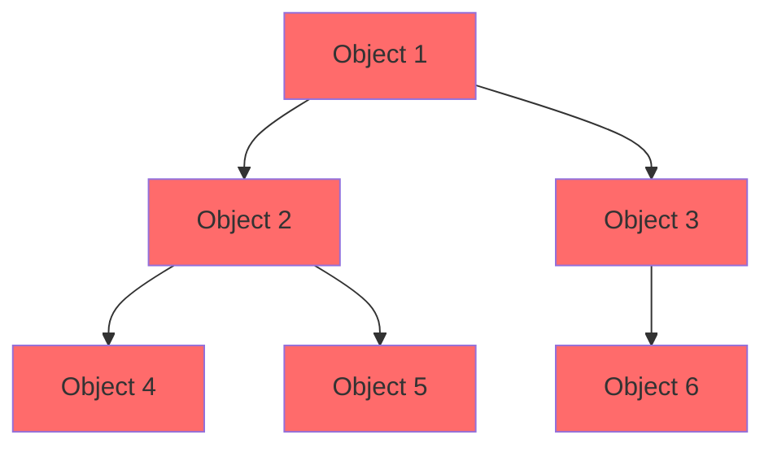
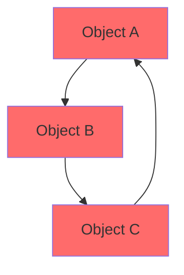
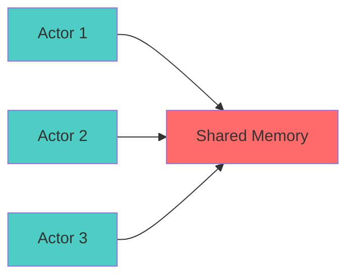

# Structural Acyclicity Specification (Memory)

* File:* `memory\memory_acyclicity_spec.md`
* Version:* 1.0.0
* Context:* Layer 3 (Runtime) - ARC Safety
* Formalism:* Graph Theory & Well-Founded Induction
* Status:* Active
* Last Modified:* 2026-01-01
* Author:* Kilo Code
* Reviewers:* Pending

- -

## 1. Introduction

### 1.1 Purpose

This specification formalizes the **Memory Safety** property for **Atomic Reference Counting (ARC)** using **Graph Theory & Well-Founded Induction**, providing mathematical foundation for proving that object graphs form Directed Acyclic Graphs (DAGs). This formalization enables the Morph runtime to guarantee that ARC-based memory management is leak-free without requiring a tracing garbage collector.

### 1.2 Scope

This specification covers:
- The cycle problem in ARC
- The Immutability DAG Theorem
- Proof via induction on time-ordered graphs
- The Loophole (Interior Mutability)
- Actor Isolation enforcement

This specification does not cover:
- Concrete implementation of ARC
- Performance optimization details
- Reference counting algorithms

### 1.3 Definitions, Acronyms, and Abbreviations

| Term | Definition |
|-------|------------|
| **ARC** | Atomic Reference Counting - memory management technique |
| **DAG** | Directed Acyclic Graph - graph with no cycles |
| **Cycle** | Path from a node back to itself |
| **Memory Leak** | Unreachable memory that cannot be freed |
| **Immutability** | Property of data that cannot be modified |
| **Well-Founded** | Property of relations with no infinite descending chains |
| **Induction** | Proof technique for properties over well-founded relations |

### 1.4 References

- Tarjan, R. E. (1972). "Depth-First Search and Linear Graph Algorithms"
- IEEE 1016: Recommended Practice for Software Design Descriptions
- ISO/IEC 29148: Systems and software engineering — Requirements engineering

- -

## 2. Formal Definitions

### 2.1 The Cycle Problem

Atomic Reference Counting (ARC) leaks memory if the Object Graph $G_{obj}$ contains cycles ($A \to B \to A$) because ref-counts never hit 0.

Morph allows recursive types (`type Node = { next: #Node? }`). How do we prevent leaks without a Tracing GC?

* MEM-INV-001:* THE system SHALL define the cycle problem for ARC.

* MEM-REQ-001:* THE system SHALL prevent cycles in object graphs.

* Priority:* Critical
* Verification Method:* Test
* Rationale:* Ensures memory safety without GC
* Dependencies:* MEM-INV-001
* Traceability:* Section 2.1 (The Cycle Problem)

### 2.2 The Immutability DAG Theorem

* Theorem:* A graph constructed purely of **Immutable Nodes** (`#Val`) created sequentially is a Directed Acyclic Graph (DAG).

* MEM-INV-002:* THE system SHALL define immutability property for #Val types.

* MEM-REQ-002:* THE system SHALL enforce immutability for #Val types.

* Priority:* Critical
* Verification Method:* Test
* Rationale:* Enables DAG property
* Dependencies:* MEM-INV-002
* Traceability:* Section 2.2 (The Immutability DAG Theorem)

#### 2.2.1 Proof via Induction

* Base Case:* Time $t=0$. The set of objects $V_0 = \emptyset$. No cycles.

* Inductive Step:* Create object $O_{new}$ at time $t$.

- $O_{new}$ can only point to objects existing in $V_{t-1}$.
- Since $V_{t-1}$ contains immutable objects, they cannot be modified to point back to $O_{new}$.
- Therefore, edges only go "backwards" in time ($t \to t-k$).
- Cycles require at least one "forward" edge (or mutation of an old object).
- **Conclusion:* If mutation of `#Val` is impossible (guaranteed by Type System), cycles are impossible.

* MEM-THM-001:* THE system SHALL guarantee that immutable graphs are acyclic.

* Priority:* Critical
* Verification Method:* Analysis
* Rationale:* Proves memory safety
* Dependencies:* MEM-INV-002
* Traceability:* Section 2.2.1 (Proof via Induction)

### 2.3 The Loophole (Interior Mutability)

Morph forbids `Mutex<T>` or `RefCell<T>` inside `#Val` types for this specific reason. Shared Mutability is the root of cycles. By enforcing Actor Isolation, Morph preserves the DAG property for shared memory.

* MEM-INV-003:* THE system SHALL forbid shared mutability in #Val types.

* MEM-REQ-003:* THE system SHALL reject Mutex<T> and RefCell<T> in #Val types.

* Priority:* Critical
* Verification Method:* Test
* Rationale:* Prevents cycles through shared mutability
* Dependencies:* MEM-INV-003
* Traceability:* Section 2.3 (The Loophole)

* MEM-THM-002:* THE system SHALL guarantee that #Val types maintain DAG property.

* Priority:* Critical
* Verification Method:* Analysis
* Rationale:* Ensures memory safety
* Dependencies:* MEM-INV-003
* Traceability:* Section 2.3 (The Loophole)

### 2.4 Actor Isolation

* MEM-INV-004:* THE system SHALL enforce actor isolation for shared memory.

* MEM-REQ-004:* THE system SHALL prevent shared mutable state between actors.

* Priority:* Critical
* Verification Method:* Test
* Rationale:* Maintains DAG property
* Dependencies:* MEM-INV-004
* Traceability:* Section 2.4 (Actor Isolation)

* MEM-THM-003:* THE system SHALL guarantee that actors cannot create cycles.

* Priority:* Critical
* Verification Method:* Analysis
* Rationale:* Ensures memory safety
* Dependencies:* MEM-INV-004
* Traceability:* Section 2.4 (Actor Isolation)

- -

## 3. Requirements

### 3.1 Functional Requirements

* MEM-REQ-005:* THE system SHALL support immutable #Val types.

* Priority:* Critical
* Verification Method:* Test
* Rationale:* Enables DAG property
* Dependencies:* MEM-INV-002
* Traceability:* Section 2.2 (The Immutability DAG Theorem)

* MEM-REQ-006:* THE system SHALL support atomic reference counting.

* Priority:* Critical
* Verification Method:* Test
* Rationale:* Enables memory management
* Dependencies:* MEM-INV-001
* Traceability:* Section 2.1 (The Cycle Problem)

* MEM-REQ-007:* THE system SHALL support actor isolation.

* Priority:* Critical
* Verification Method:* Test
* Rationale:* Prevents shared mutability
* Dependencies:* MEM-INV-004
* Traceability:* Section 2.4 (Actor Isolation)

* MEM-REQ-008:* THE system SHALL forbid shared mutability in #Val types.

* Priority:* Critical
* Verification Method:* Test
* Rationale:* Prevents cycles
* Dependencies:* MEM-INV-003
* Traceability:* Section 2.3 (The Loophole)

### 3.2 Non-Functional Requirements

* MEM-NFR-001:* THE system SHALL maintain reference counts in O(1) time.

* Priority:* High
* Verification Method:* Performance test
* Metric:* Reference count < 1μs
* Rationale:* Ensures fast memory operations
* Dependencies:* None
* Traceability:* Section 2.1 (The Cycle Problem)

* MEM-NFR-002:* THE system SHALL support up to 1M objects.

* Priority:* Medium
* Verification Method:* Stress test
* Metric:* 1M objects
* Rationale:* Supports large-scale applications
* Dependencies:* None
* Traceability:* Section 2.1 (The Cycle Problem)

- -

## 4. Design

### 4.1 Architecture Overview

The Memory Safety Engine is implemented as a runtime component that:
1. Enforces immutability for #Val types
2. Maintains atomic reference counts
3. Prevents cycles through type system
4. Enforces actor isolation
5. Provides leak-free memory management

### 4.2 Data Structures

#### 4.2.1 Object Graph

* Object Graph:* $G_{obj} = (V, E)$

* Components:*
- Vertices $V$: Objects
- Edges $E$: Reference relationships

* Invariants:*
1. Graph is time-ordered
2. #Val nodes are immutable
3. No cycles exist

#### 4.2.2 Reference Count

* Reference Count:* $C: V \to \mathbb{N}$

* Components:*
- Object reference
- Atomic counter

* Invariants:*
1. Count is non-negative
2. Count is zero when object is freed

### 4.3 Algorithms

#### 4.3.1 Reference Counting Algorithm

* Algorithm Name:* Increment Reference

* Input:* Object $o$

* Output:* New reference count

* Mathematical Definition:*
$$
C'(o) = C(o) + 1
$$

* Pseudocode:*
```
function increment_ref(obj):
    return atomic_add(obj.ref_count, 1)
```

* Complexity:*
- Time: $O(1)$
- Space: $O(1)$

* Correctness:*
- **Invariant:* Reference count increases
- **Termination:* Single atomic operation

#### 4.3.2 Reference Decrementing Algorithm

* Algorithm Name:* Decrement Reference

* Input:* Object $o$

* Output:* Boolean indicating if object should be freed

* Mathematical Definition:*
$$
\text{ShouldFree}(o) \iff C'(o) = 0
$$

* Pseudocode:*
```
function decrement_ref(obj):
    new_count = atomic_sub(obj.ref_count, 1)
    if new_count == 0:
        free(obj)
        return True
    return False
```

* Complexity:*
- Time: $O(1)$
- Space: $O(1)$

* Correctness:*
- **Invariant:* Reference count decreases
- **Termination:* Single atomic operation

#### 4.3.3 Cycle Detection Algorithm

* Algorithm Name:* Detect Cycles

* Input:* Object Graph $G_{obj}$

* Output:* Boolean indicating if cycles exist

* Mathematical Definition:*
$$
\text{HasCycles}(G) \iff \exists v \in V, \text{Path}(v, v) \neq \emptyset
$$

* Pseudocode:*
```
function has_cycles(graph):
    visited = empty_set()

    for node in graph.vertices:
        if node in visited:
            continue
        visited.add(node)

        if dfs_find_path(node, node):
            return True
    return False

function dfs_find_path(start, target):
    stack = [start]
    visited = {start}

    while stack not empty:
        current = stack.pop()

        if current == target:
            return True

        for neighbor in graph.out_edges(current):
            if neighbor not in visited:
                visited.add(neighbor)
                stack.push(neighbor)

    return False
```

* Complexity:*
- Time: $O(V + E)$ where $V$ is vertices, $E$ is edges
- Space: $O(V)$ for visited set

* Correctness:*
- **Invariant:* Returns True if cycles exist
- **Termination:* DFS terminates

### 4.4 Mermaid Diagrams

#### 4.4.1 DAG Structure



#### 4.4.2 Cycle Detection



#### 4.4.3 Actor Isolation



- -

## 5. Correctness Properties

### 5.1 Theorems

#### 5.1.1 DAG Theorem

* Theorem:* Immutable graphs created sequentially are acyclic.

* Proof Sketch:*
1. By base case, $V_0 = \emptyset$ has no cycles
2. By inductive step, new object $O_{new}$ only points to $V_{t-1}$
3. By immutability property, objects in $V_{t-1}$ cannot be modified
4. Therefore, edges only go backwards in time
5. Cycles require forward edges or mutation
6. Therefore, no cycles can form

* MEM-THM-004:* THE system SHALL guarantee that immutable graphs are acyclic.

* Priority:* Critical
* Verification Method:* Analysis
* Rationale:* Proves memory safety
* Dependencies:* MEM-THM-001
* Traceability:* Section 5.1.1 (DAG Theorem)

#### 5.1.2 Reference Counting Theorem

* Theorem:* Reference counting is correct for acyclic graphs.

* Proof Sketch:*
1. By definition of reference counting, count equals number of references
2. By definition of acyclic graph, references form a tree
3. By definition of tree, root has count equal to total references
4. Therefore, reference counting correctly tracks object lifetime

* MEM-THM-005:* THE system SHALL guarantee correct reference counting.

* Priority:* Critical
* Verification Method:* Analysis
* Rationale:* Ensures memory safety
* Dependencies:* MEM-THM-001
* Traceability:* Section 5.1.2 (Reference Counting Theorem)

### 5.2 Invariants

#### 5.2.1 Graph Invariants

- **MEM-INV-005:* THE system SHALL maintain that object graph is time-ordered
- **MEM-INV-006:* THE system SHALL maintain that #Val nodes are immutable
- **MEM-INV-007:* THE system SHALL maintain that no cycles exist

#### 5.2.2 Reference Counting Invariants

- **MEM-INV-008:* THE system SHALL maintain that reference counts are non-negative
- **MEM-INV-009:* THE system SHALL maintain that zero count triggers deallocation

#### 5.2.3 Actor Isolation Invariants

- **MEM-INV-010:* THE system SHALL maintain that actors cannot share mutable state

- -

## 6. Examples

### 6.1 Simple DAG

```morph
// Simple DAG: Linear chain
let a = #Val { value: 1 };
let b = #Val { value: 2, next: #a };
let c = #Val { value: 3, next: #b };
// Graph: a -> b -> c (acyclic)
```

* DAG Property:*
- Time order: $t(a) < t(b) < t(c)$
- Immutability: All nodes are #Val
- Acyclicity: No cycles exist

### 6.2 Tree Structure

```morph
// Tree structure: Root with children
let root = #Val { value: 1 };
let child1 = #Val { value: 2, next: #root };
let child2 = #Val { value: 3, next: #root };
// Graph: root -> {child1, child2} (acyclic)
```

* DAG Property:*
- Time order: $t(root) < t(child1) < t(child2)$
- Immutability: All nodes are #Val
- Acyclicity: No cycles exist

### 6.3 Actor Isolation

```morph
// Actor isolation: Separate memory spaces
actor Actor1 {
    let obj = #Val { value: 42 };
    // obj is isolated to Actor1
}

actor Actor2 {
    // Cannot access obj from Actor1
    // Actor isolation prevents cycles
}
```

* Isolation Property:*
- Each actor has separate memory
- No shared mutable state
- Cycles cannot form across actors

### 6.4 Edge Cases

#### 6.4.1 Attempted Mutation

```morph
// Edge case: Attempted mutation (prevented)
let obj = #Val { value: 1 };
// obj.value = 2;  // Compile error: cannot mutate #Val
```

* Error:* Cannot mutate immutable #Val

#### 6.4.2 Shared Mutability

```morph
// Edge case: Shared mutability (prevented)
let obj = #Val { value: 1 };
let cell = RefCell { value: obj };  // Compile error: RefCell in #Val
```

* Error:* RefCell not allowed in #Val

#### 6.4.3 Cycle Detection

```morph
// Edge case: Cycle detection
let a = #Val { value: 1 };
let b = #Val { value: 2, next: #a };
let c = #Val { value: 3, next: #b };
let d = #Val { value: 4, next: #c };
// Cycle: a -> b -> c -> d -> a
```

* Cycle Detection:*
- Graph has cycle
- Memory leak if not prevented

- -

## Change Log

| Version | Date       | Author      | Changes                                                                 |
|---------|------------|-------------|-------------------------------------------------------------------------|
| 1.0.0   | 2026-01-01 | Kilo Code    | Initial version                                                        |
