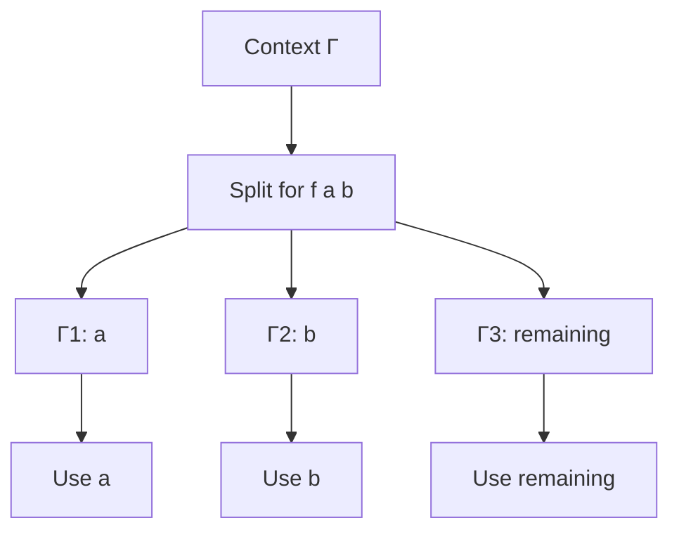
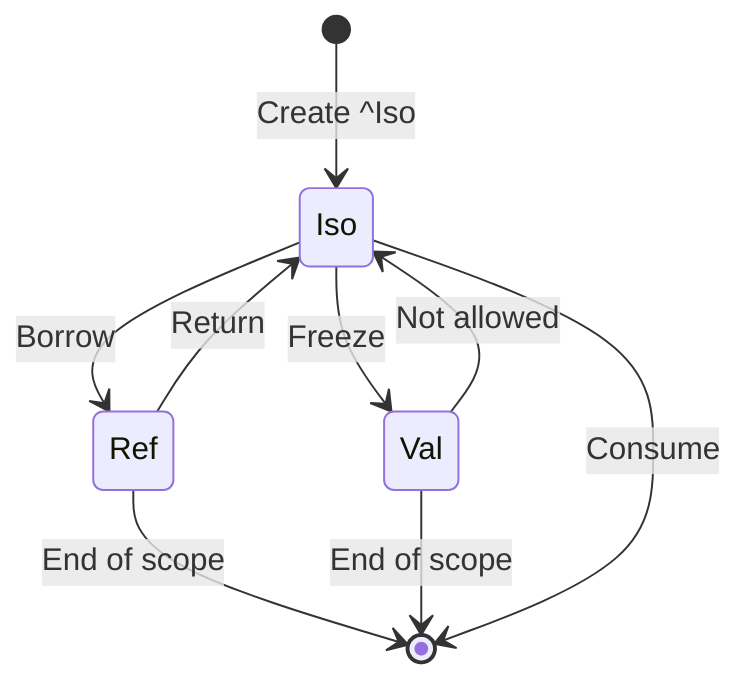
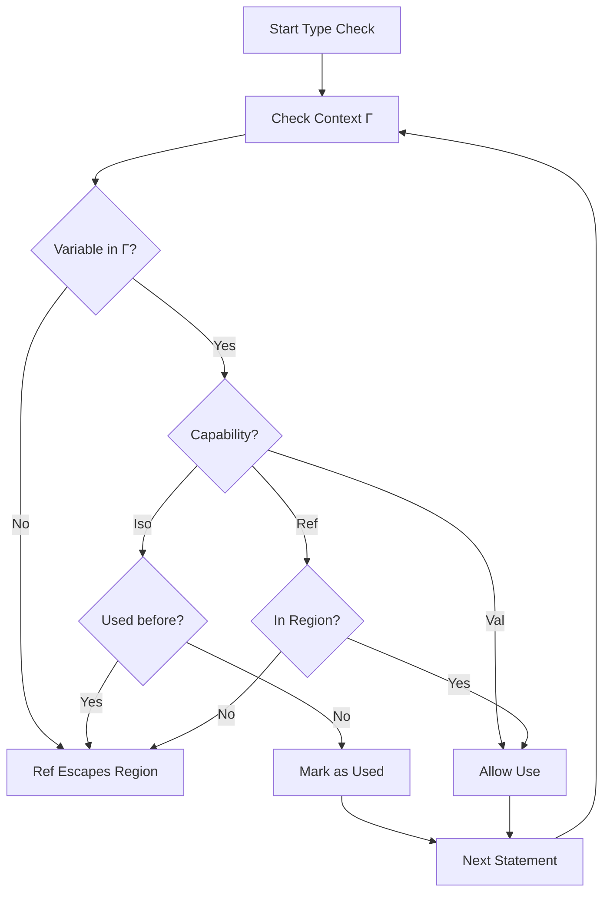

# Linear & Affine Logic Specification (Memory Safety)

- `File:* `memory\memory_affine_logic_spec.md`
- `Version:* 2.0.0
- `Context:* Layer 2 (Semantic Analysis) & Layer 3 (Memory)
- `Formalism:* Substructural Type Systems (Affine Logic)
- `Status:* Active
- Last Modified:* 2026-01-01
- `Author:* Kilo Code
- `Reviewers:* Pending

- -

## 1. Introduction

### 1.1 Purpose

This specification formalizes the memory safety model of Morph using **Affine Logic**, a substructural type system that treats variables as finite resources. This formalization provides mathematical foundation for move semantics, ownership, and zero-copy concurrency without garbage collection.

### 1.2 Scope

This specification covers:
- The Context Splitting Theorem for resource management
- Capability modalities for different ownership types
- Type system rules for affine types
- Integration with Morph's capability system (`^Iso`, `#Val`, `&Ref`)

This specification does not cover:
- Concrete implementation of memory allocation
- Runtime memory management algorithms
- Garbage collection (not used in Morph)

### 1.3 Definitions, Acronyms, and Abbreviations

| Term | Definition |
|-------|------------|
| **Affine Logic** | A substructural logic where each assumption must be used exactly once |
| **Linear Logic** | A substructural logic where each assumption must be used exactly once and cannot be discarded |
| **Context Splitting** | Dividing available variables into disjoint sets for parallel operations |
| **Capability** | A type modifier that specifies how a value can be used (Iso, Val, Ref) |
| **Move Semantics** | Transferring ownership of a value rather than copying it |
| **Zero-Copy** | Passing data by reference without duplicating memory |

### 1.4 References

- Girard, J.-Y. (1987). "Linear Logic"
- Wadler, P. (1990). "Linear types can change the world!"
- Pony language documentation on Reference Capabilities
- ISO/IEC 29148: Systems and software engineering — Requirements engineering

- -

## 2. Formal Definitions

### 2.1 The Context Splitting Theorem

Standard Type Systems (Intuitionistic Logic) allow the context $\Gamma$ (available variables) to be reused: $\Gamma \vdash x: A, \Gamma \vdash y: B$.

Morph, using **Affine Logic**, treats context as a finite resource.

#### 2.1.1 The Splitting Rule

For an operation consuming two resources (e.g., a function call $f(a, b)$), the context $\Gamma$ must be split into disjoint sets $\Gamma_1$ and $\Gamma_2$:

$$ \frac{\Gamma_1 \vdash e_1 : A \quad \Gamma_2 \vdash e_2 : B}{\Gamma_1, \Gamma_2 \vdash (e_1, e_2) : A \otimes B} $$

- `Implication:* If variable $x \in \Gamma_1$, it **cannot** be in $\Gamma_2$.

- Morph Implementation:* This is the mathematical basis for the "Move Semantics" of `^Iso` types. If `let b = a` happens, $a$ is removed from the context available to subsequent statements.

- MEM-INV-001:* THE system SHALL ensure that variables are not used after being moved.

### 2.2 Capability Modalities

We formalize Capabilities as **Modal Operators** on types.

#### 2.2.1 Unrestricted Modality ($!T$)

Corresponds to `#Val` (Shared).

- **Contraction Rule (Copying) is allowed:* $!A \multimap !A \otimes !A$
- **Weakening Rule (Dropping) is allowed:* $!A \multimap 1$

- MEM-INV-002:* THE system SHALL allow copying of `#Val` types.

#### 2.2.2 Affine Modality ($A$)

Corresponds to `^Iso` (Unique).

- **Contraction is Banned:* $A \nrightarrow A \otimes A$ (Cannot copy)
- **Weakening is Allowed:* $A \multimap 1$ (Can drop/free)

- MEM-INV-003:* THE system SHALL prevent copying of `^Iso` types.

#### 2.2.3 Linear Reference Modality ($\&T$)

Corresponds to `&Ref` (Borrowed).

- **Valid only within a region $\rho$**
- **Typing judgment:* $\Gamma \vdash_\rho e : T$

- MEM-INV-004:* THE system SHALL ensure that `&Ref` types are only valid within their borrowing region.

### 2.3 Type System Rules

#### 2.3.1 Variable Declaration Rule

$$ \frac{\Gamma, x: T \vdash e: T'}{\Gamma \vdash \text{let } x = e: T} $$

- MEM-REQ-001:* THE system SHALL enforce that variable declarations consume the expression's resources.

- `Priority:* Critical
- Verification Method:* Test
- `Rationale:* Ensures proper resource management
- `Dependencies:* MEM-INV-001
- `Traceability:* Section 2.1.1 (Splitting Rule)

#### 2.3.2 Variable Use Rule

$$ \frac{\Gamma, x: T \vdash e: T'}{\Gamma \vdash e[x]: T'} $$

- MEM-REQ-002:* THE system SHALL ensure that variables are used according to their capability.

- `Priority:* Critical
- Verification Method:* Test
- `Rationale:* Prevents memory safety violations
- `Dependencies:* MEM-INV-002, MEM-INV-003, MEM-INV-004
- `Traceability:* Section 2.2 (Capability Modalities)

#### 2.3.3 Move Rule

$$ \frac{\Gamma, x: ^Iso(T) \vdash e: T'}{\Gamma \vdash \text{consume } x: T'} $$

- MEM-REQ-003:* WHEN a variable is consumed, THE system SHALL remove it from the context.

- `Priority:* Critical
- Verification Method:* Test
- `Rationale:* Enforces move semantics
- `Dependencies:* MEM-INV-003
- `Traceability:* Section 2.2.2 (Affine Modality)

- -

## 3. Requirements

### 3.1 Functional Requirements

- MEM-REQ-004:* THE system SHALL enforce that `^Iso` types cannot be copied.

- `Priority:* Critical
- Verification Method:* Test
- `Rationale:* Prevents data races and ensures unique ownership
- `Dependencies:* MEM-INV-003
- `Traceability:* Section 2.2.2 (Affine Modality)

- MEM-REQ-005:* THE system SHALL allow copying of `#Val` types.

- `Priority:* High
- Verification Method:* Test
- `Rationale:* Enables shared immutable data
- `Dependencies:* MEM-INV-002
- `Traceability:* Section 2.2.1 (Unrestricted Modality)

- MEM-REQ-006:* THE system SHALL enforce that `&Ref` types cannot escape their borrowing region.

- `Priority:* Critical
- Verification Method:* Test
- `Rationale:* Prevents use-after-free errors
- `Dependencies:* MEM-INV-004
- `Traceability:* Section 2.2.3 (Linear Reference Modality)

- MEM-REQ-007:* WHEN a function is called with `^Iso` parameters, THE system SHALL consume those parameters.

- `Priority:* Critical
- Verification Method:* Test
- `Rationale:* Ensures proper resource transfer
- `Dependencies:* MEM-REQ-003
- `Traceability:* Section 2.3.3 (Move Rule)

- MEM-REQ-008:* THE system SHALL detect attempts to use moved variables.

- `Priority:* Critical
- Verification Method:* Test
- `Rationale:* Prevents use-after-move errors
- `Dependencies:* MEM-INV-001
- `Traceability:* Section 2.1.1 (Splitting Rule)

### 3.2 Non-Functional Requirements

- MEM-NFR-001:* THE system SHALL perform type checking in O(n) time complexity where n is AST size.

- `Priority:* High
- Verification Method:* Analysis
- `Metric:* Type checking < 100ms for 10K nodes
- `Rationale:* Ensures fast compilation

- MEM-NFR-002:* THE system SHALL provide clear error messages for resource violations.

- `Priority:* High
- Verification Method:* Demonstration
- `Metric:* Error message includes variable name and location
- `Rationale:* Improves developer experience

- MEM-NFR-003:* THE system SHALL support zero-copy message passing between actors.

- `Priority:* High
- Verification Method:* Test
- `Metric:* No memory allocation for message passing
- `Rationale:* Enables high-performance concurrency

- -

## 4. Design

### 4.1 Architecture Overview

The memory safety system is implemented as a type checker that tracks resource usage through a typing context. The checker enforces affine logic rules at compile time, eliminating the need for runtime garbage collection.

### 4.2 Data Structures

#### 4.2.1 Typing Context

- Typing Context:* $\Gamma = \{x_1: T_1, x_2: T_2, \dots, x_n: T_n\}$

- `Components:*
- $x_i$: Variable name
- $T_i$: Type with capability ($^Iso(T)$, `#Val(T)$, `&Ref(T)$)

- `Invariants:*
1. $\forall i \neq j, x_i \neq x_j$ (No duplicate variables)
2. $\forall x: ^Iso(T) \in \Gamma, x$ can be used at most once

### 4.3 Algorithms

#### 4.3.1 Context Splitting Algorithm

- Algorithm Name:* Split Context for Function Call

- `Input:* Context $\Gamma$, Function parameters $p_1: T_1, \dots, p_k: T_k$

- `Output:* Split contexts $\Gamma_1, \dots, \Gamma_k$

- Mathematical Definition:*
$$
\text{Split}(\Gamma, p_1:T_1, \dots, p_k:T_k) = \begin{cases}
(\Gamma \setminus \{p_1\}, \{p_1\}) & \text{if } k=1 \\
(\text{Split}(\Gamma \setminus \{p_1\}, p_2:T_2, \dots, p_k:T_k).1, \{p_1\}) & \text{if } k>1
\end{cases}
$$

- `Pseudocode:*
```
function split_context(context, parameters):
    remaining_context = context
    split_contexts = []
    for param in parameters:
        if param not in remaining_context:
            error("Parameter not available in context")
        split_contexts.append({param})
        remaining_context.remove(param)
    return (remaining_context, split_contexts)
```

- `Complexity:*
- Time: $O(k)$ where $k$ is number of parameters
- Space: $O(k)$

- `Correctness:*
- **Invariant:* All split contexts are disjoint
- **Termination:* Loop terminates after processing all parameters

### 4.4 Mermaid Diagrams

#### 4.4.1 Context Splitting Visualization



#### 4.4.2 Capability Transition Diagram



#### 4.4.3 Type Checking Flow



- -

## 5. Correctness Properties

### 5.1 Theorems

#### 5.1.1 Resource Safety Theorem

- `Theorem:* If a program type-checks under affine logic, then it is memory-safe (no use-after-free, no double-free, no data races).

- Proof Sketch:*
1. By definition of affine logic, each resource is used exactly once
2. Use-after-free would require using a resource after it's consumed (violates affine rule)
3. Double-free would require consuming a resource twice (violates affine rule)
4. Data races require concurrent access to same resource (violates uniqueness of `^Iso`)
5. Therefore, type-checked programs are memory-safe

- MEM-THM-001:* THE system SHALL guarantee that type-checked programs are memory-safe.

- `Priority:* Critical
- Verification Method:* Analysis
- `Rationale:* Provides formal guarantee of memory safety
- `Dependencies:* MEM-INV-001, MEM-INV-003, MEM-INV-004
- `Traceability:* Section 2 (Formal Definitions)

#### 5.1.2 Zero-Copy Theorem

- `Theorem:* Sending a `^Iso` value between actors does not require memory allocation.

- Proof Sketch:*
1. `^Iso` values have unique ownership
2. Transfer of ownership changes the owner but not the memory location
3. No copy is needed because the value is moved, not copied
4. Therefore, message passing is zero-copy

- MEM-THM-002:* THE system SHALL enable zero-copy message passing for `^Iso` types.

- `Priority:* High
- Verification Method:* Analysis
- `Rationale:* Enables high-performance concurrency
- `Dependencies:* MEM-INV-003
- `Traceability:* Section 2.2.2 (Affine Modality)

### 5.2 Invariants

#### 5.2.1 Context Invariants

- **MEM-INV-005:* THE system SHALL maintain that each variable appears at most once in the context
- **MEM-INV-006:* THE system SHALL maintain that `^Iso` variables are marked as used after consumption
- **MEM-INV-007:* THE system SHALL maintain that `&Ref` variables are tracked by region

#### 5.2.2 Capability Invariants

- **MEM-INV-008:* THE system SHALL maintain that `#Val` types can be copied arbitrarily
- **MEM-INV-009:* THE system SHALL maintain that `^Iso` types cannot be copied
- **MEM-INV-010:* THE system SHALL maintain that `&Ref` types cannot escape their region

- -

## 6. Examples

### 6.1 Move Semantics Example

```morph
fn process(^Iso data: Data) {
    let processed = transform(data);  // data is moved here
    // data is no longer available
    ret processed;
}
```

- Context Evolution:*
1. Initial: $\Gamma = \{data: ^Iso(Data)\}$
2. After `let processed = transform(data)`: $\Gamma = \{processed: ^Iso(Data')\}$
3. Attempting to use `data` here would be a compile error

### 6.2 Shared Immutable Example

```morph
fn share(#Val data: Data) {
    let copy1 = data;  // Allowed: #Val can be copied
    let copy2 = data;  // Allowed: #Val can be copied
    ret (copy1, copy2);
}
```

- Context Evolution:*
1. Initial: $\Gamma = \{data: #Val(Data)\}$
2. After `let copy1 = data`: $\Gamma = \{data: #Val(Data), copy1: #Val(Data)\}$
3. After `let copy2 = data`: $\Gamma = \{data: #Val(Data), copy1: #Val(Data), copy2: #Val(Data)\}$

### 6.3 Borrowing Example

```morph
fn modify(&Ref mut data: Data) {
    data.value = 42;  // Allowed: &Ref can be mutated
    // data is automatically returned at end of function
}
```

- Region Tracking:*
1. Function enters region $\rho$
2. `&Ref` is valid within $\rho$
3. At function exit, $\rho$ ends and `&Ref` is invalidated

### 6.4 Error Cases

#### 6.4.1 Use After Move

```morph
fn example(^Iso x: i32) {
    let y = x;  // x is moved
    ret x;  // ERROR: use after move
}
```

- Error Message:* "Variable 'x' was moved and cannot be used"

#### 6.4.2 Copying Iso

```morph
fn example(^Iso x: i32) {
    let y = x;  // x is moved
    let z = x;  // ERROR: x is not available
    ret z;
}
```

- Error Message:* "Cannot use moved value 'x'"

#### 6.4.3 Ref Escaping Region

```morph
fn example() -> &Ref i32 {
    let x = 42;
    ret &x;  // ERROR: ref escapes function
}
```

- Error Message:* "Cannot return reference to local variable"

### 6.5 Zero-Copy Message Passing

```morph
actor Producer {
    fn produce() -> ^Iso Data {
        ret create_data();  // Returns ^Iso
    }
}

actor Consumer {
    fn consume(^Iso data: Data) {
        process(data);  // Receives ^Iso, zero-copy
    }
}

// Main
let producer = spawn Producer();
let consumer = spawn Consumer();
consumer.consume(producer.produce());  // Zero-copy transfer
```

- Memory Flow:*
1. `producer.produce()` creates `^Iso Data`
2. Ownership is transferred to `consumer.consume()`
3. No memory allocation occurs during transfer
4. `producer` no longer has access to the data

- -

## Change Log

| Version | Date       | Author      | Changes                                                                 |
|---------|------------|-------------|-------------------------------------------------------------------------|
| 2.0.0   | 2026-01-01 | Kilo Code    | Refactored to match specification convention v2.0.0, added EARS requirements, Mermaid diagrams, and examples |
| 1.0.0   | 2025-12-01 | Kilo Code    | Initial version                                                        |
