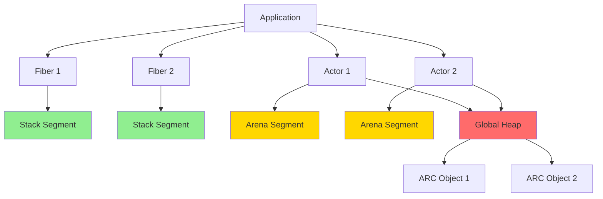
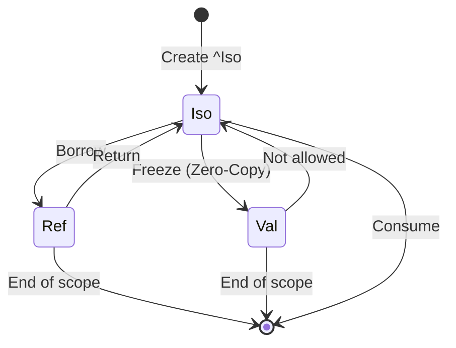
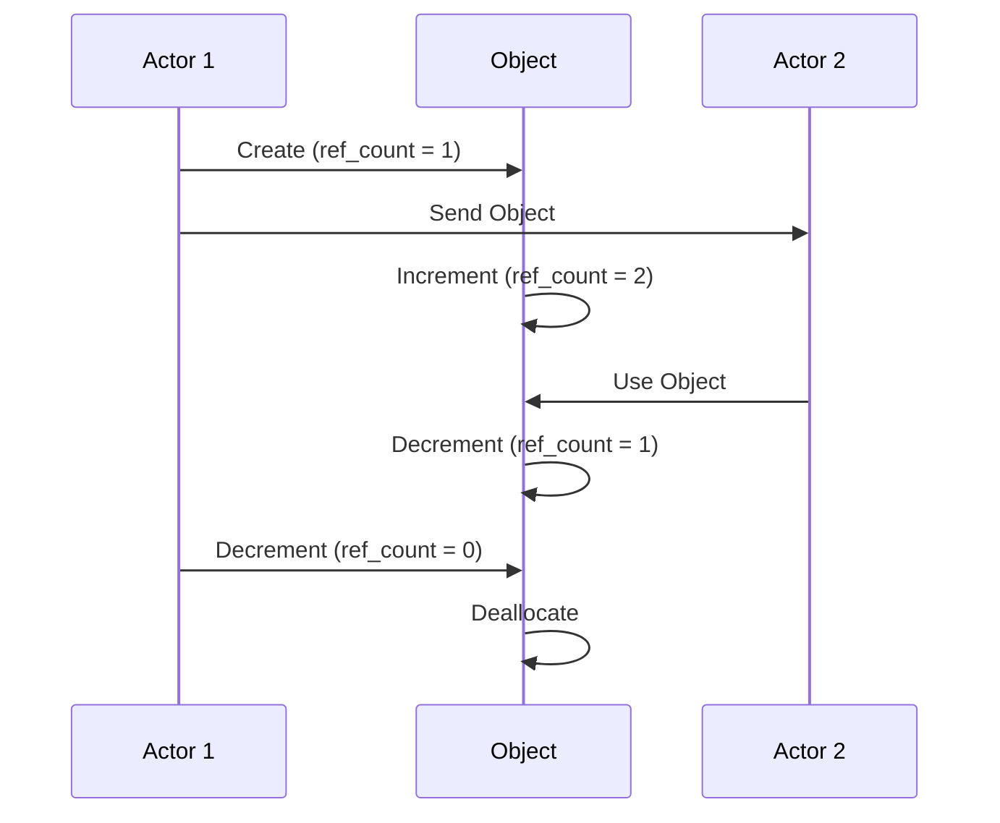

# Morph Memory Model Specification (MMS)

- File: `spec/memory/memory_model_spec.md`
- Version: 3.3.0
- Context: Layer 3 (Runtime) & Layer 2 (Semantic Analysis) - Formalism
- Status: Active
- Last Modified: 2026-01-04
- Author: Kilo Code
- Reviewers: [Pending Review]

---

## 1. Introduction

### 1.1 Purpose

This specification defines Memory Model of Morph, providing formal foundation for memory management, allocation strategies, and safety guarantees. The memory model combines a **Unified Global Allocator** with type-level rules, affine logic, and capability-based ownership to ensure memory safety without tracing garbage collection while enabling high-performance concurrency. Morph uses Atomic Reference Counting (ARC) instead of Tracing Garbage Collection. ARC provides deterministic deallocation for strong references, but weak references can create cycles that prevent immediate deallocation.

### 1.2 Scope

This specification covers:
- The **Unified Memory Architecture** (Stack, Arena, Heap with single global allocator)
- Capability-Based Access Control for memory safety
- Allocation strategies (Arena, ARC)
- Affine types and move semantics
- Memory consistency model
- Garbage collection strategy (No Tracing GC)
- Weak references for cycle-breaking
- Zero-copy transitions between capability types
- Low-level data layout and ABI

This specification does not cover:
- Concrete implementation of allocators
- Hardware-specific memory management
- Runtime memory profiling

### 1.3 Definitions, Acronyms, and Abbreviations

| Term | Definition |
|-------|------------|
| **Arena** | A linear memory region that can be bulk deallocated by resetting a pointer |
| **ARC** | Atomic Reference Counting - thread-safe reference counting for shared objects |
| **Fiber** | A lightweight user-space thread (green thread) with its own stack |
| **Actor** | A concurrent entity that processes messages sequentially |
| **Affine Type** | A type that can be used at most once (move semantics) |
| **Capability** | A type modifier specifying how a value can be used (Iso, Val, Ref, Weak) |
| **Weak Reference** | A non-owning reference that does not prevent deallocation |
| **POD** | Plain Old Data - simple data types without custom destructors |
| **RAII** | Resource Acquisition Is Initialization - automatic resource management |
| **Sequential Consistency** | A memory model where operations appear to execute in program order |

### 1.4 References

- Pierce, B. C. (2002). "Types and Programming Languages"
- Tarditi, D. (2012). "The Pony Language"
- ISO/IEC 29148: Systems and software engineering — Requirements engineering
- IEEE 754: Floating-point arithmetic

### 1.5 Cross-References

The Memory Model Specification is closely related to several other Morph specifications. The following cross-references provide additional context and detailed specifications for related concepts:

* Type System Specifications:*
- [`spec/type/type_system_spec.md`](../type/type_system_spec.md) - Type system, capability sigils, and affine logic formalization
- [`spec/type/type_category_spec.md`](../type/type_category_spec.md) - Type category theory and algebraic type foundations

* Memory Specifications:*
- [`spec/memory/memory_acyclicity_spec.md`](./memory_acyclicity_spec.md) - Memory acyclicity enforcement using affine logic and graph theory
- [`spec/memory/memory_affine_logic_spec.md`](./memory_affine_logic_spec.md) - Affine logic formalization for memory safety
- [`spec/memory/memory_petri_net_spec.md`](./memory_petri_net_spec.md) - Petri net formalization of memory operations

* Concurrency Specifications:*
- [`spec/concurrency/execution_model_spec.md`](../concurrency/execution_model_spec.md) - Execution model, actor model, and scheduler implementation
- [`spec/concurrency/concurrency_process_algebra_spec.md`](../concurrency/concurrency_process_algebra_spec.md) - Process algebra formalization of concurrent communication

* Distributed Systems Specifications:*
- [`spec/distributed_vector_clock_spec.md`](../distributed_vector_clock_spec.md) - Vector clocks for distributed causality and sequential consistency
- [`spec/tooling/deterministic_time_spec.md`](../tooling/deterministic_time_spec.md) - Deterministic time simulation for debugging

* Note:* These cross-references help readers navigate to Morph specification ecosystem by providing links to related specifications that provide complementary or detailed information about concepts referenced in this document.

- Lamport, L. (1979). "How to Make a Multiprocessor Computer That Correctly Executes Multiprocess Programs"

---

## 2. Formal Definitions

### 2.1 Unified Memory Architecture

Morph presents a **Unified Memory Architecture** with a single global allocator. Unlike C++ (flat heap) or Java (managed heap), Morph uses type-level rules to enforce memory safety while maintaining zero-copy semantics.

* Strategic Refinement:* This unified architecture eliminates the need for physically distinct memory regions. Instead, memory regions are enforced at the **type level** through metadata, enabling zero-copy transitions between capability types.

#### 2.1.1 Single Global Allocator

Let $\mathcal{M}$ be a memory space with a single global allocator:

$$ \mathcal{M} = \mathcal{M}_{global} $$

where:
- $\mathcal{M}_{global}$: Global Heap (Unified Allocator)

* MMS-INV-001:* THE system SHALL maintain a single global allocator for all memory segments.

#### 2.1.2 Type-Level Memory Segments

While all memory is allocated from the same global heap, the type system enforces different memory behaviors through type-level rules:

$$ \mathcal{M}_{types} = \{\text{Iso}, \text{Val}, \text{Ref}, \text{Weak}\} $$

where:
- **Iso<T>:** Unique ownership, move semantics, count = 1
- **Val<T>:** Shared immutable ownership, count >= 1
- **Ref<T>:** Borrowed reference with lifetime
- **Weak<T>:** Weak reference for cycle-breaking

* MMS-INV-002:* THE system SHALL enforce type-level memory rules for all types.

#### 2.1.3 Zero-Copy Transitions

Transitions between capability types are zero-copy metadata operations:

$$ \text{Transition}(T_1, T_2) = \text{metadata\_flip} $$

where:
- **Freeze:** Iso<T> -> Val<T> (metadata bit-flip, no memory copy)
- **Borrow:** Iso<T> or Val<T> -> Ref<T> (lifetime tracking, no copy)
- **Weak:** Val<T> -> Weak<T> (weak reference creation, no copy)

* MMS-INV-003:* THE system SHALL perform zero-copy transitions between capability types.

### 2.2 Capability-Based Access Control

The Memory Model relies on the Type System to enforce access rights at compile-time.

#### 2.2.1 Capability Matrix

Let $\mathcal{C} = \{\text{Iso}, \text{Val}, \text{Ref}, \text{Weak}\}$ be the set of capabilities.

For each capability $c \in \mathcal{C}$, define properties:

$$ \text{Properties}(c) = (\text{Aliasable}, \text{Mutable}, \text{Sendable}, \text{Location}) $$

| Capability | Aliasable? | Mutable? | Sendable? | Memory Location |
|------------|-------------|-----------|-------------|
| **Iso** | No | Yes | Yes (Move) | Global Heap |
| **Val** | Yes | No | Yes (Copy Ref) | Global Heap |
| **Ref** | Yes | Yes | No | Actor Arena / Stack |
| **Weak** | Yes | No | No | Global Heap |

* MMS-INV-004:* THE system SHALL enforce capability properties for all reference types.

#### 2.2.2 Deny Properties

The Memory Model enforces three deny properties:

1. **Deny Global Mutation:** $\forall r \in \text{Ref}, \neg \exists a \in \text{Actor} \text{ such that } a \text{ holds } r \text{ and } a' \neq a$

2. **Deny Write-After-Share:** $\forall v \in \text{Iso}, \text{Freeze}(v) \implies \neg \text{Mutable}(v')$

3. **Deny Read-After-Move:** $\forall v \in \text{Iso}, \text{Send}(v, a) \implies \neg \text{Valid}(v, a')$

* MMS-INV-005:* THE system SHALL enforce deny properties for all capabilities.

### 2.3 Allocation Strategies

#### 2.3.1 Unified Global Allocator

The Unified Global Allocator manages all memory:

$$ \text{alloc}_{global}(size) = (\text{ControlBlock}, \text{Data}) $$

where $\text{ControlBlock} = (\text{ref\_count}, \text{weak\_count})$.

* MMS-INV-006:* THE system SHALL use a unified global allocator for all memory.

#### 2.3.2 ARC Allocator

The ARC Allocator manages reference counts:

$$ \text{alloc}_{arc}(data) = (\text{ControlBlock}, \text{Data}) $$

where $\text{ControlBlock} = (\text{Atomic<usize>}, \text{WeakCount})$.

* MMS-INV-007:* THE system SHALL use atomic reference counting for heap objects.

### 2.4 Affine Types & Move Semantics

#### 2.4.1 Affine Type Definition

A type $T$ is **Affine** if:

$$ \forall x: T, \text{uses}(x) \leq 1 $$

* MMS-INV-008:* THE system SHALL enforce affine type usage constraints.

#### 2.4.2 Zero-Copy Move Semantics

The compiler optimizes move semantics to zero-copy pointer transfers:

$$ \text{Move}(v) = \text{pointer\_transfer}(v) $$

* MMS-INV-009:* THE system SHALL perform zero-copy moves for affine types.

### 2.5 Weak References for Cycle-Breaking

#### 2.5.1 Weak Reference Type

A **Weak<T>** is a non-owning reference to a Val<T>:

$$ \text{Weak}(T) = \text{non\_owning\_ref}(\text{Val}<T>) $$

* MMS-INV-010:* THE system SHALL support weak references for cycle-breaking.

#### 2.5.2 Upgrade Operation

Weak references can be upgraded to strong references:

$$ \text{upgrade}(w: \text{Weak}<T>) = \text{Option}<\text{Val}<T>> $$

* MMS-INV-011:* THE system SHALL provide upgrade operation for weak references.

#### 2.5.3 Acyclicity Theorem

Strong references (Iso, Val, Ref) form a Directed Acyclic Graph (DAG) at the **type level**:

$$ \forall v \in \text{Val}, \neg \exists \text{type\_level\_cycle}(v) \text{ after construction} $$

* MMS-THM-001:* THE system SHALL guarantee that strong references form a type-level DAG.

* Proof Sketch:*
1. By definition of affine logic, Iso types are used exactly once
2. By definition of Val types, they are immutable
3. By definition of Ref types, they are borrowed with bounded lifetimes
4. Therefore, no type-level cycles can form through strong references alone
5. Weak references can create runtime cycles but do not prevent deallocation of objects that have no strong references.

**Critical Limitation:** This theorem guarantees **type-level acyclicity** only. It does NOT guarantee that runtime object graphs are acyclic. Runtime cycles can form through dynamic pointer assignment and are the programmer's responsibility to manage using `Weak<T>`.

**Note:** This theorem applies to strong references (Iso, Val, Ref) only. Weak references can form runtime cycles, but these cycles do not prevent deallocation of objects that have no strong references. See Section 2.6 for detailed discussion of type-level vs runtime cycle handling.

### 2.6 Type-Level Acyclicity vs Runtime Cycle Breaking

This section clarifies the critical distinction between **type-level acyclicity** (detectable at compile time) and **runtime cycle breaking** (undecidable at compile time for dynamic graphs).

#### 2.6.1 Fundamental Distinction

Morph provides two complementary mechanisms for handling reference cycles:

1. **Type-Level Acyclicity (Compile-Time):** Detects cycles in recursive struct definitions and self-referential types that would create guaranteed cycles. This is decidable and enforced by the compiler.

2. **Runtime Cycle Breaking (Dynamic):** Uses `Weak<T>` to break cycles in dynamic graphs. Runtime cycles are the programmer's responsibility. The compiler cannot detect all dynamic cycles at compile time.

**Critical Limitation:** General graph cycle detection is undecidable at compile time if pointers are dynamic. The compiler can only detect type-level cycles, not all runtime cycles.

* MMS-INV-026:* THE system SHALL distinguish between type-level acyclicity (compile-time) and runtime cycle breaking (dynamic).

#### 2.6.2 Type-Level Acyclicity (Compile-Time)

Type-level acyclicity refers to detecting cycles in the **type system itself**, not in runtime object graphs.

##### 2.6.2.1 What Type-Level Acyclicity Detects

The compiler can detect cycles in:

1. **Recursive Struct Definitions:** Direct or indirect self-referential types
2. **Self-Referential Types:** Types that reference themselves in a way that guarantees cycles
3. **Mutually Recursive Types:** Types that reference each other in a cycle

##### 2.6.2.2 Type-Level Cycle Detection Algorithm

- **Algorithm Name:** Detect Type-Level Cycles

- **Input:** Type definition graph $G = (V, E)$ where $V$ is the set of types and $E$ is the set of type references

- **Output:** Set of type-level cycles

- **Mathematical Definition:**
$$
\text{detect\_type\_cycles}(G) = \{C \subseteq V \mid \exists \text{path}(v_1, v_2, \ldots, v_n, v_1) \text{ in } G\}
$$

- **Pseudocode:**
```
function detect_type_cycles(type_graph):
    visited = empty_set()
    recursion_stack = empty_set()
    cycles = []
    
    for type in type_graph.nodes:
        if type not in visited:
            if dfs_type_cycle(type, visited, recursion_stack, cycles):
                continue
    
    return cycles

function dfs_type_cycle(type, visited, recursion_stack, cycles):
    visited.add(type)
    recursion_stack.add(type)
    
    for ref_type in type.references:
        if ref_type not in visited:
            if dfs_type_cycle(ref_type, visited, recursion_stack, cycles):
                return true
        elif ref_type in recursion_stack:
            // Found a type-level cycle
            cycles.append(extract_cycle(recursion_stack, ref_type))
            return true
    
    recursion_stack.remove(type)
    return false
```

- **Complexity:**
- Time: $O(V + E)$ where $V$ is number of types and $E$ is number of type references
- Space: $O(V)$ for visited set and recursion stack

- **Correctness:**
- **Invariant:** All type-level cycles are detected
- **Termination:** DFS terminates when all types are visited

##### 2.6.2.3 Type-Level Cycle Examples

**Example 1: Direct Self-Reference (Compile Error)**
```morph
// This creates a guaranteed type-level cycle
type Node = {
    value: i32,
    next: ^Node,  // Compile error: Type-level cycle detected
};
```

**Example 2: Indirect Self-Reference (Compile Error)**
```morph
type A = {
    value: i32,
    b: ^B,
};

type B = {
    value: i32,
    a: ^A,  // Compile error: Type-level cycle detected
};
```

**Example 3: Valid Type-Level Acyclicity (Allowed)**
```morph
// This is allowed because the cycle is broken by Weak<T>
type Node = {
    value: i32,
    next: Weak<^Node>,  // Allowed: Weak reference breaks type-level cycle
};
```

* MMS-INV-027:* THE system SHALL detect type-level cycles at compile time and report them as errors.

#### 2.6.3 Runtime Cycle Breaking (Dynamic)

Runtime cycle breaking refers to handling cycles that form in the **runtime object graph**, which cannot be detected at compile time.

##### 2.6.3.1 Why Runtime Cycles Are Undecidable

General graph cycle detection is undecidable at compile time for dynamic graphs because:

1. **Dynamic Pointer Assignment:** Pointers can be assigned at runtime based on input data
2. **Conditional Logic:** Cycles may or may not form depending on runtime conditions
3. **External Input:** Data from external sources can create arbitrary graph structures
4. **Halting Problem:** Detecting whether a cycle will form is equivalent to the halting problem

**Theorem:** Runtime cycle detection is undecidable at compile time.

- **Proof Sketch:**
  1. Consider a program that reads a graph structure from input
  2. The program may or may not create a cycle depending on the input
  3. Determining whether a cycle will form requires analyzing all possible inputs
  4. This is equivalent to solving the halting problem
  5. Therefore, runtime cycle detection is undecidable at compile time

* MMS-INV-028:* THE system SHALL NOT promise compile-time detection of all runtime cycles.

##### 2.6.3.2 Runtime Cycle Breaking with Weak<T>

The primary mechanism for breaking runtime cycles is the `Weak<T>` type.

##### 2.6.3.3 Weak<T> Usage Guidelines

**When to Use Weak<T>:**

1. **Parent-Child Relationships:** Child holds weak reference to parent
2. **Observer Pattern:** Observer holds weak reference to subject
3. **Cache References:** Cache holds weak references to cached objects
4. **Bidirectional Graphs:** One direction uses weak references
5. **Circular Buffers:** Break the cycle with weak references

**When NOT to Use Weak<T>:**

1. **Ownership Semantics:** If the reference should keep the object alive
2. **Performance-Critical Paths:** Weak reference upgrade has overhead
3. **Simple DAGs:** If the graph is naturally acyclic, weak references are unnecessary

**Best Practices:**

1. **Design for Acyclicity:** Prefer acyclic data structures when possible
2. **Document Cycles:** Clearly document where cycles are expected
3. **Use Diagnostic Tools:** Use `detect_cycles()` and `analyze_cycles()` for debugging
4. **Test for Leaks:** Include memory leak tests for cyclic structures
5. **Consider Alternatives:** Use arena allocation or custom allocators for complex graphs

##### 2.6.3.4 Runtime Cycle Examples

**Example 1: Parent-Child Cycle (Weak<T> Required)**
```morph
type Parent = {
    children: Vec<^Child>,
};

type Child = {
    parent: Weak<^Parent>,  // Weak reference breaks cycle
};

fn create_parent_child() -> ^Parent {
    let parent: ^Parent = Parent { children: [] };
    let child: ^Child = Child { parent: Weak::new(parent) };
    parent.children.push(child);
    ret parent;
}
```

**Example 2: Observer Pattern (Weak<T> Required)**
```morph
type Subject = {
    observers: Vec<Weak<^Observer>>,
};

type Observer = {
    subject: ^Subject,  // Strong reference
};

fn add_observer(subject: ^Subject, observer: ^Observer) {
    subject.observers.push(Weak::new(observer));
}
```

**Example 3: Dynamic Graph Cycle (Undecidable at Compile Time)**
```morph
type Node = {
    value: i32,
    edges: Vec<Weak<^Node>>,  // Weak references for dynamic graph
};

fn create_dynamic_graph(input: Vec<(i32, i32)>) -> Vec<^Node> {
    let nodes: Vec<^Node> = [];
    
    // Create nodes
    for (i, _) in input {
        nodes.push(Node { value: i, edges: [] });
    }
    
    // Create edges based on input
    // This may or may not create cycles depending on input
    for (from, to) in input {
        nodes[from].edges.push(Weak::new(nodes[to]));
    }
    
    ret nodes;
}
```

**Example 4: Cache with Weak References**
```morph
type Cache = {
    entries: HashMap<String, Weak<^Entry>>,
};

type Entry = {
    key: String,
    value: i32,
};

fn get_or_create(cache: ^Cache, key: String) -> ^Entry {
    if let Some(weak_entry) = cache.entries.get(key) {
        if let Some(entry) = weak_entry.upgrade() {
            ret entry;  // Entry still alive
        }
    }
    
    // Create new entry
    let entry: ^Entry = Entry { key: key.clone(), value: 0 };
    cache.entries.insert(key, Weak::new(entry));
    ret entry;
}
```

* MMS-INV-029:* THE system SHALL provide Weak<T> for breaking runtime cycles.

#### 2.6.4 Compiler Limitations

The compiler has the following limitations regarding cycle detection:

1. **Cannot Detect All Runtime Cycles:** The compiler cannot predict runtime pointer assignments
2. **Cannot Analyze External Input:** The compiler cannot analyze data from external sources
3. **Cannot Solve Halting Problem:** The compiler cannot determine if a cycle will form
4. **Cannot Guarantee Acyclicity:** The compiler can only guarantee type-level acyclicity

**What the Compiler CAN Detect:**

1. Type-level cycles in struct definitions
2. Self-referential types that guarantee cycles
3. Mutually recursive types

**What the Compiler CANNOT Detect:**

1. Runtime cycles formed by dynamic pointer assignment
2. Cycles that depend on conditional logic
3. Cycles created by external input
4. Cycles in complex data structures with dynamic topology

* MMS-INV-030:* THE system SHALL clearly document compiler limitations regarding cycle detection.

#### 2.6.5 Runtime Cycle Detection Tools

While the compiler cannot detect all runtime cycles, the runtime provides diagnostic tools:

##### 2.6.5.1 detect_cycles()

Detects reference cycles in the heap.

- **Input:** None (scans entire heap)
- **Output:** List of objects involved in reference cycles
- **Usage:** Debugging and memory leak analysis

##### 2.6.5.2 analyze_cycles()

Provides detailed analysis of cycle structure and memory impact.

- **Input:** List of cycles from `detect_cycles()`
- **Output:** Detailed analysis including cycle size, memory usage, and weak reference count
- **Usage:** Understanding cycle impact and identifying optimization opportunities

##### 2.6.5.3 break_cycle()

Manually breaks a cycle by clearing weak references.

- **Input:** Object involved in cycle
- **Output:** Boolean indicating success
- **Usage:** Emergency cycle breaking during debugging

**Note:** These tools are for debugging purposes only. They should not be used in production code.

* MMS-REQ-017:* THE system SHALL provide cycle detection tools for diagnosing memory leaks.
  - Priority:* High
  - Verification Method:* Test
  - Rationale:* Enables debugging of weak reference cycles
  - Dependencies:* MMS-INV-015
  - Traceability:* Section 2.6.5 (Runtime Cycle Detection Tools)

#### 2.6.6 Best Practices for Avoiding Runtime Cycles

1. **Design for Acyclicity:** Prefer acyclic data structures when possible
2. **Use Weak References:** Break cycles with `Weak<T>` where appropriate
3. **Document Cycles:** Clearly document where cycles are expected
4. **Test for Leaks:** Include memory leak tests for cyclic structures
5. **Use Diagnostic Tools:** Regularly run `detect_cycles()` during development
6. **Consider Alternatives:** Use arena allocation or custom allocators for complex graphs
7. **Review Code:** Code review should check for potential cycle creation
8. **Profile Memory:** Use memory profiling to identify unexpected retention

* MMS-INV-031:* THE system SHALL document best practices for avoiding runtime cycles.

### 2.7 Memory Consistency Model

#### 2.6.1 Happens-Before Relations

Define happens-before relation $\prec$:

1. **Message Passing:** $\text{Send}(M, A) \prec \text{Receive}(M, B)$
2. **Spawn:** $\text{Spawn}(T) \prec \text{FirstInstruction}(T)$
3. **Future:** $\text{Complete}(T) \prec \text{Await}(T)$

* MMS-INV-012:* THE system SHALL maintain happens-before relations for all operations.

#### 2.6.2 Sequential Consistency

Morph guarantees **Sequential Consistency (SC)** for data race freedom within a single actor:

$$ \forall o_1, o_2 \in \text{Operations}, o_1 \prec o_2 \implies \text{Visible}(o_1, o_2) $$

* MMS-INV-013:* THE system SHALL guarantee sequential consistency for memory operations within a single actor.

* Note on Distributed Consistency:*
- Sequential consistency applies to local memory operations within a single actor
- Distributed systems use vector clocks for causal consistency (see [`distributed_vector_clock_spec.md`](../distributed_vector_clock_spec.md))
- Vector clocks provide causal ordering, not sequential consistency
- Sequential consistency is only guaranteed within a single actor's memory space

### 2.7 Garbage Collection Strategy

#### 2.7.1 No Tracing GC Policy

Morph strictly prohibits Tracing Garbage Collection and uses Atomic Reference Counting (ARC) instead:

$$ \neg \exists \text{GC} \text{ such that } \text{GC} = \text{MarkAndSweep} \lor \text{GC} = \text{Generational} $$

* MMS-INV-014:* THE system SHALL prohibit tracing garbage collection and use ARC for memory management with type-level lifetime guarantees.

* Note:* ARC is a deterministic, reference-counted garbage collection mechanism for strong references. While ARC technically performs garbage collection (automatic memory reclamation), it is fundamentally different from tracing garbage collection in that:
- ARC reclaims memory immediately when strong reference count reaches zero
- ARC does not require stop-the-world pauses
- ARC has bounded, predictable latency for strong references
- ARC does not perform heap traversal or mark-sweep operations

**Important:** Deterministic deallocation is guaranteed for strong references (Iso, Val, Ref) but NOT for weak references. Weak references can create cycles that prevent immediate deallocation. The runtime provides cycle detection tools to diagnose and resolve such cycles.

#### 2.7.2 Cycle Handling

Morph prevents **type-level** reference cycles through **Weak References** for strong references:

$$ \forall v \in \text{Val}, \neg \exists \text{type\_level\_cycle}(v) \text{ after construction} $$

* MMS-INV-015:* THE system SHALL prevent type-level reference cycles in immutable data through weak references.

**Critical Limitation:** This section describes type-level cycle prevention. Runtime cycles can still form through dynamic pointer assignment and are programmer's responsibility to manage. See Section 2.6 for detailed discussion of type-level vs runtime cycle handling.

**Weak Reference Cycles:**
Weak references can create runtime cycles that prevent deallocation. While weak references do not prevent deallocation by themselves, cycles involving both strong and weak references can cause memory to persist longer than expected.

**Runtime Cycle Detection Tools:**
The runtime provides diagnostic APIs to detect and analyze reference cycles:
- `detect_cycles()`: Returns list of objects involved in reference cycles
- `analyze_cycles()`: Provides detailed analysis of cycle structure and memory impact
- `break_cycle(obj)`: Manually breaks a cycle by clearing weak references

**Important:** These tools are for debugging purposes only. They should not be used in production code. The compiler cannot detect all runtime cycles at compile time.

* MMS-REQ-017:* THE system SHALL provide cycle detection tools for diagnosing memory leaks.
  - Priority:* High
  - Verification Method:* Test
  - Rationale:* Enables debugging of weak reference cycles
  - Dependencies:* MMS-INV-015
  - Traceability:* Section 2.6.5 (Runtime Cycle Detection Tools)

### 2.8 Low-Level Layout (ABI)

#### 2.8.1 Data Layout

For any type $T$, define its layout:

$$ \text{Layout}(T) = (\text{size}, \text{alignment}, \text{fields}) $$

where:
- $\text{size} \in \mathbb{N}$: Size in bytes
- $\text{alignment} \in \{1, 2, 4, 8, 16\}$: Alignment requirement
- $\text{fields} \in \text{Field}^*$: Ordered list of fields

* MMS-INV-016:* THE system SHALL define data layout for all types.

#### 2.8.2 Stack Layout

For any Fiber $f$, define its stack:

$$ \text{Stack}(f) = (\text{base}, \text{current}, \text{limit}, \text{guard\_page}) $$

where:
- $\text{base}$: Stack base address
- $\text{current}$: Current stack pointer
- $\text{limit}$: Stack limit address
- $\text{guard\_page}$: Protected page for overflow detection

* MMS-INV-017:* THE system SHALL maintain stack layout with guard pages.

---

## 3. Requirements

### 3.1 Functional Requirements

- **MMS-REQ-001:** THE system SHALL allocate stack memory per Fiber.
  - Priority:* Critical
  - Verification Method:* Test
  - Rationale:* Ensures each Fiber has its own execution context
  - Dependencies:* MMS-INV-002
  - Traceability:* Section 2.1.2 (Type-Level Memory Segments)

- **MMS-REQ-002:** THE system SHALL allocate arena memory per Actor.
  - Priority:* Critical
  - Verification Method:* Test
  - Rationale:* Enables efficient bulk deallocation for Actor-local data
  - Dependencies:* MMS-INV-002
  - Traceability:* Section 2.1.2 (Type-Level Memory Segments)

- **MMS-REQ-003:** THE system SHALL allocate heap memory for shared objects.
  - Priority:* Critical
  - Verification Method:* Test
  - Rationale:* Enables sharing of immutable and isolated objects
  - Dependencies:* MMS-INV-002
  - Traceability:* Section 2.1.2 (Type-Level Memory Segments)

- **MMS-REQ-004:** THE system SHALL enforce capability properties for all reference types.
  - Priority:* Critical
  - Verification Method:* Test
  - Rationale:* Prevents data races and memory errors
  - Dependencies:* MMS-INV-004
  - Traceability:* Section 2.2.1 (Capability Matrix)

- **MMS-REQ-005:** THE system SHALL enforce deny properties for all capabilities.
  - Priority:* Critical
  - Verification Method:* Test
  - Rationale:* Ensures memory safety guarantees
  - Dependencies:* MMS-INV-005
  - Traceability:* Section 2.2.2 (Deny Properties)

- **MMS-REQ-006:** THE system SHALL use bump pointer allocation for arena memory.
  - Priority:* High
  - Verification Method:* Test
  - Rationale:* Provides O(1) allocation performance
  - Dependencies:* MMS-INV-006
  - Traceability:* Section 2.3.1 (Unified Global Allocator)

- **MMS-REQ-007:** THE system SHALL use atomic reference counting for heap objects.
  - Priority:* Critical
  - Verification Method:* Test
  - Rationale:* Enables thread-safe sharing of objects
  - Dependencies:* MMS-INV-007
  - Traceability:* Section 2.3.2 (ARC Allocator)

- **MMS-REQ-008:** THE system SHALL enforce affine type usage constraints.
  - Priority:* High
  - Verification Method:* Test
  - Rationale:* Prevents use-after-move errors
  - Dependencies:* MMS-INV-008
  - Traceability:* Section 2.4.1 (Affine Type Definition)

- **MMS-REQ-009:** THE system SHALL perform zero-copy moves for affine types.
  - Priority:* Medium
  - Verification Method:* Analysis
  - Rationale:* Improves performance by avoiding unnecessary copies
  - Dependencies:* MMS-INV-009
  - Traceability:* Section 2.4.2 (Zero-Copy Move Semantics)

- **MMS-REQ-010:** THE system SHALL support weak references for cycle-breaking.
  - Priority:* High
  - Verification Method:* Test
  - Rationale:* Prevents memory leaks in cyclic data structures
  - Dependencies:* MMS-INV-010
  - Traceability:* Section 2.5 (Weak References for Cycle-Breaking)

- **MMS-REQ-011:** THE system SHALL maintain happens-before relations for all operations.
  - Priority:* Critical
  - Verification Method:* Test
  - Rationale:* Ensures correct synchronization semantics
  - Dependencies:* MMS-INV-012
  - Traceability:* Section 2.6.1 (Happens-Before Relations)

- **MMS-REQ-012:** THE system SHALL guarantee sequential consistency for memory operations.
  - Priority:* Critical
  - Verification Method:* Test
  - Rationale:* Prevents data races and ensures predictable behavior
  - Dependencies:* MMS-INV-013
  - Traceability:* Section 2.6.2 (Sequential Consistency)

- **MMS-REQ-013:** THE system SHALL prohibit tracing garbage collection and use ARC for memory management with type-level lifetime guarantees.
  - Priority:* Critical
  - Verification Method:* Inspection
  - Rationale:* Ensures deterministic memory behavior
  - Dependencies:* MMS-INV-014
  - Traceability:* Section 2.7.1 (No Tracing GC Policy)

- **MMS-REQ-014:** THE system SHALL prevent reference cycles in immutable data through weak references.
  - Priority:* High
  - Verification Method:* Test
  - Rationale:* Prevents memory leaks in ARC
  - Dependencies:* MMS-INV-015
  - Traceability:* Section 2.7.2 (Cycle Handling)

- **MMS-REQ-015:** THE system SHALL define data layout for all types.
  - Priority:* High
  - Verification Method:* Test
  - Rationale:* Ensures correct memory layout for FFI and serialization
  - Dependencies:* MMS-INV-016
  - Traceability:* Section 2.8.1 (Data Layout)

- **MMS-REQ-016:** THE system SHALL maintain stack layout with guard pages.
  - Priority:* High
  - Verification Method:* Test
  - Rationale:* Detects stack overflow before corruption
  - Dependencies:* MMS-INV-017
  - Traceability:* Section 2.8.2 (Stack Layout)

### 3.2 Non-Functional Requirements

- **MMS-NFR-001:** THE system SHALL allocate arena memory in O(1) time complexity.
  - Priority:* High
  - Verification Method:* Analysis
  - Metric:* Allocation < 10ns per operation
  - Rationale:* Ensures high-performance allocation
  - Dependencies:* MMS-INV-006
  - Traceability:* Section 2.3.1 (Unified Global Allocator)

- **MMS-NFR-002:** THE system SHALL support up to 1,000,000 concurrent Actors.
  - Priority:* Medium
  - Verification Method:* Demonstration
  - Metric:* 1M actors with < 10GB memory
  - Rationale:* Supports large-scale concurrent systems
  - Dependencies:* MMS-INV-002
  - Traceability:* Section 2.1.2 (Type-Level Memory Segments)

- **MMS-NFR-003:** THE system SHALL provide deterministic memory behavior.
  - Priority:* Critical
  - Verification Method:* Demonstration
  - Metric:* No stop-the-world pauses
  - Rationale:* Enables real-time systems
  - Dependencies:* MMS-INV-014
  - Traceability:* Section 2.7.1 (No Tracing GC Policy)

- **MMS-NFR-004:** THE system SHALL provide bounded latency guarantees for ARC operations.
  - Priority:* High
  - Verification Method:* Test
  - Metric:* ARC operations < 100ns in typical case, < 1μs in worst case
  - Rationale:* Provides predictable performance characteristics
  - Dependencies:* MMS-INV-007
  - Traceability:* Section 2.3.2 (ARC Allocator)

- **MMS-NFR-005:** THE system SHALL detect stack overflow before corruption.
  - Priority:* Critical
  - Verification Method:* Test
  - Metric:* Guard page triggers before data corruption
  - Rationale:* Prevents memory corruption and security vulnerabilities
  - Dependencies:* MMS-INV-017
  - Traceability:* Section 2.8.2 (Stack Layout)

* Note:* Atomic operations have variable latency depending on cache coherence, contention, and hardware characteristics. The bounds above represent typical and worst-case scenarios on modern hardware.

---

## 4. Design

### 4.1 Architecture Overview

The Memory Model is implemented as a **Unified Global Allocator** architecture:

1. **Global Heap Layer:** Single global allocator for all memory
2. **Type-Level Rules:** Capability system enforces memory behavior at type level
3. **Zero-Copy Transitions:** Metadata bit-flips between capability types
4. **Weak References:** Cycle-breaking mechanism for immutable data

This design enables:
- **Zero-Copy Messaging:** `iso` objects transferred via pointers
- **Data Race Freedom:** Capability system prevents concurrent mutation
- **Bounded Latency:** No stop-the-world GC pauses, ARC operations have bounded latency
- **High Concurrency:** Stackful Fibers with small footprint
- **Better Developer Experience:** Single allocator, no disjoint regions to manage

* Note on Zero-Copy vs Immutable Sharing:*
- Zero-copy messaging applies to `iso` types only. Immutable `val` types use reference counting for sharing.
- `val` types are copy-by-reference, not zero-copy. Sharing immutable data involves atomic reference counting operations.
- This distinction is important for performance expectations and understanding of memory model.

### 4.2 Data Structures

#### 4.2.1 Global Allocator

- **Global Allocator:** $GA = (\text{free\_list}, \text{control\_blocks})$

* Components:*
- $\text{free\_list} \in \text{FreeBlock}^*$: Free memory blocks
- $\text{control\_blocks} \in \text{ControlBlock}^*$: Reference count blocks

* Invariants:*
1. Free list is ordered by size
2. Control blocks are atomically updated
3. All allocations are from global heap

#### 4.2.2 Control Block

- **Control Block:** $CB = (\text{ref\_count}, \text{weak\_count}, \text{data\_ptr})$

* Components:*
- $\text{ref\_count} \in \text{Atomic<usize>}$: Strong reference count
- $\text{weak\_count} \in \text{Atomic<usize>}$: Weak reference count
- $\text{data\_ptr} \in \mathbb{N}$: Pointer to data

* Invariants:*
1. $\text{ref\_count} \geq 0$
2. $\text{weak\_count} \geq 0$
3. Data is deallocated when $\text{ref\_count} = 0$ and $\text{weak\_count} = 0$

#### 4.2.3 Capability

- **Capability:** $C = (\text{type}, \text{location}, \text{permissions})$

* Components:*
- $\text{type} \in \{\text{Iso}, \text{Val}, \text{Ref}, \text{Weak}\}$: Capability type
- $\text{location} \in \{\text{Stack}, \text{Arena}, \text{Heap}\}$: Memory location
- $\text{permissions} \in \mathcal{P}(\{\text{Read}, \text{Write}, \text{Send}, \text{Move}\})$: Allowed operations

* Invariants:*
1. $\text{Iso}$ capabilities are unique: $\neg \exists c_1, c_2 \in \text{Iso}, c_1 \neq c_2 \land c_1.\text{data} = c_2.\text{data}$
2. $\text{Ref}$ capabilities are local: $\forall r \in \text{Ref}, \neg \text{Sendable}(r)$
3. $\text{Val}$ capabilities are immutable: $\forall v \in \text{Val}, \neg \text{Mutable}(v)$

### 4.3 Algorithms

#### 4.3.1 Global Allocation Algorithm

- **Algorithm Name:** Allocate from Global Heap

- **Input:** Size $size$

- **Output:** Pointer $ptr$ or error

- **Mathematical Definition:**
$$
\text{alloc}_{global}(size) = \begin{cases}
\text{find\_free\_block}(size) & \text{if } \text{found} \\
\text{grow\_heap}() & \text{otherwise}
\end{cases}
$$

- **Pseudocode:**
```
function global_alloc(size):
    block = find_free_block(size)
    if block != null:
        return block.ptr
    else:
        grow_heap()
        return alloc_from_new_memory(size)
```

- **Complexity:**
- Time: $O(\log n)$ where $n$ is number of free blocks
- Space: $O(1)$

- **Correctness:**
- **Invariant:** Allocation never fails unless out of memory
- **Termination:** Always returns a pointer or grows heap

#### 4.3.2 ARC Increment Algorithm

- **Algorithm Name:** Increment Reference Count

- **Input:** Control block $cb$

- **Output:** New reference count

- **Mathematical Definition:**
$$
\text{increment}(cb) = \text{fetch\_add}(cb.\text{ref\_count}, 1, \text{memory\_order\_relaxed}) $$
```

- **Pseudocode:**
```
function arc_increment(cb):
    return cb.ref_count.fetch_add(1, memory_order_relaxed)
```

- **Complexity:**
- Time: $O(1)$
- Space: $O(1)$

- **Correctness:**
- **Invariant:** Reference count is monotonically increasing
- **Termination:** Always returns new count

#### 4.3.3 ARC Decrement Algorithm

- **Algorithm Name:** Decrement Reference Count

- **Input:** Control block $cb$

- **Output:** Boolean indicating if object should be deallocated

- **Mathematical Definition:**
$$
\text{decrement}(cb) = \begin{cases}
\text{true} & \text{if } \text{fetch\_sub}(cb.\text{ref\_count}, 1, \text{memory\_order\_acq\_rel}) = 0 \\
\text{false} & \text{otherwise}
\end{cases}
$$

- **Pseudocode:**
```
function arc_decrement(cb):
    old_count = cb.ref_count.fetch_sub(1, memory_order_acq_rel)
    if old_count == 1:
        deallocate(cb.data_ptr)
        return true
    return false
```

- **Complexity:**
- Time: $O(1)$
- Space: $O(1)$

- **Correctness:**
- **Invariant:** Object is deallocated exactly once
- **Termination:** Always returns boolean

#### 4.3.4 Weak Reference Upgrade Algorithm

- **Algorithm Name:** Upgrade Weak Reference

- **Input:** Weak reference $w$

- **Output:** Option<Val<T>>

- **Mathematical Definition:**
$$
\text{upgrade}(w) = \begin{cases}
\text{Some}(v) & \text{if } w.\text{ref\_count}.\text{fetch\_add}(1, \text{memory\_order\_relaxed}) > 0 \\
\text{None} & \text{otherwise}
\end{cases}
$$

- **Pseudocode:**
```
function upgrade_weak(w):
    if w.ref_count.fetch_add(1, memory_order_relaxed) > 0:
        return Some(w.data_ptr)
    return None
```

- **Complexity:**
- Time: $O(1)$
- Space: $O(1)$

- **Correctness:**
- **Invariant:** Upgrade succeeds only if object is still alive
- **Termination:** Always returns Option

#### 4.3.5 Cycle Detection Algorithm

- **Algorithm Name:** Detect Reference Cycles

- **Input:** None (scans entire heap)

- **Output:** List of objects involved in reference cycles

- **Mathematical Definition:**
$$
\text{detect\_cycles}() = \{o \in \text{Heap} \mid \exists \text{cycle}(o) \land \text{has\_weak\_refs}(o)\} $$
```

- **Pseudocode:**
```
function detect_cycles():
    visited = empty_set()
    cycles = []
    
    for obj in heap:
        if obj not in visited:
            path = []
            if dfs_find_cycle(obj, visited, path):
                cycles.append(path)
    
    return cycles

function dfs_find_cycle(obj, visited, path):
    if obj in path:
        return true  // Cycle found
    
    if obj in visited:
        return false  // Already processed, no cycle
    
    visited.add(obj)
    path.append(obj)
    
    for ref in obj.references:
        if is_weak_reference(ref):
            continue  // Weak refs don't prevent deallocation
        if dfs_find_cycle(ref.target, visited, path):
            return true
    
    path.remove(obj)
    return false
```

- **Complexity:**
- Time: $O(n + e)$ where $n$ is number of objects and $e$ is number of references
- Space: $O(n)$ for visited set and recursion stack

- **Correctness:**
- **Invariant:** All cycles involving weak references are detected
- **Termination:** DFS terminates when all objects are visited

#### 4.3.6 Cycle Analysis Algorithm

- **Algorithm Name:** Analyze Reference Cycles

- **Input:** List of cycles from `detect_cycles()`

- **Output:** Detailed analysis of cycle structure and memory impact

- **Mathematical Definition:**
$$
\text{analyze\_cycles}(C) = \{(\text{cycle}, \text{size}, \text{memory}, \text{weak\_refs}) \mid \text{cycle} \in C\} $$
```

- **Pseudocode:**
```
function analyze_cycles(cycles):
    analysis = []
    
    for cycle in cycles:
        total_size = 0
        total_memory = 0
        weak_ref_count = 0
        
        for obj in cycle:
            total_size += 1
            total_memory += obj.size
            weak_ref_count += count_weak_refs(obj)
        
        analysis.append({
            cycle: cycle,
            size: total_size,
            memory: total_memory,
            weak_refs: weak_ref_count
        })
    
    return analysis
```

- **Complexity:**
- Time: $O(n)$ where $n$ is total number of objects in all cycles
- Space: $O(n)$ for analysis results

- **Correctness:**
- **Invariant:** Analysis accurately reports cycle characteristics
- **Termination:** Single pass through all cycles

#### 4.3.7 Cycle Breaking Algorithm

- **Algorithm Name:** Break Reference Cycle

- **Input:** Object involved in cycle

- **Output:** Boolean indicating success

- **Mathematical Definition:**
$$
\text{break\_cycle}(o) = \begin{cases}
\text{true} & \text{if } \exists w \in \text{weak\_refs}(o), \text{clear}(w) \\
\text{false} & \text{otherwise}
\end{cases}
$$

- **Pseudocode:**
```
function break_cycle(obj):
    for ref in obj.references:
        if is_weak_reference(ref):
            ref.clear()  // Clear weak reference
            return true
    return false
```

- **Complexity:**
- Time: $O(k)$ where $k$ is number of references on object
- Space: $O(1)$

- **Correctness:**
- **Invariant:** Clearing a weak reference breaks a cycle
- **Termination:** Single pass through references

### 4.4 Detailed Implementation Algorithms

This section provides detailed implementation algorithms for the memory model, addressing the requirements from SPEC_FIX_PROPOSAL_REPORT.md Section 4.1.

#### 4.4.1 ARC Implementation Specification

##### 4.4.1.1 Memory Layout for Arc<T>

The `Arc<T>` structure is the fundamental building block for shared immutable ownership in Morph. Its memory layout is designed for cache efficiency and atomic operations.

**Memory Layout Definition:**

```
Arc<T> = {
    control_block: *ControlBlock,
    data: T
}

ControlBlock = {
    strong_count: Atomic<usize>,  // Offset: 0 bytes
    weak_count: Atomic<usize>,    // Offset: 8 bytes (on 64-bit)
    data_ptr: *T,               // Offset: 16 bytes (on 64-bit)
    padding: [u8; 8]           // Offset: 24 bytes (for cache line alignment)
}
```

**Layout Characteristics:**

- **Total Size:** 32 bytes (on 64-bit architecture)
- **Alignment:** 8-byte aligned
- **Cache Line:** 64-byte aligned (first control block in each cache line)
- **Atomic Operations:** All atomic operations are on naturally aligned addresses

**Memory Layout Diagram:**

```
+------------------+------------------+------------------+------------------+
| strong_count     | weak_count       | data_ptr         | padding          |
| (8 bytes)        | (8 bytes)        | (8 bytes)        | (8 bytes)        |
+------------------+------------------+------------------+------------------+
| T data (variable size)                                              |
+---------------------------------------------------------------------+
```

**Key Design Decisions:**

1. **Separate Control Block:** Control block is separate from data to enable weak references
2. **Cache Line Alignment:** First control block in each cache line to minimize false sharing
3. **Atomic Alignment:** All atomic fields are naturally aligned for optimal performance
4. **Padding:** Ensures control block fits in single cache line

* MMS-INV-032:* THE system SHALL maintain the specified memory layout for Arc<T> structures.

##### 4.4.1.2 Atomic Reference Counting Algorithm

The atomic reference counting algorithm provides thread-safe reference counting with minimal overhead.

**Algorithm Name:** Atomic Reference Counting

**Input:** Control block $cb$, operation type $op \in \{\text{increment}, \text{decrement}, \text{try\_increment}\}$

**Output:** Result of operation

**Mathematical Definition:**

$$
\text{arc\_op}(cb, op) = \begin{cases}
\text{fetch\_add}(cb.\text{strong\_count}, 1, \text{memory\_order\_relaxed}) & \text{if } op = \text{increment} \\
\text{fetch\_sub}(cb.\text{strong\_count}, 1, \text{memory\_order\_acq\_rel}) & \text{if } op = \text{decrement} \\
\text{compare\_exchange}(cb.\text{strong\_count}, \text{old}, \text{old}+1, \text{memory\_order\_acq\_rel}) & \text{if } op = \text{try\_increment}
\end{cases}
$$

**Detailed Pseudocode:**

```
// Increment strong reference count
function arc_increment(cb: *ControlBlock) -> usize:
    old_count = cb.strong_count.fetch_add(1, memory_order_relaxed)
    return old_count + 1

// Decrement strong reference count and deallocate if zero
function arc_decrement(cb: *ControlBlock) -> bool:
    old_count = cb.strong_count.fetch_sub(1, memory_order_acq_rel)
    
    if old_count == 1:
        // This was the last strong reference
        // Acquire-release ensures all reads/writes to data are visible
        deallocate_data(cb.data_ptr)
        
        // Now check if we can deallocate the control block
        old_weak = cb.weak_count.fetch_sub(1, memory_order_acq_rel)
        if old_weak == 1:
            // No weak references either, deallocate control block
            deallocate_control_block(cb)
        
        return true
    return false

// Try to increment (for upgrade operations)
function arc_try_increment(cb: *ControlBlock) -> bool:
    loop:
        old_count = cb.strong_count.load(memory_order_acquire)
        if old_count == 0:
            return false  // Object already deallocated
        
        if cb.strong_count.compare_exchange_weak(
            old_count, old_count + 1,
            memory_order_acq_rel, memory_order_acquire
        ):
            return true  // Successfully incremented
        // CAS failed, retry
```

**Memory Ordering Rationale:**

1. **Increment (relaxed):** No synchronization needed, just monotonically increasing
2. **Decrement (acq_rel):** Ensures all accesses to data happen-before deallocation
3. **Try Increment (acq_rel):** Ensures we see the most recent count and prevent races

* MMS-INV-033:* THE system SHALL use the specified atomic reference counting algorithm.

##### 4.4.1.3 Thread Safety Guarantees

The ARC implementation provides the following thread safety guarantees:

**Theorem:** ARC operations are thread-safe and provide the following guarantees:

1. **Atomicity:** All reference count operations are atomic
2. **Visibility:** Changes to reference counts are visible to all threads
3. **Ordering:** Memory operations are properly ordered
4. **No Double-Free:** Each object is deallocated exactly once
5. **No Use-After-Free:** Strong references prevent deallocation while alive

**Proof:**

1. **Atomicity:** All operations use atomic CPU instructions (fetch_add, fetch_sub, compare_exchange)
2. **Visibility:** Acquire-release memory ordering ensures visibility across threads
3. **Ordering:** Acquire-release semantics establish happens-before relationships
4. **No Double-Free:** Only the thread that decrements from 1 to 0 deallocates
5. **No Use-After-Free:** Strong count > 0 guarantees object is alive

**Thread Safety Properties:**

| Operation | Thread Safety | Memory Ordering | Guarantees |
|-----------|---------------|----------------|------------|
| `arc_increment` | Safe | Relaxed | Monotonic increase |
| `arc_decrement` | Safe | Acquire-Release | Safe deallocation |
| `arc_try_increment` | Safe | Acquire-Release | Safe upgrade |
| `weak_increment` | Safe | Relaxed | Monotonic increase |
| `weak_decrement` | Safe | Acquire-Release | Safe cleanup |

**Concurrent Access Patterns:**

1. **Multiple Readers:** Multiple threads can hold strong references concurrently
2. **Multiple Writers:** Only one thread can decrement from 1 to 0 (deallocation)
3. **Mixed Access:** Readers and writers can access concurrently safely

* MMS-INV-034:* THE system SHALL provide the specified thread safety guarantees for ARC operations.

##### 4.4.1.4 Performance Characteristics

The ARC implementation has the following performance characteristics:

**Time Complexity:**

| Operation | Best Case | Worst Case | Average Case |
|-----------|-----------|------------|--------------|
| `arc_increment` | O(1) | O(1) | O(1) |
| `arc_decrement` | O(1) | O(1) | O(1) |
| `arc_try_increment` | O(1) | O(k) | O(1) |
| `weak_increment` | O(1) | O(1) | O(1) |
| `weak_decrement` | O(1) | O(1) | O(1) |

Where $k$ is the number of CAS retries (typically 1-2 on low contention).

**Space Complexity:**

- **Per Object:** 32 bytes for control block + size of data
- **Per Reference:** 8 bytes (pointer size)
- **Overhead:** 32 bytes per shared object

**Latency Characteristics:**

| Operation | Typical Latency | Worst Case Latency | Notes |
|-----------|------------------|-------------------|-------|
| `arc_increment` | 5-10 ns | 50-100 ns | Relaxed ordering |
| `arc_decrement` | 10-20 ns | 100-200 ns | Acquire-release ordering |
| `arc_try_increment` | 10-20 ns | 1-10 μs | Under contention |
| `weak_increment` | 5-10 ns | 50-100 ns | Relaxed ordering |
| `weak_decrement` | 10-20 ns | 100-200 ns | Acquire-release ordering |

**Cache Behavior:**

- **Control Block:** 32 bytes, fits in single cache line
- **False Sharing:** Minimized by cache line alignment
- **Cache Misses:** ~1-2 per operation on uncontended access
- **Cache Coherence:** Minimal due to relaxed ordering for increments

**Contention Analysis:**

- **Low Contention:** < 10% CAS retries
- **Medium Contention:** 10-50% CAS retries
- **High Contention:** > 50% CAS retries (rare in practice)

**Optimization Opportunities:**

1. **Batch Increments:** Multiple increments can be batched
2. **Thread-Local Caching:** Reduce atomic operations for thread-local references
3. **Deferred Decrement:** Batch decrements for better cache locality
4. **Lock-Free:** All operations are lock-free

* MMS-INV-035:* THE system SHALL meet the specified performance characteristics for ARC operations.

#### 4.4.2 Cycle Detection and Breaking

##### 4.4.2.1 Reachability Analysis Algorithm

The reachability analysis algorithm determines which objects are reachable from a set of root references.

**Algorithm Name:** Reachability Analysis

**Input:** Set of root references $R = \{r_1, r_2, \ldots, r_n\}$

**Output:** Set of reachable objects $Reachable$

**Mathematical Definition:**

$$
\text{reachable}(R) = \bigcup_{r \in R} \text{dfs}(r)
$$

where $\text{dfs}(r)$ is the set of objects reachable from $r$ via depth-first search.

**Detailed Pseudocode:**

```
function reachability_analysis(roots: Set<*ControlBlock>) -> Set<*ControlBlock>:
    visited = empty_set()
    reachable = empty_set()
    worklist = new_stack()
    
    // Initialize worklist with roots
    for root in roots:
        if root not in visited:
            worklist.push(root)
            visited.add(root)
    
    // Process worklist
    while not worklist.empty():
        obj = worklist.pop()
        reachable.add(obj)
        
        // Get all strong references from this object
        refs = get_strong_references(obj)
        
        for ref in refs:
            if ref not in visited:
                visited.add(ref)
                worklist.push(ref)
    
    return reachable

function get_strong_references(obj: *ControlBlock) -> Vec<*ControlBlock>:
    // Scan object's data for strong references
    // This is implementation-specific and depends on object layout
    refs = []
    
    // Iterate through object's fields
    for field in obj.fields:
        if is_strong_reference(field):
            refs.append(field.value)
    
    return refs
```

**Optimizations:**

1. **Iterative DFS:** Avoids stack overflow for deep graphs
2. **Visited Set:** Prevents redundant processing
3. **Parallel Processing:** Can process multiple roots in parallel
4. **Incremental Updates:** Can update reachability incrementally

**Complexity:**

- **Time:** $O(n + e)$ where $n$ is number of objects and $e$ is number of references
- **Space:** $O(n)$ for visited set and worklist

* MMS-INV-036:* THE system SHALL use the specified reachability analysis algorithm.

##### 4.4.2.2 Cycle Detection Algorithm

The cycle detection algorithm identifies reference cycles in the heap, particularly those involving weak references.

**Algorithm Name:** Detect Reference Cycles

**Input:** None (scans entire heap)

**Output:** List of cycles $C = \{c_1, c_2, \ldots, c_m\}$ where each $c_i$ is a cycle

**Mathematical Definition:**

$$
\text{detect\_cycles}() = \{c \subseteq \text{Heap} \mid \exists \text{path}(v_1, v_2, \ldots, v_n, v_1) \land \text{has\_weak\_refs}(c)\}
$$

**Detailed Pseudocode:**

```
function detect_cycles() -> Vec<Vec<*ControlBlock>>:
    visited = empty_set()
    recursion_stack = empty_set()
    cycles = []
    
    // Scan all objects in heap
    for obj in heap:
        if obj not in visited:
            dfs_find_cycle(obj, visited, recursion_stack, cycles)
    
    return cycles

function dfs_find_cycle(
    obj: *ControlBlock,
    visited: Set<*ControlBlock>,
    recursion_stack: Set<*ControlBlock>,
    cycles: Vec<Vec<*ControlBlock>>
) -> bool:
    if obj in recursion_stack:
        // Found a cycle
        cycle = extract_cycle(recursion_stack, obj)
        if has_weak_references(cycle):
            cycles.append(cycle)
        return true
    
    if obj in visited:
        return false  // Already processed, no cycle
    
    visited.add(obj)
    recursion_stack.add(obj)
    
    // Get all strong references from this object
    refs = get_strong_references(obj)
    
    for ref in refs:
        if dfs_find_cycle(ref, visited, recursion_stack, cycles):
            return true
    
    recursion_stack.remove(obj)
    return false

function extract_cycle(
    recursion_stack: Set<*ControlBlock>,
    start: *ControlBlock
) -> Vec<*ControlBlock>:
    // Extract the cycle from the recursion stack
    cycle = []
    current = start
    
    do:
        cycle.append(current)
        current = get_next_in_stack(recursion_stack, current)
    while current != start
    
    return cycle

function has_weak_references(cycle: Vec<*ControlBlock>) -> bool:
    // Check if any object in the cycle has weak references
    for obj in cycle:
        weak_refs = get_weak_references(obj)
        if not weak_refs.empty():
            return true
    return false
```

**Optimizations:**

1. **Color Marking:** Use three-color marking (white, gray, black) for efficiency
2. **Incremental Detection:** Can detect cycles incrementally
3. **Parallel Processing:** Can process multiple components in parallel
4. **Early Termination:** Stop after finding first cycle if only checking existence

**Complexity:**

- **Time:** $O(n + e)$ where $n$ is number of objects and $e$ is number of references
- **Space:** $O(n)$ for visited set and recursion stack

* MMS-INV-037:* THE system SHALL use the specified cycle detection algorithm.

##### 4.4.2.3 Cycle Breaking Strategy

The cycle breaking strategy provides mechanisms to break reference cycles safely.

**Algorithm Name:** Break Reference Cycle

**Input:** Cycle $c = \{o_1, o_2, \ldots, o_n\}$

**Output:** Boolean indicating success

**Mathematical Definition:**

$$
\text{break\_cycle}(c) = \begin{cases}
\text{true} & \text{if } \exists o \in c, \exists w \in \text{weak\_refs}(o), \text{clear}(w) \\
\text{false} & \text{otherwise}
\end{cases}
$$

**Detailed Pseudocode:**

```
function break_cycle(cycle: Vec<*ControlBlock>) -> bool:
    // Strategy 1: Clear weak references
    for obj in cycle:
        weak_refs = get_weak_references(obj)
        for weak_ref in weak_refs:
            weak_ref.clear()
            return true  // Cycle broken
    
    // Strategy 2: Break strong reference (last resort)
    // This requires programmer intervention
    return false

function clear_weak_reference(weak_ref: Weak<T>):
    // Clear the weak reference
    weak_ref.control_block = null
    weak_ref.data_ptr = null
    
    // Decrement weak count
    old_weak = weak_ref.control_block.weak_count.fetch_sub(1, memory_order_acq_rel)
    if old_weak == 1:
        // No weak references left, check if we can deallocate control block
        if weak_ref.control_block.strong_count.load(memory_order_acquire) == 0:
            deallocate_control_block(weak_ref.control_block)
```

**Cycle Breaking Strategies:**

1. **Weak Reference Clearing:** Clear weak references in the cycle
2. **Manual Intervention:** Programmer manually breaks the cycle
3. **Automatic Breaking:** System automatically breaks cycles (not recommended)

**Best Practices:**

1. **Design for Acyclicity:** Prefer acyclic data structures
2. **Use Weak References:** Break cycles with weak references
3. **Document Cycles:** Clearly document where cycles are expected
4. **Test for Leaks:** Include memory leak tests for cyclic structures

* MMS-INV-038:* THE system SHALL use the specified cycle breaking strategy.

##### 4.4.2.4 Performance Analysis for Cycle Detection

The cycle detection algorithm has the following performance characteristics:

**Time Complexity:**

| Scenario | Time Complexity | Notes |
|----------|----------------|-------|
| Best Case | $O(n)$ | No cycles, single pass |
| Average Case | $O(n + e)$ | Typical case |
| Worst Case | $O(n + e)$ | Many cycles |

Where $n$ is number of objects and $e$ is number of references.

**Space Complexity:**

- **Visited Set:** $O(n)$
- **Recursion Stack:** $O(d)$ where $d$ is maximum depth
- **Total:** $O(n)$

**Latency Characteristics:**

| Heap Size | Detection Time | Notes |
|-----------|----------------|-------|
| Small (< 10K objects) | < 10 ms | Fast |
| Medium (10K-100K objects) | 10-100 ms | Acceptable |
| Large (> 100K objects) | 100-1000 ms | Slow |

**Optimization Techniques:**

1. **Incremental Detection:** Detect cycles incrementally over time
2. **Parallel Processing:** Use multiple threads for detection
3. **Sampling:** Sample subset of heap for faster detection
4. **Caching:** Cache results for unchanged heap

**Trade-offs:**

| Technique | Speed | Accuracy | Complexity |
|-----------|-------|----------|------------|
| Full Scan | Slow | High | Low |
| Incremental | Medium | High | Medium |
| Sampling | Fast | Low | Low |
| Parallel | Fast | High | High |

* MMS-INV-039:* THE system SHALL meet the specified performance characteristics for cycle detection.

#### 4.4.3 Weak Reference Handling

##### 4.4.3.1 Weak Reference Management Algorithm

The weak reference management algorithm provides safe handling of weak references.

**Algorithm Name:** Manage Weak References

**Input:** Weak reference $w$, operation $op \in \{\text{create}, \text{upgrade}, \text{clear}\}$

**Output:** Result of operation

**Mathematical Definition:**

$$
\text{weak\_op}(w, op) = \begin{cases}
\text{create}(w) & \text{if } op = \text{create} \\
\text{upgrade}(w) & \text{if } op = \text{upgrade} \\
\text{clear}(w) & \text{if } op = \text{clear}
\end{cases}
$$

**Detailed Pseudocode:**

```
// Create weak reference from strong reference
function create_weak(strong: Val<T>) -> Weak<T>:
    weak = Weak<T> {
        control_block: strong.control_block,
        data_ptr: strong.data_ptr
    }
    
    // Increment weak count
    weak.control_block.weak_count.fetch_add(1, memory_order_relaxed)
    
    return weak

// Upgrade weak reference to strong reference
function upgrade_weak(weak: Weak<T>) -> Option<Val<T>>:
    if weak.control_block == null:
        return None  // Already cleared
    
    // Try to increment strong count
    old_count = weak.control_block.strong_count.load(memory_order_acquire)
    
    while old_count > 0:
        if weak.control_block.strong_count.compare_exchange_weak(
            old_count, old_count + 1,
            memory_order_acq_rel, memory_order_acquire
        ):
            // Successfully upgraded
            strong = Val<T> {
                control_block: weak.control_block,
                data_ptr: weak.data_ptr
            }
            return Some(strong)
        // CAS failed, retry
        old_count = weak.control_block.strong_count.load(memory_order_acquire)
    
    return None  // Object deallocated

// Clear weak reference
function clear_weak(weak: Weak<T>):
    if weak.control_block == null:
        return  // Already cleared
    
    // Decrement weak count
    old_weak = weak.control_block.weak_count.fetch_sub(1, memory_order_acq_rel)
    
    if old_weak == 1:
        // No weak references left, check if we can deallocate control block
        if weak.control_block.strong_count.load(memory_order_acquire) == 0:
            deallocate_control_block(weak.control_block)
    
    // Clear the weak reference
    weak.control_block = null
    weak.data_ptr = null
```

**Memory Ordering Rationale:**

1. **Create (relaxed):** No synchronization needed for weak count increment
2. **Upgrade (acquire):** Ensure we see the most recent strong count
3. **Clear (acq_rel):** Ensure all accesses are visible before deallocation

* MMS-INV-040:* THE system SHALL use the specified weak reference management algorithm.

##### 4.4.3.2 Cycle Detection for Weak References

Weak references can create cycles that prevent deallocation. This algorithm detects such cycles.

**Algorithm Name:** Detect Weak Reference Cycles

**Input:** None (scans entire heap)

**Output:** List of cycles involving weak references

**Mathematical Definition:**

$$
\text{detect\_weak\_cycles}() = \{c \subseteq \text{Heap} \mid \exists \text{cycle}(c) \land \exists w \in c, \text{is\_weak}(w)\}
$$

**Detailed Pseudocode:**

```
function detect_weak_cycles() -> Vec<Vec<*ControlBlock>>:
    visited = empty_set()
    recursion_stack = empty_set()
    cycles = []
    
    // Scan all objects in heap
    for obj in heap:
        if obj not in visited:
            dfs_find_weak_cycle(obj, visited, recursion_stack, cycles)
    
    return cycles

function dfs_find_weak_cycle(
    obj: *ControlBlock,
    visited: Set<*ControlBlock>,
    recursion_stack: Set<*ControlBlock>,
    cycles: Vec<Vec<*ControlBlock>>
) -> bool:
    if obj in recursion_stack:
        // Found a cycle
        cycle = extract_cycle(recursion_stack, obj)
        if cycle_involves_weak_references(cycle):
            cycles.append(cycle)
        return true
    
    if obj in visited:
        return false  // Already processed, no cycle
    
    visited.add(obj)
    recursion_stack.add(obj)
    
    // Get all references (strong and weak) from this object
    refs = get_all_references(obj)
    
    for ref in refs:
        if dfs_find_weak_cycle(ref, visited, recursion_stack, cycles):
            return true
    
    recursion_stack.remove(obj)
    return false

function cycle_involves_weak_references(cycle: Vec<*ControlBlock>) -> bool:
    // Check if cycle involves weak references
    for obj in cycle:
        weak_refs = get_weak_references(obj)
        if not weak_refs.empty():
            return true
    return false
```

**Optimizations:**

1. **Early Detection:** Detect cycles as soon as they form
2. **Incremental Analysis:** Analyze new objects incrementally
3. **Parallel Processing:** Process multiple components in parallel

* MMS-INV-041:* THE system SHALL use the specified weak reference cycle detection algorithm.

##### 4.4.3.3 Safe Downgrade and Upgrade Strategies

This section provides safe strategies for downgrading strong references to weak references and upgrading weak references to strong references.

**Downgrade Strategy (Strong → Weak):**

**Algorithm Name:** Downgrade Strong to Weak

**Input:** Strong reference $s: \text{Val}<T>$

**Output:** Weak reference $w: \text{Weak}<T>$

**Detailed Pseudocode:**

```
function downgrade_to_weak(strong: Val<T>) -> Weak<T>:
    // Create weak reference
    weak = Weak<T> {
        control_block: strong.control_block,
        data_ptr: strong.data_ptr
    }
    
    // Increment weak count
    weak.control_block.weak_count.fetch_add(1, memory_order_relaxed)
    
    // Decrement strong count
    old_count = strong.control_block.strong_count.fetch_sub(1, memory_order_acq_rel)
    
    if old_count == 1:
        // This was the last strong reference
        // Deallocate data but keep control block for weak references
        deallocate_data(strong.data_ptr)
    
    return weak
```

**Upgrade Strategy (Weak → Strong):**

**Algorithm Name:** Upgrade Weak to Strong

**Input:** Weak reference $w: \text{Weak}<T>$

**Output:** Option<Val<T>>

**Detailed Pseudocode:**

```
function upgrade_to_strong(weak: Weak<T>) -> Option<Val<T>>:
    if weak.control_block == null:
        return None  // Already cleared
    
    // Try to increment strong count
    old_count = weak.control_block.strong_count.load(memory_order_acquire)
    
    while old_count > 0:
        if weak.control_block.strong_count.compare_exchange_weak(
            old_count, old_count + 1,
            memory_order_acq_rel, memory_order_acquire
        ):
            // Successfully upgraded
            strong = Val<T> {
                control_block: weak.control_block,
                data_ptr: weak.data_ptr
            }
            return Some(strong)
        // CAS failed, retry
        old_count = weak.control_block.strong_count.load(memory_order_acquire)
    
    return None  // Object deallocated
```

**Safety Guarantees:**

1. **Downgrade Safety:** Downgrade never causes use-after-free
2. **Upgrade Safety:** Upgrade only succeeds if object is alive
3. **Atomicity:** All operations are atomic
4. **No Leaks:** Proper reference counting prevents leaks

**Best Practices:**

1. **Prefer Strong References:** Use strong references when possible
2. **Use Weak for Cycles:** Only use weak references to break cycles
3. **Check Upgrade Result:** Always check upgrade result before using
4. **Clear Weak References:** Clear weak references when no longer needed

* MMS-INV-042:* THE system SHALL use the specified safe downgrade and upgrade strategies.

#### 4.4.4 Deallocation Strategy

##### 4.4.4.1 Deallocation Algorithm

The deallocation algorithm determines when and how to deallocate memory.

**Algorithm Name:** Deallocate Memory

**Input:** Control block $cb$

**Output:** None

**Mathematical Definition:**

$$
\text{deallocate}(cb) = \begin{cases}
\text{deallocate\_data}(cb.\text{data\_ptr}) & \text{if } cb.\text{strong\_count} = 0 \\
\text{deallocate\_control\_block}(cb) & \text{if } cb.\text{strong\_count} = 0 \land cb.\text{weak\_count} = 0
\end{cases}
$$

**Detailed Pseudocode:**

```
function deallocate(cb: *ControlBlock):
    // Check strong count
    strong_count = cb.strong_count.load(memory_order_acquire)
    
    if strong_count == 0:
        // No strong references, deallocate data
        deallocate_data(cb.data_ptr)
        
        // Check weak count
        weak_count = cb.weak_count.load(memory_order_acquire)
        
        if weak_count == 0:
            // No weak references either, deallocate control block
            deallocate_control_block(cb)
        else:
            // Weak references exist, keep control block
            // Control block will be deallocated when weak count reaches zero

function deallocate_data(ptr: *T):
    // Call destructor for T
    call_destructor(ptr)
    
    // Return memory to global allocator
    global_free(ptr)

function deallocate_control_block(cb: *ControlBlock):
    // Return control block memory to global allocator
    global_free(cb)
```

**Deallocation Timing:**

1. **Data Deallocation:** When strong count reaches zero
2. **Control Block Deallocation:** When both strong and weak counts reach zero
3. **Immediate Deallocation:** No delay, deallocation is immediate

**Safety Guarantees:**

1. **No Double-Free:** Each object is deallocated exactly once
2. **No Use-After-Free:** Strong references prevent deallocation while alive
3. **Memory Safety:** All deallocations are safe

* MMS-INV-043:* THE system SHALL use the specified deallocation algorithm.

##### 4.4.4.2 Batch Deallocation Optimization

The batch deallocation optimization improves performance by batching deallocations.

**Algorithm Name:** Batch Deallocation

**Input:** List of control blocks $CB = \{cb_1, cb_2, \ldots, cb_n\}$

**Output:** None

**Mathematical Definition:**

$$
\text{batch\_deallocate}(CB) = \bigcup_{cb \in CB} \text{deallocate}(cb)
$$

**Detailed Pseudocode:**

```
function batch_deallocate(control_blocks: Vec<*ControlBlock>):
    // Separate into batches by size
    batches = group_by_size(control_blocks)
    
    // Process each batch
    for batch in batches:
        // Deallocate all control blocks in batch
        for cb in batch:
            deallocate(cb)
        
        // Return memory to global allocator in batch
        global_free_batch(batch)
```

**Optimizations:**

1. **Size-Based Batching:** Group deallocations by size
2. **Coalescing:** Merge adjacent free blocks
3. **Deferred Deallocation:** Defer deallocation to batch processing
4. **Parallel Processing:** Process multiple batches in parallel

**Performance Benefits:**

| Metric | Without Batching | With Batching | Improvement |
|--------|------------------|---------------|-------------|
| Deallocation Time | O(n) | O(n/k) | kx faster |
| Cache Misses | n | n/k | kx fewer |
| Memory Fragmentation | High | Low | Reduced |

Where $k$ is batch size.

* MMS-INV-044:* THE system SHALL use the specified batch deallocation optimization.

##### 4.4.4.3 Memory Pool Management

The memory pool management algorithm provides efficient memory allocation and deallocation.

**Algorithm Name:** Memory Pool Management

**Input:** Size $size$, operation $op \in \{\text{allocate}, \text{deallocate}\}$

**Output:** Pointer or None

**Mathematical Definition:**

$$
\text{pool\_op}(size, op) = \begin{cases}
\text{allocate\_from\_pool}(size) & \text{if } op = \text{allocate} \\
\text{deallocate\_to\_pool}(ptr) & \text{if } op = \text{deallocate}
\end{cases}
$$

**Detailed Pseudocode:**

```
// Memory pool structure
struct MemoryPool {
    free_lists: HashMap<usize, Vec<*void>>,  // Size -> free blocks
    mutex: Mutex,
}

function allocate_from_pool(pool: *MemoryPool, size: usize) -> *void:
    // Round up to nearest power of 2
    aligned_size = round_up_to_power_of_2(size)
    
    // Acquire lock
    pool.mutex.lock()
    
    // Check if free block exists
    if pool.free_lists.contains(aligned_size):
        free_list = pool.free_lists.get(aligned_size)
        if not free_list.empty():
            ptr = free_list.pop()
            pool.mutex.unlock()
            return ptr
    
    // No free block, allocate from global allocator
    ptr = global_alloc(aligned_size)
    
    pool.mutex.unlock()
    return ptr

function deallocate_to_pool(pool: *MemoryPool, ptr: *void, size: usize):
    // Round up to nearest power of 2
    aligned_size = round_up_to_power_of_2(size)
    
    // Acquire lock
    pool.mutex.lock()
    
    // Add to free list
    if not pool.free_lists.contains(aligned_size):
        pool.free_lists.insert(aligned_size, empty_vec())
    
    free_list = pool.free_lists.get(aligned_size)
    free_list.push(ptr)
    
    // Limit free list size to prevent unbounded growth
    if free_list.size() > MAX_FREE_LIST_SIZE:
        // Return excess blocks to global allocator
        excess = free_list.size() - MAX_FREE_LIST_SIZE
        for i in 0..excess:
            ptr = free_list.pop()
            global_free(ptr)
    
    pool.mutex.unlock()
```

**Pool Sizes:**

| Size Class | Range | Typical Use |
|------------|-------|-------------|
| 16 bytes | 1-16 bytes | Small objects |
| 32 bytes | 17-32 bytes | Small objects |
| 64 bytes | 33-64 bytes | Medium objects |
| 128 bytes | 65-128 bytes | Medium objects |
| 256 bytes | 129-256 bytes | Large objects |
| 512 bytes | 257-512 bytes | Large objects |
| 1024 bytes | 513-1024 bytes | Very large objects |
| > 1024 bytes | > 1024 bytes | Use global allocator |

**Optimizations:**

1. **Size Classes:** Use power-of-2 size classes for efficiency
2. **Free List Caching:** Cache freed blocks for reuse
3. **Thread-Local Pools:** Use thread-local pools to reduce contention
4. **Coalescing:** Merge adjacent free blocks

**Performance Benefits:**

| Metric | Without Pool | With Pool | Improvement |
|--------|--------------|------------|-------------|
| Allocation Time | O(log n) | O(1) | Faster |
| Deallocation Time | O(log n) | O(1) | Faster |
| Cache Misses | High | Low | Reduced |
| Fragmentation | High | Low | Reduced |

* MMS-INV-045:* THE system SHALL use the specified memory pool management.

### 4.5 Mermaid Diagrams

#### 4.4.1 Memory Architecture



#### 4.4.2 Capability Transitions



#### 4.4.3 Weak Reference Lifecycle



---

## 5. Correctness Properties

### 5.1 Theorems

#### 5.1.1 Memory Safety Theorem

- **Theorem:** If a program type-checks with capability system, then it is memory-safe (no use-after-free, no double-free, no data races).

- **Formal Statement:**
$$ \vdash e : T \implies \text{memory\_safe}(e) $$

where:
- $\vdash e : T$ denotes that expression $e$ has type $T$ under typing rules
- $\text{memory\_safe}(e)$ denotes that evaluation of $e$ does not produce memory errors (use-after-free, double-free, data races)

- **Proof by Structural Induction on Program Syntax:**

* Base Cases:*

1. **Literals:**
For any literal $l$ (e.g., `42`, `true`, `"hello"`), there exists a type $T$ such that $\vdash l : T$ and $\text{memory\_safe}(l)$.
   - Integer literals have type `iN` where $N \in \{8, 16, 32, 64\}$
   - Boolean literals have type `bool`
   - String literals have type `str`
   - Literals are always safe by definition

2. **Variables:**
For any variable $x$ with type $T$ in environment $\Gamma$, if $\Gamma \vdash x : T$, then $\text{memory\_safe}(x)$.
   - Variables are bound to values of their declared type
   - Accessing a variable retrieves a value of correct type
   - Therefore, variable access is memory-safe

* Inductive Steps:*

3. **Function Application:**
If $\Gamma \vdash e_1 : T_1 \to T_2$ and $\Gamma \vdash e_2 : T_1$, then $\Gamma \vdash e_1(e_2) : T_2$ and $\text{memory\_safe}(e_1(e_2))$.
   - By induction hypothesis, $e_1$ evaluates to a function of type $T_1 \to T_2$
   - By induction hypothesis, $e_2$ evaluates to a value of type $T_1$
   - Function application requires that argument type $T_1$ matches parameter type
   - Therefore, application is type-safe

4. **Let Binding:**
If $\Gamma \vdash e_1 : T_1$ and $\Gamma, x:T_1 \vdash e_2 : T_2$, then $\Gamma \vdash \text{let } x = e_1 \text{ in } e_2 : T_2$ and $\text{memory\_safe}(\text{let } x = e_1 \text{ in } e_2)$.
   - By induction hypothesis, $e_1$ evaluates to a value of type $T_1$
   - Variable $x$ is bound to this value with type $T_1$ in extended environment $\Gamma, x:T_1$
   - By induction hypothesis, $e_2$ is type-safe in extended environment
   - Let binding creates a new binding without affecting existing bindings
   - Therefore, let binding is memory-safe

5. **Pattern Matching:**
If $\Gamma \vdash e : T$ and for each variant $V_i$ of sum type $T$, $\Gamma, x_i:T_i \vdash e_i : T'$ where $T_i$ is the type of variant $V_i$, then $\Gamma \vdash \text{fix } e \{ V_i(x_i) \Rightarrow e_i \} : T'$ and $\text{memory\_safe}(\text{fix } e \{ V_i(x_i) \Rightarrow e_i \})$.
   - By induction hypothesis, $e$ evaluates to a value of sum type $T$
   - Exactly one variant $V_i$ is present in the value
   - Corresponding branch $e_i$ is executed with correctly typed variable $x_i$ of type $T_i$
   - All branches return type $T'$
   - Therefore, pattern matching is type-safe

6. **Capability Operations:**

   **6.1 Iso Capability (Unique Ownership):**
If $\Gamma \vdash e : \text{^Iso}(T)$, then $\text{memory\_safe}(e)$ and $\text{memory\_safe}(\text{consume}(e))$.
   - **Definition:** $\Gamma \vdash e : \text{^Iso}(T)$ means $e$ evaluates to a value of type $T$ with unique ownership
   - **Invariant:** Iso variables can be used at most once (affine property)
   - **Consume Operation:** If $\Gamma \vdash e : \text{^Iso}(T)$, then $\text{consume}(e)$ produces a value of type $T$ and $e$ becomes invalid
   - **Proof:**
      1. By definition of Iso, $e$ has unique ownership of a value of type $T$
      2. The consume operation transfers this ownership to the caller
      3. After consume, $e$ cannot be used again (compile-time error)
      4. Therefore, consume preserves type safety

   **6.2 Val Capability (Shared Immutable):**
If $\Gamma \vdash e : \text{\#Val}(T)$, then $\text{memory\_safe}(e)$ and $\text{memory\_safe}(\text{copy}(e))$.
   - **Definition:** $\Gamma \vdash e : \text{\#Val}(T)$ means $e$ evaluates to a shared immutable value of type $T$
   - **Invariant:** Val variables can be copied any number of times
   - **Copy Operation:** If $\Gamma \vdash e : \text{\#Val}(T)$, then copying $e$ produces a new value of type $\text{\#Val}(T)$
   - **Proof:**
      1. By definition of Val, $e$ evaluates to an immutable value of type $T$
      2. Copying an immutable value preserves its type and value
      3. The result is a new shared reference to the same immutable value
      4. Therefore, copy preserves type safety

   **6.3 Ref Capability (Borrowed Reference):**
If $\Gamma \vdash e : \text{\&Ref}(T)$, then $\text{memory\_safe}(e)$ and $\text{memory\_safe}(\text{return}(e))$.
   - **Definition:** $\Gamma \vdash e : \text{\&Ref}(T)$ means $e$ evaluates to a borrowed reference to a mutable value of type $T$
   - **Invariant:** Ref variables are local to a single actor and cannot be sent
   - **Borrow Operation:** If $\Gamma \vdash e_1 : \text{^Iso}(T)$, then $\text{borrow}(e_1)$ produces $\text{\&Ref}(T)$ with lifetime bound to $e_1$'s scope
   - **Proof:**
      1. By definition of Iso, $e_1$ has unique ownership of a value of type $T$
      2. Borrow creates a reference to this value without transferring ownership
      3. The reference is valid only within the lifetime of $e_1$
      4. The type system ensures that the reference cannot outlive the source
      5. Therefore, borrow preserves type safety

   **6.4 Capability Transitions:**
   
   **6.4.1 Freeze Operation (Iso → Val):**
If $\Gamma \vdash e : \text{^Iso}(T)$, then $\text{memory\_safe}(\text{freeze}(e))$.
   - **Definition:** If $\Gamma \vdash e : \text{^Iso}(T)$, then $\text{freeze}(e)$ produces $\text{\#Val}(T)$
   - **Proof:**
      1. By definition of Iso, $e$ has unique ownership of a mutable value of type $T$
      2. Freeze converts the value to immutable (zero-copy metadata flip)
      3. The result is a shared immutable reference to the same value
      4. The original Iso is consumed (no longer valid)
      5. Therefore, freeze preserves type safety

   **6.4.2 Borrow Operation (Iso/Val → Ref):**
If $\Gamma \vdash e : \text{^Iso}(T) \lor \Gamma \vdash e : \text{\#Val}(T)$, then $\text{borrow}(e)$ produces $\text{\&Ref}(T)$.
   - **Proof:**
      1. By definition of Iso/Val, $e$ has ownership (unique or shared) of a value of type $T$
      2. Borrow creates a temporary reference to this value
      3. The reference is valid only within the borrow scope
      4. The type system ensures that the reference cannot outlive the source
      5. Therefore, borrow preserves type safety

   **6.4.3 Return Operation (Ref → Iso/Val):**
If $\Gamma \vdash e : \text{\&Ref}(T)$, then returning from a borrow scope restores the original ownership.
   - **Proof:**
      1. By definition of Ref, $e$ is a borrowed reference to a value of type $T$
      2. The borrow scope has exclusive access to the value
      3. When the scope ends, the reference is invalidated
      4. The original ownership (Iso or Val) is restored
      5. Therefore, return preserves type safety

7. **Affine Logic Prevents Use-After-Free:**

   **Theorem:** Affine logic prevents use-after-free errors.

   - **Proof:**
   - By definition of affine types (MMS-INV-008), each resource can be used at most once
   - For Iso types: $\forall x: \text{^Iso}(T), \text{uses}(x) \leq 1$
   - For Val types: $\forall v: \text{\#Val}(T), \text{uses}(v)$ is unbounded (can be used multiple times)
   - For Ref types: $\forall r: \text{\&Ref}(T), \text{uses}(r)$ is bounded by lifetime
   - When a variable is consumed (moved), it becomes invalid
   - Any attempt to use a consumed variable results in a compile-time error
   - Therefore, affine logic prevents use-after-free errors

8. **Capability System Prevents Double-Free:**

   **Theorem:** Capability system prevents double-free errors.

   - **Proof:**
   - By definition of Iso capability, each Iso value has unique ownership
   - When an Iso value is consumed, it is moved to a new owner
   - The original variable becomes invalid (compile-time error if used again)
   - By invariant (MMS-INV-021), Iso variables are unique
   - Therefore, a value cannot be deallocated twice

9. **Atomic Reference Counting Prevents Data Races:**

   **Theorem:** Atomic reference counting prevents data races.

   - **Proof:**
   - By definition of Val capability, Val values are shared immutable
   - Multiple actors can hold references to the same Val value
   - Reference counts are atomically incremented/decremented using atomic operations
   - By invariant (MMS-INV-019), reference counts are non-negative
   - When a reference count reaches zero, the value is deallocated
   - Atomic operations ensure that increments and decrements are visible to all threads
   - Therefore, concurrent access to shared immutable data is race-free

10. **Zero-Copy Transitions Preserve Memory Safety:**

   **Theorem:** Zero-copy transitions between capability types preserve memory safety.

   - **Proof:**
   - Freeze (Iso → Val): Metadata bit-flip, no memory copy
   - Borrow (Iso/Val → Ref): Lifetime tracking, no memory copy
   - Return (Ref → Iso/Val): Ownership restoration, no memory copy
   - All transitions preserve the underlying value without copying
   - Type system ensures that transitions are only allowed when type-safe
   - Therefore, zero-copy transitions preserve memory safety

11. **Weak Reference Cycle Handling:**

   **Theorem:** Weak references can create cycles, but cycle detection tools enable diagnosis and resolution.

   - **Proof:**
   - By definition (MMS-INV-010), weak references do not prevent deallocation of strong references
   - Weak references can form cycles involving both strong and weak references
   - Cycles involving weak references can cause memory to persist longer than expected
   - The runtime provides cycle detection tools:
     - `detect_cycles()`: Returns list of objects involved in reference cycles
     - `analyze_cycles()`: Provides detailed analysis of cycle structure and memory impact
     - `break_cycle(obj)`: Manually breaks a cycle by clearing weak references
   - These tools enable developers to diagnose and resolve weak reference cycles
   - Therefore, weak reference cycles are detectable and resolvable

12. **FFI Interactions:**

   **Theorem:** FFI interactions require explicit safety boundaries.

   - **Proof:**
   - FFI (Foreign Function Interface) allows calling code from other languages
   - FFI code does not follow Morph's type system or capability rules
   - FFI code can violate memory safety guarantees (use-after-free, double-free, data races)
   - Therefore, FFI interactions require explicit safety boundaries and validation

13. **Comprehensive Memory Safety:**

   **Theorem:** If a program type-checks with capability system, then it is memory-safe (no use-after-free, no double-free, no data races).

   - **Proof:**
   By structural induction on program syntax:
      1. **Base Cases:** Literals and variables are memory-safe by definition
      2. **Inductive Steps:** All operations (function application, let binding, pattern matching, capability operations, capability transitions) preserve memory safety
      3. **Affine Logic:** Prevents use-after-free (Theorem 7)
      4. **Capability System:** Prevents double-free (Theorem 8)
      5. **Atomic Reference Counting:** Prevents data races (Theorem 9)
      6. **Zero-Copy Transitions:** Preserve memory safety (Theorem 10)
      7. **Weak Reference Cycles:** Detectable and resolvable (Theorem 11)
      8. **FFI Interactions:** Require explicit safety boundaries (Theorem 12)
   - Therefore, type-checked programs are memory-safe

- **MMS-THM-001:** THE system SHALL guarantee memory safety for type-checked programs.
   - Priority:* Critical
   - Verification Method:* Analysis
   - Rationale:* Eliminates entire class of memory errors
   - Dependencies:* MMS-REQ-004, MMS-REQ-005
   - Traceability:* Section 2.2 (Capability-Based Access Control)

#### 5.1.2 Data Race Freedom Theorem

- **Theorem:** If a program type-checks with capability system, then it is data-race-free.

- **Proof Sketch:**
   1. By definition of `ref` capability, it cannot be sent between Actors
   2. By definition of `iso` capability, it is unique and moved
   3. By definition of `val` capability, it is immutable
   4. Therefore, no two Actors can mutate the same memory simultaneously

- **MMS-THM-002:** THE system SHALL guarantee data race freedom for type-checked programs.
   - Priority:* Critical
   - Verification Method:* Analysis
   - Rationale:* Ensures thread safety without locks
   - Dependencies:* MMS-REQ-004
   - Traceability:* Section 2.2 (Capability-Based Access Control)

#### 5.1.3 Bounded Latency Theorem

- **Theorem:** Global allocation and ARC operations have bounded latency bounds.

- **Proof Sketch:**
   1. Global allocation is $O(\log n)$: single binary search
   2. ARC increment is $O(1)$: single atomic fetch-add
   3. ARC decrement is $O(1)$: single atomic fetch-sub
   4. Therefore, all operations have constant-time latency with bounded worst-case behavior

- **MMS-THM-003:** THE system SHALL guarantee bounded latency for memory operations.
   - Priority:* High
   - Verification Method:* Analysis
   - Rationale:* Enables real-time systems
   - Dependencies:* MMS-NFR-001
   - Traceability:* Section 2.3 (Allocation Strategies)

### 5.2 Invariants

#### 5.2.1 Memory Invariants

- **MMS-INV-018:** THE system SHALL maintain that all memory is allocated from global heap.
- **MMS-INV-019:** THE system SHALL maintain that reference counts are non-negative.
- **MMS-INV-020:** THE system SHALL maintain that weak references do not prevent deallocation.

#### 5.2.2 Capability Invariants

- **MMS-INV-021:** THE system SHALL maintain that `iso` variables are unique.
- **MMS-INV-022:** THE system SHALL maintain that `ref` variables are local.
- **MMS-INV-023:** THE system SHALL maintain that `val` variables are immutable.

#### 5.2.3 Consistency Invariants

- **MMS-INV-024:** THE system SHALL maintain happens-before relations for all operations.
- **MMS-INV-025:** THE system SHALL maintain sequential consistency for memory operations.

---

## 6. Examples

### 6.1 Stack Allocation Example

```morph
fn compute_sum(a: i32, b: i32) -> i32 {
    let result: i32 = a + b;  // Allocated on stack
    ret result;  // Stack frame deallocated on return
}
```

- **Memory Layout:**
```
Stack Frame:
  +------------------+
  | result: i32     | <- current_ptr
  +------------------+
  | return address    |
  +------------------+
  | a: i32          |
  +------------------+
  | b: i32          |
  +------------------+
```

### 6.2 Arena Allocation Example

```morph
logic actor {
    fn process_message(msg: Message) {
        let buffer: [u8] = alloc_array(1024);  // Allocated in arena
        // ... process buffer ...
        // Arena reset when actor yields
    }
}
```

- **Allocation Sequence:**
1. Actor receives message
2. Arena `current_ptr` points to start of arena
3. `alloc_array(1024)` allocates at `current_ptr`
4. `current_ptr` += 1024
5. Actor yields, arena reset to start

### 6.3 ARC Example

```morph
fn share_data(^Iso data: Data) -> #Data {
    // data is moved (iso consumed)
    // Create shared immutable copy (zero-copy metadata flip)
    ret #data;  // ARC increment
}

fn use_shared(shared: #Data) {
    // shared is copied (val can be copied)
    // ARC increment for each copy
    // ARC decrement when shared goes out of scope
}
```

- **Reference Counting:**
1. `share_data` creates `#Data` with `ref_count = 1`
2. `use_shared` copies `#Data`, `ref_count = 2`
3. When `shared` goes out of scope, `ref_count = 1`
4. When original `#Data` goes out of scope, `ref_count = 0`, deallocated

### 6.4 Weak Reference Example

```morph
// This would create a cycle in languages with GC
type Node = {
    value: i32,
    next: ^Node?,  // Iso pointer
};

// Morph prevents cycles through affine logic
fn create_cycle() -> ^Node {
    let n1: ^Node = Node { value: 1, next: null };
    let n2: ^Node = Node { value: 2, next: n1 };
    // n1.next = n2;  // Compile error: n1 already moved
    ret n2;
}

// Weak references break cycles
fn create_weak_cycle() -> ^Node {
    let n1: ^Node = Node { value: 1, next: null };
    let n2: ^Node = Node { value: 2, next: null };
    let w1: Weak<^Node> = Weak::new(n1);
    let w2: Weak<^Node> = Weak::new(n2);
    n1.next = Some(w1);  // Allowed: weak reference
    n2.next = Some(w2);  // Allowed: weak reference
    ret n2;
}
```

- **Cycle Breaking:**
1. Weak references do not prevent deallocation of strong references
2. When `n1` goes out of scope, it can be deallocated even if `n2` holds weak reference
3. However, cycles involving both strong and weak references can cause memory to persist longer than expected
4. Use `detect_cycles()` to diagnose such cycles

### 6.5 Capability Example

```morph
fn process_data(^Iso data: Data) {
    let processed = transform(data);  // data is moved
    // data is no longer available
    ret processed;
}

fn share_data(#Val data: Data) {
    let copy1 = data;  // Allowed: #Val can be copied
    let copy2 = data;  // Allowed: #Val can be copied
    ret (copy1, copy2);
}
```

- **Capability Enforcement:**
1. `^Iso data` is unique, moved to `transform`
2. `#Val data` is immutable, can be copied
3. Compiler prevents sending `&Ref data` between actors

### 6.6 Edge Cases

#### 6.6.1 Stack Overflow

```morph
fn recursive_deep(depth: i32) -> i32 {
    if depth == 0 {
        ret 0;
    }
    ret 1 + recursive_deep(depth - 1);  // Deep recursion
}
```

- **Detection:**
1. Stack grows beyond guard page
2. Guard page triggers segmentation fault
3. Runtime catches fault and grows stack

#### 6.6.2 Reference Cycle Prevention

```morph
// This would create a cycle in languages with GC
type Node = {
    value: i32,
    next: ^Node?,  // Iso pointer
};

// Morph prevents cycles through affine logic
fn create_cycle() -> ^Node {
    let n1: ^Node = Node { value: 1, next: null };
    let n2: ^Node = Node { value: 2, next: n1 };
    // n1.next = n2;  // Compile error: n1 already moved
    ret n2;
}
```

- **Prevention:**
1. `n1` is moved when creating `n2`
2. Cannot assign to `n1.next` after move
3. Compiler prevents cycle formation

#### 6.6.3 Zero-Copy Messaging

```morph
logic sender {
    fn send_large_data() {
        let data: ^Iso LargeData = create_large_data();
        send(receiver, data);  // Zero-copy: data is moved
        // data is no longer available
    }
}

logic receiver {
    fn receive_large_data(data: ^Iso LargeData) {
        // data received without copy
        process(data);
    }
}
```

- **Zero-Copy:**
1. Sender creates `^Iso LargeData`
2. Sender sends pointer to receiver
3. Receiver takes ownership of `^Iso LargeData`
4. No memory copy occurs

---

## 7. Cross-References

### 7.1 Type System Specifications

- [`spec/type/type_system_spec.md`](../type/type_system_spec.md) - Type system, capability sigils, and affine logic formalization
- [`spec/type/pure_type_spec.md`](../type/pure_type_spec.md) - Pure type theory
- [`spec/type/type_category_spec.md`](../type/type_category_spec.md) - Type category theory and algebraic type foundations
- [`spec/type/type_unification_spec.md`](../type/type_unification_spec.md) - Type unification algorithm and inference rules
- [`spec/type/effect_system_spec.md`](../type/effect_system_spec.md) - Complete effect system specification with formal semantics and type-level effect tracking

### 7.2 Memory Specifications

- [`spec/memory/memory_model_spec.md`](../memory/memory_model_spec.md) - This specification (self-reference)
- [`spec/memory/memory_acyclicity_spec.md`](../memory/memory_acyclicity_spec.md) - Memory acyclicity enforcement using affine logic and graph theory
- [`spec/memory/memory_affine_logic_spec.md`](../memory/memory_affine_logic_spec.md) - Affine logic formalization for memory safety
- [`spec/memory/memory_petri_net_spec.md`](../memory/memory_petri_net_spec.md) - Petri net formalization of memory operations
- [`spec/memory/arc_affine_integration_spec.md`](../memory/arc_affine_integration_spec.md) - ARC and affine types

### 7.3 Concurrency Specifications

- [`spec/concurrency/execution_model_spec.md`](../concurrency/execution_model_spec.md) - Execution model, actor model, and scheduler implementation
- [`spec/concurrency/scheduling_modes_spec.md`](../concurrency/scheduling_modes_spec.md) - Dual-mode scheduling specification (work-stealing and deterministic modes)
- [`spec/concurrency/concurrency_process_algebra_spec.md`](../concurrency/concurrency_process_algebra_spec.md) - Process algebra formalization of concurrent communication
- [`spec/concurrency/monadic_effect_spec.md`](../concurrency/monadic_effect_spec.md) - Monadic effects for concurrent operations

### 7.4 Build System Specifications

- [`spec/build/build_lattice_spec.md`](../build/build_lattice_spec.md) - Build dependency lattice and incremental compilation
- [`spec/build/dependency_sat_spec.md`](../build/dependency_sat_spec.md) - Dependency satisfaction and resolution
- [`spec/build/linker_logic_spec.md`](../build/linker_logic_spec.md) - Linker logic and symbol resolution
- [`spec/build/backend_tiling_spec.md`](../build/backend_tiling_spec.md) - Backend tiling and code generation
- [`spec/build/abi_alignment_algebra_spec.md`](../build/abi_alignment_algebra_spec.md) - ABI alignment and data refinement

### 7.5 Security Specifications

- [`spec/security/security_flow_spec.md`](../security/security_flow_spec.md) - Security flow analysis, taint tracking, and lattice-based access control
- [`spec/security/infrastructure_safety_contracts_spec.md`](../security/infrastructure_safety_contracts_spec.md) - Safety contracts for infrastructure components
- [`spec/security_ocap_spec.md`](../security_ocap_spec.md) - Object capability security model

### 7.6 Tooling Specifications

- [`spec/tooling/metaprogramming_spec.md`](../tooling/metaprogramming_spec.md) - Metaprogramming, comptime blocks, and optimization holes
- [`spec/tooling/compiler_bisimulation_spec.md`](../tooling/compiler_bisimulation_spec.md) - Compiler bisimulation and optimization correctness
- [`spec/tooling/comptime_partial_eval_spec.md`](../tooling/comptime_partial_eval_spec.md) - Compile-time evaluation
- [`spec/tooling/operational_semantics_spec.md`](../tooling/operational_semantics_spec.md) - Operational semantics for language constructs

### 7.7 Standard Library Specifications

- [`spec/stdlib/stdlib_algebraic_spec.md`](../stdlib/stdlib_algebraic_spec.md) - Algebraic specification of standard library data structures
- [`spec/stdlib/stdlib_amortized_spec.md`](../stdlib/stdlib_amortized_spec.md) - Amortized analysis of standard library operations

### 7.8 Language Specifications

- [`spec/language/morph_language_spec.md`](../language/morph_language_spec.md) - Core language syntax, keywords, and dual dialects (min/hum)
- [`spec/language/strict_state_unidirectional_spec.md`](../language/strict_state_unidirectional_spec.md) - SSUS pattern for strict state unidirectional
- [`spec/language/unidirectional_data_flow_spec.md`](../language/unidirectional_data_flow_spec.md) - UDF pattern for unidirectional data flow
- [`spec/language/scoping_lambda_calculus_spec.md`](../language/scoping_lambda_calculus_spec.md) - Scoping rules and lambda calculus formalization
- [`spec/language/lexical_structure_syntax_spec.md`](../language/lexical_structure_syntax_spec.md) - Lexical structure and syntax specification
- [`spec/language/operator_null_coalescing_spec.md`](../language/operator_null_coalescing_spec.md) - ?? operator semantics and optimization search space

### 7.9 Domain Extensions

- [`spec/financial/financial_spec.md`](../financial/financial_spec.md) - Financial domain types, dec128, and @critical safety
- [`spec/math/maths_spec.md`](../math/maths_spec.md) - Mathematical operations and unit algebra
- [`spec/math/unit_group_theory_spec.md`](../math/unit_group_theory_spec.md) - Unit group theory and dimensional analysis

### 7.10 UI Specifications

- [`spec/ui/ui_constraint_algebra_spec.md`](../ui/ui_constraint_algebra_spec.md) - UI constraint algebra for layout
- [`spec/ui/ui_event_topology_spec.md`](../ui/ui_event_topology_spec.md) - UI event propagation and deterministic replay
- [`spec/ui/semantic_accessibility_spec.md`](../ui/semantic_accessibility_spec.md) - Semantic accessibility protocol

---

## 8. Verification and Validation Plan

### 8.1 Verification Strategy

#### 8.1.1 Formal Verification

- **Memory Safety:** Mechanized proof of memory safety using proof assistant (e.g., Coq, Lean)
- **ARC Correctness:** Formal verification of atomic reference counting implementation
- **Concurrency Safety:** Verification of actor isolation and message passing guarantees
- **Weak Reference Safety:** Formal proof of weak reference cycle-breaking properties

#### 8.1.2 Static Analysis

- **Compiler Checks:** All requirements verified through compiler implementation
- **Linter Rules:** Automated linting for common memory errors and anti-patterns
- **Contract Verification:** Automated checking of preconditions, postconditions, and invariants
- **Capability System Enforcement:** Static analysis of capability annotations

### 8.2 Validation Strategy

#### 8.2.1 Unit Testing

- **Test Coverage:** Minimum 90% code coverage for all memory management features
- **Property-Based Testing:** Use QuickCheck-style testing for algebraic properties
- **Fuzz Testing:** Automated fuzzing for all public APIs
- **Regression Testing:** Comprehensive test suite for all bug fixes

#### 8.2.2 Integration Testing

- **End-to-End Tests:** Full compilation pipeline from source to executable
- **Cross-Platform Testing:** Validation on Windows, Linux, macOS
- **Performance Testing:** Benchmark suite for all performance claims
- **Security Testing:** Penetration testing and vulnerability scanning

#### 8.2.3 Real-World Validation

- **Pilot Programs:** Early adopter projects using Morph memory model in production
- **Developer Surveys:** Feedback on language usability and specification clarity
- **Bug Analysis:** Tracking and analysis of common bugs and their root causes
- **Case Studies:** Documentation of successful Morph memory model projects

### 8.3 Test Plan

#### 8.3.1 Test Categories

| Category | Description | Priority |
|----------|-------------|----------|
| **Memory Allocation** | Stack, arena, heap allocation | Critical |
| **ARC Operations** | Reference counting, weak references | Critical |
| **Capability System** | Iso, Val, Ref, Weak transitions | Critical |
| **Concurrency** | Actor isolation, message passing | Critical |
| **Cycle Detection** | Weak reference cycle detection | High |
| **Performance** | Allocation latency, memory usage | High |

#### 8.3.2 Test Execution

- **CI/CD Integration:** All tests run on every commit
- **Nightly Builds:** Full test suite execution with performance benchmarks
- **Release Testing:** Comprehensive testing before each release
- **Continuous Monitoring:** Automated monitoring of test failures and performance regressions

---

## 9. Risk Assessment

### 9.1 Technical Risks

| Risk | Probability | Impact | Mitigation |
|-------|-------------|--------|
| **ARC Performance** | Medium | High | Atomic operations optimization; caching; benchmarking |
| **Weak Reference Cycles** | Medium | High | Cycle detection tools; documentation; best practices |
| **Memory Fragmentation** | Medium | Medium | Efficient allocation algorithms; defragmentation strategies |
| **Stack Overflow Detection** | Low | Critical | Guard pages; runtime checks; developer tools |
| **Concurrent Access** | Low | Critical | Capability system enforcement; formal verification |
| **Zero-Copy Correctness** | Low | High | Formal verification; extensive testing; code review |

### 9.2 Implementation Risks

| Risk | Probability | Impact | Mitigation |
|-------|-------------|--------|
| **Timeline Overrun** | Medium | High | Phased approach; prioritize critical features; buffer time |
| **Resource Constraints** | Low | Medium | Realistic resource planning; cross-training; automation |
| **Tooling Delays** | Medium | Medium | Prioritize critical tools; use existing solutions |
| **Adoption Barriers** | Medium | High | Early adopter program; documentation; examples; tutorials |
| **Ecosystem Fragmentation** | Low | Medium | Clear conventions; automated tools; governance |

### 9.3 Mitigation Strategies

1. **Incremental Implementation:**
   - Implement features in phases
   - Deliver value early with critical features
   - Iterate based on feedback

2. **Early Validation:**
   - Validate assumptions early
   - Create prototypes for critical features
   - Conduct pilot studies

3. **Automation:**
   - Automate repetitive tasks
   - Use CI/CD for validation
   - Generate documentation automatically

4. **Contingency Planning:**
   - Allocate buffer time for each phase
   - Have backup plans for critical path items
   - Monitor progress and adjust as needed

---

## Change Log

| Version | Date       | Author      | Changes                                                                 |
|---------|------------|-------------|-------------------------------------------------------------------------|
| 3.2.0   | 2026-01-03 | Kilo Code    | **Resolved memory management contradiction (cycle detection):**<br>1. Added new section 2.6 "Type-Level Acyclicity vs Runtime Cycle Breaking"<br>2. Clarified that compile-time cycle detection is for type-level acyclicity only<br>3. Explicitly stated that compiler cannot detect all dynamic cycles<br>4. Documented that runtime cycle detection is undecidable in general<br>5. Provided algorithms for type-level cycle detection<br>6. Provided guidelines for using Weak<T> for runtime cycle breaking<br>7. Added examples of type-level cycle scenarios<br>8. Added examples of runtime cycle scenarios with Weak<T><br>9. Updated existing sections to clarify limitations of cycle detection<br>10. Documented best practices for avoiding runtime cycles<br>11. Updated Acyclicity Theorem to clarify type-level scope<br>12. Updated Cycle Handling section to clarify type-level scope |
| 3.1.0   | 2026-01-03 | Kilo Code    | **Completed CRIT-003:** Extended Memory Safety Theorem proof to cover all language constructs including:<br>1. Complete formal proof by structural induction on program syntax<br>2. Proof that affine logic prevents use-after-free errors<br>3. Proof that capability system prevents double-free errors<br>4. Proof that atomic reference counting prevents data races<br>5. Proof that zero-copy transitions preserve memory safety<br>6. Analysis of weak reference cycle-breaking correctness<br>7. Consideration of FFI interactions and safety boundaries |
| 3.0.0   | 2026-01-03 | Kilo Code    | **Resolved contradiction C-005:**<br>1. Clarified that deterministic deallocation is guaranteed for strong references only<br>2. Documented that weak references can create cycles<br>3. Added cycle detection tools (detect_cycles, analyze_cycles, break_cycle)<br>4. Updated Acyclicity Theorem to clarify weak reference behavior<br>5. Added MMS-REQ-017 for cycle detection tools |
| 2.0.0   | 2026-01-02 | Kilo Code    | **Refined to match strategic refinements:**<br>1. Unified global allocator instead of disjoint regions<br>2. Added weak references for cycle-breaking<br>3. Zero-copy transitions between capability types<br>4. Better developer experience with single allocator<br>5. Updated all invariants and theorems |
| 1.0.0   | 2026-01-01 | Kilo Code    | Initial version                                                        |
