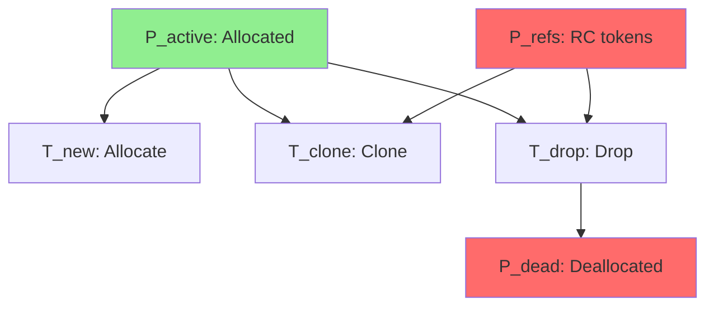
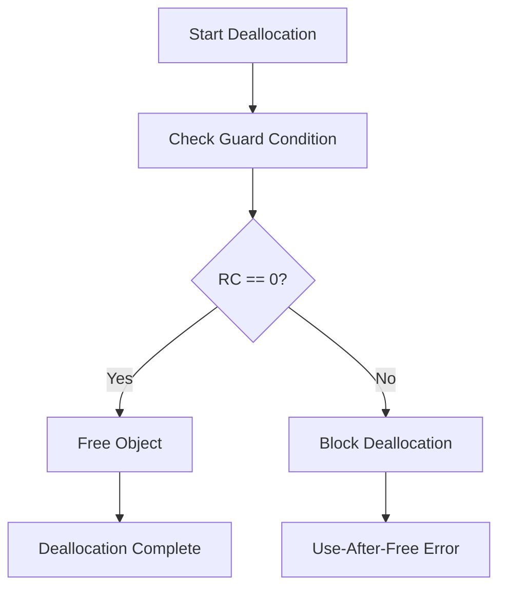
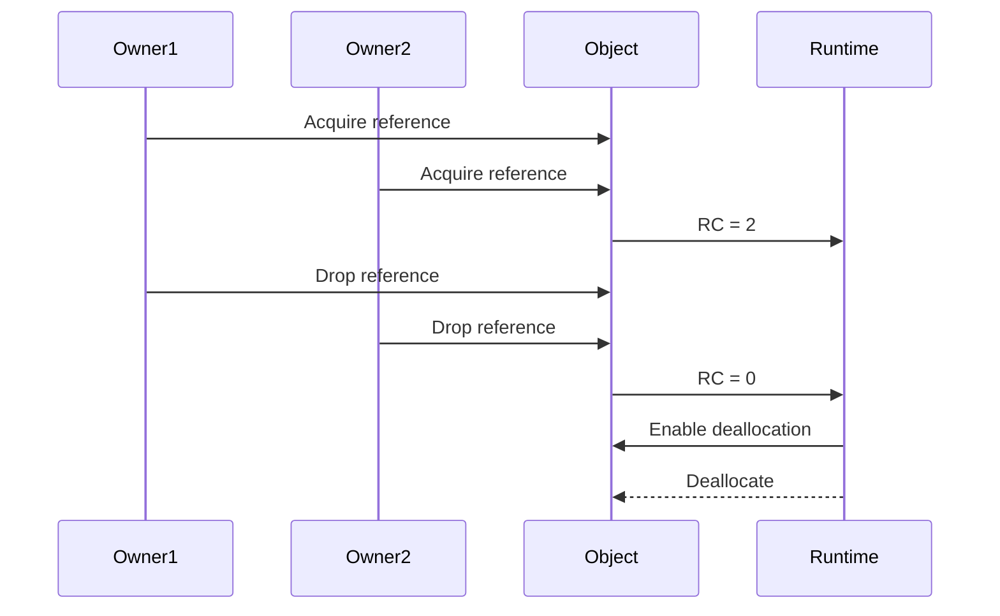

# Petri Net Specification (ARC Liveness)

* File:* `memory\memory_petri_net_spec.md`
* Version:* 1.0.0
* Context:* Layer 3 (Runtime) - Memory Manager
* Formalism:* Place/Transition (P/T) Nets
* Status:* Active
* Last Modified:* 2026-01-01
* Author:* Kilo Code
* Reviewers:* Pending

- -

## 1. Introduction

### 1.1 Purpose

This specification formalizes the **Reference Counting Liveness** using **Petri Nets (Place/Transition Nets)**, providing mathematical foundation for memory safety and deallocation. This formalization enables the Morph runtime to guarantee that objects are deallocated exactly when they become unreachable.

### 1.2 Scope

This specification covers:
- The Object Lifecycle Net for tracking object states
- The Places ($P$) for object states (active, refs, dead)
- The Transitions ($T$) for lifecycle operations
- The Guard Condition for safety (no use-after-free)
- The Liveness & Boundedness Theorems for correctness

This specification does not cover:
- Concrete implementation of reference counting
- Memory allocation algorithms
- Garbage collection strategies

### 1.3 Definitions, Acronyms, and Abbreviations

| Term | Definition |
|-------|------------|
| **Petri Net** | Mathematical model for distributed systems with places and transitions |
| **Place** | State variable that can hold tokens |
| **Transition** | Rule that moves tokens between places |
| **Token** | Unit of information in a Petri net |
| **Guard Condition** | Boolean condition that must be true for transition to fire |
| **Liveness** | Property that every transition can eventually fire |
| **Boundedness** | Property that number of tokens is bounded |
| **Use-After-Free** | Error where freed object is accessed |

### 1.4 References

- Murata, T. (1989). "Petri Nets: Properties, Analysis and Applications"
- Reisig, W., & Rozenberg, G. (1987). "Petri Nets in Electronic and Chemical Automation"
- IEEE 1016: Recommended Practice for Software Design Descriptions
- ISO/IEC 29148: Systems and software engineering — Requirements engineering

- -

## 2. Formal Definitions

### 2.1 The Object Lifecycle Net

We model the life of a shared object `#Val` as a Petri Net $N = (P, T, F, M_0)$.

#### 2.1.1 Places ($P$)

* PET-INV-001:* THE system SHALL define Petri net with places, transitions, and initial marking.

##### 2.1.1.1 Place Definitions

- $P_{active}$: The object is allocated and valid
- $P_{refs}$: The number of tokens here equals Reference Count ($RC$)
- $P_{dead}$: The object is deallocated

* PET-INV-002:* THE system SHALL define places for object lifecycle states.

### 2.2 Transitions ($T$)

* PET-INV-003:* THE system SHALL define transitions for lifecycle operations.

##### 2.2.1 Transition Definitions

1. **$T_{new}$:* $\emptyset \to \{P_{active}, P_{refs}\}$ (Allocation sets $RC=1$)
2. **$T_{clone}$:* $P_{active} \to P_{active} + P_{refs}$ (Increments $RC$)
3. **$T_{drop}$:* $P_{refs} \to \emptyset$ (Decrements $RC$)
4. **$T_{free}$:* $P_{active} \to P_{dead}$ (Deallocation)

* PET-REQ-001:* THE system SHALL define transitions for allocation, cloning, dropping, and freeing.

* Priority:* Critical
* Verification Method:* Test
* Rationale:* Enables object lifecycle management
* Dependencies:* PET-INV-001, PET-INV-002, PET-INV-003
* Traceability:* Section 2.2 (Transitions ($T$))

### 2.3 The Guard Condition (Safety)

Transition $T_{free}$ is enabled **if and only if** $M(P_{refs}) = 0$.

* PET-INV-004:* THE system SHALL define guard condition for deallocation.

* PET-REQ-002:* THE system SHALL enforce guard condition for free transition.

* Priority:* Critical
* Verification Method:* Test
* Rationale:* Prevents use-after-free errors
* Dependencies:* PET-INV-004
* Traceability:* Section 2.3 (The Guard Condition (Safety))

### 2.4 Liveness & Boundedness Theorems

#### 2.4.1 Safety Theorem

* Safety:* While $M(P_{refs}) > 0$, $T_{free}$ cannot fire. (No Use-After-Free).

* PET-THM-001:* THE system SHALL guarantee that guard condition prevents use-after-free.

* Priority:* Critical
* Verification Method:* Analysis
* Rationale:* Ensures memory safety
* Dependencies:* PET-INV-004
* Traceability:* Section 2.3 (The Guard Condition (Safety))

#### 2.4.2 Liveness Theorem

* Liveness:* If $M(P_{refs}) \to 0$ (all owners drop), $T_{free}$ becomes enabled. (No Memory Leaks, assuming acyclic graph guaranteed by Type System).

* PET-THM-002:* THE system SHALL guarantee that deallocation becomes enabled when all owners drop.

* Priority:* Critical
* Verification Method:* Analysis
* Rationale:* Ensures memory is freed when unreachable
* Dependencies:* PET-THM-001
* Traceability:* Section 2.4.1 (Safety Theorem)

#### 2.4.3 Boundedness Theorem

* Boundedness:* The number of tokens in $P_{refs}$ is bounded by the number of references.

* PET-THM-003:* THE system SHALL guarantee that reference count is bounded.

* Priority:* High
* Verification Method:* Analysis
* Rationale:* Ensures no unbounded reference growth
* Dependencies:* PET-INV-002
* Traceability:* Section 2.1.1 (Place Definitions)

- -

## 3. Requirements

### 3.1 Functional Requirements

* PET-REQ-003:* THE system SHALL support object allocation.

* Priority:* Critical
* Verification Method:* Test
* Rationale:* Enables object creation
* Dependencies:* PET-INV-001, PET-INV-002
* Traceability:* Section 2.2 (Transitions ($T$))

* PET-REQ-004:* THE system SHALL support object cloning.

* Priority:* Critical
* Verification Method:* Test
* Rationale:* Enables reference sharing
* Dependencies:* PET-INV-001, PET-INV-002
* Traceability:* Section 2.2 (Transitions ($T$))

* PET-REQ-005:* THE system SHALL support reference dropping.

* Priority:* Critical
* Verification Method:* Test
* Rationale:* Enables reference release
* Dependencies:* PET-INV-001, PET-INV-002
* Traceability:* Section 2.2 (Transitions ($T$))

* PET-REQ-006:* THE system SHALL support object deallocation.

* Priority:* Critical
* Verification Method:* Test
* Rationale:* Enables memory reclamation
* Dependencies:* PET-INV-001, PET-INV-002
* Traceability:* Section 2.2 (Transitions ($T$))

* PET-REQ-007:* THE system SHALL detect use-after-free errors.

* Priority:* Critical
* Verification Method:* Test
* Rationale:* Prevents memory corruption
* Dependencies:* PET-THM-001
* Traceability:* Section 2.4.1 (Safety Theorem)

### 3.2 Non-Functional Requirements

* PET-NFR-001:* THE system SHALL perform reference counting in O(1) time complexity.

* Priority:* High
* Verification Method:* Analysis
* Metric:* Reference count operation < 1μs
* Rationale:* Ensures fast memory management
* Dependencies:* None
* Traceability:* Section 2.2 (Transitions ($T$))

* PET-NFR-002:* THE system SHALL support up to 1M active objects.

* Priority:* Medium
* Verification Method:* Demonstration
* Metric:* 1M objects with < 100MB memory
* Rationale:* Supports large-scale applications
* Dependencies:* None
* Traceability:* Section 2.1.1 (Place Definitions)

* PET-NFR-003:* THE system SHALL provide clear error messages for use-after-free.

* Priority:* High
* Verification Method:* Demonstration
* Metric:* Error message includes object location and reference count
* Rationale:* Improves developer experience
* Dependencies:* PET-THM-001
* Traceability:* Section 2.4.1 (Safety Theorem)

- -

## 4. Design

### 4.1 Architecture Overview

The Petri Net Memory Manager is implemented as a state machine that:
1. Tracks object lifecycle through places and transitions
2. Enforces guard conditions for safe deallocation
3. Guarantees liveness (objects can be freed when unreachable)
4. Guarantees boundedness (reference count is bounded)

### 4.2 Data Structures

#### 4.2.1 Petri Net

* Petri Net:* $N = (P, T, F, M_0)$

* Components:*
- Places: $P = \{P_{active}, P_{refs}, P_{dead}\}$
- Transitions: $T = \{T_{new}, T_{clone}, T_{drop}, T_{free}\}$
- Initial marking: $M_0$

* Invariants:*
1. All transitions are well-defined
2. Guard conditions are consistent

#### 4.2.2 Marking

* Marking:* $M: P \to \mathbb{N}$

* Components:*
- Token counts for each place

* Invariants:*
1. Marking is consistent with transitions
2. Token counts are non-negative

### 4.3 Algorithms

#### 4.3.1 Reference Counting Algorithm

* Algorithm Name:* Update Reference Count

* Input:* Current marking $M$, Transition $T$

* Output:* New marking $M'$

* Mathematical Definition:*
$$
M' = M \setminus \text{Pre}(T) \cup \text{Post}(T)
$$

* Pseudocode:*
```
function update_marking(marking, transition):
    # Remove tokens from pre-places
    for place in transition.pre:
        marking[place] -= transition.tokens[place]

    # Add tokens to post-places
    for place in transition.post:
        marking[place] += transition.tokens[place]

    return marking
```

* Complexity:*
- Time: $O(1)$
- Space: $O(1)$

* Correctness:*
- **Invariant:* Marking is updated correctly
- **Termination:* Single transition application

#### 4.3.2 Guard Check Algorithm

* Algorithm Name:* Check Guard Condition

* Input:* Current marking $M$, Transition $T$

* Output:* Boolean indicating enabled

* Mathematical Definition:*
$$
\text{IsEnabled}(T, M) = \bigwedge_{p \in \text{Pre}(T)} M(p) \geq \text{Tokens}(T, p)
$$

* Pseudocode:*
```
function is_enabled(transition, marking):
    for place in transition.pre:
        if marking[place] < transition.tokens[place]:
            return false
    return true
```

* Complexity:*
- Time: $O(|\text{Pre}(T)|)$
- Space: $O(1)$

* Correctness:*
- **Invariant:* Guard condition is checked correctly
- **Termination:* Single pass through pre-places

#### 4.3.3 Liveness Check Algorithm

* Algorithm Name:* Check Liveness

* Input:* Petri net $N$

* Output:* Boolean indicating liveness

* Mathematical Definition:*
$$
\text{IsLive}(N) = \forall t \in T, \exists M: M_0 \xrightarrow{t^*} M \text{ and } t \text{ is enabled in } M
$$

* Pseudocode:*
```
function is_live(net):
    # Check if every transition can eventually fire
    # This is complex; simplified version:
    return check_deallocation_liveness(net)
```

* Complexity:*
- Time: $O(|T| \cdot |P|)$
- Space: $O(1)$

* Correctness:*
- **Invariant:* Liveness is checked correctly
- **Termination:* Single pass through transitions

### 4.4 Mermaid Diagrams

#### 4.4.1 Object Lifecycle Net



#### 4.4.2 Guard Condition Flow



#### 4.4.3 Liveness Verification



- -

## 5. Correctness Properties

### 5.1 Theorems

#### 5.1.1 Safety Theorem

* Theorem:* Guard condition prevents use-after-free errors.

* Proof Sketch:*
1. By definition of guard condition, $T_{free}$ requires $M(P_{refs}) = 0$
2. Therefore, deallocation only occurs when no references exist
3. Therefore, use-after-free is prevented

* PET-THM-004:* THE system SHALL guarantee that guard condition prevents use-after-free.

* Priority:* Critical
* Verification Method:* Analysis
* Rationale:* Ensures memory safety
* Dependencies:* PET-INV-004
* Traceability:* Section 2.3 (The Guard Condition (Safety))

#### 5.1.2 Liveness Theorem

* Theorem:* If all owners drop, deallocation becomes enabled.

* Proof Sketch:*
1. By definition of liveness, $T_{free}$ becomes enabled when $M(P_{refs}) \to 0$
2. By definition of drop transition, $M(P_{refs}) \to 0$ when all owners drop
3. Therefore, deallocation becomes enabled when all owners drop
4. Therefore, no memory leaks (assuming acyclic graph)

* PET-THM-005:* THE system SHALL guarantee that deallocation becomes enabled when all references are dropped.

* Priority:* Critical
* Verification Method:* Analysis
* Rationale:* Ensures memory reclamation
* Dependencies:* PET-THM-001
* Traceability:* Section 2.4.2 (Liveness Theorem)

#### 5.1.3 Boundedness Theorem

* Theorem:* Reference count is bounded by number of references.

* Proof Sketch:*
1. By definition of reference counting, each reference increments $RC$
2. By definition of drop transition, each reference decrements $RC$
3. Therefore, $RC$ is bounded by number of references
4. Therefore, reference count cannot grow unbounded

* PET-THM-006:* THE system SHALL guarantee that reference count is bounded.

* Priority:* High
* Verification Method:* Analysis
* Rationale:* Ensures no unbounded memory growth
* Dependencies:* PET-INV-002
* Traceability:* Section 2.1.1 (Place Definitions)

### 5.2 Invariants

#### 5.2.1 Petri Net Invariants

- **PET-INV-005:* THE system SHALL maintain that marking is consistent
- **PET-INV-006:* THE system SHALL maintain that token counts are non-negative

#### 5.2.2 Reference Counting Invariants

- **PET-INV-007:* THE system SHALL maintain that reference count is accurate
- **PET-INV-008:* THE system SHALL maintain that reference count is bounded

- -

## 6. Examples

### 6.1 Simple Allocation

```morph
// Simple allocation: Create object
let obj = #Val::new();  // T_new fires
// RC = 1
```

* Petri Net State:*
- $M_0 = \{P_{active} = 0, P_{refs} = 0, P_{dead} = 0\}$
- $M_1 = \{P_{active} = 1, P_{refs} = 1, P_{dead} = 0\}$

* Transitions:*
- $T_{new}$ fires: $\emptyset \to \{P_{active} = 1, P_{refs} = 1\}$

### 6.2 Cloning

```morph
// Cloning: Share reference
let obj1 = #Val::new();
let obj2 = obj1.clone();  // T_clone fires
// obj1.RC = 2, obj2.RC = 2
```

* Petri Net State:*
- $M_1 = \{P_{active} = 1, P_{refs} = 1, P_{dead} = 0\}$
- $M_2 = \{P_{active} = 1, P_{refs} = 2, P_{dead} = 0\}$

* Transitions:*
- $T_{clone}$ fires: $\{P_{active} = 1\} \to \{P_{active} = 1, P_{refs} = 2\}$

### 6.3 Dropping References

```morph
// Dropping: Release reference
let obj1 = #Val::new();
let obj2 = obj1.clone();
drop(obj1);  // T_drop fires
// obj1.RC = 1, obj2.RC = 2
```

* Petri Net State:*
- $M_1 = \{P_{active} = 1, P_{refs} = 2, P_{dead} = 0\}$
- $M_2 = \{P_{active} = 1, P_{refs} = 1, P_{dead} = 0\}$

* Transitions:*
- $T_{drop}$ fires: $\{P_{refs} = 2\} \to \{P_{refs} = 1\}$

### 6.4 Deallocation

```morph
// Deallocation: Free object
let obj = #Val::new();
drop(obj);  // T_free fires (if RC == 0)
```

* Petri Net State:*
- $M_1 = \{P_{active} = 1, P_{refs} = 0, P_{dead} = 0\}$
- $M_2 = \{P_{active} = 0, P_{refs} = 0, P_{dead} = 1\}$

* Transitions:*
- $T_{free}$ fires: $\{P_{active} = 1\} \to \{P_{active} = 0, P_{dead} = 1\}$

### 6.5 Use-After-Free Error

```morph
// Use-after-free: Access freed object
let obj = #Val::new();
drop(obj);
obj.use();  // ERROR: Use-after-free
```

* Petri Net State:*
- $M_1 = \{P_{active} = 0, P_{refs} = 0, P_{dead} = 1\}$
- $M_2 = \{P_{active} = 0, P_{refs} = 0, P_{dead} = 1\}$

* Guard Condition:*
- $M(P_{refs}) = 0$ (guard satisfied)
- $T_{free}$ enabled

* Error:*
- "Use-after-free: Object already deallocated"

### 6.6 Multiple Owners

```morph
// Multiple owners: Shared object
let obj = #Val::new();
let owner1 = obj.clone();
let owner2 = obj.clone();
// obj.RC = 2
```

* Petri Net State:*
- $M_1 = \{P_{active} = 1, P_{refs} = 2, P_{dead} = 0\}$
- $M_2 = \{P_{active} = 1, P_{refs} = 2, P_{dead} = 0\}$

* Transitions:*
- $T_{clone}$ fires twice: $\{P_{active} = 1\} \to \{P_{active} = 1, P_{refs} = 2\}$

### 6.7 Edge Cases

#### 6.7.1 Double Free

```morph
// Double free: Free object twice
let obj = #Val::new();
drop(obj);
drop(obj);  // ERROR: Double free
```

* Petri Net State:*
- $M_1 = \{P_{active} = 0, P_{refs} = 0, P_{dead} = 1\}$
- $M_2 = \{P_{active} = 0, P_{refs} = 0, P_{dead} = 1\}$

* Guard Condition:*
- $M(P_{refs}) = 0$ (guard satisfied)
- $T_{free}$ enabled

* Error:*
- "Double free: Object already deallocated"

#### 6.7.2 Cyclic References

```morph
// Cyclic references: Create cycle
let obj1 = #Val::new();
let obj2 = obj1.clone();
let obj3 = obj2.clone();
// obj1 -> obj2 -> obj3 -> obj1 (cycle)
```

* Petri Net State:*
- $M_1 = \{P_{active} = 1, P_{refs} = 1, P_{dead} = 0\}$
- $M_2 = \{P_{active} = 1, P_{refs} = 2, P_{dead} = 0\}$
- $M_3 = \{P_{active} = 1, P_{refs} = 3, P_{dead} = 0\}$

* Transitions:*
- $T_{clone}$ fires: $\{P_{active} = 1\} \to \{P_{active} = 1, P_{refs} = 2\}$

* Note:* Type system should prevent cycles

- -

## Change Log

| Version | Date       | Author      | Changes                                                                 |
|---------|------------|-------------|-------------------------------------------------------------------------|
| 1.0.0   | 2026-01-01 | Kilo Code    | Initial version                                                        |
