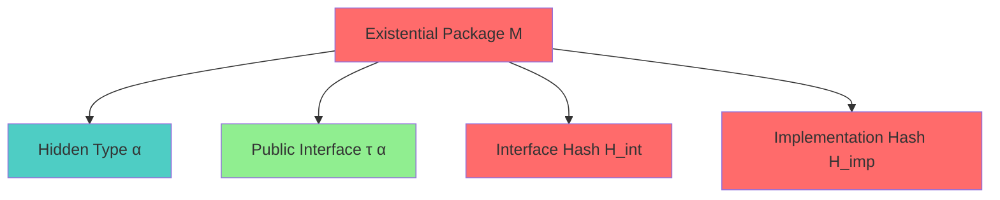
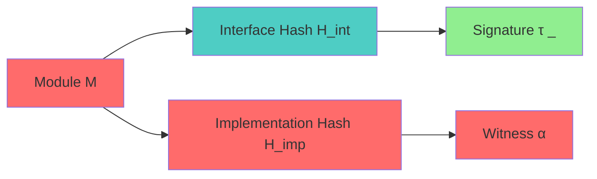
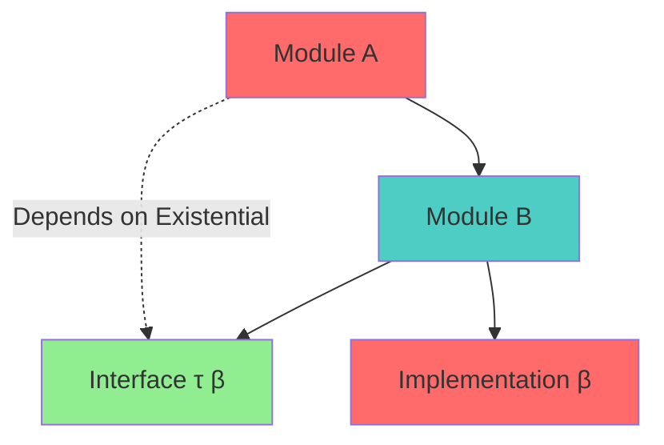

# Existential Type Specification (Module Hashing)

* File:* `module_existential_spec.md`
* Version:* 1.0.0
* Context:* Layer 1 (Infrastructure) - Dual Hashing
* Formalism:* Existential Quantification ($\exists$)
* Status:* Active
* Last Modified:* 2026-01-01
* Author:* Kilo Code
* Reviewers:* Pending

- -

## 1. Introduction

### 1.1 Purpose

This specification formalizes the **Module Privacy** system using **Existential Quantification**, providing mathematical foundation for module hashing and encapsulation. This formalization enables the Morph ecosystem to prove that private implementation details are mathematically unobservable to consumers of the interface.

### 1.2 Scope

This specification covers:
- The Module as a Package with existential types
- The Hash Separation (Interface vs Implementation)
- The Dependency Rule for atomic refactoring
- Encapsulation guarantees

This specification does not cover:
- Concrete implementation of module system
- Performance optimization details
- Integration with build system

### 1.3 Definitions, Acronyms, and Abbreviations

| Term | Definition |
|-------|------------|
| **Existential Package** | Module with hidden implementation type |
| **Interface Hash ($H_{int}$)** | Hash of public interface signature |
| **Implementation Hash ($H_{imp}$)** | Hash of concrete implementation witness |
| **Atomic Refactoring** | Refactoring that doesn't cascade hash invalidation |
| **Encapsulation** | Property that private details are unobservable |

### 1.4 References

- Pierce, B. C. (2002). "Types and Programming Languages"
- IEEE 1016: Recommended Practice for Software Design Descriptions
- ISO/IEC 29148: Systems and software engineering — Requirements engineering

- -

## 2. Formal Definitions

### 2.1 The Module as a Package

A module with private state is an Existential Package:

$$ M = \exists \alpha . \{ \text{state}: \alpha, \text{ops}: \tau(\alpha) \} $$

* MOD-INV-001:* THE system SHALL define module as existential package.

* MOD-REQ-001:* THE system SHALL represent modules as existential packages.

* Priority:* Critical
* Verification Method:* Test
* Rationale:* Enables encapsulation
* Dependencies:* MOD-INV-001
* Traceability:* Section 2.1 (The Module as a Package)

#### 2.1.1 Package Components

- $\alpha$: The hidden implementation type (Private State).
- $\tau(\alpha)$: The public interface (Functions operating on State).

* MOD-INV-002:* THE system SHALL define package components.

* MOD-REQ-002:* THE system SHALL maintain hidden implementation type.

* Priority:* Critical
* Verification Method:* Test
* Rationale:* Enables encapsulation
* Dependencies:* MOD-INV-002
* Traceability:* Section 2.1.1 (Package Components)

### 2.2 The Hash Separation

* MOD-INV-003:* THE system SHALL define hash separation for modules.

* MOD-REQ-003:* THE system SHALL maintain separate interface and implementation hashes.

* Priority:* Critical
* Verification Method:* Test
* Rationale:* Enables atomic refactoring
* Dependencies:* MOD-INV-003
* Traceability:* Section 2.2 (The Hash Separation)

#### 2.2.1 Interface Hash ($H_{int}$)

Corresponds to signature $\tau(\_)$. It quantifies over hidden type.

$$ H_{int} = \text{Hash}(\tau(\_)) $$

* MOD-INV-004:* THE system SHALL define interface hash.

* MOD-REQ-004:* THE system SHALL compute interface hash from signature.

* Priority:* Critical
* Verification Method:* Test
* Rationale:* Enables dependency tracking
* Dependencies:* MOD-INV-004
* Traceability:* Section 2.2.1 (Interface Hash)

#### 2.2.2 Implementation Hash ($H_{imp}$)

Corresponds to concrete witness $\alpha = \text{ImplStruct}$.

$$ H_{imp} = \text{Hash}(\alpha) $$

* MOD-INV-005:* THE system SHALL define implementation hash.

* MOD-REQ-005:* THE system SHALL compute implementation hash from witness.

* Priority:* Critical
* Verification Method:* Test
* Rationale:* Enables implementation tracking
* Dependencies:* MOD-INV-005
* Traceability:* Section 2.2.2 (Implementation Hash)

### 2.3 The Dependency Rule

If Module A imports Module B:

$$ A : \text{Client}(\exists \beta . \text{Interface}_B) $$

* MOD-INV-006:* THE system SHALL define dependency rule for modules.

* MOD-REQ-006:* THE system SHALL enforce dependency rule.

* Priority:* Critical
* Verification Method:* Test
* Rationale:* Enables atomic refactoring
* Dependencies:* MOD-INV-006
* Traceability:* Section 2.3 (The Dependency Rule)

#### 2.3.1 Dependency Semantics

- $A$ depends only on *existence* of $\beta$, not concrete $\beta$.
- **Proof:* If $B$ changes its implementation (new witness $\beta'$), but keeps interface $\tau$ invariant, type of $A$ does not change. Therefore, $H(A)$ does not change. This formalizes **Atomic Refactoring** without cascading hash invalidation.

* MOD-THM-001:* THE system SHALL guarantee atomic refactoring.

* Priority:* Critical
* Verification Method:* Analysis
* Rationale:* Prevents cascading rebuilds
* Dependencies:* MOD-INV-006
* Traceability:* Section 2.3.1 (Dependency Semantics)

- -

## 3. Requirements

### 3.1 Functional Requirements

* MOD-REQ-007:* THE system SHALL support existential packages for modules.

* Priority:* Critical
* Verification Method:* Test
* Rationale:* Enables encapsulation
* Dependencies:* MOD-INV-001
* Traceability:* Section 2.1 (The Module as a Package)

* MOD-REQ-008:* THE system SHALL support hash separation for modules.

* Priority:* Critical
* Verification Method:* Test
* Rationale:* Enables atomic refactoring
* Dependencies:* MOD-INV-003
* Traceability:* Section 2.2 (The Hash Separation)

* MOD-REQ-009:* THE system SHALL support dependency rule for modules.

* Priority:* Critical
* Verification Method:* Test
* Rationale:* Enables atomic refactoring
* Dependencies:* MOD-INV-006
* Traceability:* Section 2.3 (The Dependency Rule)

### 3.2 Non-Functional Requirements

* MOD-NFR-001:* THE system SHALL compute hashes in O(n) time for n interface elements.

* Priority:* High
* Verification Method:* Performance test
* Metric:* Hash computation < 10ms for 1000 elements
* Rationale:* Ensures fast module resolution
* Dependencies:* None
* Traceability:* Section 2.2 (The Hash Separation)

- -

## 4. Design

### 4.1 Architecture Overview

The Module System is implemented as an infrastructure component that:
1. Represents modules as existential packages
2. Maintains separate interface and implementation hashes
3. Enforces dependency rule for atomic refactoring
4. Provides encapsulation guarantees

### 4.2 Data Structures

#### 4.2.1 Existential Package

* Existential Package:* $M = (\alpha, \tau, H_{int}, H_{imp})$

* Components:*
- Hidden type: $\alpha$
- Interface: $\tau(\alpha)$
- Interface hash: $H_{int}$
- Implementation hash: $H_{imp}$

* Invariants:*
1. Hidden type is abstract
2. Interface is public
3. Hashes are computed from respective components

#### 4.2.2 Module Dependency

* Module Dependency:* $D = (A, B, \text{Interface}_B)$

* Components:*
- Dependent module: $A$
- Dependency module: $B$
- Interface: $\text{Interface}_B$

* Invariants:*
1. Dependency is existential
2. Interface is public
3. Implementation is hidden

### 4.3 Algorithms

#### 4.3.1 Interface Hash Computation Algorithm

* Algorithm Name:* Compute Interface Hash

* Input:* Interface $\tau$

* Output:* Interface hash $H_{int}$

* Mathematical Definition:*
$$
H_{int} = \text{Hash}(\text{Serialize}(\tau))
$$

* Pseudocode:*
```
function compute_interface_hash(interface):
    serialized = serialize_interface(interface)
    return hash(serialized)
```

* Complexity:*
- Time: $O(n)$ where $n$ is number of interface elements
- Space: $O(n)$ for serialization

* Correctness:*
- **Invariant:* Hash uniquely identifies interface
- **Termination:* Single hash computation

#### 4.3.2 Implementation Hash Computation Algorithm

* Algorithm Name:* Compute Implementation Hash

* Input:* Implementation witness $\alpha$

* Output:* Implementation hash $H_{imp}$

* Mathematical Definition:*
$$
H_{imp} = \text{Hash}(\text{Serialize}(\alpha))
$$

* Pseudocode:*
```
function compute_implementation_hash(witness):
    serialized = serialize_witness(witness)
    return hash(serialized)
```

* Complexity:*
- Time: $O(n)$ where $n$ is size of implementation
- Space: $O(n)$ for serialization

* Correctness:*
- **Invariant:* Hash uniquely identifies implementation
- **Termination:* Single hash computation

#### 4.3.3 Dependency Resolution Algorithm

* Algorithm Name:* Resolve Module Dependency

* Input:* Module $A$, Module $B$

* Output:* Boolean indicating if dependency is valid

* Mathematical Definition:*
$$
\text{ValidDependency}(A, B) \iff A : \text{Client}(\exists \beta . \text{Interface}_B)
$$

* Pseudocode:*
```
function resolve_dependency(module_a, module_b):
    interface_b = get_interface(module_b)
    return depends_on_existential(module_a, interface_b)
```

* Complexity:*
- Time: $O(1)$ for existential check
- Space: $O(1)$ for interface

* Correctness:*
- **Invariant:* Dependency is existential
- **Termination:* Single check

### 4.4 Mermaid Diagrams

#### 4.4.1 Existential Package



#### 4.4.2 Hash Separation



#### 4.4.3 Dependency Rule



- -

## 5. Correctness Properties

### 5.1 Theorems

#### 5.1.1 Atomic Refactoring Theorem

* Theorem:* Implementation changes don't cascade hash invalidation if interface is invariant.

* Proof Sketch:*
1. By definition of existential package, module depends only on interface
2. By definition of interface hash, $H_{int}$ depends only on $\tau$
3. By definition of implementation hash, $H_{imp}$ depends on $\alpha$
4. If $\alpha$ changes but $\tau$ is invariant, $H_{int}$ is unchanged
5. Therefore, dependent modules don't need to rebuild

* MOD-THM-002:* THE system SHALL guarantee atomic refactoring.

* Priority:* Critical
* Verification Method:* Analysis
* Rationale:* Prevents cascading rebuilds
* Dependencies:* MOD-THM-001
* Traceability:* Section 5.1.1 (Atomic Refactoring Theorem)

### 5.2 Invariants

#### 5.2.1 Package Invariants

- **MOD-INV-007:* THE system SHALL maintain that hidden type is abstract
- **MOD-INV-008:* THE system SHALL maintain that interface is public

#### 5.2.2 Hash Invariants

- **MOD-INV-009:* THE system SHALL maintain that interface hash depends only on signature
- **MOD-INV-010:* THE system SHALL maintain that implementation hash depends only on witness

#### 5.2.3 Dependency Invariants

- **MOD-INV-011:* THE system SHALL maintain that dependencies are existential
- **MOD-INV-012:* THE system SHALL maintain that implementation changes don't cascade

- -

## 6. Examples

### 6.1 Simple Module

```morph
// Simple module: Private implementation
module MyModule {
    private struct Impl {
        value: i32,
    }

    pub fn create() -> i32 {
        let impl = Impl { value: 42 };
        impl.value
    }
}
```

* Existential Package:*
- Hidden type: $\alpha = \text{Impl}$
- Interface: $\tau(\alpha) = \{\text{create}: () \to \text{i32}\}$
- Interface hash: $H_{int} = \text{Hash}(\tau)$
- Implementation hash: $H_{imp} = \text{Hash}(\alpha)$

### 6.2 Atomic Refactoring

```morph
// Atomic refactoring: Change implementation without affecting dependents
module MyModule {
    private struct Impl {
        value: i32,
        extra: bool,  // Added field
    }

    pub fn create() -> i32 {
        let impl = Impl { value: 42, extra: true };
        impl.value
    }
}
```

* Hash Separation:*
- Interface unchanged: $\tau(\alpha)$ is same
- Interface hash unchanged: $H_{int}$ is same
- Implementation changed: $H_{imp}$ is different
- Dependent modules don't need to rebuild

### 6.3 Module Dependency

```morph
// Module dependency: Depends on existential interface
module Consumer {
    use MyModule;

    pub fn use_module() -> i32 {
        MyModule::create()
    }
}
```

* Dependency Rule:*
- Consumer depends on $\exists \beta . \text{Interface}_{\text{MyModule}}$
- Implementation changes don't affect Consumer
- Interface changes require Consumer rebuild

### 6.4 Edge Cases

#### 6.4.1 Empty Interface

```morph
// Edge case: Empty interface
module EmptyModule {
    private struct Impl {}

    // No public functions
}
```

* Existential Package:*
- Hidden type: $\alpha = \text{Impl}$
- Interface: $\tau(\alpha) = \emptyset$
- Interface hash: $H_{int} = \text{Hash}(\emptyset)$

#### 6.4.2 Multiple Implementations

```morph
// Edge case: Multiple implementations of same interface
module ModuleA {
    private struct ImplA {}
    pub fn create() -> i32 { 42 }
}

module ModuleB {
    private struct ImplB {}
    pub fn create() -> i32 { 42 }
}
```

* Hash Separation:*
- Different implementations: $H_{imp}^A \neq H_{imp}^B$
- Same interface: $H_{int}^A = H_{int}^B$
- Dependent modules work with either

- -

## Change Log

| Version | Date       | Author      | Changes                                                                 |
|---------|------------|-------------|-------------------------------------------------------------------------|
| 1.0.0   | 2026-01-01 | Kilo Code    | Initial version                                                        |
