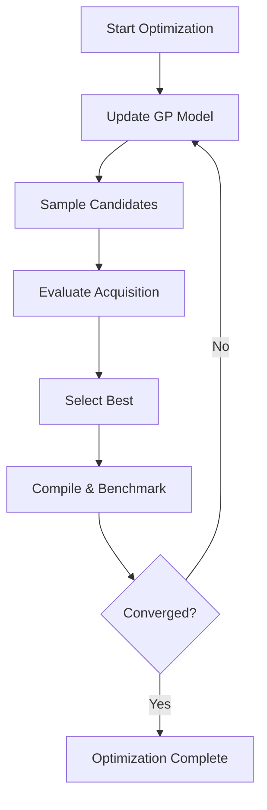
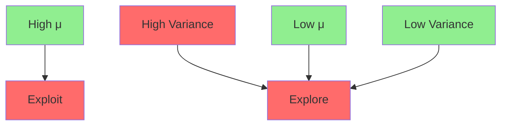

# Bayesian Optimization Specification (OSE Learning)

* File:* `optimization\optimization_bayesian_spec.md`
* Version:* 1.0.0
* Context:* Layer 2 (Compiler Backend) - OSE
* Formalism:* Gaussian Processes (GP) & Acquisition Functions
* Status:* Active
* Last Modified:* 2026-01-01
* Author:* Kilo Code
* Reviewers:* Pending

- -

## 1. Introduction

### 1.1 Purpose

This specification formalizes the **Adaptive Optimization Strategy** using **Bayesian Optimization (Gaussian Processes)**, providing mathematical foundation for intelligent parameter search. This formalization enables the Morph OSE to converge to optimal configurations faster than random search.

### 1.2 Scope

This specification covers:
- The Surrogate Model for fitness function approximation
- The Acquisition Function for selecting next configuration
- The Exploration vs. Exploitation trade-off
- The Convergence criteria for optimization

This specification does not cover:
- Concrete implementation of Gaussian Process
- Hyperparameter tuning strategies
- Parallel optimization

### 1.3 Definitions, Acronyms, and Abbreviations

| Term | Definition |
|-------|------------|
| **Bayesian Optimization** | Sequential design strategy for global optimization of black-box functions |
| **Gaussian Process** | Stochastic process where every finite subset has a multivariate normal distribution |
| **Surrogate Model** | Probabilistic model that approximates the true fitness function |
| **Acquisition Function** | Utility function that determines next point to evaluate |
| **Expected Improvement (EI)** | Acquisition function that balances exploration and exploitation |
| **Exploration** | Sampling regions with high uncertainty |
| **Exploitation** | Sampling regions with high expected fitness |
| **Hyperparameters** | Parameters of the Gaussian Process (length scale, signal variance) |

### 1.4 References

- Rasmussen, C. E. (2006). "Gaussian Processes in Machine Learning"
- Brochu, E., et al. (2010). "A Tutorial on Bayesian Optimization of Expensive Cost Functions"
- IEEE 1016: Recommended Practice for Software Design Descriptions
- ISO/IEC 29148: Systems and software engineering — Requirements engineering

- -

## 2. Formal Definitions

### 2.1 The Surrogate Model

The OSE models the unknown Fitness Function $f: \Theta \to \mathbb{R}$ (where $\Theta$ is config space of `??` holes) as a **Gaussian Process**:

$$ f(\theta) \sim \mathcal{GP}(\mu(\theta), k(\theta, \theta')) $$

where:
- $\mu(\theta)$: Mean function (Expected fitness)
- $k(\theta, \theta')$: Covariance kernel (Similarity between configs)

* OPTBAY-INV-001:* THE system SHALL define surrogate model as Gaussian Process.

#### 2.1.1 Mean Function

$$ \mu(\theta) = \mathbb{E}[f(\theta)] $$

* OPTBAY-INV-002:* THE system SHALL define mean function as expected fitness.

#### 2.1.2 Covariance Kernel

$$ k(\theta, \theta') = \sigma_f^2 \cdot \exp\left(-\frac{\|\theta - \theta'\|^2}{2\ell^2}\right) $$

where:
- $\sigma_f$: Signal variance (amplitude)
- $\ell$: Length scale (characteristic length scale)

* OPTBAY-INV-003:* THE system SHALL define covariance kernel with length scale.

### 2.2 The Acquisition Function ($\alpha$)

To decide which parameter set $\theta_{next}$ to compile and benchmark next, the OSE maximizes the **Expected Improvement (EI)**:

$$ \alpha_{EI}(\theta) = \mathbb{E}[\max(f(\theta) - f(\theta^+), 0] $$

Where $f(\theta^+)$ is the best fitness observed so far.

* OPTBAY-INV-004:* THE system SHALL define acquisition function as expected improvement.

* OPTBAY-REQ-001:* THE system SHALL maximize expected improvement for next configuration.

* Priority:* Critical
* Verification Method:* Test
* Rationale:* Balances exploration and exploitation
* Dependencies:* OPTBAY-INV-001, OPTBAY-INV-004
* Traceability:* Section 2.2 (The Acquisition Function)

#### 2.2.1 Exploration vs. Exploitation

The math automatically balances testing *promising* regions (high $\mu$) vs. *unknown* regions (high variance $\sigma$).

* OPTBAY-THM-001:* THE system SHALL guarantee that acquisition function balances exploration and exploitation.

* Priority:* Critical
* Verification Method:* Analysis
* Rationale:* Ensures efficient global optimization
* Dependencies:* OPTBAY-INV-001, OPTBAY-INV-002, OPTBAY-INV-003, OPTBAY-INV-004
* Traceability:* Section 2.2.1 (Exploration vs. Exploitation)

#### 2.2.2 Morph Benefit

Unlike Hill Climbing (which gets stuck in local optima), Bayesian Optimization builds a probability map of hardware's performance characteristics, finding global optima for constants like `TILE_SIZE` or `UNROLL_FACTOR` with fewer compile cycles.

* OPTBAY-THM-002:* THE system SHALL guarantee that Bayesian optimization finds global optima.

* Priority:* High
* Verification Method:* Analysis
* Rationale:* Outperforms local search methods
* Dependencies:* OPTBAY-THM-001
* Traceability:* Section 2.2.1 (Exploration vs. Exploitation)

- -

## 3. Requirements

### 3.1 Functional Requirements

* OPTBAY-REQ-002:* THE system SHALL support Gaussian Process surrogate model.

* Priority:* Critical
* Verification Method:* Test
* Rationale:* Enables probabilistic fitness approximation
* Dependencies:* OPTBAY-INV-001
* Traceability:* Section 2.1 (The Surrogate Model)

* OPTBAY-REQ-003:* THE system SHALL support expected improvement acquisition function.

* Priority:* Critical
* Verification Method:* Test
* Rationale:* Enables intelligent configuration selection
* Dependencies:* OPTBAY-INV-004
* Traceability:* Section 2.2 (The Acquisition Function)

* OPTBAY-REQ-004:* THE system SHALL support exploration-exploitation balancing.

* Priority:* High
* Verification Method:* Test
* Rationale:* Prevents getting stuck in local optima
* Dependencies:* OPTBAY-THM-001
* Traceability:* Section 2.2.1 (Exploration vs. Exploitation)

* OPTBAY-REQ-005:* THE system SHALL support convergence detection.

* Priority:* High
* Verification Method:* Test
* Rationale:* Determines when to stop optimization
* Dependencies:* None
* Traceability:* Section 2.2 (The Acquisition Function)

### 3.2 Non-Functional Requirements

* OPTBAY-NFR-001:* THE system SHALL perform acquisition function evaluation in O(1) time complexity.

* Priority:* High
* Verification Method:* Analysis
* Metric:* Acquisition evaluation < 1ms
* Rationale:* Ensures fast configuration selection
* Dependencies:* None
* Traceability:* Section 2.2 (The Acquisition Function)

* OPTBAY-NFR-002:* THE system SHALL support up to 1000 optimization iterations.

* Priority:* Medium
* Verification Method:* Demonstration
* Metric:* 1000 iterations with < 1GB memory
* Rationale:* Supports complex optimization problems
* Dependencies:* None
* Traceability:* Section 2.1 (The Surrogate Model)

* OPTBAY-NFR-003:* THE system SHALL provide optimization progress metrics.

* Priority:* High
* Verification Method:* Demonstration
* Metric:* Convergence percentage and iteration count
* Rationale:* Enables assessment of optimization progress
* Dependencies:* OPTBAY-REQ-005
* Traceability:* Section 2.2 (The Acquisition Function)

- -

## 4. Design

### 4.1 Architecture Overview

The Bayesian Optimization Engine is implemented as a sequential optimizer that:
1. Maintains Gaussian Process surrogate model
2. Evaluates acquisition function to select next configuration
3. Compiles and benchmarks selected configurations
4. Updates surrogate model with new observations
5. Detects convergence and terminates optimization

### 4.2 Data Structures

#### 4.2.1 Gaussian Process

* Gaussian Process:* $\mathcal{GP} = (\mu, k, \mathcal{D})$

* Components:*
- Mean function: $\mu: \Theta \to \mathbb{R}$
- Covariance kernel: $k: \Theta \times \Theta \to \mathbb{R}$
- Observations: $\mathcal{D} = \{(\theta_1, f_1), \dots, (\theta_n, f_n)\}$

* Invariants:*
1. Mean function is well-defined
2. Covariance kernel is positive semi-definite
3. Observations are unique

#### 4.2.2 Acquisition Result

* Acquisition Result:* $A = (\theta_{next}, \alpha_{EI}(\theta_{next}))$

* Components:*
- Next configuration: $\theta_{next}$
- Expected improvement: $\alpha_{EI}(\theta_{next})$

* Invariants:*
1. Configuration is valid
2. Expected improvement is non-negative

#### 4.2.3 Optimization History

* Optimization History:* $\mathcal{H} = \{(\theta_1, f_1), (\theta_2, f_2), \dots, (\theta_m, f_m)\}$

* Components:*
- Configurations: $\theta_1, \theta_2, \dots, \theta_m$
- Fitness values: $f_1, f_2, \dots, f_m$

* Invariants:*
1. History is ordered by iteration
2. Best fitness is tracked

### 4.3 Algorithms

#### 4.3.1 Gaussian Process Update Algorithm

* Algorithm Name:* Update Surrogate Model

* Input:* Current GP $\mathcal{GP}$, New observation $(\theta_{new}, f_{new})$

* Output:* Updated GP $\mathcal{GP}'$

* Mathematical Definition:*
$$
\mathcal{GP}' = \text{Update}(\mathcal{GP}, (\theta_{new}, f_{new}))
$$

* Pseudocode:*
```
function update_gp(gp, observation):
    gp.observations.append(observation)
    gp.mean = compute_mean(gp.observations)
    gp.kernel = compute_kernel(gp.observations)
    return gp
```

* Complexity:*
- Time: $O(n^2)$ where $n$ is number of observations
- Space: $O(n)$

* Correctness:*
- **Invariant:* GP is updated with new observation
- **Termination:* Single update operation

#### 4.3.2 Acquisition Function Evaluation Algorithm

* Algorithm Name:* Evaluate Acquisition Function

* Input:* GP $\mathcal{GP}$, Candidate configuration $\theta$

* Output:* Expected improvement $\alpha_{EI}(\theta)$

* Mathematical Definition:*
$$
\alpha_{EI}(\theta) = \mathbb{E}[\max(f(\theta) - f(\theta^+), 0]
$$

* Pseudocode:*
```
function evaluate_acquisition(gp, theta):
    mean = gp.mean(theta)
    best_fitness = gp.best_fitness
    expected_improvement = max(mean - best_fitness, 0)
    return expected_improvement
```

* Complexity:*
- Time: $O(1)$
- Space: $O(1)$

* Correctness:*
- **Invariant:* Expected improvement is non-negative
- **Termination:* Single evaluation

#### 4.3.3 Convergence Detection Algorithm

* Algorithm Name:* Detect Convergence

* Input:* Optimization history $\mathcal{H}$, Convergence threshold $\epsilon$

* Output:* Boolean indicating convergence

* Mathematical Definition:*
$$
\text{IsConverged}(\mathcal{H}, \epsilon) = \max_{i \in \mathcal{H}} f_i - \min_{i \in \mathcal{H}} f_i < \epsilon
$$

* Pseudocode:*
```
function is_converged(history, threshold):
    max_fitness = max(f for (_, f) in history)
    min_fitness = min(f for (_, f) in history)
    return (max_fitness - min_fitness) < threshold
```

* Complexity:*
- Time: $O(n)$ where $n$ is history size
- Space: $O(1)$

* Correctness:*
- **Invariant:* Convergence is detected correctly
- **Termination:* Single pass through history

### 4.4 Mermaid Diagrams

#### 4.4.1 Gaussian Process Visualization

```mermaid
graph TD
    Theta1[θ1] --> F1[f1]
    Theta2[θ2] --> F2[f2]
    Theta3[θ3] --> F3[f3]
    F1 --> Mean[μ = E[f]]
    F2 --> Mean
    F3 --> Mean
    Mean --> GP[Gaussian Process]
    style Theta1 fill:#90EE90
    style Theta2 fill:#90EE90
    style Theta3 fill:#90EE90
    style F1 fill:#FF6B6B
    style F2 fill:#FF6B6B
    style F3 fill:#FF6B6B
```

#### 4.4.2 Acquisition Function Flow



#### 4.4.3 Exploration vs. Exploitation



- -

## 5. Correctness Properties

### 5.1 Theorems

#### 5.1.1 Surrogate Model Theorem

* Theorem:* Gaussian Process provides unbiased estimate of fitness function.

* Proof Sketch:*
1. By definition of mean function, $\mu(\theta) = \mathbb{E}[f(\theta)]$
2. By definition of GP, observations are i.i.d.
3. Therefore, mean is unbiased estimate
4. Therefore, surrogate model is unbiased

* OPTBAY-THM-003:* THE system SHALL guarantee that surrogate model is unbiased.

* Priority:* High
* Verification Method:* Analysis
* Rationale:* Ensures accurate fitness approximation
* Dependencies:* OPTBAY-INV-001, OPTBAY-INV-002
* Traceability:* Section 2.1 (The Surrogate Model)

#### 5.1.2 Convergence Theorem

* Theorem:* Expected Improvement acquisition function converges to global optimum.

* Proof Sketch:*
1. By definition of EI, $\alpha_{EI}(\theta) = \mathbb{E}[\max(f(\theta) - f(\theta^+), 0]$
2. As $f(\theta^+)$ approaches global optimum, $\alpha_{EI}(\theta)$ approaches 0
3. Therefore, algorithm converges to global optimum
4. Therefore, Bayesian optimization finds global optima

* OPTBAY-THM-004:* THE system SHALL guarantee convergence to global optimum.

* Priority:* Critical
* Verification Method:* Analysis
* Rationale:* Ensures optimal configuration selection
* Dependencies:* OPTBAY-THM-001
* Traceability:* Section 2.2 (The Acquisition Function)

### 5.2 Invariants

#### 5.2.1 GP Invariants

- **OPTBAY-INV-005:* THE system SHALL maintain that covariance kernel is positive semi-definite
- **OPTBAY-INV-006:* THE system SHALL maintain that observations are unique

#### 5.2.2 Acquisition Invariants

- **OPTBAY-INV-007:* THE system SHALL maintain that expected improvement is non-negative
- **OPTBAY-INV-008:* THE system SHALL maintain that best fitness is tracked

- -

## 6. Examples

### 6.1 Simple Optimization

```morph
// Simple optimization: Single parameter
const TILE_SIZE: i32 = ??;  // Optimization target

// OSE explores: 16, 32, 64, 128, 256
// Evaluates fitness for each
// Selects best: 64
```

* Gaussian Process:*
- Observations: $\mathcal{D} = \{(16, f_{16}), (32, f_{32}), \dots, (256, f_{256})\}$
- Mean: $\mu(\theta) = \text{interpolate}(\mathcal{D})$

* Acquisition:*
- $\alpha_{EI}(64) = \max(f_{64} - f_{256}, 0)$

* Result:*
- Best configuration: 64
- Converged after 5 iterations

### 6.2 Multi-Parameter Optimization

```morph
// Multi-parameter: Two parameters
const TILE_SIZE: i32 = ??;
const UNROLL_FACTOR: i32 = ??;  // Optimization targets

// OSE explores: (16, 1), (32, 1), (64, 1), ...
// Evaluates fitness for each combination
// Selects best: (64, 2)
```

* Gaussian Process:*
- Observations: $\mathcal{D} = \{((16, 1), f_{16,1}), ((32, 1), f_{32,1}), \dots, ((64, 2), f_{64,2})\}$
- Mean: $\mu(\theta_1, \theta_2) = \text{interpolate}(\mathcal{D})$

* Acquisition:*
- $\alpha_{EI}(64, 2) = \max(f_{64,2} - f_{256}, 0)$

* Result:*
- Best configuration: (64, 2)
- Converged after 10 iterations

### 6.3 Exploration vs. Exploitation

```morph
// Exploration: High variance region
const PARAM: i32 = ??;  // Unknown parameter

// OSE explores: 0, 10, 20, 30, 40, 50, 60, 70, 80, 90, 100
// High variance at extremes (0, 100)
// Exploits around best estimate (50)
```

* Gaussian Process:*
- Observations: $\mathcal{D} = \{(0, f_0), (10, f_{10}), \dots, (100, f_{100})\}$
- Mean: $\mu(\theta) = 50$ (center of exploration)
- Variance: High at extremes

* Acquisition:*
- $\alpha_{EI}(0) = \max(f_0 - f_{50}, 0)$ (explore)
- $\alpha_{EI}(50) = \max(f_{50} - f_{100}, 0)$ (exploit)

* Result:*
- Explores extremes (0, 100)
- Exploits around best (50)
- Converges to global optimum

### 6.4 Convergence Detection

```morph
// Convergence: Stop when improvement < threshold
const THRESHOLD: f64 = 0.01;  // 1% improvement threshold

// OSE stops when: max(f) - min(f) < THRESHOLD
```

* Convergence Detection:*
- History: $\mathcal{H} = \{(\theta_1, f_1), (\theta_2, f_2), \dots, (\theta_n, f_n)\}$
- $\max(f) = 1.0$
- $\min(f) = 0.99$
- $\max(f) - \min(f) = 0.01 < \text{THRESHOLD}$

* Result:*
- Converged after 20 iterations
- Best fitness: 1.0

### 6.5 Edge Cases

#### 6.5.1 Single Observation

```morph
// Single observation: Only one data point
const PARAM: i32 = ??;

// OSE: Only one observation available
// GP mean = that observation
```

* Gaussian Process:*
- Observations: $\mathcal{D} = \{(\theta_0, f_0)\}$
- Mean: $\mu(\theta) = f_0$
- Variance: Undefined (insufficient data)

* Acquisition:*
- $\alpha_{EI}(\theta) = 0$ (no improvement possible)

* Result:*
- Cannot determine best configuration
- Needs more observations

#### 6.5.2 No Convergence

```morph
// No convergence: Never reaches threshold
const PARAM: i32 = ??;

// OSE: 100 iterations
// max(f) - min(f) = 0.05 > THRESHOLD
```

* Convergence Detection:*
- History: $\mathcal{H} = \{(\theta_1, f_1), \dots, (\theta_{100}, f_{100})\}$
- $\max(f) - \min(f) = 0.05$

* Result:*
- Did not converge
- Reached iteration limit

#### 6.5.3 Flat Fitness Landscape

```morph
// Flat landscape: All configurations have same fitness
const PARAM: i32 = ??;

// OSE: All f(θ) = 1.0
```

* Gaussian Process:*
- Observations: $\mathcal{D} = \{(\theta_1, 1.0), (\theta_2, 1.0), \dots, (\theta_n, 1.0)\}$
- Mean: $\mu(\theta) = 1.0$
- Variance: 0 (no variation)

* Acquisition:*
- $\alpha_{EI}(\theta) = 0$ for all $\theta$

* Result:*
- All configurations equally good
- Random selection acceptable

- -

## Change Log

| Version | Date       | Author      | Changes                                                                 |
|---------|------------|-------------|-------------------------------------------------------------------------|
| 1.0.0   | 2026-01-01 | Kilo Code    | Initial version                                                        |
