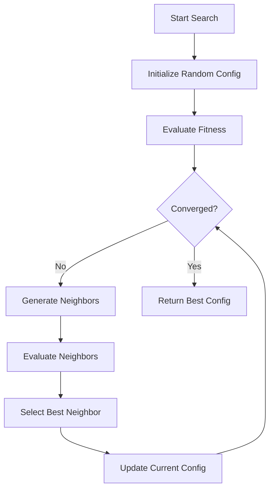
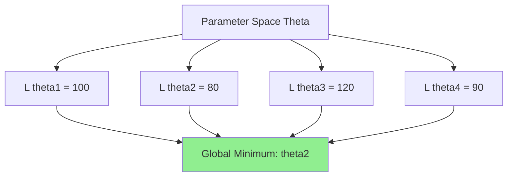
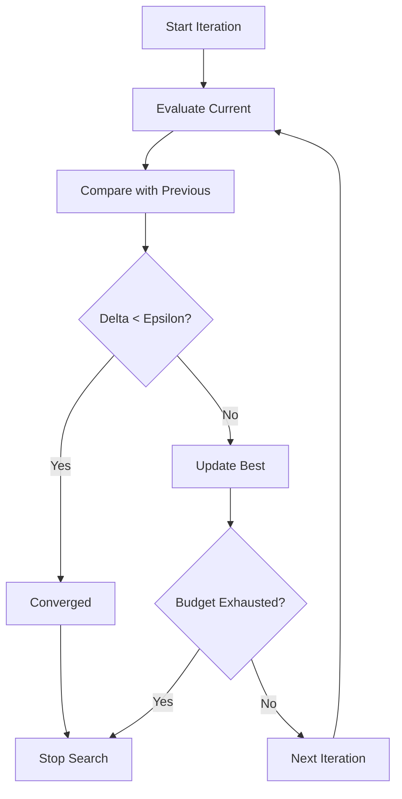

# Optimization Manifold Specification

- -
- `File:* `optimization\optimization_manifold_spec.md`
- `Version:* 1.0.0
- `Context:* Layer 2 (Compiler Backend) - OSE
- `Formalism:* Discrete Optimization, Fitness Landscapes
- `Status:* Active
- Last Modified:* 2026-01-01
- `Author:* Kilo Code
- `Reviewers:* Pending

- -

## 1. Introduction

### 1.1 Purpose

This specification formalizes the **Optimization Search Engine (OSE)** using **Fitness Landscapes**, providing mathematical foundation for automated compiler optimization. This formalization enables the compiler to reason about performance trade-offs and search for optimal configurations.

### 1.2 Scope

This specification covers:
- The Parameter Space ($\Theta$) for optimization variables
- The Objective Function ($\mathcal{L}$) for measuring fitness
- The Search Problem formulation
- Non-Convexity analysis of the fitness landscape
- Convergence criteria for the search algorithm

This specification does not cover:
- Concrete implementation of search algorithms
- Hardware performance counter integration
- Dynamic profiling infrastructure

### 1.3 Definitions, Acronyms, and Abbreviations

| Term | Definition |
|-------|------------|
| **OSE** | Optimization Search Engine - compiler component that searches for optimal configurations |
| **Fitness Landscape** | A mapping from parameter space to objective function values |
| **Parameter Space** | The set of all possible configurations for a program |
| **Objective Function** | A function that measures the quality of a configuration |
| **Non-Convex** | A function where the global minimum cannot be found via gradient descent |
| **0-order Optimization** | Optimization methods that use only function evaluations, not derivatives |
| **Hill Climbing** | A local search algorithm that moves to better neighbors |
| **Simulated Annealing** | A probabilistic search algorithm that accepts worse moves with decreasing probability |
| **Bayesian Optimization** | A probabilistic model-based optimization method |

### 1.4 References

- Nocedal, J., & Wright, S. J. (2006). "Numerical Optimization"
- Bergstra, J. A., et al. (2008). "A New Class of Incremental Learning Methods"
- IEEE 754: Floating-point arithmetic
- ISO/IEC 29148: Systems and software engineering — Requirements engineering

- -

## 2. Formal Definitions

### 2.1 The Parameter Space ($\Theta$)

Let a Morph program $P$ containing $n$ instances of the `??` operator be defined as a **Parameterized Function**:

$$ P: \Theta \to \text{MachineCode} $$

where $\Theta = D_1 \times D_2 \times \dots \times D_n$ is the Cartesian product of the domains of each hole.

#### 2.1.1 Domain Definitions

- **Unbounded Hole:* $D_i = \mathbb{Z}$ (Integers)
- **Bounded Hole:* For `@unroll(??)`, $D_i = \{1, \dots, \text{LoopLength}\}$
- **Enum Hole:* $D_i = \{ \text{StrategyA}, \text{StrategyB}, \dots \}$

- OPTMAN-INV-001:* THE system SHALL define parameter domains for all optimization holes.

### 2.2 The Objective Function ($\mathcal{L}$)

The "Fitness" of a specific configuration $\theta \in \Theta$ is defined by a Loss Function $\mathcal{L}(\theta)$.

$$ \mathcal{L}(\theta) = \alpha \cdot \text{Cycles}(P(\theta)) + \beta \cdot \text{Size}(P(\theta)) + \gamma \cdot \text{Energy}(P(\theta)) $$

#### 2.2.1 Static Evaluation

$\text{Cycles}$ is approximated via basic block probability analysis (Markov Chains) over the Control Flow Graph (CFG).

- OPTMAN-INV-002:* THE system SHALL approximate cycles using CFG analysis for static evaluation.

#### 2.2.2 Dynamic Evaluation

$\text{Cycles}$ is measured via hardware performance counters (`rdtsc`).

- OPTMAN-INV-003:* THE system SHALL measure cycles using hardware performance counters for dynamic evaluation.

### 2.3 The Search Problem

The OSE solves the minimization problem:

$$ \theta^* = \arg\min_{\theta \in \Theta} \mathcal{L}(\theta) $$

#### 2.3.1 Non-Convexity

The landscape $\mathcal{L}$ is **Non-Convex** and **Discontinuous**.

- `Example:* Changing a buffer size from 4096 to 4097 might cause a cache misalignment, spiking the cost 10x.

- `Implication:* Gradient Descent cannot be used. We must use **0-order optimization methods** (Hill Climbing, Simulated Annealing, or Bayesian Optimization).

- OPTMAN-THM-001:* THE system SHALL use 0-order optimization methods due to non-convexity.

- `Priority:* Critical
- Verification Method:* Analysis
- `Rationale:* Gradient-based methods fail on non-convex landscapes
- `Dependencies:* OPTMAN-INV-001
- `Traceability:* Section 2.3 (The Search Problem)

#### 2.3.2 Convergence Criteria

The search terminates when:

$$ | \mathcal{L}(\theta_{t}) - \mathcal{L}(\theta_{t-1}) | < \epsilon $$

Or when the Cost Budget $B_{time}$ is exhausted.

- OPTMAN-INV-004:* THE system SHALL terminate when improvement is below threshold $\epsilon$.

- OPTMAN-INV-005:* THE system SHALL terminate when time budget $B_{time}$ is exhausted.

- -

## 3. Requirements

### 3.1 Functional Requirements

- OPT-REQ-001:* THE system SHALL search the parameter space for optimal configuration.

- `Priority:* Critical
- Verification Method:* Test
- `Rationale:* Finds best-performing code generation
- `Dependencies:* None
- `Traceability:* Section 2.3 (The Search Problem)

- OPT-REQ-002:* THE system SHALL evaluate fitness using the objective function $\mathcal{L}$.

- `Priority:* Critical
- Verification Method:* Test
- `Rationale:* Provides quantitative measure of configuration quality
- `Dependencies:* OPTMAN-INV-002, OPTMAN-INV-003
- `Traceability:* Section 2.2 (The Objective Function)

- OPTMAN-REQ-003:* THE system SHALL handle non-convex fitness landscapes.

- `Priority:* Critical
- Verification Method:* Test
- `Rationale:* Real-world optimization problems are rarely convex
- `Dependencies:* OPTMAN-THM-001
- `Traceability:* Section 2.3.1 (Non-Convexity)

- OPTMAN-REQ-004:* THE system SHALL use 0-order optimization methods.

- `Priority:* High
- Verification Method:* Test
- `Rationale:* Gradient methods fail on non-convex landscapes
- `Dependencies:* OPTMAN-THM-001
- `Traceability:* Section 2.3.1 (Non-Convexity)

- OPTMAN-REQ-005:* THE system SHALL terminate when convergence criteria are met.

- `Priority:* High
- Verification Method:* Test
- `Rationale:* Prevents infinite search loops
- `Dependencies:* OPTMAN-INV-004, OPTMAN-INV-005
- `Traceability:* Section 2.3.2 (Convergence Criteria)

- OPTMAN-REQ-006:* THE system SHALL support both static and dynamic evaluation.

- `Priority:* High
- Verification Method:* Test
- `Rationale:* Enables trade-off between compilation speed and optimization quality
- `Dependencies:* OPTMAN-INV-002, OPTMAN-INV-003
- `Traceability:* Section 2.2 (The Objective Function)

### 3.2 Non-Functional Requirements

- OPTMAN-NFR-001:* THE system SHALL complete search within reasonable time budget.

- `Priority:* High
- Verification Method:* Demonstration
- `Metric:* Search completes within $B_{time}$ (e.g., 10 seconds)
- `Rationale:* Ensures compilation completes in acceptable time

- OPTMAN-NFR-002:* THE system SHALL support parameter spaces with up to 100 dimensions.

- `Priority:* Medium
- Verification Method:* Demonstration
- `Metric:* 100 dimensions with < 1GB memory
- `Rationale:* Supports complex optimization problems

- OPTMAN-NFR-003:* THE system SHALL provide progress feedback during search.

- `Priority:* Medium
- Verification Method:* Demonstration
- `Metric:* Progress updates every 100 evaluations
- `Rationale:* Improves user experience

- -

## 4. Design

### 4.1 Architecture Overview

The OSE is implemented as a search engine that:
1. Explores the parameter space $\Theta$
2. Evaluates configurations using the objective function $\mathcal{L}$
3. Tracks the best configuration found
4. Terminates when convergence criteria are met

### 4.2 Data Structures

#### 4.2.1 Configuration

- `Configuration:* $\theta = (d_1, d_2, \dots, d_n)$

- `Components:*
- $d_i \in D_i$: Value for parameter $i$

- `Invariants:*
1. $\forall i, d_i \in D_i$ (Valid domain)
2. Configuration is complete (all parameters assigned)

#### 4.2.2 Search State

- Search State:* $S = (\theta_{current}, \theta_{best}, \mathcal{L}_{best}, t)$

- `Components:*
- $\theta_{current}$: Current configuration being evaluated
- $\theta_{best}$: Best configuration found so far
- $\mathcal{L}_{best}$: Fitness of best configuration
- $t$: Number of evaluations performed

- `Invariants:*
1. $\mathcal{L}_{best} = \min(\mathcal{L}(\theta_1), \dots, \mathcal{L}(\theta_t))$
2. $t$ increases monotonically

### 4.3 Algorithms

#### 4.3.1 Hill Climbing Algorithm

- Algorithm Name:* Hill Climbing Search

- `Input:* Parameter space $\Theta$, Objective function $\mathcal{L}$

- `Output:* Best configuration $\theta^*$

- Mathematical Definition:*
$$
\theta_{t+1} = \begin{cases}
\theta' & \text{if } \mathcal{L}(\theta') < \mathcal{L}(\theta_t) \\
\theta_t & \text{otherwise}
\end{cases}
$$

where $\theta'$ is a neighbor of $\theta_t$.

- `Pseudocode:*
```
function hill_climbing(Theta, L):
    theta = random_initial(Theta)
    best_L = L(theta)
    while not converged():
        neighbors = generate_neighbors(theta)
        theta_prime = argmin(L(neighbor) for neighbor in neighbors)
        if L(theta_prime) < best_L:
            theta = theta_prime
            best_L = L(theta_prime)
    return theta
```

- `Complexity:*
- Time: $O(k \cdot n)$ where $k$ is iterations, $n$ is evaluations
- Space: $O(1)$

- `Correctness:*
- **Invariant:* Always moves to better or equal configuration
- **Termination:* Terminates when no better neighbor exists

#### 4.3.2 Simulated Annealing Algorithm

- Algorithm Name:* Simulated Annealing

- `Input:* Parameter space $\Theta$, Objective function $\mathcal{L}$

- `Output:* Best configuration $\theta^*$

- Mathematical Definition:*
$$
P(\text{accept}) = \begin{cases}
1 & \text{if } \Delta \mathcal{L} < 0 \\
\exp(-\Delta \mathcal{L} / T) & \text{otherwise}
\end{cases}
$$

where $\Delta \mathcal{L} = \mathcal{L}(\theta') - \mathcal{L}(\theta)$ and $T$ is temperature.

- `Pseudocode:*
```
function simulated_annealing(Theta, L):
    theta = random_initial(Theta)
    T = initial_temperature()
    while T > min_temperature():
        theta_prime = random_neighbor(theta)
        delta_L = L(theta_prime) - L(theta)
        if delta_L < 0 or random() < exp(-delta_L / T):
            theta = theta_prime
        T = cool_down(T)
    return theta
```

- `Complexity:*
- Time: $O(k \cdot n)$ where $k$ is iterations, $n$ is evaluations
- Space: $O(1)$

- `Correctness:*
- **Invariant:* Probability of accepting worse moves decreases with temperature
- **Termination:* Terminates when temperature reaches minimum

### 4.4 Mermaid Diagrams

#### 4.4.1 Search Algorithm Flow



#### 4.4.2 Fitness Landscape Visualization



#### 4.4.3 Convergence Detection



- -

## 5. Correctness Properties

### 5.1 Theorems

#### 5.1.1 Convergence Theorem

- `Theorem:* If the search terminates due to convergence, the returned configuration is a local minimum.

- Proof Sketch:*
1. By definition of convergence, no neighbor has better fitness
2. Therefore, current configuration is locally optimal
3. Therefore, returned configuration is a local minimum

- OPTMAN-THM-002:* THE system SHALL guarantee that converged result is a local minimum.

- `Priority:* High
- Verification Method:* Analysis
- `Rationale:* Ensures search quality
- `Dependencies:* OPTMAN-INV-004
- `Traceability:* Section 2.3.2 (Convergence Criteria)

#### 5.1.2 Budget Theorem

- `Theorem:* If the search terminates due to budget exhaustion, the returned configuration is the best found within the budget.

- Proof Sketch:*
1. By definition, $\theta_{best}$ is the minimum of all evaluated configurations
2. Therefore, returned configuration is the best found
3. Therefore, result is optimal within budget constraints

- OPTMAN-THM-003:* THE system SHALL guarantee that budget-limited result is best found.

- `Priority:* High
- Verification Method:* Analysis
- `Rationale:* Ensures best effort within constraints
- `Dependencies:* OPTMAN-INV-005
- `Traceability:* Section 2.3.2 (Convergence Criteria)

### 5.2 Invariants

#### 5.2.1 Search Invariants

- **OPTMAN-INV-006:* THE system SHALL maintain that best configuration is always the minimum evaluated
- **OPTMAN-INV-007:* THE system SHALL maintain that search progress is monotonic (non-decreasing fitness)
- **OPTMAN-INV-008:* THE system SHALL maintain that all evaluated configurations are valid

#### 5.2.2 Evaluation Invariants

- **OPTMAN-INV-009:* THE system SHALL maintain that objective function is deterministic
- **OPTMAN-INV-010:* THE system SHALL maintain that static and dynamic evaluations are consistent

- -

## 6. Examples

### 6.1 Simple Optimization

```morph
fn compute(data: [f64]) -> f64 {
    let result: f64 = 0.0;
    for i in 0..data.len() {
        result = result + data[i] * ??;  // ?? is optimization hole
    }
    ret result;
}
```

- Parameter Space:*
- $\Theta = \{1, 2, 4, 8\}$ (unroll factors)
- $\mathcal{L}(\theta) = \text{Cycles}(P(\theta))$

- `Search:*
1. Evaluate $\mathcal{L}(1)$, $\mathcal{L}(2)$, $\mathcal{L}(4)$, $\mathcal{L}(8)$
2. Select $\theta^* = \arg\min \mathcal{L}(\theta)$
3. Generate code with optimal unroll factor

### 6.2 Multi-Parameter Optimization

```morph
fn matrix_multiply(A: [f64], B: [f64]) -> [f64] {
    let result: [f64] = ??;  // Block size
    let unroll: i32 = ??;  // Unroll factor
    // ... implementation
    ret result;
}
```

- Parameter Space:*
- $\Theta = \{16, 32, 64, 128\} \times \{1, 2, 4, 8\}$
- $\mathcal{L}(\theta) = \alpha \cdot \text{Cycles} + \beta \cdot \text{Size}$

- `Search:*
1. Search 2D parameter space
2. Find optimal trade-off between cycles and code size

### 6.3 Non-Convex Landscape

```morph
fn buffer_copy(src: &u8, dst: &u8, size: usize) {
    let block_size: usize = ??;  // Optimization hole
    // ... implementation
}
```

- Fitness Landscape:*
- $\mathcal{L}(4096) = 100$ cycles
- $\mathcal{L}(4097) = 1000$ cycles (cache misalignment!)
- $\mathcal{L}(4098) = 105$ cycles

- Search Challenge:*
- Gradient descent would get stuck at local minimum (4096)
- 0-order methods can find global minimum (4098)

### 6.4 Convergence Example

- Search Progress:*
- Iteration 1: $\mathcal{L} = 1000$
- Iteration 2: $\mathcal{L} = 800$
- Iteration 3: $\mathcal{L} = 750$
- Iteration 4: $\mathcal{L} = 748$
- Iteration 5: $\mathcal{L} = 748$ (converged, $\Delta = 0 < \epsilon$)

- `Result:* $\theta^*$ from iteration 4 or 5

### 6.5 Edge Cases

#### 6.5.1 Single Parameter

```morph
fn simple() -> f64 {
    ret 42.0 * ??;  // Only one optimization hole
}
```

- Parameter Space:*
- $\Theta = \{1, 2, 4, 8, 16\}$

- `Search:* Linear search through 5 values

#### 6.5.2 Enum Parameter

```morph
fn strategy(data: [f64]) -> f64 {
    let strat: Strategy = ??;  // Enum hole
    match strat {
        Strategy::Fast => fast_algorithm(data);
        Strategy::Accurate => accurate_algorithm(data);
    }
}
```

- Parameter Space:*
- $\Theta = \{\text{Fast}, \text{Accurate}, \text{Balanced}\}$

- `Search:* Evaluate all 3 strategies, select best

- -

## Change Log

| Version | Date       | Author      | Changes                                                                 |
|---------|------------|-------------|-------------------------------------------------------------------------|
| 1.0.0   | 2026-01-01 | Kilo Code    | Initial version                                                        |
