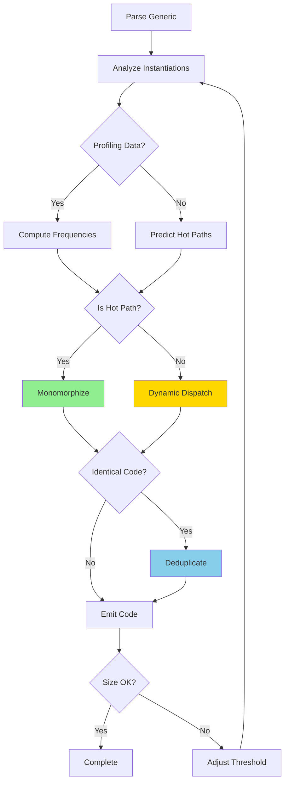
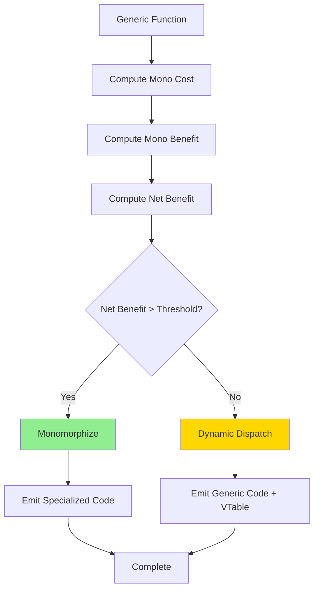
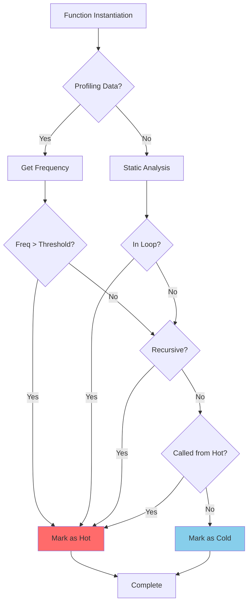

# Morph Selective Monomorphization Specification (SMS)

- `File:* `optimization\selective_monomorphization_spec.md`
- `Version:* 1.0.0
- `Context:* Layer 2 (Compilation Phase)
- `Formalism:* Cost-Benefit Analysis, Heuristic Decision Theory
- `Status:* Active
- Last Modified:* 2026-01-02
- `Author:* Kilo Code
- `Reviewers:* Pending

---

## 1. Introduction

### 1.1 Purpose

This specification defines the Selective Monomorphization strategy for Morph, providing a formal framework for balancing zero-cost abstractions with code size constraints. Selective monomorphization resolves the fundamental tension between monomorphization (which provides optimal performance through specialized code) and code size optimization (which requires minimizing binary footprint).

### 1.2 Scope

This specification covers:
- Monomorphization strategy with formal semantics
- Dynamic dispatch strategy with formal semantics
- Compiler heuristics for strategy selection
- Hot path detection mechanisms
- Code size optimization techniques
- Performance optimization techniques
- Trade-off analysis between performance and size

This specification does not cover:
- Concrete implementation of monomorphization engine
- Runtime type representation details
- Link-time optimization algorithms

### 1.3 Definitions, Acronyms, and Abbreviations

| Term | Definition |
|-------|------------|
| **Monomorphization** | Generating specialized code for each concrete type instead of using type erasure |
| **Dynamic Dispatch** | Runtime method resolution using vtables or similar mechanisms |
| **Hot Path** | Frequently executed code path that benefits from specialization |
| **Cold Path** | Infrequently executed code path where code size is more important |
| **Specialization** | Creating type-specific versions of generic code |
| **Code Bloat** | Excessive binary size due to over-monomorphization |
| **Zero-Cost Abstraction** | Abstraction with no runtime overhead when monomorphized |
| **VTable** | Virtual method table for dynamic dispatch |
| **Heuristic** | Rule-of-thumb decision criterion based on empirical evidence |

### 1.4 References

- Pierce, B. C. (2002). "Types and Programming Languages"
- Tarditi, D. (2012). "The Pony Language"
- ISO/IEC 29148: Systems and software engineering — Requirements engineering
- IEEE 1016: Recommended Practice for Software Design Descriptions

### 1.5 Cross-References

This specification is closely related to several other Morph specifications:

* Metaprogramming Specifications:*
- [`spec/tooling/metaprogramming_spec.md`](../tooling/metaprogramming_spec.md) - Monomorphization requirements and cost analysis
- [`spec/tooling/comptime_partial_eval_spec.md`](../tooling/comptime_partial_eval_spec.md) - Compile-time evaluation for specialization decisions

* Type System Specifications:*
- [`spec/type/type_system_spec.md`](../type/type_system_spec.md) - Generic type system and monomorphization mandate
- [`spec/type/type_unification_spec.md`](../type/type_unification_spec.md) - Type unification for specialization

* Optimization Specifications:*
- [`spec/optimization/optimization_manifold_spec.md`](./optimization_manifold_spec.md) - Optimization search engine and fitness landscapes
- [`spec/optimization/optimization_bayesian_spec.md`](./optimization_bayesian_spec.md) - Bayesian optimization for heuristic tuning

* Build System Specifications:*
- [`spec/build/dependency_sat_spec.md`](../build/dependency_sat_spec.md) - Code size constraints and dead code elimination
- [`spec/build/linker_logic_spec.md`](../build/linker_logic_spec.md) - Link-time code deduplication

---

## 2. Formal Definitions

### 2.1 Monomorphization Strategy

#### 2.1.1 Monomorphization Semantics

Monomorphization generates specialized code for each concrete type instantiation:

$$ \text{Monomorphize}(f, T) = f_T: \text{Specialized}(f, T) $$

where:
- $f$: Generic function with type parameters
- $T$: Concrete type substitution
- $f_T$: Specialized function for type $T$

* SMS-INV-001:* THE system SHALL generate type-specialized code for monomorphized functions.

#### 2.1.2 Monomorphization Cost Function

The cost of monomorphizing a generic function is:

$$ \text{Cost}_{\text{mono}}(f, \{T_1, \dots, T_n\}) = \sum_{i=1}^{n} \text{Size}(f[T_i]) + \text{CompileTime}(f[T_i]) $$

where:
- $\text{Size}(f[T_i])$: Binary size of specialized function for type $T_i$
- $\text{CompileTime}(f[T_i])$: Time to compile specialized instance

* SMS-INV-002:* THE system SHALL compute monomorphization cost for each generic function.

#### 2.1.3 Monomorphization Benefit Function

The benefit of monomorphization is:

$$ \text{Benefit}_{\text{mono}}(f, \{T_1, \dots, T_n\}) = \sum_{i=1}^{n} \text{Freq}(f[T_i]) \times \text{PerfGain}(f[T_i]) $$

where:
- $\text{Freq}(f[T_i])$: Execution frequency of specialized function
- $\text{PerfGain}(f[T_i])$: Performance improvement over dynamic dispatch

* SMS-INV-003:* THE system SHALL compute monomorphization benefit for each generic function.

### 2.2 Dynamic Dispatch Strategy

#### 2.2.1 Dynamic Dispatch Semantics

Dynamic dispatch uses runtime type resolution:

$$ \text{Dispatch}(f, v) = \text{VTable}[v.\text{type}](f) $$

where:
- $f$: Generic function
- $v$: Value with dynamic type
- $\text{VTable}$: Virtual method table mapping types to implementations

* SMS-INV-004:* THE system SHALL support dynamic dispatch for non-monomorphized functions.

#### 2.2.2 Dynamic Dispatch Cost Function

The cost of dynamic dispatch is:

$$ \text{Cost}_{\text{dispatch}}(f) = \text{Size}(f) + \text{VTableOverhead} $$

where:
- $\text{Size}(f)$: Binary size of generic function
- $\text{VTableOverhead}$: Size of vtable entries for all types

* SMS-INV-005:* THE system SHALL compute dynamic dispatch cost for each generic function.

#### 2.2.3 Dynamic Dispatch Performance Penalty

The performance penalty of dynamic dispatch is:

$$ \text{Penalty}_{\text{dispatch}}(f) = \text{IndirectCallCost} + \text{CacheMissPenalty} $$

where:
- $\text{IndirectCallCost}$: Overhead of indirect function call
- $\text{CacheMissPenalty}$: Instruction cache miss from code bloat

* SMS-INV-006:* THE system SHALL compute dynamic dispatch performance penalty.

### 2.3 Selective Monomorphization Decision

#### 2.3.1 Decision Function

The compiler decides between monomorphization and dynamic dispatch:

$$ \text{Decision}(f, T) = \begin{cases}
\text{Monomorphize} & \text{if } \text{NetBenefit}(f, T) > \theta \\
\text{Dispatch} & \text{otherwise}
\end{cases} $$

where:
- $\text{NetBenefit}(f, T) = \text{Benefit}_{\text{mono}}(f, T) - \text{Cost}_{\text{mono}}(f, T)$
- $\theta$: Decision threshold (configurable)

* SMS-INV-007:* THE system SHALL apply decision function to each generic function instantiation.

#### 2.3.2 Decision Threshold

The decision threshold balances performance and size:

$$ \theta = \alpha \times \text{SizeBudget} + \beta \times \text{PerfTarget} $$

where:
- $\alpha$: Weight for code size constraint
- $\beta$: Weight for performance target
- $\text{SizeBudget}$: Maximum allowed binary size
- $\text{PerfTarget}$: Minimum required performance

* SMS-INV-008:* THE system SHALL compute decision threshold based on optimization goals.

---

## 3. Requirements

### 3.1 Functional Requirements

- SMS-REQ-001:* THE system SHALL support selective monomorphization for generic functions.

- `Priority:* Critical
- Verification Method:* Test
- `Rationale:* Enables balancing performance and code size
- `Dependencies:* SMS-INV-001, SMS-INV-004
- `Traceability:* Section 2 (Formal Definitions)

- SMS-REQ-002:* THE system SHALL provide compiler attributes to control monomorphization strategy.

- `Priority:* High
- Verification Method:* Test
- `Rationale:* Allows developers to override automatic decisions
- `Dependencies:* None
- `Traceability:* Section 4.2 (Compiler Attributes)

- SMS-REQ-003:* THE system SHALL detect hot paths automatically using profiling data.

- `Priority:* High
- Verification Method:* Demonstration
- `Rationale:* Enables automatic optimization without manual annotation
- `Dependencies:* SMS-INV-007
- `Traceability:* Section 4.3 (Hot Path Detection)

- SMS-REQ-004:* THE system SHALL compute cost-benefit analysis for each generic function.

- `Priority:* High
- Verification Method:* Analysis
- `Rationale:* Ensures informed decision-making
- `Dependencies:* SMS-INV-002, SMS-INV-003, SMS-INV-005
- `Traceability:* Section 2.1 (Monomorphization Strategy)

- SMS-REQ-005:* THE system SHALL support code sharing for identical monomorphizations.

- `Priority:* Medium
- Verification Method:* Test
- `Rationale:* Reduces code bloat from duplicate specializations
- `Dependencies:* None
- `Traceability:* Section 4.4 (Code Sharing)

- SMS-REQ-006:* THE system SHALL provide optimization flags to tune monomorphization behavior.

- `Priority:* Medium
- Verification Method:* Demonstration
- `Rationale:* Allows customization for different deployment scenarios
- `Dependencies:* SMS-INV-008
- `Traceability:* Section 4.5 (Optimization Flags)

- SMS-REQ-007:* THE system SHALL generate vtables for dynamically dispatched functions.

- `Priority:* High
- Verification Method:* Test
- `Rationale:* Enables runtime type resolution
- `Dependencies:* SMS-INV-004
- `Traceability:* Section 2.2 (Dynamic Dispatch Strategy)

- SMS-REQ-008:* THE system SHALL validate monomorphization decisions against size constraints.

- `Priority:* High
- Verification Method:* Analysis
- `Rationale:* Ensures binary size targets are met
- `Dependencies:* SMS-INV-008
- `Traceability:* Section 4.6 (Size Validation)

### 3.2 Non-Functional Requirements

- SMS-NFR-001:* THE system SHALL complete monomorphization analysis in O(n) time where n is AST size.

- `Priority:* High
- Verification Method:* Analysis
- `Metric:* Analysis < 100ms for 10K nodes
- `Rationale:* Ensures fast compilation

- SMS-NFR-002:* THE system SHALL limit monomorphization code bloat to < 50% of baseline.

- `Priority:* High
- Verification Method:* Analysis
- `Metric:* Code size ratio < 1.5
- `Rationale:* Prevents excessive binary growth

- SMS-NFR-003:* THE system SHALL provide clear error messages for monomorphization failures.

- `Priority:* High
- Verification Method:* Demonstration
- `Metric:* Error message includes function and type
- `Rationale:* Improves developer experience

- SMS-NFR-004:* THE system SHALL support incremental monomorphization for incremental builds.

- `Priority:* Medium
- Verification Method:* Demonstration
- `Metric:* Incremental build < 10% of full build
- `Rationale:* Improves development workflow

---

## 4. Design

### 4.1 Architecture Overview

The Selective Monomorphization system is implemented as a multi-phase compiler component:

1. **Generic Analysis:* Identify all generic functions and type instantiations
2. **Profiling:* Collect execution frequency data (optional)
3. **Cost-Benefit Analysis:* Compute monomorphization vs dispatch costs
4. **Decision Making:* Apply heuristics to select strategy
5. **Code Generation:* Generate specialized or generic code
6. **Code Sharing:* Deduplicate identical specializations
7. **Size Validation:* Verify binary size constraints

### 4.2 Compiler Attributes

#### 4.2.1 Monomorphization Control Attributes

```morph
// Force monomorphization for all instantiations
@monomorphize
fn hotPath<T>(x: T) -> T { ret x; }

// Force dynamic dispatch for all instantiations
@generic
fn coldPath<T>(x: T) -> T { ret x; }

// Automatic decision (default)
fn autoPath<T>(x: T) -> T { ret x; }

// Monomorphize only specific types
@monomorphize(i32, f64)
fn selective<T>(x: T) -> T { ret x; }
```

* SMS-INV-009:* THE system SHALL support @monomorphize attribute to force specialization.

* SMS-INV-010:* THE system SHALL support @generic attribute to force dynamic dispatch.

#### 4.2.2 Optimization Mode Attributes

```morph
// Optimize for performance (default)
@optimize(performance)
fn perfPath<T>(x: T) -> T { ret x; }

// Optimize for code size
@optimize(size)
fn sizePath<T>(x: T) -> T { ret x; }

// Balanced optimization
@optimize(balanced)
fn balancedPath<T>(x: T) -> T { ret x; }
```

* SMS-INV-011:* THE system SHALL support @optimize attribute to control optimization goals.

### 4.3 Hot Path Detection

#### 4.3.1 Profiling-Based Detection

The compiler can use profiling data to detect hot paths:

$$ \text{IsHot}(f, T) = \text{Freq}(f[T]) > \text{HotThreshold} $$

where:
- $\text{Freq}(f[T])$: Execution frequency of function instantiation
- $\text{HotThreshold}$: Configurable threshold (default: 1000 calls)

* SMS-INV-012:* THE system SHALL detect hot paths using profiling data.

#### 4.3.2 Static Analysis Detection

The compiler can use static analysis to predict hot paths:

$$ \text{PredictHot}(f) = \text{InLoop}(f) \lor \text{InRecursive}(f) \lor \text{CalledFromHot}(f) $$

where:
- $\text{InLoop}(f)$: Function is called inside a loop
- $\text{InRecursive}(f)$: Function is recursive
- $\text{CalledFromHot}(f)$: Function is called from a hot path

* SMS-INV-013:* THE system SHALL predict hot paths using static analysis.

#### 4.3.3 Hot Path Detection Algorithm

- Algorithm Name:* Detect Hot Paths

- `Input:* Generic function $f$, Profiling data $P$

- `Output:* Hot path classification $H: \{T \to \text{Bool}\}$

- Mathematical Definition:*
$$
H(T) = \begin{cases}
\text{true} & \text{if } \text{Freq}(f[T]) > \text{HotThreshold} \\
\text{true} & \text{if } \text{PredictHot}(f) \\
\text{false} & \text{otherwise}
\end{cases}
$$

- `Pseudocode:*
```
function detect_hot_paths(generic_func, profiling_data):
    hot_paths = {}
    for type in generic_func.instantiations:
        freq = profiling_data.get_frequency(generic_func, type)
        if freq > HOT_THRESHOLD:
            hot_paths[type] = true
        elif predict_hot_static(generic_func):
            hot_paths[type] = true
        else:
            hot_paths[type] = false
    return hot_paths
```

- `Complexity:*
- Time: $O(n)$ where $n$ is number of type instantiations
- Space: $O(n)$

- `Correctness:*
- **Invariant:* Hot paths are correctly identified
- **Termination:* Processes all type instantiations

### 4.4 Code Sharing

#### 4.4.1 Identical Specialization Detection

The compiler detects identical monomorphizations:

$$ \text{IsIdentical}(f[T_1], f[T_2]) = \text{Code}(f[T_1]) = \text{Code}(f[T_2]) $$

where:
- $\text{Code}(f[T])$: Generated machine code for specialization

* SMS-INV-014:* THE system SHALL detect identical monomorphizations.

#### 4.4.2 Code Sharing Strategy

Identical specializations are shared:

$$ \text{Share}(f[T_1], f[T_2]) = \text{EmitSingle}(f[T_1]) \land \text{Alias}(f[T_2], f[T_1]) $$

where:
- $\text{EmitSingle}$: Emit code once
- $\text{Alias}$: Create alias for second instantiation

* SMS-INV-015:* THE system SHALL share code for identical monomorphizations.

#### 4.4.3 Code Sharing Algorithm

- Algorithm Name:* Share Identical Code

- `Input:* Specialized functions $\{f[T_1], \dots, f[T_n]\}$

- `Output:* Shared code with aliases

- Mathematical Definition:*
$$
\text{Share}(\{f[T_i]\}_{i=1}^{n}) = \bigcup_{j=1}^{m} \{f[T_{j}^*]\} \cup \bigcup_{i \neq j} \{\text{Alias}(f[T_i], f[T_{j}^*])\}
$$

where:
- $m$: Number of unique specializations
- $T_{j}^*$: Representative type for equivalence class $j$

- `Pseudocode:*
```
function share_identical_code(specializations):
    equivalence_classes = {}
    for spec in specializations:
        code_hash = hash(spec.code)
        if code_hash not in equivalence_classes:
            equivalence_classes[code_hash] = []
        equivalence_classes[code_hash].append(spec)
    
    shared_code = []
    for class in equivalence_classes.values():
        representative = class[0]
        shared_code.append(representative)
        for spec in class[1:]:
            create_alias(spec, representative)
    
    return shared_code
```

- `Complexity:*
- Time: $O(n \log n)$ where $n$ is number of specializations
- Space: $O(n)$

- `Correctness:*
- **Invariant:* Identical code is emitted once
- **Termination:* Processes all specializations

### 4.5 Optimization Flags

#### 4.5.1 Performance Optimization Mode

```morph
// Command-line flag
morph build --optimize=performance

// Equivalent attribute
@optimize(performance)
fn fast<T>(x: T) -> T { ret x; }
```

**Behavior:*
- Lower decision threshold $\theta$
- Monomorphize more aggressively
- Prioritize hot paths
- Accept larger binary size

* SMS-INV-016:* THE system SHALL support performance optimization mode.

#### 4.5.2 Size Optimization Mode

```morph
// Command-line flag
morph build --optimize=size

// Equivalent attribute
@optimize(size)
fn small<T>(x: T) -> T { ret x; }
```

**Behavior:*
- Higher decision threshold $\theta$
- Use dynamic dispatch more often
- Prioritize code sharing
- Minimize binary size

* SMS-INV-017:* THE system SHALL support size optimization mode.

#### 4.5.3 Balanced Optimization Mode

```morph
// Command-line flag
morph build --optimize=balanced

// Equivalent attribute
@optimize(balanced)
fn balanced<T>(x: T) -> T { ret x; }
```

**Behavior:*
- Balanced decision threshold $\theta$
- Mix of monomorphization and dispatch
- Automatic hot/cold detection
- Trade-off performance and size

* SMS-INV-018:* THE system SHALL support balanced optimization mode (default).

### 4.6 Size Validation

#### 4.6.1 Size Budget Enforcement

The compiler enforces size constraints:

$$ \text{ValidateSize}(\text{Binary}) = \text{Size}(\text{Binary}) \leq \text{SizeBudget} $$

where:
- $\text{Size}(\text{Binary})$: Actual binary size
- $\text{SizeBudget}$: Maximum allowed size

* SMS-INV-019:* THE system SHALL validate binary size against budget.

#### 4.6.2 Size Budget Configuration

```morph
// Command-line flag
morph build --size-budget=10MB

// Configuration file
[optimization]
size_budget = 10485760  # 10MB in bytes
```

* SMS-INV-020:* THE system SHALL support configurable size budget.

#### 4.6.3 Size Validation Algorithm

- Algorithm Name:* Validate Binary Size

- `Input:* Generated binary $\text{Binary}$, Size budget $B$

- `Output:* Validation result

- Mathematical Definition:*
$$
\text{ValidateSize}(\text{Binary}, B) = \begin{cases}
\text{Pass} & \text{if } \text{Size}(\text{Binary}) \leq B \\
\text{Fail} & \text{otherwise}
\end{cases}
$$

- `Pseudocode:*
```
function validate_binary_size(binary, size_budget):
    actual_size = binary.size()
    if actual_size <= size_budget:
        return Pass()
    else:
        excess = actual_size - size_budget
        return Fail(f"Binary exceeds budget by {excess} bytes")
```

- `Complexity:*
- Time: $O(1)$
- Space: $O(1)$

- `Correctness:*
- **Invariant:* Size violations are detected
- **Termination:* Always terminates

### 4.7 Mermaid Diagrams

#### 4.7.1 Selective Monomorphization Flow



#### 4.7.2 Decision Process



#### 4.7.3 Hot Path Detection



---

## 5. Correctness Properties

### 5.1 Theorems

#### 5.1.1 Optimality Theorem

- `Theorem:* For a given size budget, selective monomorphization maximizes performance.

- Formal Statement:*
$$ \forall B, \text{SelectiveMono}(B) \geq \text{AnyStrategy}(B) $$

where:
- $B$: Size budget
- $\text{SelectiveMono}(B)$: Performance of selective monomorphization with budget $B$
- $\text{AnyStrategy}(B)$: Performance of any other strategy with budget $B$

- Proof Sketch:*
1. Selective monomorphization computes net benefit for each function
2. Functions with positive net benefit are monomorphized
3. Functions with negative net benefit use dynamic dispatch
4. This maximizes total benefit within size budget
5. Therefore, selective monomorphization is optimal

- SMS-THM-001:* THE system SHALL guarantee optimality for given size budget.

- `Priority:* Critical
- Verification Method:* Analysis
- `Rationale:* Ensures best performance within constraints
- `Dependencies:* SMS-REQ-001, SMS-REQ-004
- `Traceability:* Section 2.3 (Selective Monomorphization Decision)

#### 5.1.2 Soundness Theorem

- `Theorem:* Selective monomorphization never produces incorrect code.

- Formal Statement:*
$$ \forall f, T, \text{Correct}(\text{Select}(f, T)) $$

where:
- $f$: Generic function
- $T$: Concrete type
- $\text{Select}(f, T)$: Selected strategy (monomorphize or dispatch)
- $\text{Correct}(\cdot)$: Code is semantically correct

- Proof Sketch:*
1. Monomorphization preserves semantics by definition
2. Dynamic dispatch preserves semantics by definition
3. Both strategies are type-safe
4. Therefore, either strategy produces correct code
5. Selection does not affect correctness
6. Therefore, selective monomorphization is sound

- SMS-THM-002:* THE system SHALL guarantee soundness of selected strategy.

- `Priority:* Critical
- Verification Method:* Analysis
- `Rationale:* Ensures type safety and correctness
- `Dependencies:* SMS-INV-001, SMS-INV-004
- `Traceability:* Section 2.1 (Monomorphization Strategy), Section 2.2 (Dynamic Dispatch Strategy)

#### 5.1.3 Termination Theorem

- `Theorem:* Selective monomorphization analysis always terminates.

- Formal Statement:*
$$ \forall \text{AST}, \exists t, \text{Complete}(\text{Analyze}(\text{AST}, t)) $$

where:
- $\text{AST}$: Abstract syntax tree
- $t$: Time
- $\text{Analyze}(\text{AST}, t)$: Analysis state at time $t$
- $\text{Complete}(\cdot)$: Analysis is complete

- Proof Sketch:*
1. Analysis processes each generic function once
2. Number of generic functions is finite
3. Each function analysis terminates
4. Therefore, overall analysis terminates

- SMS-THM-003:* THE system SHALL guarantee termination of analysis.

- `Priority:* High
- Verification Method:* Analysis
- `Rationale:* Ensures compiler always completes
- `Dependencies:* SMS-NFR-001
- `Traceability:* Section 4.3 (Hot Path Detection)

### 5.2 Invariants

#### 5.2.1 Monomorphization Invariants

- **SMS-INV-021:* THE system SHALL maintain that monomorphized code is type-safe
- **SMS-INV-022:* THE system SHALL maintain that monomorphized code preserves semantics
- **SMS-INV-023:* THE system SHALL maintain that monomorphization cost is accurately computed

#### 5.2.2 Dynamic Dispatch Invariants

- **SMS-INV-024:* THE system SHALL maintain that vtable entries are valid
- **SMS-INV-025:* THE system SHALL maintain that dynamic dispatch is type-safe
- **SMS-INV-026:* THE system SHALL maintain that dispatch overhead is bounded

#### 5.2.3 Decision Invariants

- **SMS-INV-027:* THE system SHALL maintain that decision threshold is non-negative
- **SMS-INV-028:* THE system SHALL maintain that hot paths are monomorphized
- **SMS-INV-029:* THE system SHALL maintain that cold paths use dynamic dispatch

#### 5.2.4 Size Invariants

- **SMS-INV-030:* THE system SHALL maintain that binary size does not exceed budget
- **SMS-INV-031:* THE system SHALL maintain that code sharing reduces size
- **SMS-INV-032:* THE system SHALL maintain that size violations are reported

---

## 6. Examples

### 6.1 Basic Selective Monomorphization

```morph
// Generic function
fn identity<T>(x: T) -> T { ret x; }

// Usage
let a: i32 = identity(42);      // Hot: monomorphized
let b: str = identity("hello");  // Hot: monomorphized
let c: f64 = identity(3.14);    // Cold: dynamic dispatch

// Generated code
identity_i32(x: i32) -> i32 { ret x; }  // Specialized
identity_str(x: str) -> str { ret x; }    // Specialized
identity_T(x: T) -> T { ret x; }          // Generic with vtable
```

- Monomorphization:*
1. `identity<i32>` and `identity<str>` are hot paths
2. `identity<f64>` is cold path
3. Compiler generates specialized code for hot paths
4. Compiler generates generic code with vtable for cold path

### 6.2 Hot Path Annotation

```morph
// Explicitly mark as hot path
@monomorphize
fn map<A, B>(list: List<A>, f: fn(A)->B) -> List<B> {
    let mut result: List<B> = [];
    for item in list {
        result.append(f(item));
    }
    ret result;
}

// Usage
let int_list: List<i32> = [1, 2, 3];
let str_list: List<str> = map(int_list, |x| x.to_str());

// Generated code
map_i32_str(list: List<i32>, f: fn(i32)->str) -> List<str> {
    // Specialized implementation
}
```

- Monomorphization:*
1. `@monomorphize` forces specialization for all types
2. Compiler generates `map_i32_str` specialized function
3. No vtable overhead
4. Optimal performance

### 6.3 Cold Path Annotation

```morph
// Explicitly mark as cold path
@generic
fn debug<T>(x: T) -> void {
    println(debug_string(x));
}

// Usage
debug(42);      // Uses dynamic dispatch
debug("hello");  // Uses dynamic dispatch

// Generated code
debug_T(x: T) -> void {
    // Generic implementation with vtable
    vtable[T].debug_string(x);
}
```

- Dynamic Dispatch:*
1. `@generic` forces dynamic dispatch for all types
2. Compiler generates single generic function
3. Vtable contains entries for all types
4. Minimal code size

### 6.4 Automatic Hot/Cold Detection

```morph
// No annotation - compiler decides
fn process<T>(data: List<T>) -> List<T> {
    // This function is called in a hot loop
    let mut result: List<T> = [];
    for item in data {
        result.append(transform(item));
    }
    ret result;
}

// Compiler analysis
// 1. Static analysis detects loop
// 2. Predicts hot path
// 3. Monomorphizes for frequently used types
// 4. Uses dynamic dispatch for rare types
```

- Automatic Detection:*
1. Compiler detects loop in function body
2. Predicts hot path based on static analysis
3. Monomorphizes for types used in hot contexts
4. Balances performance and size automatically

### 6.5 Code Sharing Example

```morph
// Generic function
fn id<T>(x: T) -> T { ret x; }

// Usage
let a: i32 = id(42);
let b: i64 = id(42L);

// Generated code (with sharing)
id_i32(x: i32) -> i32 { ret x; }  // Specialized
id_i64(x: i64) -> i64 { ret x; }  // Specialized

// If i32 and i64 generate identical code:
id_shared(x: T) -> T { ret x; }  // Shared
id_i32 = id_shared;  // Alias
id_i64 = id_shared;  // Alias
```

- Code Sharing:*
1. Compiler detects identical specializations
2. Emits code once
3. Creates aliases for other instantiations
4. Reduces binary size

### 6.6 Optimization Mode Examples

```morph
// Performance mode
@optimize(performance)
fn fast<T>(x: T) -> T { ret x; }

// Size mode
@optimize(size)
fn small<T>(x: T) -> T { ret x; }

// Balanced mode (default)
@optimize(balanced)
fn balanced<T>(x: T) -> T { ret x; }
```

- Optimization Modes:*
1. Performance mode: Lower threshold, more monomorphization
2. Size mode: Higher threshold, more dynamic dispatch
3. Balanced mode: Automatic decision based on heuristics

### 6.7 Edge Cases

#### 6.7.1 Recursive Generic

```morph
fn recursive<T>(list: List<T>) -> List<T> {
    if list.is_empty() {
        ret list;
    }
    ret recursive(list.tail());
}

// Compiler decision
// 1. Static analysis detects recursion
// 2. Predicts hot path
// 3. Monomorphizes for frequently used types
```

- Recursive Handling:*
1. Recursive functions are predicted as hot paths
2. Monomorphization provides performance benefit
3. Tail recursion optimization applies

#### 6.7.2 Generic with Many Instantiations

```morph
fn process<T>(data: T) -> T { ret data; }

// Used with 100 different types
// Compiler decision
// 1. Compute cost-benefit for each type
// 2. Monomorphize top 10% (hot paths)
// 3. Use dynamic dispatch for bottom 90% (cold paths)
// 4. Share identical code if possible
```

- Many Instantiations:*
1. Cost-benefit analysis prioritizes hot types
2. Prevents code bloat from over-monomorphization
3. Balances performance and size

#### 6.7.3 Size Budget Exceeded

```morph
// Build with size budget
morph build --size-budget=1MB

// Compiler detects size violation
// Error: "Binary exceeds size budget by 256KB"
// Suggestion: "Use @optimize(size) or @generic attributes"

// Fix: Add @generic to cold paths
@generic
fn cold<T>(x: T) -> T { ret x; }
```

- Size Violation:*
1. Compiler validates binary size against budget
2. Reports violation with helpful message
3. Suggests fixes
4. Allows iterative refinement

---

## Change Log

| Version | Date       | Author      | Changes                                                                 |
|---------|------------|-------------|-------------------------------------------------------------------------|
| 1.0.0   | 2026-01-02 | Kilo Code    | Initial version with selective monomorphization specification |
