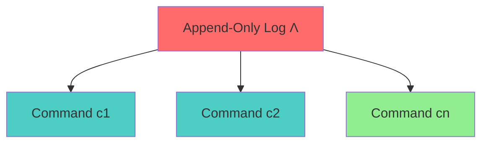
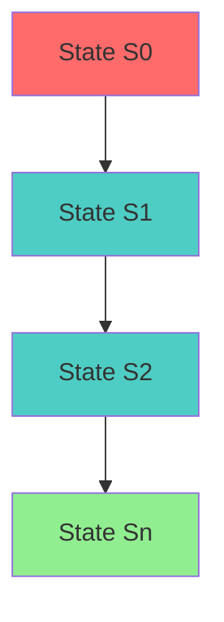
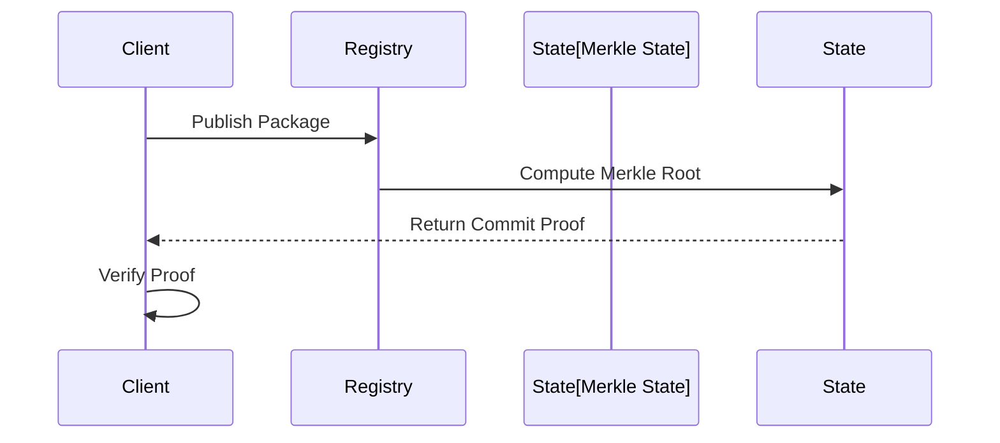

# State Machine Replication Specification (Consensus)

* File:* `registry_consensus_spec.md`
* Version:* 1.0.0
* Context:* Layer 1 (Infrastructure) - Global Registry
* Formalism:* Multi-Paxos / Raft
* Status:* Active
* Last Modified:* 2026-01-01
* Author:* Kilo Code
* Reviewers:* Pending

- -

## 1. Introduction

### 1.1 Purpose

This specification formalizes the **Global Package Registry** using **State Machine Replication (Multi-Paxos/Raft)**, providing mathematical foundation for distributed consensus. This formalization enables the Morph ecosystem to maintain a linearizable history of package publications despite network faults.

### 1.2 Scope

This specification covers:
- The Log ($\Lambda$) as append-only sequence of commands
- Consistency Properties (Safety, Liveness)
- The Merkle State for verification
- Immutability guarantees for published packages

This specification does not cover:
- Concrete implementation of consensus protocol
- Performance optimization details
- Integration with network protocols

### 1.3 Definitions, Acronyms, and Abbreviations

| Term | Definition |
|-------|------------|
| **Append-Only Log** | Linear sequence of commands that cannot be modified |
| **Safety (Linearizability)** | All replicas agree on value at index |
| **Liveness** | Valid requests are eventually committed |
| **Merkle State** | Root hash of registry tree |
| **Immutability** | Once committed, index can never be overwritten |
| **Commit Proof** | Signed Merkle Root returned by Registry Leader |

### 1.4 References

- Lamport, L. (1998). "The Part-Time Parliament of Byzantine Generals"
- Okiara, B., et al. (2001). "Consensus in the Presence of Partitions"
- IEEE 1016: Recommended Practice for Software Design Descriptions
- ISO/IEC 29148: Systems and software engineering — Requirements engineering

- -

## 2. Formal Definitions

### 2.1 The Log ($\Lambda$)

The Global Registry is defined as a linear sequence of commands (Append-Only Log).

$$ \Lambda = \langle c_1, c_2, \dots, c_n \rangle $$

Where $c_i = \text{Publish}(\text{Package}, \text{Version}, \text{Hash})$.

* REGCNS-INV-001:* THE system SHALL define append-only log for registry.

* REGCNS-REQ-001:* THE system SHALL maintain append-only log of commands.

* Priority:* Critical
* Verification Method:* Test
* Rationale:* Enables linearizable history
* Dependencies:* REGCNS-INV-001
* Traceability:* Section 2.1 (The Log)

#### 2.1.1 Command Definition

* Command:* $c = \text{Publish}(\text{Package}, \text{Version}, \text{Hash})$

* REGCNS-INV-002:* THE system SHALL define command structure for log entries.

* REGCNS-REQ-002:* THE system SHALL support publish commands.

* Priority:* Critical
* Verification Method:* Test
* Rationale:* Enables package publication
* Dependencies:* REGCNS-INV-002
* Traceability:* Section 2.1.1 (Command Definition)

### 2.2 Consistency Properties

* REGCNS-INV-003:* THE system SHALL define consistency properties for registry.

* REGCNS-REQ-003:* THE system SHALL guarantee safety and liveness properties.

* Priority:* Critical
* Verification Method:* Test
* Rationale:* Ensures correct registry behavior
* Dependencies:* REGCNS-INV-003
* Traceability:* Section 2.2 (Consistency Properties)

#### 2.2.1 Safety (Linearizability)

All replicas agree on the value at index $i$.

* REGCNS-INV-004:* THE system SHALL define linearizability property.

* REGCNS-REQ-004:* THE system SHALL guarantee linearizable history.

* Priority:* Critical
* Verification Method:* Test
* Rationale:* Ensures consistent state
* Dependencies:* REGCNS-INV-004
* Traceability:* Section 2.2.1 (Safety (Linearizability))

#### 2.2.2 Liveness

If a client submits a valid publish request, it is eventually committed.

* REGCNS-INV-005:* THE system SHALL define liveness property.

* REGCNS-REQ-005:* THE system SHALL guarantee eventual commitment.

* Priority:* Critical
* Verification Method:* Test
* Rationale:* Ensures progress
* Dependencies:* REGCNS-INV-005
* Traceability:* Section 2.2.2 (Liveness)

### 2.3 The Merkle State

The state $S_n$ at index $n$ is the Merkle Root of the Registry Tree.

$$ S_n = \text{Apply}(S_{n-1}, c_n) $$

* REGCNS-INV-006:* THE system SHALL define Merkle state for verification.

* REGCNS-REQ-006:* THE system SHALL compute Merkle root for each index.

* Priority:* Critical
* Verification Method:* Test
* Rationale:* Enables efficient verification
* Dependencies:* REGCNS-INV-006
* Traceability:* Section 2.3 (The Merkle State)

#### 2.3.1 State Computation

* REGCNS-INV-007:* THE system SHALL define state computation algorithm.

* REGCNS-REQ-007:* THE system SHALL compute Merkle root from log.

* Priority:* Critical
* Verification Method:* Test
* Rationale:* Enables state verification
* Dependencies:* REGCNS-INV-007
* Traceability:* Section 2.3.1 (State Computation)

### 2.4 Immutability

Once index $i$ is committed with Hash $H$, it can never be overwritten. This provides a mathematical guarantee that `std.net v1.0` will effectively exist forever and never change content.

* REGCNS-INV-008:* THE system SHALL define immutability guarantee.

* REGCNS-REQ-008:* THE system SHALL guarantee immutable published packages.

* Priority:* Critical
* Verification Method:* Test
* Rationale:* Ensures package stability
* Dependencies:* REGCNS-INV-008
* Traceability:* Section 2.4 (Immutability)

#### 2.4.1 Immutability Property

* REGCNS-THM-001:* THE system SHALL guarantee that committed indices are immutable.

* Priority:* Critical
* Verification Method:* Analysis
* Rationale:* Ensures package stability
* Dependencies:* REGCNS-INV-008
* Traceability:* Section 2.4.1 (Immutability Property)

- -

## 3. Requirements

### 3.1 Functional Requirements

* REGCNS-REQ-009:* THE system SHALL support append-only log for registry.

* Priority:* Critical
* Verification Method:* Test
* Rationale:* Enables linearizable history
* Dependencies:* REGCNS-INV-001
* Traceability:* Section 2.1 (The Log)

* REGCNS-REQ-010:* THE system SHALL support publish commands.

* Priority:* Critical
* Verification Method:* Test
* Rationale:* Enables package publication
* Dependencies:* REGCNS-INV-002
* Traceability:* Section 2.1.1 (Command Definition)

* REGCNS-REQ-011:* THE system SHALL guarantee linearizability property.

* Priority:* Critical
* Verification Method:* Test
* Rationale:* Ensures consistent state
* Dependencies:* REGCNS-INV-004
* Traceability:* Section 2.2.1 (Safety (Linearizability))

* REGCNS-REQ-012:* THE system SHALL guarantee liveness property.

* Priority:* Critical
* Verification Method:* Test
* Rationale:* Ensures progress
* Dependencies:* REGCNS-INV-005
* Traceability:* Section 2.2.2 (Liveness)

* REGCNS-REQ-013:* THE system SHALL compute Merkle state for verification.

* Priority:* Critical
* Verification Method:* Test
* Rationale:* Enables efficient verification
* Dependencies:* REGCNS-INV-006
* Traceability:* Section 2.3 (The Merkle State)

* REGCNS-REQ-014:* THE system SHALL guarantee immutable published packages.

* Priority:* Critical
* Verification Method:* Test
* Rationale:* Ensures package stability
* Dependencies:* REGCNS-INV-008
* Traceability:* Section 2.4 (Immutability)

### 3.2 Non-Functional Requirements

* REGCNS-NFR-001:* THE system SHALL perform log operations in O(1) time per command.

* Priority:* High
* Verification Method:* Performance test
* Metric:* Log operation < 10ms for 1000 commands
* Rationale:* Ensures fast registry operations
* Dependencies:* None
* Traceability:* Section 2.1 (The Log)

- -

## 4. Design

### 4.1 Architecture Overview

The Registry Consensus Engine is implemented as an infrastructure component that:
1. Maintains append-only log of commands
2. Guarantees consistency properties (safety, liveness)
3. Computes Merkle state for verification
4. Provides immutability guarantees for published packages

### 4.2 Data Structures

#### 4.2.1 Append-Only Log

* Append-Only Log:* $\Lambda = \langle c_1, c_2, \dots, c_n \rangle$

* Components:*
- Commands: $[c_1, c_2, \dots, c_n]$
- Length: $n$

* Invariants:*
1. Log is append-only
2. Commands are well-formed

#### 4.2.2 Merkle State

* Merkle State:* $S = (S_0, S_1, \dots, S_n)$

* Components:*
- States: $[S_0, S_1, \dots, S_n]$
- Current index: $n$

* Invariants:*
1. States are computed sequentially
2. Each state is Merkle root

### 4.3 Algorithms

#### 4.3.1 Append Command Algorithm

* Algorithm Name:* Append Command

* Input:* Log $\Lambda$, Package $p$, Version $v$, Hash $h$

* Output:* Updated Log $\Lambda'$

* Mathematical Definition:*
$$
\Lambda' = \Lambda \cdot \langle \text{Publish}(p, v, h) \rangle
$$

* Pseudocode:*
```
function append_command(log, package, version, hash):
    command = Publish(package, version, hash)
    return log + [command]
```

* Complexity:*
- Time: $O(1)$
- Space: $O(1)$ for new command

* Correctness:*
- **Invariant:* Log is append-only
- **Termination:* Single append operation

#### 4.3.2 Merkle State Computation Algorithm

* Algorithm Name:* Compute Merkle State

* Input:* Log $\Lambda$

* Output:* Merkle State $S$

* Mathematical Definition:*
$$
S = (S_0, S_1, \dots, S_n)
$$
$$
S_0 = \text{Root}()
$$
$$
S_i = \text{Apply}(S_{i-1}, c_i) \quad \forall i \in [1, n]
$$

* Pseudocode:*
```
function compute_merkle_state(log):
    states = []
    current_state = Root()

    for i in range(1, len(log)):
        command = log[i]
        if command.type == Publish:
            current_state = Apply(current_state, command)
        states.append(current_state)

    return states
```

* Complexity:*
- Time: $O(n)$ where $n$ is log length
- Space: $O(n)$ for state list

* Correctness:*
- **Invariant:* Each state is Merkle root
- **Termination:* Single pass through log

#### 4.3.3 Verification Algorithm

* Algorithm Name:* Verify Merkle Root

* Input:* Merkle State $S_i$, Commit Proof $P$

* Output:* Boolean indicating if proof is valid

* Mathematical Definition:*
$$
\text{Verify}(S_i, P) \iff \text{VerifySignature}(P) \land \text{VerifyRoot}(S_i, P.\text{Root})
$$

* Pseudocode:*
```
function verify_merkle_root(state, proof):
    if not verify_signature(proof.signature):
        return False

    if not verify_root(state, proof.root):
        return False

    return True
```

* Complexity:*
- Time: $O(1)$ for signature and root verification
- Space: $O(1)$ for proof

* Correctness:*
- **Invariant:* Proof is valid
- **Termination:* Single verification

### 4.4 Mermaid Diagrams

#### 4.4.1 Append-Only Log



#### 4.4.2 Merkle State



#### 4.4.3 Verification Process



- -

## 5. Correctness Properties

### 5.1 Theorems

#### 5.1.1 Linearizability Theorem

* Theorem:* Append-only log guarantees linearizable history.

* Proof Sketch:*
1. By definition of append-only, log cannot be modified
2. By definition of linearizability, all replicas see same sequence
3. By definition of consistency, all replicas agree on values
4. Therefore, append-only log guarantees linearizable history

* REGCNS-THM-001:* THE system SHALL guarantee linearizable history.

* Priority:* Critical
* Verification Method:* Analysis
* Rationale:* Ensures consistent state
* Dependencies:* REGCNS-INV-004
* Traceability:* Section 5.1.1 (Linearizability Theorem)

#### 5.1.2 Liveness Theorem

* Theorem:* Valid requests are eventually committed.

* Proof Sketch:*
1. By definition of liveness, valid requests are eventually committed
2. By definition of consensus, committed requests are in log
3. By definition of append-only, committed requests persist
4. Therefore, valid requests are eventually committed

* REGCNS-THM-002:* THE system SHALL guarantee eventual commitment.

* Priority:* Critical
* Verification Method:* Analysis
* Rationale:* Ensures progress
* Dependencies:* REGCNS-INV-005
* Traceability:* Section 5.1.2 (Liveness Theorem)

### 5.2 Invariants

#### 5.2.1 Log Invariants

- **REGCNS-INV-009:* THE system SHALL maintain that log is append-only
- **REGCNS-INV-010:* THE system SHALL maintain that commands are well-formed

#### 5.2.2 Consistency Invariants

- **REGCNS-INV-011:* THE system SHALL maintain that all replicas agree on committed values
- **REGCNS-INV-012:* THE system SHALL maintain that valid requests are eventually committed

#### 5.2.3 Merkle State Invariants

- **REGCNS-INV-013:* THE system SHALL maintain that each state is Merkle root
- **REGCNS-INV-014:* THE system SHALL maintain that states are computed sequentially

- -

## 6. Examples

### 6.1 Simple Package Publication

```morph
// Simple package publication: Publish to registry
let package = "std.net";
let version = "1.0.0";
let hash = compute_hash(package, version);

// Publish command
let command = Publish(package, version, hash);
```

* Append-Only Log:*
- $\Lambda = \langle \text{Publish}(\text{std.net}, \text{1.0.0}, \text{Hash}) \rangle$

* Merkle State:*
- $S_0 = \text{Root}()$
- $S_1 = \text{Apply}(S_0, \text{Publish}(\text{std.net}, \text{1.0.0}, \text{Hash}))$

### 6.2 Multiple Publications

```morph
// Multiple publications: Sequential package updates
let package = "std.net";
let version1 = "1.0.0";
let hash1 = compute_hash(package, version1);

let version2 = "1.1.0";
let hash2 = compute_hash(package, version2);

// Publish commands
let command1 = Publish(package, version1, hash1);
let command2 = Publish(package, version2, hash2);
```

* Append-Only Log:*
- $\Lambda = \langle c_1, c_2 \rangle$
- $c_1 = \text{Publish}(\text{std.net}, \text{1.0.0}, \text{Hash}_1)$
- $c_2 = \text{Publish}(\text{std.net}, \text{1.1.0}, \text{Hash}_2)$

* Merkle State:*
- $S_0 = \text{Root}()$
- $S_1 = \text{Apply}(S_0, c_1)$
- $S_2 = \text{Apply}(S_1, c_2)$

### 6.3 Verification

```morph
// Verification: Client verifies Merkle root
let state = compute_merkle_state(log);
let proof = get_commit_proof(state);

if verify_merkle_root(state, proof):
    println("Package is authentic");
} else {
    println("Package is corrupted");
}
```

* Verification:*
- Merkle State: $S_n$
- Commit Proof: $P$
- Verification: $\text{Verify}(S_n, P)$

### 6.4 Edge Cases

#### 6.4.1 Empty Log

```morph
// Edge case: Empty registry
let log = [];
let state = compute_merkle_state(log);
```

* Append-Only Log:*
- $\Lambda = \emptyset$
- Merkle State: $S = (S_0)$

#### 6.4.2 Single Publication

```morph
// Edge case: Single package
let package = "std.net";
let version = "1.0.0";
let hash = compute_hash(package, version);

let command = Publish(package, version, hash);
let log = [command];
let state = compute_merkle_state(log);
```

* Append-Only Log:*
- $\Lambda = \langle c_1 \rangle$
- Merkle State: $S = (S_0, S_1)$

- -

## Change Log

| Version | Date       | Author      | Changes                                                                 |
|---------|------------|-------------|-------------------------------------------------------------------------|
| 1.0.0   | 2026-01-01 | Kilo Code    | Initial version                                                        |
