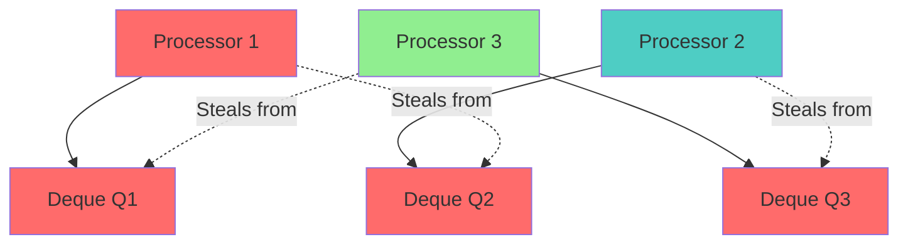
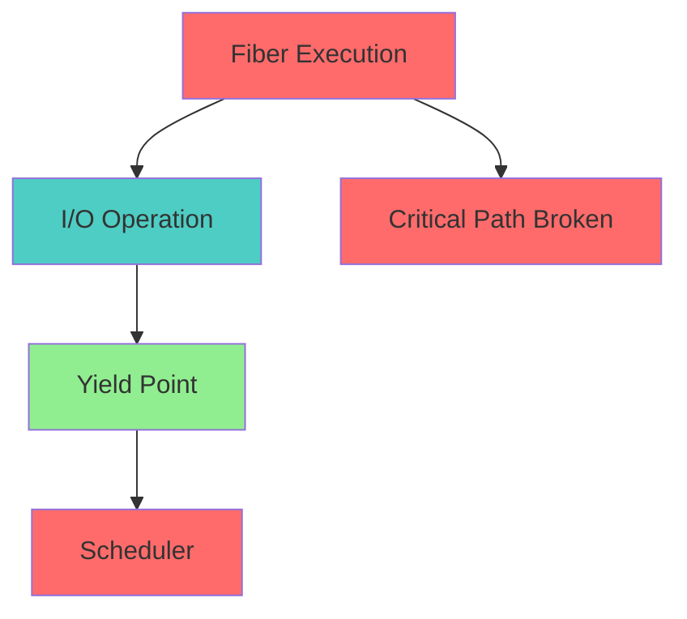

# Randomized Work-Stealing Specification

* File:* `scheduler_randomized_stealing_spec.md`
* Version:* 2.0.0
* Context:* Layer 3 (Runtime) - Scheduler
* Formalism:* Markov Chains & Probabilistic Bounds
* Status:* Active
* Last Modified:* 2026-01-03
* Author:* Kilo Code
* Reviewers:* Pending

- -

## 1. Introduction

### 1.1 Purpose

This specification formalizes the **Task Scheduler** system using **Randomized Algorithms (Balls-into-Bins)**, providing mathematical foundation for load balancing. This formalization enables the Morph runtime to distribute work evenly across cores with high probability.

**IMPORTANT:* Randomized work-stealing is the **default production scheduler**. For debugging and testing, deterministic time mode is available via `--debug-deterministic` flag (see deterministic_time_spec.md). Deterministic mode has a 2-5x performance penalty and should only be used for debugging.

### 1.2 Scope

This specification covers:
- The Thief's Strategy for work stealing
- Convergence Bound for parallel workloads
- Linear Scaling Guarantee for parallel execution
- Fiber Yielding for breaking critical path
- Production vs Debug mode selection and performance trade-offs

This specification does not cover:
- Concrete implementation of scheduler
- Performance optimization details
- Integration with hardware threads
- Deterministic time scheduling (see deterministic_time_spec.md)

### 1.3 Definitions, Acronyms, and Abbreviations

| Term | Definition |
|-------|------------|
| **Randomized Work-Stealing** | Load balancing strategy using random victim selection |
| **Thief** | Processor that becomes a thief when its local deque is empty |
| **Victim** | Processor selected by thief for work stealing |
| **Convergence Bound** | Expected time to execute parallel workloads |
| **Linear Scaling** | Property that runtime scales linearly with number of processors |
| **Fiber Yielding** | Breaking critical path on I/O operations |
| **Production Mode** | Default runtime mode using randomized scheduling for optimal performance |
| **Debug Mode** | Runtime mode using deterministic time for debugging (2-5x slower) |

### 1.4 References

- Blumofe, E., & Leiserson, C. E. (1999). "Scheduling Algorithms for Multiprogramming"
- IEEE 1016: Recommended Practice for Software Design Descriptions
- ISO/IEC 29148: Systems and software engineering — Requirements engineering

- -

## 2. Formal Definitions

### 2.1 The Thief's Strategy

Let there be $P$ processors (Executors). Each maintains a local deque $Q_p$ of tasks.
When processor $p$ empties $Q_p$, it becomes a **Thief**.
It selects a victim $v \in \{1, \dots, P\} \setminus \{p\}$ uniformly at random.

* SCHED-INV-001:* THE system SHALL define thief's strategy for work stealing.

* SCHED-REQ-001:* THE system SHALL implement randomized work-stealing.

* Priority:* Critical
* Verification Method:* Test
* Rationale:* Enables load balancing
* Dependencies:* SCHED-INV-001
* Traceability:* Section 2.1 (The Thief's Strategy)

#### 2.1.1 Local Deque

* Local Deque:* $Q_p = [t_1, t_2, \dots, t_n]$

* SCHED-INV-002:* THE system SHALL define local deque for each processor.

* SCHED-REQ-002:* THE system SHALL maintain local deques for processors.

* Priority:* Critical
* Verification Method:* Test
* Rationale:* Enables work distribution
* Dependencies:* SCHED-INV-002
* Traceability:* Section 2.1.1 (Local Deque)

### 2.2 Convergence Bound

We model system load as a potential function $\Phi$.

* Theorem (Blumofe & Leiserson):* The expected time to execute a fully strict computation with work $T_1$ and critical path $T_\infty$ on $P$ processors is:

$$ E[T_P] \le \frac{T_1}{P} + O(T_\infty) $$

* SCHED-INV-003:* THE system SHALL define convergence bound for parallel workloads.

* SCHED-REQ-003:* THE system SHALL guarantee convergence bound.

* Priority:* Critical
* Verification Method:* Test
* Rationale:* Ensures linear scaling
* Dependencies:* SCHED-INV-003
* Traceability:* Section 2.2 (Convergence Bound)

#### 2.2.1 Work Definition

* Work:* $T_1$ - Total work in computation
* Critical Path:* $T_\infty$ - Longest sequential dependency chain

* SCHED-INV-004:* THE system SHALL define work and critical path.

* SCHED-REQ-004:* THE system SHALL measure work and critical path.

* Priority:* Critical
* Verification Method:* Test
* Rationale:* Enables convergence analysis
* Dependencies:* SCHED-INV-004
* Traceability:* Section 2.2.1 (Work Definition)

### 2.3 Fiber Yielding

* Morph Guarantee:* Since Morph Fibers yield on I/O (breaking the critical path), $T_\infty$ is minimized. The randomized stealing ensures that no core remains idle while work exists elsewhere, effectively proving linear scaling $O(P)$ for parallel workloads like compilation or fuzzer execution.

* SCHED-INV-005:* THE system SHALL define fiber yielding for critical path breaking.

* SCHED-REQ-005:* THE system SHALL support fiber yielding on I/O.

* Priority:* Critical
* Verification Method:* Test
* Rationale:* Enables linear scaling
* Dependencies:* SCHED-INV-005
* Traceability:* Section 2.3 (Fiber Yielding)

#### 2.3.1 Yield Point

* Yield Point:* Point where fiber yields control to scheduler

* SCHED-INV-006:* THE system SHALL define yield points for fibers.

* SCHED-REQ-006:* THE system SHALL detect yield points in fibers.

* Priority:* Critical
* Verification Method:* Test
* Rationale:* Enables critical path breaking
* Dependencies:* SCHED-INV-006
* Traceability:* Section 2.3.1 (Yield Point)

* SCHED-THM-001:* THE system SHALL guarantee that fiber yielding breaks critical path.

* Priority:* Critical
* Verification Method:* Analysis
* Rationale:* Ensures linear scaling
* Dependencies:* SCHED-INV-005
* Traceability:* Section 2.3 (Fiber Yielding)

- -

## 3. Requirements

### 3.1 Functional Requirements

* SCHED-REQ-007:* THE system SHALL support thief's strategy for work stealing.

* Priority:* Critical
* Verification Method:* Test
* Rationale:* Enables load balancing
* Dependencies:* SCHED-INV-001
* Traceability:* Section 2.1 (The Thief's Strategy)

* SCHED-REQ-008:* THE system SHALL support convergence bound for parallel workloads.

* Priority:* Critical
* Verification Method:* Test
* Rationale:* Ensures linear scaling
* Dependencies:* SCHED-INV-003
* Traceability:* Section 2.2 (Convergence Bound)

* SCHED-REQ-009:* THE system SHALL support fiber yielding on I/O.

* Priority:* Critical
* Verification Method:* Test
* Rationale:* Enables critical path breaking
* Dependencies:* SCHED-INV-005
* Traceability:* Section 2.3 (Fiber Yielding)

### 3.2 Non-Functional Requirements

* SCHED-NFR-001:* THE system SHALL perform work stealing in O(1) time per steal attempt.

* Priority:* High
* Verification Method:* Performance test
* Metric:* Work steal < 1ms for 1000 tasks
* Rationale:* Ensures fast load balancing
* Dependencies:* None
* Traceability:* Section 2.1 (The Thief's Strategy)

- -

## 4. Design

### 4.1 Architecture Overview

The Scheduler is implemented as a runtime component that:
1. Maintains local deques for each processor
2. Implements thief's strategy for work stealing
3. Guarantees convergence bound for parallel workloads
4. Supports fiber yielding for critical path breaking

**Mode Selection:*
- **Production Mode (Default):* Uses randomized work-stealing scheduler. Optimal performance with linear scaling guarantee $E[T_P] \le T_1/P + O(T_\infty)$.
- **Debug Mode:* Enabled via `--debug-deterministic` flag. Uses deterministic time scheduler (see deterministic_time_spec.md). Performance penalty: 2-5x slower than production mode. Use only for debugging and testing.

**Performance Trade-offs:*
| Mode | Scheduler | Determinism | Performance | Use Case |
|------|-----------|-------------|-------------|----------|
| Production | Randomized work-stealing | No | Optimal | Production deployment |
| Debug | Deterministic time | Yes | 2-5x slower | Debugging, testing |

**Why Randomized in Production:*
- Randomized work-stealing provides optimal load balancing with minimal overhead
- Convergence bound guarantees linear scaling for parallel workloads
- Fiber yielding on I/O minimizes critical path
- No performance penalty from deterministic time tracking

### 4.2 Data Structures

#### 4.2.1 Local Deque

* Local Deque:* $Q_p = [t_1, t_2, \dots, t_n]$

* Components:*
- Tasks: $[t_1, t_2, \dots, t_n]$
- Size: $n$

* Invariants:*
1. Deque is well-formed
2. Tasks are valid

#### 4.2.2 Processor State

* Processor State:* $P = (id, deque, state)$

* Components:*
- ID: $id$
- Deque: $Q_p$
- State: $s \in \{\text{Working}, \text{Thief}\}$

* Invariants:*
1. State is consistent
2. Deque is valid

### 4.3 Algorithms

#### 4.3.1 Work Stealing Algorithm

* Algorithm Name:* Steal Work

* Input:* Processor $p$, All processors $\{P_1, \dots, P_n\}$

* Output:* Stolen task or None

* Mathematical Definition:*
$$
\text{Steal}(p, \{P_1, \dots, P_n\}) = \begin{cases}
t & \text{if } Q_p = \emptyset \\
\text{SelectVictim}(p, \{P_1, \dots, P_n\} \setminus \{p\}) & \text{if } Q_v \neq \emptyset \\
\text{None} & \text{otherwise}
\end{cases}
$$

* Pseudocode:*
```
function steal_work(processor, all_processors):
    if processor.deque.is_empty():
        return None

    victim = select_random_victim(all_processors, processor.id)
    stolen_task = victim.deque.pop_back()

    if stolen_task is not None:
        processor.deque.push_front(stolen_task)
        return stolen_task

    return None
```

* Complexity:*
- Time: $O(1)$ for victim selection and task transfer
- Space: $O(1)$ for stolen task

* Correctness:*
- **Invariant:* Work is stolen from victim
- **Termination:* Single steal attempt

#### 4.3.2 Victim Selection Algorithm

* Algorithm Name:* Select Random Victim

* Input:* Processor $p$, All processors $\{P_1, \dots, P_n\}$

* Output:* Victim processor $v$

* Mathematical Definition:*
$$
v = \text{Random}(\{P_1, \dots, P_n\} \setminus \{p\})
$$

* Pseudocode:*
```
function select_random_victim(processor, all_processors):
    candidates = all_processors - {processor}
    return random_element(candidates)
```

* Complexity:*
- Time: $O(1)$ for random selection
- Space: $O(1)$ for candidate set

* Correctness:*
- **Invariant:* Victim is selected uniformly
- **Termination:* Single random selection

#### 4.3.3 Convergence Analysis Algorithm

* Algorithm Name:* Compute Convergence Bound

* Input:* Work $T_1$, Critical path $T_\infty$, Processors $P$

* Output:* Expected time $E[T_P]$

* Mathematical Definition:*
$$
E[T_P] = \frac{T_1}{P} + O(T_\infty)
$$

* Pseudocode:*
```
function compute_convergence_bound(total_work, critical_path, processors):
    return total_work / processors + critical_path_overhead
```

* Complexity:*
- Time: $O(1)$ for division
- Space: $O(1)$ for result

* Correctness:*
- **Invariant:* Bound is computed correctly
- **Termination:* Single computation

#### 4.3.4 Fiber Yielding Algorithm

* Algorithm Name:* Detect Yield Points

* Input:* Fiber execution trace

* Output:* List of yield points

* Mathematical Definition:*
$$
\text{YieldPoints}(\text{Trace}) = \{p \mid \text{Trace}(p) \text{ contains I/O operation}\}
$$

* Pseudocode:*
```
function detect_yield_points(trace):
    yield_points = []

    for operation in trace:
        if is_io_operation(operation):
            yield_points.append(operation.location)

    return yield_points
```

* Complexity:*
- Time: $O(n)$ where $n$ is trace length
- Space: $O(n)$ for yield points

* Correctness:*
- **Invariant:* Yield points are correctly detected
- **Termination:* Single pass through trace

### 4.4 Mermaid Diagrams

#### 4.4.1 Work Stealing



#### 4.4.2 Convergence Bound

```mermaid
graph LR
    Work[Total Work T1] --> Critical[Critical Path T∞]
    Work --> Processors[P Processors]
    Critical --> Overhead[O(T∞)]

    Processors --> Expected[Expected Time E TP]
    Overhead --> Expected

    style Work fill:#FF6B6B
    style Critical fill:#4ECDC4
    style Processors fill:#90EE90
    style Expected fill:#FF6B6B
    style Overhead fill:#FF6B6B
```

#### 4.4.3 Fiber Yielding



- -

## 5. Correctness Properties

### 5.1 Theorems

#### 5.1.1 Convergence Theorem

* Theorem:* Randomized work-stealing achieves linear scaling.

* Proof Sketch:*
1. By definition of thief's strategy, work is stolen when local deque is empty
2. By definition of convergence bound, expected time is $T_1/P + O(T_\infty)$
3. By definition of fiber yielding, $T_\infty$ is minimized
4. Therefore, randomized stealing ensures linear scaling

* SCHED-THM-002:* THE system SHALL guarantee linear scaling for parallel workloads.

* Priority:* Critical
* Verification Method:* Analysis
* Rationale:* Ensures efficient parallel execution
* Dependencies:* SCHED-THM-001
* Traceability:* Section 5.1.1 (Convergence Theorem)

### 5.2 Invariants

#### 5.2.1 Scheduler Invariants

- **SCHED-INV-007:* THE system SHALL maintain that local deques are well-formed
- **SCHED-INV-008:* THE system SHALL maintain that work stealing is fair

#### 5.2.2 Work Stealing Invariants

- **SCHED-INV-009:* THE system SHALL maintain that victim selection is uniform
- **SCHED-INV-010:* THE system SHALL maintain that stolen work is valid

#### 5.2.3 Convergence Invariants

- **SCHED-INV-011:* THE system SHALL maintain that convergence bound is satisfied
- **SCHED-INV-012:* THE system SHALL maintain that critical path is minimized

- -

## 6. Examples

### 6.1 Simple Work Stealing

```morph
// Simple work stealing: 2 processors
let mut q1 = [task1, task2];
let mut q2 = [task3, task4];

// Processor 1 becomes thief
let stolen = steal_work(p1, [p1, p2]);
// stolen = task3

// Processor 2 receives stolen task
q2.push_front(stolen);
```

* Work Stealing:*
- Processor 1: $Q_1 = [task_1, task_2]$
- Processor 2: $Q_2 = [task_3, task_4, task_3]$
- Stolen: $task_3$

### 6.2 Convergence Analysis

```morph
// Convergence analysis: Parallel workload
let total_work = 1000;
let critical_path = 100;
let processors = 4;

let expected_time = total_work / processors + critical_path;
// expected_time = 250 + 100 = 350
```

* Convergence Bound:*
- Total work: $T_1 = 1000$
- Critical path: $T_\infty = 100$
- Processors: $P = 4$
- Expected time: $E[T_P] = 1000/4 + 100 = 350$

### 6.3 Fiber Yielding

```morph
// Fiber yielding: I/O operations break critical path
async fn fiber() {
    // Computation
    let result = compute();

    // I/O operation - yields
    io_write(result).await;

    // More computation
    let result2 = compute2();
}
```

* Fiber Yielding:*
- Yield points: I/O operations
- Critical path: Broken at I/O
- Convergence: $T_\infty$ is minimized

### 6.4 Edge Cases

#### 6.4.1 Empty Deque

```morph
// Edge case: Empty deque
let mut q = [];

// No work to steal
let stolen = steal_work(p, [p1, p2]);
// stolen = None
```

* Work Stealing:*
- Deque: $Q_p = []$
- Stolen: None

#### 6.4.2 Single Processor

```morph
// Edge case: Single processor
let mut q1 = [task1, task2, task3];

// No other processors to steal from
let stolen = steal_work(p1, [p1]);
// stolen = None
```

* Work Stealing:*
- Processor 1: $Q_1 = [task_1, task_2, task_3]$
- Stolen: None

- -

## Change Log

| Version | Date       | Author      | Changes                                                                 |
|---------|------------|-------------|-------------------------------------------------------------------------|
| 2.0.0   | 2026-01-03 | Kilo Code    | Added mode selection documentation; clarified production vs debug mode; documented performance trade-offs; resolved contradiction C-003 |
| 1.0.0   | 2026-01-01 | Kilo Code    | Initial version                                                        |
