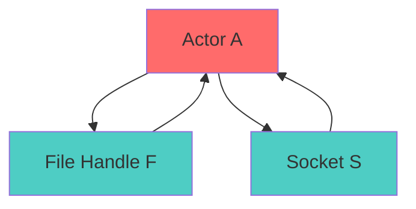
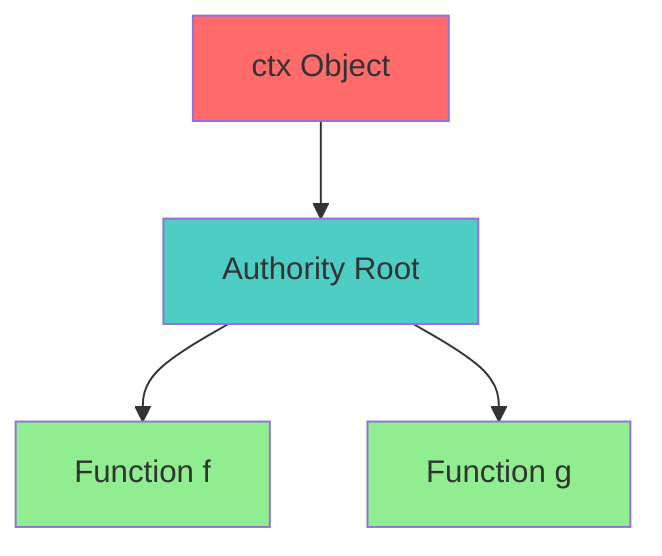

# Object-Capability Model Specification (OCap)

* File:* `security_ocap_spec.md`
* Version:* 1.0.0
* Context:* Layer 4 (Framework) - `ctx` Capabilities
* Formalism:* Access Graphs & Reachability
* Status:* Active
* Last Modified:* 2026-01-01
* Author:* Kilo Code
* Reviewers:* Pending

- -

## 1. Introduction

### 1.1 Purpose

This specification formalizes the **Access Control System** using **Object-Capability Model (OCap)**, providing mathematical foundation for authority management. This formalization enables the Morph framework to prove that an Agent cannot perform an action unless explicitly granted a capability handle.

### 1.2 Scope

This specification covers:
- The Access Graph ($G$) for system state
- The Connectivity Rule for permission checking
- The `ctx` Capability Root for authority
- No Global Ambient Authority

This specification does not cover:
- Concrete implementation of capability system
- Performance optimization details
- Integration with other framework components

### 1.3 Definitions, Acronyms, and Abbreviations

| Term | Definition |
|-------|------------|
| **Access Graph ($G$)** | Directed graph of system state |
| **Nodes** | Objects (Actors, FileHandles, Sockets) |
| **Edges** | References (Pointer from A to B) |
| **Connectivity Rule** | Permission requires path in graph |
| **Capability Root** | Root of authority for call stack |
| **No Global Ambient Authority** | No global node connected to everything |
| **Reference Passing** | Authority transfer via message passing |

### 1.4 References

- Miller, M. S., et al. (1999). "Capability-Based Computer Systems"
- IEEE 1016: Recommended Practice for Software Design Descriptions
- ISO/IEC 29148: Systems and software engineering — Requirements engineering

- -

## 2. Formal Definitions

### 2.1 The Access Graph ($G$)

Let system state be a directed graph where:

- **Nodes:* Objects (Actors, FileHandles, Sockets).
- **Edges:* References (Pointer from A to B).

* OCAP-INV-001:* THE system SHALL define access graph for system state.

* OCAP-REQ-001:* THE system SHALL represent system state as access graph.

* Priority:* Critical
* Verification Method:* Test
* Rationale:* Enables authority management
* Dependencies:* OCAP-INV-001
* Traceability:* Section 2.1 (The Access Graph)

#### 2.1.1 Graph Definition

* Access Graph:* $G = (V, E)$

* Components:*
- Nodes: $V = \{v_1, v_2, \dots, v_n\}$
- Edges: $E = \{e_1, e_2, \dots, e_m\}$

* OCAP-INV-002:* THE system SHALL define graph structure for access control.

* OCAP-REQ-002:* THE system SHALL maintain nodes and edges for access graph.

* Priority:* Critical
* Verification Method:* Test
* Rationale:* Enables authority tracking
* Dependencies:* OCAP-INV-002
* Traceability:* Section 2.1.1 (Graph Definition)

### 2.2 The Connectivity Rule

A subject $S$ can perform an operation on object $O$ **if and only if** there exists a path $S \to \dots \to O$ in $G$.

* OCAP-INV-003:* THE system SHALL define connectivity rule for permission checking.

* OCAP-REQ-003:* THE system SHALL enforce connectivity rule for operations.

* Priority:* Critical
* Verification Method:* Test
* Rationale:* Ensures authority enforcement
* Dependencies:* OCAP-INV-003
* Traceability:* Section 2.2 (The Connectivity Rule)

#### 2.2.1 Path Existence

* Path Existence:* $\text{Path}(S, O) \iff \exists v_1, \dots, v_k \in V \land (v_1 = S \land \dots \land v_k = O)$

* OCAP-INV-004:* THE system SHALL define path existence for connectivity.

* OCAP-REQ-004:* THE system SHALL check path existence for operations.

* Priority:* Critical
* Verification Method:* Test
* Rationale:* Enables permission checking
* Dependencies:* OCAP-INV-004
* Traceability:* Section 2.2.1 (Path Existence)

### 2.3 No Global Ambient Authority

There is no "global" node connected to everything (like `java.io.File`).

* OCAP-INV-005:* THE system SHALL define no global ambient authority.

* OCAP-REQ-005:* THE system SHALL prevent global ambient authority.

* Priority:* Critical
* Verification Method:* Test
* Rationale:* Ensures principle of least privilege
* Dependencies:* OCAP-INV-005
* Traceability:* Section 2.3 (No Global Ambient Authority)

#### 2.3.1 Authority Transfer

* Authority Transfer:* Authority is transferred via **Reference Passing**.

If $A$ has edge $A \to O$, and $A$ sends message $M(O)$ to $B$, then graph updates: $B \to O$.

* OCAP-INV-006:* THE system SHALL define authority transfer via reference passing.

* OCAP-REQ-006:* THE system SHALL support reference passing for authority transfer.

* Priority:* Critical
* Verification Method:* Test
* Rationale:* Enables capability delegation
* Dependencies:* OCAP-INV-006
* Traceability:* Section 2.3.1 (Authority Transfer)

### 2.4 The `ctx` Capability Root

The implicit `ctx` object passed to functions acts as the **Root of Authority** for that call stack.

$$ \text{Authority}(f) \subseteq \text{Reachable}(\text{ctx}) $$

* OCAP-INV-007:* THE system SHALL define ctx as capability root.

* OCAP-REQ-007:* THE system SHALL use ctx as authority root for call stack.

* Priority:* Critical
* Verification Method:* Test
* Rationale:* Enables implicit authority
* Dependencies:* OCAP-INV-007
* Traceability:* Section 2.4 (The `ctx` Capability Root)

#### 2.4.1 Authority Inheritance

* Authority Inheritance:* Functions called from $f$ inherit authority from $\text{ctx}$.

* OCAP-THM-001:* THE system SHALL guarantee that ctx authority propagates to called functions.

* Priority:* Critical
* Verification Method:* Analysis
* Rationale:* Ensures implicit authority
* Dependencies:* OCAP-INV-007
* Traceability:* Section 2.4.1 (Authority Inheritance)

- -

## 3. Requirements

### 3.1 Functional Requirements

* OCAP-REQ-008:* THE system SHALL support access graph for system state.

* Priority:* Critical
* Verification Method:* Test
* Rationale:* Enables authority management
* Dependencies:* OCAP-INV-001
* Traceability:* Section 2.1 (The Access Graph)

* OCAP-REQ-009:* THE system SHALL support connectivity rule for permission checking.

* Priority:* Critical
* Verification Method:* Test
* Rationale:* Ensures authority enforcement
* Dependencies:* OCAP-INV-003
* Traceability:* Section 2.2 (The Connectivity Rule)

* OCAP-REQ-010:* THE system SHALL support authority transfer via reference passing.

* Priority:* Critical
* Verification Method:* Test
* Rationale:* Enables capability delegation
* Dependencies:* OCAP-INV-006
* Traceability:* Section 2.3.1 (Authority Transfer)

* OCAP-REQ-011:* THE system SHALL support ctx as capability root.

* Priority:* Critical
* Verification Method:* Test
* Rationale:* Enables implicit authority
* Dependencies:* OCAP-INV-007
* Traceability:* Section 2.4 (The `ctx` Capability Root)

### 3.2 Non-Functional Requirements

* OCAP-NFR-001:* THE system SHALL perform permission checking in O(n) time for n nodes.

* Priority:* High
* Verification Method:* Performance test
* Metric:* Permission check < 10ms for 1000 nodes
* Rationale:* Ensures fast authorization
* Dependencies:* None
* Traceability:* Section 2.2 (The Connectivity Rule)

- -

## 4. Design

### 4.1 Architecture Overview

The Object-Capability Engine is implemented as a framework component that:
1. Maintains access graph for system state
2. Enforces connectivity rule for permission checking
3. Supports authority transfer via reference passing
4. Provides ctx as capability root for call stack

### 4.2 Data Structures

#### 4.2.1 Access Graph

* Access Graph:* $G = (V, E)$

* Components:*
- Nodes: $V = \{v_1, v_2, \dots, v_n\}$
- Edges: $E = \{e_1, e_2, \dots, e_m\}$

* Invariants:*
1. Graph is well-formed
2. Edges are valid references

#### 4.2.2 Capability

* Capability:* $C = (subject, object, authority)$

* Components:*
- Subject: $S$
- Object: $O$
- Authority: $\text{Authority}(S)$

* Invariants:*
1. Authority is subset of reachable objects
2. Authority is well-formed

### 4.3 Algorithms

#### 4.3.1 Permission Checking Algorithm

* Algorithm Name:* Check Permission

* Input:* Subject $S$, Object $O$, Access Graph $G$

* Output:* Boolean indicating if operation is allowed

* Mathematical Definition:*
$$
\text{Allowed}(S, O, G) \iff \text{Path}(S, O, G)
$$

* Pseudocode:*
```
function check_permission(subject, object, graph):
    return path_exists(subject, object, graph)
```

* Complexity:*
- Time: $O(n)$ where $n$ is number of nodes
- Space: $O(n)$ for path

* Correctness:*
- **Invariant:* Permission is correctly checked
- **Termination:* Single path existence check

#### 4.3.2 Authority Transfer Algorithm

* Algorithm Name:* Transfer Authority

* Input:* Subject $S$, Object $O$, Message $M(O)$

* Output:* Updated graph $G'$

* Mathematical Definition:*
$$
G' = G \cup \{B \to O\}
$$

* Pseudocode:*
```
function transfer_authority(subject, object, message, graph):
    new_edge = Edge(subject, object)
    return graph.add_edge(new_edge)
```

* Complexity:*
- Time: $O(1)$ for edge addition
- Space: $O(1)$ for new edge

* Correctness:*
- **Invariant:* Authority is transferred
- **Termination:* Single edge addition

#### 4.3.3 Authority Inheritance Algorithm

* Algorithm Name:* Inherit Authority

* Input:* Function $f$, Context $\text{ctx}$

* Output:* Boolean indicating if function has authority

* Mathematical Definition:*
$$
\text{HasAuthority}(f, \text{ctx}) \iff \text{Authority}(f) \subseteq \text{Reachable}(\text{ctx})
$$

* Pseudocode:*
```
function has_authority(function, ctx):
    return authority_subset(function.authority, reachable_objects(ctx))
```

* Complexity:*
- Time: $O(n)$ where $n$ is number of reachable objects
- Space: $O(n)$ for authority set

* Correctness:*
- **Invariant:* Authority inheritance is correct
- **Termination:* Single subset check

### 4.4 Mermaid Diagrams

#### 4.4.1 Access Graph



#### 4.4.2 Connectivity Rule


#### 4.4.3 Authority Transfer

```mermaid
sequenceDiagram
    participant A
    participant B
    participant Graph

    A->>Graph: Has Edge A → O
    A->>B: Send Message M(O)
    B->>Graph: Add Edge B → O

    style A fill:#FF6B6B
    style B fill:#4ECDC4
    style Graph fill:#90EE90
```

#### 4.4.4 ctx Capability Root



- -

## 5. Correctness Properties

### 5.1 Theorems

#### 5.1.1 Connectivity Theorem

* Theorem:* Connectivity rule ensures authority enforcement.

* Proof Sketch:*
1. By definition of connectivity rule, operation requires path in graph
2. By definition of path existence, path exists iff edges form path
3. By definition of authority, operation is allowed iff path exists
4. Therefore, connectivity rule ensures authority enforcement

* OCAP-THM-002:* THE system SHALL guarantee that connectivity rule enforces authority.

* Priority:* Critical
* Verification Method:* Analysis
* Rationale:* Ensures security
* Dependencies:* OCAP-THM-001
* Traceability:* Section 5.1.1 (Connectivity Theorem)

### 5.2 Invariants

#### 5.2.1 Graph Invariants

- **OCAP-INV-008:* THE system SHALL maintain that access graph is well-formed
- **OCAP-INV-009:* THE system SHALL maintain that edges are valid references

#### 5.2.2 Authority Invariants

- **OCAP-INV-010:* THE system SHALL maintain that authority is subset of reachable objects
- **OCAP-INV-011:* THE system SHALL maintain that authority is well-formed

- -

## 6. Examples

### 6.1 Simple Permission Check

```morph
// Simple permission check: File access
let ctx = Context { fs: FileCapability };
let file = ctx.fs.open("data.txt");

// Permission check: Path exists
if has_permission(ctx, file, "read"):
    let content = file.read();
}
```

* Permission Check:*
- Subject: `ctx`
- Object: `file`
- Authority: $\text{Authority}(ctx) = \{\text{fs}, \text{net}, \dots\}$
- Path: $\text{Path}(\text{ctx}, \text{file}) = \text{ctx} \to \text{fs} \to \text{file}$
- Allowed: True

### 6.2 Authority Transfer

```morph
// Authority transfer: Delegation
let ctx = Context { fs: FileCapability };

fn handler(ctx: Context) {
    let file = ctx.fs.open("data.txt");
    // Authority transferred to handler
    process_file(file);
}

fn process_file(file: FileCapability) {
    // Has authority via ctx
    file.read();
}
```

* Authority Transfer:*
- Subject: `ctx`
- Object: `file`
- Authority: $\text{Authority}(ctx) = \{\text{fs}, \text{net}, \dots\}$
- Transfer: Via function parameter

### 6.3 No Global Authority

```morph
// No global authority: Principle of least privilege
// No global node like java.io.File

let ctx = Context { };
// ctx has no global authority
```

* No Global Authority:*
- Subject: `ctx`
- Authority: $\text{Authority}(ctx) = \emptyset$
- No global node: True

### 6.4 Authority Inheritance

```morph
// Authority inheritance: Called functions inherit ctx
let ctx = Context { db: DatabaseCapability };

fn outer(ctx: Context) {
    inner(ctx);  // Inherits ctx
}

fn inner(ctx: Context) {
    // Has authority via ctx
    ctx.db.query();
}
```

* Authority Inheritance:*
- Subject: `ctx`
- Authority: $\text{Authority}(ctx) = \{\text{db}, \text{net}, \dots\}$
- Inheritance: `inner` inherits from `outer`

### 6.5 Edge Cases

#### 6.5.1 No Authority

```morph
// Edge case: No authority
let ctx = Context { };

fn handler(ctx: Context) {
    // No authority to access file
    // Error: No permission
}
```

* No Authority:*
- Subject: `ctx`
- Authority: $\text{Authority}(ctx) = \emptyset$
- Operation: Not allowed

#### 6.5.2 Empty Graph

```morph
// Edge case: Empty access graph
let ctx = Context { };
let graph = AccessGraph {};

// No objects in graph
```

* Empty Graph:*
- Nodes: $V = \emptyset$
- Edges: $E = \emptyset$

- -

## Change Log

| Version | Date       | Author      | Changes                                                                 |
|---------|------------|-------------|-------------------------------------------------------------------------|
| 1.0.0   | 2026-01-01 | Kilo Code    | Initial version                                                        |
