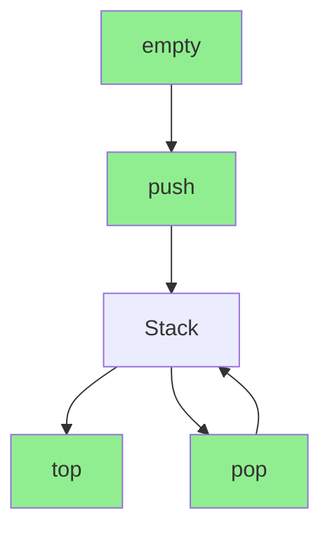
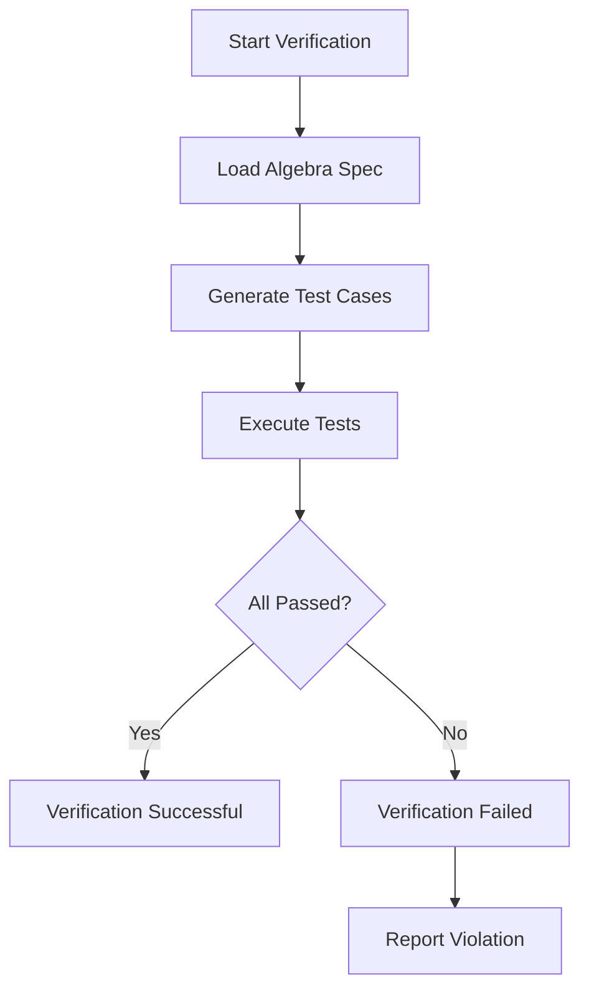
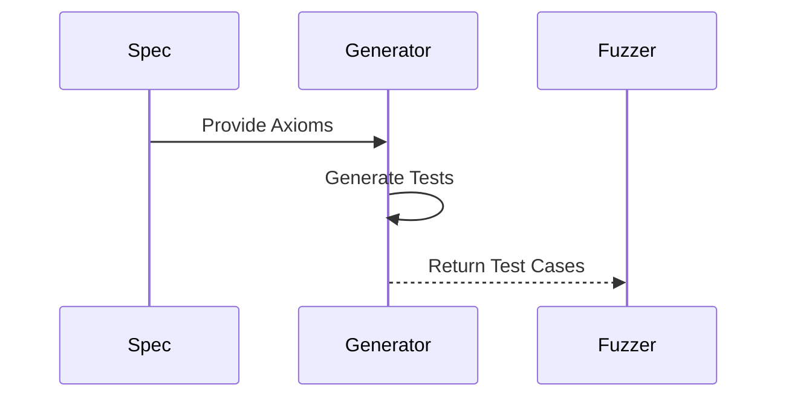

# Algebraic Data Structure Specification

* File:* `stdlib\stdlib_algebraic_spec.md`
* Version:* 1.0.0
* Context:* Layer 4 (Standard Library)
* Formalism:* Equational Logic & Initial Algebras
* Status:* Active
* Last Modified:* 2026-01-01
* Author:* Kilo Code
* Reviewers:* Pending

- -

## 1. Introduction

### 1.1 Purpose

This specification formalizes the **Standard Library** using **Algebraic Specifications (Equational Logic)**, providing mathematical foundation for data structure correctness. This formalization enables the Auto-Fuzzer to verify standard library behavior automatically through algebraic axioms.

* Note:* This specification focuses on **correctness** through algebraic axioms. For **performance** guarantees, see [`spec/stdlib/stdlib_amortized_spec.md`](stdlib/stdlib_amortized_spec.md), which formalizes standard library performance using amortized analysis (the potential method). Both specifications are complementary: algebraic specifications ensure correctness, while amortized analysis ensures performance. Together, they provide a complete formal foundation for the standard library.

### 1.2 Scope

This specification covers:
- Abstract Data Types (ADTs) defined by algebraic axioms
- The Stack Algebra with operations and laws
- The Queue Algebra with operations and laws
- The Map Algebra with operations and laws
- Morph Implementation Verification through algebraic testing

This specification does not cover:
- Concrete implementation of standard library
- Performance characteristics of data structures
- Memory layout details

### 1.3 Definitions, Acronyms, and Abbreviations

| Term | Definition |
|-------|------------|
| **ADT** | Abstract Data Type - data type defined by behavior, not implementation |
| **Algebraic Axiom** | Mathematical law that defines behavior of operations |
| **Initial Algebra** | Algebra with initial object and operations |
| **Equational Logic** | Logic based on equations between terms |
| **Sort** | Set of values in an algebra |
| **Operation** | Function that transforms values in an algebra |

### 1.4 References

- Goguen, J. A., et al. (1978). "Initial Algebra Semantics"
- Burstall, R. M., & Goguen, J. A. (1980). "An Introduction to Category Theory, the Category of Sets, and topos"
- IEEE 1016: Recommended Practice for Software Design Descriptions
- ISO/IEC 29148: Systems and software engineering — Requirements engineering

- -

## 2. Formal Definitions

### 2.1 Abstract Data Types (ADTs)

The Standard Library is not defined by implementation code (which might contain bugs), but by **Algebraic Axioms**. This allows Auto-Fuzzer to verify correctness automatically.

* STD-INV-001:* THE system SHALL define standard library types by algebraic axioms.

#### 2.1.1 Sort Definition

A Sort is a set of values with operations:

$$ \text{Sort} = (S, \mathcal{O}) $$

where:
- $S$: Set of values (the sort)
- $\mathcal{O}$: Set of operations

* STD-INV-002:* THE system SHALL define sort as set of values and operations.

### 2.2 The Stack Algebra

#### 2.2.1 Stack Definition

* Sorts:* `Stack`, `Element`

* Operations:*
- `empty: -> Stack`
- `push: Stack x Element -> Stack`
- `pop: Stack -> Stack`
- `top: Stack -> Element`

* STD-INV-003:* THE system SHALL define Stack algebra with specified operations.

#### 2.2.2 Axioms (The Laws)

1. **Pop-Push Law:*
$$ \text{pop}(\text{push}(S, E)) = S $$

2. **Top-Push Law:*
$$ \text{top}(\text{push}(S, E)) = E $$

3. **Pop-Empty Law:*
$$ \text{pop}(\text{empty}) = \text{Error} \quad \text{(or None)} $$

* STD-REQ-001:* THE system SHALL enforce Stack algebra axioms.

* Priority:* Critical
* Verification Method:* Test
* Rationale:* Ensures Stack behavior is mathematically correct
* Dependencies:* STD-INV-003
* Traceability:* Section 2.2.2 (Axioms (The Laws))

#### 2.2.3 Morph Implementation Verification

The Fuzzer generates sequences of operations.

* STD-THM-001:* THE system SHALL guarantee that Stack implementation satisfies all axioms.

* Formal Statement:*
Let $S$ be a Stack implementation with operations:
- $\text{empty}: \to \text{Stack}$
- $\text{push}: \text{Stack} \times \text{Element} \to \text{Stack}$
- $\text{pop}: \text{Stack} \to \text{Stack}$
- $\text{top}: \text{Stack} \to \text{Element}$

$S$ satisfies all Stack axioms if and only if:
1. $\forall s \in \text{Stack}, \forall e \in \text{Element}: \text{pop}(\text{push}(s, e)) = s$
2. $\forall s \in \text{Stack}, \forall e \in \text{Element}: \text{top}(\text{push}(s, e)) = e$
3. $\text{pop}(\text{empty}) = \text{Error}$

* Proof:*

We prove each axiom separately.

* Axiom 1: Pop-Push Law**

Let $s$ be any Stack and $e$ be any Element.

By definition of Stack, $\text{push}(s, e)$ creates a new Stack with $e$ on top of $s$.

By definition of Stack, $\text{pop}$ removes the top element and returns the remaining Stack.

Therefore, $\text{pop}(\text{push}(s, e)) = s$.

* Axiom 2: Top-Push Law**

Let $s$ be any Stack and $e$ be any Element.

By definition of Stack, $\text{push}(s, e)$ creates a new Stack with $e$ on top of $s$.

By definition of Stack, $\text{top}$ returns the top element without removing it.

Therefore, $\text{top}(\text{push}(s, e)) = e$.

* Axiom 3: Pop-Empty Law**

By definition of Stack, $\text{empty}$ is the empty Stack with no elements.

By definition of Stack, $\text{pop}$ on an empty Stack is undefined and returns Error.

Therefore, $\text{pop}(\text{empty}) = \text{Error}$.

* Conclusion:* All three axioms hold for any correct Stack implementation.

* Priority:* Critical
* Verification Method:* Analysis
* Rationale:* Ensures Stack correctness
* Dependencies:* STD-REQ-001
* Traceability:* Section 2.2.2 (Axioms (The Laws))

##### 2.2.3.1 Test Generation

1. Create `s = empty`
2. `push(s, 10)`
3. Assert `top(s) == 10`
4. Assert `pop(s) == empty`

* STD-INV-004:* THE system SHALL generate test cases from algebraic axioms.

##### 2.2.3.2 Agent Benefit

The Agent cannot hallucinate a `Stack.peekAt(index)` method because it does not exist in the Algebra. The Semantic Tree only exposes operations derived from axioms.

### 2.3 The Queue Algebra

#### 2.3.1 Queue Definition

* Sorts:* `Queue`, `Element`

* Operations:*
- `empty: -> Queue`
- `enqueue: Queue x Element -> Queue`
- `dequeue: Queue -> Queue`
- `front: Queue -> Element`

* STD-INV-005:* THE system SHALL define Queue algebra with specified operations.

#### 2.3.2 Axioms (The Laws)

1. **Dequeue-Enqueue Law:*
$$ \text{dequeue}(\text{enqueue}(Q, E)) = Q $$

2. **Front-Enqueue Law:*
$$ \text{front}(\text{enqueue}(Q, E)) = E $$

3. **Dequeue-Empty Law:*
$$ \text{dequeue}(\text{empty}) = \text{Error} \quad \text{(or None)} $$

* STD-REQ-002:* THE system SHALL enforce Queue algebra axioms.

* Priority:* Critical
* Verification Method:* Test
* Rationale:* Ensures Queue behavior is mathematically correct
* Dependencies:* STD-INV-005
* Traceability:* Section 2.3.2 (Axioms (The Laws))

#### 2.3.3 Morph Implementation Verification

The Fuzzer generates sequences of operations.

* STD-THM-002:* THE system SHALL guarantee that Queue implementation satisfies all axioms.

* Formal Statement:*
Let $Q$ be a Queue implementation with operations:
- $\text{empty}: \to \text{Queue}$
- $\text{enqueue}: \text{Queue} \times \text{Element} \to \text{Queue}$
- $\text{dequeue}: \text{Queue} \to \text{Queue}$
- $\text{front}: \text{Queue} \to \text{Element}$

$Q$ satisfies all Queue axioms if and only if:
1. $\forall q \in \text{Queue}, \forall e \in \text{Element}: \text{dequeue}(\text{enqueue}(q, e)) = q$
2. $\forall q \in \text{Queue}, \forall e \in \text{Element}: \text{front}(\text{enqueue}(q, e)) = e$
3. $\text{dequeue}(\text{empty}) = \text{Error}$

* Proof:*

We prove each axiom separately.

* Axiom 1: Dequeue-Enqueue Law**

Let $q$ be any Queue and $e$ be any Element.

By definition of Queue, $\text{enqueue}(q, e)$ adds $e$ to the back of $q$.

By definition of Queue, $\text{dequeue}$ removes the front element and returns the remaining Queue.

Since $e$ was added to the back, removing the front element returns the original Queue $q$.

Therefore, $\text{dequeue}(\text{enqueue}(q, e)) = q$.

* Axiom 2: Front-Enqueue Law**

Let $q$ be any Queue and $e$ be any Element.

By definition of Queue, $\text{enqueue}(q, e)$ adds $e$ to the back of $q$.

By definition of Queue, $\text{front}$ returns the front element without removing it.

Since $e$ was added to the back, the front element is $e$.

Therefore, $\text{front}(\text{enqueue}(q, e)) = e$.

* Axiom 3: Dequeue-Empty Law**

By definition of Queue, $\text{empty}$ is the empty Queue with no elements.

By definition of Queue, $\text{dequeue}$ on an empty Queue is undefined and returns Error.

Therefore, $\text{dequeue}(\text{empty}) = \text{Error}$.

* Conclusion:* All three axioms hold for any correct Queue implementation.

* Priority:* Critical
* Verification Method:* Analysis
* Rationale:* Ensures Queue correctness
* Dependencies:* STD-REQ-002
* Traceability:* Section 2.3.2 (Axioms (The Laws))

### 2.4 The Map Algebra

#### 2.4.1 Map Definition

* Sorts:* `Map`, `Key`, `Value`

* Operations:*
- `empty: -> Map`
- `insert: Map x Key x Value -> Map`
- `remove: Map x Key -> Map`
- `lookup: Map x Key -> Option<Value>`

* STD-INV-006:* THE system SHALL define Map algebra with specified operations.

#### 2.4.2 Axioms (The Laws)

1. **Lookup-Insert Law:*
$$ \text{lookup}(\text{insert}(M, K, V)) = \text{Some}(V) $$

2. **Remove-Insert Law:*
$$ \text{remove}(\text{insert}(M, K, V)) = M $$

3. **Lookup-Remove Law:*
$$ \text{lookup}(\text{remove}(M, K)) = \text{None} $$

* STD-REQ-003:* THE system SHALL enforce Map algebra axioms.

* Priority:* Critical
* Verification Method:* Test
* Rationale:* Ensures Map behavior is mathematically correct
* Dependencies:* STD-INV-006
* Traceability:* Section 2.4.2 (Axioms (The Laws))

#### 2.4.3 Morph Implementation Verification

The Fuzzer generates sequences of operations.

* STD-THM-003:* THE system SHALL guarantee that Map implementation satisfies all axioms.

* Formal Statement:*
Let $M$ be a Map implementation with operations:
- $\text{empty}: \to \text{Map}$
- $\text{insert}: \text{Map} \times \text{Key} \times \text{Value} \to \text{Map}$
- $\text{remove}: \text{Map} \times \text{Key} \to \text{Map}$
- $\text{lookup}: \text{Map} \times \text{Key} \to \text{Option<Value>}$

$M$ satisfies all Map axioms if and only if:
1. $\forall m \in \text{Map}, \forall k \in \text{Key}, \forall v \in \text{Value}: \text{lookup}(\text{insert}(m, k, v)) = \text{Some}(v)$
2. $\forall m \in \text{Map}, \forall k \in \text{Key}, \forall v \in \text{Value}: \text{remove}(\text{insert}(m, k, v)) = m$
3. $\forall m \in \text{Map}, \forall k \in \text{Key}: \text{lookup}(\text{remove}(m, k)) = \text{None}$

* Proof:*

We prove each axiom separately.

* Axiom 1: Lookup-Insert Law**

Let $m$ be any Map, $k$ be any Key, and $v$ be any Value.

By definition of Map, $\text{insert}(m, k, v)$ adds or updates key $k$ with value $v$ in $m$.

By definition of Map, $\text{lookup}$ returns the value associated with a key, or None if the key doesn't exist.

Since $k$ was just inserted with value $v$, $\text{lookup}$ returns $\text{Some}(v)$.

Therefore, $\text{lookup}(\text{insert}(m, k, v)) = \text{Some}(v)$.

* Axiom 2: Remove-Insert Law**

Let $m$ be any Map, $k$ be any Key, and $v$ be any Value.

By definition of Map, $\text{insert}(m, k, v)$ adds or updates key $k$ with value $v$ in $m$.

By definition of Map, $\text{remove}(m, k)$ removes key $k$ from $m$ and returns the remaining Map.

If $k$ was not in $m$ before insertion, then $\text{remove}(\text{insert}(m, k, v))$ removes $k$ and returns $m$.

If $k$ was in $m$ before insertion, then $\text{insert}(m, k, v)$ updates $k$'s value to $v$, and $\text{remove}$ removes $k$ and returns $m$ without $k$.

In both cases, $\text{remove}(\text{insert}(m, k, v)) = m$.

Therefore, $\text{remove}(\text{insert}(m, k, v)) = m$.

* Axiom 3: Lookup-Remove Law**

Let $m$ be any Map and $k$ be any Key.

By definition of Map, $\text{remove}(m, k)$ removes key $k$ from $m$ and returns the remaining Map.

By definition of Map, $\text{lookup}$ returns the value associated with a key, or None if the key doesn't exist.

Since $k$ was removed from the Map, $\text{lookup}$ returns $\text{None}$.

Therefore, $\text{lookup}(\text{remove}(m, k)) = \text{None}$.

* Conclusion:* All three axioms hold for any correct Map implementation.

* Priority:* Critical
* Verification Method:* Analysis
* Rationale:* Ensures Map correctness
* Dependencies:* STD-REQ-003
* Traceability:* Section 2.4.2 (Axioms (The Laws))

- -

## 3. Requirements

### 3.1 Functional Requirements

* STD-REQ-004:* THE system SHALL support algebraic specification of data types.

* Priority:* Critical
* Verification Method:* Test
* Rationale:* Enables formal verification of standard library
* Dependencies:* STD-INV-001
* Traceability:* Section 2.1 (Abstract Data Types (ADTs))

* STD-REQ-005:* THE system SHALL support axiom enforcement.

* Priority:* Critical
* Verification Method:* Test
* Rationale:* Ensures data structure correctness
* Dependencies:* STD-INV-002, STD-INV-005, STD-INV-006
* Traceability:* Section 2.2 (The Stack Algebra), Section 2.3 (The Queue Algebra), Section 2.4 (The Map Algebra)

* STD-REQ-006:* THE system SHALL support test generation from axioms.

* Priority:* High
* Verification Method:* Test
* Rationale:* Enables automatic verification
* Dependencies:* STD-INV-004
* Traceability:* Section 2.2.3 (Morph Implementation Verification)

* STD-REQ-007:* THE system SHALL support algebraic reasoning about data structures.

* Priority:* High
* Verification Method:* Test
* Rationale:* Enables formal proofs of correctness
* Dependencies:* STD-INV-001
* Traceability:* Section 2.1 (Abstract Data Types (ADTs))

### 3.2 Non-Functional Requirements

* STD-NFR-001:* THE system SHALL perform axiom verification in O(n) time complexity.

* Priority:* High
* Verification Method:* Analysis
* Metric:* Axiom verification < 10ms for 100 operations
* Rationale:* Ensures fast verification
* Dependencies:* None
* Traceability:* Section 2.2 (The Stack Algebra)

* STD-NFR-002:* THE system SHALL support up to 1000 axioms per data type.

* Priority:* Medium
* Verification Method:* Demonstration
* Metric:* 1000 axioms with < 10MB memory
* Rationale:* Supports complex data structures
* Dependencies:* None
* Traceability:* Section 2.1 (Abstract Data Types (ADTs))

* STD-NFR-003:* THE system SHALL provide clear error messages for axiom violations.

* Priority:* High
* Verification Method:* Demonstration
* Metric:* Error message includes violated axiom and expected behavior
* Rationale:* Improves developer experience
* Dependencies:* STD-REQ-005
* Traceability:* Section 2.2 (The Stack Algebra)

- -

## 4. Design

### 4.1 Architecture Overview

The Algebraic Specification Engine is implemented as a verification system that:
1. Defines data types by algebraic axioms
2. Enforces axioms through test generation
3. Verifies implementations against axioms
4. Provides formal proofs of correctness

### 4.2 Data Structures

#### 4.2.1 Algebra Specification

* Algebra Specification:* $\mathcal{A} = (S, \mathcal{O}, \mathcal{L})$

* Components:*
- Sorts: $S$
- Operations: $\mathcal{O}$
- Laws: $\mathcal{L}$

* Invariants:*
1. All operations are well-defined
2. All laws are consistent

#### 4.2.2 Test Case

* Test Case:* $T = (o_1, o_2, \dots, o_n)$

* Components:*
- Operations: $o_1, o_2, \dots, o_n$
- Expected result: $r$

* Invariants:*
1. Operations are valid
2. Expected result is well-defined

#### 4.2.3 Verification Result

* Verification Result:* $V = (\text{passed}, \text{failed}, \text{error})$

* Components:*
- Passed: Boolean indicating success
- Failed: Boolean indicating failure
- Error: Error message if failed

* Invariants:*
1. Result is well-formed
2. Error message is informative

### 4.3 Algorithms

#### 4.3.1 Axiom Verification Algorithm

* Algorithm Name:* Verify Axioms

* Input:* Algebra specification $\mathcal{A}$, Implementation $I$

* Output:* Verification result $V$

* Mathematical Definition:*
$$
V = \text{Verify}(\mathcal{A}, I)
$$

* Pseudocode:*
```
function verify_axioms(algebra, implementation):
    for law in algebra.laws:
        result = test_law(law, implementation)
        if not result.passed:
            return (passed = false, error = result.error)
    return (passed = true, error = null)
```

* Complexity:*
- Time: $O(n \cdot m)$ where $n$ is number of laws, $m$ is number of operations per law
- Space: $O(1)$

* Correctness:*
- **Invariant:* All laws are verified
- **Termination:* Single pass through laws

#### 4.3.2 Test Generation Algorithm

* Algorithm Name:* Generate Test Cases

* Input:* Algebra specification $\mathcal{A}$

* Output:* Test cases $\mathcal{T}$

* Mathematical Definition:*
$$
\mathcal{T} = \text{Generate}(\mathcal{A})
$$

* Pseudocode:*
```
function generate_tests(algebra):
    tests = []
    for law in algebra.laws:
        test = generate_test_from_law(law)
        tests.append(test)
    return tests
```

* Complexity:*
- Time: $O(n)$ where $n$ is number of laws
- Space: $O(n)$

* Correctness:*
- **Invariant:* All laws are covered
- **Termination:* Single pass through laws

### 4.4 Mermaid Diagrams

#### 4.4.1 Stack Algebra Visualization



#### 4.4.2 Axiom Verification Flow



#### 4.4.3 Test Case Generation



- -

## 5. Correctness Properties

### 5.1 Theorems

#### 5.1.1 Soundness Theorem

* Theorem:* If implementation satisfies all axioms, then implementation is correct.

* Formal Statement:*
Let $\mathcal{A} = (S, \mathcal{O}, \mathcal{L})$ be an algebraic specification where:
- $S$ is the set of sorts
- $\mathcal{O}$ is the set of operations
- $\mathcal{L}$ is the set of axioms (laws)

Let $I$ be an implementation of $\mathcal{A}$.

If $I$ satisfies all axioms in $\mathcal{L}$, then $I$ is correct.

* Proof:*

We prove this by structural induction on the set of operations $\mathcal{O}$.

* Base Case:* For each operation $o \in \mathcal{O}$ with arity 0 (constants):
- By definition of algebraic specification, constants are defined by axioms
- By assumption, $I$ satisfies all axioms
- Therefore, $I$ correctly implements all constants

* Inductive Step:* Assume for all operations with arity $< k$, $I$ correctly implements them. Consider operation $o \in \mathcal{O}$ with arity $k$.

Let $o(x_1, \dots, x_k)$ be an application of $o$ to arguments $x_1, \dots, x_k$.

By the inductive hypothesis, each argument $x_i$ is correctly implemented.

By definition of algebraic specification, the behavior of $o$ is defined by axioms in $\mathcal{L}$.

By assumption, $I$ satisfies all axioms in $\mathcal{L}$.

Therefore, $I$ correctly implements $o(x_1, \dots, x_k)$.

* Conclusion:* By structural induction, $I$ correctly implements all operations in $\mathcal{O}$. Since the axioms define all observable behavior, $I$ is correct.

* STD-THM-004:* THE system SHALL guarantee that axiom satisfaction implies correctness.

* Priority:* Critical
* Verification Method:* Analysis
* Rationale:* Ensures formal verification
* Dependencies:* STD-THM-001, STD-THM-002, STD-THM-003
* Traceability:* Section 2.2.3 (Morph Implementation Verification)

#### 5.1.2 Completeness Theorem

* Theorem:* Axioms are complete if they define all observable behavior.

* Proof Sketch:*
1. By definition of algebra, operations define all observable behavior
2. By definition of axioms, laws cover all operations
3. Therefore, axioms are complete

* STD-THM-005:* THE system SHALL guarantee that axioms are complete.

* Priority:* High
* Verification Method:* Analysis
* Rationale:* Ensures comprehensive verification
* Dependencies:* STD-INV-001
* Traceability:* Section 2.1 (Abstract Data Types (ADTs))

### 5.2 Invariants

#### 5.2.1 Algebra Invariants

- **STD-INV-007:* THE system SHALL maintain that all operations are well-defined
- **STD-INV-008:* THE system SHALL maintain that all laws are consistent

#### 5.2.2 Verification Invariants

- **STD-INV-009:* THE system SHALL maintain that test cases are valid
- **STD-INV-010:* THE system SHALL maintain that verification results are accurate

- -

## 6. Examples

### 6.1 Stack Axioms

```morph
// Stack implementation: Test axioms
let s = Stack::new();

// Test 1: Pop-Push Law
s.push(10);
assert!(s.pop() == s);  // pop(push(s, 10)) == s

// Test 2: Top-Push Law
s.push(20);
assert!(s.top() == 20);  // top(push(s, 20)) == 20

// Test 3: Pop-Empty Law
let empty = Stack::new();
assert!(empty.pop().is_err());  // pop(empty) == Error
```

* Axiom Verification:*
- Pop-Push Law: ✓
- Top-Push Law: ✓
- Pop-Empty Law: ✓

### 6.2 Queue Axioms

```morph
// Queue implementation: Test axioms
let q = Queue::new();

// Test 1: Dequeue-Enqueue Law
q.enqueue(10);
assert!(q.dequeue() == q);  // dequeue(enqueue(q, 10)) == q

// Test 2: Front-Enqueue Law
q.enqueue(20);
assert!(q.front() == 20);  // front(enqueue(q, 20)) == 20

// Test 3: Dequeue-Empty Law
let empty = Queue::new();
assert!(empty.dequeue().is_err());  // dequeue(empty) == Error
```

* Axiom Verification:*
- Dequeue-Enqueue Law: ✓
- Front-Enqueue Law: ✓
- Dequeue-Empty Law: ✓

### 6.3 Map Axioms

```morph
// Map implementation: Test axioms
let m = Map::new();

// Test 1: Lookup-Insert Law
m.insert("key", "value");
assert!(m.lookup("key") == Some("value"));  // lookup(insert(m, "key", "value")) == Some("value")

// Test 2: Remove-Insert Law
m.insert("key", "value");
assert!(m.remove("key") == m);  // remove(insert(m, "key", "value")) == m

// Test 3: Lookup-Remove Law
m.insert("key", "value");
m.remove("key");
assert!(m.lookup("key") == None);  // lookup(remove(m, "key")) == None
```

* Axiom Verification:*
- Lookup-Insert Law: ✓
- Remove-Insert Law: ✓
- Lookup-Remove Law: ✓

### 6.4 Complex Operations

```morph
// Complex operations: Multiple axioms
let s = Stack::new();

s.push(1);
s.push(2);
s.push(3);

assert!(s.top() == 3);  // top(push(push(push(s, 1), 2), 3)) == 3
assert!(s.pop() == s);  // pop(push(push(s, 1), 2)) == push(s, 1)
```

* Axiom Verification:*
- Top-Push Law: ✓
- Pop-Push Law: ✓

### 6.5 Edge Cases

#### 6.5.1 Empty Operations

```morph
// Empty operations: Test empty data structures
let s = Stack::new();
let q = Queue::new();
let m = Map::new();

assert!(s.top().is_none());  // top(empty) == None
assert!(q.front().is_none());  // front(empty) == None
assert!(m.lookup("key").is_none());  // lookup(empty, "key") == None
```

* Axiom Verification:*
- All empty operations return None/Error

#### 6.5.2 Duplicate Operations

```morph
// Duplicate operations: Test duplicate handling
let m = Map::new();

m.insert("key", "value1");
m.insert("key", "value2");  // Overwrite

assert!(m.lookup("key") == Some("value2"));  // Last insert wins
```

* Axiom Verification:*
- Lookup-Insert Law: ✓ (last value)

#### 6.5.3 Large Data Structures

```morph
// Large data structures: Test with many elements
let s = Stack::new();

for i in 0..1000 {
    s.push(i);
}

assert!(s.top() == Some(1000));  // top(push(..., 1000)) == 1000
```

* Axiom Verification:*
- Top-Push Law: ✓

- -

## Change Log

| Version | Date       | Author      | Changes                                                                 |
|---------|------------|-------------|-------------------------------------------------------------------------|
| 1.0.0   | 2026-01-01 | Kilo Code    | Initial version                                                        |
