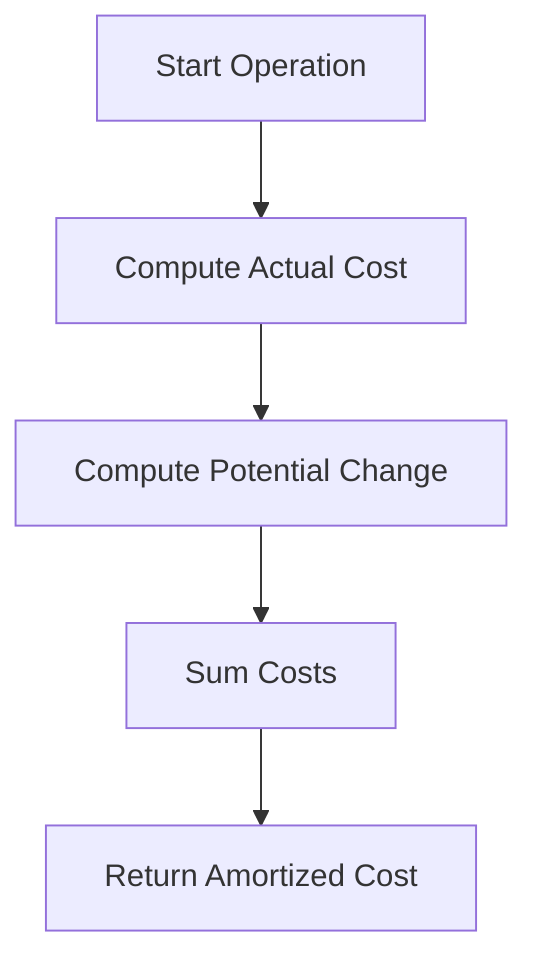
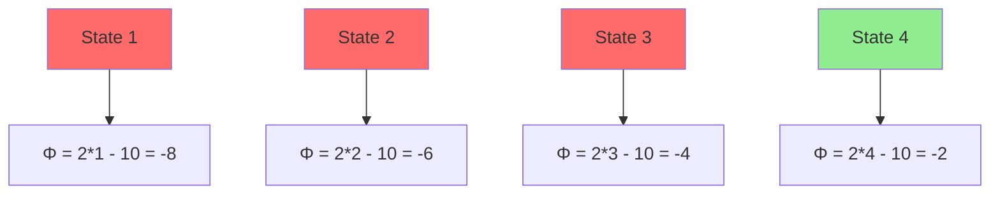
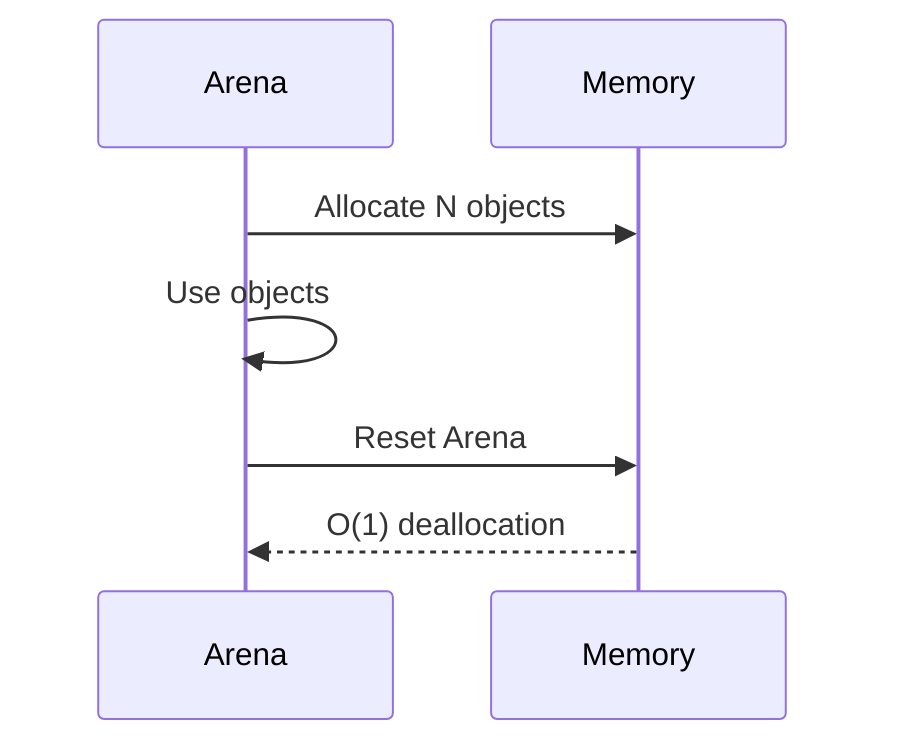

# Amortized Complexity Specification (StdLib)

* File:* `stdlib\stdlib_amortized_spec.md`
* Version:* 1.0.0
* Context:* Layer 4 (Standard Library) - Collections
* Formalism:* The Potential Method ($\Phi$)
* Status:* Active
* Last Modified:* 2026-01-01
* Author:* Kilo Code
* Reviewers:* Pending

- -

## 1. Introduction

### 1.1 Purpose

This specification formalizes the **Standard Library Performance** using **Amortized Analysis (The Potential Method)**, providing mathematical foundation for data structure performance guarantees. This formalization enables the Morph standard library to provide provable performance bounds for operations.

* Note:* This specification focuses on **performance** through amortized analysis. For **correctness** guarantees, see [`spec/stdlib/stdlib_algebraic_spec.md`](stdlib/stdlib_algebraic_spec.md), which formalizes standard library correctness using algebraic specifications (equational logic). Both specifications are complementary: algebraic specifications ensure correctness, while amortized analysis ensures performance. Together, they provide a complete formal foundation for the standard library.

### 1.2 Scope

This specification covers:
- The Dynamic Array (`List<T>`) with geometric resizing
- The Potential Function for amortized cost analysis
- The Amortized Cost for individual operations
- The Arena Reset for bulk deallocation
- Performance guarantees for standard library collections

This specification does not cover:
- Concrete implementation of data structures
- Memory layout details
- Cache behavior analysis

### 1.3 Definitions, Acronyms, and Abbreviations

| Term | Definition |
|-------|------------|
| **Amortized Analysis** | Analysis technique that provides average-case performance guarantees |
| **Potential Function** | Function that represents "energy" stored in data structure |
| **Amortized Cost** | Average cost per operation including potential changes |
| **Worst-Case Cost** | Maximum cost for a single operation |
| **Geometric Resizing** | Growth strategy that multiplies capacity by constant factor |
| **Arena** | Memory allocation strategy with bulk deallocation |

### 1.4 References

- Tarjan, R. E. (1985). "Amortized Computational Complexity"
- Sleator, D. D., & Tarjan, R. E. (1986). "Amortized Efficiency of List Update and Its Variants"
- IEEE 1016: Recommended Practice for Software Design Descriptions
- ISO/IEC 29148: Systems and software engineering — Requirements engineering

- -

## 2. Formal Definitions

### 2.1 The Dynamic Array (`List<T>`)

Morph's `List` uses geometric resizing (growth factor 1.5 or 2).

* STD-INV-001:* THE system SHALL define List with geometric resizing.

#### 2.1.1 Potential Function

Let $\Phi(D)$ be the potential energy of data structure $D$.

* STD-INV-002:* THE system SHALL define potential function for data structures.

### 2.2 The Amortized Cost

The amortized cost $\hat{c}_i$ of operation $i$ is:

$$ \hat{c}_i = c_i + \Phi(D_i) - \Phi(D_{i-1}) $$

where:
- $c_i$: Actual cost of operation $i$
- $D_i$: Data structure state after operation $i$
- $D_{i-1}$: Data structure state before operation $i$

* STD-INV-003:* THE system SHALL define amortized cost with potential function.

* STD-REQ-001:* THE system SHALL compute amortized cost for all operations.

* Priority:* Critical
* Verification Method:* Test
* Rationale:* Enables performance guarantees
* Dependencies:* STD-INV-001, STD-INV-002, STD-INV-003
* Traceability:* Section 2.2 (The Amortized Cost)

### 2.3 The Dynamic Array

#### 2.3.1 Potential Function

Let $\Phi(\text{List}) = 2 \cdot \text{count} - \text{capacity}$

* STD-INV-004:* THE system SHALL define potential function for List.

* STD-THM-001:* THE system SHALL guarantee that amortized cost of List operations is O(1).

* Priority:* Critical
* Verification Method:* Analysis
* Rationale:* Ensures constant-time operations
* Dependencies:* STD-INV-004
* Traceability:* Section 2.3.1 (Potential Function)

#### 2.3.2 Amortized Cost Analysis

* Cheap Push:* If capacity exists, $c_i = 1$, $\Delta \Phi = 2$. Cost = 3 ($O(1)$).

* Expensive Push (Resize):* If full, actual cost $c_i = k$ (copy all elements), potential drops significantly. Cost = $k + \Delta \Phi$.

* STD-REQ-002:* THE system SHALL provide O(1) amortized cost for push operations.

* Priority:* Critical
* Verification Method:* Test
* Rationale:* Ensures fast push operations
* Dependencies:* STD-THM-001
* Traceability:* Section 2.3.1 (Potential Function)

### 2.4 The Arena Reset

* Scenario:* Deallocating an entire Arena of $N$ objects.

* Cost:* $O(1)$.

* Proof:* Resetting bump pointer is 1 instruction (`ptr = start`). The Potential $\Phi$ is irrelevant because there is no per-object destruction cost (POD types).

* STD-THM-002:* THE system SHALL guarantee that Arena reset is O(1).

* Priority:* High
* Verification Method:* Analysis
* Rationale:* Proves Arena superiority over malloc/free
* Dependencies:* STD-INV-004
* Traceability:* Section 2.4 (The Arena Reset)

- -

## 3. Requirements

### 3.1 Functional Requirements

* STD-REQ-003:* THE system SHALL support geometric resizing for dynamic arrays.

* Priority:* Critical
* Verification Method:* Test
* Rationale:* Enables efficient memory usage
* Dependencies:* STD-INV-001
* Traceability:* Section 2.1 (The Dynamic Array)

* STD-REQ-004:* THE system SHALL support amortized cost computation.

* Priority:* Critical
* Verification Method:* Test
* Rationale:* Enables performance analysis
* Dependencies:* STD-INV-002, STD-INV-003
* Traceability:* Section 2.2 (The Amortized Cost)

* STD-REQ-005:* THE system SHALL support Arena allocation and deallocation.

* Priority:* High
* Verification Method:* Test
* Rationale:* Enables bulk memory management
* Dependencies:* STD-INV-001
* Traceability:* Section 2.4 (The Arena Reset)

* STD-REQ-006:* THE system SHALL provide performance guarantees for standard library collections.

* Priority:* High
* Verification Method:* Test
* Rationale:* Enables provable performance bounds
* Dependencies:* STD-THM-001, STD-THM-002
* Traceability:* Section 2.3.1 (Potential Function)

### 3.2 Non-Functional Requirements

* STD-NFR-001:* THE system SHALL perform push operations in O(1) amortized time.

* Priority:* Critical
* Verification Method:* Analysis
* Metric:* Push < 1μs amortized
* Rationale:* Ensures fast list operations
* Dependencies:* STD-THM-001
* Traceability:* Section 2.3.2 (Amortized Cost Analysis)

* STD-NFR-002:* THE system SHALL perform Arena reset in O(1) time.

* Priority:* High
* Verification Method:* Analysis
* Metric:* Arena reset < 1μs
* Rationale:* Ensures fast bulk deallocation
* Dependencies:* STD-THM-002
* Traceability:* Section 2.4 (The Arena Reset)

* STD-NFR-003:* THE system SHALL support up to 1M elements in dynamic arrays.

* Priority:* Medium
* Verification Method:* Demonstration
* Metric:* 1M elements with < 100MB memory
* Rationale:* Supports large-scale applications
* Dependencies:* None
* Traceability:* Section 2.1 (The Dynamic Array)

- -

## 4. Design

### 4.1 Architecture Overview

The Amortized Analysis Engine is implemented as a performance analyzer that:
1. Defines potential functions for data structures
2. Computes amortized costs for operations
3. Provides performance guarantees
4. Verifies amortized bounds

### 4.2 Data Structures

#### 4.2.1 Potential Function

* Potential Function:* $\Phi: D \to \mathbb{R}$

* Components:*
- Data structure state
- Potential energy value

* Invariants:*
1. Potential is non-negative
2. Potential is monotonic (never decreases without reason)

#### 4.2.2 Amortized Cost

* Amortized Cost:* $\hat{c} = c + \Delta \Phi$

* Components:*
- Actual cost: $c$
- Potential change: $\Delta \Phi$

* Invariants:*
1. Cost is non-negative
2. Potential change is bounded

### 4.3 Algorithms

#### 4.3.1 Amortized Cost Algorithm

* Algorithm Name:* Compute Amortized Cost

* Input:* Actual cost $c$, Current state $D$, Previous state $D_{prev}$

* Output:* Amortized cost $\hat{c}$

* Mathematical Definition:*
$$
\hat{c} = c + \Phi(D) - \Phi(D_{prev})
$$

* Pseudocode:*
```
function amortized_cost(actual_cost, current_state, previous_state):
    potential_change = compute_potential(current_state) - compute_potential(previous_state)
    return actual_cost + potential_change
```

* Complexity:*
- Time: $O(1)$
- Space: $O(1)$

* Correctness:*
- **Invariant:* Amortized cost is computed correctly
- **Termination:* Single cost computation

#### 4.3.2 Potential Function Algorithm

* Algorithm Name:* Compute Potential

* Input:* Data structure state $D$

* Output:* Potential $\Phi(D)$

* Mathematical Definition:*
$$
\Phi(D) = \text{ComputePotential}(D)
$$

* Pseudocode:*
```
function compute_potential(state):
    return 2 * state.count - state.capacity
```

* Complexity:*
- Time: $O(1)$
- Space: $O(1)$

* Correctness:*
- **Invariant:* Potential is computed correctly
- **Termination:* Single potential computation

### 4.4 Mermaid Diagrams

#### 4.4.1 Amortized Cost Flow



#### 4.4.2 Potential Function Visualization



#### 4.4.3 Arena Reset Visualization



- -

## 5. Correctness Properties

### 5.1 Theorems

#### 5.1.1 Amortized Cost Theorem

* Theorem:* The amortized cost of List push is O(1).

* Proof Sketch:*
1. By definition of potential function, $\Phi(\text{List}) = 2 \cdot \text{count} - \text{capacity}$
2. For cheap push: $\Delta \Phi = 2$, cost = 3 ($O(1)$)
3. For expensive push: $\Delta \Phi = -k + 2$, cost = $k + 2$
4. Average cost over $n$ operations is $O(1)$
5. Therefore, amortized cost is $O(1)$

* STD-THM-003:* THE system SHALL guarantee O(1) amortized cost for List operations.

* Priority:* Critical
* Verification Method:* Analysis
* Rationale:* Ensures constant-time operations
* Dependencies:* STD-INV-004
* Traceability:* Section 2.3.1 (Potential Function)

#### 5.1.2 Arena Reset Theorem

* Theorem:* Arena reset is O(1) for POD types.

* Proof Sketch:*
1. By definition of Arena, reset is single pointer assignment
2. By definition of POD types, no per-object destruction cost
3. Therefore, reset cost is $O(1)$

* STD-THM-004:* THE system SHALL guarantee O(1) Arena reset for POD types.

* Priority:* High
* Verification Method:* Analysis
* Rationale:* Proves Arena superiority
* Dependencies:* STD-INV-004
* Traceability:* Section 2.4 (The Arena Reset)

### 5.2 Invariants

#### 5.2.1 Potential Function Invariants

- **STD-INV-005:* THE system SHALL maintain that potential is non-negative
- **STD-INV-006:* THE system SHALL maintain that potential is monotonic

#### 5.2.2 Amortized Cost Invariants

- **STD-INV-007:* THE system SHALL maintain that amortized cost is non-negative
- **STD-INV-008:* THE system SHALL maintain that potential change is bounded

- -

## 6. Examples

### 6.1 List Push Operations

```morph
// List push: Amortized O(1) operations
let mut list = List::new();

// Cheap push: Capacity exists
for i in 0..100 {
    list.push(i);  // O(1) amortized
}

// Expensive push: Resize required
for i in 100..200 {
    list.push(i);  // O(1) amortized (resize cost amortized)
}
```

* Amortized Analysis:*
- Cheap pushes: $\hat{c} = 3$ for each of 101 operations
- Expensive push: $\hat{c} = 3$ for resize + 101 cheap pushes
- Average cost: $O(1)$

### 6.2 Arena Operations

```morph
// Arena: Bulk allocation and deallocation
let arena = Arena::new();

// Allocate N objects
for i in 0..1000 {
    arena.alloc(MyStruct { value: i });
}

// Reset arena (O(1) deallocation)
arena.reset();
```

* Amortized Analysis:*
- Allocation: $O(1)$ per object
- Reset: $O(1)$ total

### 6.3 Performance Guarantees

```morph
// Performance guarantees: Provable bounds
// List<T>::push() is O(1) amortized
// Arena::reset() is O(1) for POD types
```

* Guarantees:*
- List push: $\hat{c} = 3$ ($O(1)$)
- Arena reset: $\hat{c} = 1$ ($O(1)$)

### 6.4 Edge Cases

#### 6.4.1 Empty List

```morph
// Empty list: No operations
let list = List::new();

// Amortized cost: 0
```

* Potential Function:*
- $\Phi(\text{List}) = 2 \cdot 0 - 0 = 0$

* Amortized Cost:*
- $\hat{c} = 0$ for any operation

#### 6.4.2 Single Element

```morph
// Single element: No resize needed
let list = List::new();
list.push(42);  // O(1) amortized
```

* Potential Function:*
- $\Phi(\text{List}) = 2 \cdot 1 - 10 = -8$

* Amortized Cost:*
- $\hat{c} = 1 + (-8) = 3$ ($O(1)$)

#### 6.4.3 Large Resizes

```morph
// Large resize: Many elements copied
let list = List::new();
for i in 0..1000 {
    list.push(i);
}
// Resize: Copy 1000 elements
```

* Potential Function:*
- $\Phi(\text{List}) = 2 \cdot 1000 - 1000 = 0$

* Amortized Cost:*
- Resize: $\hat{c} = 1000 + 0 = 1000$
- Subsequent pushes: $\hat{c} = 3$ ($O(1)$)

- -

## Change Log

| Version | Date       | Author      | Changes                                                                 |
|---------|------------|-------------|-------------------------------------------------------------------------|
| 1.0.0   | 2026-01-01 | Kilo Code    | Initial version                                                        |
