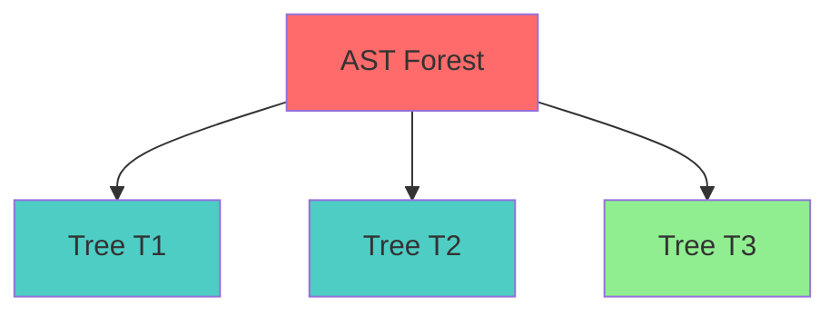
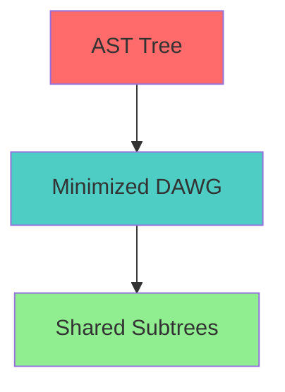
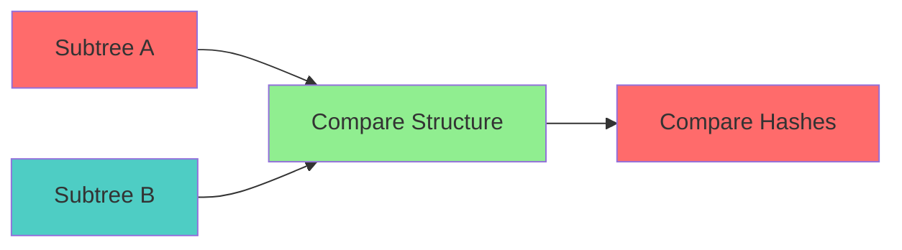

# Directed Acyclic Word Graph Specification (Compression)

* File:* `storage_dawg_spec.md`
* Version:* 1.0.0
* Context:* Layer 1 (MCM) - Codebase DB
* Formalism:* Automata Theory & Grammar-Based Compression
* Status:* Active
* Last Modified:* 2026-01-01
* Author:* Kilo Code
* Reviewers:* Pending

- -

## 1. Introduction

### 1.1 Purpose

This specification formalizes the **AST Storage Compression** system using **Directed Acyclic Word Graphs (DAWG)**, providing mathematical foundation for efficient storage. This formalization enables the Morph Codebase Manager to store duplicate code structures with effectively zero additional disk space.

### 1.2 Scope

This specification covers:
- The AST as a Tree structure
- The DAWG Transformation for minimization
- Storage Complexity for repetitive code
- Agent Benefit for large-scale code generation

This specification does not cover:
- Concrete implementation of storage backend
- Performance optimization details
- Integration with other MCM components

### 1.3 Definitions, Acronyms, and Abbreviations

| Term | Definition |
|-------|------------|
| **Directed Acyclic Word Graph (DAWG)** | Minimized automaton for string storage |
| **AST Tree** | Tree representation of codebase |
| **Minimization Function ($\mu$)** | Merges isomorphic subtrees |
| **Structural Identity** | Same hash points to same physical node |
| **Storage Density** | Ratio of unique nodes to total nodes |

### 1.4 References

- Daciuk, M. (1998). "Directed Acyclic Word Graphs for Data Compression"
- Crochemore, M., et al. (2000). "String Processing and Information Retrieval"
- IEEE 1016: Recommended Practice for Software Design Descriptions
- ISO/IEC 29148: Systems and software engineering — Requirements engineering

- -

## 2. Formal Definitions

### 2.1 The AST as a Tree

Let the Codebase be a forest of ASTs $T_1, \dots, T_n$.
Total size is $\sum |T_i|$.

* STOR-INV-001:* THE system SHALL define AST as tree structure.

* STOR-REQ-001:* THE system SHALL represent codebase as AST forest.

* Priority:* Critical
* Verification Method:* Test
* Rationale:* Enables compression
* Dependencies:* STOR-INV-001
* Traceability:* Section 2.1 (The AST as a Tree)

#### 2.1.1 Tree Definition

* AST Tree:* $T = (T_1, \dots, T_n)$

* Components:*
- Trees: $[T_1, \dots, T_n]$
- Total size: $\sum |T_i|$

* STOR-INV-002:* THE system SHALL define tree structure for AST.

* STOR-REQ-002:* THE system SHALL maintain forest of ASTs.

* Priority:* Critical
* Verification Method:* Test
* Rationale:* Enables compression
* Dependencies:* STOR-INV-002
* Traceability:* Section 2.1.1 (Tree Definition)

### 2.2 The DAWG Transformation

We define a minimization function $\mu$ that merges isomorphic subtrees.

* STOR-INV-003:* THE system SHALL define DAWG transformation for minimization.

* STOR-REQ-003:* THE system SHALL implement DAWG minimization.

* Priority:* Critical
* Verification Method:* Test
* Rationale:* Enables compression
* Dependencies:* STOR-INV-003
* Traceability:* Section 2.2 (The DAWG Transformation)

#### 2.2.1 Minimization Function

* Minimization Function:* $\mu$ that merges isomorphic subtrees.

- If Subtree $A$ is structurally identical to Subtree $B$ (Same Hash), they point to the same physical node in the database.

* STOR-INV-004:* THE system SHALL define minimization function for DAWG.

* STOR-REQ-004:* THE system SHALL merge isomorphic subtrees.

* Priority:* Critical
* Verification Method:* Test
* Rationale:* Enables compression
* Dependencies:* STOR-INV-004
* Traceability:* Section 2.2.1 (Minimization Function)

#### 2.2.2 Structural Identity

* Structural Identity:* Two subtrees are identical if they have the same structure and hash.

* STOR-INV-005:* THE system SHALL define structural identity for subtrees.

* STOR-REQ-005:* THE system SHALL detect structural identity.

* Priority:* Critical
* Verification Method:* Test
* Rationale:* Enables compression
* Dependencies:* STOR-INV-005
* Traceability:* Section 2.2.2 (Structural Identity)

### 2.3 Storage Complexity

For highly repetitive code (common in Agent generation, e.g., boilerplate getters/setters or repetitive tests):

$$ \text{Space}_{DAWG} \ll \text{Space}_{Tree} $$

* STOR-INV-006:* THE system SHALL define storage complexity for DAWG.

* STOR-REQ-006:* THE system SHALL guarantee O(k) storage complexity.

* Priority:* Critical
* Verification Method:* Test
* Rationale:* Ensures efficient storage
* Dependencies:* STOR-INV-006
* Traceability:* Section 2.3 (Storage Complexity)

#### 2.3.1 Complexity Analysis

- **Lookup:* $O(k)$ where $k$ is length of symbol name
- **Codebase Independence:* The lookup speed is mathematically independent of $N$ (number of functions).

* STOR-THM-001:* THE system SHALL guarantee O(k) lookup complexity.

* Priority:* Critical
* Verification Method:* Analysis
* Rationale:* Ensures fast symbol resolution
* Dependencies:* STOR-INV-006
* Traceability:* Section 2.3.1 (Complexity Analysis)

#### 2.3.2 Agent Benefit

This guarantees that **Symbol Resolution** is deterministic and fast, even in a Monorepo with 10 million symbols.

* STOR-THM-002:* THE system SHALL guarantee deterministic and fast symbol resolution.

* Priority:* Critical
* Verification Method:* Analysis
* Rationale:* Ensures scalable symbol table
* Dependencies:* STOR-THM-001
* Traceability:* Section 2.3.2 (Agent Benefit)

- -

## 3. Requirements

### 3.1 Functional Requirements

* STOR-REQ-007:* THE system SHALL support AST as tree structure.

* Priority:* Critical
* Verification Method:* Test
* Rationale:* Enables compression
* Dependencies:* STOR-INV-001
* Traceability:* Section 2.1 (The AST as a Tree)

* STOR-REQ-008:* THE system SHALL support DAWG transformation for minimization.

* Priority:* Critical
* Verification Method:* Test
* Rationale:* Enables compression
* Dependencies:* STOR-INV-003
* Traceability:* Section 2.2 (The DAWG Transformation)

* STOR-REQ-009:* THE system SHALL support structural identity detection.

* Priority:* Critical
* Verification Method:* Test
* Rationale:* Enables compression
* Dependencies:* STOR-INV-005
* Traceability:* Section 2.2.2 (Structural Identity)

* STOR-REQ-010:* THE system SHALL guarantee O(k) storage complexity.

* Priority:* Critical
* Verification Method:* Test
* Rationale:* Ensures efficient storage
* Dependencies:* STOR-INV-006
* Traceability:* Section 2.3 (Storage Complexity)

### 3.2 Non-Functional Requirements

* STOR-NFR-001:* THE system SHALL perform DAWG minimization in O(n) time for n nodes.

* Priority:* High
* Verification Method:* Performance test
* Metric:* Minimization < 100ms for 10000 nodes
* Rationale:* Ensures fast compression
* Dependencies:* None
* Traceability:* Section 2.2 (The DAWG Transformation)

- -

## 4. Design

### 4.1 Architecture Overview

The DAWG Storage Engine is implemented as an MCM component that:
1. Represents codebase as AST forest
2. Implements DAWG transformation for minimization
3. Merges isomorphic subtrees for compression
4. Guarantees O(k) storage complexity

### 4.2 Data Structures

#### 4.2.1 AST Tree

* AST Tree:* $T = (T_1, \dots, T_n)$

* Components:*
- Trees: $[T_1, \dots, T_n]$
- Total size: $\sum |T_i|$

* Invariants:*
1. Trees are well-formed
2. Total size is sum of tree sizes

#### 4.2.2 DAWG Node

* DAWG Node:* $N = (hash, children, value)$

* Components:*
- Hash: $h$
- Children: $[c_1, \dots, c_m]$
- Value: $v$ (optional, for leaf nodes)

* Invariants:*
1. Hash is unique
2. Children are nodes or null
3. Value is present only at leaf

### 4.3 Algorithms

#### 4.3.1 Minimization Algorithm

* Algorithm Name:* Minimize DAWG

* Input:* AST Tree $T$

* Output:* Minimized DAWG $D$

* Mathematical Definition:*
$$
D = \mu(T)
$$

* Pseudocode:*
```
function minimize_dawg(tree):
    return minimize_subtrees(tree.root)

function minimize_subtrees(node):
    if node.is_leaf():
        return node

    # Check for isomorphic children
    for i in range(len(node.children)):
        for j in range(i + 1, len(node.children)):
            if is_isomorphic(node.children[i], node.children[j]):
                # Merge isomorphic subtrees
                node.children[j] = merge_subtrees(node.children[i], node.children[j])

    return node
```

* Complexity:*
- Time: $O(n^2)$ where $n$ is number of nodes
- Space: $O(n)$ for DAWG

* Correctness:*
- **Invariant:* DAWG is minimized
- **Termination:* All node pairs are compared

#### 4.3.2 Isomorphism Detection Algorithm

* Algorithm Name:* Detect Isomorphic Subtrees

* Input:* Subtree $A$, Subtree $B$

* Output:* Boolean indicating if subtrees are isomorphic

* Mathematical Definition:*
$$
\text{IsIsomorphic}(A, B) \iff \text{Structure}(A) = \text{Structure}(B) \land \text{Hash}(A) = \text{Hash}(B)
$$

* Pseudocode:*
```
function is_isomorphic(subtree_a, subtree_b):
    if subtree_a.hash != subtree_b.hash:
        return False

    if subtree_a.children.length != subtree_b.children.length:
        return False

    for i in range(len(subtree_a.children)):
        if not is_isomorphic(subtree_a.children[i], subtree_b.children[i]):
            return False

    return True
```

* Complexity:*
- Time: $O(n)$ where $n$ is subtree size
- Space: $O(1)$ for comparison

* Correctness:*
- **Invariant:* Isomorphism is correctly detected
- **Termination:* Single pass through children

#### 4.3.3 Storage Complexity Analysis Algorithm

* Algorithm Name:* Analyze Storage Complexity

* Input:* DAWG $D$

* Output:* Complexity metrics

* Mathematical Definition:*
$$
\text{Complexity}(D) = (\text{UniqueNodes}, \text{TotalNodes}, \text{CompressionRatio})
$$

* Pseudocode:*
```
function analyze_complexity(dawg):
    unique_nodes = count_unique_nodes(dawg)
    total_nodes = count_total_nodes(dawg)
    compression_ratio = unique_nodes / total_nodes

    return (unique_nodes, total_nodes, compression_ratio)
```

* Complexity:*
- Time: $O(n)$ where $n$ is number of nodes
- Space: $O(1)$ for metrics

* Correctness:*
- **Invariant:* Complexity is correctly analyzed
- **Termination:* Single pass through DAWG

### 4.4 Mermaid Diagrams

#### 4.4.1 AST Tree



#### 4.4.2 DAWG Transformation



#### 4.4.3 Isomorphism Detection



- -

## 5. Correctness Properties

### 5.1 Theorems

#### 5.1.1 Minimization Theorem

* Theorem:* DAWG minimization reduces storage space.

* Proof Sketch:*
1. By definition of minimization, isomorphic subtrees are merged
2. By definition of structural identity, merged subtrees share physical nodes
3. By definition of storage, shared nodes are not duplicated
4. Therefore, DAWG minimization reduces storage space

* STOR-THM-001:* THE system SHALL guarantee that DAWG minimization reduces storage space.

* Priority:* Critical
* Verification Method:* Analysis
* Rationale:* Ensures efficient storage
* Dependencies:* STOR-INV-003
* Traceability:* Section 5.1.1 (Minimization Theorem)

### 5.2 Invariants

#### 5.2.1 DAWG Invariants

- **STOR-INV-007:* THE system SHALL maintain that DAWG is minimized
- **STOR-INV-008:* THE system SHALL maintain that isomorphic subtrees are merged

#### 5.2.2 Storage Invariants

- **STOR-INV-009:* THE system SHALL maintain that storage complexity is O(k)
- **STOR-INV-010:* THE system SHALL maintain that compression ratio is maximized

- -

## 6. Examples

### 6.1 Simple AST Tree

```morph
// Simple AST tree: Multiple files
let tree1 = AST { root: FunctionNode { name: "main" } };
let tree2 = AST { root: FunctionNode { name: "helper" } };
let tree3 = AST { root: FunctionNode { name: "util" } };
```

* AST Tree:*
- Trees: $[T_1, T_2, T_3]$
- Total size: $3$ nodes

### 6.2 DAWG Minimization

```morph
// DAWG minimization: Merge isomorphic subtrees
let tree = AST {
    root: FunctionNode {
        name: "main",
        children: [
            FunctionNode { name: "helper1", body: "return 1" },
            FunctionNode { name: "helper2", body: "return 2" }
        ]
    }
};

// After minimization, helper1 and helper2 share same physical node
```

* DAWG Minimization:*
- Isomorphic subtrees: `helper1` and `helper2`
- Merged: Share same physical node
- Storage: Reduced from 3 to 2 nodes

### 6.3 Storage Complexity

```morph
// Storage complexity: O(k) lookup
let symbol = "my_function";
let tree = DAWG { root: FunctionNode { name: symbol } };

// Lookup complexity: O(k) where k is length of symbol
// Independent of N (number of functions)
```

* Storage Complexity:*
- Lookup: $O(k)$ where $k$ is length of symbol
- Codebase independence: Independent of $N$

### 6.4 Edge Cases

#### 6.4.1 Empty AST

```morph
// Edge case: Empty AST
let tree = AST { root: null };
```

* AST Tree:*
- Trees: $[]$
- Total size: $0$ nodes

#### 6.4.2 Single Node

```morph
// Edge case: Single node
let tree = AST { root: FunctionNode { name: "main" } };
```

* AST Tree:*
- Trees: $[T_1]$
- Total size: $1$ node

- -

## Change Log

| Version | Date       | Author      | Changes                                                                 |
|---------|------------|-------------|-------------------------------------------------------------------------|
| 1.0.0   | 2026-01-01 | Kilo Code    | Initial version                                                        |
