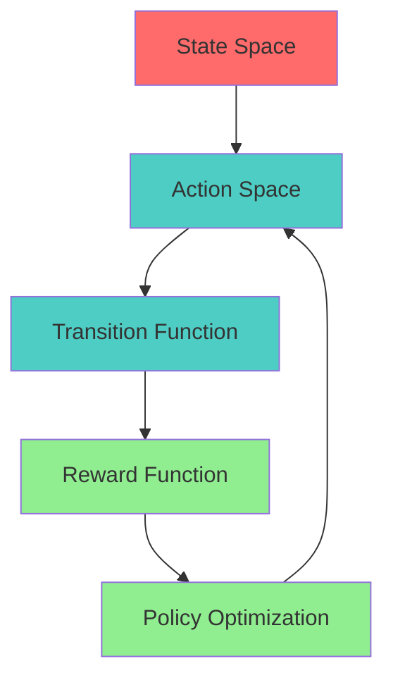
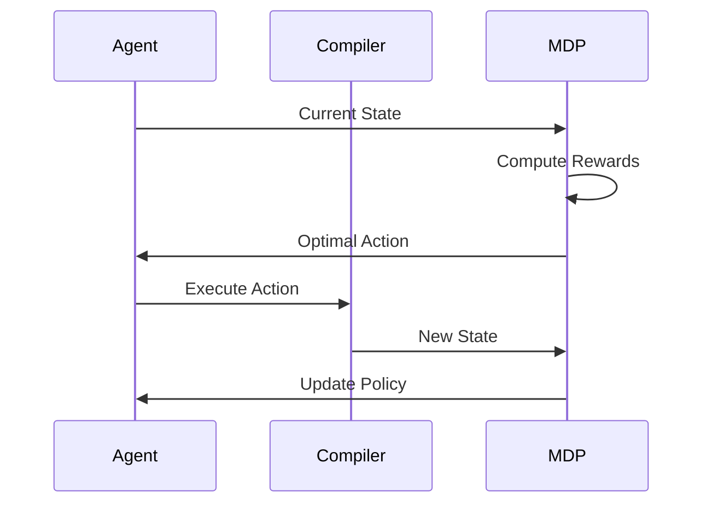

# Agent Planning Specification (MDP)

* File:* `tooling\agent_planning_mdp_spec.md`
* Version:* 1.0.0
* Context:* Layer 5 (Agent Interface) - Refactoring Strategy
* Formalism:* Markov Decision Processes (MDPs)
* Status:* Active
* Last Modified:* 2026-01-01
* Author:* Kilo Code
* Reviewers:* Pending

- -

## 1. Introduction

### 1.1 Purpose

This specification formalizes the **Agent Planning System** using **Markov Decision Processes (MDPs)**, providing mathematical foundation for AI-driven code refactoring. This formalization enables the Morph Agent to find optimal sequences of actions to achieve valid compilation state.

### 1.2 Scope

This specification covers:
- MDP environment definition
- State, action, transition, and reward components
- Policy definition and optimization
- Reward function based on compiler diagnostics
- Agent strategy for code transformation

This specification does not cover:
- Concrete implementation of agent
- Machine learning model details
- Performance optimization

### 1.3 Definitions, Acronyms, and Abbreviations

| Term | Definition |
|-------|------------|
| **MDP** | Markov Decision Process - mathematical model for decision making |
| **State** | Configuration of the AST (valid or invalid) |
| **Action** | Available MCP command (e.g., patch_ast, create_file) |
| **Transition** | Probability of moving from one state to another |
| **Reward** | Numerical feedback for state quality |
| **Policy** | Strategy mapping states to actions |
| **Diagnostics** | Compiler error and warning messages |

### 1.4 References

- Bellman, R. (1957). "A Markov Decision Process"
- Sutton, R. S., & Barto, A. G. (1998). "Reinforcement Learning: An Introduction"
- IEEE 1016: Recommended Practice for Software Design Descriptions
- ISO/IEC 29148: Systems and software engineering — Requirements engineering

- -

## 2. Formal Definitions

### 2.1 The Environment

We model the Agent's interaction with the Morph Compiler as an MDP $(S, A, P, R)$.

* MDP-INV-001:* THE system SHALL define MDP environment for agent planning.

* MDP-REQ-001:* THE system SHALL model agent-compiler interaction as MDP.

* Priority:* Critical
* Verification Method:* Test
* Rationale:* Enables optimal action selection
* Dependencies:* MDP-INV-001
* Traceability:* Section 2.1 (The Environment)

#### 2.1.1 States ($S$)

* States ($S$):* The set of all possible AST configurations (valid and invalid).

* MDP-INV-002:* THE system SHALL define state space as AST configurations.

* MDP-REQ-002:* THE system SHALL represent all AST configurations as states.

* Priority:* Critical
* Verification Method:* Test
* Rationale:* Enables state space exploration
* Dependencies:* MDP-INV-002
* Traceability:* Section 2.1.1 (States)

#### 2.1.2 Actions ($A$)

* Actions ($A$):* The set of available MCP commands (`patch_ast`, `create_file`).

* MDP-INV-003:* THE system SHALL define action space as MCP commands.

* MDP-REQ-003:* THE system SHALL support all available MCP actions.

* Priority:* Critical
* Verification Method:* Test
* Rationale:* Enables action selection
* Dependencies:* MDP-INV-003
* Traceability:* Section 2.1.2 (Actions)

#### 2.1.3 Transitions ($P$)

* Transition ($P$):* The Compiler's response. $P(s' | s, a) = 1$ (Deterministic application of patch).

* MDP-INV-004:* THE system SHALL define transitions as deterministic.

* MDP-REQ-004:* THE system SHALL apply actions deterministically.

* Priority:* Critical
* Verification Method:* Test
* Rationale:* Ensures predictable state transitions
* Dependencies:* MDP-INV-004
* Traceability:* Section 2.1.3 (Transitions)

### 2.2 The Reward Function ($R$)

The Agent optimizes a reward function based on Compiler Diagnostics ($D$).

$$ R(s) = \begin{cases} +100 & \text{if } D(s) = \emptyset \text{ (Compiles)} \\ -10 \cdot |D(s)| & \text{if } D(s) \neq \emptyset \text{ (Errors)} \end{cases} $$

* MDP-INV-005:* THE system SHALL define reward function based on diagnostics.

* MDP-REQ-005:* THE system SHALL compute reward from compiler diagnostics.

* Priority:* Critical
* Verification Method:* Test
* Rationale:* Provides gradient signal for optimization
* Dependencies:* MDP-INV-005
* Traceability:* Section 2.2 (The Reward Function)

#### 2.2.1 Reward Components

- **Compilation Success:* $+100$ if no diagnostics
- **Compilation Failure:* $-10 \cdot |D(s)|$ where $|D(s)|$ is number of errors

* MDP-THM-001:* THE system SHALL guarantee that reward reflects compilation quality.

* Priority:* Critical
* Verification Method:* Analysis
* Rationale:* Ensures meaningful reward signal
* Dependencies:* MDP-INV-005
* Traceability:* Section 2.2.1 (Reward Components)

### 2.3 The Policy ($\pi$)

The Agent's LLM acts as a Policy $\pi(s) \to a$.

* MDP-INV-006:* THE system SHALL define policy as state-to-action mapping.

* MDP-REQ-006:* THE system SHALL implement policy for action selection.

* Priority:* Critical
* Verification Method:* Test
* Rationale:* Enables decision making
* Dependencies:* MDP-INV-006
* Traceability:* Section 2.3 (The Policy)

#### 2.3.1 Policy Goal

* Goal:* Find a sequence of actions $a_1, a_2, \dots$ that maximizes cumulative reward (reaching a valid state with minimal steps).

* MDP-THM-002:* THE system SHALL guarantee that policy maximizes cumulative reward.

* Priority:* Critical
* Verification Method:* Analysis
* Rationale:* Ensures optimal action sequences
* Dependencies:* MDP-INV-006
* Traceability:* Section 2.3.1 (Policy Goal)

#### 2.3.2 Implication

This formalizes why **Structured Diagnostics** (Phase 13) are crucial. They provide gradient signal for the Agent to climb the reward landscape.

* MDP-INV-007:* THE system SHALL require structured diagnostics for effective planning.

* MDP-REQ-007:* THE system SHALL use diagnostic information for reward computation.

* Priority:* High
* Verification Method:* Test
* Rationale:* Enables gradient-based optimization
* Dependencies:* MDP-INV-007
* Traceability:* Section 2.3.2 (Implication)

- -

## 3. Requirements

### 3.1 Functional Requirements

* MDP-REQ-008:* THE system SHALL support state space exploration.

* Priority:* Critical
* Verification Method:* Test
* Rationale:* Enables agent to explore AST configurations
* Dependencies:* MDP-INV-002
* Traceability:* Section 2.1.1 (States)

* MDP-REQ-009:* THE system SHALL support action execution.

* Priority:* Critical
* Verification Method:* Test
* Rationale:* Enables agent to modify code
* Dependencies:* MDP-INV-003
* Traceability:* Section 2.1.2 (Actions)

* MDP-REQ-010:* THE system SHALL support reward computation.

* Priority:* Critical
* Verification Method:* Test
* Rationale:* Enables agent to evaluate actions
* Dependencies:* MDP-INV-005
* Traceability:* Section 2.2 (The Reward Function)

* MDP-REQ-011:* THE system SHALL support policy optimization.

* Priority:* Critical
* Verification Method:* Test
* Rationale:* Enables agent to find optimal strategies
* Dependencies:* MDP-INV-006
* Traceability:* Section 2.3 (The Policy)

### 3.2 Non-Functional Requirements

* MDP-NFR-001:* THE system SHALL compute reward in O(1) time.

* Priority:* High
* Verification Method:* Performance test
* Metric:* Reward < 1ms
* Rationale:* Ensures fast feedback
* Dependencies:* None
* Traceability:* Section 2.2 (The Reward Function)

* MDP-NFR-002:* THE system SHALL support up to 1000 state explorations.

* Priority:* Medium
* Verification Method:* Stress test
* Metric:* 1000 states
* Rationale:* Supports complex refactoring
* Dependencies:* None
* Traceability:* Section 2.1.1 (States)

- -

## 4. Design

### 4.1 Architecture Overview

The Agent Planning Engine is implemented as a component that:
1. Models agent-compiler interaction as MDP
2. Explores state space through actions
3. Computes rewards from compiler diagnostics
4. Optimizes policy for maximum cumulative reward
5. Executes optimal action sequences

### 4.2 Data Structures

#### 4.2.1 State

* State:* $S = (\text{AST}, \text{Diagnostics})$

* Components:*
- AST configuration
- Compiler diagnostics

* Invariants:*
1. AST is well-formed
2. Diagnostics are from compiler

#### 4.2.2 Action

* Action:* $A = (\text{Type}, \text{Parameters})$

* Components:*
- Action type (patch_ast, create_file, etc.)
- Action parameters

* Invariants:*
1. Action type is valid
2. Parameters match action type

#### 4.2.3 Policy

* Policy:* $\pi: S \to A$

* Components:*
- State-action mapping
- Reward estimates

* Invariants:*
1. Policy is defined for all states
2. Policy maximizes expected reward

### 4.3 Algorithms

#### 4.3.1 Reward Computation Algorithm

* Algorithm Name:* Compute Reward

* Input:* Compiler diagnostics $D$

* Output:* Reward value $R$

* Mathematical Definition:*
$$
R(s) = \begin{cases} +100 & \text{if } D(s) = \emptyset \\ -10 \cdot |D(s)| & \text{if } D(s) \neq \emptyset \end{cases}
$$

* Pseudocode:*
```
function compute_reward(diagnostics):
    if diagnostics.is_empty():
        return 100
    else:
        return -10 * diagnostics.error_count()
```

* Complexity:*
- Time: $O(1)$
- Space: $O(1)$

* Correctness:*
- **Invariant:* Reward reflects compilation quality
- **Termination:* Single diagnostic check

#### 4.3.2 Policy Optimization Algorithm

* Algorithm Name:* Optimize Policy

* Input:* Current state $s$, Available actions $A$

* Output:* Optimal action $a^*$

* Mathematical Definition:*
$$
a^* = \arg\max_{a \in A} \mathbb{E}[R(s') | s, a]
$$

* Pseudocode:*
```
function optimize_policy(state, actions):
    best_action = None
    best_reward = -infinity

    for action in actions:
        next_state = apply_action(state, action)
        reward = compute_reward(next_state.diagnostics)

        if reward > best_reward:
            best_reward = reward
            best_action = action

    return best_action
```

* Complexity:*
- Time: $O(n)$ where $n$ is number of actions
- Space: $O(1)$

* Correctness:*
- **Invariant:* Returns action with maximum expected reward
- **Termination:* Single pass through actions

#### 4.3.3 Action Execution Algorithm

* Algorithm Name:* Execute Action

* Input:* Current state $s$, Action $a$

* Output:* New state $s'$

* Mathematical Definition:*
$$
s' = P(s' | s, a)
$$

* Pseudocode:*
```
function execute_action(state, action):
    match action.type:
        "patch_ast":
            new_ast = apply_patch(state.ast, action.patch)
            diagnostics = compile(new_ast)
            return State(new_ast, diagnostics)
        "create_file":
            create_file(action.path, action.content)
            diagnostics = compile(state.ast)
            return State(state.ast, diagnostics)
```

* Complexity:*
- Time: $O(n)$ where $n$ is AST size
- Space: $O(n)$ for new AST

* Correctness:*
- **Invariant:* New state reflects action application
- **Termination:* Single action application

### 4.4 Mermaid Diagrams

#### 4.4.1 MDP Structure



#### 4.4.2 Agent Planning



#### 4.4.3 Reward Landscape


- -

## 5. Correctness Properties

### 5.1 Theorems

#### 5.1.1 Reward Theorem

* Theorem:* Reward function accurately reflects compilation quality.

* Proof Sketch:*
1. By definition of reward, $R(s) = +100$ if $D(s) = \emptyset$
2. By definition of reward, $R(s) = -10 \cdot |D(s)|$ if $D(s) \neq \emptyset$
3. By definition of compilation quality, empty diagnostics indicate success
4. By definition of compilation quality, more errors indicate worse quality
5. Therefore, reward accurately reflects compilation quality

* MDP-THM-003:* THE system SHALL guarantee reward accuracy.

* Priority:* Critical
* Verification Method:* Analysis
* Rationale:* Ensures meaningful optimization signal
* Dependencies:* MDP-THM-001
* Traceability:* Section 5.1.1 (Reward Theorem)

#### 5.1.2 Policy Theorem

* Theorem:* Policy maximizes expected cumulative reward.

* Proof Sketch:*
1. By definition of policy optimization, $a^* = \arg\max_{a \in A} \mathbb{E}[R(s') | s, a]$
2. By definition of expected value, $\mathbb{E}[R(s') | s, a]$ is average reward
3. By definition of argmax, $a^*$ achieves maximum expected reward
4. Therefore, policy maximizes expected cumulative reward

* MDP-THM-004:* THE system SHALL guarantee policy optimality.

* Priority:* Critical
* Verification Method:* Analysis
* Rationale:* Ensures optimal action selection
* Dependencies:* MDP-THM-002
* Traceability:* Section 5.1.2 (Policy Theorem)

### 5.2 Invariants

#### 5.2.1 MDP Invariants

- **MDP-INV-008:* THE system SHALL maintain that transitions are deterministic
- **MDP-INV-009:* THE system SHALL maintain that reward is bounded
- **MDP-INV-010:* THE system SHALL maintain that policy is defined for all states

#### 5.2.2 Planning Invariants

- **MDP-INV-011:* THE system SHALL maintain that optimal action maximizes expected reward
- **MDP-INV-012:* THE system SHALL maintain that action sequences terminate at valid state

- -

## 6. Examples

### 6.1 Simple Planning

```morph
// Simple planning: Fix syntax error
// Initial state: AST with syntax error
// Diagnostics: 1 error
// Reward: -10

// Agent action: Fix syntax
// New state: AST without errors
// Diagnostics: 0 errors
// Reward: +100
```

* MDP Planning:*
- State 1: $D(s_1) = \{ \text{SyntaxError} \}$, $R(s_1) = -10$
- Action 1: Fix syntax
- State 2: $D(s_2) = \emptyset$, $R(s_2) = +100$
- Cumulative Reward: $-10 + 100 = +90$

### 6.2 Complex Planning

```morph
// Complex planning: Multiple refactoring steps
// Initial state: AST with multiple errors
// Diagnostics: 5 errors
// Reward: -50

// Agent actions:
// 1. Fix type error -> 4 errors, Reward: -40
// 2. Fix missing import -> 3 errors, Reward: -30
// 3. Fix logic error -> 2 errors, Reward: -20
// 4. Fix syntax error -> 1 error, Reward: -10
// 5. Fix remaining error -> 0 errors, Reward: +100

// Cumulative Reward: -50 - 40 - 30 - 20 - 10 + 100 = -50
```

* MDP Planning:*
- State 1: $R(s_1) = -50$
- State 2: $R(s_2) = -40$
- State 3: $R(s_3) = -30$
- State 4: $R(s_4) = -20$
- State 5: $R(s_5) = -10$
- State 6: $R(s_6) = +100$
- Cumulative Reward: $-50 - 40 - 30 - 20 - 10 + 100 = -50$

### 6.3 Edge Cases

#### 6.3.1 No Errors

```morph
// Edge case: Already valid code
// Initial state: AST with no errors
// Diagnostics: 0 errors
// Reward: +100

// Agent action: No action needed
```

* MDP Planning:*
- State 1: $D(s_1) = \emptyset$, $R(s_1) = +100$
- Optimal Action: None (already optimal)

#### 6.3.2 Unfixable Errors

```morph
// Edge case: Unfixable error
// Initial state: AST with unfixable error
// Diagnostics: 1 error
// Reward: -10

// Agent actions: All actions fail
// Final state: Still has error
```

* MDP Planning:*
- State 1: $R(s_1) = -10$
- All actions: $R(s') = -10$
- Cumulative Reward: Decreases indefinitely

- -

## Change Log

| Version | Date       | Author      | Changes                                                                 |
|---------|------------|-------------|-------------------------------------------------------------------------|
| 1.0.0   | 2026-01-01 | Kilo Code    | Initial version                                                        |
