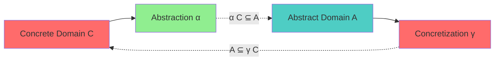
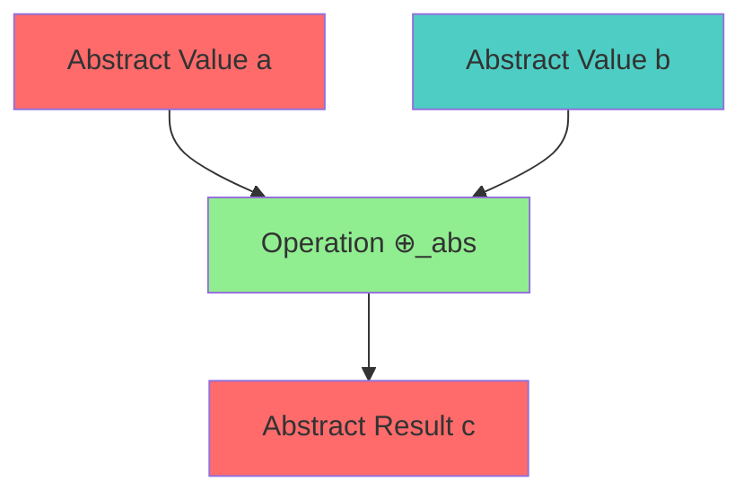
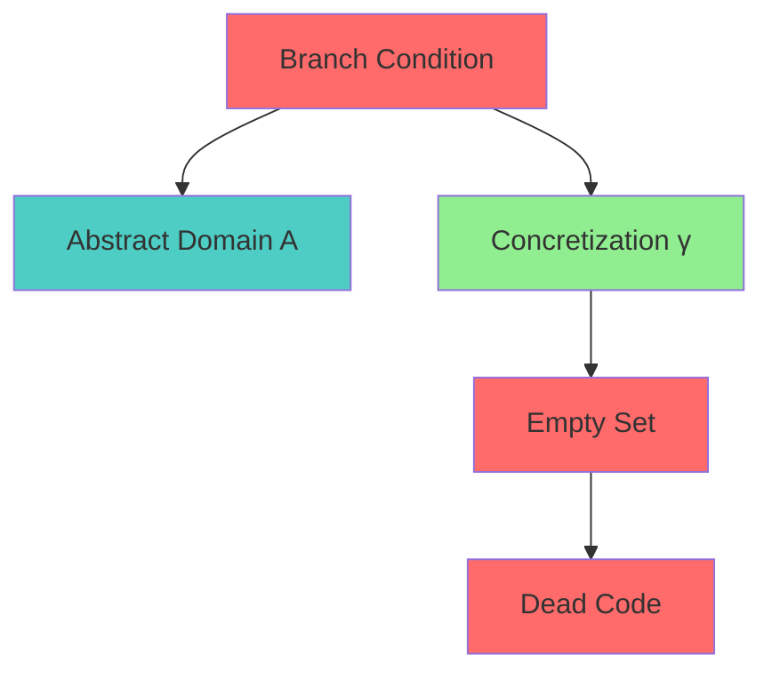

# Abstract Interpretation Specification (Analysis)

* File:* `tooling\analysis_abstract_interp_spec.md`
* Version:* 1.0.0
* Context:* Layer 2 (Compiler) - Optimization Safety
* Formalism:* Galois Connections & Lattices
* Status:* Active
* Last Modified:* 2026-01-01
* Author:* Kilo Code
* Reviewers:* Pending

- -

## 1. Introduction

### 1.1 Purpose

This specification formalizes the **Static Analysis Soundness** system using **Abstract Interpretation (Galois Connections)**, providing mathematical foundation for optimization safety. This formalization enables the Morph compiler to prove that optimizations never delete code that *might* affect program result (Soundness).

### 1.2 Scope

This specification covers:
- Concrete vs. Abstract Domains
- The Galois Connection ($\alpha, \gamma$)
- Soundness of Optimization
- Dead Code Elimination

This specification does not cover:
- Concrete implementation of abstract interpreter
- Performance optimization details
- Integration with other compiler phases

### 1.3 Definitions, Acronyms, and Abbreviations

| Term | Definition |
|-------|------------|
| **Concrete Domain ($\mathcal{C}$)** | Actual runtime values (e.g., `i32` integers) |
| **Abstract Domain ($\mathcal{A}$)** | Properties of values (e.g., Intervals `[min, max]`, Signs `+, -, 0`) |
| **Abstraction ($\alpha$)** | Maps specific values to abstract properties |
| **Concretization ($\gamma$)** | Maps abstract properties to sets of concrete values |
| **Galois Connection** | Pair of monotonic functions between domains |
| **Soundness** | Property that optimizations preserve program behavior |

### 1.4 References

- Cousot, P., & Cousot, R. (1977). "Abstract Interpretation: A Unified Lattice Model for Static Analysis of Programs by Construction or Approximation"
- IEEE 1016: Recommended Practice for Software Design Descriptions
- ISO/IEC 29148: Systems and software engineering — Requirements engineering

- -

## 2. Formal Definitions

### 2.1 Concrete vs. Abstract Domains

- **Concrete Domain ($\mathcal{C}$):* The actual runtime values (e.g., `i32` integers).
- **Abstract Domain ($\mathcal{A}$):* Properties of values (e.g., Intervals `[min, max]`, Signs `+, -, 0`).

* ANAL-INV-001:* THE system SHALL define concrete and abstract domains.

* ANAL-REQ-001:* THE system SHALL support concrete and abstract domains.

* Priority:* Critical
* Verification Method:* Test
* Rationale:* Enables abstract interpretation
* Dependencies:* ANAL-INV-001
* Traceability:* Section 2.1 (Concrete vs. Abstract Domains)

#### 2.1.1 Abstract Domain Examples

- **Intervals:* $[min, max]$ - Range of possible values
- **Signs:* $\{+, -, 0\}$ - Sign of value
- **Constants:* $\{c\}$ - Single constant value

* ANAL-INV-002:* THE system SHALL define abstract domain types.

* ANAL-REQ-002:* THE system SHALL support different abstract domain types.

* Priority:* Critical
* Verification Method:* Test
* Rationale:* Enables flexible analysis
* Dependencies:* ANAL-INV-002
* Traceability:* Section 2.1.1 (Abstract Domain Examples)

### 2.2 The Galois Connection ($\alpha, \gamma$)

We define a pair of monotonic functions:

1. **Abstraction ($\alpha$):* $\mathcal{C} \to \mathcal{A}$. (Maps specific `5` to abstract `[5, 5]`).
2. **Concretization ($\gamma$):* $\mathcal{A} \to \mathcal{P}(\mathcal{C})$. (Maps `[0, 10]` to $\{0, 1, \dots, 10\}$).

* ANAL-INV-003:* THE system SHALL define Galois connection.

* ANAL-REQ-003:* THE system SHALL define abstraction and concretization functions.

* Priority:* Critical
* Verification Method:* Test
* Rationale:* Enables abstract interpretation
* Dependencies:* ANAL-INV-003
* Traceability:* Section 2.2 (The Galois Connection)

#### 2.2.1 Galois Property

Property: $\alpha(C) \sqsubseteq A \iff C \subseteq \gamma(A)$.

* ANAL-INV-004:* THE system SHALL define Galois property.

* ANAL-REQ-004:* THE system SHALL maintain Galois property.

* Priority:* Critical
* Verification Method:* Test
* Rationale:* Ensures sound abstraction
* Dependencies:* ANAL-INV-004
* Traceability:* Section 2.2.1 (Galois Property)

### 2.3 Soundness of Optimization

The OIR Optimizer performs operations in $\mathcal{A}$ (e.g., Interval Arithmetic).

$$ \alpha(x + y) \sqsubseteq \alpha(x) \oplus_{abs} \alpha(y) $$

* ANAL-INV-005:* THE system SHALL define soundness of optimization.

* ANAL-REQ-005:* THE system SHALL perform sound optimizations.

* Priority:* Critical
* Verification Method:* Test
* Rationale:* Ensures optimization safety
* Dependencies:* ANAL-INV-005
* Traceability:* Section 2.3 (Soundness of Optimization)

#### 2.3.1 Dead Code Elimination

* Application (Dead Code):* If the Abstract Interpreter calculates the interval of a branch condition `if (x > 10)` as `[0, 5]`, then the condition is **Always False** in the Concrete domain.

* Safety:* The compiler can safely delete the `else` branch. The Galois Connection proves that no valid runtime execution could ever take that path.

* ANAL-THM-001:* THE system SHALL guarantee that dead code elimination is safe.

* Priority:* Critical
* Verification Method:* Analysis
* Rationale:* Ensures optimization safety
* Dependencies:* ANAL-INV-005
* Traceability:* Section 2.3.1 (Dead Code Elimination)

- -

## 3. Requirements

### 3.1 Functional Requirements

* ANAL-REQ-006:* THE system SHALL support concrete and abstract domains.

* Priority:* Critical
* Verification Method:* Test
* Rationale:* Enables abstract interpretation
* Dependencies:* ANAL-INV-001
* Traceability:* Section 2.1 (Concrete vs. Abstract Domains)

* ANAL-REQ-007:* THE system SHALL support Galois connection.

* Priority:* Critical
* Verification Method:* Test
* Rationale:* Enables sound abstraction
* Dependencies:* ANAL-INV-003
* Traceability:* Section 2.2 (The Galois Connection)

* ANAL-REQ-008:* THE system SHALL support sound optimization.

* Priority:* Critical
* Verification Method:* Test
* Rationale:* Ensures optimization safety
* Dependencies:* ANAL-INV-005
* Traceability:* Section 2.3 (Soundness of Optimization)

### 3.2 Non-Functional Requirements

* ANAL-NFR-001:* THE system SHALL perform abstract interpretation in O(n) time for n operations.

* Priority:* High
* Verification Method:* Performance test
* Metric:* Abstract interpretation < 100ms for 1000 operations
* Rationale:* Ensures fast analysis
* Dependencies:* None
* Traceability:* Section 2.2 (The Galois Connection)

- -

## 4. Design

### 4.1 Architecture Overview

The Abstract Interpretation Engine is implemented as a compiler component that:
1. Defines concrete and abstract domains
2. Implements Galois connection (abstraction, concretization)
3. Performs operations in abstract domain
4. Ensures soundness of optimizations

### 4.2 Data Structures

#### 4.2.1 Abstract Domain

* Abstract Domain:* $\mathcal{A}$

* Components:*
- Domain type: Interval, Sign, Constant
- Lattice operations: $\sqcup, \sqcap, \sqsubseteq$

* Invariants:*
1. Domain is a lattice
2. Operations are monotonic

#### 4.2.2 Galois Connection

* Galois Connection:* $G = (\alpha, \gamma)$

* Components:*
- Abstraction: $\alpha: \mathcal{C} \to \mathcal{A}$
- Concretization: $\gamma: \mathcal{A} \to \mathcal{P}(\mathcal{C})$

* Invariants:*
1. Galois property holds
2. Functions are monotonic

### 4.3 Algorithms

#### 4.3.1 Abstraction Algorithm

* Algorithm Name:* Abstract Value

* Input:* Concrete value $c \in \mathcal{C}$

* Output:* Abstract value $a \in \mathcal{A}$

* Mathematical Definition:*
$$
a = \alpha(c)
$$

* Pseudocode:*
```
function abstract_value(concrete):
    if is_integer(concrete):
        return Interval(concrete, concrete)
    elif is_boolean(concrete):
        return Constant(concrete)
    else:
        return Top()
```

* Complexity:*
- Time: $O(1)$
- Space: $O(1)$

* Correctness:*
- **Invariant:* Abstract value is correct
- **Termination:* Single abstraction

#### 4.3.2 Concretization Algorithm

* Algorithm Name:* Concretize Value

* Input:* Abstract value $a \in \mathcal{A}$

* Output:* Set of concrete values $\gamma(a) \subseteq \mathcal{C}$

* Mathematical Definition:*
$$
C = \gamma(a)
$$

* Pseudocode:*
```
function concretize_value(abstract):
    if is_interval(abstract):
        return all_integers_in_range(abstract.min, abstract.max)
    elif is_constant(abstract):
        return {abstract.value}
    else:
        return all_concrete_values()
```

* Complexity:*
- Time: $O(n)$ where $n$ is size of concretization
- Space: $O(n)$ for result set

* Correctness:*
- **Invariant:* Concretization is correct
- **Termination:* Single concretization

#### 4.3.3 Abstract Operation Algorithm

* Algorithm Name:* Perform Abstract Operation

* Input:* Abstract values $a, b \in \mathcal{A}$, Operation $op$

* Output:* Abstract result $c \in \mathcal{A}$

* Mathematical Definition:*
$$
c = a \oplus_{abs} b
$$

* Pseudocode:*
```
function abstract_operation(a, b, operation):
    if is_interval(a) and is_interval(b):
        return Interval(a.min + b.min, a.max + b.max)
    elif is_constant(a) and is_constant(b):
        return Constant(a.value + b.value)
    else:
        return Top()
```

* Complexity:*
- Time: $O(1)$
- Space: $O(1)$

* Correctness:*
- **Invariant:* Abstract operation is sound
- **Termination:* Single operation

#### 4.3.4 Dead Code Detection Algorithm

* Algorithm Name:* Detect Dead Code

* Input:* Branch condition $cond$, Abstract domain $\mathcal{A}$

* Output:* Boolean indicating if branch is dead

* Mathematical Definition:*
$$
\text{IsDead}(cond, \mathcal{A}) \iff \gamma(cond) = \emptyset
$$

* Pseudocode:*
```
function detect_dead_code(condition, abstract_domain):
    concretized = concretize_value(condition)
    return concretized.is_empty()
```

* Complexity:*
- Time: $O(n)$ where $n$ is size of concretization
- Space: $O(n)$ for concretization

* Correctness:*
- **Invariant:* Dead code is correctly detected
- **Termination:* Single concretization

### 4.4 Mermaid Diagrams

#### 4.4.1 Galois Connection



#### 4.4.2 Abstract Operation



#### 4.4.3 Dead Code Detection



- -

## 5. Correctness Properties

### 5.1 Theorems

#### 5.1.1 Galois Property Theorem

* Theorem:* Galois connection preserves ordering.

* Proof Sketch:*
1. By definition of Galois property, $\alpha(C) \sqsubseteq A \iff C \subseteq \gamma(A)$
2. By definition of monotonicity, $\alpha$ and $\gamma$ preserve order
3. By definition of lattice, $\sqsubseteq$ is transitive
4. Therefore, Galois connection preserves ordering

* ANAL-THM-002:* THE system SHALL guarantee that Galois property holds.

* Priority:* Critical
* Verification Method:* Analysis
* Rationale:* Ensures sound abstraction
* Dependencies:* ANAL-INV-004
* Traceability:* Section 5.1.1 (Galois Property Theorem)

#### 5.1.2 Soundness Theorem

* Theorem:* Abstract operations are sound.

* Proof Sketch:*
1. By definition of soundness, $\alpha(x + y) \sqsubseteq \alpha(x) \oplus_{abs} \alpha(y)$
2. By definition of Galois property, $\alpha(x) \sqsubseteq \alpha(x + y)$
3. By definition of concretization, $\gamma(\alpha(x + y)) \subseteq \gamma(\alpha(x))$
4. Therefore, abstract operations are sound

* ANAL-THM-003:* THE system SHALL guarantee that abstract operations are sound.

* Priority:* Critical
* Verification Method:* Analysis
* Rationale:* Ensures optimization safety
* Dependencies:* ANAL-THM-001
* Traceability:* Section 5.1.2 (Soundness Theorem)

### 5.2 Invariants

#### 5.2.1 Domain Invariants

- **ANAL-INV-006:* THE system SHALL maintain that abstract domain is a lattice
- **ANAL-INV-007:* THE system SHALL maintain that Galois property holds

#### 5.2.2 Operation Invariants

- **ANAL-INV-008:* THE system SHALL maintain that abstract operations are monotonic
- **ANAL-INV-009:* THE system SHALL maintain that dead code detection is correct

- -

## 6. Examples

### 6.1 Simple Abstraction

```morph
// Simple abstraction: Integer to interval
let x = 5;
let abstract_x = abstract(x);
// abstract_x = Interval(5, 5)
```

* Abstraction:*
- Concrete: $x = 5$
- Abstract: $\alpha(5) = [5, 5]$

### 6.2 Abstract Operation

```morph
// Abstract operation: Interval addition
let x = 5;
let y = 10;
let abstract_x = abstract(x);
let abstract_y = abstract(y);
let abstract_sum = abstract_x + abstract_y;
// abstract_sum = Interval(15, 15)
```

* Abstract Operation:*
- Abstract: $[5, 5] \oplus_{abs} [10, 10] = [15, 15]$

### 6.3 Dead Code Detection

```morph
// Dead code detection: Always false condition
let x = 3;
if x > 10 {
    // This branch is dead
    println("Never executed");
} else {
    println("Always executed");
}
```

* Dead Code Detection:*
- Condition: $x > 10$
- Abstract: $\alpha(x) = [3, 3]$
- Concretization: $\gamma([3, 3]) = \{3\}$
- Check: $3 > 10$ is always false
- Result: Branch is dead

### 6.4 Edge Cases

#### 6.4.1 Top Element

```morph
// Edge case: Top element
let abstract_top = Top();
let concretized = concretize(abstract_top);
// concretized = all concrete values
```

* Top Element:*
- Abstract: $\top$
- Concretization: $\gamma(\top) = \mathcal{C}$

#### 6.4.2 Bottom Element

```morph
// Edge case: Bottom element
let abstract_bottom = Bottom();
let concretized = concretize(abstract_bottom);
// concretized = ∅
```

* Bottom Element:*
- Abstract: $\bot$
- Concretization: $\gamma(\bot) = \emptyset$

- -

## Change Log

| Version | Date       | Author      | Changes                                                                 |
|---------|------------|-------------|-------------------------------------------------------------------------|
| 1.0.0   | 2026-01-01 | Kilo Code    | Initial version                                                        |
