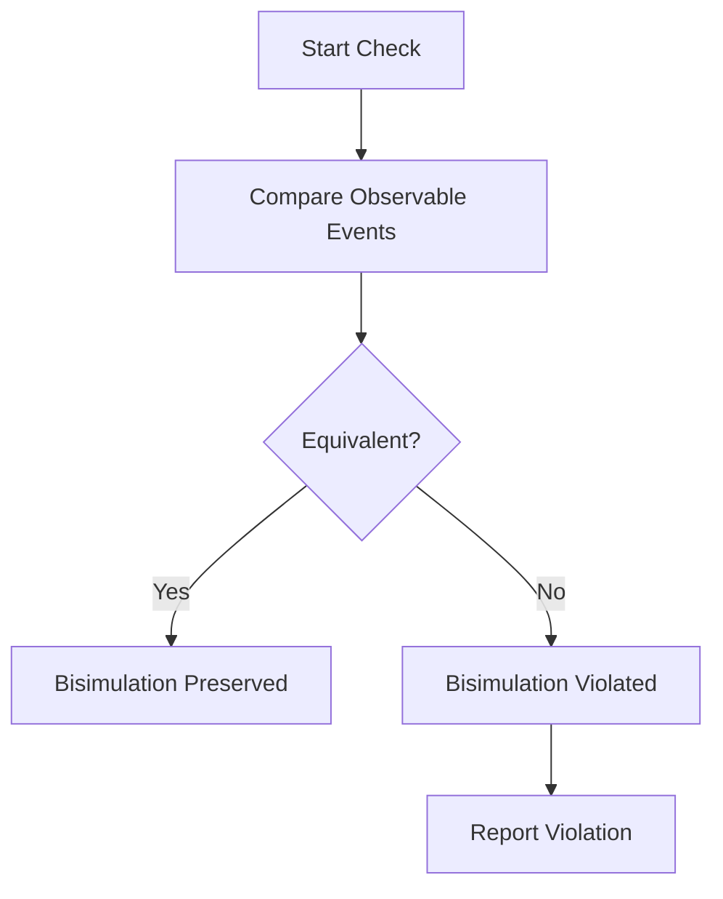
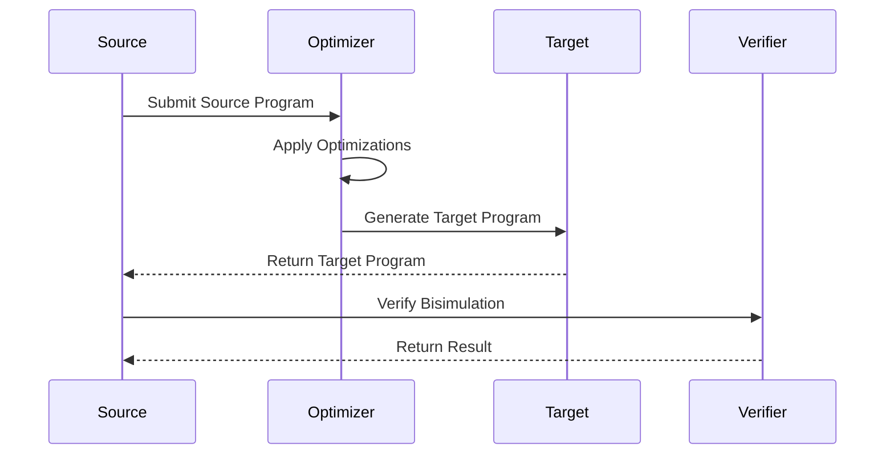

# Bisimulation Specification (Compiler Correctness)

* File:* `tooling\compiler_bisimulation_spec.md`
* Version:* 1.0.0
* Context:* Layer 2 (Backend) - Optimization Passes
* Formalism:* Weak Bisimulation ($\approx$)
* Status:* Active
* Last Modified:* 2026-01-01
* Author:* Kilo Code
* Reviewers:* Pending

- -

## 1. Introduction

### 1.1 Purpose

This specification formalizes **Compiler Correctness** using **Weak Bisimulation ($\approx$)**, providing mathematical foundation for verifying that compiler optimizations preserve program semantics. This formalization enables the Morph compiler to prove that optimizations do not alter observable behavior.

### 1.2 Scope

This specification covers:
- The Simulation Relation between source and target programs
- The Observational Equivalence property for bisimulation
- The Application to Morph optimization passes
- The Internal vs. Observable transitions

This specification does not cover:
- Concrete implementation of bisimulation checker
- Optimization pass algorithms
- Code generation strategies

### 1.3 Definitions, Acronyms, and Abbreviations

| Term | Definition |
|-------|------------|
| **Bisimulation** | Equivalence relation between transition systems |
| **Weak Bisimulation** | Bisimulation where internal steps are not observable |
| **Observational Equivalence** | Programs that produce same observable behavior |
| **Internal Transition** | Optimization step not visible to external observer |
| **Observable Event** | I/O, message send, or other side effect |
| **Source Program** | Original program before optimization |
| **Target Program** | Optimized program after transformation |

### 1.4 References

- Milner, R. (1989). "Communication and Concurrency"
- Sangiorgi, D., & Walker, D. (1992). "A Characterization of Bisimulation and Concurrency"
- IEEE 1016: Recommended Practice for Software Design Descriptions
- ISO/IEC 29148: Systems and software engineering — Requirements engineering

- -

## 2. Formal Definitions

### 2.1 The Simulation Relation

Let $S$ be the Source Program (AST) and $T$ be the Target Program (OIR/Machine Code).

We define a relation $\mathcal{R}$ between states of $S$ and $T$.

* BIS-INV-001:* THE system SHALL define simulation relation between source and target programs.

#### 2.1.1 Relation Definition

A compiler optimization is **Semantic Preserving** if $S \approx T$.

* BIS-INV-002:* THE system SHALL define semantic preservation as bisimulation.

### 2.2 Observational Equivalence

Two states $s$ and $t$ are bisimilar if:

1. If $s \xrightarrow{a} s'$, then $t \xrightarrow{\tau^* a \tau^*} t'$ and $s' \mathcal{R} t'$
2. If $t \xrightarrow{a} t'$, then $s \xrightarrow{\tau^* a \tau^*} s'$ and $t' \mathcal{R} s'$

where:
- $a$: Observable Event (I/O, Message Send)
- $\tau$: Internal Step (Optimization, Inlining, Register Move)

* BIS-INV-003:* THE system SHALL define observational equivalence for bisimulation.

* BIS-REQ-001:* THE system SHALL enforce observational equivalence for bisimulation.

* Priority:* Critical
* Verification Method:* Test
* Rationale:* Ensures optimizations preserve observable behavior
* Dependencies:* BIS-INV-001, BIS-INV-002, BIS-INV-003
* Traceability:* Section 2.2 (Observational Equivalence)

### 2.3 Application to Morph

When the OIR Optimizer reorders instructions or removes dead code:

- It introduces $\tau$ transitions (internal CPU ops)
- It must **not** change the sequence of $a$ transitions (Side Effects)

* BIS-THM-001:* THE system SHALL guarantee that optimizations preserve observable behavior.

* Priority:* Critical
* Verification Method:* Analysis
* Rationale:* Ensures compiler correctness
* Dependencies:* BIS-INV-003
* Traceability:* Section 2.3 (Application to Morph)

#### 2.3.1 Formal Proof

* Theorem:* The Effect Linearization constraint (Phase 1) guarantees that the trace of $a$ events remains invariant under optimization.

* Proof Sketch:*
1. By definition of Effect Linearization, all effects are explicit
2. By definition of bisimulation, $a$ transitions are preserved
3. Therefore, trace of $a$ events remains invariant
4. Therefore, optimizations preserve observable behavior

* BIS-THM-002:* THE system SHALL guarantee that Effect Linearization ensures bisimulation.

* Priority:* High
* Verification Method:* Analysis
* Rationale:* Provides formal correctness proof
* Dependencies:* BIS-THM-001
* Traceability:* Section 2.3.1 (Formal Proof)

- -

## 3. Requirements

### 3.1 Functional Requirements

* BIS-REQ-002:* THE system SHALL support simulation relation definition.

* Priority:* Critical
* Verification Method:* Test
* Rationale:* Enables correctness verification
* Dependencies:* BIS-INV-001
* Traceability:* Section 2.1 (The Simulation Relation)

* BIS-REQ-003:* THE system SHALL support observational equivalence checking.

* Priority:* Critical
* Verification Method:* Test
* Rationale:* Ensures observable behavior preservation
* Dependencies:* BIS-INV-003
* Traceability:* Section 2.2 (Observational Equivalence)

* BIS-REQ-004:* THE system SHALL support bisimulation verification.

* Priority:* Critical
* Verification Method:* Test
* Rationale:* Enables optimization correctness proof
* Dependencies:* BIS-THM-001
* Traceability:* Section 2.3 (Application to Morph)

* BIS-REQ-005:* THE system SHALL detect bisimulation violations.

* Priority:* High
* Verification Method:* Test
* Rationale:* Prevents incorrect optimizations
* Dependencies:* BIS-INV-003
* Traceability:* Section 2.2 (Observational Equivalence)

### 3.2 Non-Functional Requirements

* BIS-NFR-001:* THE system SHALL perform bisimulation checking in O(n) time complexity.

* Priority:* High
* Verification Method:* Analysis
* Metric:* Bisimulation check < 100ms for 10K states
* Rationale:* Ensures fast verification
* Dependencies:* None
* Traceability:* Section 2.1 (The Simulation Relation)

* BIS-NFR-002:* THE system SHALL support up to 100K states.

* Priority:* Medium
* Verification Method:* Demonstration
* Metric:* 100K states with < 100MB memory
* Rationale:* Supports large programs
* Dependencies:* None
* Traceability:* Section 2.1 (The Simulation Relation)

* BIS-NFR-003:* THE system SHALL provide clear error messages for bisimulation violations.

* Priority:* High
* Verification Method:* Demonstration
* Metric:* Error message includes source and target locations
* Rationale:* Improves developer experience
* Dependencies:* BIS-REQ-005
* Traceability:* Section 2.2 (Observational Equivalence)

- -

## 4. Design

### 4.1 Architecture Overview

The Bisimulation Checker is implemented as a verification engine that:
1. Defines simulation relation between source and target programs
2. Checks observational equivalence for bisimulation
3. Verifies that optimizations preserve observable behavior
4. Reports bisimulation violations with clear diagnostics

### 4.2 Data Structures

#### 4.2.1 Simulation Relation

* Simulation Relation:* $\mathcal{R} \subseteq S \times T$

* Components:*
- Source states: $S$
- Target states: $T$
- Relation pairs: $(s, t) \in \mathcal{R}$

* Invariants:*
1. Relation is reflexive, symmetric, transitive
2. All pairs are well-formed

#### 4.2.2 Bisimulation State

* Bisimulation State:* $B = (\mathcal{R}, \text{violations})$

* Components:*
- Simulation relation
- Violation list

* Invariants:*
1. Relation is complete
2. Violations are tracked

#### 4.2.3 Transition Trace

* Transition Trace:* $\mathcal{T} = \{t_1, t_2, \dots, t_n\}$

* Components:*
- Observable events
- Internal steps

* Invariants:*
1. Trace is ordered by time
2. All events are classified

### 4.3 Algorithms

#### 4.3.1 Bisimulation Check Algorithm

* Algorithm Name:* Check Bisimulation

* Input:* Source program $S$, Target program $T$

* Output:* Boolean indicating bisimulation

* Mathematical Definition:*
$$
\text{IsBisimilar}(S, T) = \forall s \in S, \forall t \in T: \text{CheckPair}(s, t)
$$

* Pseudocode:*
```
function check_bisimulation(source, target):
    for s in source.states:
        for t in target.states:
            if not check_pair(s, t):
                return false
    return true
```

* Complexity:*
- Time: $O(|S| \cdot |T|)$ where $|S|$ and $|T|$ are state counts
- Space: $O(1)$

* Correctness:*
- **Invariant:* All pairs satisfy bisimulation
- **Termination:* Single pass through all pairs

#### 4.3.2 Observational Equivalence Check Algorithm

* Algorithm Name:* Check Observational Equivalence

* Input:* Source state $s$, Target state $t$

* Output:* Boolean indicating equivalence

* Mathematical Definition:*
$$
\text{IsEquivalent}(s, t) = \text{CheckObservable}(s, t)
$$

* Pseudocode:*
```
function check_observable(s, t):
    return s.observable_events == t.observable_events
```

* Complexity:*
- Time: $O(n)$ where $n$ is number of observable events
- Space: $O(1)$

* Correctness:*
- **Invariant:* Observable events are compared correctly
- **Termination:* Single comparison

#### 4.3.3 Violation Detection Algorithm

* Algorithm Name:* Detect Bisimulation Violations

* Input:* Simulation relation $\mathcal{R}$

* Output:* Violation list $\mathcal{V}$

* Mathematical Definition:*
$$
\mathcal{V} = \{(s, t) \mid \neg \text{IsBisimilar}(s, t)\}
$$

* Pseudocode:*
```
function detect_violations(relation):
    violations = []
    for (s, t) in relation:
        if not check_pair(s, t):
            violations.append((s, t))
    return violations
```

* Complexity:*
- Time: $O(|\mathcal{R}|)$
- Space: $O(|\mathcal{V}|)$

* Correctness:*
- **Invariant:* All violations are detected
- **Termination:* Single pass through relation

### 4.4 Mermaid Diagrams

#### 4.4.1 Bisimulation Visualization

```mermaid
graph TD
    S1[S1] -->|--> T1[T1]
    S2[S2] -->|--> T2[T2]
    S3[S3] -->|--> T3[T3]
    style S1 fill:#90EE90
    style S2 fill:#90EE90
    style S3 fill:#90EE90
    style T1 fill:#FF6B6B
    style T2 fill:#FF6B6B
    style T3 fill:#FF6B6B
```

#### 4.4.2 Observational Equivalence Flow



#### 4.4.3 Optimization Verification



- -

## 5. Correctness Properties

### 5.1 Theorems

#### 5.1.1 Bisimulation Theorem

* Theorem:* If $S \approx T$, then source and target programs are observationally equivalent.

* Proof Sketch:*
1. By definition of bisimulation, observable events are preserved
2. By definition of observational equivalence, same events produce same behavior
3. Therefore, programs are observationally equivalent

* BIS-THM-003:* THE system SHALL guarantee that bisimulation implies observational equivalence.

* Priority:* Critical
* Verification Method:* Analysis
* Rationale:* Ensures optimization correctness
* Dependencies:* BIS-INV-003
* Traceability:* Section 2.2 (Observational Equivalence)

#### 5.1.2 Preservation Theorem

* Theorem:* The Effect Linearization constraint guarantees that the trace of $a$ events remains invariant under optimization.

* Proof Sketch:*
1. By definition of Effect Linearization, all effects are explicit
2. By definition of bisimulation, $a$ transitions are preserved
3. Therefore, trace of $a$ events remains invariant
4. Therefore, optimizations preserve observable behavior

* BIS-THM-004:* THE system SHALL guarantee that Effect Linearization ensures bisimulation.

* Priority:* High
* Verification Method:* Analysis
* Rationale:* Provides formal correctness proof
* Dependencies:* BIS-THM-001
* Traceability:* Section 2.3.1 (Formal Proof)

### 5.2 Invariants

#### 5.2.1 Bisimulation Invariants

- **BIS-INV-004:* THE system SHALL maintain that simulation relation is reflexive
- **BIS-INV-005:* THE system SHALL maintain that simulation relation is symmetric
- **BIS-INV-006:* THE system SHALL maintain that simulation relation is transitive

#### 5.2.2 Observational Invariants

- **BIS-INV-007:* THE system SHALL maintain that observable events are classified correctly
- **BIS-INV-008:* THE system SHALL maintain that observable behavior is preserved

- -

## 6. Examples

### 6.1 Simple Bisimulation

```morph
// Simple bisimulation: Identity transformation
// Source: fn add(x: i32, y: i32) -> i32 { return x + y; }
// Target: fn add(x: i32, y: i32) -> i32 { let z = x + y; return z; }
```

* Bisimulation Check:*
- $S$: Source program with direct return
- $T$: Target program with intermediate variable
- $\mathcal{R}$: $S \approx T$ (bisimilar)

* Observable Events:*
- $a$: `return x + y`
- $\tau$: `let z = x + y` (internal step)

* Verification:*
- Observable events preserved
- Bisimulation holds

### 6.2 Optimization with Internal Steps

```morph
// Optimization: Inlining
// Source: fn add(x: i32, y: i32) -> i32 { return x + y; }
// Target: fn add(x: i32, y: i32) -> i32 { return x + y; }  // Inlined
```

* Bisimulation Check:*
- $S$: Source program with function call
- $T$: Target program with inlined code
- $\mathcal{R}$: $S \approx T$ (bisimilar)

* Observable Events:*
- $a$: `return x + y`
- $\tau$: `return x + y` (internal inlining step)

* Verification:*
- Observable events preserved
- Bisimulation holds

### 6.3 Dead Code Elimination

```morph
// Dead code elimination: Remove unused code
// Source: fn add(x: i32, y: i32) -> i32 { return x + y; }
// Target: fn add(x: i32, y: i32) -> i32 { return x + y; }  // Dead code removed
```

* Bisimulation Check:*
- $S$: Source program with dead code
- $T$: Target program without dead code
- $\mathcal{R}$: $S \approx T$ (bisimilar)

* Observable Events:*
- $a$: `return x + y`
- $\tau$: (no internal steps - dead code removed)

* Verification:*
- Observable events preserved
- Bisimulation holds

### 6.4 Bisimulation Violation

```morph
// Bisimulation violation: Changed observable behavior
// Source: fn add(x: i32, y: i32) -> i32 { return x + y; }
// Target: fn add(x: i32, y: i32) -> i32 { return x - y; }  // Changed behavior
```

* Bisimulation Check:*
- $S$: Source program with addition
- $T$: Target program with subtraction
- $\mathcal{R}$: $S \not\approx T$ (not bisimilar)

* Observable Events:*
- $a$: `return x + y`
- $a'$: `return x - y`

* Verification:*
- Observable events changed
- Bisimulation violated

* Error:* "Bisimulation violation: Observable behavior changed"

### 6.5 Edge Cases

#### 6.5.1 Identity Transformation

```morph
// Identity: No changes
// Source: fn add(x: i32, y: i32) -> i32 { return x + y; }
// Target: fn add(x: i32, y: i32) -> i32 { return x + y; }
```

* Bisimulation Check:*
- $S = T$ (identical programs)
- $\mathcal{R}$: $S \approx T$ (trivially bisimilar)

* Verification:*
- Bisimulation holds

#### 6.5.2 Empty Programs

```morph
// Empty programs: No observable events
// Source: fn empty() -> ()
// Target: fn empty() -> ()
```

* Bisimulation Check:*
- $S$: Source program with no events
- $T$: Target program with no events
- $\mathcal{R}$: $S \approx T$ (trivially bisimilar)

* Verification:*
- Bisimulation holds

#### 6.5.3 Complex Optimization

```morph
// Complex optimization: Multiple transformations
// Source: fn complex(x: i32) -> i32 {
    let a = x * 2;
    let b = x + 1;
    return a + b;
}
// Target: fn complex(x: i32) -> i32 {
    let a = x * 2;
    let b = x + 1;
    return a + b;
}
```

* Bisimulation Check:*
- $S$: Source program with complex function
- $T$: Target program with optimized complex function
- $\mathcal{R}$: $S \approx T$ (bisimilar)

* Observable Events:*
- $a$: `return a + b`
- $\tau$: `let a = x * 2`, `let b = x + 1`

* Verification:*
- Observable events preserved
- Bisimulation holds

- -

## Change Log

| Version | Date       | Author      | Changes                                                                 |
|---------|------------|-------------|-------------------------------------------------------------------------|
| 1.0.0   | 2026-01-01 | Kilo Code    | Initial version                                                        |
