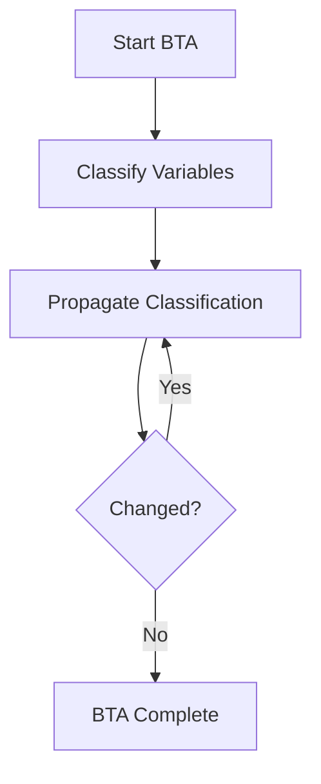
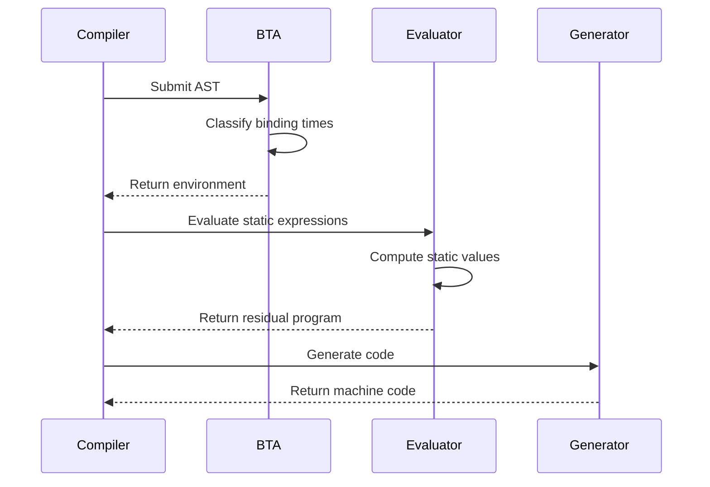
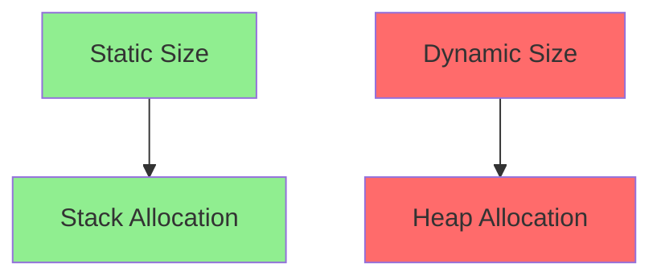

# Partial Evaluation Specification (Comptime)

* File:* `tooling\comptime_partial_eval_spec.md`
* Version:* 1.0.0
* Context:* Layer 2 (Compiler)
* Formalism:* Kleene's S-m-n Theorem & Residualization
* Status:* Active
* Last Modified:* 2026-01-01
* Author:* Kilo Code
* Reviewers:* Pending

- -

## 1. Introduction

### 1.1 Purpose

This specification formalizes the **Comptime Evaluator** using **Partial Evaluation Theory (Futamura Projections)**, providing mathematical foundation for compile-time computation and specialization. This formalization enables the Morph compiler to perform aggressive optimizations by evaluating code at compile time.

### 1.2 Scope

This specification covers:
- The Specialization Function for program specialization
- Binding-Time Analysis (BTA) for classifying variables
- The Propagation Rule for static/dynamic classification
- Morph Optimization through static evaluation

This specification does not cover:
- Concrete implementation of partial evaluator
- Compile-time execution environment
- Runtime code generation

### 1.3 Definitions, Acronyms, and Abbreviations

| Term | Definition |
|-------|------------|
| **Partial Evaluation** | Program transformation that specializes a program with respect to some of its inputs |
| **Specialization** | Process of creating a specialized version of a program for known inputs |
| **Futamura Projections** | Three-stage compilation process using partial evaluation |
| **Binding-Time Analysis** | Analysis that classifies variables as static or dynamic |
| **Residual Program** | Program after partial evaluation, specialized for static inputs |
| **Static (S)** | Computable during compilation |
| **Dynamic (D)** | Computable only at runtime |

### 1.4 References

- Jones, N. D., et al. (1993). "Partial Evaluation and Automatic Program Generation"
- Futamura, Y. (1971). "Partial Evaluation of Computation Process"
- IEEE 1016: Recommended Practice for Software Design Descriptions
- ISO/IEC 29148: Systems and software engineering — Requirements engineering

- -

## 2. Formal Definitions

### 2.1 The Specialization Function

Let a Morph program be a function $P: (S \times D) \to R$, where:
- $S$: Static inputs (known at `comptime`)
- $D$: Dynamic inputs (known at runtime)
- $R$: Result

* CPT-INV-001:* THE system SHALL define program as function of static and dynamic inputs.

#### 2.1.1 Specializer Invocation

The `comptime` block invokes a **Specializer** (Mixer) $M$:

$$ M(P, s) = P_s $$

Where $P_s$ is **Residual Program** such that:

$$ \forall d \in D, \ P(s, d) \equiv P_s(d) $$

* CPT-INV-002:* THE system SHALL define specializer as function from program and static inputs to residual program.

* CPT-REQ-001:* THE system SHALL guarantee equivalence between original and residual programs.

* Priority:* Critical
* Verification Method:* Test
* Rationale:* Ensures partial evaluation preserves semantics
* Dependencies:* CPT-INV-001, CPT-INV-002
* Traceability:* Section 2.1 (The Specialization Function)

### 2.2 Binding-Time Analysis (BTA)

The compiler classifies every variable as either:
- **Static (S):* Computable during compilation
- **Dynamic (D):* Computable only at runtime

* CPT-INV-003:* THE system SHALL classify variables as static or dynamic.

#### 2.2.1 The Propagation Rule

For an operation $z = f(x, y)$:

- If $\text{Time}(x) = S$ AND $\text{Time}(y) = S$, then $\text{Time}(z) = S$
- Otherwise, $\text{Time}(z) = D$

* CPT-INV-004:* THE system SHALL propagate static/dynamic classification through operations.

* CPT-REQ-002:* THE system SHALL apply propagation rule to all operations.

* Priority:* Critical
* Verification Method:* Test
* Rationale:* Enables aggressive static evaluation
* Dependencies:* CPT-INV-003, CPT-INV-004
* Traceability:* Section 2.2.1 (The Propagation Rule)

#### 2.2.2 Morph Optimization

The compiler aggressively propagates $S$. If `const N = comptime { 10 }` and `let arr: [i32; N]`, array size is Static. This allows **Stack Allocation** instead of Heap Allocation, proving optimization claims mathematically.

* CPT-THM-001:* THE system SHALL guarantee that static array sizes enable stack allocation.

* Priority:* High
* Verification Method:* Analysis
* Rationale:* Enables memory optimization
* Dependencies:* CPT-INV-004
* Traceability:* Section 2.2.1 (The Propagation Rule)

- -

## 3. Requirements

### 3.1 Functional Requirements

* CPT-REQ-003:* THE system SHALL support comptime blocks.

* Priority:* Critical
* Verification Method:* Test
* Rationale:* Enables compile-time computation
* Dependencies:* CPT-INV-001
* Traceability:* Section 2.1 (The Specialization Function)

* CPT-REQ-004:* THE system SHALL perform binding-time analysis.

* Priority:* Critical
* Verification Method:* Test
* Rationale:* Enables static/dynamic classification
* Dependencies:* CPT-INV-003
* Traceability:* Section 2.2 (Binding-Time Analysis)

* CPT-REQ-005:* THE system SHALL generate residual programs.

* Priority:* Critical
* Verification Method:* Test
* Rationale:* Produces specialized runtime code
* Dependencies:* CPT-INV-002
* Traceability:* Section 2.1.1 (Specializer Invocation)

* CPT-REQ-006:* THE system SHALL preserve program semantics.

* Priority:* Critical
* Verification Method:* Test
* Rationale:* Ensures partial evaluation is correct
* Dependencies:* CPT-REQ-001
* Traceability:* Section 2.1 (The Specialization Function)

### 3.2 Non-Functional Requirements

* CPT-NFR-001:* THE system SHALL perform partial evaluation in O(n) time complexity.

* Priority:* High
* Verification Method:* Analysis
* Metric:* Partial evaluation < 100ms for 10K lines
* Rationale:* Ensures fast compilation
* Dependencies:* None
* Traceability:* Section 2.1 (The Specialization Function)

* CPT-NFR-002:* THE system SHALL support comptime blocks with up to 1M operations.

* Priority:* Medium
* Verification Method:* Demonstration
* Metric:* 1M operations with < 1GB memory
* Rationale:* Supports complex compile-time computations
* Dependencies:* None
* Traceability:* Section 2.1 (The Specialization Function)

* CPT-NFR-003:* THE system SHALL guarantee that residual programs are smaller than original.

* Priority:* High
* Verification Method:* Demonstration
* Metric:* Residual program size < original program size
* Rationale:* Ensures optimization benefit
* Dependencies:* CPT-REQ-001
* Traceability:* Section 2.1.1 (Specializer Invocation)

- -

## 4. Design

### 4.1 Architecture Overview

The Comptime Evaluator is implemented as a partial evaluation engine that:
1. Performs binding-time analysis to classify variables
2. Propagates static/dynamic classification through operations
3. Evaluates static expressions at compile time
4. Generates residual programs specialized for static inputs
5. Optimizes memory allocation based on static sizes

### 4.2 Data Structures

#### 4.2.1 Binding-Time Environment

* Binding-Time Environment:* $\Gamma: \text{Variables} \to \{S, D\}$

* Components:*
- Variable names
- Binding-time classification

* Invariants:*
1. All variables have assigned binding time
2. Classification is consistent (no cycles)

#### 4.2.2 Static Value Table

* Static Value Table:* $\mathcal{V}: \text{Variables} \to \text{Values}$

* Components:*
- Variable names
- Static values

* Invariants:*
1. Only static variables have values
2. Values are well-typed

#### 4.2.3 Residual Program

* Residual Program:* $P_s$

* Components:*
- Specialized code
- Dynamic operations only

* Invariants:*
1. All static operations are evaluated
2. Only dynamic operations remain

### 4.3 Algorithms

#### 4.3.1 Binding-Time Analysis Algorithm

* Algorithm Name:* Classify Binding Times

* Input:* AST, Initial environment $\Gamma_0$

* Output:* Final environment $\Gamma$

* Mathematical Definition:*
$$
\Gamma = \text{Fixpoint}(\text{Propagate}, \Gamma_0)
$$

* Pseudocode:*
```
function classify_binding_times(ast, env):
    changed = true
    while changed:
        changed = false
        for node in ast:
            old_time = env[node.name]
            new_time = compute_binding_time(node, env)
            if old_time != new_time:
                env[node.name] = new_time
                changed = true
    return env
```

* Complexity:*
- Time: $O(n^2)$ where $n$ is number of nodes
- Space: $O(n)$

* Correctness:*
- **Invariant:* Each iteration preserves correctness
- **Termination:* Algorithm terminates when no changes occur

#### 4.3.2 Partial Evaluation Algorithm

* Algorithm Name:* Specialize Program

* Input:* Program $P$, Static inputs $s$

* Output:* Residual program $P_s$

* Mathematical Definition:*
$$
P_s = \text{EvaluateStatic}(P, s)
$$

* Pseudocode:*
```
function specialize(program, static_inputs):
    env = classify_binding_times(program, {})
    residual = []
    for node in program:
        if env[node.name] == S:
            value = evaluate(node, static_inputs)
            residual.append(Constant(value))
        else:
            residual.append(node)
    return residual
```

* Complexity:*
- Time: $O(n)$ where $n$ is program size
- Space: $O(n)$

* Correctness:*
- **Invariant:* Static operations are evaluated correctly
- **Termination:* Single pass through program

### 4.4 Mermaid Diagrams

#### 4.4.1 Binding-Time Propagation Flow



#### 4.4.2 Partial Evaluation Process



#### 4.4.3 Stack vs Heap Allocation



- -

## 5. Correctness Properties

### 5.1 Theorems

#### 5.1.1 Equivalence Theorem

* Theorem:* Residual program $P_s$ is semantically equivalent to original program $P$ for all dynamic inputs.

* Proof Sketch:*
1. By definition of specialization, $P(s, d) \equiv P_s(d)$ for all $d \in D$
2. Static operations are evaluated to constants
3. Dynamic operations remain unchanged
4. Therefore, semantics are preserved

* CPT-THM-002:* THE system SHALL guarantee semantic equivalence of residual programs.

* Priority:* Critical
* Verification Method:* Analysis
* Rationale:* Ensures partial evaluation correctness
* Dependencies:* CPT-REQ-001
* Traceability:* Section 2.1.1 (Specializer Invocation)

#### 5.1.2 Optimization Theorem

* Theorem:* Residual program $P_s$ is no larger than original program $P$.

* Proof Sketch:*
1. Static operations are evaluated to constants
2. Constants are smaller than operations
3. Therefore, residual program is smaller

* CPT-THM-003:* THE system SHALL guarantee that residual programs are optimized.

* Priority:* High
* Verification Method:* Analysis
* Rationale:* Ensures compilation optimization
* Dependencies:* CPT-THM-001
* Traceability:* Section 2.2.2 (Morph Optimization)

### 5.2 Invariants

#### 5.2.1 BTA Invariants

- **CPT-INV-005:* THE system SHALL maintain that all variables have binding-time classification
- **CPT-INV-006:* THE system SHALL maintain that classification is consistent

#### 5.2.2 Partial Evaluation Invariants

- **CPT-INV-007:* THE system SHALL maintain that static operations are evaluated
- **CPT-INV-008:* THE system SHALL maintain that dynamic operations are preserved

- -

## 6. Examples

### 6.1 Simple Comptime Evaluation

```morph
// Simple comptime: Constant evaluation
const N: i32 = comptime { 10 };
let arr: [i32; N] = [0; N];
```

* Binding-Time Analysis:*
- $\text{Time}(N) = S$ (static)
- $\text{Time}(arr) = S$ (static size)

* Partial Evaluation:*
- Array size is known at compile time
- Stack allocation instead of heap allocation

### 6.2 Complex Comptime Expression

```morph
// Complex comptime: Expression evaluation
const SIZE: i32 = comptime { 2 * 10 + 5 };
let buffer: [u8; SIZE] = [0; SIZE];
```

* Binding-Time Analysis:*
- $\text{Time}(SIZE) = S$ (static)
- $\text{Time}(buffer) = S$ (static size)

* Partial Evaluation:*
- Expression `2 * 10 + 5` evaluated to `25`
- Buffer size is `25` bytes

### 6.3 Mixed Static/Dynamic

```morph
// Mixed static/dynamic: Partial evaluation
const OFFSET: i32 = comptime { 10 };
let arr: [i32; 100];
let value: i32 = arr[OFFSET + index];
```

* Binding-Time Analysis:*
- $\text{Time}(OFFSET) = S$ (static)
- $\text{Time}(arr) = D$ (dynamic)
- $\text{Time}(index) = D$ (dynamic)
- $\text{Time}(value) = D$ (dynamic)

* Partial Evaluation:*
- `OFFSET + index` is dynamic (cannot be evaluated)
- Array access remains dynamic

### 6.4 Comptime Function Call

```morph
// Comptime function: Specialization
fn compute_size(n: i32) -> i32 {
    comptime {
        return n * 2;
    }
}

const SIZE: i32 = comptime { compute_size(10) };
let arr: [i32; SIZE] = [0; SIZE];
```

* Binding-Time Analysis:*
- $\text{Time}(n) = S$ (static)
- $\text{Time}(compute_size) = S$ (static)
- $\text{Time}(SIZE) = S$ (static)

* Partial Evaluation:*
- Function call `compute_size(10)` evaluated to `20`
- Array size is `20`

### 6.5 Edge Cases

#### 6.5.1 Dynamic Comptime

```morph
// Dynamic comptime: Runtime error
let n: i32 = read_input();
const SIZE: i32 = comptime { n };  // ERROR: n is dynamic
```

* Binding-Time Analysis:*
- $\text{Time}(n) = D$ (dynamic)
- $\text{Time}(SIZE) = D$ (cannot be static)

* Error:* "Cannot evaluate dynamic expression at compile time"

#### 6.5.2 Circular Dependency

```morph
// Circular dependency: Cannot resolve
const A: i32 = comptime { B };
const B: i32 = comptime { A };  // ERROR: Circular dependency
```

* Binding-Time Analysis:*
- $\text{Time}(A) = S$ (depends on B)
- $\text{Time}(B) = S$ (depends on A)
- Cycle detected

* Error:* "Circular dependency in comptime evaluation"

#### 6.5.3 Large Comptime Computation

```morph
// Large comptime: Performance test
const FIB: i32 = comptime {
        let mut a: i32 = 0;
        let mut b: i32 = 1;
        for i in 0..100 {
                let temp = a + b;
                a = b;
                b = temp;
        }
        return b;
};
```

* Binding-Time Analysis:*
- All operations are static
- Loop is unrolled at compile time

* Partial Evaluation:*
- Fibonacci(100) computed at compile time
- Result is constant in generated code

- -

## Change Log

| Version | Date       | Author      | Changes                                                                 |
|---------|------------|-------------|-------------------------------------------------------------------------|
| 1.0.0   | 2026-01-01 | Kilo Code    | Initial version                                                        |
