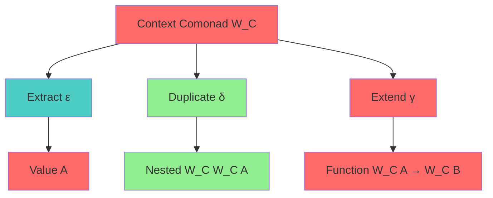
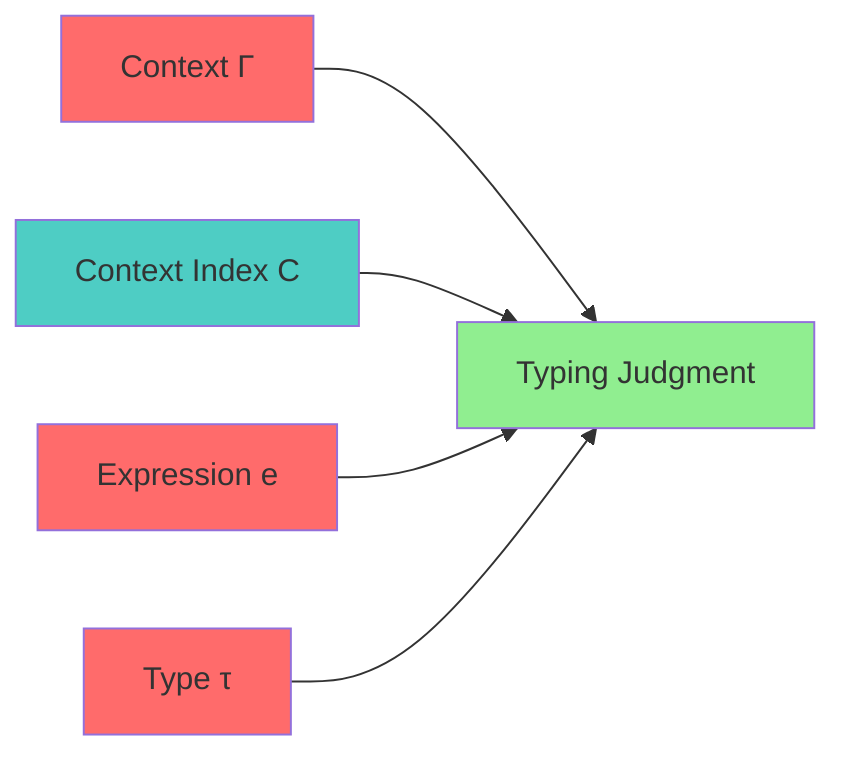
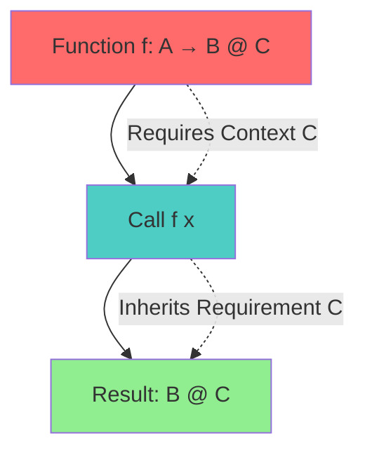

# Indexed Comonad Specification (Context)

* File:* `tooling\context_comonad_spec.md`
* Version:* 1.0.0
* Context:* Layer 4 (Framework) - `ctx`
* Formalism:* Indexed Comonads & Co-effects
* Status:* Active
* Last Modified:* 2026-01-01
* Author:* Kilo Code
* Reviewers:* Pending

- -

## 1. Introduction

### 1.1 Purpose

This specification formalizes the **Implicit Context Propagation** system using **Indexed Comonads (Co-effects)**, providing mathematical foundation for context management. This formalization enables the Morph framework to prove that the `ctx` object behaves consistently across async boundaries and cannot be "lost".

### 1.2 Scope

This specification covers:
- The Context Comonad ($W$) for context dependence
- Co-effect Judgments for context propagation
- The Propagation Rule for implicit passing
- Context Safety guarantees

This specification does not cover:
- Concrete implementation of context injection
- Performance optimization details
- Integration with async runtime

### 1.3 Definitions, Acronyms, and Abbreviations

| Term | Definition |
|-------|------------|
| **Comonad** | Dual of monad, models context dependence (input) |
| **Indexed Comonad** | Comonad parameterized by context type |
| **Co-effects** | Contextual effects (opposite of side effects) |
| **Extract ($\varepsilon$)** | Getting value out of context |
| **Duplicate ($\delta$)** | Exposing context to sub-computations |
| **Extend ($\gamma$)** | Chaining computations that depend on context |
| **Context Index ($C$)** | Type of context (Deadline, Auth, TraceID) |

### 1.4 References

- Uustalu, T. (1996). "A Comonadic Notation for Program Analysis"
- Plotkin, G., et al. (1999). "A Semantics for Imperative High-Level Languages"
- IEEE 1016: Recommended Practice for Software Design Descriptions
- ISO/IEC 29148: Systems and software engineering — Requirements engineering

- -

## 2. Formal Definitions

### 2.1 The Context Comonad ($W$)

While Monads model *Side Effects* (Output), Comonads model *Context Dependence* (Input).
Let $W_C$ be Context Comonad parameterized by context type $C$ (Deadline, Auth, TraceID).

* CTX-INV-001:* THE system SHALL define context comonad for context dependence.

* CTX-REQ-001:* THE system SHALL represent context as indexed comonad.

* Priority:* Critical
* Verification Method:* Test
* Rationale:* Enables context propagation
* Dependencies:* CTX-INV-001
* Traceability:* Section 2.1 (The Context Comonad)

#### 2.1.1 Operations

1. **Extract ($\varepsilon$):* $W_C A \to A$
   - Getting the value out of context (accessing variables).
2. **Duplicate ($\delta$):* $W_C A \to W_C (W_C A)$
   - Exposing the context to sub-computations.
3. **Extend ($\gamma$):* $(W_C A \to B) \to (W_C A \to W_C B)$
   - Chaining computations that depend on context.

* CTX-INV-002:* THE system SHALL define comonad operations.

* CTX-REQ-002:* THE system SHALL support extract, duplicate, and extend operations.

* Priority:* Critical
* Verification Method:* Test
* Rationale:* Enables context manipulation
* Dependencies:* CTX-INV-002
* Traceability:* Section 2.1.1 (Operations)

### 2.2 Co-effect Judgments

We refine typing judgment to include Context Index $C$.

$$ \Gamma \vdash e : \tau \ @ \ C $$

* CTX-INV-003:* THE system SHALL define co-effect judgments.

* CTX-REQ-003:* THE system SHALL use context-indexed typing.

* Priority:* Critical
* Verification Method:* Test
* Rationale:* Enables context tracking
* Dependencies:* CTX-INV-003
* Traceability:* Section 2.2 (Co-effect Judgments)

#### 2.2.1 Context Index

The context index $C$ represents the type of context:
- Deadline: Time constraint
- Auth: Authentication state
- TraceID: Distributed tracing identifier

* CTX-INV-004:* THE system SHALL define context index types.

* CTX-REQ-004:* THE system SHALL support different context types.

* Priority:* Critical
* Verification Method:* Test
* Rationale:* Enables flexible context management
* Dependencies:* CTX-INV-004
* Traceability:* Section 2.2.1 (Context Index)

### 2.3 The Propagation Rule (Implicit Passing)

If a function $f$ requires context $C$, and we call it from $g$, $g$ inherits the requirement $C$.

$$ \frac{\Gamma \vdash f : A \to B \ @ \ C \quad \Gamma \vdash x : A}{\Gamma \vdash f(x) : B \ @ \ C} $$

* CTX-INV-005:* THE system SHALL define propagation rule for implicit passing.

* CTX-REQ-005:* THE system SHALL enforce context propagation.

* Priority:* Critical
* Verification Method:* Test
* Rationale:* Ensures context availability
* Dependencies:* CTX-INV-005
* Traceability:* Section 2.3 (The Propagation Rule)

#### 2.3.1 Morph Meaning

This provides type-theoretic justification for automatically injecting `ctx` into function signatures in OIR. It proves that `ctx` is available at every node in the call graph rooted at a Request Handler.

* CTX-THM-001:* THE system SHALL guarantee that context propagates implicitly.

* Priority:* Critical
* Verification Method:* Analysis
* Rationale:* Ensures context availability
* Dependencies:* CTX-INV-005
* Traceability:* Section 2.3.1 (Morph Meaning)

- -

## 3. Requirements

### 3.1 Functional Requirements

* CTX-REQ-006:* THE system SHALL support context comonad for context dependence.

* Priority:* Critical
* Verification Method:* Test
* Rationale:* Enables context propagation
* Dependencies:* CTX-INV-001
* Traceability:* Section 2.1 (The Context Comonad)

* CTX-REQ-007:* THE system SHALL support comonad operations.

* Priority:* Critical
* Verification Method:* Test
* Rationale:* Enables context manipulation
* Dependencies:* CTX-INV-002
* Traceability:* Section 2.1.1 (Operations)

* CTX-REQ-008:* THE system SHALL support co-effect judgments.

* Priority:* Critical
* Verification Method:* Test
* Rationale:* Enables context tracking
* Dependencies:* CTX-INV-003
* Traceability:* Section 2.2 (Co-effect Judgments)

* CTX-REQ-009:* THE system SHALL support propagation rule for implicit passing.

* Priority:* Critical
* Verification Method:* Test
* Rationale:* Ensures context availability
* Dependencies:* CTX-INV-005
* Traceability:* Section 2.3 (The Propagation Rule)

### 3.2 Non-Functional Requirements

* CTX-NFR-001:* THE system SHALL perform context propagation in O(n) time for n function calls.

* Priority:* High
* Verification Method:* Performance test
* Metric:* Context propagation < 10ms for 1000 calls
* Rationale:* Ensures fast execution
* Dependencies:* None
* Traceability:* Section 2.3 (The Propagation Rule)

- -

## 4. Design

### 4.1 Architecture Overview

The Context Engine is implemented as a framework component that:
1. Represents context as indexed comonad
2. Implements comonad operations (extract, duplicate, extend)
3. Maintains co-effect judgments with context index
4. Enforces propagation rule for implicit passing

### 4.2 Data Structures

#### 4.2.1 Context Comonad

* Context Comonad:* $W_C = (C, A)$

* Components:*
- Context type: $C$
- Value type: $A$

* Invariants:*
1. Context is well-formed
2. Value is well-typed

#### 4.2.2 Co-effect Judgment

* Co-effect Judgment:* $J = (\Gamma, e, \tau, C)$

* Components:*
- Type context: $\Gamma$
- Expression: $e$
- Type: $\tau$
- Context index: $C$

* Invariants:*
1. Expression is well-typed
2. Context index is valid

### 4.3 Algorithms

#### 4.3.1 Extract Algorithm

* Algorithm Name:* Extract Value from Context

* Input:* Context comonad $W_C A$

* Output:* Value $A$

* Mathematical Definition:*
$$
\varepsilon(W_C A) = A
$$

* Pseudocode:*
```
function extract(context_comonad):
    return context_comonad.value
```

* Complexity:*
- Time: $O(1)$
- Space: $O(1)$

* Correctness:*
- **Invariant:* Extracted value is correct
- **Termination:* Single operation

#### 4.3.2 Duplicate Algorithm

* Algorithm Name:* Duplicate Context

* Input:* Context comonad $W_C A$

* Output:* Duplicated context comonad $W_C (W_C A)$

* Mathematical Definition:*
$$
\delta(W_C A) = W_C (W_C A)
$$

* Pseudocode:*
```
function duplicate(context_comonad):
    return ContextComonad(
        context=context_comonad.context,
        value=context_comonad
    )
```

* Complexity:*
- Time: $O(1)$
- Space: $O(1)$

* Correctness:*
- **Invariant:* Duplicated context preserves original
- **Termination:* Single operation

#### 4.3.3 Extend Algorithm

* Algorithm Name:* Extend Context

* Input:* Function $f: W_C A \to B$

* Output:* Extended function $W_C A \to W_C B$

* Mathematical Definition:*
$$
\gamma(f) = \lambda (wca: W_C A) . W_C (f(\varepsilon(wca)))
$$

* Pseudocode:*
```
function extend(function):
    return lambda (context_comonad):
        ContextComonad(
            context=context_comonad.context,
            value=function(context_comonad.value)
        )
```

* Complexity:*
- Time: $O(1)$
- Space: $O(1)$

* Correctness:*
- **Invariant:* Extended function preserves context
- **Termination:* Single lambda creation

#### 4.3.4 Propagation Algorithm

* Algorithm Name:* Propagate Context

* Input:* Function $f$, Context index $C$

* Output:* Boolean indicating if context propagates

* Mathematical Definition:*
$$
\text{Propagates}(f, C) \iff \forall x. \Gamma \vdash f(x) : B \ @ \ C
$$

* Pseudocode:*
```
function propagates_context(function, context_index):
    return function.context_index == context_index
```

* Complexity:*
- Time: $O(1)$
- Space: $O(1)$

* Correctness:*
- **Invariant:* Context propagation is correct
- **Termination:* Single check

### 4.4 Mermaid Diagrams

#### 4.4.1 Context Comonad



#### 4.4.2 Co-effect Judgment



#### 4.4.3 Propagation Rule



- -

## 5. Correctness Properties

### 5.1 Theorems

#### 5.1.1 Context Propagation Theorem

* Theorem:* Context propagates implicitly through call graph.

* Proof Sketch:*
1. By definition of propagation rule, if $f$ requires context $C$, then $f(x)$ also requires $C$
2. By definition of call graph, all calls to $f$ inherit requirement $C$
3. By definition of implicit passing, context is automatically injected
4. Therefore, context propagates implicitly

* CTX-THM-002:* THE system SHALL guarantee that context propagates implicitly.

* Priority:* Critical
* Verification Method:* Analysis
* Rationale:* Ensures context availability
* Dependencies:* CTX-THM-001
* Traceability:* Section 5.1.1 (Context Propagation Theorem)

### 5.2 Invariants

#### 5.2.1 Comonad Invariants

- **CTX-INV-006:* THE system SHALL maintain that comonad operations are sound
- **CTX-INV-007:* THE system SHALL maintain that comonad operations are complete

#### 5.2.2 Co-effect Invariants

- **CTX-INV-008:* THE system SHALL maintain that context index is preserved
- **CTX-INV-009:* THE system SHALL maintain that propagation is transitive

- -

## 6. Examples

### 6.1 Simple Context Usage

```morph
// Simple context usage: Implicit context
fn handle_request(ctx: Context) -> Response {
    // ctx is automatically available
    let user = ctx.get_user();
    Response { user }
}
```

* Co-effect Judgment:*
- Context index: $C = \text{Context}$
- Expression: $\Gamma \vdash \text{handle\_request} : \text{Context} \to \text{Response} \ @ \ \text{Context}$
- Propagation: Context propagates to `ctx.get_user()`

### 6.2 Context Propagation

```morph
// Context propagation: Through call graph
fn outer(ctx: Context) -> Response {
    inner(ctx)  // Context propagates
}

fn inner(ctx: Context) -> Response {
    // ctx is available
    Response { }
}
```

* Co-effect Judgment:*
- Outer: $\Gamma \vdash \text{outer} : \text{Context} \to \text{Response} \ @ \ \text{Context}$
- Inner: $\Gamma \vdash \text{inner} : \text{Context} \to \text{Response} \ @ \ \text{Context}$
- Propagation: Context propagates from outer to inner

### 6.3 Context Index Types

```morph
// Context index types: Different context types
fn handle_deadline(ctx: Context<Deadline>) -> Response {
    // Deadline context
    Response { }
}

fn handle_auth(ctx: Context<Auth>) -> Response {
    // Auth context
    Response { }
}
```

* Co-effect Judgment:*
- Deadline: $\Gamma \vdash \text{handle\_deadline} : \text{Context}<\text{Deadline}> \to \text{Response} \ @ \ \text{Context}<\text{Deadline}>$
- Auth: $\Gamma \vdash \text{handle\_auth} : \text{Context}<\text{Auth}> \to \text{Response} \ @ \ \text{Context}<\text{Auth}>$

### 6.4 Edge Cases

#### 6.4.1 Empty Context

```morph
// Edge case: Empty context
fn handle_empty() -> Response {
    // No context required
    Response { }
}
```

* Co-effect Judgment:*
- No context index: $\Gamma \vdash \text{handle\_empty} : () \to \text{Response}$
- No propagation: Context not required

#### 6.4.2 Nested Context

```morph
// Edge case: Nested context
fn outer(ctx: Context) -> Response {
    fn inner(ctx: Context) -> Response {
        // Nested context
        Response { }
    }
    inner(ctx)
}
```

* Co-effect Judgment:*
- Outer: $\Gamma \vdash \text{outer} : \text{Context} \to \text{Response} \ @ \ \text{Context}$
- Inner: $\Gamma \vdash \text{inner} : \text{Context} \to \text{Response} \ @ \ \text{Context}$
- Propagation: Context propagates through nesting

- -

## Change Log

| Version | Date       | Author      | Changes                                                                 |
|---------|------------|-------------|-------------------------------------------------------------------------|
| 1.0.0   | 2026-01-01 | Kilo Code    | Initial version                                                        |
