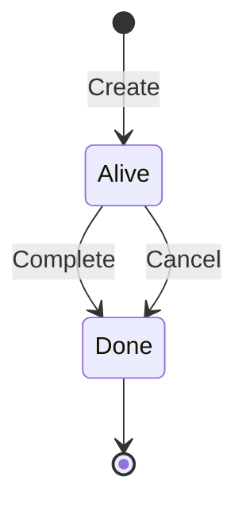
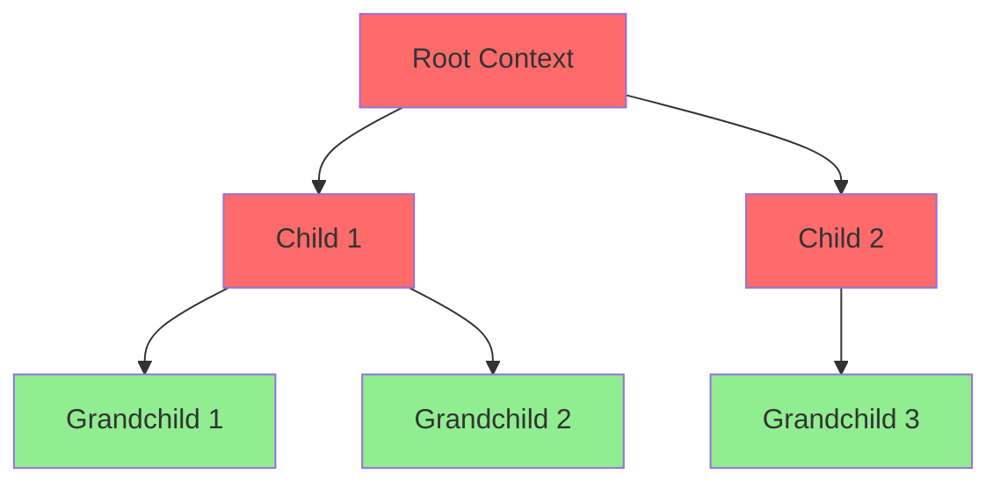
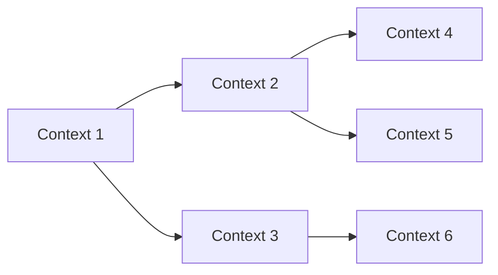

# Temporal Logic Specification (Context Lifecycle)

* File:* `tooling\context_temporal_logic_spec.md`
* Version:* 1.0.0
* Context:* Layer 4 (Framework) - `ctx`
* Formalism:* Linear Temporal Logic (LTL)
* Status:* Active
* Last Modified:* 2026-01-01
* Author:* Kilo Code
* Reviewers:* Pending

- -

## 1. Introduction

### 1.1 Purpose

This specification formalizes the **Context Lifecycle** using **Linear Temporal Logic (LTL)**, providing mathematical foundation for context management, cancellation propagation, and hierarchical task execution. This formalization enables the Morph runtime to guarantee liveness properties and prevent "zombie" tasks.

### 1.2 Scope

This specification covers:
- Context state machine definition
- LTL invariants for context lifecycle
- Hierarchical propagation guarantees
- Cancellation mechanisms
- Termination guarantees

This specification does not cover:
- Concrete implementation of context management
- Performance optimization details
- Thread scheduling algorithms

### 1.3 Definitions, Acronyms, and Abbreviations

| Term | Definition |
|-------|------------|
| **LTL** | Linear Temporal Logic - formalism for reasoning about time |
| **Context** | Execution context representing a task or computation |
| **Alive** | State indicating a task is running |
| **Done** | State indicating a task has completed or been cancelled |
| **Cancel** | Operation to terminate a context |
| **$\square$** | LTL operator meaning "Always" (globally) |
| **$\diamond$** | LTL operator meaning "Eventually" (future) |

### 1.4 References

- Pnueli, A. (1977). "The Temporal Logic of Programs"
- IEEE 1016: Recommended Practice for Software Design Descriptions
- ISO/IEC 29148: Systems and software engineering — Requirements engineering

- -

## 2. Formal Definitions

### 2.1 The Context State Machine

Let a Context $C$ be a state machine with boolean predicates:

* TL-INV-001:* THE system SHALL define Context as a state machine with Alive and Done predicates.

* TL-REQ-001:* THE system SHALL maintain Alive and Done predicates for each context.

* Priority:* Critical
* Verification Method:* Test
* Rationale:* Enables context lifecycle tracking
* Dependencies:* TL-INV-001
* Traceability:* Section 2.1 (The Context State Machine)

#### 2.1.1 State Predicates

- **Alive**: The task is running.
- **Done**: The task has completed or been cancelled.

* TL-INV-002:* THE system SHALL define Alive and Done as mutually exclusive states.

* TL-REQ-002:* THE system SHALL ensure Alive and Done are mutually exclusive.

* Priority:* Critical
* Verification Method:* Test
* Rationale:* Prevents ambiguous context states
* Dependencies:* TL-INV-001, TL-INV-002
* Traceability:* Section 2.1.1 (State Predicates)

### 2.2 LTL Invariants

The Morph Runtime enforces the following invariants using LTL syntax ($\square$ = "Always", $\diamond$ = "Eventually"):

* TL-INV-003:* THE system SHALL enforce LTL invariants for context lifecycle.

* TL-REQ-003:* THE system SHALL verify LTL invariants at runtime.

* Priority:* Critical
* Verification Method:* Runtime verification
* Rationale:* Ensures liveness and safety properties
* Dependencies:* TL-INV-003
* Traceability:* Section 2.2 (LTL Invariants)

#### 2.2.1 The Termination Guarantee

If a context is cancelled, it must eventually reach the Done state.

$$ \square (\text{Cancel}(C) \implies \diamond Done(C)) $$

* TL-THM-001:* THE system SHALL guarantee that cancelled contexts eventually reach Done state.

* Priority:* Critical
* Verification Method:* Analysis
* Rationale:* Prevents zombie tasks
* Dependencies:* TL-INV-003
* Traceability:* Section 2.2.1 (The Termination Guarantee)

#### 2.2.2 The Hierarchical Propagation

Let $C_p$ be a parent context and $C_c$ be a child context (spawned via `async let` or `spawn` using $C_p$).

If parent is Done, child must eventually be Done.

$$ \square (Done(C_p) \implies \diamond Done(C_c)) $$

* TL-THM-002:* THE system SHALL guarantee hierarchical propagation of Done state.

* Priority:* Critical
* Verification Method:* Analysis
* Rationale:* Ensures proper cleanup of child contexts
* Dependencies:* TL-INV-003
* Traceability:* Section 2.2.2 (The Hierarchical Propagation)

#### 2.2.3 Proof Mechanism

The Runtime keeps a specialized **Inverse Dependency Graph** of contexts. When $C_p$ signals cancellation, the runtime traverses the graph to signal all $C_c$, ensuring the LTL property holds. This mathematically prevents "orphaned" computations.

* TL-INV-004:* THE system SHALL maintain an Inverse Dependency Graph for contexts.

* TL-REQ-004:* THE system SHALL traverse Inverse Dependency Graph on cancellation.

* Priority:* Critical
* Verification Method:* Test
* Rationale:* Enables hierarchical cancellation propagation
* Dependencies:* TL-INV-004
* Traceability:* Section 2.2.3 (Proof Mechanism)

- -

## 3. Requirements

### 3.1 Functional Requirements

* TL-REQ-005:* THE system SHALL support context creation with Alive state.

* Priority:* Critical
* Verification Method:* Test
* Rationale:* Enables task execution
* Dependencies:* TL-INV-001
* Traceability:* Section 2.1 (The Context State Machine)

* TL-REQ-006:* THE system SHALL support context cancellation.

* Priority:* Critical
* Verification Method:* Test
* Rationale:* Enables task termination
* Dependencies:* TL-INV-003
* Traceability:* Section 2.2 (LTL Invariants)

* TL-REQ-007:* THE system SHALL support hierarchical context spawning.

* Priority:* High
* Verification Method:* Test
* Rationale:* Enables nested task execution
* Dependencies:* TL-INV-003
* Traceability:* Section 2.2.2 (The Hierarchical Propagation)

* TL-REQ-008:* THE system SHALL maintain Inverse Dependency Graph for contexts.

* Priority:* Critical
* Verification Method:* Test
* Rationale:* Enables cancellation propagation
* Dependencies:* TL-INV-004
* Traceability:* Section 2.2.3 (Proof Mechanism)

### 3.2 Non-Functional Requirements

* TL-NFR-001:* THE system SHALL guarantee termination of cancelled contexts within 1 second.

* Priority:* High
* Verification Method:* Performance test
* Metric:* Cancellation < 1s
* Rationale:* Ensures responsive cancellation
* Dependencies:* TL-THM-001
* Traceability:* Section 2.2.1 (The Termination Guarantee)

* TL-NFR-002:* THE system SHALL support up to 10,000 concurrent contexts.

* Priority:* Medium
* Verification Method:* Stress test
* Metric:* 10,000 contexts
* Rationale:* Supports large-scale applications
* Dependencies:* None
* Traceability:* Section 2.1 (The Context State Machine)

- -

## 4. Design

### 4.1 Architecture Overview

The Temporal Logic Engine is implemented as a runtime component that:
1. Tracks context state (Alive/Done)
2. Maintains Inverse Dependency Graph
3. Enforces LTL invariants
4. Propagates cancellation hierarchically
5. Guarantees termination

### 4.2 Data Structures

#### 4.2.1 Context State

* Context State:* $S = \{ \text{Alive}, \text{Done} \}$

* Components:*
- Context ID
- State predicate
- Parent context ID
- Child context IDs

* Invariants:*
1. State is either Alive or Done
2. Parent-child relationships form a tree

#### 4.2.2 Inverse Dependency Graph

* Inverse Dependency Graph:* $G = (V, E)$

* Components:*
- Vertices ($V$): Contexts
- Edges ($E$): Parent $\to$ Child relationships

* Invariants:*
1. Graph is a tree (no cycles)
2. Each node has at most one parent

### 4.3 Algorithms

#### 4.3.1 Cancellation Propagation Algorithm

* Algorithm Name:* Propagate Cancellation

* Input:* Context ID $C_p$ to cancel

* Output:* All descendant contexts cancelled

* Mathematical Definition:*
$$
\text{Cancel}(C_p) \implies \forall C_c \in \text{Descendants}(C_p), \text{Cancel}(C_c)
$$

* Pseudocode:*
```
function propagate_cancellation(context_id):
    queue = [context_id]
    while queue not empty:
        current = queue.pop()
        set_state(current, Done)
        for child in get_children(current):
            queue.push(child)
```

* Complexity:*
- Time: $O(n)$ where $n$ is number of descendants
- Space: $O(n)$ for queue

* Correctness:*
- **Invariant:* All descendants are cancelled
- **Termination:* Queue eventually empties

#### 4.3.2 LTL Verification Algorithm

* Algorithm Name:* Verify LTL Invariants

* Input:* Current state of all contexts

* Output:* Boolean indicating invariants hold

* Mathematical Definition:*
$$
\text{Verify}() = \square (\text{Cancel}(C) \implies \diamond Done(C)) \land \square (Done(C_p) \implies \diamond Done(C_c))
$$

* Pseudocode:*
```
function verify_ltl_invariants():
    for context in all_contexts:
        if context.state == Cancelled and context.state != Done:
            return False
        if context.state == Done:
            for child in context.children:
                if child.state != Done:
                    return False
    return True
```

* Complexity:*
- Time: $O(n)$ where $n$ is number of contexts
- Space: $O(1)$

* Correctness:*
- **Invariant:* LTL properties hold
- **Termination:* Single pass through all contexts

### 4.4 Mermaid Diagrams

#### 4.4.1 Context State Machine



#### 4.4.2 Hierarchical Cancellation



#### 4.4.3 Inverse Dependency Graph



- -

## 5. Correctness Properties

### 5.1 Theorems

#### 5.1.1 Termination Theorem

* Theorem:* All cancelled contexts eventually reach Done state.

* Proof Sketch:*
1. By definition of cancellation algorithm, all descendants are visited
2. By definition of state machine, visited contexts transition to Done
3. Since graph is finite and acyclic, algorithm terminates
4. Therefore, all cancelled contexts reach Done

* TL-THM-003:* THE system SHALL guarantee termination of cancelled contexts.

* Priority:* Critical
* Verification Method:* Analysis
* Rationale:* Prevents zombie tasks
* Dependencies:* TL-INV-003
* Traceability:* Section 5.1.1 (Termination Theorem)

#### 5.1.2 Hierarchical Propagation Theorem

* Theorem:* If parent is Done, all children eventually become Done.

* Proof Sketch:*
1. By LTL invariant: $\square (Done(C_p) \implies \diamond Done(C_c))$
2. By cancellation algorithm: parent Done triggers child cancellation
3. By termination theorem: cancelled children reach Done
4. Therefore, hierarchical propagation holds

* TL-THM-004:* THE system SHALL guarantee hierarchical propagation.

* Priority:* Critical
* Verification Method:* Analysis
* Rationale:* Ensures proper cleanup
* Dependencies:* TL-INV-003
* Traceability:* Section 5.1.2 (Hierarchical Propagation Theorem)

### 5.2 Invariants

#### 5.2.1 State Invariants

- **TL-INV-005:* THE system SHALL maintain that Alive and Done are mutually exclusive
- **TL-INV-006:* THE system SHALL maintain that Inverse Dependency Graph is a tree

#### 5.2.2 LTL Invariants

- **TL-INV-007:* THE system SHALL maintain that cancelled contexts eventually reach Done
- **TL-INV-008:* THE system SHALL maintain that Done parents imply Done children

- -

## 6. Examples

### 6.1 Simple Context Lifecycle

```morph
// Simple context: Create and complete
act {
    // Context is Alive
    let result = compute();
    // Context transitions to Done
}
```

* LTL Verification:*
- $\text{Alive}(C) \land \text{Complete}(C) \implies \text{Done}(C)$
- $\square (\text{Complete}(C) \implies \diamond Done(C))$

### 6.2 Hierarchical Context Spawning

```morph
// Hierarchical contexts: Parent spawns children
act {
    // Parent context
    async let child1 = task1();
    async let child2 = task2();

    // Wait for children
    await child1;
    await child2;

    // Parent Done implies children Done
}
```

* LTL Verification:*
- $\square (\text{Done}(C_p) \implies \diamond Done(C_c))$

### 6.3 Cancellation Propagation

```morph
// Cancellation: Parent cancelled propagates to children
act {
    async let child = long_running_task();

    // Cancel parent
    cancel();

    // Child automatically cancelled
}
```

* LTL Verification:*
- $\square (\text{Cancel}(C_p) \implies \diamond Done(C_p))$
- $\square (\text{Cancel}(C_p) \implies \diamond Done(C_c))$

### 6.4 Edge Cases

#### 6.4.1 Orphaned Context

```morph
// Edge case: Attempt to create orphaned context
act {
    // This should be prevented by LTL invariant
    // Orphaned contexts violate hierarchical propagation
}
```

* LTL Verification:*
- $\neg \exists C_c, \neg \exists C_p, \text{Child}(C_c, C_p)$

#### 6.4.2 Zombie Task

```morph
// Edge case: Zombie task prevention
act {
    async let child = task();

    // Parent completes without waiting
    // LTL invariant ensures child eventually Done
}
```

* LTL Verification:*
- $\square (\text{Done}(C_p) \implies \diamond Done(C_c))$

- -

## Change Log

| Version | Date       | Author      | Changes                                                                 |
|---------|------------|-------------|-------------------------------------------------------------------------|
| 1.0.0   | 2026-01-01 | Kilo Code    | Initial version                                                        |
