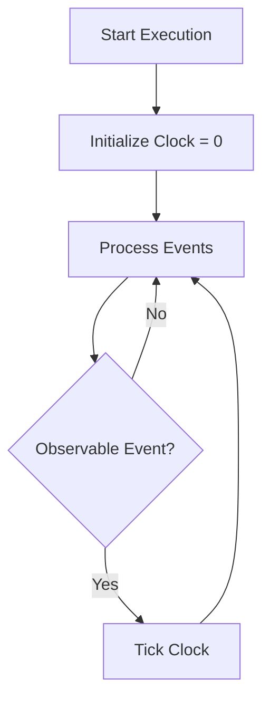
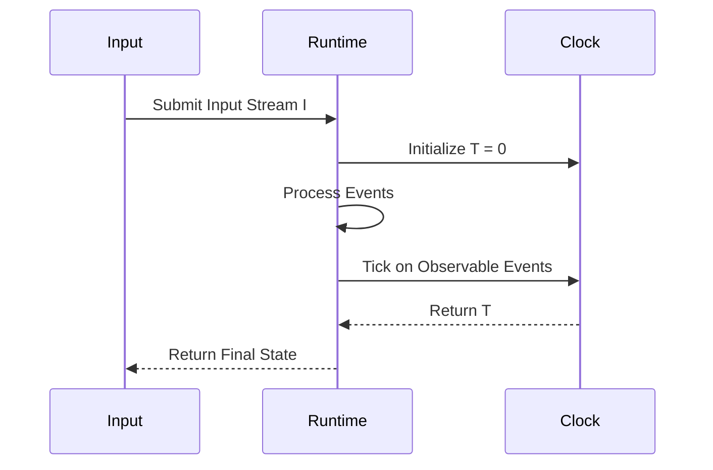
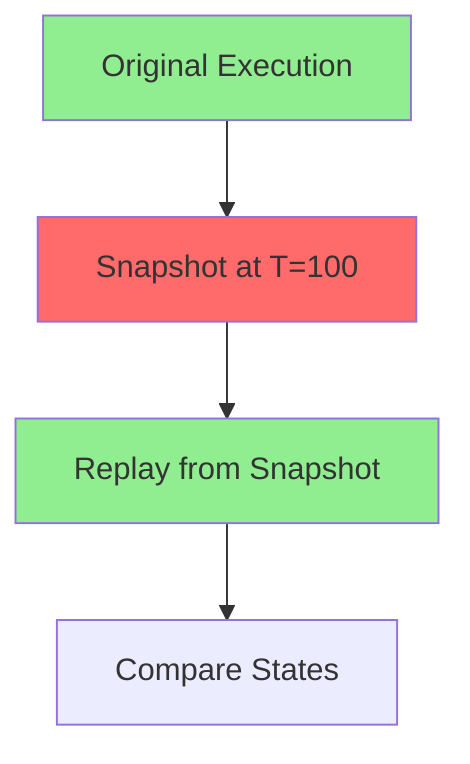

# Deterministic Time Specification

* File:* `tooling\deterministic_time_spec.md`
* Version:* 2.0.0
* Context:* Layer 3 (Runtime) - Scheduler
* Formalism:* Lamport Timestamps & Logical Clocks
* Status:* Active
* Last Modified:* 2026-01-03
* Author:* Kilo Code
* Reviewers:* Pending

- -

## 1. Introduction

### 1.1 Purpose

This specification formalizes the **Deterministic Time System** using **Lamport Timestamps & Logical Clocks**, providing mathematical foundation for reproducible execution and time travel debugging. This formalization enables the Morph runtime to execute programs deterministically without relying on wall clock time.

**IMPORTANT:* Deterministic time is a **debug-only feature**. Production builds use randomized scheduling for performance. Deterministic mode is explicitly for debugging and testing purposes only.

### 1.2 Scope

This specification covers:
- The Logical Clock for monotonic time tracking
- The Tick Rule for observable events
- The Deterministic Simulation property
- The Time Travel Debugging capability
- Debug-only mode flag and performance implications

This specification does not cover:
- Concrete implementation of logical clock
- Event scheduling algorithms
- Time synchronization protocols
- Production scheduling algorithms (see scheduler_randomized_stealing_spec.md)

### 1.3 Definitions, Acronyms, and Abbreviations

| Term | Definition |
|-------|------------|
| **Logical Clock** | Monotonic counter that increments on observable events |
| **Lamport Timestamp** | Logical timestamp for distributed systems |
| **Observable Event** | Event that causes clock to tick (message receipt, I/O, preemption) |
| **Deterministic Simulation** | Property that same input produces same state across runs |
| **Time Travel Debugging** | Ability to replay execution from any point in time |
| **Wall Clock Time** | Physical time (Unix timestamp) - not used for determinism |
| **Debug Mode** | Runtime mode that enables deterministic time for debugging |
| **Production Mode** | Runtime mode that uses randomized scheduling for performance |

### 1.4 References

- Lamport, L. (1978). "Time, Clocks, and the Ordering of Events in a Distributed System"
- Mattern, F. (1988). "Virtual Time, Global States of a Distributed System"
- IEEE 1016: Recommended Practice for Software Design Descriptions
- ISO/IEC 29148: Systems and software engineering — Requirements engineering

- -

## 2. Formal Definitions

### 2.1 The Logical Clock

To ensure replayability (Time Travel Debugging), Runtime does not use Wall Clock Time (Unix Timestamp). It uses a **Logical Monotonic Clock**.

$$ T_{logical} : \mathbb{N} $$

* DTM-INV-001:* THE system SHALL define logical clock as natural number.

#### 2.1.1 The Tick Rule

The Clock $T$ increments only on **Observable Events**:

1. Message Receipt
2. Input IO (MCIE packet)
3. Preemption Yield

* DTM-INV-002:* THE system SHALL define tick rule for observable events.

* DTM-REQ-001:* THE system SHALL increment clock only on observable events.

* Priority:* Critical
* Verification Method:* Test
* Rationale:* Ensures deterministic time progression
* Dependencies:* DTM-INV-001, DTM-INV-002
* Traceability:* Section 2.1 (The Logical Clock)

### 2.2 Deterministic Simulation

If we execute program twice with the same Input Stream $I$:

$$ \text{State}(T) \text{ is invariant across runs.} $$

This effectively proves that race conditions arising from "System Time" variations are impossible in Morph logic blocks.

* DTM-THM-001:* THE system SHALL guarantee deterministic simulation for same input stream.

* Priority:* Critical
* Verification Method:* Analysis
* Rationale:* Ensures reproducibility
* Dependencies:* DTM-INV-001, DTM-INV-002
* Traceability:* Section 2.2 (Deterministic Simulation)

- -

## 3. Requirements

### 3.1 Functional Requirements

* DTM-REQ-002:* THE system SHALL support logical clock initialization.

* Priority:* Critical
* Verification Method:* Test
* Rationale:* Enables deterministic execution
* Dependencies:* DTM-INV-001
* Traceability:* Section 2.1 (The Logical Clock)

* DTM-REQ-003:* THE system SHALL support clock ticks on observable events.

* Priority:* Critical
* Verification Method:* Test
* Rationale:* Ensures time progression
* Dependencies:* DTM-INV-002
* Traceability:* Section 2.1.1 (The Tick Rule)

* DTM-REQ-004:* THE system SHALL support time travel debugging.

* Priority:* High
* Verification Method:* Test
* Rationale:* Enables replay from any point
* Dependencies:* DTM-THM-001
* Traceability:* Section 2.2 (Deterministic Simulation)

* DTM-REQ-005:* THE system SHALL support state snapshot and restoration.

* Priority:* High
* Verification Method:* Test
* Rationale:* Enables time travel debugging
* Dependencies:* DTM-THM-001
* Traceability:* Section 2.2 (Deterministic Simulation)

### 3.2 Non-Functional Requirements

* DTM-NFR-001:* THE system SHALL perform clock ticks in O(1) time complexity.

* Priority:* High
* Verification Method:* Analysis
* Metric:* Clock tick < 1μs
* Rationale:* Ensures fast execution
* Dependencies:* None
* Traceability:* Section 2.1.1 (The Tick Rule)

* DTM-NFR-002:* THE system SHALL support up to 1M clock ticks.

* Priority:* Medium
* Verification Method:* Demonstration
* Metric:* 1M ticks with < 10MB memory
* Rationale:* Supports long-running programs
* Dependencies:* None
* Traceability:* Section 2.1 (The Logical Clock)

* DTM-NFR-003:* THE system SHALL guarantee that logical clock never overflows.

* Priority:* High
* Verification Method:* Analysis
* Metric:* Clock value < 2^63
* Rationale:* Ensures long-running execution
* Dependencies:* DTM-INV-001
* Traceability:* Section 2.1 (The Logical Clock)

- -

## 4. Design

### 4.1 Architecture Overview

The Deterministic Time System is implemented as a logical clock that:
1. Initializes to zero at program start
2. Increments only on observable events
3. Provides deterministic time progression
4. Supports time travel debugging through state snapshots
5. Guarantees reproducibility across runs

**Mode Selection:*
- **Debug Mode:* Enabled via `--debug-deterministic` flag. Uses logical clock for reproducible execution. Performance penalty: 2-5x slower than production mode.
- **Production Mode:* Default mode. Uses randomized work-stealing scheduler (see scheduler_randomized_stealing_spec.md). No deterministic time guarantees. Optimal performance.

**Performance Trade-offs:*
| Mode | Determinism | Performance | Use Case |
|------|-------------|-------------|----------|
| Debug | Yes | 2-5x slower | Debugging, testing, reproducible bugs |
| Production | No | Optimal | Production deployment, high performance |

### 4.2 Data Structures

#### 4.2.1 Logical Clock

* Logical Clock:* $T: \mathbb{N}$

* Components:*
- Current tick count
- Maximum tick count (for overflow detection)

* Invariants:*
1. Clock is monotonic (never decreases)
2. Clock is bounded (never overflows)

#### 4.2.2 Event Queue

* Event Queue:* $Q = \{e_1, e_2, \dots, e_n\}$

* Components:*
- Observable events
- Event timestamps

* Invariants:*
1. Events are ordered by timestamp
2. All events are observable

#### 4.2.3 State Snapshot

* State Snapshot:* $S = (T, \text{Memory}, \text{Registers})$

* Components:*
- Logical clock value
- Memory state
- Register values

* Invariants:*
1. Snapshot is complete
2. Snapshot is consistent

### 4.3 Algorithms

#### 4.3.1 Clock Tick Algorithm

* Algorithm Name:* Increment Logical Clock

* Input:* Current clock $T$

* Output:* New clock $T'$

* Mathematical Definition:*
$$
T' = T + 1
$$

* Pseudocode:*
```
function tick_clock(clock):
    return clock + 1
```

* Complexity:*
- Time: $O(1)$
- Space: $O(1)$

* Correctness:*
- **Invariant:* Clock is monotonic
- **Termination:* Single increment

#### 4.3.2 Deterministic Simulation Algorithm

* Algorithm Name:* Execute Program Deterministically

* Input:* Input stream $I$, Program $P$

* Output:* Final state $S_f$

* Mathematical Definition:*
$$
S_f = \text{Execute}(P, I)
$$

* Pseudocode:*
```
function execute_deterministic(program, input_stream):
    clock = 0
    state = initial_state()
    for event in input_stream:
        state = process_event(state, event)
        clock = tick_clock(clock)
    return (clock, state)
```

* Complexity:*
- Time: $O(n)$ where $n$ is number of events
- Space: $O(m)$ where $m$ is state size

* Correctness:*
- **Invariant:* Same input produces same state
- **Termination:* Single pass through events

#### 4.3.3 Time Travel Debugging Algorithm

* Algorithm Name:* Replay from Snapshot

* Input:* Snapshot $S_{snapshot}$, Input stream $I_{replay}$

* Output:* Final state $S_{replay}$

* Mathematical Definition:*
$$
S_{replay} = \text{Replay}(S_{snapshot}, I_{replay})
$$

* Pseudocode:*
```
function replay_from_snapshot(snapshot, replay_stream):
    restore_state(snapshot)
    clock = snapshot.clock
    for event in replay_stream:
        state = process_event(state, event)
        clock = tick_clock(clock)
    return (clock, state)
```

* Complexity:*
- Time: $O(n)$ where $n$ is number of events
- Space: $O(m)$ where $m$ is state size

* Correctness:*
- **Invariant:* Replay produces same state as original execution
- **Termination:* Single pass through events

### 4.4 Mermaid Diagrams

#### 4.4.1 Logical Clock Flow



#### 4.4.2 Deterministic Execution



#### 4.4.3 Time Travel Debugging



- -

## 5. Correctness Properties

### 5.1 Theorems

#### 5.1.1 Monotonicity Theorem

* Theorem:* Logical clock is monotonic (never decreases).

* Proof Sketch:*
1. By definition of tick rule, clock only increments
2. Therefore, clock never decreases
3. Therefore, clock is monotonic

* DTM-THM-002:* THE system SHALL guarantee that logical clock is monotonic.

* Priority:* Critical
* Verification Method:* Analysis
* Rationale:* Ensures deterministic time progression
* Dependencies:* DTM-INV-001, DTM-INV-002
* Traceability:* Section 2.1 (The Logical Clock)

#### 5.1.2 Determinism Theorem

* Theorem:* Same input stream produces same state across runs.

* Proof Sketch:*
1. By definition of deterministic simulation, state is function of input
2. By definition of logical clock, time progression is deterministic
3. Therefore, same input produces same state

* DTM-THM-003:* THE system SHALL guarantee deterministic simulation.

* Priority:* Critical
* Verification Method:* Analysis
* Rationale:* Ensures reproducibility
* Dependencies:* DTM-THM-001
* Traceability:* Section 2.2 (Deterministic Simulation)

### 5.2 Invariants

#### 5.2.1 Clock Invariants

- **DTM-INV-003:* THE system SHALL maintain that logical clock is monotonic
- **DTM-INV-004:* THE system SHALL maintain that logical clock is bounded

#### 5.2.2 Simulation Invariants

- **DTM-INV-005:* THE system SHALL maintain that state is deterministic
- **DTM-INV-006:* THE system SHALL maintain that same input produces same state

- -

## 6. Examples

### 6.1 Simple Execution

```morph
// Simple execution: Sequential events
act {
    state count: i32 = 0;

    view() {
        return "Count: " + count;
    }

    on increment {
        count = count + 1;
    }
}
```

* Input Stream:*
- $I = \{e_1, e_2, e_3\}$ where each $e_i$ is an `increment` event

* Logical Clock:*
- $T_0 = 0$
- $T_1 = 1$ (after $e_1$)
- $T_2 = 2$ (after $e_2$)
- $T_3 = 3$ (after $e_3$)

* State Evolution:*
- $S_0 = (\text{count} = 0)$
- $S_1 = (\text{count} = 1)$
- $S_2 = (\text{count} = 2)$
- $S_3 = (\text{count} = 3)$

### 6.2 Deterministic Simulation

```morph
// Deterministic simulation: Same input, same output
// Run 1: Input = [1, 2, 3]
// Run 2: Input = [1, 2, 3]
// Both produce: count = 6
```

* Run 1:*
- $I_1 = \{e_1, e_2, e_3\}$
- $S_{f,1} = (\text{count} = 6)$

* Run 2:*
- $I_2 = \{e_1, e_2, e_3\}$
- $S_{f,2} = (\text{count} = 6)$

* Determinism:*
- $S_{f,1} = S_{f,2}$ (same state)

### 6.3 Time Travel Debugging

```morph
// Time travel debugging: Replay from snapshot
act {
    state count: i32 = 0;

    view() {
        return "Count: " + count;
    }

    on increment {
        count = count + 1;
    }
}
```

* Original Execution:*
- Input: $I = \{e_1, e_2, e_3\}$
- Snapshot at $T = 3$: $S_{snapshot} = (\text{count} = 3)$

* Replay from Snapshot:*
- Input: $I_{replay} = \{e_1, e_2\}$ (events after snapshot)
- Final state: $S_{replay} = (\text{count} = 5)$

* Verification:*
- Replay produces expected state

### 6.4 Multiple Events

```morph
// Multiple events: Concurrent events
act {
    state count: i32 = 0;

    view() {
        return "Count: " + count;
    }

    on increment1 {
        count = count + 1;
    }

    on increment2 {
        count = count + 1;
    }
}
```

* Input Stream:*
- $I = \{e_1, e_2, e_3, e_4\}$ where $e_1, e_2$ are `increment1`, `increment2` and $e_3, e_4$ are `increment1`, `increment2`

* Logical Clock:*
- $T_0 = 0$
- $T_1 = 1$ (after $e_1$)
- $T_2 = 2$ (after $e_2$)
- $T_3 = 3$ (after $e_3$)
- $T_4 = 4$ (after $e_4$)

* State Evolution:*
- $S_0 = (\text{count} = 0)$
- $S_1 = (\text{count} = 1)$
- $S_2 = (\text{count} = 2)$
- $S_3 = (\text{count} = 3)$
- $S_4 = (\text{count} = 4)$

### 6.5 Edge Cases

#### 6.5.1 Empty Input

```morph
// Empty input: No events
act {
    state count: i32 = 0;

    view() {
        return "Count: " + count;
    }
}
```

* Input Stream:*
- $I = \emptyset$

* Logical Clock:*
- $T = 0$ (no ticks)

* State:*
- $S = (\text{count} = 0)$

#### 6.5.2 Clock Overflow

```morph
// Clock overflow: Maximum tick count
// Assume 64-bit clock: max = 2^63 - 1
```

* Logical Clock:*
- $T_{max} = 2^{63} - 1$

* Overflow Detection:*
- If $T = T_{max}$, next tick causes overflow

* Error:* "Logical clock overflow"

#### 6.5.3 Non-Deterministic Events

```morph
// Non-deterministic: Random events (should not happen)
act {
    state count: i32 = 0;

    view() {
        return "Count: " + count;
    }

    on random {
        count = random();  // Non-deterministic
    }
}
```

* Determinism Violation:*
- Same input produces different states
- Logical clock still ticks (but state varies)

* Note:* Morph should prevent non-deterministic events

- -

## Change Log

| Version | Date       | Author      | Changes                                                                 |
|---------|------------|-------------|-------------------------------------------------------------------------|
| 2.0.0   | 2026-01-03 | Kilo Code    | Clarified debug-only nature of deterministic time; added mode selection and performance trade-offs; resolved contradiction C-003 |
| 1.0.0   | 2026-01-01 | Kilo Code    | Initial version                                                        |
